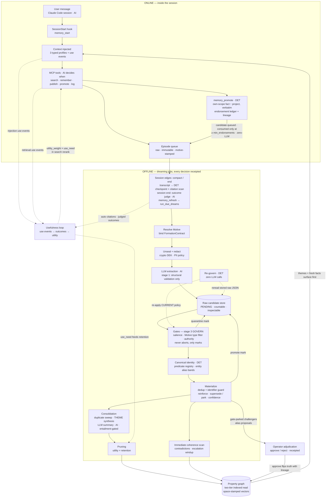

# Memotron Dataflow

How one user message becomes durable, governed, useful memory — and how that memory
flows back into the next message. This document traces the full path, marks exactly
where AI lives, separates online from offline processing, and explains how Motives
steer every stage.

**Legend used throughout:**

- **[ONLINE]** — runs inside the interactive session, latency-sensitive, milliseconds matter.
- **[OFFLINE]** — runs as a dreaming job at session edges, out of the conversational hot path.
- **[AI]** — an LLM call or agent judgment; non-deterministic, contract-bound, receipted.
- **[DET]** — deterministic and replayable; receipted math, no model in the loop.



---

## 1. The dataflow, stage by stage

### Stage 0 — Adoption (once)

`memotron init` writes `.memotron.yaml`, `.mcp.json`, and installs four
lifecycle hooks in `.claude/settings.json`: `SessionStart`, `PreCompact`,
`PostCompact`, `SessionEnd` (`_install_claude_hooks` in
[src/memotron/adoption.py](src/memotron/adoption.py)). This is what turns
"user types a message in Claude Code" into a memory event stream.

### Stage 1 — Session start: retrieval before anything else [ONLINE] [DET]

The `SessionStart` hook runs `memotron hook session-start` → `memory_start`
([src/memotron/agent_memory.py](src/memotron/agent_memory.py)). It builds
**three typed profiles** — project scope (800-token budget), user scope (¾ of the
agent budget), agent scope (the remainder) — via `Memotron.profile()`
([src/memotron/client.py](src/memotron/client.py)) and prints the rendered
block into the agent's context window, plus usage guidance (`_run_hook` in
[src/memotron/cli.py](src/memotron/cli.py)).

Two things matter here:

- **The read is the two-tier indexed read.** SQLite generated columns
  (`gen_scope_key`, `gen_status`, `gen_context_visible`) with a composite index
  ([src/memotron/graph.py](src/memotron/graph.py)) mean the default read
  returns only context-visible rows — THEMEs and non-demoted facts. Demoted
  members stay invisible by default but reachable via `memory_evidence`; budget
  overflow renders as just-in-time reference lines instead of being dropped.
- **Every injected fact is instrumented.** `_record_profile_injections` writes a
  use event per fact under the session's `task_run_id` — the opening of the
  usefulness loop.
- **Pins and per-memory visibility govern the read** (WS-20/19). Pinned rows
  enter the profile *before* the score-ranked fill — bypassing per-type caps,
  consuming the token budget first in deterministic `(created_at, uuid)` order,
  `[PINNED]`-prefixed, and degrading to `[REF:…]` lines rather than dropping
  when even the pins overflow the budget — and the type floor is policy, not a
  constant (`ProfilePolicy.floor_types` / `floor_share`; directive is floored
  by default alongside identity and requirement). A row carrying a
  `visibility_agents` allowlist renders only for listed readers: `memory_start`
  passes the calling agent as `reader_agent_id`, enforcement is fail-closed for
  agents and open for the operator/SDK-owner context (`None`) — see §5.
- **A post-compaction start rehydrates from its own dying checkpoint** (WS-28
  T1). `memotron hook session-start` resolves `checkpoint_seed` only when
  the hook payload's `source == "compact"`, by calling
  `AgentMemoryPlatform.latest_compaction_checkpoint(agent_id, session_id)`
  ([src/memotron/agent_memory.py](src/memotron/agent_memory.py)) — a
  read of the RAW queued checkpoint episode (PreCompact's dying-context
  capture, or PostCompact's compact summary if it is chronologically later),
  never the dreamt/extracted fact, so rehydration works even before the next
  formation cycle runs. A non-blank seed makes `memory_start` run one
  additional `search_context()` across the agent's authorized scopes using
  the checkpoint text as the query, records `RETRIEVED` use events for what it
  finds, and leads `rendered_context` with the recovered task focus. A normal
  (non-compact) session start passes `checkpoint_seed=None` and is
  byte-identical to pre-WS-28 behavior.
- **Fact text carries an informative-only currency qualifier** (WS-27 T5).
  `_temporal_qualifier` ([src/memotron/context.py](src/memotron/context.py))
  is a pure, deterministic function — never delegated to the LLM to decide
  currency — appended (never interleaved, so the original fact text always
  survives as a substring) to a fact's rendered line: bare for a stable
  current fact, `"as of …"`/`"valid until …"` for one whose `valid_from` falls
  within `ContextPolicy.recency_window_seconds` (default 14 days) or that
  carries an explicit `valid_to`, and ALWAYS `"superseded …"` for a non-ACTIVE
  fact regardless of age. It runs on both `profile()`'s deterministic
  fallback render and the delta labels shown to the LLM in the maintained
  `get_context()` artifact (below), so it is a hard guarantee on the fallback
  path and a reliable hint on the LLM-maintained `get_context()` artifact
  (`memotron.context`, opt-in via `profile(maintain_context=True)` — see
  the README's "Compaction survival" section).

### Stage 2 — Mid-session: the outer agent is the AI [ONLINE] [AI]

During the conversation, the agent (Claude) calls MCP tools
([src/memotron/agent_memory_mcp.py](src/memotron/agent_memory_mcp.py)) when
*it* judges the moment right. The design principle is explicit in the generated
contract: **"Semantic writes are event-driven agent decisions, not hook-driven
transcript capture"** ([src/memotron/adoption.py](src/memotron/adoption.py)).

Four write shapes, deliberately different:

| Tool | What it writes | LLM involved? |
|---|---|---|
| `memory_remember` | An **exact fact** straight into the graph via `add_memory` — subject/predicate/object supplied by the agent, motive stamped from the resolved policy | No — the agent already did the thinking |
| `memory_publish` | A **raw episode** queued to the project scope, tagged `project-memory-policy` motive | Not yet — deferred to dreaming |
| `memory_promote` | A **verbatim copy of one existing own-scope fact** as a structured project-scope candidate episode, carrying full lineage and the promoter's vote in the endorsement ledger (WS-19; Stage 4c) | Never — promotion candidates always extract through the deterministic rule-based path |
| `memory_log` | A **checkpoint episode** in agent scope (summary / decisions / incidents / blockers) | Not yet — deferred to dreaming |

`memory_search` is the mid-session read: the deterministic retrieval
pipeline (§4) — scope/temporal filtering, lexical + stored-vector candidates,
bounded graph expansion, a within-slot recency tiebreaker, and Motive-weighted
rerank (`search_context` in
[src/memotron/client.py](src/memotron/client.py)). Each result records a use
event with rank, retrieval score, candidate-set size, and the `RetrievalContract`
digest binding the exact policy that produced the ranking. Credential guards
(`contains_raw_credentials`) fail fast before anything
containing a raw secret is stored.

**Key invariant: nothing becomes durable memory during the conversation** except
explicit `memory_remember` facts. Episodes are raw, immutable evidence sitting in
a queue.

### Stage 3 — The online→offline bridge [ONLINE→OFFLINE] [DET, plus one AI seat at session end]

Every hook event ends with `memory_refresh` → `run_due_dreams` across agent, user,
and project scopes. In the local deployment, "offline" dreaming physically
executes at session edges (compaction, session end) — out of the conversational
hot path, piggybacked on lifecycle events rather than a daemon.

The checkpoints logged at those edges are real captures, not placeholders
(WS-14). `hook_checkpoint_summary`
([src/memotron/adoption.py](src/memotron/adoption.py)) feeds `memory_log`
from the hook's documented inputs:

- **PreCompact** derives a deterministic checkpoint from the dying transcript —
  task focus (last non-meta user text), recent assistant state, tools used,
  files touched — via pure JSONL parsing in
  [src/memotron/transcripts.py](src/memotron/transcripts.py)
  (tail-windowed reads, bounded output, then `sanitize_checkpoint` redaction).
- **PostCompact** persists Claude Code's own generated summary, by precedence:
  an explicit `compact_summary` field > the `isCompactSummary` entry the
  harness writes back into the transcript > a derived boundary record. It
  never exits nonzero — a missing summary still records the boundary, and the
  post-boundary `memory_refresh` always runs. Context re-injection after
  compaction remains `SessionStart`'s job: the matcher-less hook re-fires with
  `source=compact`.
- **SessionEnd** flushes a final `session_end` checkpoint before running due
  dreams, so the ending session's state survives into the next `memory_start`.

The usefulness loop closes at these same edges (WS-15). `PreCompact` and
`SessionEnd` parse the transcript **once** and then run
`record_transcript_citations` [DET]
([src/memotron/agent_memory.py](src/memotron/agent_memory.py)): every
INJECTED/RETRIEVED use event of the session — hook task-run ids share the
stable `claude:{session_id}:` prefix — is checked against the
assistant-authored text, by relationship-uuid mention or by full content-token
containment (≥ 3 non-stopword tokens; crypto-shredded rows match by uuid
only). Each hit becomes a `CITED_OR_USED` use event under the idempotency key
`{session_id}:cited:{uuid}`, so a re-fired hook never duplicates. `SessionEnd`
then runs `judge_session_outcomes` [AI] — the one model call at a hook edge:
the configured `SynthesisTransport` (§2, seat 4) is shown the session-end
checkpoint, recent assistant turns, and the cited facts (sealed content
offered by uuid only) and must answer strict-JSON verdicts over exactly the
offered use_ids, instructed to prefer `inconclusive` (recorded as the explicit
`unknown` verdict) absent clear transcript evidence. Verdicts are recorded as
named-evaluator outcomes (`judge_identity="session-judge:{transport.identifier}"`,
`judge_version="v1"`, idempotency `{session_id}:outcome:{use_id}`; an already
judged session makes no second model call). No transport configured → an
explicit `no_judge_configured` result, never a stub verdict; an
out-of-contract response (malformed JSON, unknown use_id) is receipted
(`SESSION_OUTCOME_JUDGE_REJECTED`), records zero events, and the hook still
exits 0 with the refresh running. Success is never inferred from silence —
the loop is fed by transcript evidence or not at all.

**Runbook capture rides the same parsed transcript** [DET] (WS-28 T3).
`PreCompact` and `SessionEnd` also call
`AgentMemoryPlatform.record_runbook_commands(agent_id, turns, task_run_id)`
([src/memotron/agent_memory.py](src/memotron/agent_memory.py)), reusing
the SAME already-parsed `turns` the citation scan shares — no second
transcript pass, no LLM. `transcripts.repeated_commands()`
([src/memotron/transcripts.py](src/memotron/transcripts.py)) finds
verbatim Bash-tool command strings invoked at least `min_repeats` times with
an EXACT (never fuzzy) shape match; each qualifying command is queued as one
`directive`/`SHOULD` fact carrying the command VERBATIM as both the object
and `metadata["verbatim_command"]`. `metadata["runbook_capture"] = True` also
flips `dreaming._find_reinforce_target`'s `force_identifier_conflict` flag for
that candidate, so semantic dedup can never paraphrase-merge a DIFFERENT
command into this one even when the two commands' embeddings sit above the
dedup threshold (measured: two real commands differing only by a `--live-fast`
suffix cosine at 0.926, above the 0.88 default) — a runbook line is an
identifier by policy, not a paraphrase candidate. A genuine repeat of the
exact same command still reinforces normally.

### Stage 4 — Formation: the heart of dreaming [OFFLINE] [AI inside a DET harness]

`_run_formation` ([src/memotron/dreaming.py](src/memotron/dreaming.py))
processes each queued episode through a fixed sequence:

1. **Resolve the Motive** — precedence `job.motive` > `episode.metadata["motive"]`
   > `None`. No motive = legacy behavior; Motives are always opt-in.
2. **Bind the FormationContract** — a frozen, digested object (scope, instruction
   set, resolved prompt profile, motive, governance, dedup policy,
   entity-resolution policy, model + embedding-space identifiers) receipted
   *before* any decision
   ([src/memotron/config.py](src/memotron/config.py)). This is what makes
   formation replayable and certifiable.
3. **Dream-agent gate** — `_decide` approves processing the episode; the verdict
   is recorded as a dream decision.
4. **Unseal & redact** — crypto-shredded scopes reveal a copy for extraction
   while the DEK lives (receipts keep digesting the sealed representation); high
   PII sensitivity redacts the extraction copy, never the immutable episode row.
5. **LLM extraction** — the one big model call: episode body + graph context +
   the scope's canonical **entity inventory** + instruction set + effective
   prompt profile → strict-JSON typed candidates. The same call also links
   mentions (WS-17): when a subject/object is a surface variant of an inventory
   entity, the extractor emits `entity_ref` + `link_confidence` alongside the
   candidate ([src/memotron/extraction.py](src/memotron/extraction.py)) —
   an attestation consumed as one *input* to the deterministic link score below,
   never a link decision by itself.
6. **Validate each candidate independently — EXTRACT (stage 1) and GOVERN
   (stage 3) are separate passes, not one all-or-nothing gate.** A candidate is
   validated in two tiers, and only the first can drop it without storing it:

   - **Stage 1 — structural** (never storable otherwise: malformed envelope,
     unresolvable/mismatched scope, a subject/object label outside the closed
     13-label vocabulary, a relationship type that matches no instruction for
     these endpoint labels, an unpaired `entity_ref`/`link_confidence`, or a
     pydantic-shape failure). These are true REJECTIONS — nothing to store, one
     `CANDIDATE_SCHEMA_REJECTED` receipt naming the violation and field, its
     siblings unaffected.
   - **Stage 3 — governance**: a property key outside the instruction set's
     whitelist, confidence below the relationship's `min_confidence`, and the
     **predicate shape check** all used to be rejections too, but the candidate
     they describe IS a structurally valid entity/relation — only a *policy*
     judgement disqualifies it, and policy can change. WS-27 T1/T2 add two more
     ontology-completeness judgements to the same disposition: a
     `require_description` label's entity with no non-blank `description`
     quarantines as `entity_description_missing`, and a label's
     `NodeInstruction.required_properties` key missing or blank (e.g. a
     `Credential` entity with no `reference`) quarantines as
     `required_property_missing`
     ([src/memotron/extraction.py](src/memotron/extraction.py)) — the
     entity's SHAPE is fine, only its completeness is policy-deficient, so a
     later `require_description`/`required_properties` change re-governs it
     (Stage 4a) without re-extraction. Every structurally valid
     candidate is therefore stored RAW the moment it is extracted (the
     raw/quarantine store, keyed by the same digest every later receipt at its
     disposition uses) — countable and inspectable independent of what
     governance decides — and a stage-3 failure QUARANTINES that stored row
     (`CANDIDATE_QUARANTINED`, `decision_result="quarantined"`) instead of
     rejecting it: retained, receipted, promotable, and re-governable (see
     Stage 4a) exactly like the WS-24 actionability gate below, which this
     restructure folds into the same disposition rather than a special case of
     it.

   The predicate shape check specifically: truth keys are
   `scope:subject:predicate`, so a predicate that folded the object into itself
   (`predicate="decided to use DynamoDB"`, `object="DynamoDB"`) would route
   every later restatement of the same fact to a different truth slot and
   silently disable supersession, reinforcement, and clustering. It is
   quarantined as `predicate_not_a_verb_phrase` — never rewritten, because a
   shortened predicate would fabricate a truth key the episode never stated.
   Three signals, each admitting every predicate this repository's own corpora
   use: more words than `DreamInstructionSet.max_predicate_words` (default 4),
   a `to` token anywhere but the final position (an infinitive continuation, as
   opposed to a relation's own trailing preposition like `publishes to`), or
   the object's words appearing inside a longer predicate. Only a malformed
   response *envelope* stays fatal — a transport/contract failure, not a
   candidate-level one.
7. **Score, receipt, then gate — governance MARKS the stored row, it never
   aborts the run.** Every candidate is salience-scored and receipted *before*
   any filter (no candidate is silently dropped), then passes the salience
   filter, the **Motive `allowed_memory_types` filter**, the untrusted-directive
   gate, and the generated-output authority gate. Every drop here is a
   receipted decision that ALSO transitions that candidate's stage-1 raw row to
   `QUARANTINED` — the same store step 6 files into, so a candidate dropped for
   low salience is exactly as inspectable and re-governable as one dropped for
   a bad property key. Every *transformation* is receipted too: an
   extractor-supplied `claim_mode` that conflicts with the candidate's
   deterministic `memory_type` (a DECIDES/decision candidate tagged
   `directive`, say) is coerced to the type-consistent default rather than
   raising, which would discard every sibling candidate from the same episode
   over one bad field; the coercion emits `CANDIDATE_CLAIM_MODE_COERCED`
   (`decision_result="transformed"`, carrying both the original and the coerced
   mode, on the same `candidate_uuid`/`candidate_digest` as the candidate's
   `CANDIDATE_EXTRACTED` receipt). A directive downgraded to an assertion is a
   ledger event, never only a log line. `_claim_mode_for` is the ONE
   implementation of this coercion, shared by this gate, the three
   Motive/authority gates, and materialization itself — the same sharing
   discipline `match_relationship_instruction` already enforced for
   relationship-type resolution, now extended to `memory_type` resolution
   (every call site resolves against the candidate's REAL endpoint labels, not
   a `"*"` wildcard that can miss a non-`"*"` `open_predicate` instruction) and
   to claim-mode coercion. A relationship type/endpoint pairing that resolves
   to no instruction at materialization time — the last of the three
   previously-fatal disagreement classes — quarantines that one candidate and
   continues with its siblings instead of raising, for any caller that stored a
   raw row for it (`_run_formation`; the direct operator write path
   `add_memory`/`correct_memory` still fails fast on a bad write, unchanged).
8. **Canonicalize identity [DET]** — before node upsert and truth-key
   computation, both name-keyed planes converge (WS-17):
   - *Entity resolution*: subject and object names resolve through the
     per-scope `entity_canon` alias registry. A composed deterministic link
     score — `weight_llm·llm_confidence + weight_name·name_cosine +
     weight_context·context_overlap + weight_neighborhood·neighborhood_overlap`,
     weights pinned in `EntityResolutionPolicy` and bound into the
     FormationContract digest — falls into one of three bands: at or above
     `auto_link_threshold` the alias registers ACTIVE and the mention resolves
     to the canonical name for node identity and truth keys (the surface form
     stays on the row, and candidate digests keep the pre-resolution surface so
     counterfactual re-gating still matches dispositions); the gray zone
     `[review_threshold, auto_link_threshold)` parks a `proposed` alias in the
     adjudication queue while the mention materializes under its surface name;
     below that it stays a new entity. Fail-closed: the offline signals alone
     cannot reach the auto-link threshold, and names carrying *differing
     identifier-like tokens* hard-block regardless of score. Alias confidence is
     alive — corroboration reinforces it, contradictions discount it and can
     demote an ACTIVE alias back to review, except that a truth contradiction
     never demotes an alias currently routing live truth-slot rows (WS-23: the
     alias is what bridged the contradiction onto one slot, so demoting it
     re-splits the slot; the discount and dispute are still recorded and the
     refusal receipted). `resolve_scope_entities` is the receipted backfill over
     live truth-slot rows, and an alias activating during formation re-keys the
     affected rows in the same transaction.
   - *Declared aliases* (WS-27 T1) are a second, simpler path into the SAME
     `entity_canon` registry: a `NodeInstruction.aliases`-declaring label lets
     the extractor emit alternate surface names for one entity directly on the
     candidate (universal `aliases` property), and formation
     (`DreamEngine._register_declared_aliases` in
     [src/memotron/dreaming.py](src/memotron/dreaming.py)) writes each one
     into `entity_canon` unconditionally — no composed-score band, because the
     extractor already asserted the alias by construction. A later mention of
     any registered alias resolves bidirectionally to the canonical entity
     through the same registry the auto-link mechanism above reads.
   - *Entity-description and required-property completeness* (WS-27 T1/T2) are
     checked here too, before an entity is eligible to canonicalize:
     `require_description` labels quarantine a description-less entity, and
     `required_properties` quarantines one missing a mandated key (Stage 4
     step 6, Stage 3).
   - *Predicate canonicalization*: each predicate surface resolves first-wins
     through the per-scope `predicate_canon` registry — registry hit > operator
     synonym map > same-space embedding bridge (candidates embedded fresh with
     the active transport; never a cross-space cosine) > self-canonical — with
     every new non-identity mapping receipted. Truth keys are built on the
     **canonical** predicate (the surface predicate is stored unchanged), so a
     paraphrased correction ("resides in" vs "lives in") supersedes instead of
     coexisting. `canonicalize_scope_predicates` is the receipted backfill over
     live truth-slot rows, and registering a new non-identity mapping re-keys
     the rows already written under that surface in the same transaction
     (WS-23); migration recomputes destination truth keys.
   - *Both backfills share one implementation* (WS-23) and resolve BOTH halves
     of the key against the current registries, so they converge in either
     order. "Live truth-slot rows" means ACTIVE rows **plus gate-parked
     challengers** (`requires_operator_review`, no `review_resolution`): their
     `truth_prefix` is the routing key the corroboration scan seeks on, not
     frozen lineage, so leaving them behind stranded them at 1/2 forever.
     Genuinely historical rows are never rewritten.
9. **Materialize** — same-space embedding cosine over the stored, space-stamped
   vectors decides create vs **reinforce** vs **supersede**, with an
   identifier-token guard (WS-17): objects carrying differing identifier tokens
   refuse semantic dedup regardless of cosine (the measured canary: two distinct
   `kb_ds_…` data-store IDs at cosine 0.895 never merge), and the same guard
   protects the corroboration and polarity comparisons. `force_identifier_conflict`
   (WS-28 T3, default `False`) extends the same refusal to a specific candidate
   regardless of its cosine, so a runbook-captured command can never be
   paraphrase-merged into a different command's row (Stage 3). Every formed
   row stamps `motive_name` **and** `motive_version_digest` — a row alone
   proves which version of a same-named Motive formed it. **Fail-closed dual
   representation** (WS-27 T3): `assert_dual_representation_invariant`
   ([src/memotron/dreaming.py](src/memotron/dreaming.py)) runs before
   `add_relationship` and raises `DualRepresentationInvariantError` unless the
   candidate carries BOTH a non-blank `(subject, predicate, object)` triple AND
   a non-empty embedded fact-sentence vector — every relation this graph stores
   must support both traversal (the triple) and ANN retrieval (the embedded
   sentence); by construction this should be unreachable (the triple's fields
   are validated non-blank and the embedding is computed unconditionally), so
   reaching it means a hosted `EmbeddingTransport` returned a degenerate
   vector, and a loud abort beats a silently unretrievable memory.
10. **Weigh evidence before flipping truth** (WS-16) — supersession is
   corroboration-gated and confidence is principled:
   - An equal-authority single observation can no longer flip a reinforced
     incumbent (`observed_count ≥ SupersessionPolicy.corroboration_margin`):
     the challenger parks pre-SUPERSEDED as `insufficient_corroboration` and
     flips only once `corroboration_required` distinct observations of the same
     challenger statement exist — the flip resolves every counted parked
     sibling with `review_resolution="corroborated"`, all receipted.
     Higher-authority challengers are never corroboration-gated.
   - Reinforcement accumulates bounded evidence instead of max-pooling:
     `c' = min(ceiling, c + (1−c)·reinforcement_gain·c_obs)`
     (`ConfidencePolicy`). A gate-parked challenger discounts the surviving
     incumbent once per park —
     `c' = max(floor, c·(1−contradiction_discount·c_challenger))` — with
     `disputed_count` incremented on the row, receipted as
     `FORMATION_INCUMBENT_CONFIDENCE_DISCOUNTED`. A `coherence_hold` freezes the
     row's confidence in both directions (WS-10 anti-windup).
   - MULTI_ACTIVE polarity conflicts — negated paraphrases of one statement —
     route through the same gate/supersede machinery scoped to only the
     conflicting row: never silent coexistence.
   - **Recency-authoritative bypass** (WS-25 T1/T2/T4): for
     `SupersessionPolicy.recency_authoritative_types` (default
     `preference`/`directive`/`state`), a newer, same-slot (`truth_slot_key` —
     same `scope:subject:predicate`, object-independent), contradictory
     candidate (`contradictory_object` — opposite `semantic_polarity`, equal
     object after stripping negation) whose authority is at least the
     incumbent's auto-closes the incumbent — bypassing BOTH the
     `insufficient_corroboration` gate above and the
     `temporary_review_severity` gate, never the `gate_lower_authority` gate:
     a genuinely lower-authority challenger still parks regardless of recency.
     "Newer" is evaluated against a clamped effective time
     (`effective_from = min(candidate.valid_from, episode.reference_time)`),
     so a spoofed future `valid_from` can never out-rank a genuinely newer
     incumbent — this is deliberately NOT global last-writer-wins: the
     world-fact types (`anchor`/`decision`/`incident`/`requirement`) are
     outside the default set and keep the unmodified evidence/corroboration
     gate above. The bypassed incumbent closes with its own receipt reason
     (`recency_authoritative_supersede`), distinct from the ordinary
     `contradiction_superseded`/`polarity_conflict` paths, and is claim-mode
     agnostic by construction — it never inspects `CORRECTION`, only
     `memory_type` + authority + clamped recency
     ([src/memotron/dreaming.py](src/memotron/dreaming.py),
     `_recency_authoritative_bypass`; the shared predicates live in
     [src/memotron/retrieval.py](src/memotron/retrieval.py) so
     `dreaming.py` can import them without a cycle).
11. **Immediate coherence scan** — runs on any mutation so a contradiction
    cannot wait for a scheduled job.

After the whole job's checkpoint commits, `run.health` is evaluated once
against `MemoryHealthPolicy` and a blocking report raises
`MemoryHealthGateError` loudly — deliberately AFTER the checkpoint, so the
receipt chain proving what happened is complete before the exception leaves
(WS-24). **The general-label/`Concept` catch-all guardrail** (WS-27 T4) is a
new, independent gate on this same path: `MemoryHealthPolicy.general_labels`
(default `("Concept",)`) names which node label(s) count, and
`max_general_label_share_block`/`_warn` (default block at 40%) caps the share
of context-visible entities any one of them may hold once the scope is large
enough to measure (`min_instances`) — a SEPARATE axis (node-LABEL share) from
the pre-existing memory-TYPE share gates, computed by
`compute_memory_health` ([src/memotron/health.py](src/memotron/health.py))
from `DreamEngine._context_visible_label_counts`
([src/memotron/dreaming.py](src/memotron/dreaming.py)). This is the
guardrail against the failure mode an earlier catch-all label ("identity")
actually hit in this repository's own corpus: absorbing 84% of all entities
into one general bucket.

### Stage 4a — Re-govern: a policy change without a re-ingest [OFFLINE] [DET]

Interleaving governance with extraction had a second cost beyond fragile
aborts: changing ANY stage-3 policy — a widened property-key whitelist, a
lowered `min_confidence`, a relaxed actionability gate, a Motive's
`allowed_memory_types` — meant re-running the whole episode through the LLM,
because governance only ever ran once, inline, as extraction happened.
Measured on this repository's own ingest: 3m42s for 3 sections through
Sonnet 5. Separating the stages makes stage 1's output — the raw/quarantine
store every structurally valid candidate is filed into at extraction time
(step 6/7 above) — a durable input governance can be re-run against.

`DreamEngine.regovern_scope(scope=..., now=...)`
([src/memotron/dreaming.py](src/memotron/dreaming.py)) is the entry
point: it reads every `PENDING` or `QUARANTINED` row for the scope (rows
already `PROMOTED` are live truth — re-litigating them is supersession's job,
not governance's; `DISCARDED` is an operator's permanent decision), reconstructs
each candidate's exact raw JSON payload and originating episode (unsealing
under crypto-shred exactly like formation does), and re-validates it under the
**current** `DreamInstructionSet` / `ActionabilityPolicy` / `Motive` —
`InstructionalExtractor.regovern_candidate` calls the SAME per-candidate
validation function `extract()` uses (`_process_candidate`), so a re-governed
verdict is indistinguishable from a fresh extraction's verdict, just without
the transport call. A candidate that now passes materializes through the same
`_materialize_episode` formation uses (dedup, truth-key, reinforce/supersede/
create — nothing about materialization itself is re-govern-specific) and its
raw row transitions to `PROMOTED`; a candidate that still fails is re-stamped
`QUARANTINED` with the fresh reason. Every transition is receipted under its
own `regovern` run kind, hash-chained and checkpointed like any other run, so
a byte replay or audit can tell "this run called the model" from "this run
only re-applied policy" — the cost this stage exists to make visible: **zero
extraction/LLM calls, one pass of pure-Python/SQLite work per re-governed
candidate.**

### Stage 4b — Adjudication: the operator edge back into truth [DET]

Gating used to be write-only: a parked challenger sat pre-SUPERSEDED with
`requires_operator_review` and nothing could act on it. WS-16 T14 closes that
loop with a human-in-the-loop surface
([src/memotron/client.py](src/memotron/client.py)), exposed three ways —
client API, admin server (`/api/adjudication/*`,
[src/memotron/admin_server.py](src/memotron/admin_server.py)), and
operator MCP tools ([src/memotron/mcp_server.py](src/memotron/mcp_server.py)):

- **Supersession reviews** — `pending_supersession_reviews` lists every parked
  challenger (lower-authority, corroboration, and polarity parks) with its
  surviving incumbent; `resolve_supersession_review(approve)` flips truth
  *through the same supersession machinery formation uses* — each surviving
  incumbent superseded with lineage (`superseded_by_relationship_uuid`,
  receipted `FORMATION_TRUTH_KEY_SUPERSEDED`, reason
  `operator_review_approved`) and the candidate re-activated with
  `review_resolution="operator_approved"` — while `reject` keeps current truth
  and stamps `operator_rejected`. Every mutation is hash-bracketed and
  receipted in one operator run (`OPERATOR_REVIEW_RESOLVED`).
- **Entity alias proposals** (WS-17) — gray-zone links parked by Stage 4 step 8
  are listable (`pending_entity_alias_proposals`, each with sample evidence
  rows) and resolvable: approval activates the alias and immediately runs the
  receipted `resolve_scope_entities` backfill so existing rows collapse onto
  the canonical truth slots; rejection stamps the score so the same pair is
  only re-proposed on a materially better score.
- **Coherence incidents** — a forward-only lifecycle OPEN → ACKNOWLEDGED →
  RESOLVED, folded from receipted status transitions
  (`COHERENCE_INCIDENT_STATUS_CHANGED`); resolving the record while its
  `coherence_hold` is still live requires an explicit `allow_held=True` — hold
  release itself stays outcome-driven (WS-10).
- **Disambiguation requests** — resolve with typed evidence (runtime trace,
  artifact version, operator statement), receipted
  `COHERENCE_DISAMBIGUATION_RESOLVED`; status is reconstructed from the audit
  log rather than hardcoded `pending`.

Diagrammatically this is the missing edge: gate-parked writes now have an
explicit operator-resolution path back into truth, and the receipt chain covers
the human decision exactly like the machine ones.

### Stage 4c — Promotion: agent truth voted up into project truth [DET]

`memory_publish` re-serializes a fact as free text that must survive full LLM
re-extraction under the project Motive. `memory_promote` (WS-19) is the
object-level path: it takes one exact, currently-visible fact from the
caller's **own** user/agent scope and copies it **verbatim** — subject,
predicate, object, relationship type, confidence, `valid_from`, sanitized
metadata — into one structured candidate episode in the project scope
([src/memotron/agent_memory.py](src/memotron/agent_memory.py)). Full
lineage rides on the candidate (`source_relationship_uuid`,
`source_scope_key`, the source row's latest formation-receipt digest), and the
promoting agent's endorsement is recorded immediately in the
`promotion_endorsements` ledger — one vote per agent, idempotent; re-promoting
a row with a pending candidate endorses that candidate instead of duplicating
it, and other agents vote with `memory_endorse_promotion`.

Formation consumes a promotion candidate only once its endorsements reach the
ACTIVE project policy's `min_endorsements` (`_promotion_candidate_eligible` in
[src/memotron/dreaming.py](src/memotron/dreaming.py)) — an
under-endorsed candidate stays pending, never consumed — and promotion
episodes always extract through the deterministic rule-based path: **zero
LLM**, promotion is re-publication of an exact fact, never a paraphrase.
Eligibility is necessary, not sufficient: the project Motive's type and
salience gates still apply and are receipted as usual, and endorsements gate
eligibility only — votes never raise the promoted fact's authority class. The
candidate carries the SOURCE row's authority capped at agent
(`min(source_authority, agent)`, WS-23), and a source below agent rank
(`untrusted` / `generated_output`) is refused: stamping "agent" unconditionally
let an injected untrusted fact enter project memory above the
untrusted-directive gate. `min_endorsements` is enforceable only where the
voter is authenticated — the hosted HTTP surface binds `agent_id` to the
principal; over stdio MCP the id is caller-declared, so a threshold above 1 is
advisory there. A materialized promoted fact
stamps first-class `promoted_from_relationship_uuid` /
`promoted_from_scope_key`, and `memory_evidence` / `memory_explain` resolve
the full chain — project fact → candidate episode → source relationship — as
an explicit `promotion_lineage` block.

### Stage 4d — Re-dream: branch, recompute at the cheapest tier, diff, adopt/rollback [OFFLINE] [DET, or AI inside the DET harness at Tier C]

Re-govern (Stage 4a) re-applies *current* policy to *stored* candidates in
place — there is no way to try a change, inspect its effect, and walk away
without it. WS-26's re-dream is the addressable version: every materialized
relationship version already stamps `produced_by_run`/`superseded_by_run`/
`pruned_by_run` (joining the `graph_state_hash` tuple, so byte replay covers
derivation-DAG provenance, not just fact content), and `graph_epochs` /
`epoch_runs` / `active_epochs` ([src/memotron/storage/sqlite.py](src/memotron/storage/sqlite.py))
give every scope a branchable, per-scope HEAD pointer. `src/memotron/epochs.py`
orchestrates the cycle:

1. **Select** — `EpisodeSelector` (exactly one of `session_id` /
   `date_range` / `entity_uuid` / `episode_uuids`) → `select_episodes` picks
   the immutable episode slice to recompute.
2. **Branch + recompute at the cheapest sufficient tier** —
   `branch_and_recompute` forks a new epoch and recomputes it against a
   **physically separate shadow `SQLiteStorageBackend`** (a real on-disk
   file, never `:memory:`), seeded with the baseline HEAD facts the
   selection does not touch. This is the module's one deliberate
   simplification versus in-place copy-on-write: "HEAD provably untouched
   during recompute" and "registry isolation" become facts about which
   database a write landed in, not invariants threaded through every
   scope-keyed read in `dreaming.py`. `select_tier` (pure: override set →
   tier + reason) picks the tier — never silently upgraded past what it
   names, and the run records which tier it ran at and why:
   - **Tier A — governance-only.** `DreamEngine.regovern_scope` over stored
     candidates that were never `PROMOTED` or were `QUARANTINED`. **Zero
     LLM/extraction calls** (proven by a call-counting extraction-transport
     spy in `tests/test_redream_end_to_end.py`).
   - **Tier B — resolution/dedup/supersession.** The same zero-extraction
     regovern path, but every stored candidate is forced back to `PENDING`
     first regardless of its original disposition, so an already-`PROMOTED`
     fact is re-litigated too.
   - **Tier C — full re-extraction.** `DreamEngine.run_job` re-runs the
     selected episodes' raw bodies through the real formation pipeline —
     reusing AI seats 1 and 3 unchanged (§2); re-dream adds no new AI seat.
     Forced by an `extraction_transport`/`instruction_set` override, or a
     Motive that changes the extraction prompt.
3. **Diff** — `diff_epochs` groups the shadow's active facts against HEAD's
   by `truth_slot_key` into `{added, removed, changed, unchanged}`, plus T9
   registry deltas (`aliases_added`/`_changed`/`_removed`,
   `canonicals_added`/`_changed`/`_removed`). `epoch_content_digest` gives a
   **uuid-independent** content hash for proving two independently
   recomputed shadows hold the same facts (`graph_state_hash` deliberately
   embeds each row's literal uuid — right for byte-replay's
   same-row-across-a-mutation check, wrong for this comparison).
4. **Adopt or rollback, replay-verified.** `adopt_epoch` byte-replays every
   run recorded against the target epoch — against the shadow's own
   self-contained ledger+graph — **before** touching the live store; a
   `ReplayVerificationError` aborts fail-closed with HEAD completely
   unmodified. A successful adopt is **a pointer flip plus a bounded
   status-retire, not a write-free operation**: inside one
   `storage.transaction()` bracket it copies the diff's added/changed rows
   into the live store under fresh uuids (tagged with the epoch that
   produced them), marks the specific rows they replace `SUPERSEDED`
   (recording an exact pre-adopt snapshot for rollback), merges the T9
   registry overlays, then flips `active_epochs` — HEAD rows the selection
   never touched are never written to at all. `rollback_epoch` is
   **single-step only** (to the immediate parent): it restores that exact
   snapshot and is proven byte-for-byte via `graph_state_hash` plus a
   `registry_state_digest` (a registry-state fingerprint deliberately kept
   OUT of `graph_state_hash` itself — registry mutations like auto-link
   aren't receipt-bracketed today, and folding it in desynchronized the
   pre-existing byte-replay chain).

`client.py` exposes the whole cycle additively —
`redream_epochs`/`redream_active_epoch`/`redream_branch`/`redream_diff`/
`redream_adopt`/`redream_rollback`/`redream_session_digest` — none touching
any pre-existing client method, each going through the WS-19 T21 scope guard
like every other client call. The admin server adds two thin GET wrappers:
`/api/epochs?scope=...` (every epoch for a scope plus the active HEAD id) and
`/api/epochs/diff?scope=...&epoch_id=...` (the diff of one branch against
HEAD). The operator MCP (`mcp_server.py`) exposes the same pair as tools —
`redream_epochs(scope_kind, scope_id)` and `redream_diff(scope_kind, scope_id, epoch_id)`.

**`Date`/`Session` are derived rollups, never content-plane nodes**
(NEXT.md §9's non-goal). `build_session_digest` produces a `MemoryType.ROLLUP`
relationship (`SessionDigest`, `derived_from` the session's facts) via
deterministic structural text — no LLM, no `Date`/`Session` node in the
graph.

**As landed (WS-26 follow-ups closed 2026-08-25):** the 18 storage methods
backing this surface (epoch bookkeeping, the T9 registry overlay/delete
primitives, `registry_state_digest`) — and indeed the whole WS-16..26 storage
surface — now run on **Postgres** as well as SQLite; the
`sqlite_only_pending_postgres_parity` allowlist is empty (see
[PERSISTENCE.md](PERSISTENCE.md)), and the full re-dream cycle is proven against a
Postgres live store. The recompute tier now rides the **WS-11 run checkpoint**
(`RunCheckpoint.redream_tier` / `redream_tier_reason`) in addition to the epoch
row, so a receipt reader can tell a governance-only re-dream from a full
re-extract without joining to `graph_epochs`. Recompute still runs against a
physically separate shadow store — the deliberate simplification noted above,
not in-place copy-on-write.

### Stage 5 — Consolidation & theme demotion [OFFLINE] [DET, one entailment-gated AI call]

Consolidation opens with a **cross-prefix duplicate sweep** (WS-17): the same
fact restated under a different subject or predicate surface lives on a
different truth prefix, invisible to slot-local dedup. Before any clustering,
two active rows whose full-fact embeddings agree at or above
`cross_prefix_duplicate_threshold` — same memory type, WS-16
statement-compatibility (claim mode, stance, polarity), same authority class,
same-space stored vectors, neither one pinned (WS-23) — demote the weaker row
from context
(`active_in_context = False`, `duplicate_of`, `duplicate_cosine`; receipted
`CONSOLIDATION_CROSS_PREFIX_DUPLICATE_DEMOTED`, capped per run). A demoted
duplicate is re-promoted (receipted) the moment its survivor is superseded,
pruned, corrected, or forgotten — never invisibly parked behind a dead pointer.
The sweep runs even when THEME synthesis is motive-gated.

`_run_thematic_consolidation` then clusters eligible facts (active AND
`active_in_context` AND not already THEME), synthesizes a THEME relationship with
citations, temporal bounds, and uncertainty carried forward — synthesis rules
forbid resolving contradictory children into a false consensus — and **demotes
members** (`active_in_context = False`).

The theme *text* is where a second offline model call can enter (WS-18) —
and only behind a deterministic gate. **Configuring a `SynthesisTransport` is
the opt-in** (WS-24): `_resolve_theme_text`
([src/memotron/dreaming.py](src/memotron/dreaming.py)) then asks for a
faithful summary of the member facts under a hard contract: strict JSON
`{"summary"}`, ≤ 2 sentences, ≤ 240 chars, only information stated in the
members. (WS-18 also required a non-`None`
`ConsolidationSynthesisProfile.model_identifier`, which no packaged config,
Motive, or preset ever set — so the seat was configured and never fired. That
field is now only an override of the recorded provenance string, defaulting to
the transport's own `identifier`.) Every summary must then pass
`theme_summary_entailed` [DET]: each SENTENCE's content tokens must all be
covered by a SINGLE member fact, and every number or identifier-like token must
appear **verbatim** in a member fact. Coverage was against the token UNION
until WS-23, which let a summary invert a claim by recombining two members
("production requires mTLS" + "sandbox disables mTLS" → "production disables
mTLS" drew every token from the union); a genuinely multi-member summary now
states one member per sentence, within the 2-sentence budget — a rule
`THEME_SYNTHESIS_SYSTEM_PROMPT` states explicitly, so the prompt asks for
exactly what the gate verifies. A pass makes the summary the theme fact text,
stamps
`theme_synthesis_prompt_digest` on the row, and carries the model identifier
plus prompt digest on the `CONSOLIDATION_CLUSTER_SUMMARIZED` receipt. A
failure — hallucinated token, invalid JSON, over-length, or a transport error
— is receipted as `CONSOLIDATION_THEME_SYNTHESIS_REJECTED` (naming the
failing rule, never storing the rejected text) and the theme uses the
deterministic **structural** label, which remains both the no-transport
default and the gate's reject path. That label is what an operator reads on a
rejection, so it describes the cluster's shape rather than bagging its tokens:
the shared stem plus a count of what varies (`Special Offers has field: 10
values`, `prefers window seating: 3 subjects`), degrading to `<N> related
<memory_type> facts about <shared subject>` and finally to a parenthesized,
comma-separated keyword list. The stem is the members' longest common leading
word-span, so it runs past `subject predicate` into whatever the objects agree
on (`Acme prefers group-a operating preference: 3 values`) and sibling clusters
that differ only inside their objects stay distinguishable; a cluster of THEMEs
is labelled from its child labels, not from the `Theme (<scope>) summarizes`
boilerplate it shares by construction. Every non-count word is a verbatim span
of a member fact and the counts count the cluster itself, so the fallback cannot
assert a relationship the members do not support — the same rule the
entailment gate enforces for the LLM. Equal-frequency keywords tie-break on
the token string: they used to be left in `Counter` insertion order, which
follows randomized set iteration, so the same cluster produced a different
label in each interpreter process. Which path actually produced the text is
recorded on the row as `theme_text_source` (`llm` |
`fallback_entailment_rejected` | `fallback_transport_error` |
`fallback_crypto_shred_scope` | `fallback_no_transport`); a rejection keeps
`theme_model_identifier` set — it names what synthesis was ATTEMPTED under —
so without the source field the row implied a model wrote words it never
wrote. Stale-theme
rebuilds run through the same single call site, and crypto-shred scopes never
reach the LLM: revealed sealed content stays in-process and the skip is
receipted. WS-23 closes the same gap on the EMBEDDING transport: a
content-protected scope is forced onto the hermetic local embedder on every
write and read path, receipted once per run as
`EMBEDDING_TRANSPORT_DOWNGRADED`, so a tenant-configured network embedding
endpoint can never see sealed content.

This is the growth fix: the graph keeps every fact, but the default working
context shrinks to themes plus fresh facts. The **Motive→THEME gate** sits in
front: a Motive whose allowed types exclude THEME blocks consolidation for its
scope with a `CONSOLIDATION_MOTIVE_THEME_GATED` receipt. That interaction —
motive-gated formation × theme demotion — is the core patent claim.

### Stage 6 — Pruning [OFFLINE] [DET]

Retention decisions consume the usefulness loop:

```
use_need = (1 − e^(−use_stability)) × outcome_quality
```

with Motive `retention` overrides. Utility deliberately changes *retention*,
never *truth*; a directive with consistently harmful outcomes is flagged, not
silently deleted. Every prune is a receipted dream decision.

Two refinements land here. The min-confidence gate can evaluate an optional
**read-only half-life decay** — `stored × 2^(−age_days / half_life_days)`
(`ConfidencePolicy.half_life_days`; the default `None` keeps pruning
byte-identical to the undecayed behavior, and the stored confidence is never
mutated). And a memory whose Motive was later renamed or removed no longer
crashes retention resolution: it falls back to `config.pruning.retention` with
the orphan surfaced in the receipted `policy_source`.

Two more retention controls landed with WS-20. A **pinned** row (§5) is never
archived by any generic prune — the retention gate refuses with reason
`"pinned"`, exactly like operator corrections — though temporal `valid_to`
expiry and supersession by newer truth still win: pins protect retention, not
truth. And the per-type **staleness lifecycle**
(`PruningPolicy.stale_after_seconds`, default `state` @ 30 days) prunes an
active row whose type has an entry, whose age since `last_seen_at` exceeds the
window, and which logged **zero use events inside that window** — reason
`"stale_unused"`, through the same protective gate chain (protected types,
corrections, holds, pins all still win) into a restorable ghost. Default
immortality is over for never-used state facts; every other type opts in per
key.

### Stage 7 — Usefulness: the loop closes [ONLINE writes, OFFLINE reads]

- Retrieved (Stage 2) and injected (Stage 1) facts → **use events**.
- The hook-edge **citation scan** turns facts the assistant actually used into
  idempotent `CITED_OR_USED` events, and the **session judge** records
  named-evaluator outcomes (Stage 3) — the loop feeds itself for harnessed
  agents, zero agent effort (WS-15).
- `memory_outcome` records judge verdicts with attribution → **outcome
  events**; it remains the path for external evaluators, and nothing ever
  infers success from silence.
- `memory_utility` projects use-stability and outcome-quality per fact.
- **Retrieval reads it back** (WS-15 T11): `RetrievalPolicy.utility_weight`
  (default `0.0` — byte-identical ranking, event plane untouched) adds
  `utility_weight × use_need` to the stage-6 rerank base, where
  `use_need = (1 − e^(−use_stability)) × outcome_quality` is the **same
  estimand retention uses** — one shared formula
  ([src/memotron/retrieval.py](src/memotron/retrieval.py)) — read from
  the receipt-rebuildable projection and decayed against the same anchor as
  recency (`as_of` or now), so pinned searches stay exactly reproducible. The
  knob is pinned into the `RetrievalContract` digest (schema_version 2).
- `retrieval_negative_space` shows what existed but was never surfaced.
- `byte_replay` / `counterfactual` re-run history under a different policy
  without touching the live graph.
- **The cost side of the loop is priced too** (WS-28 T4): `memory_evolution()`
  reports `injected_waste_rate` — the token-weighted share of a scope's
  `INJECTED` impressions never cited, `tokens(injected AND NOT cited) /
  tokens(injected)` over (session boundary, relationship) pairs, joined the
  same way `answered_from_profile_rate` already joins `INJECTED` to
  `CITED_OR_USED` — plus `injected_waste_rate_by_type` and
  `injected_waste_rate_by_role` (`standing`/`recent`/`structure`). `None`,
  never a fake `0.0`, when the scope has no `INJECTED` events. The by-role
  partition is exactly what `ContextPolicy.responsive_to()`
  ([src/memotron/context.py](src/memotron/context.py)) consumes to
  shrink a wasteful role's budget share and redistribute it to the others,
  summing to exactly 1.0 — an operator reads the proof, builds a responsive
  policy, and opts a later `get_context()` call into it explicitly; nothing
  calls this automatically. `get_context()`'s STRUCTURE role also fills in
  descending `use_need` order now (WS-28 T2) instead of a plain uuid sort, so
  a repeatedly-cited command or routing fact outranks a never-cited peer for
  the same fixed-size room — with no usage data yet this is byte-identical to
  the prior ordering.

Memory that provably helps earns retention *and rank*; memory that doesn't
decays out through pruning — with receipts explaining why.

---

## 2. Where AI lives — exactly four seats

1. **The extraction LLM** [OFFLINE] — `OpenAICompatibleExtractionTransport`
   ([src/memotron/extraction.py](src/memotron/extraction.py)), configured
   per tenant, credentials sealed in the graph. There is exactly one LLM wire
   protocol: OpenAI-compatible `/chat/completions` behind the JedAI Gateway.
   The Anthropic-native transports were deleted in b678dd6 — Claude models are
   reached as undated gateway aliases (`claude-haiku-4-5`), and a sealed
   `provider: anthropic` credential now fails fast with migration guidance
   rather than silently building a transport. `RuleBasedExtractionTransport`
   is the no-credential default — a deterministic parser for pre-structured
   JSON/`Memory:` episodes used by tests and CI, not a natural-language
   extractor; it does no understanding of prose and is never a production
   path. Real memory formation always runs live against an LLM through the
   JedAI Gateway. Schema violations are receipted
   and raised, never patched over. As of WS-17 this seat's job is slightly
   wider — the same single call also attests mention-level entity links
   (`entity_ref` + `link_confidence` against the prompt's entity inventory) —
   but the attestation is only the `llm` *term* of the deterministic composed
   link score; the link decision itself is receipted math (Stage 4 step 8).
2. **The outer agent** [ONLINE] — Claude Code itself decides *when* facts are
   worth `memory_remember` / `memory_publish`. Memory curation is agent judgment,
   not transcript scraping.
3. **The dream-agent decision seat** [OFFLINE, pluggable] — every `_decide` gate
   flows through a `DreamAgentTransport`
   ([src/memotron/agents.py](src/memotron/agents.py)); the default
   `LocalDreamAgentTransport` is deterministic policy, but the seat accepts an
   LLM (`OpenAICompatibleDreamAgentTransport`) — every verdict is recorded
   either way. Model output is read through the same tolerant envelope reader
   as extraction (fences, first JSON object, trailing prose) but validated
   against a strict decision contract. When no usable decision comes back, the
   fallback is chosen by what an approval would AUTHORIZE: creation may be
   approved (`formation_episode_selected`, `consolidation_scope_selected`),
   removal never is (`pruning_relationship_pruned`,
   `pruning_context_budget_exceeded`, `pruning_single_active_repair`), and the
   operator-required `formation_untrusted_write_gated` rejects. Both failure
   kinds — unreachable transport, unreadable answer — are receipted as
   `DREAM_AGENT_TRANSPORT_FAILED` with a distinguishing
   `dream_agent_failure_kind`.
4. **The synthesis/judge transport** [OFFLINE + hook edge, optional] — one
   single-shot `SynthesisTransport` protocol
   ([src/memotron/synthesis.py](src/memotron/synthesis.py)): "system
   prompt + user prompt → text", one `OpenAICompatibleSynthesisTransport`
   implementation built from the same sealed tenant credentials / env sources
   as extraction, temperature 0, short output cap. It is consumed in exactly
   two places: **theme synthesis** (Stage 5, offline — the output can enter
   the graph only through the deterministic entailment gate, else a receipted
   rejection falls back to the structural label) and the **session outcome
   judge** (Stage 3, SessionEnd — strict-JSON verdicts recorded as
   named-evaluator outcome events, `session-judge:{identifier}`, inconclusive
   by instruction, out-of-contract responses receipted and dropped).
   Configuring the transport IS the opt-in for both consumers; the active
   `ConsolidationSynthesisProfile.model_identifier` only overrides the recorded
   provenance string (unset → the transport's own `identifier`). Unconfigured —
   the default — both consumers degrade explicitly: deterministic structural
   labels and a `no_judge_configured` result, never a stub verdict.

Everything else is deliberately **not** AI, and that is a feature:

- Embeddings are a pluggable transport, not a judgment
  ([src/memotron/embedding.py](src/memotron/embedding.py)). The hermetic
  default (`LocalEmbeddingTransport`) is hashed character-trigram vectors —
  pure stdlib, no network; production deployments swap in
  `OpenAICompatibleEmbeddingTransport`, wired from env or sealed tenant
  credentials ([src/memotron/runtime.py](src/memotron/runtime.py)).
  Either way the transport emits vectors, not verdicts: every transport carries
  a protocol-required `identifier` naming its vector space, every stored vector
  is stamped with that identifier, and every stored-vs-fresh comparison is
  space-guarded — a mismatched or unstamped (legacy) vector degrades to the
  re-embed / exact-match fallbacks, so cosine is never computed across two
  spaces.
- Transcript checkpointing is pure JSONL parsing
  ([src/memotron/transcripts.py](src/memotron/transcripts.py)) — no model
  call at any hook edge.
- Predicate and entity canonicalization are registries plus receipted math:
  first-wins lookups, an operator synonym map, same-space cosine bridges, a
  composed link score with contract-pinned weights, and identifier-token hard
  blocks. The only AI in the entity path is the extraction seat's mention
  attestation, above.
- Retrieval is the deterministic pipeline (§4): lexical overlap, space-guarded
  stored vectors, and closed-form decay terms — no generative model in the
  loop.
- Theme *structure* is deterministic aggregation with citations — clustering,
  member demotion, dependency digests. The theme *text* may come from seat 4,
  but only through the deterministic entailment gate (Stage 5); the structural
  label remains both the default and the reject path, and `theme_text_source`
  on the row says which of the two the text actually came from.
- Salience, dedup, supersession and corroboration counting, confidence
  arithmetic, pruning, and coherence are receipted math.

The result: the non-replayable judgments in the pipeline are the extraction
call and the two optional seat-4 calls — and every one is contract-bound,
gated, and digested. Extraction's inputs and outputs ride the
FormationContract; a theme summary can reach the graph only when it is
verbatim-entailed by its member facts (anything else is receipted and
discarded, never stored); and the session judge can write only outcome events
on the utility plane — named, versioned, idempotent — never truth. A
configured production embedding transport adds another network model, but one
that produces vectors, not decisions — its space identifier is pinned in both
contracts (`FormationContract.embedding_identifier`, `RetrievalContract`) and
stamped on every stored vector, so replay and certification can always prove
exactly which vector space produced a decision.

---

## 3. Motives — why, lifecycle, and what they change

### Why they exist

Without them there is one global answer to "what's worth remembering," which is
how a graph grows unbounded: every agent hoards everything. A `Motive`
([src/memotron/config.py](src/memotron/config.py)) makes memory-making
*purposeful* — a named, versionable, certifiable policy bundle (a goal plus eight
levers) selected per persona instead of scattered knobs. It is the difference
between "the system remembered X" and "the `engineering-agent-memory` policy,
digest `abc…`, caused X to be remembered — here is the receipt chain proving it."

### Lifecycle

1. **Define** — in a per-tenant `MemoryBank` (unique names, fail-fast lookup).
   Built-ins: `agent-memory`, `engineering-agent-memory`,
   `product-agent-memory`, `project-agent-memory`, `general-agent-memory`,
   `project-memory-policy`
   ([src/memotron/agent_memory.py](src/memotron/agent_memory.py)), with
   role defaults picked by agent id (`default_motive_for_agent_id`).
2. **Assign** — `configure_agent_motive` persists to the
   `agent_motive_assignments` table; tenants carry a `default_motive`;
   `ScopeMemoryPolicy` binds motives to scopes; the control plane resolves the
   effective policy per (tenant, agent, scope) (`resolve_policy` in
   [src/memotron/client.py](src/memotron/client.py)).
3. **Stamp** — every online write carries its resolved motive name in episode
   metadata (all three write paths in Stage 2 stamp it).
4. **Resolve & act** — at dream time, `resolve_motive` picks the winner
   (`job.motive` > episode metadata > none) and the formation-side levers
   fire; the budget-share lever fires at read time, in `profile()` and the
   search rerank.
5. **Receipt & certify** — `motive_name` plus the governance digest are stamped
   on every formation receipt, and every formed relationship row carries
   `motive_version_digest` — the digest of the per-episode resolved Motive — so
   a memory row alone proves which *version* of a same-named Motive formed it;
   `certify_motive` replays the receipts to prove the policy was actually
   followed. A Motive renamed or removed after its memories formed leaves them
   governable: pruning falls back to the config retention with the orphan
   receipted in `policy_source` (Stage 6).

### The eight levers

| Lever | Field | Stage it fires | Effect |
|---|---|---|---|
| Prompt | `prompt_profile` / `prompt_override` | Formation (extraction) | The Motive's goal becomes real extraction input — changes what the LLM looks for |
| Salience rubric | `salience_rubric` | Formation (scoring) | Overrides the rubric chain: Motive > job > instruction set > defaults |
| Type gate | `allowed_memory_types` | Formation (post-extraction) | Hard filter; drops any candidate whose resolved memory type is not allowed — receipted |
| Dedup threshold | `dedup_threshold` | Materialization | Shifts the reinforce-vs-new-fact boundary — evidence thickens edges or adds nodes |
| Governance | `governance` | Formation (pre/post extraction) | PII sensitivity, untrusted-directive approval, crypto-shred provisioning |
| Retention | `retention` | Pruning | Lifecycle override for memories this Motive formed |
| THEME gate | `allowed_memory_types` (excluding THEME) | Consolidation | Blocks theme formation for the scope — receipted as `CONSOLIDATION_MOTIVE_THEME_GATED` |
| Budget share | `retrieval_budget_share` | Retrieval (profile + search) | Drives per-type token allocation in budget-aware context rendering, and boosts the Motive's allowed types by `1 + share` in the search rerank |

### How they change the graph

The type gate and salience rubric shape *what enters*; the dedup threshold shapes
whether evidence *thickens existing edges or adds new ones*; the THEME gate
decides whether a scope's facts *compress into themes with demoted children* or
stay flat; retention shapes *what survives*; budget share shapes *what is seen*
at retrieval — literally so as of WS-5, where the search rerank itself is
motive-weighted. Same episodes, different Motive → measurably different graph
topology and different injected context — and the receipts let you replay exactly
which lever caused which divergence.

---

## 4. Retrieval pipeline (WS-5) [ONLINE] [DET]

`search` / `search_context` ([src/memotron/client.py](src/memotron/client.py),
pure scoring in [src/memotron/retrieval.py](src/memotron/retrieval.py)) run
seven deterministic stages (six pre-WS-25, plus the T3 tiebreaker inserted as stage 6):

1. **Scope + temporal filtering** — index-backed per-scope read
   (`relationships_for_scope` seeks the `gen_scope_key` index); status,
   validity-window, and `theme_stale` checks. Demoted members stay directly
   searchable — search is the audit surface; `profile()` is the two-tier
   working-context surface.
2. **Lexical + vector candidate generation** — normalized token overlap mixed
   with embedding cosine over the stored materialization-time vectors
   (`reveal_vector`, decrypt-on-read; a crypto-shredded scope degrades to no
   vector signal). A stored vector participates only when its stamped
   `embedding_identifier` matches the active transport's (WS-17); a mismatched
   or unstamped (legacy) vector is treated as absent and the revealed text is
   re-embedded in the active space — cosine never crosses embedding spaces.
   Below `vector_min_similarity` contributes nothing.
3. **Seed-node resolution** — entity nodes matching the query, via the
   index-backed `nodes_for_scope` (`nodes_scope_idx`); Episode nodes excluded,
   capped at `max_seed_nodes`. When the scope carries ACTIVE entity aliases
   (WS-17), a matching node also seeds every other node in its alias group at
   the same relevance — expansion crosses the alias boundary with no endpoint
   rewrite (the same alias-group union backs `entity_neighborhood`).
4. **Bounded weighted expansion** — beam search (`max_hops`, `beam_width`,
   never raw DFS): entity hops plus THEME→member (`derived_from`) and
   member→THEME (`summarized_by`) links, relevance decayed per edge weight —
   this is how demoted members surface when their theme is relevant.
   Frontier reads are index-backed ([src/memotron/graph.py](src/memotron/graph.py)):
   entity hops seek the `relationships_source_idx` / `relationships_target_idx`
   endpoint indexes via `relationships_for_node_uuids`, and THEME links
   batch-fetch via `relationships_by_uuids` — expansion cost never scales
   with the full multi-tenant store.
5. **Current-truth + governance filtering** — every expanded candidate passes
   the same stage-1 visibility rules.
6. **Within-slot recency tiebreaker** [DET] (WS-25 T3) — a NEW stage between
   the previous stage and the rerank below, in both `search_context` and
   `profile()`'s `_profile_facts`: for
   any `truth_slot_key` with more than one ACTIVE in-window candidate, groups
   by `contradictory_object` (opposite `semantic_polarity`, equal object after
   stripping negation) and keeps only the newest member of each cluster
   (`valid_from`, tied by `created_at`, then `uuid`) —
   `demote_contradicted_same_slot` /
   `_apply_temporal_authority_tiebreaker` in
   [src/memotron/client.py](src/memotron/client.py). A candidate sharing
   no contradiction with anything else in its slot (two coexisting
   multi-active preferences) is untouched — this is the load-bearing
   regression case a bare per-slot winner-take-all would break. A pinned row
   is excluded from clustering entirely (never demoted, never counted against
   another candidate's cluster), matching the existing pin invariant. This is
   a read-time safety net independent of how a slot came to hold two ACTIVE
   contradictory rows — legacy data, a bulk migration, or any write path that
   bypasses the write-side gate (§1 Stage 4 step 10); the write path itself
   already prevents this for new formation.
7. **Weighted rerank** — `(relevance + confidence + recency decay + scope
   priority + receipt-derived utility, each weighted) × type weight`; and a
   Motive with `retrieval_budget_share` boosts its `allowed_memory_types` by
   `1 + share` — motive-gating extends from formation into retrieval. The
   utility term is `utility_weight × use_need` per candidate (WS-15 T11;
   Stage 7): facts that were actually cited and judged useful outrank
   otherwise-equal recency peers. The default `utility_weight=0.0` vanishes the
   term — ranking stays byte-identical and the event plane is never read.
   **`utility_weight` can also auto-unlock on measured event volume** (WS-28
   T2, opt-in): `RetrievalPolicy.utility_weight_auto_floor_events` (default
   `None`) sets a scope event-volume floor; once a scope's summed
   `impression_count` crosses it, `resolve_effective_utility_weight`
   ([src/memotron/retrieval.py](src/memotron/retrieval.py)) flips the
   effective weight to `utility_weight_when_unlocked` (default `0.2`) and
   receipts the flip (`RETRIEVAL_UTILITY_AUTO_ENABLED`). An explicit non-zero
   `policy.utility_weight` always wins; with the shipped default (`None`
   floor, `0.0` weight) a vanilla policy never reads the event plane at all —
   the WS-15 T11 byte-identical-ranking guarantee is unchanged. This rerank
   runs strictly after stage 6's demotion, so usage can never resurrect a
   value the recency tiebreaker already excluded.

   **Scope priority is a SOFT weighted term, not a partition** — a deliberate
   change from the pre-rerank pipeline, which hard-partitioned by scope rank so
   scope 0 always beat scope 1 regardless of relevance. A strong later-scope
   match can now outrank a weak earlier-scope one. Raising
   `scope_priority_weight` only approximates the old behaviour (strict order
   survives while `scope_priority_weight > N × (relevance_weight +
   confidence_weight + recency_weight + utility_weight)`, and any `type_weights`
   entry or Motive boost invalidates that bound), so the hard partition is a
   flag: `RetrievalPolicy.strict_scope_tiering=True` orders results by scope
   rank first and lets the weighted score order only *within* a rank. It is
   pinned into the `RetrievalContract` like every other knob. Pinned rows keep
   their reserved slots under either mode.

Two row-state controls ride these same stages (WS-20/19). **Pinned rows are
reserved**: a pinned row of a searched scope that passes the stage-1/5
visibility rules is always in the final result list — a dedicated sweep
(`_add_pinned_candidates` in
[src/memotron/client.py](src/memotron/client.py)) forces it into the
candidate set, and final assembly gives pins reserved slots ahead of the
ranked fill (pins rerank-ordered among themselves, then the top non-pinned
results up to `limit`; when pins alone exceed the limit, pins win). Each
result exposes `pinned: bool` and a force-included row carries
`origin="pinned"`. Pins are row state, not policy — the `RetrievalContract`
digest is unchanged by pinning. **Per-memory visibility is fail-closed for
agents**: a row carrying a `visibility_agents` allowlist is visible only to
readers whose `reader_agent_id` is listed, enforced at one choke
(`_retrieval_row_visible`) covering stage-1 candidates, expansion — including
theme-member hops — stage-5, and the pinned sweep, so a pinned-but-restricted
row never leaks. `reader_agent_id=None` is the operator/SDK-owner context and
sees everything (§5).

Every knob lives in `RetrievalPolicy`
([src/memotron/config.py](src/memotron/config.py)). Each search pins the
resolved policy, scope keys, query digest, limit, the active embedding
transport's protocol `identifier` (`local-trigram-256@v1` for the hermetic
default; `openai-embeddings:<model>@v1` for a production space), motive, and
`as_of` into a frozen `RetrievalContract` — the read-boundary mirror of
`FormationContract` — whose digest becomes the `retrieval_policy_digest`
stamped on every use event (schema_version 2 since `utility_weight` joined the
policy — every contract digest changed at the bump; stored use-event digests
remain internally consistent). Retrieval is therefore exactly reproducible from
(graph state, contract, query, anchor): no generative model runs at retrieval
time, the contract names the exact vector space that produced the ranking, and
under the hermetic default transport the only nondeterministic input is the
anchor time for recency decay, pinned by `as_of` for historical queries.

---

## 5. Read-side governance — who may see a row [DET]

Three fail-closed controls, all receipted row or constructor state rather than
model judgment (WS-19/20):

- **Core scope guard** — `Memotron(authorized_scope_keys={…})`
  ([src/memotron/client.py](src/memotron/client.py)): when set, every
  public scope-taking entry — reads, writes, use/outcome events, adjudication,
  coherence, certification, and the governance family — fails fast with a
  uniform error whenever any requested scope key is outside the set.
  Row-addressed APIs guard the *resolved* row scope, so omitting the scope
  argument cannot bypass the check, and `scope=None` cross-store listings
  (`run_checkpoints`, coherence listings, due-dream runs) plus the whole-store
  `export_graph` fail closed instead of silently widening. The default `None`
  is byte-identical, and the `AgentMemoryPlatform` facade deliberately does
  **not** set it on its omni-tenant client — facade authorization is already
  per-call against the calling principal; the guard is defense in depth for
  embedded single-tenant SDK deployments holding the raw client.
- **Per-memory visibility** — `set_memory_visibility` writes a receipted
  `visibility_agents` allowlist onto one row (`MEMORY_VISIBILITY_SET`,
  hash-bracketed; `agents=None` clears). Enforcement is agent-plane and
  fail-closed across every read that identifies the caller — search /
  `search_context` / `semantic_search` (every pipeline stage, the pinned
  sweep, and theme-member expansion), `profile` (including the pinned lead),
  `memory_evidence`, `memory_utility`, and ghost restore — while
  `reader_agent_id=None` (operator surfaces, admin reads, dreaming) is
  unaffected. WS-23 extends enforcement to the MUTATION paths: `memory_pin`,
  `memory_unpin`, `memory_forget`, `memory_promote`, and
  `memory_set_visibility` all pass one facade choke point that applies the same
  fail-closed check, and changing an allowlist additionally requires the caller
  to be on the CURRENT allowlist (otherwise an excluded agent could clear the
  list and then read freely — decisive in `simple` mode, where every agent
  shares the user scope and scope authorization passes for all of them). The
  platform surface restricts the mutation to the caller's own writable scopes;
  the admin endpoint covers operator use on any principal-authorized scope, and
  the hosted promote / endorse / set-visibility endpoints bind the body's
  `agent_id` to the authenticated principal.
- **Per-fact pins** — `pin_memory` / `unpin_memory` are receipted operator
  mutations (`MEMORY_PINNED` / `MEMORY_UNPINNED`, hash-bracketed) granting
  guaranteed inclusion above any scoring: the profile leads with pins
  (Stage 1), search reserves slots for them (§4), and generic pruning can
  never archive them (Stage 6), nor can either consolidation demotion path take
  them out of context (WS-23: theme-member demotion and the cross-prefix
  duplicate sweep both refuse to demote a pinned row — a pin is an operator hold
  on context presence, and the profile drops out-of-context rows before it
  checks the pin; a pinned row still joins the cluster evidence and can still be
  the surviving side of a duplicate pair). Pins are visibility-checked — a superseded or agent-restricted pin does
  not surface where it should not — and pinning never blocks supersession by
  newer truth. `pinned` and `visibility_agents` are inside `graph_state_hash`
  (WS-23), so their receipts bracket a real delta.
