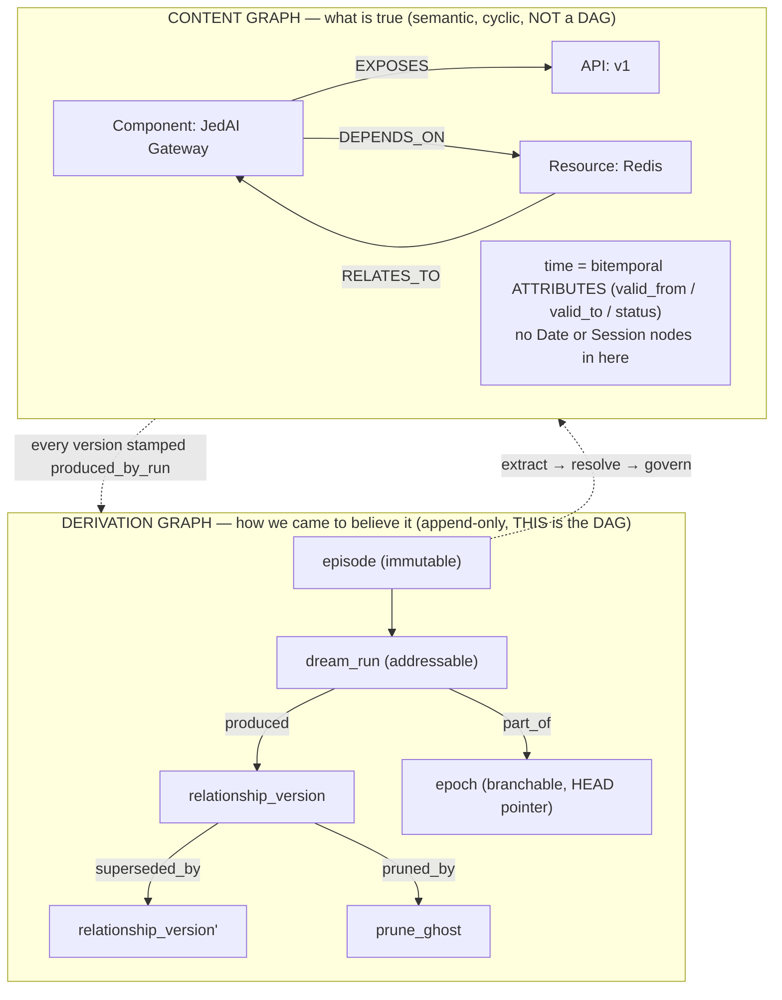
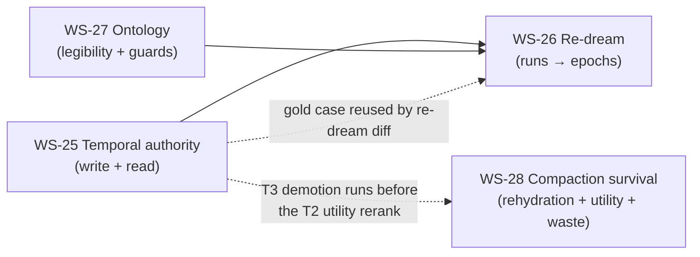

# NEXT — Memotron: temporal authority, re-dream, a 2026-legible ontology, and compaction survival

**Owner:** Memotron (multi-tenant, multi-scope agent memory)
**Status:** Landed — all four workstreams implemented and merged; see the 2026-08-25 note below
**Last updated:** 2026-08-25
**Supersedes:** the WS-0…WS-24 roadmap (landed; see [PR #33](https://github.disney.com/jedai/memotron/pull/33)). This doc is the next phase — WS-25…WS-28.

---

## Implementation status (living)

| WS | Title | Phase | Status |
|---|---|---|---|
| **WS-25** | **Temporal-authoritative supersession & read ordering** | P5 | ✅ landed |
| **WS-26** | **The derivation DAG: runs, epochs, and re-dream** | P5 | ✅ landed |
| **WS-27** | **Ontology hardening for 2026 LLM/agent comprehension** | P5 | ✅ landed |
| **WS-28** | **Compaction survival & context-pollution accounting** | P5 | ✅ landed |

Every unit lands on `main`, keeps the suite green (`uv run pytest`), and is verified against the live JedAI Gateway before the next begins. No hermetic-only proofs for behaviour that must work live.

> **Landed 2026-08-25:** All four workstreams shipped on `feat/next-ws25-ws28`
> (`git log --oneline` there traces WS-27 → WS-25 → WS-28 → WS-26 integration
> order — WS-26 landed last because it composes the run-provenance stamps and
> reuses WS-11 replay, exactly per §7's sequencing). Full suite green: 995
> passed, 62 skipped (Postgres-parity, no DSN in this environment). Both new
> gold-set sections — `temporal_authority` (WS-25) and `compaction_survival`
> (WS-28) — score 1.0.
>
> **WS-26 follow-ups closed 2026-08-25.** The three gaps this note originally
> carried forward are now all resolved:
> 1. *Postgres parity* — the whole WS-16..26 storage surface (not just WS-26's
>    18 epoch/registry methods) is on the `StorageBackend` contract and
>    implemented on Postgres; the `tests/test_storage_backend.py` parity
>    allowlist is **empty**. Formation and the full re-dream cycle (branch →
>    adopt → rollback, byte-for-byte `graph_state_hash` + `registry_state_digest`
>    restore) run end-to-end against a Postgres live store
>    (`tests/test_redream_end_to_end.py::TestRedreamOnPostgresLiveStore`). Full
>    suite with a live Postgres 16 (LC_COLLATE=C): **1068 passed, 1 skipped**.
> 2. *Recompute tier on the WS-11 receipt* — the tier + reason now ride
>    `RunCheckpoint.redream_tier` / `redream_tier_reason`, not only the epoch row.
> 3. *Operator-MCP epoch-diff* — `mcp_server.py` exposes `redream_epochs` and
>    `redream_diff`, mirroring the admin HTTP pair.
>
> (Adopt remains a pointer flip plus a bounded status-retire, and recompute
> still runs against a physically separate shadow store — both are the
> documented design, not gaps.) See the README's "Re-dream, epochs, and the
> derivation DAG" and "Ontology hardening" sections, and
> [DATAFLOW.md](DATAFLOW.md) Stage 4d, for the as-landed detail this document's
> plan-stage prose does not capture.

> **Prerequisite landed (2026-08-24):** PR #35 (persistence behind the `StorageBackend`
> contract + a Postgres backend) was reconciled into `main` under the WS-16..24 work
> and verified green (865 passed, 62 Postgres-parity skipped — no DSN in this
> environment). The SQLite engine now lives in `src/memotron/storage/sqlite/`;
> `graph.py`/`receipts.py` are compatibility shims. WS-16+ storage methods were
> SQLite-first; as of the WS-26 follow-ups (2026-08-25) they have **reached full
> Postgres parity** — the `tests/test_storage_backend.py` allowlist is empty. WS-25..28
> build on this reconciled substrate; NEXT.md's pre-#35 `graph.py:NNNN` line references
> are resolved by symbol.

---

## 0. Desired outcome (from the working session)

Four things must become true — the first three in dependency order, the fourth independent and the most user-visible:

1. **A newer statement about the same thing must win — deterministically, not by luck of semantic score.** A preference/directive/state update must not be out-ranked by a stale-but-semantically-closer incumbent, and must not depend on an LLM correctly tagging the update as a "correction."
2. **Dreaming must be re-runnable without destroying the current graph.** Every dream mutates the graph; we must be able to *branch* a re-dream from the immutable episodes, diff it against what we have, and adopt or roll back — git-style. The temporal backbone is the **dream run**, promoted into an **epoch**, *not* Date→Session nodes.
3. **The ontology must be optimal for how 2026 LLMs/agents search and use memory** — closed entity vocabulary (keyed for resolution/traversal), open relation vocabulary (the embedded fact sentence is the retrieval key), required disambiguating descriptions + aliases, and a general type that cannot swallow the corpus.
4. **Context must survive a compaction boundary without re-derivation.** The dying context is already checkpointed at `PreCompact`; rehydration must be *seeded* by that checkpoint, injection must be ranked by demonstrated use (the utility plane exists and is weighted zero today), and context pollution must be *measured* — injected-but-never-cited tokens are the direct cost of a bloated brief, and only our use/outcome plane can price them.

---

## 1. Diagnosis (grounded in the code)

### 1.1 Temporality is enforced only as *exclusion*, never as *authority*

- **Read path** ([`client.py:753`](src/memotron/client.py:753) → `_relationship_is_visible` [`:8176`](src/memotron/client.py:8176)) drops `SUPERSEDED` and out-of-window (`valid_to`) facts. Good — but only exclusion.
- **Ranking** is a linear weighted sum ([`retrieval.py:186`](src/memotron/retrieval.py:186)) where `recency` is one *soft* term via `recency_decay` ([`:138`](src/memotron/retrieval.py:138)). A high-`relevance` older fact outranks a fresher one whenever `w_rel·Δrelevance > w_rec·Δrecency`.
- **Supersession gate** ([`dreaming.py:1411`](src/memotron/dreaming.py:1411)) keys on **authority + severity + corroboration**. Recency is *not an input anywhere*. An equal-authority update to a well-observed `preference` (multi-active, [`models.py:180`](src/memotron/models.py:180)) parks as `insufficient_corroboration` ([`:1449`](src/memotron/dreaming.py:1449)) — the **stale incumbent stays `ACTIVE`** and can be the top hit.
- Correctness currently rides on the extractor tagging a mind-change as `ClaimMode.CORRECTION` (→ OPERATOR authority [`:1385`](src/memotron/dreaming.py:1385), bypasses the gate). For `preference`/`directive` — the types that exist *because minds change* — that is a soft, model-dependent guarantee.

### 1.2 The derivation history is a DAG already, but it is not first-class

- `episodes` are immutable ([`graph.py:2636`](src/memotron/graph.py:2636)). Dreaming is a pure function of *(claimed episodes, policy, motive)* → *(graph mutations, receipts)*.
- Lineage exists — `dream_job_runs` ([`:2678`](src/memotron/graph.py:2678)), the ordered `dream_decisions` receipt chain ([`:2689`](src/memotron/graph.py:2689)), supersession chains, restorable `memory_prune_ghosts` ([`:2753`](src/memotron/graph.py:2753)), WS-11 byte replay ([`replay.py`](src/memotron/replay.py)).
- **But**: a run is a side table, not addressable from the facts it produced; re-dream today is destructive-in-place (clear `processed_episodes`, re-run, overwrite); there is no epoch/branch to hold old and new side-by-side. WS-11 counterfactual eval is read-only what-if — it does not materialize a second adoptable graph.

### 1.3 The ontology is correct in shape but under-optimized for comprehension

- Closed entities (13 labels: Component, API, Resource, System, Domain, Environment, Decision, Credential, Model, Tool, Group, Event, Concept — [`ingest/kb_config.py:243`](ingest/kb_config.py:243)); open predicates with `"*"` endpoint wildcards ([`config.py:1205`](src/memotron/config.py:1205)). Rationale is load-bearing and correct: retrieval ANN-matches the **embedded fact sentence**, so closing predicates buys nothing.
- Gaps for 2026 legibility: per-entity `description` is not *required* (disambiguation is optional), aliases aren't first-class in the prompt, `Concept` is an unguarded catch-all (the old `identity`/anchor "absorbs 84% of the corpus" failure mode, [`models.py:173`](src/memotron/models.py:173)), and the temporal qualifier (`valid_from`/`valid_to`/`status`) is not surfaced into the text an agent reads.

### 1.4 The compaction loop is instrumented but open at three seams

- **Rehydration is unconditioned.** `PreCompact` checkpoints the real dying context — task focus, recent assistant state, tools, files ([`cli.py:492`](src/memotron/cli.py:492)); `PostCompact` stores Claude Code's own compact summary — then `SessionStart(source=compact)` calls plain `memory_start()` with **no query and no checkpoint seed** ([`cli.py:463`](src/memotron/cli.py:463)). The dying context is persisted and then never used to shape what gets re-injected. This is exactly the "waste tool calls re-deriving after compaction" failure.
- **The utility loop is collected but inert on the read side.** Citation scans and the session judge feed `use_stability`/`outcome_quality`, but `utility_weight` defaults to `0.0` ([`config.py:2617`](src/memotron/config.py:2617)), and `get_context`'s role fill is not usage-ranked at all. `ContextRole.STRUCTURE` is defined as "critical commands, routing facts" ([`context.py:172`](src/memotron/context.py:172)) — the natural home for frequently-used commands — but nothing ranks that section by demonstrated use, and its budget share is a fixed 0.2.
- **Context pollution is measurable and unmeasured.** The event plane records both sides of the ledger: `injected − cited = tokens paid for and never used`. No shipped competitor can compute this (they have no use/outcome plane); we can, and don't.

---

## 2. The two-plane model (the architectural frame)

DAG means two different things here. Keep them separate.



- **Content plane**: entities + relations, cyclic, time as attributes. Untouched structurally.
- **Derivation plane**: append-only, spine = **run → epoch**. This is where re-dream lives.
- **Date/Session**: *derived rollup selectors only* — a `session_digest` and episode-selection helpers used to *scope* a re-dream ("re-dream last Tuesday's sessions"). Never the substrate facts attach to. (See Non-goals §9.)

---

## 3. WS-25 — Temporal-authoritative supersession & read ordering

**Goal:** a newer, same-slot, equal-or-higher-authority statement about a *recency-authoritative* type wins deterministically — at write time by closing the incumbent, and at read time by a hard within-slot recency order — without depending on the extractor's `CORRECTION` classification.

**Positioning:** Zep/Graphiti invalidate edges by LLM judgment and Mem0's ADD/UPDATE/DELETE verbs are LLM-chosen; WS-25 makes invalidation *deterministic and receipted*. The enterprise sentence is "deterministic where competitors are probabilistic" — which also means the determinism must not smuggle in a new soft dependency (see T2's timestamp clamp).

**Recency-authoritative types** (config, not hard-coded): `{preference, directive, state}`. World-fact types (`anchor`, `decision`, `incident`, `requirement` value-claims) keep evidence/corroboration gating unchanged.

**Data flow**

```
new candidate ─▶ truth_slot_key(scope,subject,predicate)
                      │
       same-slot active incumbents with contradictory object?
          │no                              │yes
      coexist/reinforce            recency-authoritative type
                                      │yes                         │no
                       newer ∧ auth(cand) ≥ auth(incumbent)?     evidence/corroboration gate (unchanged)
                          │yes                    │no
                    auto-close incumbent      park (existing behaviour)
                    (valid_to = cand.valid_from,
                     status=SUPERSEDED, receipted)
```

### Units

- **T1 — `truth_slot_key` + same-slot contradiction predicate.**
  `input`: two `GraphRelationship`/candidate objects → `output`: `(same_slot: bool, contradictory_object: bool)` keyed on `scope:subject:predicate` (object-independent), reusing negation-stripped object comparison ([`dreaming.py:228`](src/memotron/dreaming.py:228) `_strip_negation_markers`). `unit`: "prefers dark mode" vs "prefers not dark mode" → same slot, contradictory; "prefers dark mode" + "prefers window seating" → same slot (the key is object-independent), NOT contradictory — `multi_active` coexistence; "prefers dark mode" + "uses vim" (different predicate) → not same slot. `integration`: two episodes, same subject+predicate, contradictory objects → one contradiction set surfaced; non-contradictory same-slot objects → none. `module`: `dreaming.py` (contradiction detection; extends `scan_coherence`).

- **T2 — recency-authoritative auto-close at the supersession gate.**
  `input`: incumbent + newer same-slot contradictory candidate of a recency-authoritative type, `auth(cand) ≥ auth(incumbent)` → `output`: incumbent `valid_to = cand.effective_from`, `status=SUPERSEDED`, `superseded_by_relationship_uuid=cand.uuid`, a receipt with `reason="recency_authoritative_supersede"`; **bypasses** the corroboration gate ([`:1449`](src/memotron/dreaming.py:1449)). **"Newer" is clamped, not claimed**: `effective_from = min(cand.valid_from, episode.reference_time)` — the extractor's claimed event time can never postdate the observation that carries it, so a hallucinated or spoofed future `valid_from` cannot deterministically flip truth (otherwise T2 trades the soft `CORRECTION` dependency for a hard dependency on timestamp extraction). A backfilled genuinely-older candidate remains historical, exactly as today. `unit`: equal-authority newer preference closes an `observed_count=9` incumbent (today it parks); a candidate whose `valid_from` postdates its episode's `reference_time` is clamped and does NOT out-rank a genuinely newer incumbent. `integration`: staging→prod deploy-target example flips at the next micro-dream. `module`: `dreaming.py` (`_supersession_gate_reason` + the materialization path).

- **T3 — read-time within-slot hard recency tiebreaker (contradiction-aware).**
  `input`: the post-visibility candidate set → `output`: for any `truth_slot_key` with >1 `ACTIVE` in-window fact, group the slot's facts into **contradiction clusters** using T1's `contradictory_object` predicate; *within each cluster* keep only the max-`valid_from` (ties broken by `created_at`, then `uuid`) *before* stage-6 rerank, demoting the rest out of the current-truth set; facts in no cluster are untouched. The cluster step is load-bearing, not a refinement: the slot key is object-independent while `preference`/`directive` are `multi_active` ([`models.py:180`](src/memotron/models.py:180)) — "prefers dark mode" and "prefers window seating" share `scope:user:prefers` and must coexist; a bare per-slot winner-take-all would silently demote every coexisting preference but one. `unit`: two active contradictory same-slot facts, older has higher semantic relevance → newer returned; two active non-contradictory same-slot facts → **both** returned (the multi-active regression case). `integration`: query returns the fresh fact even in the window before a dream runs, with coexisting preferences intact. `module`: `retrieval.py` (new stage between current-truth filter and rerank) invoked from `client.py` read path.

- **T4 — decouple correctness from `CORRECTION` classification.**
  `input`: candidate `claim_mode` → `output`: `CORRECTION` *raises* `source_authority` (a hint that wins ties) but is **not** the only supersession path; T2 fires on recency+authority regardless of claim_mode. `unit`: an update tagged plain `PREFERENCE` still closes the incumbent via T2. `integration`: extractor mislabels a mind-change → memory still corrects. `module`: `dreaming.py` (`_source_authority` [`:1371`](src/memotron/dreaming.py:1371)).

- **T5 — gold-set regression: stale-beats-fresh.**
  `input`: a scripted 2-episode fixture (preference set, then contradicted) → `output`: a gold case that **fails on `main` today** (stale returned top) and **passes after T2/T3**. `unit`: assertion on retrieval order. `integration`: `ingest/actionability_goldset.yaml` gains a `temporal_authority` section scored by `score_actionability.py`. `module`: `ingest/` gold set + `tests/test_temporal_authority.py`.

**GOAL (WS-25):** on the live gateway, for a scope where a `preference`/`directive`/`state` slot has been updated with a newer contradictory value of equal-or-higher authority, `client.search(...)` and the context brief return **only** the newest value while non-contradictory same-slot facts continue to coexist untouched, the prior value is `status=SUPERSEDED` with `valid_to == new.effective_from` and a `recency_authoritative_supersede` receipt, a candidate with a spoofed future `valid_from` cannot flip an incumbent, `tests/test_temporal_authority.py` is green, and the `temporal_authority` gold section scores 1.0 while the existing actionability gold set does not regress.

---

## 4. WS-26 — The derivation DAG: runs, epochs, and re-dream

**Goal:** make the dream run addressable from the facts it produced, add an **epoch** (branchable graph version with a per-scope HEAD pointer), and implement **re-dream = branch → recompute from immutable episodes → diff → adopt/rollback**, reusing WS-11 replay for verification.

**Data flow**

```
select episodes (by session_id | date range | entity touched)
        │
   fork epoch  E_new  from  HEAD (E_cur)         (copy pointer, not data)
        │
   recompute: run dreaming over the selected episodes under (policy?, motive?, model?)
              at the cheapest sufficient tier (T8) —
                A: re-govern stored candidates          (0 LLM calls)
                B: re-resolve + re-materialize stored   (0 extraction calls)
                C: full re-extract                      (LLM spend)
              writing versions stamped part_of=E_new, produced_by_run=R
        │
   diff(E_cur, E_new) → {added, removed, changed, unchanged}
        │
   adopt (HEAD := E_new, fast-forward)   OR   discard (drop E_new, HEAD unchanged)
        │
   WS-11 byte replay verifies E_new reconstructs from its receipt chain
```

### Units

- **T1 — run provenance stamps on every version.**
  `input`: a formation mutation with its `dream_job_runs.uuid` → `output`: `produced_by_run`, and on supersede/prune `superseded_by_run`/`pruned_by_run`, written into `relationships.properties_json` (and into the `graph_state_hash` tuple [`graph.py:458`](src/memotron/graph.py:458) so replay covers them). `unit`: a materialized fact carries `produced_by_run == run.uuid`. `integration`: traverse "everything run R did" from any fact R produced. `module`: `dreaming.py` provenance choke-point ([`:1547`](src/memotron/dreaming.py:1547)).

- **T2 — epoch tables + HEAD pointer.**
  `input`: schema migration → `output`: `graph_epochs(epoch_id, scope_key, parent_epoch_id, created_at, label, status)` and `epoch_runs(epoch_id, run_uuid)`; a per-scope `active_epoch` pointer; every relationship version tagged `epoch_id`. `unit`: HEAD resolves to exactly one epoch per scope; fork sets `parent_epoch_id`. `integration`: a normal dream writes into the active epoch; reads are epoch-scoped to HEAD. `module`: new `src/memotron/epochs.py` + `graph.py` DDL.

- **T3 — episode selection for a re-dream.**
  `input`: a selector `{session_id | date_range | entity_uuid | episode_uuids}` → `output`: the immutable episode set to replay. `unit`: date-range selector returns the right episodes by `reference_time`. `integration`: "re-dream last Tuesday" selects that day's episodes only. `module`: `client.py` selector + `epochs.py`.

- **T4 — branch + recompute.**
  `input`: `(selector, base_epoch=HEAD, overrides={policy?,motive?,model?})` → `output`: a new epoch `E_new` populated by running the existing dreaming pipeline over the selected episodes, writing versions tagged `epoch_id=E_new`; **HEAD/`E_cur` untouched**; `processed_episodes` marks are per-epoch so the re-run is not blocked by prior processing. `unit`: recompute under a stricter policy yields fewer facts in `E_new`, `E_cur` unchanged. `integration`: full branch on a 10-episode scope; both epochs independently readable. `module`: `epochs.py` orchestrating `dreaming.py`.

- **T5 — diff two epochs.**
  `input`: `(E_cur, E_new)` → `output`: `{added, removed, changed(by truth_slot_key), unchanged}` with per-fact lineage. `unit`: a changed deploy-target shows in `changed`, not `added`+`removed`. `integration`: diff surfaced on the admin API + operator MCP. `module`: `epochs.py` + `admin_server.py`.

- **T6 — adopt / rollback + replay verify.**
  `input`: `adopt(E_new)` or `rollback(to=E_prev)` → `output`: `active_epoch` pointer flip only (no destruction; prior epochs retained, GC'd by a separate retention policy); WS-11 byte replay asserts the adopted epoch reconstructs from its receipt chain before the pointer moves; a `ReplayVerificationError` aborts the adopt fail-closed. `unit`: rollback restores the exact prior `graph_state_hash`. `integration`: adopt → read reflects `E_new`; rollback → read reflects `E_cur`; both replay-verified. `module`: `epochs.py` + `replay.py`.

- **T7 — Date/Session as derived selectors (not substrate).**
  `input`: episodes carrying `session_id` / `reference_time` → `output`: a `session_digest` rollup node (downstream of content) and the T3 selectors; **no** `Date`/`Session` nodes in the content plane. `unit`: a session digest summarizes its episodes and is itself a `rollup` memory type. `integration`: "evolution over time" view is built from digests + epoch diffs, not from a Date spine. `module`: `dreaming.py` rollup + `client.py`.

- **T8 — re-dream cost tiers.**
  `input`: the override set → `output`: the recompute tier, chosen by what actually changed and receipted on the run — governance-only overrides (salience, Motive type filter, thresholds) → **Tier A**: `regovern_scope` over the stored raw/quarantine candidates, zero LLM calls; resolution/supersession/dedup-policy overrides → **Tier B**: re-resolve + re-materialize from the stored stage-1 candidates, zero extraction calls; model/prompt/instruction-set overrides → **Tier C**: full re-extraction. A tier is never silently upgraded; the run receipt names the tier and why. Without this, "re-dream last month" is priced like a full re-ingest and nobody will use it — the staged EXTRACT/RESOLVE/GOVERN store already paid for tiers A and B. `unit`: a governance-only override recomputes an epoch with zero transport calls. `integration`: Tier B on a 10-episode scope produces the same epoch as Tier C under an unchanged model (state-hash-compared), at zero extraction spend. `module`: `epochs.py` tier selection over `dreaming.py` (`regovern_scope`) + `extraction.py` (stored candidates).

- **T9 — epoch-scoped canonicalization registries.**
  `input`: a branched recompute that would register entity aliases or predicate canonicals → `output`: `entity_canon` and the predicate-canonical registry become copy-on-write per epoch — a re-dream under `E_new` reads HEAD's registries but writes only `E_new`'s overlay, so HEAD's reads never change without HEAD's epoch changing and rollback restores *behavior*, not just rows; the T5 diff gains registry deltas (`aliases_added/removed`, `canonicals_added/removed`); registry state joins the `graph_state_hash` tuple (verify whether it participates today — if not, that is a pre-existing replay gap this unit closes). Without this, T6's rollback guarantee is hollow: a branched re-dream would mutate the shared registries that HEAD's formation and reads resolve through. `unit`: an alias registered during a branched re-dream is invisible to HEAD's formation and reads. `integration`: adopt applies the overlay atomically with the pointer flip; discard drops it; a post-rollback re-run of the WS-17 backfills is a no-op. `module`: `epochs.py` + `graph.py` (`entity_canon`, predicate registry).

**GOAL (WS-26):** on the live gateway, an operator can select a slice of immutable episodes, branch a new epoch, recompute it under a changed policy/motive without mutating the current graph, see a structured diff (facts *and* registry deltas), and `adopt` or `rollback` by a single pointer flip — with WS-11 byte replay verifying the target epoch before every adopt; `active_epoch` never leaves a scope without exactly one HEAD; recompute runs at the cheapest sufficient tier (a governance-only re-dream makes zero LLM calls, receipted); no branched re-dream mutates HEAD's canonicalization registries; and `tests/test_epochs.py` + `tests/test_redream_end_to_end.py` are green including a rollback that restores the pre-adopt `graph_state_hash` byte-for-byte.

---

## 5. WS-27 — Ontology hardening for 2026 LLM/agent comprehension

**Goal:** keep the closed-entity / open-relation asymmetry (it is correct), but make each memory maximally *legible and disambiguable* to a retrieving agent, and stop the general type from absorbing the corpus. Optimize both retrieval channels: **ANN over the embedded fact sentence** and **LLM reading of the structured triple + qualifiers**.

**Principles (why these, for 2026 comprehension)**

| Decision | Keep / Change | Why it helps an LLM/agent search & use memory |
|---|---|---|
| Entity vocabulary | **Closed** (13 labels) | Resolution and traversal key on type; a closed set makes entity linking and neighborhood expansion deterministic. |
| Relation vocabulary | **Open** predicates | Retrieval ANN-matches the embedded fact *sentence*, not the predicate; closing predicates only rejects valid verbs. |
| Per-entity `description` | **Change → required** | The disambiguator both the resolver score and the reading agent rely on ("virtual key" = *which* credential?). |
| Aliases (`altLabel`) | **Promote to first-class** | Query-time recall: "GCX" ⇄ "guest content experience" ([`kb_config.py:164`](ingest/kb_config.py:164)) must both hit. |
| `Concept` general type | **Guard** | Prevent the `identity`/anchor "84% of corpus" failure ([`models.py:173`](src/memotron/models.py:173)) via a share ceiling + "prefer a specific label" rule. |
| Temporal qualifier | **Surface into text — only where informative** | An agent must read *as-of when* a fact is true, not just the fact; but a qualifier on every line is token spend fighting the budget it lives in, so stable current facts render bare. |
| Dual representation | **Formalize** | Triple for traversal + NL sentence for embedding/LLM reading; invariant: every relation has both. |
| Tenant extension | **Document contract** | Each Memotron instance is scoped to a project; tenants add types/relations for their domain. |

### Units

- **T1 — required disambiguating `description` + first-class aliases.**
  `input`: `NodeInstruction` gains `require_description: bool` and `aliases: tuple[str,...]`; the authored prompt asks for a one-line description per entity → `output`: extraction rejects (quarantines, non-fatal) an entity with no description for a require-description label; aliases are written to `entity_canon` (prefLabel/altLabel). `unit`: entity without description → quarantined with reason; alias query resolves to canonical. `integration`: "GCX" and "guest content experience" resolve to one entity. `module`: `config.py` (`NodeInstruction`) + `extraction.py` + `graph.py` (`entity_canon`).

- **T2 — required vs optional properties per type.**
  `input`: per-label required-key set (e.g. `Credential` requires a reference, never a value; `Environment` requires a canonical name) using existing `properties` + `strict_properties` ([`config.py:924`](src/memotron/config.py:924)) → `output`: candidates missing a required key are quarantined with a specific reason. `unit`: `Credential` with a raw value and no ref → quarantined. `integration`: gateway-docs ingest produces `Credential` nodes that are all references. `module`: `config.py` + `extraction.py`.

- **T3 — dual-representation invariant (triple + embedded sentence).**
  `input`: any materialized relation → `output`: it carries a structured `(subject,predicate,object)` triple *and* a stored embedding of the full NL fact sentence; a materialization missing either fails closed. `unit`: assert both present post-formation. `integration`: admin graph renders the triple ([`ui/admin/src/relationshipView.ts`](ui/admin/src/relationshipView.ts)) while retrieval matches on the sentence. `module`: `dreaming.py` + `tests/`.

- **T4 — `Concept` catch-all guardrail.**
  `input`: per-run type-share measured after formation ([`_evaluate_formation_health`](src/memotron/dreaming.py:2369)) → `output`: a `max_type_share_block` ceiling specifically on `Concept`/general labels + a prompt rule "choose the most specific applicable label; use Concept only when none fits"; crossing the ceiling raises a health finding and is receipted. `unit`: a corpus that would put >X% into `Concept` trips the ceiling. `integration`: gateway-docs ingest keeps `Concept` share under the ceiling. `module`: `config.py` (health policy) + `kb_config.py` (prompt) + `dreaming.py`.

- **T5 — temporal qualifier legibility (informative-only).**
  `input`: a relation with `valid_from`/`valid_to`/`status` → `output`: the context brief and the fact sentence surfaced to agents include an as-of qualifier ("as of 2026-08, …"; "superseded 2026-08-24") **only when it changes the reading**: superseded status, an explicit `valid_to`, or `valid_from` within a configurable recency window (default 14 days). A stable current fact renders bare — qualifying every line is token spend that fights WS-28's pollution accounting. `unit`: stable current fact → bare line; recently-changed fact → qualified; superseded fact in a historical view → always marked. `integration`: `get_context()` output shows currency exactly where it is non-obvious; a superseded fact never appears without its marker in historical views. `module`: `context.py` + `synthesis.py`.

- **T6 — tenant vocabulary extension contract.**
  `input`: the `kb_config` shape (NODE_INSTRUCTIONS / RELATIONSHIP_INSTRUCTIONS / allowed_labels) → `output`: a documented, validated extension path so a tenant defines project-specific entity types and open relations; validation rejects an entity label absent from `allowed_labels` and a relation endpoint outside it. `unit`: a tenant config with a new label validates and extracts. `integration`: a second sample project ingests under its own vocabulary. `module`: `config.py` validation + `ingest/kb_config.py` as the worked example + `INGEST.md`.

**GOAL (WS-27):** the authored extraction prompt is ≥ its current authored length and (a) requires a one-line description per entity, (b) instructs "most specific label; `Concept` only as last resort," (c) requests aliases; on a live gateway re-ingest of the sample corpus, every entity has a non-empty description, `Concept` share is under the configured ceiling, every materialized relation carries both a triple and an embedded fact sentence, aliases resolve bidirectionally in `entity_canon`, and `tests/test_ontology_2026.py` is green.

---

## 6. WS-28 — Compaction survival & context-pollution accounting

**Goal:** the context an agent loses at a compaction boundary is re-established from memory — seeded by the dying context's own checkpoint, ranked by demonstrated use, and priced honestly — so the post-compaction turn answers "what was I doing, how do I run it" with zero tool calls. This closes the three open seams in §1.4 and directly targets the two metrics that were built for exactly this and are targeted by no other workstream: `repeat_search_rate` ↓ and `answered_from_profile_rate` ↑ (WS-22 T29).

**Data flow**

```
PreCompact ──▶ checkpoint(task focus, tools, files) ──▶ memory_log episode        (exists)
PostCompact ─▶ Claude Code compact summary ─────────▶ memory_log episode          (exists)
SessionStart(source=compact)
      │
      ├─▶ read latest compaction checkpoint for the session                       (T1, new)
      ├─▶ memory_start seeded by checkpoint text (retrieval query + RECENT lead)  (T1, new)
      └─▶ STRUCTURE role filled in use_need order; utility_weight active          (T2, new)
transcripts ─▶ repeated verbatim commands ─▶ runbook facts                        (T3, new)
use events: injected vs cited ─▶ injected_waste_rate per type/role                (T4, new)
                                        │
                              budget shares respond (opt-in)                      (T4)
```

### Units

- **T1 — checkpoint-seeded rehydration.**
  `input`: `SessionStart` with `source=compact` ([`cli.py:463`](src/memotron/cli.py:463)) → `output`: `memory_start` whose retrieval is seeded by the session's latest `context_compaction` checkpoint text (PreCompact capture, PostCompact summary), and whose rendered context leads the RECENT section with that task focus; a session with no checkpoint behaves byte-identically to today. `unit`: fake checkpoint → rendered context contains the task focus and the seeded search ran. `integration`: live compaction → the post-compaction turn answers "what was I doing" from the injected context with zero searches. `module`: `cli.py` hook + `agent_memory.py` (`memory_start` seed parameter).

- **T2 — usage-ranked injection.**
  `input`: the receipt-rebuildable utility projection → `output`: `get_context`'s STRUCTURE role fill ordered by `use_need` ([`context.py:172`](src/memotron/context.py:172) — "critical commands, routing facts" is exactly the frequently-used-command home), and `utility_weight` > 0 by default once a scope crosses an event-volume floor (below the floor, ranking stays byte-identical — never rank on noise; the flip is receipted). Ordering note: this utility rerank runs *after* WS-25 T3's within-slot demotion — usage can never resurrect a stale value. `unit`: a twice-cited command outranks a never-cited peer in STRUCTURE; a scope below the event floor ranks byte-identically. `integration`: `repeat_search_rate` falls across two live sessions on the same scope. `module`: `context.py` (role fill) + `retrieval.py`/`config.py` (`utility_weight` default gated on event volume).

- **T3 — runbook capture.**
  `input`: session transcripts already parsed once per lifecycle boundary by the citation scan ([`transcripts.py`](src/memotron/transcripts.py)) → `output`: a command executed ≥ N times with a stable shape forms an `anchor`/`directive` fact carrying the **verbatim invocation** as a property — never paraphrased (a runbook line is an identifier; the WS-17 identifier-token guard applies, so two near-identical commands never merge). Capture is deterministic shape-matching at existing lifecycle boundaries — no semantic selection in hooks, no per-turn publication, consistent with the adoption contract. `unit`: a transcript with 3× `uv run examples/simulation.py --live` → one fact carrying that exact string. `integration`: gold section `compaction_survival` — post-compaction "how do I run the live sim" answered from the profile with zero tool calls. `module`: `transcripts.py` (command extraction) + `dreaming.py` (formation path).

- **T4 — `injected_waste_rate` (context pollution, measured).**
  `input`: the scope's INJECTED/RETRIEVED use events joined to CITED_OR_USED events → `output`: per-type and per-role injected-but-never-cited share, token-weighted with the platform estimator, surfaced on `memory_evolution()` (`None` when unmeasured — never a fake `0.0`); `ContextPolicy.role_budget_shares` may respond to it (opt-in, receipted). This metric is uniquely ours: it requires the use/outcome event plane, which no shipped competitor has. `unit`: synthetic events → exact rate. `integration`: admin `GET /api/evolution` shows the rate falling as T2 lands. `module`: `client.py` (evolution) + `context.py` (share response).

**GOAL (WS-28):** on the live gateway across a real compaction boundary, the post-compaction turn's injected context contains the pre-compaction task focus and the session's frequently-used commands verbatim; "what was I doing / how do I run it" is answered with zero searches and zero tool calls; `repeat_search_rate` falls and `answered_from_profile_rate` rises across two consecutive sessions on the same scope; `memory_evolution()` reports `injected_waste_rate`; the `compaction_survival` gold section scores 1.0; and `tests/test_compaction_survival.py` is green with no regression in the existing actionability gold set.

---

## 7. Sequencing & dependencies



- **WS-25 first** — it is the correctness fix, self-contained, and its gold case (stale-beats-fresh) becomes a diff fixture for WS-26.
- **WS-27 in parallel** — ontology changes are write-side and independent of temporal authority; both must land before WS-26 so a re-dream recomputes under the *hardened* ontology and the *correct* temporal rules.
- **WS-28 in parallel, before WS-26** — it is read-side + hooks and independent of epochs, and it is the user-facing pain (§0.4). Its only ordering constraint is stage order inside `retrieval.py`: WS-25 T3's within-slot demotion must run before WS-28 T2's utility rerank, so land T3 first.
- **WS-26 last** — it composes the run-stamps (needs stable formation), epochs, and reuses WS-11 replay; a re-dream is only meaningful once "recompute" produces correct, temporally-authoritative, well-typed memory.

Each WS is shippable alone; the order maximizes reuse and de-risks the biggest piece (epochs) by landing on a correct substrate.

---

## 8. Success metrics ("ready for the enterprise bar")

- **Temporal correctness:** 0 cases in the `temporal_authority` gold set where a superseded/older same-slot value is returned as current truth, and 0 cases where a coexisting non-contradictory multi-active fact is demoted by the tiebreaker. Measured live.
- **Re-dream safety:** 100% of adopts are WS-11 byte-replay-verified before the pointer flips; rollback restores the prior `graph_state_hash` byte-for-byte; 0 destructive edits to a non-active epoch; 0 registry mutations visible to HEAD from a branched re-dream.
- **Re-dream cost:** a governance-only re-dream makes 0 LLM calls; the run receipt names the tier on every recompute.
- **Ontology legibility:** 100% of entities carry a description; `Concept` share ≤ ceiling; 100% of relations carry both a triple and an embedded sentence; alias recall proven bidirectional.
- **Compaction survival:** across a live compaction boundary, the pre-compaction task focus and frequently-used commands are answered from injected context with zero tool calls; `repeat_search_rate` falls and `answered_from_profile_rate` rises session-over-session; `injected_waste_rate` is reported and falls as usage-ranked injection lands.
- **No regression:** the existing actionability gold set and the full `uv run pytest` suite stay green; the incremental `get_context()` live proof still shows zero transport calls on no-change.

---

## 9. Non-goals (explicit rejections from the session)

- **Date → Session as the graph's main nodes.** Rejected. It inverts the model (temporal scaffold primary, knowledge secondary), pollutes semantic retrieval, and buys nothing over bitemporal attributes + the run/epoch DAG. Date/Session live only as derived selectors/rollups (WS-26 T7).
- **Global last-writer-wins.** Rejected. Recency is decisive **only** for recency-authoritative types on the **same slot**; world-fact types keep evidence/corroboration gating, so one stray observation still cannot flip an established fact.
- **Closing the predicate vocabulary.** Rejected. The embedded fact sentence is the retrieval key; a closed predicate set only rejects valid verbs (see [`config.py:1205`](src/memotron/config.py:1205) rationale).
- **Comparing against a baseline / competitor benchmark for its own sake.** Out of scope; this is net-new capability, measured against its own GOAL clauses.
- **Auto-pinning frequently-used facts.** Rejected. A pin is an operator hold on context presence; frequency earns rank through the receipted utility plane (WS-28 T2), never a silent permanent hold that would outlive the usage pattern that justified it.
- **Semantic selection in hooks.** Rejected (re-affirming the adoption contract). WS-28 T3's command capture is deterministic shape-matching at existing lifecycle boundaries — no transcript-wholesale ingestion, no per-turn publication, no LLM in a hook.

---

## 10. Runnable GOAL (all four workstreams)

> **DONE WHEN**, on the live JedAI Gateway and with `uv run pytest` green:
> **(WS-25)** a newer, same-slot, equal-or-higher-authority `preference`/`directive`/`state` value is the *only* value returned by search and the context brief while non-contradictory same-slot facts continue to coexist, the prior value is `SUPERSEDED` with `valid_to == new.effective_from` and a `recency_authoritative_supersede` receipt, independent of the extractor's claim-mode label and immune to a spoofed future `valid_from`; **and (WS-26)** a slice of immutable episodes can be branched into a new epoch, recomputed at the cheapest sufficient tier (governance-only → zero LLM calls) under a changed policy without mutating HEAD or HEAD's canonicalization registries, diffed (facts and registry deltas), and adopted or rolled back by a single replay-verified pointer flip that restores the prior `graph_state_hash` exactly on rollback; **and (WS-27)** a live re-ingest of the sample corpus yields entities that all carry a description, a `Concept` share under the ceiling, relations that all carry both a triple and an embedded fact sentence, and bidirectionally-resolving aliases; **and (WS-28)** across a real compaction boundary the post-compaction turn answers the pre-compaction task focus and the session's frequently-used commands verbatim from injected context with zero searches and zero tool calls, with `injected_waste_rate` reported on `memory_evolution()` and the `compaction_survival` gold section at 1.0 — with `tests/test_temporal_authority.py`, `tests/test_epochs.py`, `tests/test_redream_end_to_end.py`, `tests/test_ontology_2026.py`, and `tests/test_compaction_survival.py` all passing and no regression in the existing actionability gold set.
