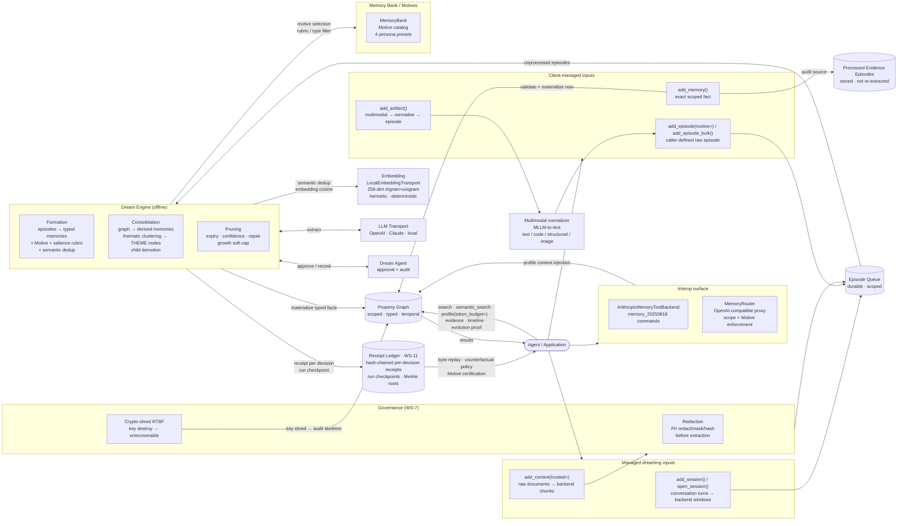

# jedai-memotron

Memotron is a Python proof of concept for configurable, enterprise-grade agent memory over a scoped temporal property graph. It provides **typed** memory (anchor / requirement / preference / directive / state / decision / incident / rollup), **write-side semantic dedup**, **receipt-attested FormationContracts**, **immutable retrieval/use/outcome telemetry**, **goal-conditioned Motives with a Memory Bank of persona presets**, **dependency-tracked recursive rollups**, **loss-aware reversible retention**, **temporal-authoritative supersession**, **a branchable epoch layer with byte-replay-verified re-dream**, **enterprise governance (PII redaction, governed secret references, crypto-shred RTBF, injection hardening)**, **drop-in interop (Anthropic `memory_20250818` backend + OpenAI-compatible Memory Router)**, and **multimodal artifact ingestion** — all on a single substrate with full audit lineage. Real memory formation always runs live against an LLM through the JedAI Gateway; the no-credential `RuleBasedExtractionTransport` is a deterministic test/dev stub (it parses pre-structured JSON, not prose), never a production extraction path.

All persistence sits behind the **StorageBackend contract** (`memotron.storage`) — SQLite (the hermetic default) and Postgres (the Operational Store) both implement the entire contract at parity, with the Memory Graph (Neo4j) implementation slotting in behind the same interface; see [PERSISTENCE.md](PERSISTENCE.md).

The installable distribution is `jedai-memotron`; the Python import package
remains `memotron`:

```bash
uv add jedai-memotron
```

> **Connecting to a Memotron someone else is running?** The quickstart below sets up a
> LOCAL Memotron against your own graph file. If you have a gateway key and want to use a
> hosted deployment, start at **[docs/consumer-onboarding.md](docs/consumer-onboarding.md)**
> instead — a validated path from zero to storing and retrieving your first memory.

### Claude Code quickstart

Install the command once, then initialize each Git repository:

```bash
uv tool install jedai-memotron
cd /path/to/repository
memotron init
memotron llm status
```

`memotron init` defaults to `simple` mode and idempotently installs a
repository-owned `.memotron.yaml`, project stdio `.mcp.json`, Claude Code
`SessionStart` / `PreCompact` / `PostCompact` / `SessionEnd` hooks, an always-loaded
`.claude/rules/memotron.md`, and a `/memotron-memory` inspection skill.
Restart Claude Code, approve the project MCP server once, and run
`/memotron-memory status`. Claude Code's built-in `/memory` remains unchanged
and can show that the Memotron rule loaded. No background daemon or fixed port
is needed.

Without a key, extraction falls back to `RuleBasedExtractionTransport` — a
deterministic parser for pre-structured JSON/`Memory:` episodes, used by tests
and CI for fast, hermetic integration proofs. It does no natural-language
understanding and will not form memory from prose; it is a test substrate, not
a usable no-key product mode. Configure a LiteLLM proxy before relying on real
memory formation — keep the secret in the environment or a gitignored `.env`
and let Memotron seal it into the local graph:

```bash
export LITELLM_API_KEY='replace-me'
memotron llm configure \
  --provider litellm \
  --base-url http://127.0.0.1:4000 \
  --model memotron-memory \
  --api-key-env LITELLM_API_KEY
memotron llm status
```

### Command reference

| Command | Purpose |
|---|---|
| `memotron init` | Configure the current Git repository. Interactive at a TTY (see below); flag-driven and never prompting otherwise. |
| `memotron status` | Show the active repository memory identity and scopes. |
| `memotron llm configure \| status \| clear` | Seal, inspect, or remove the project's LLM credential reference. |
| `memotron migrate` | Move or copy one tenant's memory to a new tenant id (see [tenant memory migration](#guided-setup-and-tenant-memory-migration)). |
| `memotron mcp` | Run the repository-bound MCP server over stdio. Invoked by the generated `.mcp.json`, not usually by hand. |
| `memotron hook <event>` | Handle a Claude Code lifecycle event from JSON stdin, where `<event>` is `session-start`, `pre-compact`, `post-compact`, or `session-end`. Invoked by the generated `.claude/settings.json` hooks, not usually by hand. |

`init` writes those last two wirings for you: `.mcp.json` registers an
`alwaysLoad` stdio server running `memotron mcp --project-root
"${CLAUDE_PROJECT_DIR:-.}"`, and `.claude/settings.json` registers
`SessionStart` → `memotron hook session-start` plus the matching
`PreCompact`, `PostCompact`, and `SessionEnd` entries. Both are idempotent —
rerunning `init` replaces Memotron's own entries and leaves any others
alone. Every command accepts `--project-root`, defaulting to discovery from
the working directory.

The model is the LiteLLM proxy `model_name`; the base URL is the proxy root.
`.memotron.yaml` stores only provider, model, endpoint, and environment-variable
name—never the raw key. Claude Code can safely run these commands when asked to
set up Memotron locally, but it must never copy credentials into prompts,
memories, logs, command arguments, or version-controlled files.

In `simple` mode, Claude Code is a stable caller and source attribution rather
than a durable memory owner. Exact personal facts go to a user scope shared
across this user's repositories; governed repository facts go to the project
scope; the agent scope is internal session/compaction continuity.

> **What "personal" means, and what it does not.** The user scope is *not* private
> to a human. Locally it follows the **OS account** — `default_user_id()` hashes
> `getuser()` — so on a shared deployment every caller lands in one scope. The
> decided target (#206 Phase 3) is to derive it from the gateway key instead, at
> which point the rule becomes: **anything written to personal scope belongs to the
> key, not to the person — share the key and you share that memory.** Neither
> version makes personal scope a confidentiality boundary between people. Use the
> agent scope for per-caller isolation, and do not put anything in personal scope
> that a teammate sharing your key or your host should not read. Set
`mode: multi-agent` in `.memotron.yaml`, or run
`memotron init --mode multi-agent`, when each logical agent must own isolated
durable memory. Changing mode changes routing without rewriting existing scopes.

The generated `agent_guidance` section makes write timing explicit and
project-configurable. Searches happen at task/topic changes, after compaction, and
when remembered state may matter or conflict. Writes are event-driven: remember
explicit durable user/agent facts immediately; publish sourced requirements,
decisions, validated incidents or mitigations, durable blockers, and handoffs at
meaningful milestones. Zero writes is valid. Hooks manage lifecycle boundaries but
never auto-promote raw transcript content.

To tune this behavior, edit `agent_guidance` and `project_memory` in
`.memotron.yaml`, then rerun `memotron init`. The initializer regenerates the
Memotron rule and skill, replaces only Memotron-owned hook handlers, and
preserves unrelated `.claude/settings.json` hooks and settings. Keep semantic
selection out of hooks: do not add transcript ingestion or automatic per-turn
publication.

### Guided setup and tenant memory migration

Run `memotron init` at an interactive terminal (`stdin` is a TTY) and it
becomes a short guided wizard: it prompts only for whichever of mode, project
id/name, project goal, and LLM provider you did not already pass as a flag
(inferring project id/name from the Git remote, confirmable or overridable),
then configures the chosen LLM provider the same way `memotron llm configure`
does. A non-interactive invocation (CI, a Claude Code hook, any scripted
call — anything where `stdin` is not a TTY) behaves exactly as before: no
prompt, no hang, identical output.

After identity is resolved, the wizard looks for pre-existing local memory
under a different tenant id and offers to move it in, rather than silently
orphaning it:

- **Renaming a project**: if `.memotron.yaml` already exists and you choose
  a different project id than the one on disk, and that old id has real
  memory, the wizard offers to move it to the new id.
- **Importing another local project**: `simple` mode shares one graph file
  (`~/.memotron/memory.sqlite`) across all of a user's repositories by
  default. If other tenants already exist in that file, the wizard lists them
  (with fact/episode counts) and offers to import from one — skippable.

Either case is the same underlying primitive: `tenant_id` is baked as a literal
substring into node/relationship identity keys, `scope_key` columns, and the
per-scope content-protection key, so moving memory between tenant ids is a real
migration, not a config edit. A tenant that was ever written under CRYPTO_SHRED
governance is always shown (never silently hidden) but marked unavailable,
since v1 does not recompute crypto-shred commitments under a new tenant id.

**Agent-scoped memory moves too, by a different mechanism.** An agent scope
key (`agent:<agent_id>`) does not embed `tenant_id`, so it is never re-keyed:

- *Within one graph file* (the usual rename), those rows are already at their
  final scope key. Ownership moves with the `tenant_agents` rows, and the
  agents are deregistered from the source **before** `purge_tenant_state`
  runs — that purge's blast radius includes the agent scope of every agent
  still registered to the tenant, which would otherwise delete memory that now
  belongs to the destination. A post-purge check confirms the expected number
  of agent-scoped facts survived.
- *Across two graph files*, each agent scope is copied into the destination
  file under the same scope key, sealed under the destination file's content
  key, then swept from the source.

This matters in `multi-agent` mode, where agent scope routinely holds far more
than the tenant scope does. `preview_tenant_migration` reports the two
separately — `active_relationship_count` and
`agent_scoped_relationship_count` — and the setup wizard shows the combined
total with the agent-held share called out, so the reported size of a
migration is never just its tenant-scope sliver.

**A move is safe against concurrent writers, and says so out loud when it is
not.** The ordering is COPY → VERIFY → LOCK → RE-VERIFY → PURGE. Every write
before the purge is additive to the destination. Before the one destructive
step, the migration runs two checks:

1. a **count check** against the preview — including a live re-count of every
   agent scope, never an echo of the preview's own numbers, so it can actually
   fail; and
2. a **watermark re-verify** — a per-scope `graph_state_hash` plus node,
   episode, use-event, outcome-event, and prune-ghost counts, taken *inside*
   the same `BEGIN IMMEDIATE` transaction that then runs the purge.

That combination makes the guarantee precise and true with other agents
writing, which `multi-agent` mode expects rather than merely permits. A write
to the source can only land in one of three places:

- *before the copy read it* — it is copied, and the watermark still matches;
- *between the copy and the lock* — the re-verify sees a watermark that no
  longer matches what was copied and raises, so the purge never runs and the
  write survives in the source (the destination is left holding a duplicate of
  the pre-change state, the documented failure mode);
- *after the lock is taken* — SQLite blocks it for the whole verify→purge
  window, so it commits after the purge and survives.

In every case the outcome is duplicate data or a loud failure, never silent
loss. A failed check raises and returns no `TenantMigrationResult` — a
migration that lost the race never reports success. Derived state the purge
also clears but which carries no memory (processed-episode marks,
`dream_decisions` debug records) is outside the watermark; the next dream cycle
regenerates it from the raw episodes, which the purge preserves.

The same primitive is available directly, for scripting or for moves the
wizard doesn't cover (e.g. across two separate graph files):

```bash
# Preview + confirm interactively (default is "move": copy, verify, then purge
# the source's derived state — raw episodes and sealed credentials survive,
# same as the existing "Purge generated state" admin action).
# Requires a TTY: like `init`, `migrate` never prompts a non-interactive
# caller. Without --yes and without a TTY it fails fast with a clear error
# rather than blocking forever on a destructive prompt.
memotron migrate --from-tenant-id old-project --to-tenant-id new-project

# Non-interactive / scriptable:
memotron migrate --from-tenant-id old-project --to-tenant-id new-project --yes

# Copy instead of move (leaves the source's derived state in place):
memotron migrate --from-tenant-id old-project --to-tenant-id new-project --keep-source --yes

# Across two distinct graph files:
memotron migrate \
  --from-tenant-id old-project --to-tenant-id new-project \
  --source-graph-path /path/to/old-graph.sqlite \
  --graph-path /path/to/new-graph.sqlite --yes
```

`--graph-path` defaults to the shared `~/.memotron/memory.sqlite`. The
library primitives (`preview_tenant_migration`, `migrate_tenant_memory` in
`memotron.migration`) work identically whether the source and destination
are the same `PropertyGraphStore` or two distinct ones.

## Dream Worker — PENDING FEATURE (skeleton)

> **Not production-ready.** `memotron-dream-worker` is a skeleton. It runs due dream jobs
> on a cadence with no client involvement, which is the piece missing from every deployed
> environment today — episodes queue and stay queued because nothing asks for them.
>
> **What is NOT implemented:** fair scheduling across tenants and per-tenant quotas. Also not
> shipped and owned elsewhere: the dead-letter queue, per-episode retry budgets, webhooks, and
> the episode-status API.
>
> **The deployment form factor is an OPEN decision** — in-process loop, Kubernetes CronJob, or
> a dedicated Deployment — owned by the epic's scheduler issue, so the worker keeps its
> scheduling shell swappable and closes nothing. Production is additionally gated on the
> persistence foundation, because at scale the claims it relies on must be Postgres row locks.
>
> **Safe for dev, test and stage today.** The claim contract that makes it safe to run more
> than one was measured across two real processes on both SQLite and Postgres.

```bash
memotron-dream-worker --once   --graph-path .memotron/graph.sqlite --tenants acme  # one pass (CronJob shape)
memotron-dream-worker --interval 60 --graph-path .memotron/graph.sqlite --tenants acme  # resident loop
```

Every start prints the pending-feature notice at `WARNING`. Design notes and what supersedes
them: `docs/design/17-dream-worker.md`.

## Patent Review

`PATENT.md` contains the current engineering worksheet for potential patent angles. It summarizes the strongest candidate claim families, prior-art pressure, local implementation anchors, and recommended filing strategy for attorney review. It is not runtime documentation and is not legal advice.

`PATENT_REPLAY_RECEIPTS_SPEC.md` is a U.S. provisional patent application draft —
"Replayable Write-Side Receipts and Counterfactual Policy Evaluation for
Motive-Governed Autonomous Agent Memory" — covering the replayable receipt layer,
byte replay, counterfactual Motive evaluation, negative-space memory provenance,
and Motive certification. It is written in standard provisional form (Field,
Background, Summary, Detailed Description, Claims, Abstract) with FIG. 1–7
patent-style drawings.

`PATENT_REPLAY_RECEIPTS_SPEC.pdf` is the typeset export. The markdown is the
single source of truth; regenerate the PDF with `uv run python patent/build_pdf.py`,
and regenerate the drawings with
`uv run --with matplotlib --with numpy python patent/make_receipt_figures.py`.

`PATENT_COHERENCE_SPEC.md` is a second U.S. provisional patent application draft —
"Cross-Artifact Behavioral Coherence for Autonomous Agents Governed by
Heterogeneous Persistent Context, Including Escalation-Windup Detection and
Anti-Windup Reconciliation." It covers the cross-artifact coherence cycle that
extends reconciliation *beyond the memory store* to skills and files (WS-10): the
common directive projection, semantic-identity matching, cross-artifact
contradiction detection, culprit attribution by execution precedence and
staleness, and the escalation-windup detector that treats monotonic memory
strengthening under repeated feedback as the signature of a contradiction residing
in a non-memory artifact, plus the anti-windup hold that arrests the runaway
escalation. Implemented in `src/memotron/coherence.py` with the
`run_coherence_scan` / `coherence_incidents` SDK surface and a `COHERENCE`
dream-job kind; proven by `tests/test_coherence.py`.

`PATENT_COHERENCE_SPEC.pdf` is the typeset export, with FIG. 1–5 patent-style
line drawings. Regenerate the drawings with
`uv run --with matplotlib --with numpy python patent/make_coherence_figures.py`,
then build the PDF with `uv run python patent/build_pdf.py coherence`. Both
provisionals share one builder and one drawing library (`patent/_draw.py`):
`uv run python patent/build_pdf.py` with no argument rebuilds every spec PDF, and
`patent/make_receipt_figures.py` regenerates the replay-receipts drawings.

## Architecture

### System overview

Client-managed memories are validated and materialized immediately. Client-defined episodes are queued for the same dream extraction path, but the caller chooses the raw episode boundary. Managed-dreaming inputs enter through session or context ingestion, wait in a durable episode queue, and are processed offline by the Dream Engine — which calls an LLM to extract memories and a Dream Agent to approve each action — before being materialized into the Property Graph. Retrieval reads directly from the graph.



### Layer summary

> [!warning]
> **This table describes what the CODEBASE contains, not what a deployment exposes.** Several
> rows below — notably **Crypto** and **Erasure** — are reachable from no MCP or admin surface:
> `crypto_shred`, `issue_erasure_certificate` and `verify_erasure_certificate` have **0** call
> sites on either MCP server or `admin_server/` (control: `memory_forget`, which *is* on the
> surface, returns 2 from the same query). Sealing happens only under `CRYPTO_SHRED`, and
> `erasure_behavior` defaults to `SOFT_RETIRE` with **no chart value, env var or admin route**
> that changes it.
>
> **Before writing anything customer-facing, read [`docs/mvp-claims.md`](docs/mvp-claims.md).**
> We archive with exclusion; we do not delete (#236).


| Layer | File | Responsibility |
|---|---|---|
| **SDK Client** | `client.py` | Public API: direct memory ingestion, raw-content ingestion, immutable use/outcome reporting, retrieval, correction, evidence, audit, and governance |
| **Session Ingester** | `session.py` | Groups conversation turns into windowed episodes; batch and streaming modes |
| **Dream Engine** | `dreaming.py` | Orchestrates formation, consolidation, and pruning jobs; applies Motives, salience rubric, semantic dedup, thematic clustering; stage-3 GOVERN gates (salience, Motive type filter, authority) mark the stored raw graph rather than aborting; `regovern_scope` re-applies stage 3 with zero extraction calls |
| **Extraction** | `extraction.py` | Builds LLM prompts, calls extraction transport; stage-1 structural validation (rejects malformed candidates) is separate from stage-3 governance (confidence, property keys, predicate shape, actionability — quarantines, never rejects); `regovern_candidate` re-runs stage 3 over an already-stored raw candidate |
| **Dream Agent** | `agents.py` | Approves offline maintenance actions; records auditable decision summaries |
| **Configuration** | `config.py` | Schema, prompt profiles, job definitions, pruning and profile policies, Motives, MemoryBank, governance, dedup, growth |
| **Prompt Library** | `prompts/` | Versioned `DreamPromptProfile` objects with few-shot examples; add a `.py` file to extend |
| **Property Graph Store** | `storage/sqlite.py` (`SQLiteStorageBackend`; `graph.py` is a compatibility shim) | Fact plane, immutable use/outcome event plane, rebuildable utility projections, prune ghosts, receipts, and governance keys, behind the `StorageBackend` contract (see [PERSISTENCE.md](PERSISTENCE.md)); the raw/quarantine store (`PENDING → PROMOTED \| QUARANTINED`) is stage-1's countable, inspectable output and stage-3's re-governable input |
| **Epochs** | `epochs.py` | WS-26 derivation DAG: `EpisodeSelector`, branch + recompute at the cheapest sufficient tier (`select_tier`: A governance-only / B resolution-dedup / C full re-extract), structured diff (facts + registry deltas), byte-replay-verified `adopt`/`rollback`; see [DATAFLOW.md](DATAFLOW.md) Stage 4d |
| **Embedding** | `embedding.py` | Vector transports: hermetic 256-dim local default (trigram + unigram bag, L2-normalised) plus an OpenAI-compatible `/embeddings` transport; each names its vector space (`identifier`), enforced by the read-side space guard; feeds semantic dedup, thematic clustering, and hybrid search |
| **Retrieval** | `retrieval.py` | WS-5 deterministic six-stage search pipeline: pure scoring functions (lexical overlap, vector cosine, recency decay, scope priority, type/Motive weighting) and the `RetrievalContract` digest |
| **Memory Bank** | `memory_bank.py` | Motive catalog and four built-in persona presets (Customer Support, Engineering, General Assistant, PM) |
| **Multimodal** | `multimodal.py` | MLLM-to-text normalization with source provenance; hermetic default handles text, code, structured, and image-family modalities |
| **Redaction** | `redaction.py` | PII redaction at ingestion (redact / mask-last-4 / SHA-256 hash strategies) |
| **Crypto** | `crypto.py` | WS-12 content-plane cryptography: AES-256-GCM sealing, keyed HMAC commitments (blind indexes), envelope key management (`KeyManager` protocol, per-scope DEK wrapped by a KEK; production swap: AWS KMS / GCP CKMS / Vault) |
| **Erasure** | `erasure.py` | WS-12 machine-verifiable erasure certificates: fail-closed issuance + re-executable verification binding key destruction, ciphertext-only sweep, chain survival, and byte-replay survival |
| **Interop** | `interop.py` | Anthropic `memory_20250818` tool backend + OpenAI-compatible Memory Router with scope/Motive policy enforcement |
| **Receipts** | `storage/receipts.py` (`receipts.py` is a compatibility shim) | WS-11 receipt core: per-decision receipts, hash chaining, run checkpoints, Merkle roots |
| **Replay** | `replay.py` | WS-11 byte replay, counterfactual policy evaluation, Motive certification |
| **Certification** | `certification.py` | Stateful Motive certification, fixture corpora, public-suite adapters |
| **Attestations** | `attestations.py` | DSSE/in-toto attestations binding immutable formation contracts |
| **Coherence** | `coherence.py` | WS-10 cross-artifact behavioral coherence and escalation-windup detection |
| **Migration** | `migration.py` | WS-13 tenant memory migration: rename a project's tenant id or import another local project's memory |
| **Models** | `models.py` | Shared enums and Pydantic records (`ScopeKind`, `MemoryType`, `MemoryScope`, episodes, relationships) |
| **Identity** | `identity.py` | Canonical tenant-agent identity normalization and validation |
| **Runtime** | `runtime.py` | Builds extraction/agent transports from env, sealed credentials, or tenant graph state |
| **Adoption** | `adoption.py` | Repository configuration and Claude Code adoption: `.memotron.yaml`, `.mcp.json`, hooks, rules, skill |
| **Agent memory** | `agent_memory.py` | Agent-oriented facade over the SDK (`simple` / `multi-agent` ownership modes) |
| **CLI** | `cli.py` | `memotron` entrypoint: `init` (interactive wizard), `mcp`, `hook`, `status`, `llm`, `migrate` |
| **MCP servers** | `mcp_server.py`, `agent_memory_mcp.py` | Full-SDK MCP tool surface, and the agent-aware project-bound surface `memotron mcp` serves |
| **Local platform** | `local_platform.py` | Runs Memotron locally as one shared platform process with a background maintenance cycle |
| **Admin / platform API** | `admin_server.py`, `platform_client.py` | Admin HTTP server and platform API; HTTP client for consuming a hosted platform |

### Truth management cycle

Every materialized memory goes through the same three-way decision before writing to the graph:

1. **Resolve entities and the predicate, then compute `truth_key`** — subject and object mention names are first resolved through the per-scope entity alias registry (`EntityResolutionPolicy`, WS-17 — see [Entity resolution](#entity-resolution)), and the predicate surface through the per-scope canonical predicate registry (`PredicateCanonicalizationPolicy`, WS-17): registry hit, else operator synonym map, else embedding cosine against the scope's existing canonicals (active transport, ≥ `embedding_threshold`, default 0.85), else the surface becomes its own canonical — first-wins and deterministic, with every new non-identity mapping receipted (`FORMATION_PREDICATE_CANONICALIZED` / `FORMATION_ENTITY_LINKED`). The truth keys are built on the canonical subject, predicate, and object — `scope:subject:predicate` for `single_active` relationships (only one truth slot can be active at a time); `scope:subject:predicate:object` for `multi_active` (multiple distinct facts can coexist) — so a paraphrased predicate ("resides in" vs "lives in") or an aliased entity surface ("the gateway" vs "Jedai Gateway") cannot split one truth into two coexisting rows; the row stores the surface `predicate` unchanged plus `predicate_canonical`, and the mention surfaces on `subject_surface`/`object_surface`. Rows that predate a mapping are bridged two ways. **Registering a mapping re-keys them in the same transaction** (WS-23): the moment a predicate surface resolves to a different canonical, or an alias becomes ACTIVE (operator synonym, auto-link, or approved proposal), the rows already written under that surface are rewritten and receipted — canonicalization is not a write-time-only concern, so an operator who enables it after the fact does not leave two contradictory rows sitting on two slots where the single-active repair (which groups by `truth_key`) can never see them. The explicit receipted backfills `client.canonicalize_scope_predicates(scope=...)` and `client.resolve_scope_entities(scope=...)` do the same sweep over a whole scope; **either order converges** — both resolve the subject/object *and* the predicate through the current registries, so running one after the other never reverts the other's half. Both rewrite live truth-slot rows: ACTIVE rows plus gate-parked challengers (`requires_operator_review` with no `review_resolution` — their `truth_prefix` is a live routing key the corroboration scan seeks on, not frozen lineage). Genuinely historical rows — superseded lineage, pruned rows, resolved reviews — are never rewritten. The existing single-active repair then collapses any now-colliding slots on its next pruning run. An ACTIVE alias that is currently routing live truth-slot rows is never auto-demoted by a truth contradiction (the discount and the dispute are still recorded, and the refusal is receipted): demoting it would send every later mention of that surface back to its own slot, so the contradiction would kill the mechanism that resolved it. An identifier-token conflict still demotes, and re-keys the rows it was bridging back onto their own surface first.
2. **Reinforce** — if an active relationship with the same `truth_key` and same normalized object already exists, accumulate bounded evidence into `confidence` (`c' = min(ceiling, c + (1 − c) × reinforcement_gain × c_obs)` per `ConfidencePolicy` — no max-pooling, and repetition never reaches certainty), increment `observed_count`, extend the `episode_uuids` list, and push `first_seen_at` / `last_seen_at` bounds. No new row is created. Semantic paraphrases reinforce only when claim mode, directive stance, whole-fact polarity, and source authority are compatible; a negated or differently authoritative candidate cannot be swallowed by fuzzy dedup.
3. **Gate or supersede** — a different object is evaluated against `SupersessionPolicy` before current truth changes. The default authority order is generated output < untrusted < agent < user < operator < system, and memory-type severity ranges from temporary state to identity/requirements. Lower-authority candidates and equal-authority temporary changes to high-severity truth are stored as inactive review candidates instead of overriding current truth. Supersession is also evidence-weighted: an equal-authority challenger against an incumbent whose `observed_count` has reached `corroboration_margin` is parked the same way (`insufficient_corroboration`) until `corroboration_required` distinct observations of the same challenger statement exist, at which point the replacement lands and the parked siblings are resolved with `review_resolution="corroborated"`; higher-authority corrections always flip instantly. Every gate-parked challenger discounts the surviving incumbent once (`c' = max(floor, c × (1 − contradiction_discount × c_challenger))`) and increments its `disputed_count`. Parked challengers are adjudicable: `pending_supersession_reviews` lists them and `resolve_supersession_review` approves (truth flips through the normal supersession machinery) or rejects them, receipted per row mutation (see [Behavior authority and reviewed repair](#behavior-authority-and-reviewed-repair)). An allowed replacement supersedes the incumbent, closes its valid-time interval, and records a `superseded_by_relationship_uuid`; a backfilled older fact is historical and cannot displace its newer successor. `multi_active` slots get the same gate scoped to polarity conflicts: a candidate stating the opposite polarity of an active member's statement (exact object match after stripping negation markers, or object-embedding cosine at or above the effective dedup threshold) supersedes — or is parked against — only the conflicting row(s), while non-conflicting members coexist unchanged.

**Recency-authoritative bypass (WS-25).** For `SupersessionPolicy.recency_authoritative_types` (default `preference`/`directive`/`state`), a newer, same-`truth_slot_key`, contradictory candidate whose authority is at least the incumbent's auto-closes the incumbent even when the `insufficient_corroboration` or `temporary_review_severity` gate above would otherwise park it — but never the lower-authority gate: a genuinely lower-authority challenger is still parked regardless of recency. "Newer" is evaluated against a clamped effective time, `effective_from = min(candidate.valid_from, episode.reference_time)`, so a spoofed future `valid_from` can never out-rank a genuinely newer incumbent. This is deliberately **not** global last-writer-wins: the world-fact types outside the default set — `anchor`/`decision`/`incident`/`requirement` — keep the unmodified evidence/corroboration gate. The bypassed incumbent closes with its own receipt reason, `recency_authoritative_supersede`, distinct from the ordinary `contradiction_superseded`/`polarity_conflict` paths, and the bypass is claim-mode agnostic by construction — it never inspects `CORRECTION`, only `memory_type` + authority + clamped recency (`dreaming.py`'s `_recency_authoritative_bypass`; the shared object-independent slot key and contradiction predicate — `truth_slot_key` / `contradictory_object` — live in `retrieval.py` so both the write and read sides use one implementation).

A second, **read-time** safety net catches any same-slot contradictory pair that reaches the graph regardless of how (legacy data, a bulk migration, a write path that bypasses the gate above): both `search`/`search_context` and `profile()`'s context brief insert a stage between current-truth filtering and the final rerank that groups ACTIVE in-window candidates by `truth_slot_key`, clusters contradictory members, and keeps only the newest per cluster (`demote_contradicted_same_slot`) — a candidate sharing no contradiction with anything else in its slot (two coexisting `multi_active` preferences) is untouched, and a pinned row is excluded from clustering entirely. See [Retrieval](#retrieval) for where this sits in the pipeline.
4. **Create** — otherwise insert a new `active` relationship.

An allowed finite-duration replacement records its predecessor interval. When its `valid_to` elapses, pruning creates a new active interval for the predecessor at the exact restoration time and retains both historical rows. This avoids treating a temporary state as a permanent change while preserving a truthful timeline.

Pruning runs as a separate offline job and can repair `single_active` conflicts, restore predecessors after temporary overrides, expire facts past `valid_to`, archive stale or low-confidence rows, clean up superseded history, and enforce a soft cap as a last-resort backstop. When `ConfidencePolicy.half_life_days` is set, the low-confidence check evaluates an age-decayed effective confidence (`stored × 2^(−age_days/half_life)` from `last_seen_at`) without ever mutating the stored value; the default (`None`) never decays. Generic pruning first applies Motive/type protection gates (holds, corrections, active secret references, protected memory classes), then ranks only eligible rows by expected loss: `P(future need) × loss_if_absent ÷ retention_cost`. It never uses raw retrieval exposure, truth confidence, salience, or observation count as a utility reward. Archives create restorable ghosts; a matching current retrieval restores a ghost and receipts the regret event. Every retrieval also **reports** the archived ghosts it matched (`results.archived` — count, relationship uuids, facts, prune receipts, and a `disposition` of `revived`). Reviving one on demand is the explicit curation action `restore_archived_memory` (MCP: `memory_restore`). Restore-on-read makes a read a writer that takes row locks, so a deployment running retrieval on more than one replica sets `DreamConfig.pure_read_retrieval = True`: retrieval then reports archived matches with `disposition` `available_to_restore` and changes nothing, and `restore_archived_memory` is the only way an archived memory comes back.

### Extraction is staged: EXTRACT, then RESOLVE, then GOVERN

Knowledge-graph extraction is a separate, prior stage from memory governance, not interleaved with it. **Stage 1 (EXTRACT)** validates each candidate only against checks that decide whether it is a *structurally storable* entity/relation — a parseable envelope, a non-blank subject/predicate/object, endpoint labels within the closed 13-label vocabulary, a relationship type that matches some instruction for those endpoints. A candidate that fails one of these is a true rejection: nothing to store, one `CANDIDATE_SCHEMA_REJECTED` receipt, siblings unaffected. Everything that passes is filed into the raw/quarantine store the moment it is extracted (`InstructionalExtractor._process_candidate` in [src/memotron/extraction.py](src/memotron/extraction.py)) — a first-class, countable, inspectable artifact, independent of what happens next. **Stage 2 (RESOLVE)** is the existing entity/predicate canonicalization described above. **Stage 3 (GOVERN)** — confidence floors, property-key whitelists, the predicate-shape truth-key guard, actionability, salience, the Motive type filter, the untrusted-directive and generated-output authority gates — runs over that stored raw graph and can only ever MARK a row (`QuarantineStatus`: `PENDING` → `PROMOTED` or `QUARANTINED`, receipted `CANDIDATE_QUARANTINED` or a materialization receipt), never abort the run. A quarantined row is retained exactly like the WS-24 actionability gate's candidates always were — receipted, inspectable, promotable — because this restructure folds every stage-3 disposition into that one existing mechanism rather than inventing a parallel one.

Because stage 3 reads a stored artifact instead of a live extraction result, it is independently re-runnable: `await client._engine.regovern_scope(scope=scope, now=...)` (`DreamEngine.regovern_scope` in [src/memotron/dreaming.py](src/memotron/dreaming.py)) re-validates every `PENDING`/`QUARANTINED` raw candidate under the *current* instruction set / actionability policy / Motive and promotes or re-quarantines it — with zero extraction transport calls. Widening a property whitelist or lowering a `min_confidence` threshold used to cost a full re-ingest through the LLM (measured: 3m42s for 3 sections); re-governing the same candidates is one pass of pure-Python/SQLite work, receipted under its own `regovern` run kind so a byte replay can tell "this run called the model" from "this run only re-applied policy". See "Stage 4a — Re-govern" in [DATAFLOW.md](DATAFLOW.md) for the full trace.

### Re-dream, epochs, and the derivation DAG

Re-govern re-applies *current* policy to *stored* candidates in place — useful, but there is no way to try a change, inspect its effect, and walk away without adopting it, and no addressable link from a materialized fact back to the run that produced it. WS-26 closes both gaps. Every relationship version now stamps `produced_by_run` / `superseded_by_run` / `pruned_by_run` (joining the `graph_state_hash` tuple, so byte replay covers derivation-DAG provenance, not only fact content), and every scope gets a **branchable epoch layer** with a per-scope HEAD pointer (`graph_epochs` / `epoch_runs` / `active_epochs`, [src/memotron/storage/sqlite.py](src/memotron/storage/sqlite.py)) — an unbranched scope resolves to exactly one epoch, so every epoch-filtered read on the common path is a byte-identical no-op.

**Re-dream** (`src/memotron/epochs.py`) is select → branch+recompute → diff → adopt/rollback:

1. **Select** an immutable episode slice — `EpisodeSelector(session_id=... | date_range=... | entity_uuid=... | episode_uuids=...)`, exactly one field.
2. **Branch and recompute at the cheapest sufficient tier.** `branch_and_recompute` forks a new epoch and recomputes it against a **physically separate shadow `SQLiteStorageBackend`** (a real file, never `:memory:`) seeded with the untouched baseline — the module's one deliberate simplification versus in-place copy-on-write: HEAD-untouched and registry isolation become facts about which database a write landed in. `select_tier` (pure: overrides → tier + reason) picks:
   - **Tier A — governance-only**, via the existing zero-extraction `regovern_scope`. **Zero LLM calls**, proven by a call-counting transport spy.
   - **Tier B — resolution/dedup/supersession** — the same zero-extraction path, but forces every candidate back to `PENDING` first so an already-`PROMOTED` fact is re-litigated too.
   - **Tier C — full re-extraction** through the real formation pipeline, when a Motive/prompt/model override can't be satisfied from stored candidates alone. Tier C reuses the extraction and dream-agent transports unchanged — re-dream adds no new AI seat.
3. **Diff** — `diff_epochs` groups by `truth_slot_key` into `{added, removed, changed, unchanged}` plus registry deltas (aliases/canonicals added, changed, removed).
4. **Adopt or rollback, replay-verified.** `adopt_epoch` byte-replays every run recorded against the branch — against the shadow's own self-contained ledger — **before** touching the live store; a `ReplayVerificationError` aborts with HEAD completely unmodified. Adoption is **a pointer flip plus a bounded status-retire, not a write-free operation**: inside one storage transaction it copies the diff's added/changed rows into the live store, marks the specific rows they replace `SUPERSEDED` (recording an exact pre-adopt snapshot), merges the registry overlays, then flips `active_epochs`. `rollback_epoch` is single-step (to the immediate parent) and restores that snapshot byte-for-byte, verified via `graph_state_hash` plus a `registry_state_digest` — a registry fingerprint deliberately kept separate from `graph_state_hash` itself, since registry mutations like auto-link aren't receipt-bracketed today.

```python
branched = await client.redream_branch(
    scope=scope,
    selector=EpisodeSelector(session_id="session-42"),
    overrides=RedreamOverrides(dedup=DedupPolicy(cosine_threshold=0.80)),
)
diff = await client.redream_diff(scope=scope, epoch_id=branched.epoch_id)
# inspect diff.added / diff.removed / diff.changed, then:
await client.redream_adopt(scope=scope, epoch_id=branched.epoch_id)
# ...or, having decided against it:
await client.redream_rollback(scope=scope)
```

`client.py` exposes the cycle additively — `redream_epochs`, `redream_active_epoch`, `redream_branch`, `redream_diff`, `redream_adopt`, `redream_rollback`, `redream_session_digest` — none touching a pre-existing client method, each behind the WS-19 T21 scope guard like every other client call. The admin server adds `GET /api/epochs` (every epoch for a scope plus the active HEAD id) and `GET /api/epochs/diff` (one branch's diff against HEAD); the operator MCP exposes the same pair as the `redream_epochs` / `redream_diff` tools. `Date`/`Session` are derived rollups, never content-plane nodes (`redream_session_digest` builds a `MemoryType.ROLLUP` `SessionDigest` relationship from deterministic structural text — no LLM, no graph node).

**Postgres parity.** The 18 storage methods backing this surface — and the whole WS-16..26 storage surface — run on Postgres as well as SQLite; `tests/test_storage_backend.py`'s parity allowlist is empty (see [PERSISTENCE.md](PERSISTENCE.md)), and the full re-dream cycle (branch → adopt → rollback, byte-for-byte `graph_state_hash` + `registry_state_digest` restore) is proven against a Postgres live store by `tests/test_redream_end_to_end.py::TestRedreamOnPostgresLiveStore`. The recompute tier rides the WS-11 run checkpoint (`RunCheckpoint.redream_tier`), not only the epoch row. See "Stage 4d — Re-dream" in [DATAFLOW.md](DATAFLOW.md) for the full trace.

### Evidence, utility, and retention loop

Formation keeps truth evidence separate from runtime utility. The extraction contract emits independently corroborated graph facts so semantic dedup can receipt reinforcement, while `claim_mode` records whether a candidate is descriptive, a requirement, preference, directive, correction, or behavioral report. Each formation run binds its effective prompt, Motive goal, governance, and dedup policy into a canonical `FormationContract` with an Ed25519 DSSE/in-toto attestation.

Runtime integrations must report retrieval stages explicitly; plain reads do not mutate truth or utility:

```python
use = await client.record_memory_use(
    relationship_uuid=relationship_id,
    scope=scope,
    kind=UseEventKind.INJECTED,
    task_run_id="task-42",
    idempotency_key="task-42:inject:0",
    rank=0,
    retrieval_score=0.91,
    candidate_set_size=12,
    context_budget_competition=4,
    retrieval_policy_digest="<policy-digest>",
)
await client.record_memory_outcome(
    use_id=use.use_id,
    scope=scope,
    verdict=OutcomeVerdict.POSITIVE,
    task_run_id="task-42",
    idempotency_key="task-42:outcome",
    judge_identity="runtime-evaluator",
    judge_version="v1",
)
```

`retrieved` and `injected` events require propensity fields and remain diagnostics only. The rebuildable projection exposes `use_stability` (decay-weighted cited/used and positive-outcome events), a Beta outcome-quality posterior, and exposure diagnostics. `await client.replay_memory_utility(scope=scope)` rebuilds the same projection solely from hash-linked event receipts. `profile()` returns `injected_items` and `reference_items` with stable relationship IDs for this reporting loop.

`AgentMemoryPlatform.memory_start()` and `memory_search()` perform this bookkeeping automatically and return a `task_run_id` plus the created `use_events`; `memory_search()` resolves the agent's Motive from the control plane, passes it to the six-stage retrieval pipeline, and stamps the pinned `RetrievalContract` digest — plus the contract's `query_digest` (WS-22 T29, additive; pre-existing events read back `None`) — on every recorded use event, so repeat-search lineage joins searches by content across sessions. Agent runtimes report the result through `memory_outcome()` and can inspect the receipt-derived projection with `memory_utility()`; these events influence retention estimates but never rewrite truth.

**Auto-recorded citations at hook boundaries** (WS-15 T8/T9): `AgentMemoryPlatform.record_transcript_citations(agent_id=, turns=, session_id=, task_run_id=)` deterministically closes the CITED_OR_USED gap for harnessed agents. Candidates are the session's INJECTED/RETRIEVED use events (every hook task-run id shares the stable `claude:{session_id}:` prefix) across the agent's authorized scopes; a candidate is cited when its relationship uuid appears in the assistant-authored transcript text, or when all of the fact's content tokens (≥ 3 non-stopword tokens; decrypt-on-read, crypto-shredded rows match by uuid only) appear in that corpus. Hits are recorded under the idempotency key `{session_id}:cited:{relationship_uuid}`, so repeated firings never duplicate. The Claude Code `PreCompact` and `SessionEnd` hooks parse the transcript once, persist the checkpoint, then run this scan automatically — `use_stability` and prune ranking are fed by real usage without any agent effort.

**Session outcome judge** (WS-15 T10): at `SessionEnd` (only — mid-session outcomes are premature), `judge_session_outcomes()` asks the configured `SynthesisTransport` (the same tenant LLM used for theme synthesis; no transport → an explicit `no_judge_configured` result, never a stub verdict) to judge the session's cited memories from the session-end checkpoint, recent assistant turns, and the cited facts (sealed content is offered by uuid only). The judge answers strict JSON verdicts (`positive` / `negative` / `inconclusive` → recorded as the explicit `unknown` verdict) over exactly the offered use_ids and is instructed to prefer `inconclusive` absent clear transcript evidence — success is never inferred from silence. Verdicts are recorded through `record_memory_outcome` with `judge_identity="session-judge:{transport.identifier}"`, `judge_version="v1"`, idempotency key `{session_id}:outcome:{use_id}`. An out-of-contract response (malformed JSON, unknown use_id) is receipted (`SESSION_OUTCOME_JUDGE_REJECTED`), records zero events, and never fails the hook.

Outcome reporting otherwise stays explicit: Memotron does not infer success from retrieval,
model confidence, or silence. After a named user, test, or workflow evaluator observes
a result, the runtime reports each materially relied-on `use_id` with the exact
`task_run_id` and scope from its use event. Scope and task-run mismatches fail. If
nothing evaluated the result, the runtime defers reporting rather than inventing a
verdict. The session judge is such a named evaluator: it reads transcript evidence
and its identity/version ride on every verdict it records.

**Retrieval reads utility** (WS-15 T11): `RetrievalPolicy.utility_weight` (default `0.0`) adds `utility_weight × use_need` to the stage-6 rerank base, where `use_need = (1 − e^(−use_stability)) × outcome_quality` is read from the rebuildable utility projection for each final candidate — the same estimand retention uses, decayed against the same anchor as recency (`as_of` or now) so pinned searches stay exactly reproducible. The default keeps ranking byte-identical and never reads the event plane; the `RetrievalContract` schema_version is now 2 (every contract digest changes at the bump; stored use-event digests remain internally consistent).

## Memory types

`MemoryType` is a first-class taxonomy that governs cardinality, dedup aggressiveness, retrieval budget allocation, and governance defaults. Every materialized relationship carries a `memory_type` field. The default relationship→type mapping (`RELATIONSHIP_TYPE_MEMORY_TYPE_MAP`) is:

| Memotron type | CoALA class | Default cardinality | Governance profile |
|---|---|---|---|
| `anchor` | semantic | single-ish | Low churn, conservative dedup — never merge "Mike"/"Michael" |
| `preference` | semantic | multi-active | Moderate churn |
| `requirement` | semantic | single-active | Contradiction-collapsing, high trust |
| `directive` | procedural | multi-active | Highest churn — tightest dedup + salience controls |
| `state` | episodic | windowed | Explicit `valid_to`, short retention |
| `decision` | semantic/episodic | single-active | High-audit, long retention, full supersession lineage — ADRs, operator corrections |
| `incident` | semantic/episodic | single-active | High-audit — postmortems, production events |
| `theme` | (derived) | single-ish | Created by thematic consolidation; surfaces first in typed retrieval |

Built-in relationship types resolve to a default memory type automatically. Custom relationship types must declare their `memory_type` explicitly in `RelationshipInstruction`, or config validation fails fast.

```python
from memotron import RelationshipInstruction, MemoryType
from memotron.models import RelationshipCardinality

instruction = RelationshipInstruction(
    type="DECIDES",
    source_label="Entity",
    target_label="Entity",
    query="Record architectural or product decisions.",
    cardinality=RelationshipCardinality.SINGLE_ACTIVE,
    memory_type=MemoryType.DECISION,
)
```

## Motives and the Memory Bank

A **Motive** is a named, selectable driver of memory-making. It bundles formation intent into one object: a descriptive/auditable goal, the memory types it may produce (`allowed_memory_types`), an extraction rubric (`salience_rubric`), a dedup aggressiveness override (`dedup_threshold`), a retrieval budget share, and optional per-Motive governance (`governance`). A Motive changes LLM extraction guidance when it selects a `prompt_profile`, supplies a `prompt_override`, or sets `system_prompt_override` — the latter replaces the instruction set's extraction **system prompt** wholesale, so a Motive can alter the temporal-extraction contract and confidence-calibration guidance, not just the user-message prompt (`None`, the default, keeps the instruction-set system prompt byte-for-byte). Its deterministic gates apply regardless. The override is frozen into the episode's `FormationContract` digest and `motive_version_digest` like every other Motive field. The **Memory Bank** is the catalog of Motives a tenant selects from.

The built-in bank (`builtin_memory_bank()`) ships four curated persona presets:

| Persona | Key Motives |
|---|---|
| **Customer Support** | `build-customer-profile`, `learn-compliance-requirements`, `capture-preferences`, `distill-agent-lessons` |
| **Software Engineering** | `learn-code-conventions`, `capture-architecture-decisions`, `record-incidents-postmortems`, `distill-agent-lessons-eng` |
| **General Assistant** | `build-user-profile`, `capture-user-preferences`, `track-working-state` |
| **Product Manager** | `synthesize-user-feedback`, `record-decisions`, `track-roadmap-state`, `capture-meeting-notes` |

Attach a Memory Bank to a config and pin a Motive to a job:

```python
from memotron import DreamConfig, DreamJob, DreamJobKind, builtin_memory_bank

config = DreamConfig(
    instruction_sets=(...),
    memory_bank=builtin_memory_bank(),
    jobs=(
        DreamJob(
            name="formation-support",
            kind=DreamJobKind.FORMATION,
            cadence_seconds=60,
            motive="learn-compliance-requirements",  # Motive name validated at construction
        ),
    ),
)
```

Pass a per-episode Motive hint at ingestion time when the formation job does not pin a Motive. A job-pinned Motive takes precedence over episode metadata; control-plane request overrides are applied by resolving an effective scoped job before it runs:

```python
await client.add_episode(
    name="chat-window-1",
    episode_body=body,
    source=EpisodeType.JSON,
    scope=customer_scope,
    motive="build-customer-profile",
)
```

Unknown Motive names fail fast at config construction (for job-pinned motives) or at formation time (for episode-metadata hints).

The agent-memory platform persists one Motive assignment per `(tenant_id, agent_id)`. Engineering agents default to `engineering-agent-memory`, IDs containing `product-manager` or `project-manager` receive their corresponding role Motive, and `operator`, `pod`, and `viewer` receive `general-agent-memory`. Operators can set any validated bank Motive with `agent_motive_configure`; all local platform connections refresh that persisted assignment on use. Role Motives can form all memory types, including derived themes, while using different salience weights and dedup thresholds.

Episode completion is tracked per instruction-set/Motive consumer. Renaming a job, changing its cadence, or changing a filter does not replay old evidence, but two formation jobs with genuinely different Motives can each project the same immutable episode into the types they are authorized to retain.

## Multi-Tenant Control Plane

`MemoryControlPlane` is the canonical resolver for tenant / agent / scope configuration. It keeps `DreamConfig` as the base engine config, then resolves an auditable `EffectiveMemoryPolicy` for one runtime context. Precedence is deterministic:

`base DreamConfig` → `tenant policy` → `agent policy` → `selected dream mode` → `scope policy` → `request override` → certified `production` policy alias.

The resolved policy includes the active `DreamMode`, `PromptPack`, `Motive`, `DreamAgentConfig`, `ProfilePolicy`, `DedupPolicy`, `PruningPolicy`, governance policy, read-only state, enabled job kinds, and a `source_trace` map that explains where each decision came from.

`MemoryPrincipal` is the authenticated actor boundary. Production adapters should derive it from login/session/JWT middleware and pass it server-side; callers should not be allowed to invent tenant or scope claims in the model request body. Normal users can resolve only their `allowed_scope_keys` (plus their default scope). Admin principals can inspect any registered scope inside their tenant.

Built-in dream modes are available through `default_dream_modes()`:

- `observe_only` — no mutating dream jobs.
- `review_required` — formation only, with the untrusted directive approval gate enabled.
- `formation_only` — formation without consolidation or pruning.
- `balanced` — formation, consolidation, and pruning.
- `aggressive_cleanup` — full loop with stronger dedup and thematic consolidation.
- `audit` — policy/profile inspection only, no mutating dream jobs.

```python
from memotron import (
    AgentMemoryPolicy,
    DreamAgentConfig,
    Memotron,
    MemoryControlPlane,
    MemoryPrincipal,
    MemoryScope,
    PrincipalRole,
    PromptPack,
    ScopeKind,
    ScopeMemoryPolicy,
    TenantMemoryPolicy,
    builtin_memory_bank,
)

customer_scope = MemoryScope(kind=ScopeKind.CUSTOMER, scope_id="wdw:pinnacle-events")

tenant = TenantMemoryPolicy(
    tenant_id="wdpr",
    default_agent_id="sales-agent",
    default_prompt_pack="support-pack",
    default_motive="learn-compliance-requirements",
    memory_bank=builtin_memory_bank(),
    prompt_packs=(PromptPack(name="support-pack", prompt_profile="support-memory"),),
    agents=(
        AgentMemoryPolicy(
            agent=DreamAgentConfig(agent_id="sales-agent", name="WDPR Sales Agent"),
            default_scope=customer_scope,
        ),
    ),
    scopes=(
        ScopeMemoryPolicy(
            scope=customer_scope,
            dream_mode="formation_only",
            prompt_pack="support-pack",
            motive="learn-compliance-requirements",
        ),
    ),
)

control_plane = MemoryControlPlane(tenants=(tenant,))
client = Memotron(control_plane=control_plane)

policy = client.resolve_policy(tenant_id="wdpr", scope=customer_scope)
assert policy.dream_mode.name == "formation_only"
assert policy.source_trace["dream_mode"] == "scope"

principal = MemoryPrincipal(
    principal_id="logged-in-user-42",
    tenant_id="wdpr",
    agent_id="sales-agent",
    default_scope=customer_scope,
    allowed_scope_keys={customer_scope.key},
    role=PrincipalRole.USER,
)
principal_policy = control_plane.resolve_for_principal(principal=principal)
assert principal_policy.scope == customer_scope

await client.run_due_dreams(tenant_id="wdpr", scope=customer_scope)
await client.run_dream_job(
    job_name="formation-default",
    tenant_id="wdpr",
    scope=customer_scope,
    dream_mode="review_required",  # request-level override
)
```

Control-plane runtime jobs are scoped in persisted history as `{job} [{tenant_id}/{agent_id}/{scope.key}/{dream_mode}]`, so dream history and decisions remain attributable across tenants and agents. Scopes must be registered on the tenant policy; unregistered scopes fail fast instead of implicitly crossing tenant boundaries.

### Core-layer scope guard (embedded deployments)

Principals govern the platform facade, but an embedded single-tenant SDK
deployment holds the raw `Memotron` client — and the core client/store
historically accepted arbitrary scope keys. `Memotron(...,
authorized_scope_keys={"user:alice", "agent:alice-copilot"})` (WS-19 T21)
closes that gap as defense in depth: when set, EVERY public read/write entry
that takes a scope — search/`search_context`/`semantic_search`, `profile`,
`entity_neighborhood`, `knowledge_graph`, `truth_timeline`, `memory_evidence`,
`memory_evolution`, all ingestion writes, `correct_memory`/`forget_memory`,
pin/unpin/visibility mutations, use/outcome/utility event APIs, the
adjudication + entity-alias + backfill APIs, coherence and certification
surfaces, and the crypto-shred/erasure governance family — fails fast with a
uniform `ValueError` naming the scope whenever `scope.key` (or any key of a
multi-scope call) is outside the set. Row-addressed APIs guard the RESOLVED
row scope, so omitting the scope argument cannot bypass the check;
cross-scope listings that treat `scope=None` as "every scope"
(`run_checkpoints`, coherence listings, `remediate_coherence`, due-dream runs)
and the whole-store `export_graph` fail closed instead of silently widening.
`None` (the default) preserves SDK behaviour byte-for-byte. The
`AgentMemoryPlatform` facade deliberately does NOT set it on its own
omni-tenant client — facade authorization is already per-call against the
calling agent's principal; the guard exists for in-process SDK embeddings that
want the memory layer itself to refuse scope crossings.

## Semantic dedup

Write-side semantic dedup (`DedupPolicy`) prevents near-duplicate paraphrases from creating new graph rows. When the embedding cosine between an incoming fact and an existing active row sharing the same `truth_key` prefix exceeds the configured threshold, Memotron reinforces the existing row instead of creating a new one. This keeps `observed_count` accurate and the graph clean without any change to the reinforcement/supersession/create decision contract.

```python
from memotron import DedupPolicy, DreamConfig

config = DreamConfig(
    ...,
    dedup=DedupPolicy(
        cosine_threshold=0.88,               # global default
        memory_type_thresholds={
            "directive": 0.80,               # more aggressive — collapse near-duplicate lessons
            "identity": 0.95,                # conservative — never merge "Mike"/"Michael"
        },
    ),
)
```

The embedding substrate is `LocalEmbeddingTransport` by default: a hermetic 256-dim character-trigram + token-unigram bag, L2-normalised. It makes zero network calls and is deterministic. Pass a custom `EmbeddingTransport` to `Memotron(embedding_transport=...)` — e.g. the built-in `OpenAICompatibleEmbeddingTransport` — to swap in a hosted model; stored vectors are stamped with the transport's `identifier` and the write-side cosine pass only compares same-space vectors (see the vector-space guard under [Retrieval](#retrieval)), so dedup under a changed transport degrades to exact-match-only for old rows instead of computing cross-space cosine.

**Identifier guard (WS-17 T17b).** Similarity can never be trusted across differing coded identifiers: two distinct Vertex data-store IDs differing by one segment (`kb_ds_..._wdw_..._v1` vs `kb_ds_..._dlr_..._v1`) measure trigram cosine 0.895 — above the 0.88 default threshold. The semantic pass therefore extracts identifier-like tokens from both object texts (tokens ≥ 8 chars embedding a digit or joining ≥ 3 `_`/`-` segments, or all-caps alphanumerics ≥ 6 chars); when BOTH sides carry identifier tokens and the sets DIFFER, the semantic reinforce is refused regardless of cosine — a correctness invariant, not a knob. The exact-object match path is unaffected, identical identifier sets still reinforce, and the refusal is surfaced on the create receipt (`decision_reason="materialized:identifier_token_mismatch"` with the refused candidate and its cosine). The same guard runs inside the WS-16 corroboration sibling-matching and multi-active polarity-conflict cosine paths, so a differently-identified statement can never corroborate or polarity-conflict another.

Write-side dedup is bucket-local by design (candidates share `scope:subject:predicate`), so the same fact restated with a different subject or predicate surface always lands on a different truth prefix. The consolidation-time **cross-prefix duplicate sweep** (WS-17) closes that gap: before thematic clustering, each consolidation run pairs the scope's context-visible active facts across different truth prefixes — same memory type, compatible claim mode/stance/polarity/authority class, same-space full-fact embedding cosine at or above `RollupConsolidationPolicy.cross_prefix_duplicate_threshold` (default 0.93; `None` disables) — and demotes the weaker row (lower `observed_count`, then lower confidence, then newer) from context: `active_in_context=False` + `duplicate_of` + `duplicate_cosine`, receipted as `CONSOLIDATION_CROSS_PREFIX_DUPLICATE_DEMOTED` and capped by `max_duplicate_demotions_per_run` (default 32). Demoted duplicates behave exactly like demoted theme members — out of the default profile, still searchable, never deleted — and if the surviving row is later superseded or pruned, its duplicates are re-promoted to context with a `CONSOLIDATION_DUPLICATE_REPROMOTED` receipt.

### Entity resolution

Node identity and truth keys are **name-keyed** (`scope:label:name` / `scope:subject:predicate[:object]`), so surface-form variants of one real-world entity — "Jedai Gateway" / "the gateway" / "JW" — fragment both the node graph and the truth slots. **Semantic entity resolution** (WS-17 T16b) closes that gap with a per-scope, name-level alias registry (`entity_canon`): formation resolves subject and object mention names through the registry **before** node upsert and truth-key computation, so aliased mentions land on ONE node and ONE truth slot, and a correction stated via an alias supersedes the incumbent stated via the canonical. Bridging is non-destructive — relationship endpoints are never rewritten; the mention's surface form is preserved on the row (`subject_surface`/`object_surface` when it differs from the canonical).

**Mechanism.** Resolution order mirrors predicate canonicalization: ACTIVE registry hit → operator synonym map (`EntityResolutionPolicy.synonyms`, registered ACTIVE on first use) → composed link score against the scope's canonical entity candidates. The composed score is fail-closed and multi-signal:

`link_score = weight_llm·llm_confidence + weight_name·name_cosine + weight_context·context_overlap + weight_neighborhood·neighborhood_overlap`

where `llm_confidence` is the extractor's per-mention attestation (the extraction prompt carries a compact ENTITY INVENTORY of canonical names + kinds, and the extraction contract gains optional `subject_entity_ref`/`subject_link_confidence` and `object_entity_ref`/`object_link_confidence`, validated both-or-neither per side); `name_cosine` is the same-space cosine against the candidate node's stamped `name_embedding` (0.0 on a vector-space mismatch — never a cross-space cosine); `context_overlap` is the Jaccard of provenance coordinates (episode metadata `slug`/`section`/`source` vs the candidate's accumulated fact provenance); and `neighborhood_overlap` is the shared-neighbor ratio between the mention's existing node and the candidate. A missing signal contributes 0.0 — with the default weights (0.4/0.3/0.15/0.15) the offline signals top out at 0.6, **below the review band**, so no alias ever forms without extractor attestation or an operator synonym. Two names carrying **differing identifier-like tokens** (the same detector as the dedup identifier guard) are hard-blocked from linking regardless of score, receipted when they would otherwise have proposed.

Everything the score reads off the *mention* — its neighborhood, the episode's provenance tokens, and the mention name's vector — is candidate-independent, so it is resolved **once per mention** and reused across the whole candidate scan: linking costs O(1) embeddings per mention, not one per candidate. That distinction is invisible on the hermetic local transport and decisive on a hosted one, where the per-candidate form was an HTTPS round trip per inventory entry and grew superlinearly with the graph.

**Bands and receipts.** Score ≥ `auto_link_threshold` (default 0.85) auto-links: the alias registers ACTIVE (`FORMATION_ENTITY_LINKED` receipt with the score and signal breakdown) and the mention resolves to the canonical for node identity and both truth-key halves. Scores in `[review_threshold, auto_link_threshold)` (default 0.65–0.85) materialize under the surface name unchanged and park a `'proposed'` registry row (`ENTITY_ALIAS_PROPOSED`); below the review band nothing is written. **Alias confidence stays alive**: every later resolution through an ACTIVE alias reinforces its `link_score` by the WS-16 bounded-accumulation formula, while a gate-parked contradictory truth across the pair (or an identifier-token conflict appearing on the link) discounts it. Dropping below the auto bar demotes the alias back to `'proposed'` (`ENTITY_ALIAS_DEMOTED`) and formation stops resolving through it until re-approval — **except** when the alias is currently routing live truth-slot rows and the dispute is a truth contradiction (WS-23): demoting it there is self-defeating, since the alias is what bridged the contradiction onto one slot, so the score falls and the dispute is counted but the status is held and the refusal receipted. An identifier-token conflict still demotes, and re-keys the bridged rows back onto their own surface first. A clean supersession through an alias is ordinary truth evolution and never demotes.

**Operator surfaces.** `pending_entity_alias_proposals(scope=...)` lists proposals (alias, canonical, score, signals, sample fact uuids) and `resolve_entity_alias_proposal(scope=..., name=..., decision="approve"|"reject", ...)` adjudicates them (`ENTITY_ALIAS_RESOLVED`): approve activates the alias and internally runs the receipted backfill; reject records `last_rejected_score` — the pair is never re-proposed unless a later score beats it by ≥ 0.05 (and a rejected pair can only re-propose, never silently auto-link past the human decision). The same operations are exposed at admin `/api/adjudication/entities` (GET list, POST resolve) and as MCP operator tools. `resolve_scope_entities(scope=...)` is the standalone receipted backfill mirroring `canonicalize_scope_predicates` (they share one implementation and converge in either order — see [Truth management cycle](#truth-management-cycle)): live truth-slot rows — ACTIVE plus gate-parked challengers — whose subject/object has an ACTIVE alias get their truth keys recomputed on the canonical name (hash-bracketed per-row receipts; genuinely historical rows frozen), after which the existing single-active repair collapses any colliding slots on its next pruning run. Approving a proposal already runs this backfill, and since WS-23 an alias that activates during formation (synonym map or auto-link) re-keys the affected rows in the same transaction.

**Read side.** `entity_neighborhood` resolves its entity argument through the ACTIVE registry and unions the edges of the canonical node and all its alias nodes; retrieval stage-3 seed resolution treats alias nodes as seeds for their canonical (and vice versa), so beam expansion crosses the alias boundary with `origin`/`hops` attribution intact; formation graph-context selection resolves subjects through the registry so existing truth stays visible to the extractor across surfaces.

**Config** (`DreamConfig.entity_resolution`, frozen `EntityResolutionPolicy`, pinned into the `FormationContract` digest like `dedup`): `enabled` (default `True`; `False` restores byte-identical legacy behavior), `synonyms` (operator alias→canonical map, lowercased), `auto_link_threshold` (0.85), `review_threshold` (0.65), `weight_llm`/`weight_name`/`weight_context`/`weight_neighborhood` (0.4/0.3/0.15/0.15, must sum to 1.0), `max_inventory` (500 — prompt inventory cap), `max_pair_scan` (512 — offline candidate cap). Entity resolution is deliberately **inert for crypto-shred scopes**: entity names are content plane, and the registry stores plaintext names, so content-protected scopes never register aliases (nothing would survive the ciphertext-only erasure sweep otherwise).

## Ontology hardening

WS-27 closes four 2026-legibility gaps in the extraction ontology — disambiguating descriptions, first-class aliases, required properties, and an unguarded catch-all label — plus a dual-representation invariant and an informative-only currency qualifier on rendered fact text. All four are additive, opt-in per label, and default to a no-op: existing tenants are unaffected until they set them.

**Required descriptions and first-class aliases** (`NodeInstruction.require_description` / universal `aliases`). A label with `require_description=True` quarantines (never rejects) an entity extracted with no non-blank `description` (`entity_description_missing`) — `description` is already a `UNIVERSAL_NODE_PROPERTIES` key on every label, so nothing about the candidate's shape is wrong, only its completeness, and a later policy relaxation re-governs it (see [Stage 4a](#extraction-is-staged-extract-then-resolve-then-govern)) without re-extraction. Every label may also set `aliases` regardless of its own `properties` list — a list of alternate surface names for one entity ("GCX" for "guest content experience"). Formation writes each declared alias directly into the scope's `entity_canon` registry (`DreamEngine._register_declared_aliases`) — the SAME registry [entity resolution](#entity-resolution)'s composed link score reads — so a later mention under any registered alias resolves bidirectionally to the canonical entity, with no score band required: the extractor already asserted the alias by construction.

**Required properties** (`NodeInstruction.required_properties`, default `()`). Keys that MUST be set and non-blank on top of the label's `properties` allow-list — e.g. a `Credential` label declaring `required_properties=("reference",)` so a credential entity structurally cannot materialize with a bare secret value instead of a pointer to one. Validated at config-construction time (a key not already in `properties` or a universal key fails fast, before any candidate is ever extracted); violated at extraction time it quarantines as `required_property_missing`, the same disposition as a missing description.

**The dual-representation invariant** (`assert_dual_representation_invariant`, `dreaming.py`). Every relation this graph stores must carry BOTH a structured `(subject, predicate, object)` triple (for traversal and for an LLM reading the graph) AND a stored embedding of the full natural-language fact sentence (for ANN retrieval). This is checked, fail-closed, immediately before `add_relationship` — raising `DualRepresentationInvariantError` rather than ever writing a half-formed row. By construction this should be unreachable (the triple's fields are validated non-blank and the embedding is computed unconditionally), so reaching it means a hosted `EmbeddingTransport` returned a degenerate vector — a loud abort beats a silently unretrievable memory.

**The general-label / `Concept` catch-all guardrail** (`MemoryHealthPolicy.general_labels`, default `("Concept",)`; `max_general_label_share_block` / `_warn`, default block at `0.40`). A tenant vocabulary almost always needs one general/miscellaneous label, and an earlier catch-all ("identity") absorbed 84% of this repository's own corpus into it — the failure mode this guardrail exists to catch before it recurs. This is a SEPARATE axis from the pre-existing memory-*type* share gates: it measures node-*label* share of context-visible entities, computed by `compute_memory_health` (`health.py`) from the graph's own label counts, and raises `MemoryHealthGateError` on the blocking path (evaluated once per formation run, after its receipt checkpoint commits, so the ledger proving what happened is always complete first) once the scope is large enough to measure (`min_instances`).

**Temporal-qualifier legibility** (`ContextPolicy.recency_window_seconds`, default 14 days). Rendered fact text — both `profile()`'s deterministic fallback render and the delta labels shown to the LLM in the maintained `get_context()` artifact (see [Compaction survival](#compaction-survival-and-context-pollution-accounting)) — carries an informative-only currency qualifier: bare for a stable current fact, `"as of …"` / `"valid until …"` for one whose `valid_from` falls inside the recency window or that carries an explicit `valid_to`, and always `"superseded …"` for a non-ACTIVE fact regardless of age. The qualifier function is pure and deterministic, never delegated to the LLM to decide currency, and always appended rather than interleaved, so the original fact text survives as a substring everywhere.

**Extending the vocabulary for a new tenant.** `ingest/kb_config.py` is the worked example — 13 node labels, every one `require_description=True`, `Credential` additionally `required_properties=("reference",)`, `Concept` the sole `general_labels` member with its guard stated both in config and in the authored extraction prompt ("Concept is the LAST RESORT"). See [INGEST.md §9](INGEST.md#9-tenant-vocabulary-extension-contract-ws-27-t6) for the full contract: the closed-entity-labels / open-predicates asymmetry stays fixed, and a bad endpoint-label pairing fails at config construction rather than as a silent per-candidate rejection once a real ingest runs.

## Salience rubric and throttle

`SalienceRubric` implements the Generative Agents formula: `salience = recency × importance × relevance`. It is a quality gate applied post-extraction, before materialization.

- `recency`: exponential decay from `memory.valid_from` relative to the episode `reference_time`. Memories at or after the reference time score ≈ 1.0.
- `importance`: deterministic per-type weight (`DEFAULT_IMPORTANCE_WEIGHTS`), optionally scaled by confidence (`scale_by_confidence`). Identity and requirement score highest; state and directive score lowest by default.
- `relevance`: cosine similarity between the memory embedding and the episode embedding. Defaults to 1.0 when no embedding transport is configured.

`min_salience` drops memories below the floor; `max_memories_per_episode` caps survivors after sorting. Both default to no-op (`min_salience=0.0`, `max_memories_per_episode=None`), leaving existing behaviour unchanged:

```python
from memotron import SalienceRubric, DreamJob, DreamJobKind

job = DreamJob(
    name="formation-filtered",
    kind=DreamJobKind.FORMATION,
    cadence_seconds=60,
    salience_rubric=SalienceRubric(
        min_salience=0.25,
        max_memories_per_episode=10,
        half_life_seconds=86400.0,
    ),
)
```

Motives override the rubric per persona at job-setup time; the precedence chain is Motive rubric > job rubric > instruction-set rubric > defaults.

## Recursive and thematic consolidation

Every consolidation job uses one dependency-tracked thematic reducer: it clusters context-visible active facts by embedding cosine, synthesizes one deterministic **THEME** relationship per cluster, and **demotes cluster members** (`active_in_context=False`). There is no flat peer-producing extraction path. Demoted members leave default profile context while remaining available as evidence and historical search results.

The reducer recursively consumes depth `d-1` themes at depth `d`, records dependency digests and temporal/uncertainty provenance, and invalidates affected views synchronously. While stale, a theme is excluded from current retrieval and its active children—or their resolved supersession successors—are the safe fallback. A reinforcement updates the theme's evidence aggregate without rebuilding until `reinforcement_materiality_observed_count_delta` or `reinforcement_materiality_confidence_delta` is crossed; one consolidation pass then coalesces all pending dependency changes into one depth-ordered replacement. Crypto-shred hard-purges derived themes and binds those purge receipts into the erasure certificate.

**LLM theme synthesis behind a deterministic entailment gate** (WS-18): when a `SynthesisTransport` is configured (`Memotron(theme_synthesis_transport=...)`, or resolved by the runtime from the same sealed tenant credential / environment sources as extraction), the theme text is a faithful LLM summary of the member facts instead of the deterministic structural label. **Configuring the transport is the entire opt-in** (WS-24). It used to also require a non-`None` `ConsolidationSynthesisProfile.model_identifier`, and no packaged config, Motive, or preset ever set that — so a tenant with a live gateway seat silently kept the deterministic label, stamped no prompt digest, and produced no rejection receipt either, because there had been no attempt. That field is now an override of the recorded provenance string only, defaulting to the transport's own `identifier`. The synthesis contract is hard: strict JSON `{"summary": ...}`, ≤ 2 sentences, ≤ 240 chars, only information stated in the member facts. Every summary must then pass the deterministic entailment gate (`theme_summary_entailed`): each content token (casefolded, punctuation-stripped, non-stopword) must be covered by a member fact, and every number/identifier-like token must appear **verbatim** in a member fact. A gate pass makes the summary the theme fact text, stamps `theme_synthesis_prompt_digest` (sha256 over the exact rendered prompt) on the theme row, and carries the model identifier + prompt digest on the `CONSOLIDATION_CLUSTER_SUMMARIZED` receipt. **Coverage is per sentence, by a SINGLE member** (WS-23): a sentence's content tokens must all appear in ONE member fact, not merely in the union across members. Union coverage let a summary invert a claim by recombining — given "production gateway requires mTLS" and "sandbox gateway disables mTLS", the fabricated "production gateway disables mTLS" drew every token from the union and passed. A summary that genuinely spans two members states one member per sentence, which the 2-sentence budget allows; a recombination is rejected as `recombined_across_members:<token>`. `THEME_SYNTHESIS_SYSTEM_PROMPT` states that rule explicitly — the prompt asks for exactly what the gate verifies, so a model doing the obvious thing is not rejected by construction. A gate failure (hallucinated token, recombination, invalid JSON, over-length) or transport error is receipted as `CONSOLIDATION_THEME_SYNTHESIS_REJECTED` — naming the failing rule/token, never storing the rejected text — and the theme uses the deterministic label, which remains the gate's reject path and the no-transport default. Stale-theme rebuilds run through the same path. Crypto-shred scopes never reach the LLM: revealed sealed content stays in-process and the skip is receipted.

**The deterministic label is STRUCTURAL, and the row says which path wrote it.** The fallback is what an operator reads whenever the gate refuses a summary, so word salad there is worse than nothing. It used to be the top-6 frequency-ranked shared tokens joined by spaces: a live portal cluster of ten `Special Offers has field <path>` rows rendered as `Theme (jedai-portal-kb) summarizes special field offers has` — a string that reads like a broken sentence and asserts a relationship nobody stated. `_synthesize_theme_label` now describes the cluster's **structure**, most informative form first: the full fact when subject, predicate and object are all shared; the shared stem plus a count of what varies (`Special Offers has field: 10 values`, `prefers window seating: 3 subjects`), where the stem is the members' longest common leading word-span and therefore runs past `subject predicate` into whatever the objects agree on (`Acme prefers group-a operating preference: 3 values`) — sibling clusters that differ only inside their objects get different labels instead of collapsing onto one, and a cluster of THEMEs is labelled from its child labels rather than from the `Theme (<scope>) summarizes` boilerplate (`Acme prefers: 3 themes`); `<N> related <memory_type> facts about <shared subject>` when only one side is shared; and, only when the members share nothing, `<N> related <memory_type> facts (keyword, keyword)` — a comma-separated parenthetical that cannot be misread as a claim. Every non-count word is a verbatim span of a member fact (the subject is recovered from the member's own fact text, not from its endpoint node) and every count counts the cluster itself, so the fallback is held to the same standard the entailment gate holds the model to: it cannot assert a relationship the members do not support. Equal-frequency keywords now tie-break on the token string — they were previously left in `Counter` insertion order, which follows randomized set iteration, so the same three facts produced three different labels in three interpreter runs and no in-process test could see it (`test_fallback_label_is_byte_identical_across_interpreter_processes` runs the labeler under four `PYTHONHASHSEED` values in separate processes, with the pre-fix ordering as a control). Finally, the theme row records `theme_text_source` — `llm` | `fallback_entailment_rejected` | `fallback_transport_error` | `fallback_crypto_shred_scope` | `fallback_no_transport`. A rejection keeps `theme_model_identifier` set, because it names the model synthesis was ATTEMPTED under; without the source field the admin console read that as "a model wrote this text" while the text was the deterministic label.

```python
from memotron import DreamJob, DreamJobKind, RollupConsolidationPolicy

job = DreamJob(
    name="consolidation-thematic",
    kind=DreamJobKind.CONSOLIDATION,
    cadence_seconds=300,
    rollup_consolidation_policy=RollupConsolidationPolicy(
        cluster_threshold=0.75,   # cosine similarity floor for same-cluster membership
        min_cluster_size=3,       # minimum members before a THEME is synthesized
        max_depth=2,              # maximum recursive theme depth
        reinforcement_materiality_observed_count_delta=3,
        reinforcement_materiality_confidence_delta=0.10,
    ),
)
```

`DreamJob.thematic_consolidation` is retained only as a compatibility field and must be `True` for a consolidation job; `False` fails fast.

## Cross-artifact coherence (a dream cycle beyond memory)

Dreaming reconciles contradictions **within the memory store** (dedup, supersession, theme demotion). But an agent's behavior is governed by a *heterogeneous* set of persistent artifacts — memory, self-/user-authored **skills**, and **files** — authored on different cadences and carrying different **execution precedence**: a procedural skill is executed step-by-step and dominates a declarative memory that is only injected as advisory context. When a stale skill silently overrides repeated feedback, the memory system faithfully *escalates* the feedback memory cycle after cycle and never converges — because the real contradiction lives in an artifact the reconciler cannot see. That runaway escalation is the observable signature of an invisible cross-artifact contradiction.

The **coherence cycle** extends reconciliation across artifact classes. Register the agent's non-memory artifacts, then scan a scope:

```python
from memotron import (
    Memotron, MemoryScope, ScopeKind,
    PersistentArtifact, ArtifactDirective, ArtifactClass, DirectiveStance,
    StaticArtifactSource,
)

client = Memotron(graph_path=".memotron/agent.sqlite")
scope = MemoryScope(kind=ScopeKind.AGENT, scope_id="cost-eval-agent")

# A month-old, self-authored skill that silently governs behavior at run time.
client.register_artifact_source(StaticArtifactSource([
    PersistentArtifact(
        artifact_id="cost-efficiency-evaluator",
        artifact_class=ArtifactClass.SKILL,
        scope=scope,
        location=".claude/skills/cost-efficiency-evaluator/SKILL.md",
        author="self:agent-session-2026-05",
        self_authored=True,
        updated_at=datetime(2026, 5, 30, tzinfo=UTC),
        directives=[ArtifactDirective(
            subject="evaluate cost efficiency of other agents",
            instruction="A cost-efficiency check passes when total tokens are below the static budget.",
            stance=DirectiveStance.ASSERT,
        )],
    )
]))

report = await client.run_coherence_scan(scope=scope)
for incident in report.incidents:
    print(incident.kind, "→", incident.proposed_repair)
```

When a behavioral memory directive (e.g. a `directive`/`requirement`) has been reinforced across `>= escalation_cycles_threshold` feedback cycles **and** a higher-precedence, *staler* non-memory artifact governs the same subject (matched by topic-embedding cosine), the scan raises an **`ESCALATION_WINDUP`** incident that attributes the **stale skill** as the governing artifact — not the escalating memory — and proposes repairing the skill. It also marks the memory directive `coherence_hold`, so subsequent formation records the repeated feedback as evidence but **stops strengthening** the directive (the anti-windup actuator that closes the loop). When two artifact classes assert conflicting stances on the same subject without windup, it raises a **`CROSS_ARTIFACT_CONTRADICTION`** incident instead.

```python
proof = await client.coherence_incidents(scope=scope)   # reconstructed from the audit log
decisions = await client.dream_decisions()               # each incident is a coherence_* decision
```

`CoherencePolicy` controls the cycle: `identity_threshold` (topic cosine floor, default 0.50), `escalation_cycles_threshold` (default 3), `class_precedence` (default `skill > file > memory`), `participating_memory_types` (default `directive` + `requirement`), and toggles `detect_escalation_windup` / `detect_contradictions` / `hold_escalating_directives`. The cycle is fully opt-in: it runs only via `run_coherence_scan` or a configured `DreamJobKind.COHERENCE` job, and is inert (no behaviour change) when never invoked and no artifact sources are registered.

For production skills/files, prefer the durable live registry over an in-memory source. Registration fails if authority provenance is incomplete; each governed outcome updates an idempotent positive/negative contribution projection. After `artifact_contribution_min_evidence` outcomes, a score at or below `artifact_quarantine_threshold` quarantines the artifact, removes it from live coherence projection, and writes receipt-backed audit events.

```python
client.register_live_artifact(skill_artifact)
projection = await client.record_live_artifact_outcome(
    scope=scope,
    artifact_id=skill_artifact.artifact_id,
    verdict=OutcomeVerdict.NEGATIVE,
    task_run_id="run-42",
    idempotency_key="run-42:skill-outcome",
)
assert projection.quarantined is False  # until enough adverse evidence exists
```

### Coherence remediation sweep

`remediate_coherence` brings *existing* memory onto the coherence implementation — it sweeps every scope in the graph (or a given list) for the escalation damage accumulated during the coherence-blind era. It is **dry-run first** and never destroys data:

```python
# 1) Preview — detects incidents and proposed repairs; writes nothing.
preview = await client.remediate_coherence(dry_run=True)
print(preview.total_windup, preview.total_held, preview.affected_scope_count)
for scope_result in preview.scopes:
    for incident in scope_result.report.incidents:
        print(incident.subject, "→", incident.proposed_repair)

# 2) Apply — write anti-windup holds + record incidents in the audit log.
#    Memory retirement is opt-in and soft (evidence preserved, never deleted).
applied = await client.remediate_coherence(dry_run=False, retire_held_directives=True)
print(applied.total_held, applied.total_retired)
```

The sweep is deliberately **not** a count-based purge (that would re-commit the "unbounded count is the disease" mistake — the 271-fact escalation's root causes were dedup/typing/consolidation/budget gaps, not the count). It only touches memories *provably implicated in a cross-artifact contradiction*: it applies the anti-windup hold so formation stops strengthening them, surfaces a proposed repair of the *governing* artifact (the stale skill/file — never auto-applied), and, only when `retire_held_directives=True`, soft-retires the held directives via `forget_memory` (excluded from active retrieval, evidence and timeline intact). No schema migration is required — older graphs (including pre-WS-1 rows without stored embeddings, which are re-embedded at scan time) work unchanged. `examples/coherence_remediation.py` is a hermetic, offline operator walkthrough of the full preview → apply flow.

### Behavior authority and reviewed repair

`resolved_behavior_contract()` separates current governing directives from prior generated output: directives are emitted for the runtime's native `system` or `developer` slot, while historical output is bounded, sentinel-wrapped data that explicitly cannot instruct the runtime. `evaluate_frequency_vs_authority()` invokes the actual runtime adapter repeatedly and records a measured compliance rate before a deployment can claim that one current directive overrides repeated stale examples.

Coherence remediation remains review-first. Register the pre-repair and reviewed replacement projections, call `record_coherence_repair()`, then report governed use/outcome events. A positive outcome releases the anti-windup hold; a negative or corrected outcome under the repaired artifact automatically reopens the incident and restores the prior **registry projection** only. It never writes user files or skills on disk.

Low-confidence incidents do not hold, demote, or quarantine anything. Query `await client.coherence_disambiguation_requests(scope=scope)` for the durable evidence request, then record the requested evidence with `await client.resolve_disambiguation_request(request_id=..., scope=..., runtime_trace=..., artifact_version=..., statement=..., resolved_by=...)` — the request lists as `status="resolved"` with the evidence attached, and the resolution is receipted in an operator run.

Incidents themselves carry a durable lifecycle: `await client.resolve_coherence_incident(incident_id=..., scope=..., status="acknowledged" | "resolved", statement=..., resolved_by=...)` records forward-only OPEN → ACKNOWLEDGED → RESOLVED transitions (receipted, folded into `coherence_incidents`). Resolving an incident never releases its anti-windup `coherence_hold` — hold release stays outcome-driven — so resolving while the hold is still in force requires an explicit `allow_held=True`.

Truth-gate parking closes the same way. Challengers the supersession gate parked for review (lower authority, temporary high-severity change, or insufficient corroboration) are listed by `await client.pending_supersession_reviews(scope=scope)` with their gate reason and surviving incumbent, and adjudicated with `await client.resolve_supersession_review(relationship_uuid=..., scope=..., decision="approve" | "reject", reason=..., resolved_by=...)`: approve flips truth through the normal supersession machinery (incumbent superseded with lineage, candidate reactivated in place), reject keeps current truth — both stamped with `review_resolution` and receipted per row mutation. All three surfaces are also exposed as admin `/api/adjudication/*` endpoints and MCP operator tools.

## Stateful Motive certification and policy rollout

`stateful_policy_comparison()` evaluates two Motives in fresh SQLite stores, processing a chronological corpus through formation, consolidation, pruning, use/outcome handling, receipts, and graph-state checks. Production memory is not passed into replay. The report contains candidate-disposition differences, end-state graph differences, protected lifecycle invariants, policy delta, replay flip rate, and stability score; invariant failures, insufficient stability, and policy deltas within replay noise fail certification.

`builtin_motive_fixture_corpora()` supplies the shared mixed-lifecycle fixture for every built-in Motive. It covers each built-in type, temporal replacement, a secret pointer (not raw secret material), contradictions, repeated evidence, and use/outcome history. The public-suite adapters intentionally read immutable local exports only. Use `load()` for a chronological corpus smoke test, or `load_suite()` to retain each source question, gold answer, category, and evidence identifiers for answer scoring:

```python
from memotron import LongMemEvalCorpusAdapter, MemoryScope, ScopeKind

scope = MemoryScope(kind=ScopeKind.AGENT, scope_id="certification")
suite = LongMemEvalCorpusAdapter.load_suite(
    "/absolute/path/to/local/longmemeval.json",
    scope=scope,
)
```

Use `LoCoMoCorpusAdapter` for LoCoMo JSON and `MemoryAgentBenchCorpusAdapter` for its JSON or official Parquet exports. LongMemEval preserves the complete supplied oracle haystack even when its source `question_date` is non-monotonic; the original date is retained as metadata and the post-replay query time is used internally. LoCoMo's adversarial-answer rows use their explicit `adversarial_answer` gold field. No adapter downloads, rewrites, or deletes benchmark source data.

`await client.public_benchmark(...)` replays every scenario into a fresh SQLite graph, forms the Motive-specific profile, and sends a `BenchmarkAnswerRequest` to the configured `answer_executor`. That request has the question and formed context but never the gold answer. A separate `answer_judge(question, response)` receives the source gold after execution and returns a score in `[0, 1]`; reports persist only a digest of each response.

Use `OpenAICompatibleBenchmarkRuntime` for a pinned OpenAI-compatible answer runtime. `LongMemEvalOfficialJudge(runtime)` uses the benchmark's official LLM-as-judge prompt (commit `9e0b455`); it requires a separately authorized judge model/API key. `LocalOfficialBenchmarkJudge(source="LoCoMo")` implements LoCoMo's category F1 and adversarial-abstention rules, while `LocalOfficialBenchmarkJudge(source="MemoryAgentBench")` implements the released task's exact or substring-exact metric. Pin the answer-runtime and judge identifiers alongside `StatefulReplayOptions` for externally comparable results; do not publish a LongMemEval score using a substitute string-match judge.

```bash
uv run pytest tests/test_stateful_certification.py tests/test_public_benchmark_scoring.py tests/test_official_benchmark_judges.py tests/test_theme_dependencies.py tests/test_behavior_contract.py tests/test_governance_certification_surfaces.py -q
```

To verify untouched official LongMemEval, LoCoMo, and all four MemoryAgentBench task exports plus the chronological replay smoke test, place `longmemeval_oracle.json`, `locomo10.json`, `memoryagentbench_accurate_retrieval.parquet`, `memoryagentbench_conflict_resolution.parquet`, `memoryagentbench_long_range_understanding.parquet`, and `memoryagentbench_test_time_learning.parquet` in one local directory and run:

```bash
MEMOTRON_PUBLIC_CORPUS_DIR=/absolute/path/to/immutable/public-exports \
  uv run pytest tests/test_public_corpus_adapters.py -q
```

### Benchmark evidence (committed, hermetic)

`benchmarks/memotron_kb_v1/corpus.json` is a repo-owned, **clearly synthetic** evaluation corpus (WS-22 T30): 24 hand-authored scenarios over a fictional enterprise-documentation domain (Northport Systems, an invented industrial-telemetry company — no real organization), authored in the LongMemEval item shape and carrying its provenance in a top-level `_meta` block (`source: synthetic`, `license: internal`, `generator: hand-authored`). It is synthetic on purpose: public-dataset exports cannot be redistributed in this repo, and a synthetic corpus lets the three bands from the evaluation design be exercised with known gold — `single_fact_lookup` (8), `cross_page_join` (8, multi-hop across pages), and `temporal_supersession` (8: a single-active state slot updated in a later session, questioned both about the current value and — via the durable change-record fact — the historical one; the retired value deliberately carries higher confidence, so a supersession failure surfaces the wrong answer and loses score).

```bash
uv run examples/benchmark_report.py
```

runs the corpus through the real `client.public_benchmark(...)` harness fully offline — one fresh SQLite store per scenario/repetition, rule-based extraction, local embeddings, the deterministic `ProfileTopEvidenceExecutor` (answers with the formed profile's best-overlap evidence line; never sees gold) and the `LocalOfficialBenchmarkJudge(source="LoCoMo")` category-F1 judge — and writes `benchmarks/memotron_kb_v1/report.json` (the `PublicBenchmarkReport` dump plus run metadata and per-band aggregates). Scores are deterministic across runs and repetitions; `tests/test_benchmark_evidence.py` re-runs the same benchmark hermetically in CI and regression-guards the measured scores (aggregate floor 0.95, per-band floor 0.90, per-band scenario counts) against the committed report.

Honest caveat: these are scores on **our own synthetic corpus with a deterministic string/F1 judge** — they prove the formation → supersession → profile → retrieval loop end-to-end and guard it against regression, but they are not comparable to published LongMemEval/LoCoMo numbers. Public-dataset scores still require operator-supplied immutable exports via `MEMOTRON_PUBLIC_CORPUS_DIR` (above) and, for LongMemEval, the official LLM judge.

Before a compiled Motive can change production policy, stage its immutable version with `stage_policy_contract()`, register the current certified baseline once with `initialize_policy_alias()`, replay a fixed traffic window with `run_policy_shadow_stage()`, and then call `activate_policy_alias()`. Activation requires both a passing certificate and a completed non-divergent shadow stage. Runtime policy resolution reads the active `production` alias, applies its compiled Motive, and binds the alias, contract digest, complete source trace, and `certified` verdict into each formation attestation. `rollback_policy_alias()` atomically restores the prior contract digest without changing memory rows; purge/regeneration remains an explicit recovery operation. The admin UI's **Policy Rollout** screen exposes the live alias, compiled policy and source trace, episode routing, certification stability/delta, invariants, and shadow-stage divergence.

## Budget-aware typed retrieval

`profile()` now accepts a `token_budget` and an optional `motive` to drive per-type allocation. When a budget is set, the highest-value facts are filled first; any overflow facts can be returned as lightweight just-in-time references instead of being silently trimmed (`ProfilePolicy.reference_mode=True`).

The per-type **cap** is configurable (WS-24): `ProfilePolicy.max_type_budget_share` (default `0.40`) ceilings the token-budget share any single memory type may take, and excess share is redistributed to the types still under the cap. This **replaces** the WS-20 T24 per-type budget FLOOR (`floor_types` / `floor_share`), which guaranteed a named type a minimum share and so turned a classification error into a retrieval failure: 148 field-inventory facts landed in `anchor` (then named `identity`) and held the floor that type guaranteed, crowding genuinely actionable facts out of context. A cap can only ever *reduce* a type's claim on context, never manufacture relevance for a type with nothing to say. `pinned` remains the intentional always-include mechanism, at the correct per-fact granularity.

**Per-fact pins** (WS-20 T23) are the guaranteed-retrieval mechanism above any scoring: `client.pin_memory(relationship_uuid=..., scope=..., reason=..., pinned_by=...)` / `unpin_memory(...)` are receipted operator mutations (`MEMORY_PINNED` / `MEMORY_UNPINNED`, hash-bracketed). Pinned facts enter the profile BEFORE the score-ranked fill — bypassing `max_static_facts` and per-type caps, consuming the token budget first in deterministic `(created_at, uuid)` order — and are marked with a `[PINNED]` prefix in the rendered line. If the budget cannot hold even the pins, the remainder render as `[REF:...]` lines (never silently dropped, even with `reference_mode=False`) under the existing overflow receipt. Pins are visibility-checked (a superseded or pruned pin does not surface, and pinning does not block supersession by newer truth), and pruning never archives a pinned row (retention gate reason `"pinned"`). A pin is an operator hold on **context presence**, so consolidation never demotes a pinned row either — neither theme-member demotion nor the cross-prefix duplicate sweep will set `active_in_context=False` on it (WS-23; the profile drops out-of-context rows before it looks at the pin, so a demoted pin used to guarantee nothing). The pinned row still joins its cluster's evidence and can still be the surviving side of a duplicate pair — only the demotion is refused. The same pin is honored by search (see [Retrieval](#retrieval)). Surfaces: platform/MCP `memory_pin` / `memory_unpin` (restricted to the caller's own writable scopes, like `memory_forget`, and additionally to rows the calling agent may view — see per-memory visibility below) and admin `POST /api/memory/pin` / `POST /api/memory/unpin`.

**Per-memory visibility** (WS-19 T22) adds an ACL finer than scope equality: `client.set_memory_visibility(relationship_uuid=..., scope=..., agents=("agent-a", ...), reason=..., set_by=...)` is a receipted operator-run row mutation (`MEMORY_VISIBILITY_SET`, hash-bracketed; fail-fasts mirror `pin_memory`; `agents=None` clears). **Contract note (WS-23):** `pinned` and `visibility_agents` are inside the canonical `graph_state_hash` tuple, so pin/unpin/visibility receipts bracket a real delta and an out-of-band ACL or pin write can no longer leave every chain verifying. State hashes recomputed after this change differ from ones recorded before it for any scope carrying pins or allowlists; allowlist ORDER is not state, membership is. A row carrying a `visibility_agents` allowlist is visible ONLY to readers whose `reader_agent_id` is listed — enforcement is agent-plane and fail-closed across every read that identifies the calling agent: search/`search_context`/`semantic_search` (every pipeline stage, including the pinned-row sweep and theme-member expansion, so a pinned-but-restricted row never leaks to other agents), `profile` (including the pinned lead), `memory_evidence`, and `memory_utility`. `AgentMemoryPlatform` always passes the calling `agent_id` on the `memory_start` / `memory_search` / `memory_explain` / `memory_utility` paths. Ghost restore is reader-aware too: an agent the allowlist excludes cannot resurrect an archived restricted row by searching for it (WS-23 — restore runs before the visibility filter, so it was an unauthorized state mutation plus a plaintext dream-decision record). `reader_agent_id=None` is the operator / SDK-owner context and sees everything — the restriction never affects operator surfaces, admin reads, or dreaming. A row without the property keeps today's scope-default visibility.

**Enforcement covers mutations, not just reads** (WS-23). Every uuid-taking mutation on the agent facade — `memory_pin`, `memory_unpin`, `memory_forget`, `memory_promote`, `memory_set_visibility` — applies the same fail-closed check at one facade choke point before touching the row, and raises `PermissionError` otherwise. This matters most in `simple` mode, where all agents share one user scope: scope authorization passes for every agent there, so a read-only ACL was defeatable by simply calling `memory_set_visibility(agents=None)` on someone else's row and then reading it. Changing a row's allowlist additionally requires the caller to be **on the current allowlist**, so an excluded agent can never rewrite or clear the list that excludes it, and `memory_promote` reads its source snapshot with the caller as reader so restricted content cannot be laundered verbatim into a project candidate. Surfaces: platform/MCP `memory_set_visibility` (caller's OWN writable scope only; project rows belong to operators) and admin `POST /api/memory/visibility` for operator use on any principal-authorized scope, including project.

Setting `render_mode="typed"` groups facts by memory type under clear headings, with THEME-typed facts sorted first:

```python
from memotron import ProfilePolicy

profile = await client.profile(
    scope=user_scope,
    token_budget=2000,
    policy=ProfilePolicy(
        render_mode="typed",
        per_type_max_facts={"directive": 5, "state": 3},  # per-type caps before global
        reference_mode=True,                               # overflow → JIT references
    ),
    motive="build-user-profile",  # Motive name resolved from config.memory_bank
)
prompt_context = profile.rendered_context
tokens_used = profile.tokens_used
```

`render_mode="legacy"` (the default) produces byte-for-byte identical output to all pre-WS-5 callers.

The same `retrieval_budget_share` also drives the read side of search: `search_context(motive=...)` boosts the Motive's `allowed_memory_types` by `1 + share` in the six-stage rerank, so one budget-share signal governs both context rendering and search ranking (see [Retrieval](#retrieval)).

## Compaction survival and context-pollution accounting

WS-28 closes three open seams at the compaction boundary: a post-compaction session starts orientation-blind, budget fill inside the context artifact ignores demonstrated usage, and there was no honest price on how much of a rendered context turns out to have been wasted. All four units are additive and default to today's exact behavior.

**Checkpoint-seeded rehydration** (T1). `memotron hook session-start` resolves a `checkpoint_seed` only when the hook payload's `source == "compact"`, via `AgentMemoryPlatform.latest_compaction_checkpoint(agent_id, session_id)` — a read of the RAW queued checkpoint episode (PreCompact's dying-context capture, or PostCompact's compact summary if it is chronologically later), never the dreamt/extracted fact, so rehydration works even before the next formation cycle runs. `memory_start(checkpoint_seed=...)` then runs one additional `search_context()` across the agent's authorized scopes using the checkpoint text as the query, records `RETRIEVED` use events for what it finds, and leads `rendered_context` with the recovered task focus. A normal (non-compact) session start passes `checkpoint_seed=None` and is byte-identical to pre-WS-28 behavior.

**Usage-ranked STRUCTURE fill, and responsive role budgets** (T2). `memotron.context.get_context()` is a separate, opt-in rendering mode from `profile()`'s from-scratch ranking — a versioned artifact, persisted per scope, that an LLM edits INCREMENTALLY from a delta rather than re-reading and re-ranking the whole graph every call (`profile(maintain_context=True)`; see the module docstring in `context.py` for the full algorithm). It reserves its token budget by three fixed roles — STANDING / RECENT / STRUCTURE — rather than by memory type, so a flood of new `state` facts can only ever compete for the RECENT slice and can never manufacture a new room for itself. WS-28 makes the STRUCTURE role ("critical commands, routing facts") fill in descending `use_need` order instead of a plain uuid sort — a repeatedly-cited command or routing fact now outranks a never-cited peer for the same fixed-size room, with no usage data this is byte-identical to before. `ContextPolicy.responsive_to()` / `responsive_role_budget_shares()` let an operator opt a scope into shrinking a role's share in proportion to its measured `injected_waste_rate_by_role` (below) and redistributing the reclaimed share to the unaffected roles, summing to exactly 1.0 — nothing calls this automatically.

**Deterministic runbook capture** (T3). `AgentMemoryPlatform.record_runbook_commands(agent_id, turns, task_run_id)` runs at `PreCompact` and `SessionEnd`, reusing the SAME already-parsed transcript turns the citation scan shares — no second pass, no LLM. `transcripts.repeated_commands()` finds verbatim Bash-tool command strings invoked at least `min_repeats` times with an EXACT shape match (never fuzzy — two commands differing only by a flag must never merge), and each qualifying command is queued as one `directive`/`SHOULD` fact carrying the command VERBATIM as both the object and `metadata["verbatim_command"]`. `metadata["runbook_capture"] = True` flips a `force_identifier_conflict` flag on the write-side dedup guard for that candidate, so a DIFFERENT command can never be paraphrase-merged into this one even when their embeddings sit above the dedup threshold (measured: two real commands differing only by a `--live-fast` suffix cosine at 0.926, above the 0.88 default) — a runbook line is an identifier by policy, not a paraphrase candidate. A genuine repeat of the exact same command still reinforces normally.

**Priced context pollution** (T4). `memory_evolution()` reports `injected_waste_rate` — the token-weighted share of a scope's `INJECTED` impressions never cited, `tokens(injected AND NOT cited) / tokens(injected)` over (session boundary, relationship) pairs — plus `injected_waste_rate_by_type` and `injected_waste_rate_by_role` (`standing`/`recent`/`structure`). `None`, never a fake `0.0`, when the scope has no `INJECTED` events; only types/roles with at least one carry a key. This is the direct, measured cost of a bloated context brief, and the exact partition `ContextPolicy.responsive_to()` above consumes.

```python
evolution = await client.memory_evolution(scope=scope)
evolution.injected_waste_rate          # e.g. 0.34, or None if unmeasured
evolution.injected_waste_rate_by_role  # {"standing": 0.05, "recent": 0.51, ...}
```

## Caveman memory — a bounded graph of concepts and typed beliefs over an append-only ledger

Issue #251, `src/memotron/caveman/`, design in `docs/design/251-caveman-memory.md`. A
**self-contained subsystem**: it does not extend the typed pipeline in `memotron.dreaming` —
no `MemoryType`, no truth slots, no supersession gates, no quarantine — and nothing outside the
package imports it. It reuses exactly five leaf seams from the tree: the chat transport base
(`gateway.py`), the `SynthesisTransport` Protocol and `strip_markdown_fences` (`synthesis.py`),
the embedding transports (`embedding.py`), `parse_first_json_object` (`extraction.py`), and —
for the MCP server alone — `transport_security_from_env` (`runtime.py`).

It exists to answer questions the typed pipeline cannot. *What do I know about X* — one bounded
artifact per concept to read, rather than *n* typed relationship rows whose count grows with
evidence. *Change what I know over time* — an append-only claim record the readable state is
**regenerable** from, rather than truth rows mutated in place. *Compress to at most N concepts and
M kinds of belief* — hard invariants a caller can assert, not soft caps applied after ranking.
*Find it again by the name I happen to know* — identifiers and aliases matched **exactly** rather
than measured. *Prove the compression* — a journal the graph replays from, digest for digest.

### Compact, not cryptic

"Caveman" is about **density, not decoration**: the most information per token, and nothing the
model has to be taught to decode. There is no symbol alphabet and no grammar. The rendering is
printable ASCII words, brackets, commas and colons; the prompts ask for text that is compact and
information-dense with identifiers carried verbatim, say that fragments are fine and grammar
optional, and **ask the model to count nothing**. One sentence carries that rule everywhere it is
stated — `render.BREVITY_RULE` — so the format block and the motive block cannot ask for different
things.

Four characters that used to be *format* are gone: a separator, a relation arrow, a refutation
marker and an approximation marker. Each cost a legend in every prompt and each was a rejection
waiting to happen; `rg -n "[→×·]" src/memotron/caveman examples/` returns nothing, and the demo
asserts that none of them reaches a model or an agent.

### The flow

Three LLM stages and five deterministic reads. Which stages see the motive is the load-bearing part.

```
                                                            ┌─> brief()            ─> blocks
EPISODE ─> 1 EXTRACT ─> LEDGER ─> 2 RECONCILE ─> GRAPH ─> 3 DREAM ─> GRAPH ─┬─> read(query)   ─> blocks
           (LLM,        (append-  (LLM,          (concepts  (LLM,           ├─> node(id)      ─> one block
            motive)      only)     motive-        + typed    motive)        ├─> neighbors(id) ─> its edges
                                   NEUTRAL)       edges)        │           └─> explain(id)   ─> every claim
                                                                │               (all five: no LLM call)
                                                                v
                                                           JOURNAL ─> replay(scope) ─> ReplayProof
```

- **1 · extract** (`extract.py`) reads one raw episode under a motive's rubric and appends
  validated claims to the ledger. It never sees the graph. One LLM call per episode.
- **2 · reconcile** (`reconcile.py`) is **the matcher**, and it answers a three-way question: is
  this a new concept, a new belief about a concept, or a kind of belief the scope already has a
  word for, now applied to another pair? It routes surface names onto node ids (kNN candidates,
  then one batched adjudication for the whole episode) and, for every claim that names two
  concepts, writes a **provisional typed relation** — the type drawn from the scope's bounded
  vocabulary or coined as a new `UPPER_SNAKE` word, the claim carried verbatim from the ledger.
  **No motive is rendered into this prompt**: stage 2 is the persona-independent truth layer, so
  there is one graph per scope and a motive is a policy over it rather than a graph of its own.
  Every surface name it routes is **recorded as an alias** on the node it routed to, which is what
  makes a later search by the name a reader knows an exact hit rather than a similarity guess.
- **3 · dream** (`dream.py`) is the **only writer of fact text and the only enforcer of `N` and
  `M`**. Incremental: one call per dirty node, emitting that node's complete new fact set plus the
  edges it states or retires. Global: one call per pass to merge, split, retype, rewrite, retire an
  edge and **rename an edge type**, with both mandates computed arithmetically *before* the call —
  the forced-merge slate by `pressure.py` and the doomed edge types by `dream.compaction_targets`
  (the least-used ones, ties broken by name). So the model is told which node goes, which one
  survives and under what name, and which type must be folded away; it decides only what the
  survivor says and what each doomed type folds *into*, which are the judgements about meaning.
  The merge peer is chosen on provenance before resemblance — most shared ledger entries, then the
  conversational turns the ledger says the two nodes share, then embedding similarity — and each
  mandate carries the criterion that chose it, because a survivor written as if a resemblance were
  a record is how a merge asserts a relationship the evidence never had. The survivor is the
  higher-value half and **keeps its own name**; the doomed node's name becomes one of its aliases.
- **read** (`read.py`, `explain.py`, `pipeline.py`) makes **no LLM call at all**, in any of its
  five shapes. See **Searching it** below.

Erasure is `delete the episode's entries, then re-dream` — the graph is fully regenerable from the
ledger, which is what makes that a two-line operation rather than graph surgery.

### A concept holds facts; a belief between two concepts is an edge

`Node.facts` is a tuple of `Fact` records: a **kind** (`rule`, `is`, `attribute`, `unsure`,
`superseded`), plain text, an optional attribute label, and **`entry_ids` — the ledger claims that
support it**. `Relation` is a directed, typed edge carrying its own claim, its own evidence and an
optional `until` marker naming what ended it (`#245`, free text, because that is what the record
says and inventing a timestamp for it would assert precision nobody stated).

That split is the amendment's centre. A textless co-occurrence weight said only "these two were
mentioned together". A relation says **what holds between them**, under a type from a vocabulary
bounded at `M`, with its own evidence — which is what lets the matcher answer the question it is
actually asked, and what lets an agent traverse the graph by kind of belief.

A rendered read is one block per concept, then one footer:

```
gateway (service) [n-001] as of 2026-09-11, 7 entries, aka JedAI Gateway, LiteLLM proxy
rule: real runs always via the gateway, never hermetic or local stub
rule: only undated aliases (claude-haiku-4-5), dated pins go stale
is: LiteLLM proxy fronting the JedAI models, not a model itself
chat default: claude-sonnet-4-6
embedding: text-embedding-3, 3072 dims, must be selected explicitly (x2)
BLOCKED agent-memory [n-004] until #245: Host header refused, #245 fixed the rewrite
unsure: session affinity lost about 1 in 20 calls, never reproduced

more: explain(n-001), neighbors(n-001)
```

`render.py` is the **one** place this subsystem shapes text a model or an agent reads, and the
order inside a block is fixed — rules, definition, attributes, relations (outgoing, then incoming
as `from name [id] TYPE: claim`), then what is unsure — so a block a reader skims always has its
kinds in the same place. A `superseded` fact is never rendered in a read; it lives in `explain`.
The header's `as of <date>` and `<n> entries` are rendered rather than derived because a reader
cannot derive either, so "is this stale" and "how well evidenced is this" are answerable without a
second call.

### Evidence and reinforcement

`(x2)` is not decoration. **Restating something the memory already holds reinforces it rather than
duplicating it**: the new ledger entry is appended to that fact's or that edge's `entry_ids`,
`last_seen` moves, and nothing second is written. An edge's identity is its triple
`(source, type, target)`, which is what `GraphStore.upsert_relation` reinforces on.

Two consequences worth knowing. Evidence **ranks**: `rank.py` scales a candidate by
`1 + log1p(evidence)`, so a belief three separate claims assert outranks one nobody has repeated.
And a reinforcement **rewrites nothing** — reconcile passes `claim=None`, which the store reads as
"keep the edge's text, marker included", so a recap cannot overwrite the dreamer's compressed claim
or its `until #245`. A claim and its marker move together, because they are one statement about one
edge; a caller that states a claim is restating the edge and its `until` applies as given.

### The journal, and why compression is provable

Every graph mutation goes through `graph.JournaledGraph`, which wraps any `GraphStore` and appends
one `DreamEvent` to the ledger per mutation, carrying the node and relation **content** before and
after. Never an embedding — a vector is derived from the content, so journalling it would double
the ledger to record something the content already determines. Never `record_read` or the dirty
flag either: bookkeeping is not belief changing.

`CavemanMemory` does the wrapping itself, so "every mutation of this memory is journalled" is a
property of the memory rather than of whoever composed it.

```python
proof = memory.replay(scope=scope)     # no LLM call, no embedding
proof.equal                            # True: the journal accounts for the graph
proof.live_digest, proof.replayed_digest
proof.event_count
```

`replay.py` applies the events in order onto a fresh `InMemoryGraph` through the store's own write
seam and compares the two by a digest over what they **assert**: names, types, aliases, facts,
relations. Not ids, which the replay mints itself, and not timestamps, which record when a claim
arrived rather than what it says. A mismatch is reported with both hashes rather than raised —
"does the journal account for this graph" is a question, and `False` means something wrote behind
the journal's back, which is exactly what the proof is for. `explain(node_id)` ends with that
node's own `history:` — its events, newest first, one line each.

### Budgets

Per motive, not global, so a persona that needs 200 concepts or 2000 changes a field rather than
the design.

| Symbol | `engineering_motive()` | `assistant_motive()` | Meaning |
|---|---|---|---|
| `N` | 500 | 200 | max concepts per scope. `pressure = max(0, count - N)` |
| `M` | 30 | 12 | max **edge types** per scope. Over it, the least-used are renamed into surviving ones |
| `L` | 8 | 6 | max facts per node |
| `T` | 40 | 30 | **paragraph guard** on a fact, `(len+3)//4`, so about 160 characters. Never a target the prompt states |
| header | 16 | 16 | `name (type) [id] as of YYYY-MM-DD, N entries` |
| read | 100 lines / 1500 tokens | — | `motive.read_line_budget`, `read_token_budget` |
| `read_k` | 8 | — | seed slots. Exact hits take them first and are never counted against it |
| `knn_min_similarity` | 0.25 | — | the floor under the measured half. An exact hit is never floored |

`scope_budget(N, L, T)` = `N * (header + L * T)` = `500 * (16 + 320)` = **168,000 tokens for a
whole scope** — a number a caller can assert, which is the entire point of bounding the concept
count instead of soft-capping it afterwards. Aliases and relations sit outside that bound, and the
docstring says so.

### Searching it, which is the half a reader lives in

Five calls on `CavemanMemory`, none of which consults a model. Two are entry points and three are
traversals, and the split matters: a searcher arrives either holding a query or holding nothing,
and then walks.

| state | call | what it does |
|---|---|---|
| I have no query — session start, or right after a compaction | `brief(scope=…)` | every rule in the scope, then its highest-value nodes by `pressure.node_value` until the budget. No query, so **no vector is bought at all** |
| I have a query | `read(query=…, scope=…)` | **exact seeds first, measured second**, then 1-hop over the relations, rank, fold duplicates, cut |
| I have a node id | `node(node_id=…)` | that one concept as the block a read would have emitted, plus the calls to make next |
| I have a node id | `neighbors(node_id=…)` | its typed edges, both directions, each carrying the id on the far end |
| I have a node id | `explain(node_id=…)` | every ledger entry on that node, newest first, superseded ones marked, then its aliases, then its event history. Unbounded |

**The ids are carried back on purpose.** Every block header ends in `[n-001]`, and the three
id-taking calls are what that is for: `read` answers a question, and the id turns the answer into a
graph the agent can walk — `neighbors` for what this concept connects to and by what belief, `node`
to read one of those, `explain` for the evidence — with no further model call and no re-query.
`node` is a pure projection and records no read, because counting a traversal would move a concept
up the survival ranking for having been walked past.

Seeding is hybrid, and the exact half is the part an embedding cannot do. The query is tokenised
(`#245`-style tokens stay whole), and every token is tried against **two exact indexes**: a node's
`name` and its recorded **aliases** (`graph.node_by_alias`), and the ledger's **identifier index**
(`ledger.identifiers`). Each exact hit seeds at similarity `1.0`, so it outranks any kNN seed
without a special case in the ranker; kNN then fills whatever `read_k` slots are left, and **when
the exact half fills `read_k`, no embedding is computed and the read makes no network call at
all.** `ReadResult.seeds` reports each hit with its mechanism (`alias` / `identifier` / `knn`) and
the token that matched, so **"why did this node come back" is answered in the result**.

Two floors order a read, and the order between them is the point. `rank.EXACT_FLOOR` lifts every
line of a node the query named **exactly**, so a query read leads with what was asked for;
`rank.CONSTRAINT_FLOOR` then floats every `rule` fact above the entire measured set, so the scope's
other hard rules come next and a rule is still first inside every block. **An agent cannot search
its way past a rule, and is not made to read past somebody else's rules to reach the node it
named.** `brief()` has no query and so no exact hits, which is why its constraint holders lead.

The read-time fold (`rank.dedupe_lines`) is lossless: two candidates of the same kind sharing an
identifier set and 60% of their content tokens are one belief restated on two nodes, so the
higher-ranked one is emitted and the rest are counted in `ReadResult.duplicates_dropped` and in the
`READ_EMITTED` receipt. Nothing leaves the node or the ledger.

### The MCP server, the skill, and the agent contract

`src/memotron/caveman/mcp.py` is a `FastMCP` app over one `CavemanMemory` built from the
environment (`CAVEMAN_LEDGER_PATH`, `CAVEMAN_MOTIVE`, `LITELLM_API_BASE`, `LITELLM_API_KEY`). Ten
tools, one per operation, **each returning plain text the agent reads as it arrives** — the text is
the product, and wrapping a rendered block in a JSON envelope would only give the agent something
to unwrap before reading the same words. No tool body reads a store: each is one call into the
memory, so the server and the demo cannot disagree about what a node looks like.

| tool | what it answers |
|---|---|
| `memory_contract()` | the shipped `AGENTS.md`, verbatim |
| `memory_brief(scope)` | the scope with no query. Session start, and after every compaction |
| `memory_read(scope, query)` | one query. Deterministic, but embeds the query, so it needs the gateway |
| `memory_node(node_id)` | one concept, whole |
| `memory_neighbors(node_id)` | its typed edges, with the id on the far end of each |
| `memory_explain(node_id)` | provenance: claims, dates, entry ids, supersession, event history |
| `memory_ingest(scope, episode_id, turns_json)` | `[{"speaker": …, "text": …}, …]`; turn numbers come from the array order |
| `memory_dream(scope)` | compress: write facts and edges, reinforce, merge, hold `N` and `M` |
| `memory_erase(scope, episode_id)` | delete one episode's claims and any concept left unsupported |
| `memory_replay(scope)` | the proof: both digests, whether they are equal, and the event count |

`examples/caveman_mcp_server.py` is the entry point (Streamable HTTP at `/mcp`, `/health`,
`MCP_PORT` default 8020). `main()` loads the repo-root gitignored `.env` first, never overriding
the process environment. `memory_read`, `memory_ingest` and `memory_dream` reach the JedAI
Gateway; with `LITELLM_API_KEY` unset each returns one line naming the variable. That is a
precondition, not an offline mode.

#### Codex CLI wiring (local only)

The server is a long-lived local process and Codex dials it over streamable HTTP; nothing under
`.claude/`, `.mcp.json` or `.memotron.yaml` is involved, so the Claude Code wiring is unchanged.

```bash
nohup uv run --no-sync examples/caveman_mcp_server.py > .memotron-caveman-mcp.log 2>&1 &
curl -s http://127.0.0.1:8020/health                       # ok
codex mcp add caveman-memory --url http://127.0.0.1:8020/mcp
```

Then, in `~/.codex/config.toml` under `[mcp_servers.caveman-memory]`, set `tool_timeout_sec = 600`
(ingest and dream outlive Codex's 60 s default) and `default_tools_approval_mode = "approve"` (the
tools carry no `readOnlyHint` annotation, so Codex otherwise asks before every call and `codex exec`,
whose approval policy is `never`, refuses them outright), and copy
`src/memotron/caveman/guidance/SKILL.md` to `~/.codex/skills/caveman-memory/SKILL.md`, so
`$caveman-memory brief|read|node|neighbors|explain|ingest|dream|replay` routes the same verbs the
Claude Code skill does. `codex mcp get caveman-memory` shows the table; `memory_contract` returns
the full contract in-session.

The graph is in memory by design (a bounded compression of the ledger), so restarting this process
starts `memory_brief` from empty while `.memotron/caveman.sqlite` keeps every claim and every
journalled event. Keep the process up for the length of an experiment.

The guidance an agent reads ships **as package data** in `src/memotron/caveman/guidance/`:
`AGENTS.md` (what the memory is, the lifecycle, every tool, the rendering format, what `[n-001]`
ids are for, and what never to ingest) and `SKILL.md` (a Claude Code skill:
`/caveman-memory brief|read|node|neighbors|explain|ingest|dream|replay`). `memory_contract()`
returns `AGENTS.md` byte for byte, `.claude/skills/caveman-memory/SKILL.md` is a committed copy,
and a test asserts each equals its package file — so there is one authorship and no drift.

### Prompts fail fast

All three stages share one strict-JSON exchange (`llm.py`): synthesize, strip fences, parse,
validate against a pydantic model with `extra="forbid"`. A violation emits a reject receipt
carrying the raw digest and the first three validation errors, then raises `OutOfContractResponse`.
**There is no re-prompt, no repair pass and no relaxed fallback model** — transport-level retry is
the transport's job, and a contract violation is a defect in the prompt or the model choice that
must surface as one. Every accepted and rejected decision is receipted, so a prompt regression is
visible in the receipt stream rather than absorbed.

A prompt that contradicts itself is the defect class this subsystem has lost the most live runs to,
and two rules came out of that. Each prompt states the rule that holds for **its own** answer at
the point of use — a dream names an edge's target by node id (`render.RELATION_TARGET_RULE`), a
reconcile names both ends by surface name, and neither sentence is in the block they share. And a
node dream is shown only the edges running **out** of the concept it is dreaming as rewritable; the
incoming ones are context without ids, because a `RelationSpec` names no source and an incoming
edge belongs to the node at its other end.

### Running the demo

`examples/caveman_demo.py` takes **two** conversations into one scope and prints every stage
verbatim: the episode, the motive and the budgets; extract; reconcile with its edge-type decisions
and its relations created versus reinforced; the incremental dream, fact by fact; the free global
pass; **a second episode** whose recap must reinforce rather than duplicate and whose third turn
supersedes an attribute across episodes; a section titled **HOW AN AGENT SEARCHES THIS**; the
forced merge down to `N=3`; an edge-type compaction at `M = vocabulary − 1`; one repeat of
`read('C4')` on the squeezed graph; the **replay proof**; then every receipt, every node as a
rendered block, every relation, every `DreamEvent` with its one-line summary, and the whole ledger.

**The search section runs before the squeeze, and that placement is a finding a live run
produced.** Run after it, every search returned the identical three blocks: a three-node scope with
`read_k=8` hands every read the whole graph, so the section showed the plumbing and nothing about
seeding. On the wider scope the free pass leaves, the reads come back in different block orders and
the kNN floor leaves part of the scope out — `read('C4')` prints one exact alias hit at
`sim=1.0000` beside seven DROPPED candidates with their measurements, so the floor can be judged
from the page. It then walks: `node(<gateway id>)`, `neighbors(<gateway id>)`, one hop to each
neighbour, and `explain(<gateway id>)`.

It is **live only** — no `--live` flag and no offline branch, because a hermetic demo would prove
the plumbing and nothing about whether the prompts work.

```bash
# Needs LITELLM_API_KEY in the repo-root .env or the environment.
# Exits 2 with a one-line setup error when it is absent; never runs offline.
uv run examples/caveman_demo.py
```

It makes **twenty-one code-enforced assertions** about what only a live run can check. Fourteen are
about what the episode became and whether it can be searched; the seven the amendment added are:

15. **no character the design removed** reaches a model or an agent — checked over every rendered
    block the run produced *and* every prompt it sent;
16. **every render carries a `[n-…]` id**, so no answer is a dead end;
17. every relation type is well formed, `M` held after the compaction pass, and at least one edge
    was actually re-labelled;
18. a restated belief **gained evidence** instead of becoming a second record;
19. the chat default reads the superseded-*to* value and the old one survives in `explain` — across
    episodes, which is the case a single conversation cannot exercise;
20. the **journal replays to the live digest**;
21. the call budget was exercised: every stage reached, at least twelve live calls.

A failure there is a finding about a prompt, not a flaky test, and the branch's history is a record
of that working: each prompt fix is a labelled commit measured against a re-run.
`examples/caveman_demo_output.md` is one real run's captured output, committed as evidence with its
date, models and commit sha — **not** a golden, since a live model's wording is not reproducible,
so no test diffs it.

The unit suite is hermetic and needs no key (`tests/conftest.py` scrubs `LITELLM_API_KEY` from
every test), driving every stage through one scripted transport:

```bash
uv run pytest -q tests/test_caveman_*.py
```

> Not a graph database. `PERSISTENCE.md` records the engine as undecided, so `GraphStore` names no
> engine and assumes neither a property graph nor a relational one: `knn` is engine-side rather than
> a caller-side loop, a relation is a plain typed edge with properties so it maps anywhere, and
> belief content lives on nodes and edges. The in-memory implementation is a brute-force cosine
> scan over at most `N` vectors, and the seam does not leak that. `JournaledGraph` wraps any
> `GraphStore`, so the next one inherits the journal by being wrapped. Convergence with the WS-11
> receipt ledger, and a `StorageBackend`-backed `LedgerStore`, are named follow-ups.

## Governance and RTBF

`GovernancePolicy` attaches governance attributes to memory formation at the config or per-Motive level:

- `pii_sensitivity` (`none` / `low` / `high`): when `high`, the episode body is redacted via `Redactor` before it reaches the LLM extractor.
- `erasure_behavior` (`soft_retire` / `crypto_shred`): controls what happens when a scope is erased.
  **`crypto_shred` is an SDK-level option with no deployed path** — no chart value, env var or
  admin route sets it, and every hosted environment runs the `soft_retire` default. Measured on
  `latest` 2026-09-11: 0 sealed values, plaintext readable. See
  [`docs/mvp-claims.md`](docs/mvp-claims.md).
- `retention_ttl_seconds`: optional maximum age for active memories.
- `audit_verbosity` (`minimal` / `standard` / `verbose`): controls decision-log volume.

```python
from memotron import DreamConfig, GovernancePolicy, PiiSensitivity, ErasureBehavior

config = DreamConfig(
    ...,
    governance=GovernancePolicy(
        pii_sensitivity=PiiSensitivity.HIGH,
        erasure_behavior=ErasureBehavior.CRYPTO_SHRED,
        retention_ttl_seconds=60 * 60 * 24 * 365,
    ),
)
```

**PII redaction** (`Redactor`, `RedactionStrategy`) supports three strategies: `REDACT` (replace with `[REDACTED]`), `MASK_LAST_4`, and `SHA256_HASH`. The `Redactor` detects emails, phone numbers, SSNs, and credit card numbers via built-in regex patterns. Redaction is operator-configurable on `GovernancePolicy` (WS-21): `redaction_strategy` selects the strategy applied when `pii_sensitivity="high"` (default `redact`, legacy behaviour); `custom_pii_patterns` adds named regexes (name → regex, compiled fail-fast at construction) detected after the built-ins in deterministic order; `redaction_allowlist` lists exact strings never redacted even when a pattern matches. Because per-Motive `governance` overrides the config-level policy, a Motive carries its own redaction configuration. Every `FORMATION_GOVERNANCE_REDACTED` receipt records the strategy and the matched pattern *names* — never the matched content.

**Crypto-shred RTBF (WS-12: verifiable erasure)** — under `CRYPTO_SHRED` governance the scope's entire content plane is stored **only** as ciphertext or keyed commitments under a per-scope DEK (envelope-wrapped by a `KeyManager` KEK held outside the database): relationship fact/object/source_text, entity names, content-derived embedding vectors, raw episode bodies and names are sealed with AES-256-GCM; truth keys and node identity keys become HMAC blind indexes so dedup, supersession, and index seeks keep working over ciphertext. Reads decrypt on the fly while the key lives. Destroying the wrapped DEK is the erasure: content becomes permanently unrecoverable, reads resolve to `[CRYPTO-SHREDDED]`, pending episodes are retired, and the audit lineage (timestamps, created_by, superseded pointers, receipt hash chain, state hashes) remains intact — every recorded run still chain-verifies and byte-replays.

**Content never leaves the process** (WS-23). A crypto-shred scope is pinned to the hermetic `LocalEmbeddingTransport` even when the tenant has configured a network embedding endpoint (`OpenAICompatibleEmbeddingTransport` against OpenAI, a LiteLLM proxy, or a gateway) — otherwise every fact, object, episode body, and theme text of the scope would be POSTed to a third party, outside the DEK, the ciphertext-only sweep, and the certificate. The downgrade covers formation, consolidation, coherence projection, and the read paths (so the scope keeps ONE vector space and semantic dedup and vector search keep working, just locally), and is receipted once per run as `EMBEDDING_TRANSPORT_DOWNGRADED` / `crypto_shred_scope_content_never_sent_to_embedding_endpoint` — the exact mirror of the LLM synthesis gate's receipted skip. With the default local transport it is a no-op.

**"Content-protected" means the content-plane key, not any key.** `governance_keys` is keyed `(scope_key, subject_key)` and holds more than one row kind: the scope's content-plane DEK at `subject_key=""` (what `CRYPTO_SHRED` writes seal under, what a shred destroys, what the ciphertext-only sweep verifies) and a tenant's sealed LLM credential at `subject_key="llm_credentials"` — under the tenant *scope* key, because that is the credential's owner, not because that scope's content is sealed. `scope_content_is_protected` therefore matches the content-plane row kind specifically. Matching on `scope_key` alone made sealing a credential announce that the tenant scope was crypto-shred governed, which silently forced every embedding in that scope onto the local transport and withheld every receipt reason — with no error, for an operator who had just configured `text-embedding-3`. Existing graphs need no rewrite: the credential has always been written at `llm_credentials`, so an affected store is corrected the moment it is reopened. Vectors written while the scope was mis-detected are local 256-dim vectors stamped for the configured hosted space; they are never cosine-compared against the true vectors that follow, because every stored-vector comparison already treats a dimension mismatch as "no usable stored vector" — the same degradation (re-embed-on-read for search, exact-match-only for dedup) any transport change produces.

**Receipt reasons are bounded machine codes** (WS-23). `decision_reason` is retained in the clear as lineage, but some reasons used to fold uncontrolled text (a pydantic `ValidationError` carries `input_value`; a provider error carries its HTTP body), which survived a shred as readable content while the certificate still issued with `violations=()`. In a content-protected scope, `ReceiptLedger.emit` — the one choke point every receipt passes through — keeps only reasons that are bounded, whitespace-free codes and moves anything else into the sealed `sensitive_payload`, recording `"<decision_type>:reason_withheld"`. The ciphertext-only sweep now covers `decision_reason` with the same predicate, so the invariant is verified rather than assumed.

```python
# Keys auto-provision on first crypto-governed write; explicit provisioning is optional.
result = await client.crypto_shred(scope=customer_scope)
# result["shredded"] == True; all sealed content is now unrecoverable

# Machine-verifiable erasure proof — fail-closed and re-executable:
certificate = await client.erasure_certificate(scope=customer_scope)
# binds: (1) receipted key destruction, (2) ciphertext-only sweep over
# relationships/nodes/episodes/receipts (including each receipt's
# decision_reason), (3) chain verification of every run
# that touched the scope, (4) byte replay of every mutating run — and appends
# the certificate digest to the same hash chain (ERASURE_CERTIFICATE_ISSUED).
assert await client.verify_erasure(scope=customer_scope, certificate=certificate)
```

**Redact a relationship version** — scrub PII text from a specific historical relationship while preserving the who/when audit trail:

```python
await client.redact_relationship_version(
    relationship_uuid=results[0].relationship_uuid,
    scope=customer_scope,
    reason="operator_pii_request",
)
```

**Injection hardening** — mark untrusted-source episodes so that directive/requirement memories require dream-agent approval before materialization:

```python
# Mark the episode untrusted at ingestion
await client.add_context(
    name="untrusted-web-doc",
    content=raw_web_content,
    scopes=[agent_scope],
    trusted=False,
)
# Enable the gate in config
config = DreamConfig(
    ...,
    require_dream_agent_approval_for_untrusted_directives=True,
)
```

**Read-only scopes** — declare shared knowledge bases as read-only; all writes to these scopes fail fast:

```python
config = DreamConfig(
    ...,
    read_only_scopes={"agent:shared-kb"},
)
```

> Key-management note: content is sealed with AES-256-GCM (`cryptography` package) and DEKs are persisted only KEK-wrapped (`LocalKeyManager` keeps the KEK in a 0600 file beside the SQLite store, or in process memory for in-memory graphs). Production deployments swap in a cloud KMS (AWS KMS, GCP CKMS, HashiCorp Vault) behind the same `KeyManager` protocol. Provenance metadata, relationship types, predicates, and timestamps are the retained lineage plane by design — that is what keeps the hash chain and byte replay verifiable after erasure; the erasure certificate enumerates exactly which stores and fields the ciphertext-only sweep covers.

## Interop

### Agent-memory project adapter

Memotron can run as the memory platform around autonomous agents, not only as
a direct SDK embedded in an application. The adapter always creates one governed
tenant/project and registers stable caller identities. Its visible durable scopes
depend on `AgentMemoryMode`:

- Default `simple`: personal `user:<user_id>` plus project
  `tenant:<project_id>`; `agent:<agent_id>` is internal continuity.
- Explicit `multi-agent`: isolated `agent:<agent_id>` plus shared
  `tenant:<project_id>`.
- Tools: preferred `memory_bootstrap`, low-level `agent_register` / `memory_start`,
  `memory_search`,
  `memory_remember`, governed `memory_publish` / `memory_promote` /
  `memory_endorse_promotion`, `memory_log`, `memory_refresh`,
  `memory_evolution`, `memory_outcome`, `memory_utility`, `memory_explain`,
  `memory_forget`, `memory_pin`, `memory_unpin`, `memory_restore`, `memory_set_visibility`,
  `project_memory_config`, `project_memory_candidates`,
  `project_memory_configure`, `agent_motive_status`, and `agent_motive_configure`.
- Read-only contract: `memory_contract()` returns the same non-secret launch,
  tool, scope, agent-registration, and Motive guidance exposed by the hosted
  platform HTTP contract endpoint.
- SDK-only lifecycle surfaces (WS-15, invoked by the Claude Code hooks rather
  than by agents): `record_transcript_citations(agent_id=, turns=, session_id=,
  task_run_id=)` → `CitationScanResult`, and `judge_session_outcomes(...)` →
  `OutcomeJudgeResult`.

Create the same project from a Python harness:

```python
from memotron import AgentMemoryMode, AgentMemoryPlatform

memory = AgentMemoryPlatform.create(
    graph_path=".memotron/jedai-platform-agent-memory.sqlite",
    project_id="jedai-platform",
    mode=AgentMemoryMode.SIMPLE,
    user_id="stable-user-id",
)

bootstrap = await memory.memory_bootstrap(
    agent_id="platform",
    agent_name="JedAI Platform Agent",
)
registration = bootstrap.registration
start = bootstrap.start
prompt_context = start.rendered_context
await memory.memory_remember(
    agent_id="platform",
    subject="platform agent",
    predicate="should",
    object="use Memotron as memory of record",
    relationship_type="SHOULD",
)
memory.configure_project_memory(
    project_goal="Ship JedAI Platform safely.",
    memory_goal="Keep durable information that coordinates project agents.",
    keep=("Cross-agent decisions, requirements, incidents, and blockers.",),
    exclude=("Personal scratch work and unverified speculation.",),
    configured_by="project-owner",
)
await memory.memory_publish(
    agent_id="platform",
    content=(
        "Memory: subject=JedAI Platform; predicate=decided; "
        "object=use governed project promotion; "
        "relationship_type=DECIDES; confidence=0.9"
    ),
    task_run_id="jedai-platform-task-1",
    source_reference="architecture-review-42",
)
# WS-19: or vote an EXISTING exact fact up — verbatim, lineage-preserving,
# endorsement-gated (the promoter's own vote is recorded immediately).
remembered = await memory.memory_remember(
    agent_id="platform",
    subject="JedAI Platform",
    predicate="requires",
    object="signed formation contracts on every dream run",
    relationship_type="REQUIRES",
)
await memory.memory_promote(
    agent_id="platform",
    relationship_uuid=remembered.relationship_uuid,
    rationale="every project agent must honor this requirement",
    task_run_id="jedai-platform-task-1",
)
await memory.memory_refresh(agent_id="platform")
```

Serve the agent-aware MCP surface locally:

```bash
MEMOTRON_PROJECT_ID=jedai-platform \
MEMOTRON_GRAPH_PATH=.memotron/jedai-platform-agent-memory.sqlite \
uv run examples/agent_memory_mcp_server.py
```

The server listens on `POST /mcp` and `GET /health` with default port `8010`
(`MCP_HOST` / `MCP_PORT` override the bind address). A Codex MCP config can point
to it directly:

```toml
[mcp_servers.memotron_agent_memory]
url = "http://127.0.0.1:8010/mcp"
required = true
tool_timeout_sec = 120
# Recommended after trusting this tenant: approve Memotron memory tools automatically.
```

Codex native memories should be disabled or ignored when this adapter is the
memory of record. Every agent process follows one startup contract:

1. Choose one stable ID/name pair and call
   `memory_bootstrap(agent_id, agent_name, task_run_id)` once at session startup.
   It idempotently registers the caller and returns prompt-ready context, use
   receipts, one task-run ID, and concise next actions.
2. Inject `start.rendered_context` and reuse `start.task_run_id` throughout the task.
3. Call `memory_search` before relying on prior decisions, requirements,
   incidents, or handoff state.
4. After a real evaluator observes a result, call `memory_outcome` for each
   materially relied-on use event.
5. Use `memory_remember` for exact personal facts in `simple` mode or exact
   agent-owned facts in `multi-agent` mode. Use `memory_publish` for attributed
   free-text evidence that should become useful in later project sessions, and
   `memory_promote` to vote an existing exact own-scope fact up into project
   memory verbatim.
6. Use `memory_log` for learning that should be curated, and `memory_refresh`
   after queuing reusable learning or project-memory candidates.

`memory_contract` provides the complete machine-readable integration contract.
`agent_register` plus `memory_start` remain the low-level equivalent for harnesses
that need separate lifecycle control.

Harness context compaction is a caller-signaled checkpoint; Memotron cannot detect
it. Immediately before compaction, persist exact changes with `memory_remember`, report
already-observed outcomes, then call `memory_log` with
`checkpoint_reason="context_compaction"` and the current `task_run_id`. Immediately
after compaction, keep the same registered identity, call `memory_start` with a new
task-run ID, inject the returned context, and search for the active task or handoff.
This is separate from Memotron's internal dreaming, which deduplicates,
consolidates, supersedes, and prunes curated memory while retaining raw episodes.

Registration is explicit and idempotent. `agent_id` is 1–64 ASCII letters,
digits, `.`, `_`, or `-`, beginning and ending with a letter or digit.
`agent_name` is a non-blank display name of at most 128 characters. Both are
case-insensitively unique inside the tenant. Re-registering the same normalized
ID/name pair is a reconnect; reusing either value with a different counterpart
fails. Separate processes that intentionally use the same normalized pair are the same
logical caller. In `multi-agent` mode they share `agent:<agent_id>` memory; in
`simple` mode that scope is continuity only and durable ownership remains the
user plus project. Registration identifies attribution; production process
ownership still belongs in authentication.

`memory_remember` has one mode-resolved path: it writes an exact fact to
`user:<user_id>` in `simple` mode or `agent:<agent_id>` in `multi-agent` mode.
There is no caller-facing direct project write. An operator versions project
memory with `project_memory_configure`, including the overall project goal,
project-memory goal, keep/exclude/rule guidance, allowed and protected memory
types, salience threshold, candidate limit, dedup threshold, and the promotion
endorsement threshold `min_endorsements` (default 1 — today's single-agent
publish effort level). Two agent-facing paths feed that governed pipeline, and
both fail until a project-memory policy exists:

- **`memory_publish`** queues attributed FREE-TEXT evidence in
  `tenant:<project_id>`; the candidate must survive full re-extraction under
  the project Motive and prompt during `memory_refresh(include_project=true)`.
- **`memory_promote(agent_id, relationship_uuid, rationale)`** (WS-19 T20) is
  the object-level "vote up": it takes one exact, currently-visible governed
  fact from the caller's OWN user/agent scope (project rows can't be
  re-promoted; a crypto-shredded source fails fast) and carries it VERBATIM —
  subject, predicate, object, relationship type, confidence, valid_from,
  metadata — into one structured candidate episode whose JSON body feeds the
  deterministic rule-based extraction path. Zero LLM: promotion is
  re-publication of an exact fact, never a paraphrase. Full lineage rides on
  the candidate (`source_relationship_uuid`, `source_scope_key`, and the
  source row's latest FORMATION_* receipt `payload_digest`), the promoting
  agent's endorsement is recorded immediately in the
  `promotion_endorsements` ledger (one vote per agent, idempotent), and
  re-promoting a row with a pending candidate endorses that candidate instead
  of duplicating it. Other agents vote with
  `memory_endorse_promotion(agent_id, candidate_episode_uuid, rationale)`;
  `project_memory_candidates` lists each promotion candidate's endorsement
  count, endorser ids, and eligibility. Formation consumes a promotion
  candidate only once its endorsements reach the ACTIVE policy's
  `min_endorsements` — until then it stays pending (never consumed), becoming
  eligible on a later refresh after more votes. Eligibility is necessary, not
  sufficient: the project Motive's type and salience gates still apply and are
  receipted as usual. A materialized promoted fact carries first-class
  `promoted_from_relationship_uuid` / `promoted_from_scope_key` properties,
  and `memory_explain` / `memory_evidence` resolve the full chain — fact →
  candidate episode → source relationship — in an explicit
  `promotion_lineage` block. Endorsements gate eligibility only and votes never
  raise the promoted fact's authority class. **The candidate carries the source
  row's authority, capped at agent** (`min(source_authority, agent)`, WS-23):
  promotion re-publishes an existing governed fact, so it can lower a rank (an
  operator- or user-authority fact enters project memory at agent rank — a vote
  is an agent act) but never raise one, and a source row **below** agent rank —
  `untrusted` or `generated_output` — is refused outright. Stamping `"agent"`
  unconditionally made promotion a laundering channel: an injected untrusted
  fact entered project memory above the untrusted-directive gate and above the
  supersession gate's lower-authority parking.

Accepted candidates become shared graph facts. Rejected candidates remain
immutable, auditable episodes.

`memory_log` queues a typed continuity episode for curation. At each lifecycle
boundary the hooks persist a real checkpoint derived deterministically from the
documented hook inputs (`src/memotron/transcripts.py`): `PreCompact` captures
the dying context from `transcript_path` (task focus, recent assistant state,
tools, files touched — bounded and redacted, never the raw transcript
wholesale); `PostCompact` stores Claude Code's generated compact summary (the
explicit field when supplied, else the `isCompactSummary` transcript entry) and
records the bare boundary rather than failing when no summary is derivable;
`SessionEnd` flushes a final `session_end` checkpoint. `PreCompact` and
`SessionEnd` parse the transcript once and additionally run
`record_transcript_citations` — the deterministic scan that turns
injected/retrieved facts the assistant actually used (uuid mention or full
content-token containment) into idempotent `CITED_OR_USED` use events —
and `SessionEnd` then runs `judge_session_outcomes`, which asks the configured
tenant LLM (`SynthesisTransport`) for strict-JSON verdicts over the session's
cited memories (skipped explicitly when no transport is configured; an
out-of-contract response is receipted and never fails the hook). All hooks
then run due dreams. Post-compaction context re-injection is `SessionStart`'s
job — the matcher-less hook re-fires with `source=compact` and reloads memory
with a fresh task-run ID, seeded from the session's own dying checkpoint (WS-28
T1) rather than starting orientation-blind; `PreCompact` and `SessionEnd` also
capture verbatim, frequently-repeated commands into durable runbook facts
(WS-28 T3) — see [Compaction survival](#compaction-survival-and-context-pollution-accounting)
for both.
Motive resolves automatically unless a caller intentionally
passes a dream-policy override. Claude or other harnessed agents can use the
same MCP server, or call `AgentMemoryPlatform` directly through the SDK. The
generic Memotron MCP server remains available for graph administration and
embedded SDK workflows, but agents must not use it to bypass project-memory
promotion.

Operational defaults:

| Setting | Default | Required | Purpose |
|---|---:|---:|---|
| `MEMOTRON_PROJECT_ID` | `jedai-platform` | no | Tenant/project id; project memory lives at `tenant:<project_id>` |
| `MEMOTRON_PROJECT_NAME` | unset | no | Optional display name for the tenant policy |
| `MEMOTRON_MODE` | `simple` | no | `simple` user/project ownership or `multi-agent` agent/project ownership |
| `MEMOTRON_USER_ID` | derived local ID | no | Personal owner used only in `simple` mode |
| `MEMOTRON_GRAPH_PATH` | `.memotron/agent-memory.sqlite` | no | Shared SQLite graph for active scopes |
| `MCP_HOST` | `0.0.0.0` | no | Streamable-HTTP bind host |
| `MCP_PORT` | `8010` | no | Streamable-HTTP bind port |

Tool contract:

| Tool | Scope behavior | Use |
|---|---|---|
| `memory_bootstrap(agent_id, agent_name, task_run_id="")` | registers/reconnects, then loads the active mode's scopes | preferred one-call session startup; returns context, task-run ID, use receipts, and next actions |
| `agent_register(agent_id, agent_name)` | atomically claims one tenant-local identity and creates `agent:<agent_id>` | required before all agent memory tools; same-pair reconnects are idempotent |
| `memory_start(agent_id, task_run_id="")` | simple: personal + project + continuity; multi-agent: agent + project | prompt-ready context plus automatic injected-use events |
| `memory_search(agent_id, query, include_project=true, task_run_id="")` | searches the active mode's authorized scopes | results plus automatic retrieved-use events |
| `memory_remember(...)` | simple: `user:<user_id>`; multi-agent: `agent:<agent_id>` | exact durable fact without extraction |
| `project_memory_config()` | reads the active project-memory policy and candidate counts | determine whether governed shared publication is available |
| `project_memory_candidates(agent_id, pending_only=true)` | reads attributed project candidate episodes | review pending or processed publication evidence |
| `project_memory_configure(...)` | versions and activates the tenant project Motive/prompt policy | operator control of project goal, keep/exclude rules, hard type gates, salience, dedup, and protected types |
| `memory_publish(agent_id, content, task_run_id, source_reference="")` | queues an attributed free-text candidate in `tenant:<project>` | agent-facing path for NEW evidence into governed shared project memory (full re-extraction under the project Motive) |
| `memory_promote(agent_id, relationship_uuid, rationale, task_run_id="")` | copies one exact own-scope fact verbatim into a `tenant:<project>` candidate with full lineage; records the caller's endorsement | object-level "vote up" of an existing governed fact — zero-LLM, endorsement-gated by `min_endorsements`, lineage-preserving |
| `memory_endorse_promotion(agent_id, candidate_episode_uuid, rationale)` | records one vote per agent on a pending promotion candidate | push an under-endorsed promotion toward the formation threshold |
| `memory_set_visibility(agent_id, relationship_uuid, agents_json, reason, scope="default")` | receipted allowlist on a row in the caller's own writable scope; project is refused | restrict one memory to named agents (empty string clears); agent-plane only — operator reads unaffected |
| `memory_log(agent_id, ..., checkpoint_reason="", task_run_id="")` | queues caller continuity evidence | reusable learning or an explicit `context_compaction`, `handoff`, or `session_end` checkpoint |
| `memory_refresh(agent_id, include_project=true)` | runs due jobs for agent and optionally project | formation/consolidation/pruning |
| `memory_evolution(agent_id, include_project=false)` | reads proof for agent and optionally project | health, compression, active-count checks |
| `memory_outcome(agent_id, use_id, task_run_id, ...)` | writes an immutable event matching the use event's scope and task run | real evaluator's positive/negative/corrected/explicitly-inconclusive result |
| `memory_utility(agent_id, relationship_uuid="", scope="default")` | reads the mode-default or selected scope | receipt-derived utility projection |
| `memory_explain(agent_id, relationship_uuid, scope="default")` | reads one authorized relationship and evidence | explain current state and provenance |
| `memory_forget(agent_id, relationship_uuid, reason, scope="default")` | receipted soft retirement in personal/agent scope; project is refused | remove a confirmed exact memory while preserving evidence |
| `memory_pin(agent_id, relationship_uuid, reason, scope="default")` | receipted pin in personal/agent scope; project is refused | guarantee one exact memory's inclusion in profile and search |
| `memory_unpin(agent_id, relationship_uuid, reason, scope="default")` | receipted unpin in personal/agent scope; project is refused | return a pinned memory to normal ranking and retention |
| `memory_restore(agent_id, relationship_uuids_json, reason, scope="default")` | receipted revival of archived memories in personal/agent scope; project is refused | bring back an archived memory reported in `memory_search`'s `archived` matches — required when the deployment sets `pure_read_retrieval`, where searching reports without reviving |
| `agent_motive_status(agent_id)` | reads persisted agent policy | current agent-specific Motive |
| `agent_motive_configure(agent_id, motive_name)` | updates persisted agent policy | validated operator Motive assignment |
| `memory_contract()` | read-only | non-secret integration contract for MCP-only hosts |

### Anthropic memory-tool backend

`AnthropicMemoryToolBackend` implements the Anthropic `memory_20250818` command set (view / create / str_replace / insert / delete / rename) over a path-addressed, versioned in-memory store. A Claude agent that uses the memory tool can call `handle(command)` against this backend with zero code changes.

```python
from memotron import AnthropicMemoryToolBackend, MemoryScope, ScopeKind

backend = AnthropicMemoryToolBackend(
    scope=MemoryScope(kind=ScopeKind.USER, scope_id="user-42"),
    mount_mode="read_write",   # or "read_only" for shared reference stores
)

result = backend.handle({"command": "create", "path": "/memories/profile.md", "content": "..."})
# result == {"ok": True, "path": "/memories/profile.md", "content_sha256": "...", "version": 1}

# Optimistic concurrency — conditional write using content_sha256
backend.handle({
    "command": "str_replace",
    "path": "/memories/profile.md",
    "old_str": "old fact",
    "new_str": "new fact",
    "expected_hash": result["content_sha256"],
})
```

Each write appends an immutable `MemoryFileVersion` record. Retrieve the full version history with `backend.get_versions(path)`. Path-traversal attempts (`..` components) and paths outside `/memories/` are rejected at validation time.

`MotiveAsInstructionsAdapter` documents the conceptual equivalence between Anthropic "Dreams" `instructions` and Memotron `Motive`: pass a Motive as the formation goal to receive a reviewable `DreamRunSummary` shaped per the Anthropic Dreams output contract.

### OpenAI-compatible Memory Router

`MemoryRouter` is a scope/Motive-aware policy-enforcement point that wraps an OpenAI-compatible upstream transport. It enforces tenant scope isolation, resolves the active Motive(s), injects retrieved memory context as a system message prefix, then forwards to the upstream transport — allowing existing OpenAI-based agents to gain memory with zero code changes to the chat call site.

```python
from memotron import MemoryRouter, MemoryScope, ScopeKind, builtin_memory_bank

async def get_context(scope):
    profile = await client.profile(scope=scope)
    return profile.rendered_context

router = MemoryRouter(
    scope=MemoryScope(kind=ScopeKind.USER, scope_id="user-42"),
    memory_context_provider=get_context,
    memory_bank=builtin_memory_bank(),
    default_motive_name="build-user-profile",
    # upstream= defaults to EchoUpstreamTransport (hermetic); inject a real HTTP transport in production
)

response = await router.route({
    "model": "gpt-4.1-mini",
    "messages": [{"role": "user", "content": "What do you know about me?"}],
    "_scope": MemoryScope(kind=ScopeKind.USER, scope_id="user-42"),
})
```

Cross-tenant requests (mismatched scope key) fail fast. The default `EchoUpstreamTransport` is hermetic and makes zero network calls, preserving the offline demo invariant.

With a `MemoryControlPlane`, one router can resolve tenant/agent/scope policy from request metadata. Private Memotron fields are stripped before forwarding upstream:

```python
router = MemoryRouter(
    control_plane=control_plane,
    memory_context_provider=get_context,
)

response = await router.route({
    "model": "gpt-4.1-mini",
    "messages": [{"role": "user", "content": "What does this customer require?"}],
    "_scope": customer_scope,
    "_dream_mode": "review_required",
    "_prompt_pack": "support-pack",
    "_motive_name": "learn-compliance-requirements",
}, principal=principal)

metadata = response["_memotron_injected"]
# metadata includes tenant_id, agent_id, scope_key, dream_mode, prompt_pack,
# prompt_profile, motive_name, principal_id, principal_role, read_only,
# memory_context_chars, and source_trace.
```

## Multimodal ingestion

`add_artifact` ingests any supported modality by first normalizing it to text via `LocalMultimodalNormalizer` (or a pluggable `MultimodalNormalizer`), then chunking and queuing the result as episodes — so the existing dream pipeline extracts from it unchanged.

Supported modalities: `text`, `document`, `code`, `structured` (JSON/dict), `image`, `diagram`, `screenshot`, `audio`.

Provenance fields (`artifact_id`, `artifact_type`, `artifact_location`, `artifact_checksum`) are stamped on every episode's metadata and flow through to materialized graph relationship properties. Calling `memory_evidence(relationship_uuid)` on any fact that originated from an artifact reveals its source coordinate.

```python
from memotron import Artifact

# Ingest a source code file with citation header
artifact = Artifact(
    modality="code",
    payload=source_code,
    location="src/auth.py:L120-L145",
    artifact_id="auth-module-v3",
)
result = await client.add_artifact(
    artifact=artifact,
    scopes=[agent_scope],
    motive="learn-code-conventions",
)
# result.artifact_id, result.artifact_location, result.episode_uuids

# Ingest a support screenshot with OCR text
screenshot = Artifact(
    modality="screenshot",
    payload=image_bytes,
    ocr_text="Error: payment gateway timeout after 30s",
    caption="Checkout error screenshot",
    location="ticket-98765/screenshot-1.png",
)
await client.add_artifact(artifact=screenshot, scopes=[customer_scope])
```

For image-family modalities with no textual hints, supply an `mllm_transport` to `LocalMultimodalNormalizer` to call a live vision/audio LLM. Without a transport and without hints, ingestion fails fast with a clear error — no silent data loss.

**Semantic search** uses the WS-1 embedding substrate stored on each relationship for hybrid retrieval (keyword + vector cosine):

```python
results = await client.semantic_search(
    query="payment gateway timeout",
    scope=customer_scope,
    limit=10,
    min_similarity=0.5,
)
```

## Growth governance and proof

The `GrowthPolicy` (nested in `PruningPolicy.growth`) is a soft-cap backstop: if context-visible active count for a scope or type exceeds the configured ceiling after semantic dedup and thematic consolidation have done their work, pruning removes the lowest **eligible expected-loss** rows with dream-agent approval. This fires rarely in well-tuned deployments — it is governance of last resort, not the primary growth control.

```python
from memotron import PruningPolicy, GrowthPolicy

pruning = PruningPolicy(
    growth=GrowthPolicy(
        soft_cap=150,                          # global context-visible ceiling
        per_type_soft_caps={"directive": 40},  # per-type ceiling
    ),
)
```

`memory_evolution()` is the multi-tenant health surface. It now exposes extended signals beyond the base proof signals:

```python
proof = await client.memory_evolution(scope=customer_scope)

# New WS-6 fields:
proof.compression_ratio              # episode_count / context_visible_relationship_count
proof.semantic_dedup_rate            # fraction of observations that reinforced vs. created
proof.per_type_active_counts         # {"requirement": 3, "directive": 12, ...}
proof.context_visible_relationship_count  # active + validity-window passing + not demoted
proof.theme_relationship_count       # active THEME nodes
proof.demoted_relationship_count     # WS-4 demoted members (auditable but off context)
```

**Token-savings measurement** (WS-22 T28) prices the compression in tokens against a real baseline, all counted with the platform's single deterministic estimator (ceiling 4 chars/token — the same estimator `profile(token_budget=...)` budgets with), decrypt-on-read (crypto-shredded content contributes its placeholder length):

```python
proof = await client.memory_evolution(scope=customer_scope)          # unbudgeted reference render
proof = await client.memory_evolution(scope=customer_scope, token_budget=1200)  # or at a budget

proof.tokens_raw_episodes       # estimator tokens over ALL raw episode bodies (the no-memory baseline)
proof.tokens_unbudgeted_facts   # every context-visible fact in profile line format, no caps/budget
proof.tokens_rendered_profile   # the actual default profile render (0 on an empty scope)
proof.tokens_saved_vs_raw       # max(0, raw − rendered): tokens saved per task vs. re-reading raw
proof.tokens_saved_by_demotion  # demoted member/duplicate lines minus their theme/survivor lines
```

**Repeat-search / answered-from-profile telemetry** (WS-22 T29) is the value-prop (b) instrumentation — *fewer tool calls, no repeated re-discovery*. `AgentMemoryPlatform.memory_search()` stamps the RetrievalContract's `query_digest` on every RETRIEVED use event, and the proof computes two event-plane, rebuildable rates (`None` = not measured; never a fake `0.0`):

```python
proof.repeat_search_rate          # distinct query digests searched under >1 session boundary
proof.answered_from_profile_rate  # cited memories whose origin was the INJECTED profile vs. a search
```

`repeat_search_rate` falling across sessions is the target signal: an evolving profile should answer next session's questions before they become tool calls, which also drives `answered_from_profile_rate` up. Session boundaries derive from the WS-15 `claude:{session_id}:` task-run prefix (any other task-run id is its own boundary).

Use `compression_ratio > 1.0`, `semantic_dedup_rate > 0`, and `tokens_saved_vs_raw > 0` as the primary "is memory healthy?" signals for a multi-tenant dashboard (all served by admin `GET /api/evolution`). A scope that has reached steady state should show a flat-to-declining `context_visible_relationship_count` even as `episode_count` grows.

## Run Memotron locally as a platform

Use `memotron-local-platform` for the local PaaS shape: one process owns a
shared SQLite graph, tenant config, live LLM credentials, the React admin
UI/API, and the agent-memory MCP tools. Consumer apps then run separately and
use either the SDK client against the platform HTTP API or MCP over HTTP.
Consumers never open SQLite directly; SQLite is only the local platform's
storage backend.

JedAI Platform is the current example tenant application hosted by the multi-tenant
platform. For a clean first-time JedAI Platform launch, remove generated JedAI Platform
state, rebuild the admin UI, and start the local platform on the standard local
demo ports:

```bash
rm -f .memotron/jedai-platform.sqlite .memotron/jedai-platform.sqlite-wal .memotron/jedai-platform.sqlite-shm .memotron/jedai-platform.sqlite.kek

npm --prefix ui/admin install
npm --prefix ui/admin run build

uv run memotron-local-platform \
  --graph-path .memotron/jedai-platform.sqlite \
  --tenant-id jedai-platform \
  --project-name "JedAI Platform" \
  --mode simple \
  --host 127.0.0.1 \
  --ui-port 8876 \
  --mcp-port 8011 \
  --maintenance-interval-seconds 15
```

The same process runs due formation, consolidation, and pruning jobs for every
registered agent and the shared project on that interval. The interval must be
greater than zero; maintenance opens its own WAL-enabled SQLite connection so
the UI and MCP server remain responsive.

After a terminal or battery shutdown, recover the same local platform in a
detached session so the admin/API and agent-memory MCP server continue to own
one shared graph. Do not start a second MCP server against this graph:

```bash
mkdir -p .memotron
if tmux has-session -t memotron-local 2>/dev/null; then
  echo "Memotron is already running in tmux session memotron-local" >&2
  exit 1
fi
if lsof -nP -iTCP:8876 -iTCP:8011 -sTCP:LISTEN >/dev/null 2>&1; then
  echo "Memotron cannot start because port 8876 or 8011 is occupied" >&2
  lsof -nP -iTCP:8876 -iTCP:8011 -sTCP:LISTEN >&2
  exit 1
fi
tmux new-session -d -s memotron-local -c "$PWD" \
  "exec nohup env PYTHONUNBUFFERED=1 uv run --no-sync memotron-local-platform --graph-path .memotron/jedai-platform.sqlite --tenant-id jedai-platform --project-name 'JedAI Platform' --host 127.0.0.1 --ui-port 8876 --mcp-port 8011 >> .memotron/jedai-platform.log 2>&1"
tmux list-panes -t memotron-local -F '#{pane_pid}' > .memotron/jedai-platform.pid
```

Check recovery with `tmux list-panes -t memotron-local`,
`curl -fsS http://127.0.0.1:8876/api/platform/status`, and
`curl -fsS http://127.0.0.1:8011/health`. The service log is
`.memotron/jedai-platform.log`. Stop the platform intentionally with
`tmux kill-session -t memotron-local`.

The JedAI Platform admin UI is `http://127.0.0.1:8876/`, the hosted platform API is
served from the same origin, the read-only integration contract is
`http://127.0.0.1:8876/api/platform/integration-contract`, and MCP is
`http://127.0.0.1:8011/mcp`. The default tenant scope is `tenant:jedai-platform`.
Agents are first-class runtime entities. JedAI Platform code should call MCP
`memory_bootstrap(agent_id, agent_name)` or hosted
`POST /api/platform/memory/bootstrap` once at session startup. Bootstrap
registers/reconnects the identity, creates `agent:<agent_id>`, loads context, and
returns the task-run ID and next actions. Low-level registration remains available.
Tenant-local ID and name collisions fail instead of silently sharing memory.

Use the JedAI Platform admin UI as the tenant operator console. `Overview` treats
the tenant default scope, such as `tenant:jedai-platform`, as a tenant-wide rollup:
its fact, episode, pending, compression, dedup, theme, demotion, and decision
counts aggregate the tenant scope plus registered agent scopes. `Memory Explorer`
starts on a registered agent scope when one has facts, uses today's as-of date,
auto-populates status/type options from the current graph, supports closable
multi-select status/type filters, and provides a closable smart
subject/predicate/object search over visible graph facts. Select or drag graph
nodes to inspect them; select a fact in the graph or table and choose `Open in
Explainability` to inspect evidence, timeline, lineage, and source trace without
searching again. Admin API `as_of`
query parameters accept ISO datetimes or date-only `YYYY-MM-DD` values;
date-only values are interpreted as the end of that UTC day, and otherwise
timezone-less values are interpreted as UTC to match stored memory timestamps.
`Tenant Setup`
stores redacted LLM credentials, lifecycle snippets, and a `Purge generated
state` control. Purge preserves raw episodes and sealed LLM credentials, then
clears materialized graph rows, processed markers, dream history, tenant prompt
versions, and runtime agent registrations for the tenant scopes so preserved
episodes can be dreamed again. `Prompts` loads the active `tenant-active`
prompt as one full editable text buffer, lets the operator load built-in or
saved prompt versions, shows the resolved Motive from policy, and saves each
edit as the next `tenant-vN` version automatically. Saving a prompt does not
mutate the graph by itself; `Dreaming` must run a dream sequence, and the graph
changes only if the run processes pending episodes or maintenance materializes,
reinforces, supersedes, demotes, or prunes facts. If the relevant raw episodes
were already processed under older prompts, use Tenant Setup purge first to
reset processed markers while preserving those raw episodes. `Dreaming` has the
agent dropdown, an explicit Motive override dropdown that defaults to
`Automatic`, and the locked `Run Dream Sequence` button; it polls the run status
log and shows before/after memory evolution, semantic dedup, temporal
supersession, theme/demotion, and dream-agent audit signals. Clicking the
button twice is safe: the run endpoint is single-flight per tenant, so a second
click while a sequence is in flight returns the active run's `run_id` with
`status: "already_running"` and the UI keeps polling the same run — and even a
genuinely concurrent writer (the maintenance loop, an MCP `memory_refresh`)
cannot re-dream the same episodes, because the engine claims episodes
atomically before extraction (see the concurrency model under Configuration).
The status payload carries `pending_episode_count` plus, on completion,
`processed_episodes` and `no_work`, so the UI can say "Nothing new to dream"
versus "processed N episodes" without inspecting job runs. `Memory Explorer`
refreshes when opened and after dream sequences complete, so graph changes are
visible there once a run has actually changed tenant state. A clean first-time
launch can have zero facts; memories appear only after JedAI Platform agents call the
hosted API or MCP tools.

```bash
mkdir -p .memotron

npm --prefix ui/admin install
npm --prefix ui/admin run build

uv run memotron-local-platform \
  --graph-path .memotron/local-platform.sqlite \
  --tenant-id local-platform \
  --mode simple \
  --host 127.0.0.1 \
  --ui-port 8765 \
  --mcp-port 8010
```

The launcher prints the admin UI/platform API URL, integration-contract URL,
and MCP URL. Defaults are `http://127.0.0.1:8765/` for the UI and SDK platform
API, `http://127.0.0.1:8765/api/platform/integration-contract` for the
read-only hosted contract, and `http://127.0.0.1:8010/mcp` for MCP. The default
project scope is `tenant:<tenant_id>`. Agents are code-defined by the consuming
application and explicitly register a stable, tenant-unique ID/name pair before
using the hosted API or MCP. The same
`AgentMemoryPlatform` boundary backs the platform API and MCP server in this
process, so tenant credential changes made in the UI apply to consumer
execution immediately.

At startup, `memotron-local-platform` reads the repository `.env` file if
process environment variables are not already set. When `LITELLM_API_KEY` is
present and the tenant graph has no stored LLM credential, the launcher seeds a
sealed `litellm` tenant credential pointing at the JedAI Gateway, so Tenant
Setup shows redacted `stored` status on first load. The default gateway base
URL is `https://preview.jedai-gateway.wdprapps.disney.com/v1` (override with
`LITELLM_API_BASE`) and the default model is `claude-haiku-4-5` (override with
`MEMOTRON_LLM_MODEL` or through Tenant Setup). Gateway model names are
undated aliases; dated Anthropic ids such as `claude-haiku-4-5-20251001` do not
resolve there. The same model powers extraction, theme synthesis, and
dream-agent decisions unless Tenant Setup stores a different one;
`MEMOTRON_DREAM_AGENT_MODEL` selects a distinct decision model. When
`OPENAI_API_KEY` is present instead (and `LITELLM_API_KEY` is not), the same
OpenAI-compatible path is used against `OPENAI_API_URL`.

The local POC tenancy model is logical, not physically isolated. Rows are
separated by tenant policy and scoped graph keys such as `tenant:local-platform`
and `agent:consumer-app`. Use a different `--graph-path` only when you want a
separate local platform instance. Physical tenant database isolation,
SSO/RBAC, KMS/Vault secrets, audit logs for config changes, quotas, rotation
workflows, and production migrations are deferred enterprise hardening.

### Configure tenant LLM credentials in the UI

Open the admin UI and select `Tenant Setup`. The React UI stores only the launch
tenant's LLM provider, API key, default model, and optional provider base URL.
The raw key is sealed in the graph's local credential store and is never
returned by the API or rendered in the browser. Redacted status includes
`tenant_id`, `provider`, `has_api_key`, `model`, `base_url`, `created_at`, and
`updated_at`.

Supported provider values are:

| Provider | Extraction transport | Dream-agent transport |
|---|---|---|
| `litellm` | `OpenAICompatibleExtractionTransport` targeting the JedAI Gateway root (default `https://preview.jedai-gateway.wdprapps.disney.com/v1`) and an undated gateway model alias | `OpenAICompatibleDreamAgentTransport` targeting the same root and alias |
| `openai` | `OpenAICompatibleExtractionTransport`; set `base_url` for any other OpenAI-compatible endpoint | `OpenAICompatibleDreamAgentTransport` on the same `base_url`/key |

There is no `anthropic` provider. The Anthropic-native transports were removed:
Claude is reached through the gateway as an undated alias, so a sealed
credential naming `anthropic` now fails fast with the `memotron llm
configure --provider litellm …` command that replaces it.

One sealed tenant credential drives both columns, plus theme synthesis and the
session judge. Configuring nothing at all is unchanged — no transport is
built, extraction falls back to the deterministic `RuleBasedExtractionTransport`
test/dev stub (JSON/`Memory:`-line parsing only, no NLP), and the deterministic
local agent still decides. This is a fallback for tests and safe demos, not a
substitute for a configured gateway credential in any real deployment.

Admin API endpoints:

| Endpoint | Method | Body | Response |
|---|---|---|---|
| `/api/overview` | `GET` | optional `scope` query | tenant, operator URLs, LLM readiness, memory counts, latest dream run, evolution signals |
| `/api/filter-options` | `GET` | optional `scope` query | auto-populated status, memory type, subject, predicate, and object filter values |
| `/api/tenant-config` | `GET` | none | tenant/operator config, redacted LLM status, lifecycle SDK/MCP snippets, Codex MCP config snippet, integration labels |
| `/api/tenant-config/llm` | `POST` | JSON object with `provider`, `api_key`, optional `model`, optional `base_url` | same redacted tenant config payload |
| `/api/tenant-config/llm/clear` | `POST` | `{}` | `{cleared, config}` with redacted status |
| `/api/tenant-config/purge` | `POST` | `{}` | resets generated tenant state, preserves raw episodes and LLM credentials, returns purge counts plus refreshed tenant config/prompts |
| `/api/tenant-prompts` | `GET` | optional `scope` query | active full-text prompt, saved prompt versions, built-in library prompt versions, the Motive resolved **for that scope** (defaults to the launch scope), the Motive catalog, and `motive_evidence` — the `motive_name`/`motive_version_digest` actually stamped on the scope's materialized facts, with a `divergent` flag when they disagree with current policy |
| `/api/tenant-prompts` | `POST` | JSON object with `prompt_text`, optional `motive_name`, `source_profile`, `source_profile_version` | saves a new active `tenant-vN` prompt version; omitted `motive_name` keeps Motive automatic |
| `/api/dream-sequence/run` | `POST` | JSON object with `scope`, `agent_id`, optional `motive_name` | starts an async dream sequence and returns a polling `run_id` plus `pending_episode_count`; omitted `motive_name` resolves Motive from prompt/tenant/agent/scope policy. **Single-flight per tenant**: while a sequence is running for the same tenant, a second POST does not start another run — it returns the ACTIVE run's `run_id` with `status: "already_running"` (HTTP 200; the client polls the same run). After completion the next POST starts fresh |
| `/api/dream-sequence/status` | `GET` | optional `run_id` query | current or recent dream sequence status log with policy/proof capability signals, `pending_episode_count` (refreshed before and after the run), and — once completed — `processed_episodes` plus `no_work` (true means "ran, nothing to do") |

Hosted consumer API endpoints used by `MemotronPlatformClient`.

> **Where these answer, and where they 503.** Until #194 they returned
> `503 "Memotron platform API is not enabled for this server"` on **every** hosted
> environment, because `admin_server.main()` never built the platform — only
> `local_platform.py` did, so this table described local development and nothing else.
>
> They now answer wherever `MEMOTRON_REQUIRE_GATEWAY_IDENTITY` is set, and 503
> everywhere else. **Measured on `latest` 2026-09-09**, same route, three states:
>
> | request | response |
> |---|---|
> | before #194 | `503 {"error":"Memotron platform API is not enabled for this server"}` |
> | no key | `401 {"error":"no gateway key on the request"}` |
> | `x-litellm-api-key: <bound key>` | `200` with the tenant payload |
>
> So an unauthenticated caller now gets **401, not 503** — the route exists and is
> refusing you, which is a different problem from the API being off. A key is
> "bound" when `memotron key bind` has mapped its gateway `key_alias` to a
> `key_principals` row; an unbound key gets a 403 naming the exact bind command. That condition is deliberate rather than incidental: `--no-admin-writes`
> does **not** cover this prefix, so enabling it where callers cannot be attributed would
> publish 15 unauthenticated write routes. Today that means **`latest` only** — stage,
> prod, preview and load inherit `requireGatewayIdentity: false` from the base chart.
>
> To enable elsewhere, arm the flag there first, which requires `key_principals` rows to
> exist or every caller is refused (`memotron key bind`). Not the reverse order.


| Endpoint | Method | Use |
|---|---|---|
| `/api/platform/status` | `GET` | tenant, `agent_ids`, `registered_agents`, `project_scope`, `project_scope_key`, `integration_contract_url`, redacted LLM status |
| `/api/platform/integration-contract` | `GET` | non-secret quickstart and complete lifecycle, scope, registration, memory-decision, and Motive contract |
| `/api/platform/memory/bootstrap` | `POST` | preferred one-call registration/reconnect plus prompt-ready context, task-run ID, use receipts, and next actions |
| `/api/platform/agents/register` | `POST` | atomically registers or reconnects an `agent_id`/`agent_name` pair; rejects tenant-local ID or name collisions |
| `/api/platform/memory/start` | `POST` | prompt-ready project and agent memory context |
| `/api/platform/memory/search` | `POST` | search agent memory, optionally including project memory |
| `/api/platform/memory/remember` | `POST` | write one exact durable personal fact in simple mode or agent-private fact in multi-agent mode |
| `/api/platform/project-memory/config` | `GET` | read active versioned project-memory policy and candidate status |
| `/api/platform/project-memory/config` | `POST` | save and activate a new governed project-memory policy version |
| `/api/platform/memory/publish` | `POST` | queue attributed free-text evidence for the project-scope dream; does not directly create a fact |
| `/api/platform/memory/promote` | `POST` | object-level promotion: copy one exact own-scope fact verbatim into an endorsement-gated, lineage-carrying project candidate. The body's `agent_id` must equal the authenticated principal's agent (WS-23) |
| `/api/platform/memory/endorse-promotion` | `POST` | record one agent's vote on a pending promotion candidate. The body's `agent_id` must equal the authenticated principal's agent (WS-23) |
| `/api/platform/memory/set-visibility` | `POST` | set or clear a per-memory agent allowlist on a row in the caller's own writable scope. The body's `agent_id` must equal the authenticated principal's agent (WS-23) |
| `/api/platform/memory/log` | `POST` | queue reusable learning or a caller-signaled context-compaction checkpoint |
| `/api/platform/memory/outcome` | `POST` | record a named evaluator's observed result against one matching use receipt |
| `/api/platform/memory/utility` | `POST` | read receipt-derived utility without changing memory truth |
| `/api/platform/memory/refresh` | `POST` | run due memory curation jobs |
| `/api/platform/memory/evolution` | `POST` | return memory health and compression proof |

The local key-encryption key lives beside the SQLite graph as
`<graph-path>.kek` when using the default `LocalKeyManager`.

### Consume through SDK

The SDK consumer uses `MemotronPlatformClient` to call the hosted platform
API. It points at the platform URL, passes its stable agent id, can fetch
`integration_contract()`, explicitly runs `agent_register()`, runs
`memory_start`, searches prior context with
`memory_search`, writes an exact private memory with `memory_remember`, checks the
active project policy, submits a governed shared candidate with `memory_publish`
(or votes an exact fact up with `memory_promote` / `memory_endorse_promotion`),
reports an observed outcome, checkpoints a context-compaction boundary, rehydrates
with a new task run, and refreshes both agent and project scopes. It does not receive
a graph path and does not open SQLite.

```bash
uv run examples/sdk_consumer.py \
  --base-url http://127.0.0.1:8765/ \
  --agent-id consumer-app \
  --agent-name "Memotron SDK Consumer"
```

Use this path when a Python app wants SDK ergonomics against a hosted
Memotron service. In local demos that hosted service stores data in SQLite;
in production the same client can point at a Memotron service backed by
Postgres or managed storage without changing consumer code.

### Consume through MCP

The MCP consumer talks to the launched platform over Streamable HTTP and uses
the agent-memory tool contracts.

```bash
uv run examples/mcp_consumer.py \
  --mcp-url http://127.0.0.1:8010/mcp \
  --agent-id consumer-app \
  --agent-name "Memotron MCP Consumer"
```

A Codex MCP config can point to the same endpoint:

```toml
[mcp_servers.memotron_agent_memory]
url = "http://127.0.0.1:8010/mcp"
required = true
tool_timeout_sec = 120
# Recommended after trusting this tenant: approve Memotron memory tools automatically.
```

> **Which server serves these.** The `memory_*` tools below are the **agent-memory** MCP
> server (`examples/agent_memory_mcp_server.py`), which is **not deployed anywhere** — the
> chart's api role runs `examples/mcp_server.py`, a different server whose 39 tools are
> `add_memory` / `search` / `profile` and the dream and governance operations. Neither
> `memory_bootstrap` nor `memory_search` exists on it, so a client pointed at
> `latest.jedai-memotron.wdprapps.disney.com/mcp` will not find them.
>
> **The same operations do have a working hosted path**: the `/api/platform/memory/*`
> routes above, one per tool (`memory/bootstrap`, `memory/search`, `memory/remember`,
> `memory/start`, …), reachable wherever the identity flag is armed. Deploying this MCP
> server is tracked as #206 Phase 4; until then, HTTP is the hosted route and this list
> describes the local/embedded surface.

Primary MCP tools are `memory_contract`, `memory_bootstrap`, `agent_register`, `memory_start`,
`memory_search`, `memory_remember`, `memory_publish`, `memory_promote`,
`memory_endorse_promotion`, `memory_set_visibility`, `project_memory_config`,
`project_memory_configure`,
`memory_log`, `memory_refresh`, `memory_evolution`, `memory_outcome`,
`memory_utility`, `agent_motive_status`, `agent_motive_configure`, read-only
`tenant_llm_status`, `tenant_llm_configure`, and
`tenant_llm_clear`.

### What belongs in code vs UI vs operator config

| Surface | Owns |
|---|---|
| Code | SDK package/imports, `MemotronPlatformClient`, hosted platform REST contracts, MCP tool contracts, memory primitives, algorithms, scope validation, built-in OpenAI-compatible gateway transports, consumer harnesses |
| Tenant UI | React admin screens for overview, memory explorer, explainability, versioned project-memory goals and promotion controls, full prompt editing with automatic Motive resolution plus explicit overrides, Dreaming run/status proof, tenant LLM setup, generated SDK/MCP snippets |
| Operator config | Graph path, host and port bindings, tenant/project id, agent ids, default scope, secret sealing key location, log paths, environment variables, launch command |

The older standalone entry points remain useful when you only need one surface:
`examples/agent_memory_mcp_server.py` starts just the agent-memory MCP server,
and `examples/mcp_server.py` starts the generic full-SDK MCP server.

## Running the simulation

### `examples/simulation.py` — focused truth-cycle proof

`examples/simulation.py` is the proof gate for the core truth-management cycle. It tells the story of a WDPR Corporate & Group Sales agent building memory for a corporate client across six weeks. The run exercises managed dreaming through episodes, sessions, context chunks, consolidation, pruning, correction, and evidence lookup. The output shows memory state after each dream run, truth timelines, a `memory_evolution()` proof ledger, before/after caller outcome, the agent context prompt, dream-agent decisions, and time-travel search.

The offline run is also the proof that dreaming is cleaning and evolving memory rather than recording every input — but only of the deterministic downstream pipeline: its episode bodies are hand-authored, pre-structured JSON (never prose run through an extractor), so `RuleBasedExtractionTransport` only decodes them, exercising dedup/supersession/pruning/consolidation without any natural-language understanding in the loop. It exits nonzero unless the ledger shows raw episodes compressed into fewer active caller facts, duplicate facts reinforced, older truths superseded, expired/stale facts pruned, inactive facts retained only for audit, and the evolved caller plan using the corrected current requirement while excluding the superseded one. Whether the extraction LLM actually reads the story's prose correctly is proven only by `--live`, against the real JedAI Gateway.

The proof standard is caller-visible learning, not model-weight training. A run is treated as evolved only when the maintained graph changes what future retrieval/profile context gives the caller: fewer active facts than raw episodes, stronger repeated facts, obsolete facts removed from current context, corrected facts replacing older truth, and a better downstream action plan built from the active profile.

The simulation has two explicit run modes:

| Mode | Command | Network calls | Required keys | Proves |
| --- | --- | --- | --- | --- |
| Offline (deterministic test substrate; LLM stubbed) | `uv run examples/simulation.py` | None | None | Pipeline mechanics (dedup/supersession/pruning/consolidation) against hand-authored structured input |
| Live (real memory formation) | `uv run examples/simulation.py --live` | JedAI Gateway (`/chat/completions`) for extraction and dream-agent decisions | `LITELLM_API_KEY` | The actual product: LLM extraction from prose plus the same pipeline |

`examples/simulation.py --live` exits with a setup error if `LITELLM_API_KEY` is missing. It does not fall back to offline mode — there is no silent downgrade to the stub. Because `--live` exercises the real gateway, checks that assert on what the model *extracted* (rather than on pipeline mechanics) are advisory under `--live` to absorb legitimate run-to-run LLM variance; structural/mechanism checks stay hard in both modes.

**Offline mode** — the deterministic test/dev substrate (LLM stubbed by `RuleBasedExtractionTransport`), no API keys required:

```bash
uv run examples/simulation.py
```

### `examples/fleet_demo_web.py` — tenant/principal walkthrough

`examples/fleet_demo_web.py` generates the static stakeholder walkthrough at `examples/fleet_demo.html`. It runs the same Pinnacle Events memory story through a deterministic test tenant and a logged-in principal, then embeds the captured engine state as JSON in the HTML. No API keys or network calls are required.

```bash
uv run examples/fleet_demo_web.py
open examples/fleet_demo.html
```

The generated desktop UI follows the operational demo style: blue top navigation, light background, centered white panels, compact status cards, and a control rail above the story. The rail makes the multi-tenant path visible on every step:

- Logged-in principal: `sales-rep-001`, role `user`.
- Tenant: `wdpr-demo` (`Walt Disney World · Corporate & Group Sales`).
- Agent: `group-sales-agent`.
- Authorized scope: `customer:wdw:pinnacle-events`.
- Blocked scope proof: `customer:wdw:confidential-board-retreat` fails authorization and is shown as a guardrail cue.
- Effective policy: `balanced` dream mode, `wdpr-support-pack` prompt pack, `wdpr-sales-memory` Motive, and source-trace chips for the values selected by scope/principal policy.

Each timeline step includes the resolved policy snapshot plus the live memory state produced by the actual engine: formation, reinforcement, supersession, semantic merge, temporal expiry, dream consolidation into a theme, and final retrieval use. This is the end-to-end demo for “the logged-in user sees their authorized tenant/scope memory and the system shows how it learns.”

### Interactive memory graph admin UI

`src/memotron/admin_server.py` serves the React admin UI build from
`ui/admin/dist` plus JSON APIs for the scoped property graph, tenant LLM setup,
consumer platform API, and integration snippets. It uses the SDK
`knowledge_graph()` projection plus `memory_evidence()`, `truth_timeline()`,
`memory_evolution()`, tenant credential APIs, and
`MemoryControlPlane.resolve_for_principal()` endpoints, so the UI reads the same
SQLite graph state used by retrieval and audit while enforcing the logged-in
principal's authorized scopes.

Build a populated demo graph from the same Pinnacle Events simulation data used by `examples/fleet_demo_web.py`, then serve it locally:

```bash
npm --prefix ui/admin install
npm --prefix ui/admin run build
uv run examples/memory_graph_demo.py --graph-path .memotron/memory_graph_demo.sqlite
uv run memotron-admin-server --graph-path .memotron/memory_graph_demo.sqlite --scope customer:wdw:pinnacle-events
```

Open `http://127.0.0.1:8765/`. The default populated demo scope is `customer:wdw:pinnacle-events`. The server creates a demo logged-in principal (`demo-user`) with `role=user`, tenant `wdpr-demo`, agent `memory-admin`, and access to the default scope only. To inspect every registered graph scope as an operator/admin demo, launch with `--principal-role admin`.

**Launch identity is derived, never silently guessed.** `--tenant-id` addresses every
tenant-keyed read (LLM credential status, prompts, project-memory policy, agent
registry) and the destructive `Purge generated state` action, so a wrong value is a
correctness bug rather than a cosmetic one. Omit it and the server derives the tenant
from the graph whenever that is unambiguous — the `tenant:<id>` default scope names a
tenant the graph holds state for, or the graph holds exactly one tenant. Anything else
is reported rather than assumed: an explicit `--tenant-id` matching no tenant in the
graph, or an omitted one with several tenants present, prints a startup `WARNING:` and
surfaces the same text as a banner on `Overview`. `--mcp-url` likewise defaults to
empty; the console reports `not configured` and emits a "relaunch with `--mcp-url`"
snippet instead of printing a default endpoint that may not be running.

The browser requires an existing SQLite graph file via `--graph-path`. It does
not open a separate admin database or connect to a database server; the Control
Panel, Tenant Setup, Profile, Memory Graph, Evidence, Dream Runs, and Archive
tabs all read or write the same `PropertyGraphStore` SQLite file used by the
SDK. Postgres is not configured for admin or graph data in this version. A
production Postgres adapter would need a new graph-store backend plus
configuration for DSN, migrations, pooling, and tenant/schema isolation.

The React screens are all backed by the same populated simulation graph and current principal:

- `Overview` shows tenant, agents, scopes, platform API URL, MCP URL, redacted LLM readiness, latest dream run, visible facts, compression, dedup, theme count, and demoted count. When the selected scope is the tenant default scope, the memory cards aggregate registered agent scopes for that tenant.
- `Memory Explorer` shows scope, smart subject/predicate/object search, auto-populated multi-select status/type filters, a date-picker as-of filter, demoted toggle, draggable/clickable SVG graph view, table view, and a selected fact inspector with an `Open in Explainability` action. Smart Search and dropdown overlays close on Escape or outside click.
- `Explainability` shows evidence episodes, truth timeline, supersession or derived-theme lineage, and policy source trace for the fact opened from Memory Explorer.
- `Prompts` loads the current active prompt as a single editable text buffer, loads saved or built-in versions, shows the automatically resolved Motive, and saves edits as new active tenant prompt versions with an optional Motive override. Prompt saves affect subsequent dream runs; they do not rewrite existing graph rows by themselves.
- `Dreaming` shows dream runs, dream-agent decisions, memory health metrics, archive facts, Motive policy/proof capabilities, the resolved Motive source, and a locked `Run Dream Sequence` control with automatic Motive resolution unless an admin override is selected. The graph changes only when the run has pending episodes or maintenance work to materialize, reinforce, supersede, demote, or prune. The run control is single-flight per tenant (a double-click re-attaches to the active run via `status: "already_running"` instead of starting a second one), and the engine's atomic episode claims guarantee that no concurrent writer re-dreams an episode another run already claimed.

  The **`Policy and proof`** card separates two things that legitimately differ.
  *Governing Motive (policy now)* is the Motive a formation run in the selected scope
  would actually use — resolved through the control plane by the same resolver the
  `Run Dream Sequence` path uses, so the displayed name, goal, and allowed types cannot
  drift from what a run applies. For a project scope with an active project-memory
  policy that is `project-memory-policy`; for an agent scope it is the persisted
  `agent_motive_assignments` Motive; otherwise it is the resolved control-plane Motive,
  labelled with the layer it came from (scope policy / agent policy / tenant default /
  active prompt override / admin override). *Formed under (evidence on these facts)*
  reads the `motive_name` and `motive_version_digest` stamped on the scope's
  materialized rows. When the two disagree — policy changed after the facts formed —
  the card says so instead of letting the newer answer stand in for the older one.
- `Tenant Setup` stores redacted tenant LLM provider credentials, renders lifecycle SDK/MCP snippets, and exposes `Purge generated state` to clear graph/dream/prompt/processed-marker/agent-registry state while preserving raw episodes and sealed credentials.
- `Integration` renders runnable SDK/MCP commands, lifecycle SDK/MCP snippets, the Codex MCP config snippet, explicit-registration and tenant-unique identity labels, automatic Motive guidance, and the read-only contract URL from the current platform config.

The browser exposes JSON endpoints:

- `/api/overview` — composite dashboard payload with tenant/operator config, readiness, authorized scopes, memory counts, latest run/decision, and evolution signals.
- `/api/graph` — scoped entity/fact graph projection with memory type, status, confidence, observation count, supersession, demotion, and theme-derivation edges.
- `/api/filter-options` — scoped status, memory type, subject, predicate, and object filter values for Memory Explorer controls.
- `/api/profile` — typed profile context for the selected scope.
- `/api/control-plane` — logged-in principal plus the effective tenant/agent/scope memory policy for the selected scope.
- `/api/tenant-config` — launch-defined tenant/operator config, redacted LLM status, lifecycle SDK/MCP snippets, Codex MCP config snippet, and integration labels.
- `/api/tenant-config/llm` — `POST` tenant LLM provider, API key, model, and optional base URL into the sealed credential store.
- `/api/tenant-config/llm/clear` — `POST` `{}` to clear tenant LLM credentials.
- `/api/tenant-config/purge` — `POST` `{}` to purge generated tenant state, preserve raw episodes and LLM credentials, and return purge counts with refreshed config/prompts.
- `/api/tenant-prompts` — `GET` active full-text prompt, saved prompt versions, built-in prompt library, the scope-resolved Motive (optional `scope` query), the Motive catalog, and the `motive_evidence` block; `POST` saves a new active tenant prompt version.
- `/api/dream-sequence/run` — `POST` selected scope, agent, and optional Motive override to start an async Dream Sequence from the UI.
- `/api/dream-sequence/status` — polling status log for queued/running/completed Dream Sequences, including Motive, before/after proof, semantic dedup, temporal truth, and dream-agent audit capability signals.
- `/api/platform/status` — hosted platform status with tenant id, `agent_ids`, `registered_agents`, `project_scope`, `project_scope_key`, `integration_contract_url`, and redacted LLM status.
- `/api/platform/integration-contract` — read-only non-secret hosted integration contract for black-box SDK/MCP clients, including the `memory_bootstrap` quickstart, top-level `recommended_mcp_server_name`, required tools, lifecycle sequence, and Motive guidance.
- `/api/platform/memory/bootstrap` — `POST` stable `agent_id`, `agent_name`, and optional task-run/budget values to register and load context in one call.
- `/api/platform/agents/register` — `POST` a stable `agent_id` and `agent_name` before using hosted memory endpoints; same-pair reconnects are idempotent and collisions fail.
- `/api/evidence` — raw source episodes for a selected relationship.
- `/api/timeline` — subject/predicate truth lineage for the selected fact.
- `/api/evolution` — compression, dedup, active count, theme count, and demoted count signals.
- `/api/dream-runs` — persisted dream job run history and dream-agent decisions.
- `/api/archive` — inactive and demoted audit facts for the selected scope.
- `/api/scopes` — graph scopes authorized for the logged-in principal.

Run the full test suite locally:

```bash
uv run pytest
```

**Live mode** — real LLM extraction from natural conversation text through the JedAI Gateway. Create or edit `.env` in the repository root:

```text
LITELLM_API_KEY=your-jedai-gateway-virtual-key
```

Run the live demo locally:

```bash
uv run examples/simulation.py --live
```

Live mode uses `OpenAICompatibleExtractionTransport` for memory extraction and `OpenAICompatibleDreamAgentTransport` for dream-agent decisions, both against the gateway alias `claude-sonnet-4-6` with the one `LITELLM_API_KEY` — this is what real memory formation looks like. Offline mode uses pre-structured JSON episode bodies decoded by the `RuleBasedExtractionTransport` test stub, so the story and output are byte-identical without any network calls — useful for safe stakeholder walkthroughs of the pipeline's *mechanics*, not a demonstration of extraction quality (no prose is ever parsed).

`OPENAI_API_KEY` is not used by `examples/simulation.py`. Set `OPENAI_API_KEY` only when a client or custom demo points the same OpenAI-compatible transports at a non-gateway endpoint.

### `examples/fleet_simulation.py` — full multi-persona capability demo

`examples/fleet_simulation.py` is the full multi-persona capability demo for the complete WS-0..WS-9 platform. Like `simulation.py`'s offline mode, it runs entirely against pre-structured JSON episodes decoded by the deterministic `RuleBasedExtractionTransport` test stub — no API keys, no network calls, and no natural-language extraction — so it demonstrates the deterministic pipeline (dedup, consolidation, budget-aware retrieval, governance, interop) end-to-end, not extraction quality.

```bash
uv run examples/fleet_simulation.py
```

The simulation runs a single Disney tenant with all four persona presets from the built-in Memory Bank across a dated, conversational narrative:

- **Memory types** — every fact carries a `MemoryType` tag; the typed profile output is visible throughout.
- **Motive-driven formation** — each persona scene runs under its named Motive; the same raw input under two different Motives produces demonstrably different graphs (different types, counts, and what is retained).
- **Semantic dedup** — paraphrased variants of the same fact reinforce one row rather than creating duplicates; `observed_count` rises and `semantic_dedup_rate` appears in the evolution proof.
- **Budget-aware typed retrieval** — `profile(token_budget=, policy=ProfilePolicy(render_mode="typed", ...))` renders a type-grouped, themes-first context block that fits the target budget.
- **Multimodal artifacts with provenance** — architecture diagrams and support screenshots are ingested via `add_artifact` and become graph facts with `artifact_location` provenance visible in `memory_evidence`.
- **Hybrid semantic search** — `semantic_search` finds facts by embedding cosine across all materialized artifacts.
- **Recursive consolidation into themes** — a thematic consolidation job synthesizes THEME nodes and demotes cluster members; active-context count drops while total queryable facts is unchanged.
- **"271-fact escalation resolved" growth-stress table** — raw episodes climb across many sessions while context-visible count stays flat; the soft-cap fires only as a last resort.
- **Governance scene** — PII redaction fires on high-sensitivity types before extraction; `crypto_shred` makes a scope's content unrecoverable with audit intact; an injected `directive` from an untrusted source is blocked from active retrieval without dream-agent approval.
- **Drop-in interop** — an `AnthropicMemoryToolBackend` handles memory-tool commands unmodified; a `MemoryRouter` shows zero-code-change adoption for an OpenAI-compatible agent.

The simulation exits nonzero unless every capability check passes. The `Checker` harness is the proof gate, extended with strict assertions for compression ratio, semantic dedup rate, per-type active counts, and theme coverage.

**Positioning:**
- `simulation.py` = focused truth-cycle proof (the core reinforce/supersede/prune/consolidation contract, one persona, six weeks).
- `fleet_simulation.py` = full multi-persona capability demo (all four personas, all WS-0..WS-9 capabilities, growth stress, governance, interop).

## Commands

Install and verify:

```bash
uv run pytest
uv run examples/end_to_end.py
```

Run a single test file:

```bash
uv run pytest tests/test_memotron.py
uv run pytest tests/test_control_plane.py tests/test_interop.py -q
uv run pytest tests/test_agent_memory.py -q
```

Run the generic Memotron MCP server:

```bash
MEMOTRON_GRAPH_PATH=.memotron/mcp.sqlite \
MCP_HOST=127.0.0.1 \
MCP_PORT=8000 \
uv run examples/mcp_server.py
```

Run the agent-memory MCP server for a local project:

```bash
MEMOTRON_PROJECT_ID=jedai-platform \
MEMOTRON_GRAPH_PATH=.memotron/jedai-platform-agent-memory.sqlite \
MCP_HOST=127.0.0.1 \
MCP_PORT=8010 \
uv run examples/agent_memory_mcp_server.py
```

Run the combined local platform UI plus agent-memory MCP server:

```bash
npm --prefix ui/admin install
npm --prefix ui/admin run build
uv run memotron-local-platform \
  --graph-path .memotron/local-platform.sqlite \
  --tenant-id local-platform \
  --host 127.0.0.1 \
  --ui-port 8765 \
  --mcp-port 8010
```

Run the golden-path consumers against that local platform:

```bash
uv run examples/sdk_consumer.py --base-url http://127.0.0.1:8765/ --agent-id consumer-app
uv run examples/mcp_consumer.py --mcp-url http://127.0.0.1:8010/mcp --agent-id consumer-app
```

## End-to-end flow

1. Construct `Memotron` with a `DreamConfig`.
2. Write an exact client-managed memory with `add_memory` when the caller already knows the durable fact to store.
3. Or ingest a conversation with `add_session` (batch) or `open_session` (streaming) when Memotron should choose episode windows.
4. Or register structured scoped episodes directly with `add_episode` when the caller chooses the raw episode boundary but still wants dream extraction.
5. Or submit raw scoped documents with `add_context` and let Memotron chunk them into episodes.
6. Or ingest a multimodal artifact with `add_artifact` to normalize it to text before queuing for extraction.
7. Run offline work with `run_due_dreams`; pass `tenant_id`, `agent_id`, `scope`, `dream_mode`, `motive`, or `prompt_pack` when a `MemoryControlPlane` should resolve per-tenant runtime policy.
8. Search active graph relationships with `search`.
9. Search support-chat context across customer, user, and agent scopes with `search_context`.
10. Perform hybrid semantic search with `semantic_search`.
11. Build agent-ready scoped memory context with `profile`.
12. Inspect graph-native facts around an entity with `entity_neighborhood`.
13. Retrieve raw source evidence for a graph fact with `memory_evidence`.
14. Correct a graph fact with `correct_memory` while preserving lineage.
15. Soft-retire a bad graph fact with `forget_memory` while preserving evidence, and revive an archived fact reported by a search with `restore_archived_memory` — the explicit inverse, and the only way back when retrieval is configured as a pure read.
16. Prove scoped memory evolution with `memory_evolution`.
17. Inspect persisted dream job history with `dream_history`.
18. Inspect persisted dream-agent decisions with `dream_decisions`.
19. Force a named offline job with `run_dream_job` when an operator or control loop needs manual scheduling.
20. Inspect graph nodes and relationships through `export_graph`.
21. Crypto-shred a scope for RTBF with `crypto_shred`.
22. Issue and re-verify the machine-verifiable erasure proof with `erasure_certificate` / `verify_erasure`.
23. Scrub PII from a specific relationship version with `redact_relationship_version`.

The example in `examples/end_to_end.py` creates agent, user, and customer memories, shadow-ingests an agent setting, includes an expired temporary customer preference, runs prompt-profiled and metadata-filtered formation, metadata-filtered consolidation, and pruning jobs through a configured dream agent, corrects one customer requirement, soft-retires one user preference, and prints active plus historical graph search results and decision traces as JSON.

To use a specific graph file:

```python
client = Memotron(graph_path=".memotron/support-poc.sqlite")
```

To use an OpenAI-compatible extractor:

```python
from memotron import Memotron, OpenAICompatibleExtractionTransport

transport = OpenAICompatibleExtractionTransport(
    model="gpt-4.1-mini",
    base_url="https://api.openai.com/v1",
    api_key_env="OPENAI_API_KEY",
)
client = Memotron(
    graph_path=".memotron/support-poc.sqlite",
    extraction_transport=transport,
)
```

If `api_key_env` is missing or blank, extraction fails before any network request is attempted.

The extractor prompt includes the static instruction contract, the selected `DreamPromptProfile` plus any job override, a JSON `Existing graph context` block selected by the formation job, and the current episode body. Context selection is always same-scope, so user, customer, and agent memories do not leak across scopes during extraction. The instruction contract restates its closed vocabularies as flat enumerations — the exact set of allowed `subject_label`/`object_label` values, the exact set of allowed `relationship_type` values, the per-label allowed property keys, the reserved property keys no candidate may set, and any per-type minimum confidence — because a model shown only interleaved descriptions blurs the label and property namespaces (an `Allowed properties: kind, role, tier, region, system` line is exactly how a real model ends up emitting `subject_label="system"`). Each relationship type's `query` is rendered under an explicit `Use for:` label so it reads as a selection criterion rather than as a sentence to paraphrase.

**The prompt also states an explicit predicate contract, because the truth slot is the predicate.** Truth keys are `scope:subject:predicate` (`:object` as well for `multi_active` slots), so an extractor that folds the object into the predicate — `predicate="decided to use DynamoDB"`, `object="DynamoDB"` instead of `predicate="decided"`, `object="use DynamoDB for the reservation ledger"` — silently sends every later restatement of the same fact to a *different* slot, and supersession, reinforcement, and thematic clustering all stop firing with no error anywhere. That was not model variance: measured on `claude-haiku-4-5` through the JedAI Gateway at temperature 0, the fold was deterministic 3/3 with the rendered prompt whose only substantive mention of `predicate` was the output field list, and absent 3/3 with a minimal hand-written prompt on the same episode. The contract now says what a predicate is — a short verb phrase naming the relation only, target 1–3 words and at most `DreamInstructionSet.max_predicate_words` (default 4), lowercase, never containing the object or a noun phrase naming a technology/system/document, never running past `to` into another verb, with the correct/incorrect pair above spelled out — and, like every other line in the schema contract, a memory that breaks it is discarded. Re-measured after the change: `predicate="decided"`, `object="use DynamoDB for the reservation ledger"`, 3/3.

`max_predicate_words` is a per-instruction-set knob, rendered into the prompt AND enforced by the validator so the model is never told one ceiling and judged by another. Raise it for a domain whose relations are legitimately longer.

**One non-conforming candidate never takes down a dreaming run.** Every candidate returned by a transport is validated *independently*. A candidate that breaks the instruction set's schema contract — an unknown node label, an unknown or reserved property key on a strict label, an unknown relationship type, a source/target label that does not match the relationship's endpoints, a predicate that swallowed the object, a confidence below the type's `min_confidence`, a scope that is not the episode's, an unpaired `entity_ref`/`link_confidence`, or a payload pydantic rejects — is **dropped**, and every sibling candidate extracted from the same episode still materializes. Each drop emits exactly one `CANDIDATE_SCHEMA_REJECTED` receipt (`decision_result="rejected"`) carrying the offending candidate's digest, the detailed reason, and an `event_payload` naming the machine violation code (`label_not_allowed`, `property_key_not_allowed`, `property_key_reserved`, `relationship_type_not_allowed`, `label_endpoint_mismatch`, `predicate_not_a_verb_phrase`, `confidence_below_minimum`, `scope_mismatch`, `entity_ref_link_confidence_unpaired`, `model_validation_failed`, …) plus the offending field. No candidate is silently dropped. An episode whose candidates are *all* rejected completes cleanly — zero memories formed, every rejection receipted, the run checkpointed and byte-replayable — rather than raising. Under crypto-shred governance the detailed reason is withheld and sealed by the ledger's content-free-reason choke point exactly like every other reason; the violation code is content-free by construction and stays readable. This matters at ingest scale: a single stray property from a real model used to abort an entire run.

The boundary is deliberate. A malformed response **envelope** — content that is not valid JSON, a payload with no `memories` list, or entries that are not objects — is still **fatal**: nothing about the episode can be trusted, so it is receipted and re-raised, and the aborted run is never checkpointed. Only per-candidate validation failures are non-fatal. The operator-facing single-write path (`add_memory`) also still fails fast: an operator who names an unconfigured label gets a hard error, not a silent drop. A folded predicate is **rejected, never rewritten**: silently shortening it would fabricate a truth key the episode never stated, so the prompt does the work and the ledger records the drop.

To use a Claude model for dream-agent decisioning, put the gateway virtual key in `.env`:

```text
LITELLM_API_KEY=your-jedai-gateway-virtual-key
```

The LLM dream-agent transport is used only for offline dream-agent approvals and audit summaries. It does not expose raw hidden chain-of-thought; persisted decision records store a concise rationale summary plus structured operational metadata.

### Dream-agent decisions over the gateway

`OpenAICompatibleDreamAgentTransport` is the only LLM dream-agent transport. One decision is one strict-JSON `POST {base_url}/chat/completions` at `temperature=0` — no nested `claude` CLI subprocess and no `os.environ` mutation around the call. Its defaults already point at the gateway, so `OpenAICompatibleDreamAgentTransport()` is sufficient; the explicit form is:

```python
from memotron import Memotron, OpenAICompatibleDreamAgentTransport

client = Memotron(
    graph_path=".memotron/support-poc.sqlite",
    dream_agent_transport=OpenAICompatibleDreamAgentTransport(
        model="gpt-4.1-mini",
        base_url="https://your-gateway.example.com/v1",
        api_key_env="LITELLM_API_KEY",
    ),
)
```

**What it replaced.** The removed `ClaudeAgentDreamTransport` drove the Claude Agent SDK, which spawns a nested `claude` CLI — a liability in containers without a `claude` CLI, in environments where mutating `os.environ` mid-run is unsafe, from inside an active Claude Code session (it fails outright), and wherever an SDK-internal error must not be able to abort a maintenance cycle. Fidelity loss is near-zero, and worth stating plainly: that transport already ran the SDK with `allowed_tools=[]` and consumed a single prompt→JSON turn, so none of the SDK's agentic machinery (tool use, multi-turn planning, subagents, file access) was exercised by a dream-agent decision. This transport sends the same `DREAM_AGENT_SYSTEM_PROMPT`, builds the same request payload through the shared `build_decision_prompt`, and validates through the same `parse_decision` — envelope-tolerant, contract-strict. What changed is the wire protocol and the process model — Claude itself is still reachable, as an undated gateway alias. Construction, auth, and error handling mirror `OpenAICompatibleExtractionTransport`: `api_key_env` names the environment variable holding the key and is resolved fail-fast at decision time (the error names only the variable, never a value), and provider failures surface with the provider's own status and body without echoing key material.

**Decision parsing is tolerant about envelope, strict about contract.** `parse_decision` is shared by every transport and reads model output through the same tolerant reader as extraction: markdown fences stripped, the first complete JSON object taken, trailing prose ignored. That is not cosmetic. The gateway proxies Claude models through LiteLLM with `drop_params: true`, which silently discards `response_format={"type":"json_object"}`, so the model answers with fenced JSON and often a sentence after the closing fence. Under the previous bare `json.loads` those well-formed decisions raised (observed live as `Expecting ',' delimiter`), were receipted as transport failures, and were replaced by the fallback — which for most decision types meant an **approval**, so an unparseable rejection silently became a "yes". The decision contract itself is unchanged and still strict: a blank response, a body with no JSON object, a non-boolean `approved`, a blank `summary`, or non-object `details` raises `DreamAgentContractError` (a `ValueError` subclass), never a coerced approval.

**A dream-agent failure never takes down a dreaming run, and never approves a removal.** Any exception out of `decide` — a provider 5xx, a connection reset, an SDK-internal error, or an unreadable answer — is contained in `DreamEngine._decide`, receipted as `DREAM_AGENT_TRANSPORT_FAILED` on the run's hash chain (the reason carries the provider's message and is diverted into the sealed payload for a crypto-shred scope, exactly like the theme-synthesis transport-error path), logged at `WARNING` with the exception, and stamped onto the `DreamDecisionRecord` as `dream_agent_fallback` + `transport="fallback-local"` / `"fallback-fail-closed"` so a fallback is never mistaken for a real agent approval. The two failure kinds are receipted distinctly — `dream_agent_transport_error:` (the model never spoke; an infrastructure problem) versus `dream_agent_decision_contract_error:` (the model spoke and could not be read; a prompt/model problem) — with `dream_agent_failure_kind` on both the receipt payload and the decision record.

Which fallback applies is decided by what an approval would **authorize**, identically for both failure kinds:

> **A fallback may approve creation; it may never approve removal.**

| Decision type | Fallback | Why |
|---|---|---|
| `formation_episode_selected` | deterministic approve | Admits an immutable episode to formation; decides nothing about what may be written, since redaction, salience, dedup, Motive filters, the supersession authority gate and the fail-closed untrusted-directive gate all still run downstream. Failing closed would stall all memory formation for the length of an outage. |
| `consolidation_scope_selected` | deterministic approve | Creates a theme and demotes members — demotion keeps the row searchable, restorable, and never deletes it. |
| `formation_untrusted_write_gated` | **reject** | Active only under `require_dream_agent_approval_for_untrusted_directives`: an unreachable agent may not launder an operator-required approval. |
| `pruning_relationship_pruned` | **reject** | Approval archives a fact out of the active plane. |
| `pruning_context_budget_exceeded` | **reject** | Approval prunes lowest-value facts to meet a soft cap. |
| `pruning_single_active_repair` | **reject** | Approval closes an older active row's validity interval. |

Every fail-closed decision is idempotent and re-proposed on the next pruning cadence, so failing closed costs one cycle of delay; failing open costs a removal nobody approved. Rejections are receipted with `decision_result="gated"`. For the untrusted gate the raw episode remains immutable evidence, so the memory can still form on a later run once the transport recovers.

## Retrieval

`search` and `search_context` run the WS-5 deterministic pipeline (six stages originally, plus the WS-25 T3 tiebreaker below): scope + temporal filtering, lexical + stored-vector candidate generation (embedding cosine, decrypt-on-read), seed-node resolution, bounded weighted graph expansion (entity hops plus THEME↔member links, so demoted members surface when their theme is relevant), current-truth + governance filtering, a within-slot recency tiebreaker, and weighted rerank (relevance, confidence, recency, scope priority, receipt-derived utility when `utility_weight` > 0, per-type and Motive weights). No model call happens at retrieval time. Each search pins its resolved `RetrievalPolicy` into a frozen `RetrievalContract` (schema_version 2 since WS-15 T11); the contract digest rides on every result as `retrieval_policy_digest` and is stamped onto use events, so a result set is exactly reproducible from graph state, contract, query, and anchor time. Both entry points accept `relationship_types` and `motive` kwargs.

**Within-slot recency tiebreaker** (WS-25 T3): a new stage runs between current-truth/governance filtering and the weighted rerank, in both `search_context` and `profile()`'s context brief. Every ACTIVE in-window candidate sharing a `truth_slot_key` (same `scope:subject:predicate`, object-independent) is grouped into contradiction clusters — pairwise `contradictory_object`: opposite `semantic_polarity`, equal object text after stripping negation markers — and only the newest member of each cluster survives (`valid_from`, tied by `created_at`, then `uuid`); a candidate sharing no contradiction with anything else in its slot (two coexisting `multi_active` preferences) is untouched, and a pinned row is excluded from clustering entirely. This is a read-time safety net independent of how a slot came to hold two ACTIVE contradictory rows — the write-side recency-authoritative bypass (see [Truth management cycle](#truth-management-cycle)) already prevents it for new formation.

**Utility-aware rerank** (WS-15 T11): `RetrievalPolicy.utility_weight` (default `0.0` — byte-identical ranking, event plane untouched) weighs each final candidate's `use_need` — `(1 − e^(−use_stability)) × outcome_quality` from the receipt-rebuildable utility projection, batch-read per scope and decayed against the same anchor as recency — inside the weighted rerank base. Facts that were actually cited and judged useful outrank otherwise-equal recency peers; the knob is pinned into the `RetrievalContract` digest like every other policy field. It can also auto-unlock on measured usage (WS-28 T2, opt-in): `RetrievalPolicy.utility_weight_auto_floor_events` (default `None`) sets an event-volume floor for a scope; once the scope's summed impression count crosses it, `resolve_effective_utility_weight` flips the effective weight to `utility_weight_when_unlocked` (default `0.2`) and receipts the flip (`RETRIEVAL_UTILITY_AUTO_ENABLED`). An explicit non-zero `utility_weight` always wins, and the shipped default (`None` floor, `0.0` weight) never reads the event plane at all — this tiebreaker runs strictly before that rerank, so usage can never resurrect a value already demoted here.

**Pinned inclusion** (WS-20 T23): pinned rows of the searched scopes that pass the stage-1/5 visibility rules are always in the final result list, even when the rerank would cut them — reserved slots ahead of the ranked fill (pins rerank-ordered among themselves, then the top non-pinned results up to `limit`; when pins alone exceed the limit, pins win in that deterministic order). Each `SearchResult` exposes `pinned: bool`, and a force-included row carries `origin="pinned"`. Pins are row state, not policy — the `RetrievalContract` digest is unchanged by pinning.

The embedding transport behind the vector signal is configurable (WS-17). Every `EmbeddingTransport` carries a required `identifier` naming its vector space; the active transport's identifier is pinned into each `RetrievalContract`, so the digest changes whenever the space changes. `OpenAICompatibleEmbeddingTransport` targets any OpenAI-compatible `/embeddings` endpoint (OpenAI, LiteLLM proxy) with the same fail-fast `api_key_env` contract as the extraction transport; wire it per tenant through the sealed credential store (`embedding_provider` / `embedding_base_url` / `embedding_model`, additive fields) or through `MEMOTRON_EMBEDDING_PROVIDER` / `MEMOTRON_EMBEDDING_BASE_URL` / `MEMOTRON_EMBEDDING_MODEL` / `MEMOTRON_EMBEDDING_API_KEY_ENV`. Nothing configured keeps the hermetic `LocalEmbeddingTransport` — zero behavior change.

**Vector-space guard**: materialization stamps `embedding_identifier` next to every stored vector. Every read that compares a stored vector against a freshly embedded query or candidate (retrieval stage 2, `semantic_search`, semantic-dedup pass 2, thematic clustering, ghost-restore matching, coherence topic matching) uses the stored vector only when its stamp matches the active transport; a mismatched or unstamped (legacy) vector is treated as absent and the revealed text is re-embedded in the active space (crypto-shredded text stays no-signal). Cosine is never computed across two vector spaces — switching transports degrades gracefully instead of silently mis-ranking.

Current search returns active memories only when their validity window contains the current time:

```python
results = await client.search(
    query="vendor approval",
    scope=customer_scope,
)
```

Historical search returns memories valid at that instant, including relationships that have since been superseded or pruned:

```python
results = await client.search(
    query="SOC2 report",
    scope=customer_scope,
    as_of=datetime(2026, 6, 1, 13, 0, tzinfo=UTC),
)
```

Support-chat context search combines ordered scopes:

```python
results = await client.search_context(
    query="approval escalation",
    scopes=[customer_scope, user_scope, agent_scope],
)
```

**Scope ordering is a SOFT preference, not a hard partition.** This is a
deliberate behavior change from the pre-rerank pipeline, which partitioned by
scope rank so that every scope-0 result preceded every scope-1 result no matter
how weakly it matched. Since WS-5 scope is one weighted term in the stage-6
rerank — `scope_priority = (scope_count − scope_rank) / scope_count`, weighted by
`scope_priority_weight` (default `0.4`) against `relevance_weight` (default
`1.0`) — so a strong later-scope match *can* outrank a weak earlier-scope one.
That is usually what you want: a precise agent-scope answer should beat a barely
relevant customer-scope row.

Raising `scope_priority_weight` approximates strict tiering but does not
guarantee it. With `N` scopes the adjacent-rank gap in the scope term is
`scope_priority_weight / N`, and every other term is bounded by its own weight,
so under the default per-type weights strict order holds only while:

```
scope_priority_weight > N × (relevance_weight + confidence_weight
                             + recency_weight + utility_weight)
```

— with the shipped defaults and three scopes, `> 4.5`. Any `type_weights` entry
or Motive `retrieval_budget_share` boost multiplies the whole rerank base and
invalidates that bound, which is why the guarantee is a flag rather than a
number:

```python
from memotron.config import RetrievalPolicy

config = base_config.model_copy(
    update={"retrieval": RetrievalPolicy(strict_scope_tiering=True)}
)
# Every scope-0 result now precedes every scope-1 result; the weighted score
# only orders results WITHIN a rank.
```

`strict_scope_tiering` (default `False`) is pinned into the `RetrievalContract`
like every other policy knob, so a search's `retrieval_policy_digest` records
which ordering produced it. Pinned rows (WS-20 T23) keep their reserved slots
under either mode — guaranteed inclusion is an access guarantee, not a ranking
preference.

Semantic search uses embedding cosine over stored relationship vectors:

```python
results = await client.semantic_search(
    query="payment gateway timeout",
    scope=customer_scope,
    limit=10,
    min_similarity=0.5,
)
```

Profile context returns current or historical scoped memory in static and recent sections. This is the default context-provider surface for agents that need a user, customer, or agent memory block before answering:

```python
profile = await client.profile(scope=user_scope)
prompt_context = profile.rendered_context
```

Profiles are backed by graph relationships, not summaries of raw chat. Profile facts include validity windows, source episode IDs, confidence, observation counts, and metadata when enabled by policy. Current profiles use the same validity-window rule as current search, so expired active rows are hidden even before a pruning job has marked them pruned.

Dream history returns durable records for scheduled maintenance jobs:

```python
history = await client.dream_history(limit=20)
formation_runs = await client.dream_history(
    limit=5,
    job_name="formation-default",
)
```

History records include the run time, job kind, processed episode/scope counts, created nodes/relationships, reinforced/superseded relationships, pruned relationships, and `decision_count`.

Dream decisions return durable records for the dream agent's maintenance choices:

```python
decisions = await client.dream_decisions(
    limit=20,
    agent_id="support-dream-agent",
)
formation_decisions = await client.dream_decisions(
    job_name="formation-default",
)
```

Decision records include `job_name`, `job_kind`, `agent_id`, `agent_name`, `agent_scope`, `decision_type`, target scope, selected prompt profile/version, summary, and structured details such as reason, graph context count, proposed action, approval, and transport metadata. When the configured dream-agent transport failed and the run continued on the fallback, `details` additionally carries `transport="fallback-local"` (or `"fallback-fail-closed"`), `dream_agent_fallback`, `dream_agent_failure_kind` (`transport` or `decision_contract`), and the content-free `dream_agent_transport_error` class, with the full provider message on the paired `DREAM_AGENT_TRANSPORT_FAILED` receipt.

Memory evolution proof summarizes whether a scope is learning useful state or merely accumulating records:

```python
proof = await client.memory_evolution(
    scope=customer_scope,
    as_of=datetime(2026, 6, 2, 13, 0, tzinfo=UTC),
)
```

`memory_evolution` reads the same persisted graph and dream-audit state used by retrieval. It reports raw episode count, processed and pending episodes, dream-agent decision count, active caller facts, inactive-but-auditable facts, and concrete evolution signals:

- `selection_decisions`: dream-agent decisions were recorded for formation, consolidation, or pruning.
- `reinforcement`: repeated observations updated `observed_count` / confidence instead of creating duplicate active facts.
- `supersession`: older `single_active` truths were replaced by newer contradictory facts.
- `pruning`: expired, low-confidence, stale, or retention-elapsed facts were removed from current retrieval.
- `consolidation`: graph context produced derived memories, not just raw episode extraction.
- `retrieval_filtering`: inactive facts remain auditable but do not appear in the active caller profile.
- `compression`: many raw episodes resolved to fewer active relationship memories for the caller.

Extended WS-6 signals: `compression_ratio`, `semantic_dedup_rate`, `per_type_active_counts`, `context_visible_relationship_count`, `theme_relationship_count`, `demoted_relationship_count`.

Use this with `profile()` or `search()` before and after a dream run to prove caller-visible learning. The simulation prints this proof and compares a no-memory site-visit plan with an evolved memory-backed plan that includes the corrected current requirement and excludes superseded requirements.

Scheduler status shows which jobs are due, which dream agent will execute them, which prompt profile/version they will use, whether a prompt override is active, when they last ran, when they next become due, and how much queued work is visible to that job:

```python
statuses = await client.dream_status()
manual = await client.run_dream_job(job_name="formation-default")
```

`run_dream_job` intentionally bypasses cadence for the named job but still records history and updates last-run state. Unknown job names fail fast.

Entity neighborhood returns graph edges connected to a scoped entity. This is useful when a support or agent flow needs the maintained property graph, not a flat keyword result:

```python
edges = await client.entity_neighborhood(
    scope=customer_scope,
    entity="Acme Parks",
    relationship_types={"REQUIRES"},
)
```

Neighborhood edges include `direction`, `relationship_type`, `status`, `valid_from`, `valid_to`, `episode_uuids`, `observed_count`, `created_by`, supersession/pruning metadata, and merged source metadata. When `as_of` is provided, the same temporal visibility rules as historical search apply, so pruned or superseded relationships can appear when they were valid at that instant.

Search results include `observed_count` and `episode_uuids` so repeated observations can be distinguished from one-off facts.

Truth timeline returns the lineage for a scoped subject/predicate slot:

```python
timeline = await client.truth_timeline(
    scope=customer_scope,
    subject="Acme Parks",
    predicate="requires",
    relationship_type="REQUIRES",
)
```

Timeline entries are chronological and include `status`, `is_current`, `valid_from`, `valid_to`, `episode_uuids`, `created_by`, `superseded_by_relationship_uuid`, `pruned_reason`, and metadata. This is the audit surface for explaining why a current memory is active and what it replaced.

Memory evidence retrieves the raw immutable episodes that created or reinforced a graph relationship:

```python
evidence = await client.memory_evidence(
    relationship_uuid=results[0].relationship_uuid,
    scope=customer_scope,
)
```

Evidence includes the relationship fact, validity window, confidence, observation count, metadata, optional `source_text`, and the full source episode bodies with episode metadata. A scope argument is optional but recommended; mismatched scope requests fail fast.

Manual memory correction creates a synthetic correction episode, materializes the corrected fact through the same graph path as dreaming, and supersedes the target relationship with lineage to the corrected successor:

```python
correction = await client.correct_memory(
    relationship_uuid=results[0].relationship_uuid,
    corrected_object="SOC2 report before vendor approval",
    scope=customer_scope,
    reason="operator_corrected_requirement",
)
```

`correct_memory` works on active graph memory relationships, not raw episodes or `MENTIONS` edges. It is useful when the current fact is wrong and should be replaced, including for additive relationship types such as preferences.

Manual memory retirement soft-prunes a specific graph fact. Current retrieval excludes the relationship after the forget time, while evidence and historical `as_of` retrieval remain available:

```python
forgot = await client.forget_memory(
    relationship_uuid=results[0].relationship_uuid,
    scope=user_scope,
    reason="operator_removed_bad_memory",
)
```

`forget_memory` works on graph memory relationships, not raw episodes or `MENTIONS` edges. It fails fast on blank IDs, blank reasons, and scope mismatches.

Archived (pruned) memories are revived by a matching search, as they always have been, and can also be revived explicitly. Every search returns a `SearchResults` — a `list[SearchResult]`, so existing callers are unchanged — carrying an additive `archived` report of the archived rows the query matched:

```python
results = await client.search(query="vendor invoices", scope=user_scope)
results.archived.count        # archived rows this query matched
results.archived.disposition  # "revived" by default; "available_to_restore" under pure_read_retrieval

# Explicit revival — works in both modes, and is the only way back under pure_read_retrieval.
if results.archived.count:
    await client.restore_archived_memory(
        relationship_uuid=results.archived.matches[0].relationship_uuid,
        scope=user_scope,
        reason="operator confirmed the runbook is still current",
    )
```

`client.archived_matches(query=..., scope=...)` returns the same report on its own and never revives anything. `restore_archived_memory` emits the same `PRUNING_GHOST_RESTORED` receipt and ghost-regret dream decision the read path emits, refuses a crypto-shredded memory (`ContentKeyUnavailableError`) and a ghost already marked non-restorable (`ValueError`), and fails fast on blank IDs and scope mismatches.

**Opt-in pure reads:** `DreamConfig(pure_read_retrieval=True)` turns `search`, `search_context`, and `semantic_search` into pure reads — matching archived rows are reported with `disposition` `available_to_restore`, are not revived, and do not appear in `results`. Turn it on when more than one replica serves retrieval: revive-on-read makes every read a writer, and a read that writes takes row locks that contend across replicas. It is off by default, so nothing changes unless you set it.

## Memory input format

Memotron has two ingestion modes:

- **Client-managed inputs**: use `add_memory` when the caller already knows the exact scoped fact to store, or `add_episode` / `add_episode_bulk` when the caller wants to choose raw episode boundaries. Direct memories are materialized immediately. Client-defined episodes are persisted as immutable raw episodes and queued for offline formation.
- **Managed dreaming inputs**: use `add_session`, `open_session`, `add_context`, or `add_artifact` when Memotron should choose conversation windows, document chunks, or multimodal normalization. These calls persist raw transcript, document chunks, or artifact-normalized text as immutable episodes in SQLite and queue them for offline formation.

Installing the client sends nothing by itself. Data is stored only when an ingestion method is called. By default storage is local SQLite at `graph_path`; external network calls happen only through configured extraction or dream-agent transports.

### Client-managed memory ingestion

Use `add_memory` when the application has already decided the durable memory. This bypasses extraction while preserving graph truth management: reinforcement, supersession, evidence lookup, correction, forgetting, profile rendering, and search all use the same graph path as dreamed memories.

```python
result = await client.add_memory(
    subject="User 42",
    predicate="prefers",
    object="concise answers",
    relationship_type="PREFERS",
    confidence=0.92,
    scope=user_scope,
    source_text="User selected concise answers in the settings panel.",
    metadata={"source": "settings_panel"},
)

# result.relationship_uuid, result.episode_uuid, result.queued_for_dreaming == False
```

The trace episode is marked processed immediately, so later formation jobs do not re-extract it. Use `memory_evidence(result.relationship_uuid)` to inspect the source episode and metadata.

### Client-defined episode ingestion

Use `add_episode` when the caller wants to choose the raw episode boundary but still wants Memotron to extract and resolve memories during offline formation:

```python
result = await client.add_episode(
    name="support-chat-window-1",
    episode_body='{"memories":[{"subject":"Acme Parks","predicate":"requires","object":"SOC2 report","relationship_type":"REQUIRES","confidence":0.93}]}',
    source=EpisodeType.JSON,
    scope=customer_scope,
    motive="learn-compliance-requirements",  # WS-3 per-episode Motive hint
    trusted=True,                            # WS-7 trust flag
)

# result.queued_for_dreaming == True
```

### Session ingestion

Use `add_session` when you have a conversation and do not want to think about episodes at all. Pass a list of `ConversationTurn` objects; Memotron windows them into episodes automatically and queues them for dreaming.

```python
from memotron import ConversationTurn, Memotron

result = await client.add_session(
    name="support-chat-20260604",
    turns=[
        ConversationTurn(role="user",      content="We need ISO27001 before any vendor sign-off.", timestamp=...),
        ConversationTurn(role="assistant", content="Noted — I'll log that requirement.",            timestamp=...),
        ConversationTurn(role="user",      content="Also, Priya prefers all summaries by EOD Friday.", timestamp=...),
    ],
    scope=customer_scope,
    turns_per_episode=8,       # max turns per episode window (default 8)
    max_chars_per_episode=4000, # max characters per window (default 4000)
    time_gap_seconds=300,       # conversation pause triggers a new window (default 300s)
    metadata={"ticket": "sup-999"},
)
# result.episodes_created, result.session_id, result.episode_uuids
```

For live sessions where turns arrive one at a time, use `open_session` as an async context manager:

```python
async with client.open_session(name="chat-123", scope=user_scope) as session:
    await session.add_turn("user",      "We need ISO27001 first.")
    await session.add_turn("assistant", "Noted — logging that.")
    await session.add_turn("user",      "Priya prefers summaries by EOD Friday.")
    # session.flush() can be called manually to emit a window early
# session.close() is called automatically; remaining turns are flushed
```

Episode bodies are formatted as timestamped transcripts:

```
[2026-06-04T10:00:00+00:00] user: We need ISO27001 before any vendor sign-off.
[2026-06-04T10:00:05+00:00] assistant: Noted — I'll log that requirement.
```

The `reference_time` of each episode is the timestamp of the last turn in its window. Session metadata (`session_id`, `session_name`, `session_window_index`, `session_turn_count`) is attached to every episode so formation jobs can filter by session and audit which window produced a memory.

### Shadow context ingestion

Use `add_context` when the client should not choose episode boundaries or memory records. The caller supplies raw content plus one or more scopes; Memotron chunks that content into immutable internal episodes, records `shadow_document_id`, `shadow_custom_id`, chunk indexes, source metadata, and queues the episodes for offline dreaming:

```python
result = await client.add_context(
    name="support-agent-shadow-setting",
    content=raw_setting_text,
    scopes=[agent_scope],
    custom_id="support-agent-setting-v1",
    metadata={"source": "shadow_workspace"},
    max_chars_per_episode=4000,
    trusted=False,  # WS-7: mark as untrusted to require dream-agent approval
)
```

The default local extractor still needs `Memory:` records or JSON `memories` payloads for deterministic tests. Use `OpenAICompatibleExtractionTransport` when raw prose should be interpreted by an LLM into graph memories. In both cases, `run_due_dreams` performs graph maintenance: extraction, contradiction resolution, supersession, reinforcement, and pruning.

JSON episode bodies use this shape:

```json
{
  "memories": [
    {
      "subject": "Acme Parks",
      "predicate": "requires",
      "object": "SOC2 report before vendor approval",
      "relationship_type": "REQUIRES",
      "confidence": 0.93,
      "valid_from": "2026-06-01T12:00:00Z",
      "subject_properties": {
        "kind": "customer",
        "tier": "enterprise",
        "region": "NA"
      },
      "object_properties": {
        "kind": "compliance document",
        "system": "audit portal"
      }
    }
  ]
}
```

Text and message episode bodies can contain equivalent records:

```text
Memory: subject=Support Agent; predicate=should; object=ask for order id before escalation; relationship_type=SHOULD; confidence=0.82
```

Episode scope is authoritative. If a memory record includes a different scope, Memotron fails fast instead of mixing scoped memory.

## Configuration

`DreamInstructionSet` describes what the memory extraction pass is allowed to create:

- `node_instructions`: labels, query text, and allowed properties for entities. Extracted `subject_properties` and `object_properties` are persisted on graph nodes. Under `strict_properties=True` (the default) a key that is not configured for that node label rejects that candidate — receipted, non-fatal, siblings unaffected; set `strict_properties=False` to silently strip unknown keys instead and keep the memory.
- `relationship_instructions`: relationship type, query text, temporal semantics, confidence threshold, cardinality, and `memory_type`.
- `salience_rubric`: optional `SalienceRubric` applied to all jobs using this instruction set.
- `render_prompt`: emits the LLM-facing JSON extraction contract enforced by validation — including an explicit enumeration of the allowed labels, allowed relationship types, allowed and reserved property keys, and any per-type minimum confidence — optionally including an effective prompt profile.

`DreamPromptProfile` describes what a dream job should look for:

- `name` and `version`: the stable selection key, rendered as `name@version`.
- `goal`: the main memory-formation objective.
- `include`: facts, events, or patterns the extractor should prioritize.
- `exclude`: content the extractor should skip.
- `rules`: additional extraction rules, such as preference-only or support-only behavior.
- `examples`: optional examples that are rendered into the prompt.

`DreamPromptOverride` is a job-local layer over the selected profile. An override can replace the selected profile goal and append additional `include`, `exclude`, `rules`, and `examples` entries. Overrides change prompt guidance only; extracted memories still must pass the configured node labels, node properties, relationship types, cardinality, temporal rules, confidence thresholds, and scope validation.

`DreamAgentConfig` describes the actor executing a dream job:

- `agent_id`: stable ID used for filtering decision logs.
- `name`: human-readable name stored on status and decision records.
- `scope`: agent memory scope for the dream agent itself.
- `decision_policy`: promptable policy text passed to the dream-agent transport.

Each `DreamJob` has an `agent`; materialized graph relationships use `created_by="dream-agent:{agent_id}:{job_kind}"`. The local transport is deterministic for tests and examples. `OpenAICompatibleDreamAgentTransport` is the only LLM-backed dream agent: one strict-JSON `/chat/completions` call against the JedAI Gateway (see [Dream-agent decisions over the gateway](#dream-agent-decisions-over-the-gateway) — including the fail-safe semantics when a transport fails).

`DreamConfig` top-level knobs (new since WS-3..WS-7):

- `memory_bank`: optional `MemoryBank` catalog of Motives. Job Motive names are validated against the bank at construction time.
- `governance`: optional `GovernancePolicy` applied globally. Per-Motive governance takes precedence.
- `read_only_scopes`: set of scope keys that are read-only; writes to these scopes fail fast.
- `require_dream_agent_approval_for_untrusted_directives`: when `True`, untrusted-source episodes proposing directive or requirement memories require dream-agent approval.
- `pure_read_retrieval`: when `True`, retrieval never writes — a search reports the archived memories it matches (`results.archived`, `disposition` `available_to_restore`) instead of reviving them, and `restore_archived_memory` becomes the only way one comes back. `False` (default) keeps revive-on-read. Turn it on when more than one replica serves retrieval: reviving inside a read takes row locks that contend across replicas.
- `dedup`: `DedupPolicy` controlling semantic dedup thresholds globally and per memory type.
- `retrieval`: `RetrievalPolicy` for the WS-5 six-stage search pipeline — candidate-generation weights, expansion bounds (`max_hops`, `beam_width`, edge weights), and rerank weights, including `utility_weight` (WS-15 T11, default 0.0: weight of the receipt-derived `use_need` utility term in the stage-6 rerank). Every knob is pinned into the per-search `RetrievalContract` digest (schema_version 2).
- `consolidation_profiles`: `ConsolidationSynthesisProfile` catalog for derived-theme synthesis. A configured `SynthesisTransport` is what puts consolidation on the LLM theme-summary path, always behind the deterministic entailment gate (WS-18); `model_identifier` (default `None`) is only an override of the recorded provenance string, inheriting the transport's own `identifier` when unset. No transport keeps the deterministic structural label, and stamps `theme_text_source=fallback_no_transport` on the row.

`DreamJob` knobs (new since WS-2..WS-4):

- `motive`: optional Motive name pinned to this job; overrides episode-metadata Motive hints.
- `salience_rubric`: optional per-job `SalienceRubric` override (precedence: Motive > job > instruction set).
- `thematic_consolidation`: enable THEME synthesis and child demotion for consolidation jobs.
- `rollup_consolidation_policy`: `RollupConsolidationPolicy` (cluster threshold, min cluster size, and the currently unenforced theme-on-theme recursion depth ceiling described above).

`ProfilePolicy` knobs (new since WS-5):

- `render_mode`: `"legacy"` (default, byte-for-byte unchanged) or `"typed"` (grouped by memory type, THEME-first).
- `per_type_max_facts`: per-memory-type cap applied before the global `max_static_facts` / `max_dynamic_facts` cap.
- `reference_mode`: when `True`, overflow facts beyond `token_budget` are returned as JIT references instead of being silently dropped.

`PruningPolicy` knobs (new since WS-6):

- `growth`: `GrowthPolicy` with `soft_cap` (global context-visible ceiling) and `per_type_soft_caps` (per-type ceilings). Both default to `None` (no cap, existing behaviour unchanged).

`DedupPolicy`:

- `cosine_threshold`: global cosine similarity floor for semantic reinforcement (default 0.88).
- `memory_type_thresholds`: per-type overrides (e.g., `"directive": 0.80` for more aggressive merging, `"anchor": 0.95` for conservative).
- The effective per-type threshold is also the similarity floor for matching corroborating parked challengers and for multi-active polarity-conflict detection.

`PredicateCanonicalizationPolicy` (`DreamConfig.predicate_canonicalization`):

- `enabled`: build truth keys on the scope-canonical predicate (default `True`); `False` restores byte-identical legacy behavior (paraphrased predicates split truth slots).
- `synonyms`: operator surface→canonical map, normalized/lowercased; consulted before the embedding pass.
- `embedding_threshold`: minimum cosine (active transport, fresh same-space embeds) for a new predicate to map onto an existing scope canonical (default 0.85).
- `max_candidates`: cap on registry canonicals the embedding pass compares against, in registration order (default 256).

`RollupConsolidationPolicy` (WS-17 additions):

- `cross_prefix_duplicate_threshold`: full-fact cosine at or above which two active rows on different truth prefixes are treated as duplicates and the weaker is demoted from context (default 0.93; `None` disables the sweep).
- `max_duplicate_demotions_per_run`: per-scope, per-run demotion cap (default 32).

Embedding transport configuration (WS-17):

- Constructor: `Memotron(embedding_transport=...)` / `AgentMemoryPlatform.create(embedding_transport=...)`.
- Environment: `MEMOTRON_EMBEDDING_PROVIDER` (`openai` / `litellm` / `local`), `MEMOTRON_EMBEDDING_BASE_URL`, `MEMOTRON_EMBEDDING_MODEL`, `MEMOTRON_EMBEDDING_API_KEY_ENV` (name of the env var holding the key).
- Sealed tenant credentials: additive `embedding_provider` / `embedding_base_url` / `embedding_model` fields on `set_tenant_llm_credentials` (the embedding endpoint reuses the tenant's sealed API key); `memotron-local-platform` and the agent-memory MCP server resolve these automatically. Sealing a credential is **not** a governance event: the credential's wrapping key is a distinct `governance_keys` row kind (`subject_key="llm_credentials"`) from the scope's content-plane DEK (`subject_key=""`), so configuring `text-embedding-3` on a tenant never marks that tenant's memory scope content-protected and never silently downgrades it to local vectors.
- Default (nothing configured): hermetic `LocalEmbeddingTransport` (`local-trigram-256@v1`), zero behavior change.
- Outage containment: a formation run whose embedding endpoint fails terminally with a *transient* classification (after the retry above) stops at that episode, receipts `EMBEDDING_TRANSPORT_UNAVAILABLE` / `episode_deferred:attempts=N:status=S`, and **checkpoints everything it did complete** — embeddings feed dedup, clustering, and salience relevance, never truth, so an outage must not also destroy the extraction earlier episodes already paid for. The failing episode is never marked processed, so it stays in the durable queue and the next cycle re-forms it in full; nothing is written half-embedded and no vector is silently substituted from another transport. A *deterministic* failure (401/403, malformed request) is a misconfiguration, not an outage, and still aborts the run uncheckpointed.
- Retry: `OpenAICompatibleEmbeddingTransport` retries one `/embeddings` POST with bounded exponential backoff (`GatewayRetryPolicy`, default 3 attempts / 0.5s → 1.0s, deterministic — no jitter) through the single shared `gateway.gateway_request_with_retry` helper, which every OpenAI-compatible transport is expected to route its request through rather than growing its own loop. Retried: a connection reset, dropped mid-response (`http.client.RemoteDisconnected`, which urllib does **not** wrap in a `URLError`), refused, or timed out, plus HTTP 408/409/425/429/5xx. Not retried: any other status (401/403 wrong key, 400/404/422 malformed request), and response validation, which sits outside the retry because a body the gateway really sent will be re-sent identically. A terminal failure raises `gateway.GatewayRequestError`, a `ValueError` subclass carrying `attempts` / `status` / `retryable`, so the existing transport contract is unchanged.

Synthesis transport configuration (WS-18/WS-15):

- Constructor: `Memotron(theme_synthesis_transport=...)` / `AgentMemoryPlatform.create(theme_synthesis_transport=...)` with an `OpenAICompatibleSynthesisTransport` (temperature 0, ~300 output tokens; `identifier` names provider+model).
- Runtime resolution (`memotron` CLI hooks, `memotron-local-platform`, agent-memory MCP server): the same sealed tenant LLM credential powers extraction and synthesis; environment fallback uses `LITELLM_API_KEY` then `OPENAI_API_KEY` exactly like extraction.
- Consumers: LLM theme synthesis and the session outcome judge. Configuring the transport is the whole opt-in for both (WS-24) — `ConsolidationSynthesisProfile.model_identifier` only overrides the recorded provenance string.
- Default (nothing configured): `None` — deterministic theme labels, judge skipped explicitly. Zero behavior change.

`SupersessionPolicy`:

- `authority_ranks` / `memory_type_severity`: the authority order and per-type severity scores consulted by the truth gate.
- `temporary_review_severity`, `gate_lower_authority`, `gate_equal_authority_temporary_high_severity`: the authority and temporary-change gates described in the truth management cycle.
- `corroboration_margin`: an active incumbent whose `observed_count` has reached this margin cannot be flipped by a single equal-authority observation; the challenger is parked for review instead (default 3).
- `corroboration_required`: total distinct observations of the same challenger statement — the current one plus previously parked ones — needed to flip such an incumbent; on the flip, counted parked siblings resolve as `corroborated` (default 2).

`ConfidencePolicy` (`DreamConfig.confidence`):

- `reinforcement_gain`: headroom fraction one corroborating observation contributes — `c' = min(ceiling, c + (1 − c) × gain × c_obs)` (default 0.25).
  **Release note (bounded accumulation, WS-16 T13):** confidence accumulates from the stored value instead of max-pooling the observation, so a 0.95 observation on a 0.10 row now yields 0.314, not 0.95. The default `PruningPolicy.min_confidence` (0.25) still clears in one observation, but a tenant that raised `min_confidence` above ~0.3 now needs 3–4 observations where one strong one used to suffice — either lower the threshold or expect newly formed facts to need corroboration before they survive pruning.
- `contradiction_discount`: incumbent penalty per gate-parked challenger — `c' = max(floor, c × (1 − discount × c_challenger))`, recorded with `disputed_count` (default 0.25).
- `floor` / `ceiling`: confidence bounds (defaults 0.05 / 0.99).
- `half_life_days`: optional decay half-life consumed only by the pruning min-confidence evaluation; stored confidence is never mutated, and `None` (default) never decays.

`SalienceRubric`:

- `min_salience`: memories below this score are dropped (default 0.0, no-op).
- `max_memories_per_episode`: cap on surviving memories per episode after score-sort (default `None`, unlimited).
- `half_life_seconds`: recency decay half-life (default 86400s / 24h).
- `importance_weights`: per-type importance overrides (merged on top of `DEFAULT_IMPORTANCE_WEIGHTS`).
- `scale_by_confidence`: when `True`, importance is multiplied by the memory's confidence score.

Built-in prompt profiles (`src/memotron/prompts/`):

- `support-memory@v1`: default durable support memory extraction.
- `support-memory@v2`: support extraction with stronger emphasis on contradictions, supersession, and entity properties.
- `preference-memory@v1`: durable preferences only.
- `agent-lessons@v1`: reusable agent operating lessons.
- `research-temporal@v1`: temporally precise extraction with three annotated few-shot examples covering entity property evolution, temporary facts with explicit expiry, and fact supersession. Recommended for LLM extractors.
- `research-temporal@v2`: strict variant requiring a `source_text` quote on every extracted memory; 0.80 confidence floor. Intended for compliance and operator-correction flows.

Add a new `.py` file to `src/memotron/prompts/` with a `PROFILES: tuple[DreamPromptProfile, ...]` and register it in `prompts/__init__.py::builtin_profiles()` to make it available to any `DreamConfig` without modifying `config.py`.

Default `Entity` node properties are `kind`, `role`, `tier`, `region`, and `system`. These properties are included in graph export and current/historical search tokenization, so a query can match a durable graph fact through either the relationship text or configured node properties.

Default relationship cardinality:

- `REQUIRES`: `single_active`, so newer requirements replace older active requirements for the same scoped subject and predicate.
- `PREFERS`: `multi_active`, so multiple preferences can remain active together.
- `SHOULD`: `multi_active`, so agent lessons can accumulate.

If a new episode repeats the same scoped subject/predicate/object fact, Memotron reinforces the existing active relationship by accumulating evidence into `confidence` and updating `observed_count`, `first_seen_at`, `last_seen_at`, and `episode_uuids`. Reinforcement is time-aware: backfilled older observations move `first_seen_at` and the relationship `valid_from` earlier without moving `last_seen_at` backward.

Single-active supersession is also time-aware. When a contradictory fact arrives with a `valid_from` earlier than the current active truth, Memotron stores it as a superseded historical relationship ending at the newer active fact's `valid_from`; current search still returns the newer truth, while `as_of` search can retrieve the backfilled older fact.

`DreamJob` describes offline scheduling:

- `formation`: converts unprocessed episodes into property graph nodes and relationships.
- `consolidation`: reviews same-scope existing graph context and creates derived memories through the same extraction and materialization path as formation.
- `pruning`: marks low-confidence or stale superseded relationships as pruned.
- `cadence_seconds`: determines when each job is due.
- `max_items_per_run`: caps the amount of work a due job performs in one offline run.
- `scope`: restricts jobs to a single agent, user, or customer scope.
- `prompt_profile` and `prompt_profile_version`: select the named profile version used when rendering formation and consolidation extraction prompts.
- `prompt_override`: adds job-specific prompt guidance to the selected profile.
- `agent`: selects the dream agent that approves, records, and creates graph changes for the job.
- `episode_filter`: controls which queued raw episodes a formation job may process.
- `context_policy`: controls which existing same-scope graph memories are included in formation prompts.

Job last-run timestamps, processed episode IDs, and dream job run records are stored in SQLite with the graph, so cadence decisions and operational audit history are stable across process restarts.

**Concurrency model: atomic dream-work claims.** Several independent writers can legitimately race the same durable episode queue — an admin `Run Dream Sequence`, the local platform's maintenance loop, and an MCP `memory_refresh` are three that exist today. Before a formation run extracts anything, it atomically **claims** the episodes it will process (a `BEGIN IMMEDIATE` transaction that re-checks processed markers under the writer lock), so two runs racing the same queue — in one process or across processes — partition the pending episodes instead of both extracting them: no doubled LLM spend, no phantom `observed_count` inflation, no duplicate ACTIVE rows on a `single_active` slot from one twice-extracted episode. Consolidation claims each scope's thematic pass the same way (theme synthesis is a non-idempotent create), and pruning claims its run breadth (temporary-predecessor restoration creates a row; everything else it does is idempotent status writes and upserts that converge under interleaving). A second concurrent run claims whatever remains — possibly nothing — and completes as a clean zero-work run: zero episodes processed, nothing checkpointed (empty receipt runs never checkpoint), one ordinary history record. This also makes the cross-process cadence race harmless: two processes can both observe a job as "due", and the second simply claims no work. Claims are operational bookkeeping, not memory decisions — they live outside the receipt ledger and outside `graph_state_hash`, exactly like processed-episode markers — and they are released when the run exits by any path; a claim left behind by a killed process expires after 15 minutes (`DREAM_CLAIM_STALE_SECONDS`), so a crashed run can never wedge the queue for longer than one window.

Example prompt-profiled formation job:

```python
from memotron import DreamJob, DreamJobKind, DreamPromptOverride

job = DreamJob(
    name="formation-support-v2",
    kind=DreamJobKind.FORMATION,
    cadence_seconds=60,
    prompt_profile="support-memory",
    prompt_profile_version="v2",
    prompt_override=DreamPromptOverride(
        include=("Customer-specific support requirements and durable user preferences.",),
        exclude=("Transient routing details unless the source gives a valid_to window.",),
        rules=("Use configured node properties for customer tier, region, and systems.",),
    ),
)
```

`DreamEpisodeFilter` controls formation input routing:

- `source_types`: optionally restricts queued episodes by `text`, `message`, or `json`.
- `source_descriptions`: optionally restricts queued episodes by exact source description.
- `metadata_filter`: requires queued episodes to match source metadata before a formation job can process them. Scalar values match exactly; array values are OR lists.

`DreamContextPolicy` controls graph-aware formation and consolidation:

- `enabled`: disables graph context for a formation job when false.
- `max_relationships`: caps existing memories included in the prompt.
- `include_statuses`: selects active, superseded, or pruned relationships.
- `relationship_types`: optionally restricts context to specific relationship types.
- `metadata_filter`: requires existing graph memories to match source metadata before they can be included in the prompt. Scalar values match exactly; array values are OR lists.
- `as_of_episode_time`: excludes graph relationships that were not valid at the episode reference time.
- `include_metadata`: includes relationship metadata in the prompt context when true.

Consolidation jobs synthesize internal dream episodes with `dream_job_kind="consolidation"` metadata. If the extractor returns memories, they are materialized with `created_by="dream-agent:{agent_id}:consolidation"` and still obey instruction-set labels, relationship types, cardinality, temporality, supersession, and reinforcement.

`PruningPolicy` controls memory pruning:

- `single_active` repair: pruning groups active single-active truth slots, keeps the newest current fact by validity time, and supersedes older active contradictions with `superseded_by_relationship_uuid` pointing to the winner.
- `valid_to` expiration: active relationships whose explicit validity end has elapsed are marked pruned with `pruned_reason="valid_to_elapsed"` while preserving the original `valid_to` for historical retrieval.
- `min_confidence`: global active-relationship confidence threshold. Since bounded accumulation landed (WS-16 T13) a single strong observation no longer jumps a new row to the observation's confidence — see the release note under `ConfidencePolicy` below before raising this above ~0.3.
- `relationship_min_confidence`: per-relationship confidence thresholds keyed by relationship type.
- `superseded_retention_seconds`: global retention for superseded relationships.
- `relationship_superseded_retention_seconds`: per-relationship superseded-retention overrides.
- `active_max_age_seconds`: optional global max age for active memories, measured from `last_seen_at`.
- `relationship_active_max_age_seconds`: per-relationship active max-age overrides.
- `growth`: `GrowthPolicy` soft-cap backstop (see Growth governance and proof section above).
- `stale_after_seconds` (WS-20 T25): per-**memory-type** staleness lifecycle, default `{"state": 2592000}` (30 days). An active row whose type has an entry, whose age since `last_seen_at` (falling back to `valid_from` then `created_at`) exceeds it, and which has **zero use events within that window** is pruned with reason `"stale_unused"` through the existing retention gate chain — protected types, corrections, holds, and pins all still win — into a restorable `PruneGhost` (a later matching search restores it). Retention plane only; truth untouched. The default covers only `state`, so with default config a never-used state fact is no longer immortal while all other types keep existing behaviour; opt other types in per key, or pass `{}` to disable.

Reinforcement updates `last_seen_at`, so repeated observations keep a memory from aging out under active staleness pruning.

Pruning is a graph consistency pass, not only a time-based cleanup pass. If imported or previously materialized graph state contains multiple active relationships for the same `single_active` truth key, the pruning job repairs the slot before ordinary pruning rules run. It also expires active relationships whose `valid_to` has elapsed, prunes stale/low-confidence facts, and retires superseded history after retention. Repaired relationships keep their historical validity window, receive `superseded_reason="single_active_truth_repair"`, and retain evidence metadata for timeline and `as_of` retrieval.

`ProfilePolicy` controls scoped profile/context generation:

- `max_static_facts`: maximum durable facts in the static profile section.
- `max_dynamic_facts`: maximum recent facts in the dynamic profile section.
- `static_relationship_types`: optional relationship-type filter for static facts.
- `dynamic_relationship_types`: optional relationship-type filter for recent facts.
- `dynamic_window_seconds`: optional recency window measured from `last_seen_at`.
- `min_confidence`: minimum confidence for facts included in the profile.
- `include_metadata`: includes relationship metadata in returned profile facts when true.
- `render_mode`: `"legacy"` (default) or `"typed"` (grouped by memory type, THEME-first).
- `per_type_max_facts`: per-memory-type cap applied before the global static/dynamic caps.
- `reference_mode`: when `True`, overflow facts are returned as JIT references rather than silently dropped.
- `max_type_budget_share` (WS-24, default `0.40`): ceiling on the token-budget share any single memory type may take; excess is redistributed to types still under the cap, and the cap is inert when only one type is present. Replaces the WS-20 T24 `floor_types` / `floor_share` budget floor, which amplified misclassification by guaranteeing budget to a type label. `None` disables it.

## Debugging

Use `memory_evolution()` first when you need to prove that dreaming is cleaning and evolving state rather than recording every input. Use `profile()` to see exactly what memory context an agent would receive. Use `memory_evidence()` to retrieve the raw source episodes behind a graph fact. Use `correct_memory()` to version a wrong graph fact with a corrected successor. Use `forget_memory()` to soft-retire a bad graph fact while preserving raw evidence and timeline history. Use `dream_history()` to audit what offline jobs changed and when they ran. Use `dream_decisions()` to audit what the dream agent approved, skipped, repaired, or pruned. Use `entity_neighborhood()` to inspect current or historical graph edges around a scoped entity. Use `truth_timeline()` to inspect the lineage of a specific scoped fact slot. Use `export_graph()` to inspect all graph state, including pruned and superseded relationships. Raw episodes are stored immutably in the SQLite episode queue and become `Episode` nodes with `MENTIONS` relationships after formation. Generated consolidation and correction episodes are stored and marked processed so scheduled dream work is durable across restarts without re-extracting already-materialized evidence.

For the agent-memory MCP adapter, check `/health`, then call
`memory_bootstrap(agent_id, agent_name)` or
`POST /api/platform/memory/bootstrap` with the stable pair used on every process
startup. It registers/reconnects the tenant-unique identity and returns the exact
context, task-run ID, use receipts, and next actions. Use `memory_contract()` or
`/api/platform/integration-contract` for the full machine-readable contract. Use
`memory_search` to confirm scope
selection (`user` + project + continuity in `simple`, agent + project in
`multi-agent`), `memory_refresh` to process queued `memory_log` episodes, and
`memory_evolution(include_project=true)` to compare active-scope health. Use
`memory_explain` for the exact fact/evidence chain and
`project_memory_candidates` for publication review. If a logged decision is not
visible, inspect `dream_history()` for the scoped job name and
`memory_evidence()` for the source episode attached to the resulting
relationship. Callers normally do not choose Motive; active prompt, scope,
agent, dream-mode, and tenant policy resolve it automatically unless a
dream-specific override is intentionally passed.
