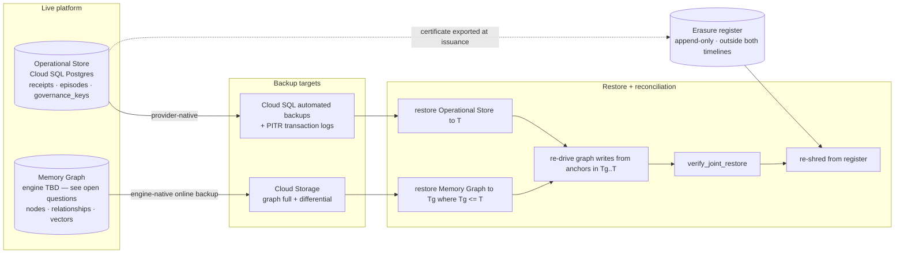
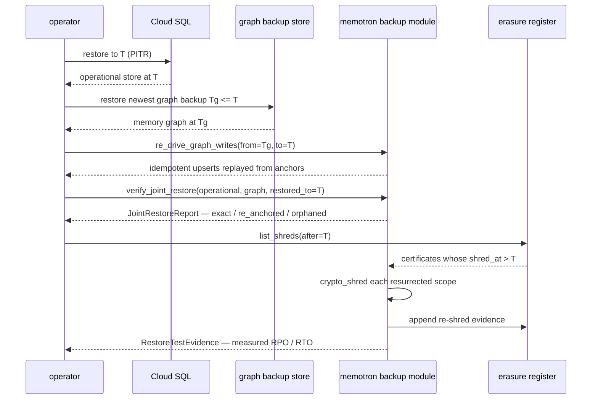

# Backup, restore, and erasure reconciliation

**Issue:** [#11](https://github.disney.com/jedai/memotron/issues/11) · **Status:** proposed · **Target:** August 3.08

## Problem

There is no backup of either store. `rg -i "backup|pg_dump|pgbackrest|wal_level|archive_command|pitr" src/ scripts/ .helm/ docs/` returns nothing on `main`. The deployed default is `MEMOTRON_GRAPH_PATH=:memory:`, or one 10Gi `ReadWriteOnce` PVC (`.helm/values-latest.yaml:143-149`) with no snapshot policy. Observable consequence: any instance loss is total memory loss, against a platform bar of at most six hours of data loss everywhere and, in production, recovery inside fifteen minutes.

A second, sharper consequence. `crypto_shred` ([`client.py:6455`](../../src/memotron/client.py)) erases a scope by emptying `governance_keys.wrapped_dek` (`graph.py:4342-4366` — an `UPDATE`, tombstoning the row in place), and `issue_erasure_certificate` ([`erasure.py:417`](../../src/memotron/erasure.py)) then certifies that erasure across four legs. Every leg is evaluated **against the live store only**. The moment a backup exists, the certificate overclaims: a backup taken before the shred holds both the ciphertext and the wrapped DEK, and restoring it makes the erased content readable again.

The KEK does not save us. It lives outside the database — `LocalKeyManager.from_file` (`crypto.py:215-231`) keeps it in a 0600 file beside the store, and production intent is KMS (`config.py:44`, marked `POC-CRYPTO`) — so a database backup contains only the *wrapped* DEK. But the KEK is not per-scope: one KEK wraps every scope's DEK, so it cannot be destroyed to erase one scope. A pre-shred backup plus the surviving KEK yields plaintext. **The recoverability window is therefore set by database backup retention alone**, and that is the number the certificate has to state.

### Scope boundary

This design covers the declaration, reconciliation, and proof. It does **not** implement backup: backups are provider-native (Cloud SQL automated backups plus PITR; the Memory Graph engine's own online backup to cloud storage). Memotron code declares the horizons, reconciles them against the backups that actually exist, computes the window, binds it into the certificate, and proves recovery by rehearsal.

## Data flow



The one-way arrow that matters: the certificate leaves the Operational Store timeline at issuance. A restore to `T` rolls back every receipt written after `T`, including the `CRYPTO_SHRED_KEY_DESTROYED` receipt of a shred performed after `T`. Deriving "which scopes must be re-shredded" from the restored store would therefore miss exactly the shreds the restore just undid — a silent un-erasure with no record that it happened. The register is what closes that hole.

## System design

### Where each piece lives, and why there

| Piece | Module | Why there rather than elsewhere |
|---|---|---|
| Declared horizons + window arithmetic | `backup/policy.py` (new) | Pure functions over frozen config. No infra, no I/O — the arithmetic is the part that must be provably right, so it is isolated from anything needing a cloud credential. |
| Declared-vs-actual reconciliation | `backup/inventory.py` (new) | Wraps a provider API behind a `BackupInventory` protocol. Composes over the policy; never embedded in it, so the arithmetic tests need no fake cloud. |
| Append-only erasure register | `backup/register.py` (new) | Must survive a restore of the store it describes, so it cannot live behind `StorageBackend`. Separate module because its durability requirement is the opposite of every other store's. |
| `recoverability` on the certificate | `erasure.py` (extend) | Erasure already owns the certificate and its digest. Extending it is correct; a parallel "certificate v2" would be a second source of truth. |
| Joint-restore consistency verifier | `backup/joint.py` (new) | Reads both planes through the `StorageBackend` contract only, so it is testable against two SQLite backends with no Postgres and no graph cluster. |
| Post-restore re-shred reconciliation | `backup/reshred.py` (new) | Computes the list from the register and composes over the existing `client.crypto_shred`. It decides *what*, never *how* — key destruction stays in one place. |
| Restore-test evidence | `backup/evidence.py` (new) | The evidence record outlives the test run and is read by audit, not by the restore path. |

`backup/` depends on `storage` (the `StorageBackend` seam from PR #35) and on `erasure`; nothing depends on `backup/` except the certificate field and the scheduled jobs.

### The recoverability window

For each independent backup timeline `i` (one per distinct store engine — **one** timeline if the graph plane runs on the same Postgres instance, two if #10 lands a separate engine):

```
H_i = max(full_backup_horizon_i, pitr_log_horizon_i)
unrecoverable_after = shred_at + max over i of H_i
```

`max`, not sum: the timelines are independent, so the scope becomes unrecoverable only once *every* timeline has aged past the shred instant.

Cloud SQL specifics, verified against the Admin API v1 reference (`instances.get` → `settings.backupConfiguration`):

- `pointInTimeRecoveryEnabled` (boolean)
- `transactionLogRetentionDays` (integer, **range 1–7** for PostgreSQL) → `pitr_log_horizon`
- `backupRetentionSettings.retainedBackups` (integer) and `.retentionUnit` (enum, `COUNT`)
- `enabled`, `startTime` (`HH:MM` UTC), `location`

Retention is expressed as a **count**, not a duration, so `full_backup_horizon = retainedBackups × backup_interval`. The interval comes from the declared policy, and the reconciliation proves it by observing actual backup spacing rather than trusting the declaration.

PITR is the binding constraint in practice: it lets a restore land at *any* instant in the log window, including the instant before the `UPDATE` that emptied `wrapped_dek`. The shred is an ordinary write and sits in the transaction log like any other.

### Joint restore, and what "consistent" can mean

PR #35's cross-store rule (`PERSISTENCE.md:100-107`) anchors every logical transaction in the Operational Store and makes graph writes idempotent upserts, so a graph that trails its anchor is recoverable by re-driving. But **DW-023** (`docs/operational-store-decisions.md:97-121`) bounds how exactly:

> if a graph **row is lost** while its anchor survives, re-driving the write recovers the memory's content under a *new* `uuid`, and the canonical state tuple binds the uuid — so the recovered scope hashes differently from what the receipt committed to.

So "the two stores come back consistent with each other" cannot mean state-hash equality with the pre-restore chain. It means a two-tier predicate:

- **Tier 1 — exact.** A scope whose graph rows all predate `Tg` is restored byte-for-byte: `upsert_node` keys on the normalised graph key and relationship updates are last-write-wins by uuid, so re-driving updates in place. `graph_state_hash` equals the hash committed by the last receipt at or before `Tg`.
- **Tier 2 — content-equivalent, re-anchored.** A scope with writes in `(Tg, T]` comes back with the same truth slots (canonical subject / predicate / object, memory type, active status) under **new uuids**. Per DW-023 it must be re-anchored with a fresh receipted bracket and cannot be verified against its pre-loss chain. This is a reported outcome, not a failure.
- **Inconsistent.** An anchor in the Operational Store at or before `T` with no content-equivalent graph row after re-driving. This is the only failing case.

Naming tier 2 as expected-and-reported rather than as an error is the whole point: without it, every honest joint restore looks like a failed one.

### Joint restore sequence



## Contracts

| Symbol | Signature | Behaviour |
|---|---|---|
| `BackupHorizon` | frozen model: `store: str`, `mechanism: str`, `horizon: timedelta` | One timeline's reach. `mechanism` is `full_backup` or `pitr_log`. |
| `BackupPolicy` | frozen model: `environment: str`, `horizons: tuple[BackupHorizon, ...]`, `backup_interval: timedelta` | Declared per environment. Empty `horizons` is legal and means no retained backups. |
| `recoverability_window` | `(policy: BackupPolicy, *, shred_at: datetime) -> RecoverabilityWindow` | Pure. `max` over horizons. Empty horizons → `unrecoverable_after == shred_at`, `bound_by == "no_retained_backups"`. |
| `RecoverabilityWindow` | frozen model: `shred_at: datetime`, `unrecoverable_after: datetime`, `bound_by: str`, `horizons: tuple[BackupHorizon, ...]`, `reconciled_at: datetime` | The field added to the certificate. `bound_by` names the timeline that set the bound. |
| `BackupInventory` | Protocol: `list_backups(store: str) -> tuple[BackupRecord, ...]`, `declared_retention(store: str) -> tuple[BackupHorizon, ...]` | Provider seam. Implementations: `CloudSqlBackupInventory`, `ObjectStoreBackupInventory`, `FakeBackupInventory`. |
| `reconcile` | `(policy: BackupPolicy, inventory: BackupInventory, *, now: datetime) -> ReconciliationResult` | Fails when the declared horizon exceeds what the provider actually retains, or when observed backup spacing exceeds `backup_interval`. |
| `ReconciliationResult` | frozen model: `satisfied: bool`, `findings: tuple[str, ...]`, `observed: tuple[BackupHorizon, ...]` | `findings` name the store and mechanism; never a bare boolean. |
| `ErasureRegister` | Protocol: `append(certificate: ErasureCertificate) -> str`, `list_shreds(*, after: datetime) -> tuple[RegisteredShred, ...]` | Append-only, outside both store timelines. `append` returns the external object id. |
| `issue_erasure_certificate` | `(graph, *, scope_key: str, policy: BackupPolicy, inventory: BackupInventory, register: ErasureRegister, now: datetime \| None = None) -> ErasureCertificate` | **Changed.** Gains a fifth fail-closed leg: an unsatisfied `ReconciliationResult` raises `ErasureVerificationError` rather than issuing a certificate stating a window the backups do not support. |
| `ErasureCertificate.recoverability` | `RecoverabilityWindow` (required) | New field, and added to `_certificate_body()` so `certificate_digest` covers it. |
| `verify_erasure_certificate` | `(graph, *, certificate: ErasureCertificate, inventory: BackupInventory) -> bool` | **Changed.** Re-checks the window against the current inventory as a fifth leg. |
| `verify_joint_restore` | `(operational: OperationalStorage, graph: MemoryGraphStorage, *, restored_to: datetime) -> JointRestoreReport` | Reads both planes through the PR #35 contract only. |
| `JointRestoreReport` | frozen model: `exact_scopes: tuple[str, ...]`, `re_anchored_scopes: tuple[str, ...]`, `orphaned_anchors: tuple[str, ...]`, `consistent: bool` | `consistent` is `not orphaned_anchors`. Tier 2 does not fail it. |
| `pending_reshred` | `(register: ErasureRegister, *, restored_to: datetime) -> tuple[RegisteredShred, ...]` | Shreds whose `shred_at > restored_to`, i.e. resurrected by the restore. |
| `RestoreTestEvidence` | frozen model: `test_uuid`, `environment`, `store`, `method`, `started_at`, `finished_at`, `restored_to`, `measured_rpo: timedelta`, `measured_rto: timedelta`, `report: JointRestoreReport \| None`, `passed: bool`, `evidence_digest: str` | Recorded whether or not the test passed. A failure that leaves no evidence is the failure mode this record exists to prevent. |

### The digest trap

`certificate_digest` is computed over a hand-built dict in `_certificate_body()` (`erasure.py:167-190`), not over the model instance. Adding a field to `ErasureCertificate` therefore does **not** put it in the digest automatically. `recoverability` must be added to `_certificate_body()` at both call sites — issuance (`erasure.py:451-461`) and re-verification (`erasure.py:494-506`) — or the window is unsigned and tamperable while every test still passes. Unit 4's test asserts the negative directly: mutate the field, expect verification to fail.

## Units

Each unit leaves the repo green. `int` is the integration test.

**1 — declared horizons and window arithmetic** · module `src/memotron/backup/policy.py`
- in: `BackupPolicy`, `shred_at`
- out: `RecoverabilityWindow`
- unit: parametrised over single-timeline, split-timeline, PITR-exceeds-full-backup (PITR must win), and empty-horizons (`unrecoverable_after == shred_at`, `bound_by == "no_retained_backups"`); asserts `max`-not-sum by constructing two horizons whose sum would exceed the correct answer
- int: load each committed per-environment policy from config, assert it parses and yields a window inside the platform's six-hour RPO bar

**2 — declared-vs-actual reconciliation** · module `src/memotron/backup/inventory.py`
- in: `BackupPolicy`, `BackupInventory`, `now`
- out: `ReconciliationResult`
- unit: `FakeBackupInventory` — declared 7-day retention with newest backup 9 days old → `satisfied is False` with a finding naming store and mechanism; declared PITR 7d against a provider reporting `transactionLogRetentionDays=3` → unsatisfied; observed spacing exceeding `backup_interval` → unsatisfied
- int: `CloudSqlBackupInventory` against a recorded `backupRuns.list` + `instances.get` response fixture, no live API call

**3 — append-only erasure register** · module `src/memotron/backup/register.py`
- in: `ErasureCertificate`
- out: an external object id; `list_shreds(after=...)` enumerates
- unit: append two certificates, assert `list_shreds` ordering and `after` filtering; assert a second `append` of the same `certificate_uuid` is rejected rather than duplicating
- int: append against a local object-store fake, restore the Operational Store to a point before the append, assert the register still enumerates the shred

**4 — the certificate states its window** · module `src/memotron/erasure.py`
- in: `issue_erasure_certificate` with policy, inventory, register
- out: `ErasureCertificate.recoverability` populated, covered by `certificate_digest`, exported to the register
- unit: assert `unrecoverable_after == shred_at + horizon`; **tamper the field and assert `verify_erasure_certificate` returns False** (proves digest coverage); assert an unsatisfied `ReconciliationResult` raises `ErasureVerificationError` and returns no certificate
- int: extend `test_gate_erasure_certificate_lifecycle` (`tests/test_erasure.py:356`) reusing `_scope` / `_config` / `_client` / `_ingest_and_form` — shred, issue, verify all five legs, confirm the register holds the certificate

**5 — joint-restore consistency verifier** · module `src/memotron/backup/joint.py`
- in: an `OperationalStorage`, a `MemoryGraphStorage`, `restored_to`
- out: `JointRestoreReport`
- unit: two SQLite backends — scope A entirely pre-`Tg` → `exact_scopes`, hash equals the receipted hash; scope B with a post-`Tg` relationship absent from the graph → `re_anchored_scopes`, uuid divergence expected, `consistent is True`; scope C with an anchor and no content-equivalent row → `orphaned_anchors`, `consistent is False`
- int: the rehearsal — restore a real pair, re-drive `(Tg, T]`, run the verifier, assert `consistent`

**6 — post-restore re-shred reconciliation** · module `src/memotron/backup/reshred.py`
- in: `ErasureRegister`, `restored_to`
- out: the scopes whose keys the restore resurrected
- unit: register holding shreds at `T-1h` and `T+1h`, restore to `T` → only the `T+1h` shred is returned; assert a scope whose `governance_key_state["shredded"]` is already true post-restore is excluded
- int: shred a scope, restore to before the shred, assert the key is live again, run re-shred, assert `governance_key_state["shredded"]` is true and a fresh `CRYPTO_SHRED_KEY_DESTROYED` receipt exists

**7 — restore-test evidence record** · module `src/memotron/backup/evidence.py`
- in: a completed restore test
- out: `RestoreTestEvidence` written to a known path and its digest appended to the receipt ledger
- unit: record → read back, digest stable across a round trip; a failed test records `passed=False` rather than raising
- int: the scheduled job writes evidence and a later reconciliation reads the most recent record per environment

**8 — backup configuration and the scoped-out demo disk** · module `.helm/`
- in: `values-<env>.yaml`
- out: Cloud SQL `backupConfiguration` values rendered per environment; a graph-backup CronJob template (**blocked on #10** — the template lands with the driver behind it, disabled by default); the demo PVC asserted out of scope
- unit: `helm template` renders the CronJob only when `graphBackup.enabled`
- int: render every values file, assert `persistence.mountApi` is false in all of them, so no tenant memory can reach the demonstration disk

**9 — runbook and measured figures** · module `docs/operations/backup-restore.md`
- in: the rehearsals from units 5 and 7
- out: the restore runbook, plus the RPO/RTO actually achieved per environment per store, and the recoverability window per environment
- unit: n/a (documentation)
- int: the document's figures are the evidence records from unit 7, cited by `test_uuid`, not retyped by hand

## Done when

- `uv run pytest -x -q` exits 0
- `rg -n "recoverability" src/memotron/erasure.py` shows the field present in both the model and `_certificate_body`
- A restore has been performed and documented for **both** stores: two `RestoreTestEvidence` records exist with `passed=True` and distinct `store` values, cited in `docs/operations/backup-restore.md`
- A joint restore has been rehearsed: one evidence record carries a `JointRestoreReport` with `consistent=True` and `orphaned_anchors == ()`
- The erasure certificate states its window and the window is true of the backups that exist: `verify_erasure_certificate` passes all five legs against a live inventory, and tampering `recoverability` makes it fail
- An unsatisfied reconciliation refuses to issue: the `ErasureVerificationError` path is covered by a test
- `rg -n "mountApi: true" .helm/` returns no matches — the demonstration disk is out of scope by construction, not by assertion
- `docs/operations/backup-restore.md` states an RPO figure inside six hours for every environment and store, and names the RTO for the DR path separately from the HA failover path
- No file outside `src/memotron/backup/`, `src/memotron/erasure.py`, `tests/`, `.helm/`, and `docs/` is modified

## Rejected

- **Treat the two stores' backups independently, with no joint restore.** Rejected: the stores are not independent. The cross-store rule makes the graph a trailing derivative of the Operational Store anchor, so an Operational Store restored to `T` against a graph restored to `Tg` is only correct after re-driving `(Tg, T]`. Independent backups would each verify green while the pair was incoherent, and would have foreclosed ever stating a single RPO for "the platform" rather than two per-store numbers that do not compose.
- **Trust that the backup exists — monitor the backup job and skip the restore test.** Rejected: a backup that has never been restored is an untested code path with a compliance claim attached to it. The specific thing monitoring cannot catch is the one this design turns on: whether a restored pair is *mutually consistent*, which is invisible until both halves are actually restored together.
- **Per-scope or per-tenant restore granularity.** Rejected as the primary path: Cloud SQL PITR restores an instance, not a row, and the graph engine's backup is per-database. Attempting per-tenant restore would mean a logical export/import path in Memotron code, which is a second persistence implementation to keep correct. It is retained as a *derived* capability — restore to a side instance, then read the wanted scope out through `StorageBackend` — which is exactly what the erasure re-shred path needs and no more.
- **Sum the retention horizons instead of taking the max.** Rejected as simply wrong: the timelines are concurrent, not sequential. Summing would overstate the window and make the certificate claim a later unrecoverability date than the truth — the one direction of error a compliance artefact must not make.
- **Leave `recoverability` out of `certificate_digest`.** Rejected: the window would be freely editable on a certificate that still verifies, which is worse than not stating it. Note that the existing exclusions (`certificate_uuid`, `issued_at`) are deliberate and stay excluded; the window is a claim, not an identifier.
- **Destroy or rotate the KEK to shorten the window.** Rejected: one KEK wraps every scope's DEK, so destroying it erases every scope at once. It cannot be a per-scope tool, and offering it as one would foreclose the whole envelope design.
- **Derive the post-restore re-shred list from the restored store.** Rejected — this is the design's central finding. A restore to `T` rolls back the `CRYPTO_SHRED_KEY_DESTROYED` receipts of shreds performed after `T`, so the restored store's own record of what was erased is exactly the record the restore destroyed. The register must sit outside both timelines.
- **Implement backup inside Memotron — a `pg_dump` sidecar and a graph export job.** Rejected: it reimplements what the managed provider already does with better durability guarantees, and a logical dump cannot give PITR. Memotron's job is the part no provider can do — reconciling erasure against retention.
- **Keep the demonstration disk in backup scope.** Rejected: it holds regenerated demo data, `mountApi` is false so no tenant memory reaches it, and backing it up would put demo content under the same retention claims as real memory. It is scoped out explicitly, and unit 8's integration test asserts the absence that makes the exclusion safe.
- **Wait for #28 before starting.** Rejected: units 1–7 and 9 are engine-independent. Only unit 8's graph CronJob and the graph RTO figure depend on #10/#28. Blocking the whole issue would leave the erasure claim overclaiming for the entire duration of a vendor negotiation.

## Risks and open questions

### Needs a decision from a human

1. **Which engine is the Memory Graph?** The issue says Neo4j Enterprise, and #10 says Neo4j was chosen over FalkorDB for horizontal scale. But `docs/operational-store-decisions.md:164-173` (PR #35) says the opposite in a section titled *Correction to the issue text*: DW-001 "names **FalkorDB** and explicitly rejects Neo4j, and records that adoption is itself undecided pending the SSPLv1 legal ruling", with Postgres + pgvector as the working plan of record. This is not a detail — it changes how many backup timelines exist. If the graph plane stays on the same Postgres instance there is **one** timeline, joint restore collapses into a single PITR restore, and tier-2 divergence cannot arise. If #10 lands a separate engine there are two. The design absorbs either through the `BackupHorizon` set and a graph-backup driver seam, but the RTO figure and the cluster-member question below cannot be answered until this is settled.
2. **Does the fifteen-minute production RTO refer to the DR path or the availability path?** Restore-from-backup will not meet it at any realistic data size; regional HA failover will. These are different mechanisms with different failure coverage — failover does not protect against logical corruption, restore does. The design documents both figures separately, but which one the four-nines availability class is claiming against needs confirming before the runbook states it.
3. **Who owns the erasure register bucket, and is object retention lock acceptable?** The register's whole value is that it cannot be rolled back with the store. That wants write-once semantics and an owner outside the Memotron deployment's own blast radius.

### Hard to verify

- **What a Memory Graph restore does to cluster members** is unanswerable today. #28 confirms the capability is Enterprise-gated — "the free community edition does not include clustering, online backups, or role-based access control" — but there is no cluster to measure, no engine decision (see above), and no `neo4j` or `falkor` dependency in `pyproject.toml`. Writing specific restore-CLI invocations now would be planning against unverified tooling for a possibly-irrelevant engine. Unit 8 lands the driver seam; the figure and the restore-one-member-versus-rebuild-the-cluster answer are explicitly deferred to #10 and must not be guessed in the runbook.
- **Exact `BackupRun` field names** must be verified against the installed client library at implementation time. `GET https://sqladmin.googleapis.com/v1/projects/{project}/instances/{instance}/backupRuns` and the `backupConfiguration` fields above are verified from the current API reference; the per-run field schema was not on the pages fetched.
- **`transactionLogRetentionDays` caps at 7 for PostgreSQL**, so the PITR contribution to the window cannot exceed a week. If a longer recoverability window is ever required for policy reasons, it has to come from full-backup retention, and the arithmetic in unit 1 already handles that — but the reverse is worth stating plainly: the window can never be *shorter* than the PITR log horizon, whatever the retention policy says.

### Breaking change

Adding a required field to the certificate body changes `certificate_digest` for the same underlying facts, so **certificates issued before this change can no longer be re-verified** and must be re-issued. Blast radius is small and worth stating precisely: certificates are not persisted anywhere — only the digest, on the `ERASURE_CERTIFICATE_ISSUED` receipt (`client.py:6601`) — and `crypto_shred` / `erasure_certificate` / `verify_erasure` have **no MCP or admin-server surface** (zero hits across `mcp_server.py`, `agent_memory_mcp.py`, `admin_server.py`). The only non-test caller in the repo is `examples/fleet_simulation.py:1270,1305-1306`.

### Naming collision to avoid in review

`restore` and `archive` already mean something else in this codebase, and conflating them would be an easy review error. `PruneGhost` / `graph.restore_prune_ghost` (`graph.py:1533`) and `archive_tier` / `archive_ttl_seconds` are the **pruning and retention** mechanism — bringing one individually pruned fact back into context. Nothing in this design touches them. DW-021's revive-on-read decision is likewise a retrieval-semantics concern, not a backup one.
