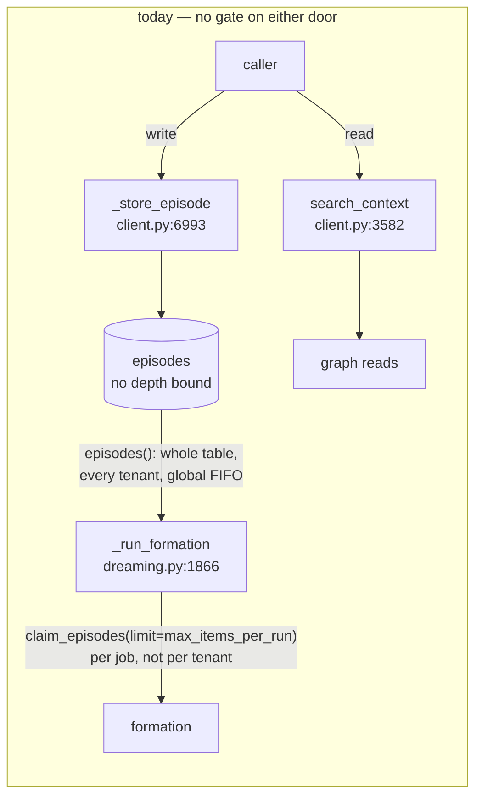
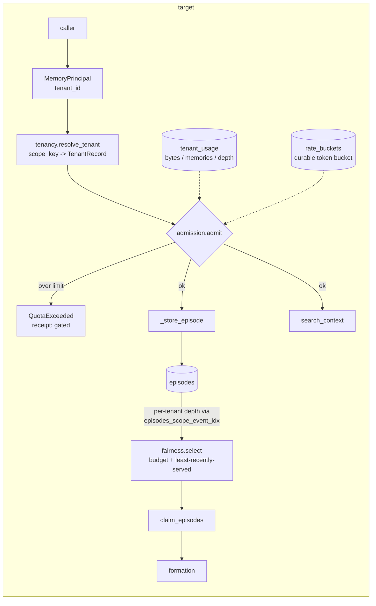
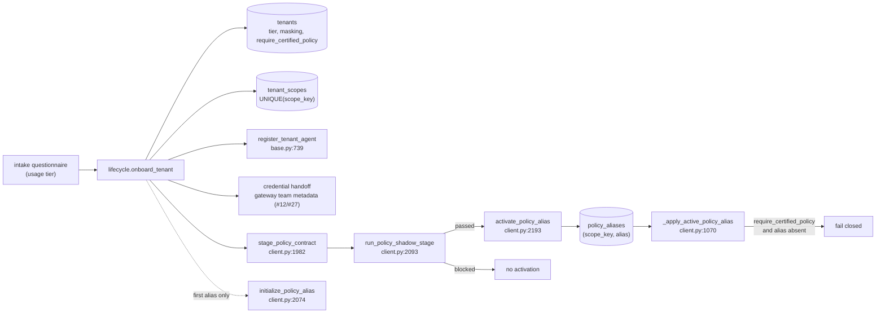
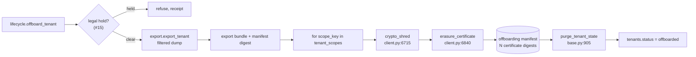
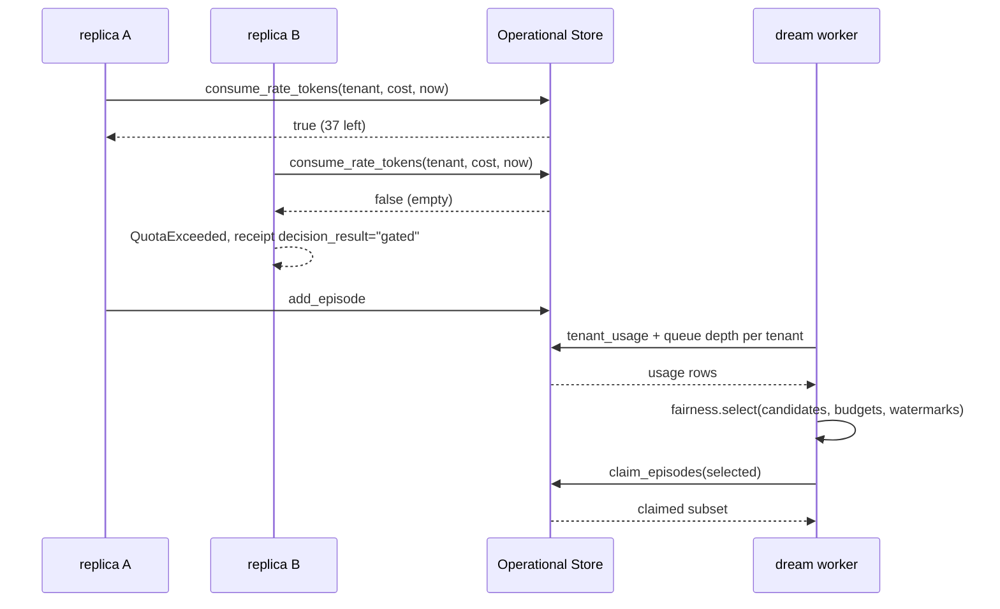

# Tenancy: quotas, backpressure, and tenant lifecycle

**Issue:** [#14](https://github.disney.com/jedai/memotron/issues/14) · **Status:** proposed · **Target release:** August 3.08 (LATEST by Mon Aug 17, 2026)

> ## Read this first: the baseline this design is written against
>
> Every `file:line` below was verified against the local working branch **`feat/next-ws25-ws28`** at **`f7ddd77`** ("Integrate documentation sweep for WS-25..28 + #35"), which is **110 commits ahead of the pushed `origin/main`** (`9bfc298`), differing in **160 files**. That branch contains local `main` (`80be544`) as an ancestor but is 15 `src/` files further on — including `client.py`, `dreaming.py`, `config.py`, `agent_memory.py`, `admin_server.py`, and `storage/sqlite.py`, all cited below — so `f7ddd77`, not `main`, is the baseline these line numbers describe. This document is cut from `origin/main` so that it is docs-only; its citations therefore describe a tree that is not yet on the remote.
>
> Absent from `origin/main` entirely: `gateway.py`, `context.py`, `health.py`, `migration.py`, `retrieval.py`, `synthesis.py`, `transcripts.py`, `epochs.py`, and the `claim_episodes` / `claim_scope_work` / `release_dream_claims` implementations (on `origin/main` those three exist only as a documented *reserved surface* in `storage/base.py:376-385`). Implementing #14 is gated on those 110 commits reaching `origin/main` first, exactly as #15, #17, and #18 record for their own smaller drifts. Line numbers will have shifted; re-verify before starting.
>
> **One thing is different for this design and it matters.** #15, #17, and #18 were written before PR #35 merged and therefore cite `graph.py` and add tables by editing its `_migrate`. #35 **is** `origin/main` (`9bfc298`). So every new store method here lands on the `OperationalStorage` ABC (`storage/base.py`), is implemented **twice** (`storage/sqlite.py` and `storage/postgres/_operational.py`), and appends a numbered migration to `MIGRATIONS` in `storage/postgres/_migrations.py:630` — with no down path, deliberately. `tests/test_storage_backend.py` forces each onto the ABC and `tests/test_storage_backend_parity.py` forces the twin. The units below are shaped around that, not around `graph.py`.
>
> **Two ticket IDs the issue cites.** `DW-016` appears in code (`storage/postgres/_policy.py:1,19,348`; `PERSISTENCE.md:38`) — the mechanism is real and this design reuses it. `DW-013` appears **nowhere** in the repository. Both are decision-log IDs on the SSO-gated portal, which is unreachable from here; the masking findings below come from reading `redaction.py` and its call sites, not from DW-013.
>
> **The target date has passed.** Today is 2026-08-25; the issue asked for LATEST by 2026-08-17. Phasing below is therefore explicit about which phase alone satisfies which acceptance line, so a partial landing is still a defensible landing.

## Problem

Nothing in Memotron is metered, and nothing is attributable to a tenant.

`rg -i "quota|throttl|backpressure|rate_limit|token.?bucket|max_concurrent" src/memotron/` returns two prose docstrings and no code: `gateway.py:99` (about an external provider's quota) and `storage/postgres/__init__.py:6`, which lists "quota counters and tenant policy" as territory the Operational Store *intends* to own. There is no `asyncio.Semaphore`, `asyncio.gather`, `asyncio.TaskGroup`, or `asyncio.Queue` anywhere in `src/`.

The deeper problem is upstream of that. **A scope cannot be attributed to a tenant from stored data.** `MemoryScope` is `(kind, scope_id)` and its `key` is `f"{kind}:{scope_id}"` (`models.py:204-218`) — there is no `tenant_id` field, and `Episode` has none either (`models.py:221-232`). The only persisted tenant fact is `tenant_agents(tenant_id, agent_id, …)` (`storage/sqlite.py:3308`), so `tenant:<id>` and `agent:<agent_id>` scopes are attributable and `customer:wdw:pinnacle-events` and `user:alice` are not. `TenantMemoryPolicy` (`config.py:3351`), which *does* carry a `scopes` tuple, is an in-process pydantic object handed to `MemoryControlPlane(tenants=…)` and is never persisted — it is rebuilt per process and mutated live by `model_copy` (`admin_server.py:1218-1225`).

Every one of #14's seven scope bullets is a sentence containing the phrase "this tenant's". None of them can be written as code until that phrase resolves. That is unit 1.

Observable consequence today: a caller can `add_episode` without bound (`storage/sqlite.py:1160-1172` is a bare `INSERT`, no count check, no size check, no CHECK constraint, no trigger), and every subsequent maintenance run pays for it — `_run_job_and_record` (`client.py:7364-7382`) passes `self.graph.episodes()`, the **entire** episode table across every tenant, into **every** job run, which then filters in Python. `episodes()` is `SELECT payload_json FROM episodes ORDER BY created_at, uuid` (`storage/sqlite.py:1183`) — unfiltered, unlimited, global FIFO. One tenant that enqueues 100k episodes owns the head of that ordering and consumes the whole `DreamJob.max_items_per_run` budget (default 1000, `config.py:3632`) on every tick. Every other tenant waits.

## What already exists (do not re-scope)

| Concern | Where | State |
|---|---|---|
| Certified policy rollout (stage → certify → shadow → activate → rollback) | `storage/base.py:661-735`, `client.py:1982/2074/2093/2193/2228/2260`, `certification.py:1870` | **Complete and atomic.** Reuse verbatim. See the gap below. |
| Masking strategies | `redaction.py:68` `RedactionStrategy{REDACT, MASK_LAST_4, SHA256_HASH}`; `Redactor` `:98` | Exist. Selectable via `GovernancePolicy.redaction_strategy` (`config.py:105`). |
| Cross-process work claims | `storage/sqlite.py:1286/1333/1368`, table `dream_claims` `:3068` | **SQLite only.** No Postgres twin; `storage/base.py:376-385` reserves them. |
| Per-scope episode index | `episodes_scope_event_idx` — `storage/sqlite.py:3051`, `postgres/_migrations.py:88` | **Already an expression index on `(scope.kind, scope.scope_id, …)` in both engines.** Queue depth per scope is already indexable. |
| Tenant id enumeration | `known_tenant_ids()` `storage/sqlite.py:4153-4182` (DISTINCT union over six tenant-keyed tables) | SQLite only, not on the ABC. |
| Crypto-shred + erasure certificate | `client.py:6715/6840/6869`, `erasure.py:124-148` | Complete, **per `scope_key`**, four fail-closed legs. |
| Tenant reset | `purge_tenant_state` `storage/base.py:905-919` | Resets *generated* state, explicitly **"without deleting raw episodes"**. Not an erase. |
| Whole-store export | `export_graph()` `client.py:7159`; `MemoryGraphStorage.export()` `storage/base.py:350` | Unfiltered, and **fails closed** under a scope guard (`client.py:7180`). |
| Receipt attribution | `MemoryReceipt` carries `tenant_id` and `scope_key` (`storage/receipts.py:477-544`) | Ready. `RUN_KINDS` already has `"operator"` — reuse it, do not add a run kind. |
| Refusal vocabulary | `DECISION_RESULTS` (`storage/receipts.py:57`) contains `"gated"`, already in `NON_MATERIALIZING_RESULTS` | A quota refusal **is** a gate. Do not add a result. |

### Three gaps that are narrower than the issue implies

**1. The gateway is not a rate limiter.** `gateway.py` is endpoint constants plus `gateway_request_with_retry` (`:155`) — reactive retry of one already-issued outbound request, `{408,409,425,429,500,502,503,504}` (`:98`). It holds no counter, has no tenant parameter, imports nothing from the storage layer, and does not distinguish 429 from 503. The issue's "the gateway can cap how fast a caller sends requests" refers to the **JedAI LiteLLM front door** — issue #12, Blocked — not to any Memotron code. All four limit dimensions are net-new here.

**2. "How many maintenance jobs may run at once" is 1 on one path and unbounded on another.** `run_due_dreams` is `for job in engine.due_jobs(): await …` (`client.py:1206-1214`) — strictly sequential. `local_platform.py:42-63` is a sequential `for agent_id in agent_ids` loop on one background thread. #17 pins `replicas: 1`. But `POST /api/dream-sequence/run` spawns a raw `threading.Thread` per request (`admin_server.py:2126-2139`) with a single-flight guard keyed **per tenant** in a process-local dict under one `Lock` (`:1036`, `:2363-2391`) — so N tenants trigger N unbounded OS threads, invisible to a second replica. So this bullet is two different fixes: a per-tenant *share of a sequential sweep* (which is the fair-scheduling bullet, not a separate one) and a real cap on the admin path.

**3. The certified rollout is opt-in and Motive-only.** `_apply_active_policy_alias` (`client.py:1070-1081`) opens with `if alias_state is None: return policy` — **a scope with no `production` alias runs whatever the control-plane chain resolved, uncertified, with no record that it was uncertified.** When an alias does exist it overrides only `motive` / `memory_bank`. Meanwhile `configure_project_memory` (`agent_memory.py:1504-1555`) calls `save_project_memory_config` and then `apply_project_memory_config_to_client` — activation, immediately, no staging, no shadow, no rollback. `set_tenant_prompt_override` (`:1718`) and `save_tenant_prompt_version` (`:1739`, `admin_server.py:2004`) do the same. So "an uncertified policy never takes effect" is **false today**, and the fix is a gate plus three re-routings, not a new rollout mechanism.

## Data flow

### 1 — request → quota check → queue admission → maintenance scheduling





The two things to read off this: admission is **one** gate consulted by both the write door and the read door, and fairness is applied to the **candidate list before the claim**, which makes it a pure function of `(episodes, budgets, watermarks)` and therefore testable without a store.

### 2 — onboarding → policy certification → activation



### 3 — offboarding → export → erasure



`purge_tenant_state` runs **last and is not the erasure** — it resets generated state without deleting raw episodes. The erasure is N per-scope crypto-shreds, because `ErasureCertificate` is scope-shaped (`erasure.py:124-148`) and one KEK wraps every scope's DEK, so there is no tenant-level key to destroy. The manifest binds the N certificate digests to one offboarding event; the certificates themselves keep their existing shape, which #11 is already changing.

## System design



| Piece | Lives in | Why there rather than elsewhere |
|---|---|---|
| `tenants`, `tenant_scopes`, `rate_buckets` tables; `tenant_usage`; promoted `known_tenant_ids` | `src/memotron/storage/` | `values-latest.yaml` runs `MEMOTRON_GRAPH_PATH: ":memory:"` with `replicaCount: 2`. Any counter or bucket held in a process is per-replica and therefore wrong. `storage/postgres/__init__.py:6` already names "quota counters" as this package's territory. The ABC + two engines is one seam, not three modules. |
| `tenancy.py` | new | Pure resolution over a `TenantSource` Protocol. Nothing else in the tree may guess a scope's tenant, and this is the only module allowed to answer. |
| `quotas.py` | new | Pure model and arithmetic — tiers, limits, verdicts. No I/O, no clock, no store. Parametrised unit tests over the whole limit lattice with zero fixtures. |
| `admission.py` | new | **Wraps** the write and read doors rather than being inserted into them. Takes `TenantSource`, `UsageSource`, `RateLimiter` as Protocols, so a fake replaces the store wholesale. |
| `fairness.py` | new | Pure `(candidates, budgets, watermarks) -> ordered subset`. Deliberately not in `dreaming.py`: the starvation bug is in a *selection*, and a selection that needs a store to test is a selection nobody will test. |
| Call-site wiring | `client.py`, `dreaming.py`, `admin_server.py` | One unit per file, each a handful of lines, each integration-tested. Kept out of the modules above so the logic stays fake-testable. |
| `export.py` | new | Composes `MemoryGraphStorage` reads under a scope filter. Must work *under* a principal, unlike `export_graph`, which fails closed. |
| `lifecycle.py` | new | Orchestration only — it calls `register_tenant_agent`, `stage_policy_contract`, `crypto_shred`, `erasure_certificate`, `purge_tenant_state`. It contains no erasure logic and no policy logic of its own. |

Nothing here modifies `MemoryScope`, `Episode`, `ErasureCertificate`, `redaction.py`, `certification.py`, or `retrieval.py`.

## Contracts

| Symbol | Signature | Behaviour |
|---|---|---|
| `TenantRecord` | frozen pydantic: `tenant_id, display_name, usage_tier: UsageTier, status: TenantStatus, masking_strategy: RedactionStrategy \| None, require_certified_policy: bool, created_at, offboarded_at: datetime \| None` | The persisted tenant. First single-row home for per-tenant operator settings. |
| `OperationalStorage.register_tenant` | `(*, tenant_id: str, display_name: str, usage_tier: str, now: datetime) -> dict[str, Any]` | Upsert; re-registering an `offboarded` tenant raises `ValueError`. |
| `OperationalStorage.tenant_record` | `(tenant_id: str) -> dict[str, Any] \| None` | |
| `OperationalStorage.set_tenant_settings` | `(*, tenant_id: str, usage_tier: str \| None = None, masking_strategy: str \| None = None, require_certified_policy: bool \| None = None, now: datetime) -> dict[str, Any]` | Partial update; `None` leaves a field alone. |
| `OperationalStorage.bind_tenant_scope` | `(*, tenant_id: str, scope_key: str, purpose: str, now: datetime) -> dict[str, Any]` | `UNIQUE(scope_key)` — a second tenant claiming a bound scope raises `ValueError`. |
| `OperationalStorage.tenant_scope_keys` | `(tenant_id: str) -> tuple[str, ...]` | Registration order. |
| `OperationalStorage.scope_tenant` | `(scope_key: str) -> str \| None` | The reverse lookup every gate needs. |
| `OperationalStorage.known_tenant_ids` | `(self) -> tuple[str, ...]` | **Promoted onto the ABC**; gains a Postgres twin. Union now also includes `tenants`. |
| `UsageTier` | `StrEnum{PILOT, STANDARD, HIGH_VOLUME}` | Named tiers only. A tier maps to a `TenantQuota`; a per-tenant override is a `TenantQuota` stored on the tenant row's settings, not a fourth tier. |
| `TenantQuota` | frozen pydantic: `stored_bytes_max: int, active_memories_max: int, queue_depth_max: int, sweep_items_max: int, retrieval_rate_per_minute: int, retrieval_burst: int` | Every field `gt=0`. `quota_for_tier(tier) -> TenantQuota`. |
| `QuotaUsage` | frozen pydantic: `tenant_id, stored_bytes, active_memories, queue_depth, measured_at` | |
| `QuotaVerdict` | frozen dataclass: `admitted: bool, breached: tuple[QuotaDimension, ...], headroom: dict[QuotaDimension, int]` | Reports **every** breached dimension, not the first — an operator needs the whole picture. |
| `quotas.evaluate` | `(usage: QuotaUsage, quota: TenantQuota) -> QuotaVerdict` | Pure. No clock, no store, no rate dimension (rate is not a count). |
| `OperationalStorage.tenant_usage` | `(*, scope_keys: Sequence[str], now: datetime) -> dict[str, Any]` | `SUM(length(payload_json))` over `episodes` and `COUNT(*)` over context-visible relationships, both driven by the **existing** `episodes_scope_event_idx` / scope indexes. No new table, no generated column. |
| `OperationalStorage.consume_rate_tokens` | `(*, bucket_key: str, cost: int, capacity: int, refill_per_minute: int, now: datetime) -> bool` | One-statement atomic lazy-refill token bucket in `rate_buckets`; `false` means refused. The bucket is in the store because two replicas share no memory. |
| `TenantSource` | Protocol: `scope_tenant(scope_key) -> str \| None`; `tenant_record(tenant_id) -> dict \| None`; `tenant_scope_keys(tenant_id) -> tuple[str, ...]` | The only store surface `tenancy.py` may touch. |
| `tenancy.resolve_tenant` | `(source: TenantSource, *, scope_key: str) -> TenantRecord` | Raises `UnknownTenantScope` for an unbound scope. Fail closed: an unattributable scope is never admitted. |
| `tenancy.effective_masking_strategy` | `(record: TenantRecord, governance: GovernancePolicy \| None) -> RedactionStrategy` | Tenant row wins over `GovernancePolicy.redaction_strategy` when set; otherwise the existing default is preserved byte-for-byte. |
| `UsageSource` | Protocol: `tenant_usage(*, scope_keys, now) -> dict[str, Any]` | |
| `RateLimiter` | Protocol: `consume(*, bucket_key, cost, capacity, refill_per_minute, now) -> bool` | |
| `admission.AdmissionGate` | `(*, tenants: TenantSource, usage: UsageSource, limiter: RateLimiter, receipts: ReceiptLedger)` | |
| `AdmissionGate.admit_write` | `(*, scope_key: str, payload_bytes: int, now: datetime) -> Admitted` | Raises `QuotaExceeded(verdict)`; emits `TENANT_QUOTA_REFUSED` with `decision_result="gated"` under `run_kind="operator"`. |
| `AdmissionGate.admit_read` | `(*, scope_key: str, cost: int = 1, now: datetime) -> Admitted` | Rate dimension only. Same refusal shape. |
| `QuotaExceeded` | `ValueError` subclass; `.verdict: QuotaVerdict`, `.tenant_id: str` | `ValueError` so every documented "transient failures surface as `ValueError`" caller contract is unchanged. |
| `fairness.TenantBudget` | frozen dataclass: `tenant_id: str, items: int, last_served_at: datetime \| None` | |
| `fairness.select` | `(candidates: Sequence[Episode], *, budgets: Mapping[str, TenantBudget], tenant_of: Callable[[str], str \| None], total_items: int) -> tuple[Episode, ...]` | Round-robin over tenants in least-recently-served order, each capped at its `items` budget, stable within a tenant by `(created_at, uuid)`. An unattributable episode is excluded and reported, never silently taken. Pure. |
| `export.ExportFilter` | frozen pydantic: `tenant_id: str \| None, scope_keys: tuple[str, ...], entity_names: tuple[str, ...], include_episodes: bool = True, include_receipts: bool = False` | An empty filter is refused, not treated as "everything". |
| `export.export_memory` | `(client: Memotron, *, filter: ExportFilter, now: datetime) -> ExportBundle` | Honours `authorized_scope_keys` instead of failing closed; sealed content emerges as the existing `SHREDDED_CONTENT_PLACEHOLDER` when the DEK is gone. |
| `ExportBundle` | frozen pydantic: `filter, nodes, relationships, episodes, manifest_digest: str, exported_at` | `manifest_digest` = sha256 over the canonicalised body, so an export can be shown to be the one that was handed over. |
| `lifecycle.onboard_tenant` | `(client: Memotron, *, request: OnboardingRequest, now: datetime) -> OnboardingResult` | Idempotent per `tenant_id`; every step receipted; returns the credential handoff instruction it cannot itself perform. |
| `OnboardingRequest` | frozen pydantic: `tenant_id, display_name, usage_tier, scopes: tuple[tuple[str, str], ...], agents: tuple[tuple[str, str], ...], masking_strategy, require_certified_policy: bool = True, baseline_motive: Motive \| None` | `scopes` is `(scope_key, purpose)`; `agents` is `(agent_id, name)`. Mirrors the intake questionnaire one field at a time. |
| `lifecycle.offboard_tenant` | `(client: Memotron, *, tenant_id: str, export_to: Path, now: datetime) -> OffboardingResult` | Export → per-scope shred + certificate → `purge_tenant_state` → mark `offboarded`. Refuses on an active legal hold (#15). Safe to re-run after partial failure. |
| `OffboardingResult` | frozen pydantic: `tenant_id, export_manifest_digest, certificates: tuple[ErasureCertificate, ...], purge_summary: dict, offboarded_at` | One certificate per scope. `ErasureCertificate` is not modified here. |
| New `ReceiptDecisionType` members | `TENANT_REGISTERED`, `TENANT_SCOPE_BOUND`, `TENANT_SETTINGS_CHANGED`, `TENANT_QUOTA_REFUSED`, `TENANT_MAINTENANCE_BUDGET_APPLIED`, `TENANT_EXPORTED`, `TENANT_OFFBOARDED` | All under the existing `run_kind="operator"` and the existing `decision_result` vocabulary. |
| CLI | `memotron tenant onboard \| offboard \| list \| show \| set-tier \| set-masking \| export` | argparse subparsers next to `migrate` (`cli.py:119-144`), reusing its TTY-confirm-unless-`--yes` convention for the destructive paths. |

## Units

Each leaves the repo green. Ordered by dependency. `module:` names the one module the unit lives in — for storage units that is the `memotron.storage` package, whose documented job is that "every byte Memotron persists goes through here"; the ABC and its two engines are one seam, and `tests/test_storage_backend.py` will not let them diverge.

### Phase A — attribution. Nothing else in this document can be built first.

**1 — the tenant record and the scope binding** · module `src/memotron/storage/`
- in: `register_tenant`, `set_tenant_settings`, `bind_tenant_scope` calls
- out: `tenants` and `tenant_scopes` rows; `tenant_record` / `tenant_scope_keys` / `scope_tenant` reads; `known_tenant_ids` promoted onto the ABC. Postgres migration **6**.
- unit: SQLite backend — bind two scopes to one tenant and read both back; a second tenant binding a bound `scope_key` raises `ValueError`; re-registering an `offboarded` tenant raises; `set_tenant_settings(usage_tier=None, masking_strategy="sha256_hash")` leaves the tier untouched
- int: `tests/test_storage_backend_parity.py` — the seven new methods return identical results on SQLite and Postgres; `tests/test_storage_backend.py` conformance proves each is abstract

**2 — tenant resolution, fail closed** · module `src/memotron/tenancy.py`
- in: a `scope_key`, or a `tenant_id`, plus a `TenantSource`
- out: `TenantRecord`, or `UnknownTenantScope` for a scope no tenant has claimed
- unit: dict-backed fake `TenantSource` — bound scope resolves; unbound scope raises; an `offboarded` tenant resolves but reports its status; `effective_masking_strategy` prefers the tenant row and falls through to `GovernancePolicy.redaction_strategy` when unset
- int: real SQLite store, two registered tenants, assert `scope_tenant` never crosses and that a `customer:*` scope bound to tenant A is invisible to tenant B

### Phase B — limits and backpressure. Phase A + B satisfies acceptance line 1's first half.

**3 — the quota model and its arithmetic** · module `src/memotron/quotas.py`
- in: `QuotaUsage`, `TenantQuota`
- out: `QuotaVerdict` naming every breached dimension and the headroom on each
- unit: parametrised over the four count dimensions × {under, at, over}; at-limit is admitted and over-limit is not; two simultaneous breaches both appear in `breached`; `quota_for_tier` returns a distinct quota per `UsageTier`
- int: — (pure module, no I/O by construction)

**4 — the usage read model** · module `src/memotron/storage/`
- in: `tenant_usage(scope_keys=…, now=…)`
- out: `stored_bytes`, `active_memories`, `queue_depth` per the given scopes, computed in SQL over the **existing** `episodes_scope_event_idx` and scope indexes
- unit: SQLite — three episodes in one scope and one in another; assert the byte sum and the depth split; assert `queue_depth` drops when `mark_episode_processed` lands
- int: parity test asserting SQLite and Postgres agree; `EXPLAIN QUERY PLAN` / `EXPLAIN` asserts the existing index is used and no full table scan appears

**5 — the durable token bucket** · module `src/memotron/storage/`
- in: `consume_rate_tokens(bucket_key, cost, capacity, refill_per_minute, now)`
- out: `bool`; `rate_buckets` row updated atomically. Postgres migration **7**.
- unit: SQLite with an injected clock — `capacity` consumes then refuses; advancing the clock one minute restores exactly `refill_per_minute`; refill never exceeds `capacity`; `cost > capacity` refuses without draining
- int: `scripts/`-style two-process run over one Postgres database (the `operational_store_loadtest.py` pattern): total admissions across both processes equal `capacity` exactly, never `capacity × 2`

**6 — the admission gate** · module `src/memotron/admission.py`
- in: `(scope_key, payload_bytes, now)` for writes; `(scope_key, cost, now)` for reads
- out: `Admitted`, or `QuotaExceeded` carrying the verdict, with a `TENANT_QUOTA_REFUSED` receipt at `decision_result="gated"`
- unit: fakes for all three Protocols — under limit admits and emits no receipt; over limit raises and emits exactly one receipt naming the dimension; an unbound scope raises `UnknownTenantScope` and is never admitted; the rate path is the only one consulted by `admit_read`
- int: real SQLite store and real ledger — drive one tenant over `queue_depth_max`, assert the refusal receipt is in the chain and `verify_chain` still passes

**7 — wire the gate to the doors** · module `src/memotron/client.py`
- in: `add_episode` / `add_episode_bulk` / `search` / `search_context` calls
- out: `admit_write` at `_store_episode` (`client.py:6993`) before `graph.add_episode`; `admit_read` at `search_context` (`client.py:3582`). No gate configured → byte-for-byte current behaviour.
- unit: client built with a fake gate — the gate is called once per episode and once per `search_context`, with the resolved `scope_key` and the real payload length
- int: two tenants against one store; drive tenant A to refusal and assert tenant B's `add_episode` and `search` both still succeed with unchanged results — **this is acceptance line 1, first half**

### Phase C — fair scheduling. Completes acceptance line 1.

**8 — per-tenant work selection** · module `src/memotron/fairness.py`
- in: candidate episodes, per-tenant `TenantBudget`s, a `tenant_of` callable, a total cap
- out: an ordered, budget-capped subset
- unit: 1000 episodes from tenant A and 5 from tenant B with equal budgets → B's five all appear in the first pass; an exhausted budget yields to the next tenant; least-recently-served ordering is respected and ties break on `scope.key`; an unattributable episode is excluded and reported; `total_items` is never exceeded
- int: — (pure module; its effect is proved in unit 9)

**9 — apply fairness before the claim** · module `src/memotron/dreaming/`
- in: the `matching_episodes` list at `dreaming.py:1866-1890`
- out: `fairness.select(...)` applied to that list before `claim_episodes`; `job.max_items_per_run` becomes the total cap and the per-tenant budget the inner cap
- unit: `RuleBasedExtractionTransport`, two tenants, `max_items_per_run=10` — the claimed set contains episodes from both tenants
- int: enqueue 2000 episodes for tenant A and 10 for tenant B, run three formation ticks, assert every one of B's ten is materialized — today none are

**10 — bound the admin-triggered runner** · module `src/memotron/admin_server.py`
- in: `POST /api/dream-sequence/run`
- out: the raw `threading.Thread` spawn (`:2126-2139`) replaced by a fixed-size pool with a global cap; over-cap requests get an explicit refusal, not a thread
- unit: cap of 2, four requests → two run, two are refused with a named reason; the existing per-tenant single-flight still holds
- int: the refusal is a `TENANT_QUOTA_REFUSED` receipt, and no request is silently dropped

### Phase D — the policy gate and the masking control.

**11 — make the certified alias mandatory** · module `src/memotron/client.py`
- in: `resolve_policy` / `resolve_policy_for_principal` for a tenant with `require_certified_policy=True`
- out: `_apply_active_policy_alias` (`:1070`) raises instead of returning the unchecked policy when the alias is absent; the existing `RuntimeError` for an uncertified contract is unchanged; `require_certified_policy=False` preserves today's behaviour exactly
- unit: two tenants, one requiring certification — the requiring one raises with the scope and alias named; the other resolves as before
- int: `initialize_policy_alias` then `activate_policy_alias`, assert resolution succeeds and `source_trace["certification"] == "passed"`

**12 — route the tenant policy writers through the gate** · module `src/memotron/agent_memory.py`
- in: `configure_project_memory`, `set_tenant_prompt_override`, `save_tenant_prompt_version`
- out: under `require_certified_policy`, each stages a contract and refuses to activate without a passed shadow stage; the immediate `apply_project_memory_config_to_client` call (`:1551`) is reachable only after activation
- unit: a tenant requiring certification — `configure_project_memory` returns a staged, inactive version and the client's live config is unchanged; the same call with certification off behaves as today
- int: stage → shadow → activate over a `CertificationCorpus`, assert the config becomes live only at activation and that `rollback_policy_alias` restores the predecessor

**13 — the operator-settable masking strategy** · module `src/memotron/tenancy.py`
- in: `tenants.masking_strategy` plus the effective `GovernancePolicy`
- out: `effective_masking_strategy` consulted where the `Redactor` is built (`dreaming.py:2906-2920`), so an operator changes the strategy by writing a row rather than shipping a `TenantMemoryPolicy` in code
- unit: tenant row `sha256_hash` overrides governance `redact`; an unset tenant row leaves the governance value untouched; `pii_sensitivity` gating is not altered
- int: form one episode per strategy against a real store, assert the `FORMATION_GOVERNANCE_REDACTED` receipt names the tenant's strategy and that the stored episode body is untouched

> Scope note: this unit is the **operator control surface only**. #18 proposes moving masking to the ingest door (`mask_text`, `MaskingPolicy`, `DreamConfig.masking`). That is #18's decision and this design does not re-take it — if #18 lands first, unit 13 resolves the tenant's strategy into #18's `MaskingPolicy` instead of into the `Redactor`, and the unit shrinks. Two competing masking designs would be worse than a dependency.

### Phase E — lifecycle. Satisfies acceptance line 2.

**14 — the filtered export** · module `src/memotron/export.py`
- in: `ExportFilter`
- out: `ExportBundle` with a `manifest_digest`
- unit: two tenants, three scopes — a tenant filter returns only its scopes; a scope filter narrows further; an entity filter narrows to rows touching that node; an empty filter raises; a crypto-shredded scope exports the placeholder, never plaintext
- int: run under a client with `authorized_scope_keys` set and assert it succeeds (where `export_graph` fails closed) and refuses a scope outside the set

**15 — onboarding** · module `src/memotron/lifecycle.py`
- in: `OnboardingRequest`
- out: tenant row, scope bindings, `register_tenant_agent` per agent, tier, masking, the initial `production` alias via `initialize_policy_alias`, and the credential handoff instruction; every step receipted
- unit: fake client — all steps in order; a second identical call is a no-op; a failure at step 4 leaves steps 1-3 durable and is safe to re-run
- int: onboard against a real store, then `add_episode` + `search` succeed for that tenant and `resolve_policy` reports `certified`

**16 — offboarding** · module `src/memotron/lifecycle.py`
- in: `tenant_id`, an export destination
- out: `OffboardingResult` — one export bundle, one `ErasureCertificate` per bound scope, the purge summary, `status = offboarded`
- unit: fake client — export precedes the first shred; a shred failure on scope 2 leaves scope 1's certificate and re-runs cleanly; an active legal hold refuses before any shred
- int: onboard → ingest → offboard against a real store; `verify_erasure` returns `True` for every certificate; the export bundle still contains the content; a post-offboarding `add_episode` is refused

**17 — the CLI and the runbooks** · module `src/memotron/cli.py`
- in: `memotron tenant …` argv
- out: the seven subcommands, plus `docs/runbooks/tenant-onboarding.md` and `docs/runbooks/tenant-offboarding.md` written so the LATEST cycle can be run from the text alone
- unit: `build_parser()` accepts each subcommand and its required flags; `offboard` without `--yes` on a non-TTY exits non-zero (the `migrate` convention)
- int: drive the full onboard → use → export → offboard cycle through `main()` argv only, no Python API calls — **this is acceptance line 2**

## Done when

Phase A + B + C (acceptance line 1):

- `uv run pytest -x -q` exits 0
- `uv run pytest -q tests/test_tenancy.py tests/test_quotas.py tests/test_admission.py tests/test_fairness.py` exits 0
- `uv run pytest -q tests/test_storage_backend.py tests/test_storage_backend_parity.py` exits 0
- `uv run pytest -q -k noisy_neighbour` exits 0, containing `test_tenant_at_limit_does_not_change_other_tenant_ingestion` and `test_tenant_at_limit_does_not_change_other_tenant_retrieval`
- `uv run pytest -q -k test_starved_tenant_is_served_within_three_ticks` exits 0
- `rg -n "asyncio.Semaphore|threading.Thread\(" src/memotron/admin_server.py` returns no matches for the bare `Thread(` spawn
- `rg -c "quota" src/memotron/storage/base.py` returns a non-zero count (the counters live on the contract, not in a caller)

Phase D + E (acceptance line 2):

- `uv run pytest -q tests/test_tenant_lifecycle.py tests/test_export.py` exits 0
- `uv run memotron tenant onboard --tenant-id demo --display-name Demo --usage-tier pilot --scope tenant:demo:project --agent demo-agent:Demo --yes` exits 0
- `uv run memotron tenant export --tenant-id demo --out /tmp/demo-export.json` exits 0 and the file contains a `manifest_digest`
- `uv run memotron tenant offboard --tenant-id demo --export-to /tmp/demo-final.json --yes` exits 0 and prints one certificate digest per bound scope
- `uv run pytest -q -k test_uncertified_policy_never_activates` exits 0

Absences that must hold:

- `git diff --name-only origin/main -- src/memotron/models.py src/memotron/erasure.py src/memotron/crypto.py src/memotron/redaction.py src/memotron/certification.py src/memotron/retrieval.py` returns no matches
- `rg -n "tenant_id" src/memotron/models.py` returns no matches — `MemoryScope` and `Episode` are unchanged
- `git diff --name-only origin/main -- src/memotron/ | rg -v "storage/|tenancy.py|quotas.py|admission.py|fairness.py|export.py|lifecycle.py|client.py|dreaming.py|agent_memory.py|admin_server.py|cli.py|storage/receipts.py"` returns no matches
- `rg -n "DOWN|downgrade" src/memotron/storage/postgres/_migrations.py` returns no matches

## Goal

```
/goal uv run pytest -x -q exits 0; uv run pytest -q tests/test_tenancy.py
tests/test_quotas.py tests/test_admission.py tests/test_fairness.py exits 0;
uv run pytest -q tests/test_storage_backend.py
tests/test_storage_backend_parity.py exits 0; uv run pytest -q -k
noisy_neighbour exits 0 and reports at least 2 passed; uv run pytest -q -k
test_starved_tenant_is_served_within_three_ticks exits 0; rg -n
"threading.Thread\(" src/memotron/admin_server.py returns no matches; rg -n
"tenant_id" src/memotron/models.py returns no matches; git diff
--name-only origin/main -- src/memotron/models.py
src/memotron/erasure.py src/memotron/crypto.py
src/memotron/redaction.py src/memotron/certification.py returns no
matches; every new store method appears in src/memotron/storage/base.py,
src/memotron/storage/sqlite.py and
src/memotron/storage/postgres/_operational.py; no file outside
src/memotron/storage/, src/memotron/{tenancy,quotas,admission,fairness}.py,
src/memotron/{client,dreaming,admin_server}.py, tests/ and docs/ is
modified; stop after 55 turns
```

Phases D and E carry their own goal, derived from their half of Done when, and are not started until Phase C is green.

## Rejected

- **Add `tenant_id` to `MemoryScope`.** It is the obvious fix and it is catastrophic. `MemoryScope.key` is baked into every truth key, node graph key, receipt row, and `graph_state_hash`; README:120-125 records that moving memory between tenant ids is "a real migration, not a config edit" precisely because of this. Changing the shape of `key` invalidates every stored digest and every issued erasure certificate at once. *Forecloses: incremental adoption — there is no version of this that ships on a Tuesday.*
- **Add `tenant_id` to `Episode`.** Cheaper, still wrong: `_episode_digest` = `evidence_digest(episode.body, metadata, scope.key)` (`dreaming.py:1279`) is stamped into every receipt for that episode (`:1640`) and folded into a run's `evidence_digests`, which leg 4 of the erasure certificate byte-replays. A new required field changes the digest of every stored episode. #15 flags the same question for `source_system` and reaches the same conclusion. *Forecloses: byte replay, and therefore erasure certificates.*
- **A quota or status column on `episodes`.** #18 established the pattern for a reason: status is per-consumer and derived. Here the reason is different and stronger — `episodes_scope_event_idx` is **already** an expression index on `(scope.kind, scope.scope_id, …)` in both engines (`storage/sqlite.py:3051`, `postgres/_migrations.py:88`), so the count is already indexable and a column would be a denormalised second truth to keep in sync. *Forecloses: nothing. It is simply unnecessary.*
- **An in-process token bucket or semaphore.** `values-latest.yaml` runs `replicaCount: 2` with `MEMOTRON_GRAPH_PATH: ":memory:"`. Two replicas with process-local buckets grant 2× the limit and each reports itself compliant. The `admin_server.py` single-flight dict (`:1036`) is exactly this bug already shipped. *Forecloses: any honest statement about what a tenant's limit is.*
- **Cap maintenance concurrency with a semaphore.** There is no concurrency to cap on the scheduled path — `run_due_dreams` is a sequential `await` loop and #17 pins `replicas: 1`. A semaphore around a sequential loop is decoration. The real dimension is a tenant's *share of a sequential sweep*, which is unit 8, plus a real bound on the one genuinely unbounded path, which is unit 10. *Forecloses: nothing — and it removes a unit that would have passed its tests while fixing nothing.*
- **Fairness inside `claim_episodes`.** The claim takes a caller-supplied uuid list (`storage/sqlite.py:1286`); the starvation happens earlier, when `dreaming.py:1866` filters the global FIFO. Pushing fairness into the claim would need it implemented twice (and the Postgres twin does not exist), inside a `BEGIN IMMEDIATE` transaction, untestable without a store. *Forecloses: testing the scheduling policy at all.*
- **A tenant-level erasure certificate.** One KEK wraps every scope's DEK (`crypto.py`, `LocalKeyManager` only), so there is no tenant key to destroy, and `ErasureCertificate` is scope-shaped with four scope-scoped legs. #11 is already changing that model. N per-scope certificates plus a manifest that binds them is the same evidence without a second certificate format. *Forecloses: nothing — the manifest is strictly additive.*
- **`purge_tenant_state` as the offboarding erase.** Its own contract says "without deleting raw episodes" (`storage/base.py:911`). Used alone it would produce a tenant that looks gone and is not. It runs last, after the shreds. *Forecloses: a certificate that means anything.*
- **Extend `export_graph` with filters.** It fails closed under a scope guard by design (`client.py:7180`) because a whole-store export spans every scope. A per-tenant export must work *under* a principal, which is the opposite disposition. Widening it would erode a deliberate WS-19 guard. *Forecloses: the WS-19 T21 scope guard.*
- **Delegate retrieval rate limiting to the LiteLLM front door.** It is the right long-term home and it is issue #12, Blocked, and it meters LLM calls rather than memory reads — a `search_context` that hits no transport is invisible to it. *Forecloses: nothing; unit 5's bucket is where a gateway limit would later be enforced anyway.*

## Risks and open questions

### Needs a decision from a human before Phase B starts

1. **LATEST cannot satisfy acceptance line 2 as configured, and no unit here changes that.** `values-latest.yaml` sets `MEMOTRON_GRAPH_PATH: ":memory:"` with `replicaCount: 2` and `operationalStore.enabled: false`. Two stateless replicas with in-memory SQLite share no tenant record, no counter, no queue, and no data to export — "onboard, use, export, erase, end to end in LATEST" is not expressible against that substrate. This is gated on **#9** (Postgres Operational Store on Cloud SQL), currently Blocked. Someone must decide whether #14's acceptance is re-scoped to a durable-store environment or whether #9 moves first. #17 flags the same question from the other side.
2. **The claim primitives are SQLite-only.** `claim_episodes` / `claim_scope_work` / `release_dream_claims` exist only in `storage/sqlite.py:1286/1333/1368`; `storage/postgres/_operational.py` has no equivalent and `storage/base.py:376-385` reserves them pending a `FOR UPDATE SKIP LOCKED` twin. So on the very substrate that makes quotas meaningful, the mechanism unit 9 hooks into does not exist. Either that promotion is part of #17 and #14 depends on it, or #14 owns it as unit 0. **It should not be owned twice.**
3. **Who issues a new tenant's credential.** #27 verifies a gateway-minted RS256 assertion carrying `dw_tenant` / `dw_scopes` / `dw_role`, populated by the gateway team via `add_claims` from team metadata — and explicitly does not own how those claims get there for a *new* tenant. So "issue credentials" in #14's onboarding scope has no owner in any design. Unit 15 returns a handoff instruction rather than pretending otherwise; that is a stopgap, not an answer.
4. **Are usage tiers already defined?** The issue links a portal page for usage tiers that is unreachable from here. `PILOT` / `STANDARD` / `HIGH_VOLUME` and every numeric limit in `quota_for_tier` are **invented placeholders**. If the portal names different tiers or numbers, the portal wins and unit 3's table changes — the shape does not.
5. **Whether masking moves to the ingest door.** #18 proposes it. #14 unit 13 assumes the existing formation call site and shrinks if #18 lands first. Whoever reviews these two designs should decide the order rather than letting both land.

### Hard to verify

- **`DREAM_CLAIM_STALE_SECONDS = 900.0` is a non-configurable module constant** (`storage/sqlite.py:81`). A tenant on a slow tier whose sweep exceeds fifteen minutes can have its lease stolen mid-sweep. #17 flags the same thing. A per-tier lease is not in this design and would need that constant to become a parameter.
- **`stored_bytes` is a proxy.** Unit 4 sums `length(payload_json)` over `episodes`, which is the payload as stored, not on-disk footprint including indexes, embeddings, and receipts. There is no `pg_total_relation_size` usage anywhere in the tree today and a per-tenant physical measurement is not available from a shared table. The number will be defensible and consistently wrong in the same direction; it must be documented as the metered quantity rather than presented as disk usage.
- **The noisy-neighbour test proves isolation on one store, not under production load.** `scripts/operational_store_loadtest.py` is the right harness pattern for a real multi-process proof and unit 5's integration test borrows it. Whether the fairness policy is *right* — how long a tenant may go unmaintained before someone is told, which #17 explicitly deferred as needing a policy decision — is not something a test can settle. Unit 8's least-recently-served ordering will keep putting a permanently failing tenant first; the circuit breaker for that is deliberately still not in this design, for the same reason #17 left it out.
- **A tenant that predates unit 1 has no scope bindings**, so every gate refuses it as unattributable. A backfill is needed: `known_tenant_ids()` plus `scopes()` can propose bindings for `tenant:*` and `agent:*` keys, but `customer:*` and `user:*` scopes cannot be attributed by any rule and need an operator to say. That backfill is not a unit here because it is a one-time operational task against real data, not code — but it must happen between Phase A and Phase B or LATEST goes dark.
