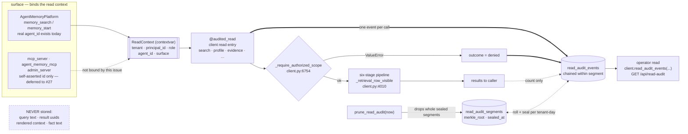
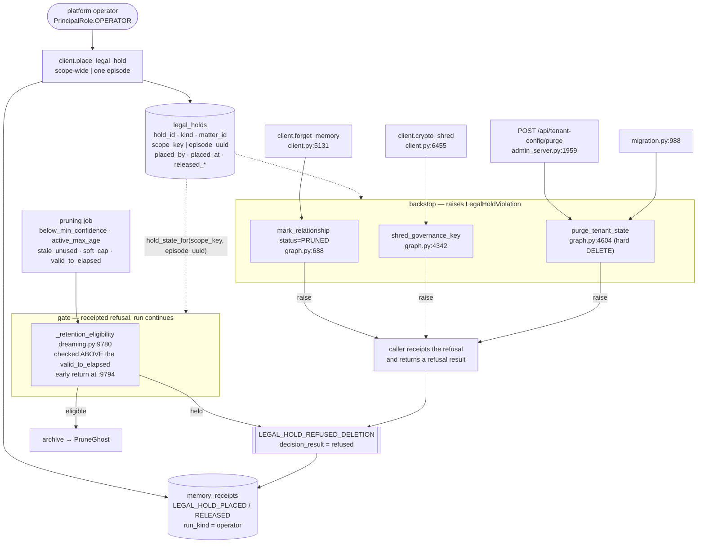

# governance: read auditing, legal hold, and compliance runbooks

**Issue:** #15 · **Status:** proposed · **Target release:** August 3.08 (LATEST by Mon Aug 17, 2026)

> ## Read this first: the baseline these citations describe
>
> Every `file:line` below was verified against local `main` at **`9648ca3`** ("Name a bare array by
> its content"), which is **79 commits ahead of pushed `origin/main`** (`47790d4`). This document is
> branched from `origin/main` so the PR stays docs-only, so its citations describe a tree that is not
> yet on the remote. Same situation as #17's design doc, and it matters more here:
>
> ```
> git grep -c "reader_agent_id\|def pin_memory\|visibility_agents\|authorized_scope_keys\|stale_after_seconds" origin/main -- src/memotron/
> # -> no matches
> ```
>
> `src/memotron/retrieval.py`, `context.py`, `health.py`, `gateway.py`, `migration.py`,
> `synthesis.py` and `transcripts.py` **do not exist on `origin/main`** either. The primitive this
> design hangs the *who* of an audit record on — `reader_agent_id`, the per-read caller identity
> threaded through the retrieval and profile paths (WS-19 T22) — is one of the unpushed 79. **Until
> those commits reach `origin/main`, U4/U5 have nothing to hang on** and read auditing would have to
> invent a caller-identity parameter for eighteen methods rather than reuse one that already exists.
> Re-verify every line number before starting.

## Problem

Every write and every maintenance decision leaves a hash-chained receipt — including the decisions
*not* to store something (`ReceiptLedger.emit`, `receipts.py:959`, the authoritative choke point;
negative space at `receipts.py:1316`). **Reads leave nothing.** A `search`, a `profile`, a
`memory_evidence` over a scope built out of somebody's conversations executes, returns content, and
is indistinguishable afterwards from a read that never happened. "Who read this person's memory, and
when" has no answer, and the repo says so in its own words — `README.md:1605-1610` lists "audit logs
for config changes" among "deferred enterprise hardening."

Retention controls landed (`PruningPolicy`, `RetentionPolicy`, `config.py:1999`/`2035`). There is no
legal hold: `git grep -i "legal_hold\|litigation\|preservation" src/ tests/` returns nothing that is
a hold. And erasure exists as code (`erasure.py`, `client.crypto_shred` at `client.py:6455`) with no
operational procedure wrapped around it.

## What already exists (do not re-scope)

| Concern from the issue | Status | Evidence |
|---|---|---|
| Hash-chained, tamper-evident, verifiable decision ledger | **exists** | `ReceiptLedger` (`receipts.py:814`), `emit` (`959`), `checkpoint` (`1059`), `verify_chain` (`1199`), per-run Merkle root (`merkle_root`, `292`) |
| A receipted operator action with a state-hash bracket | **exists — copy it verbatim** | `pin_memory` (`client.py:5238`): `_begin_operator_run` (`client.py:7126`) → `graph_state_hash` before → mutate → after → `_emit_receipt` → `_checkpoint_operator_run` (`client.py:7265`). `run_kind="operator"` is already in `RUN_KINDS` (`receipts.py:39-50`) |
| A per-read caller identity | **exists on 6 of 18 read entries** | `reader_agent_id: str \| None` on `search_context` (`client.py:3460`), `search` (`3437`), `semantic_search` (`676`), `profile` (`4478`), `memory_evidence` (`4738`), `memory_utility` (`1638`). **Absent** on `entity_neighborhood` (`4143`), `knowledge_graph` (`4231`), `truth_timeline` (`6812`), `memory_evolution` (`4846`), `dream_history`/`dream_decisions` (`1223`/`1231`), `coherence_incidents` (`2795`), `pending_supersession_reviews` (`6071`), `pending_entity_alias_proposals` (`5892`), `quarantined_candidates` (`6286`), `replay_memory_utility` (`1666`), `retrieval_negative_space` (`1679`) |
| A scope chokepoint every public read crosses | **exists** | `_require_authorized_scope` (`client.py:6754`) — "one shared choke point for the core-layer scope guard"; called at the top of nearly every public scope-taking read |
| A principal type with an operator role | **exists, unenforced** | `MemoryPrincipal` (`config.py:3102`), `PrincipalRole.{USER,OPERATOR,ADMIN}` (`config.py:3096`). `resolve_for_principal` branches only on `role != ADMIN` (`config.py:3953`) — **`OPERATOR` is authorized identically to `USER` today** |
| Verifiable, re-executable erasure certificate | **exists** | `ErasureCertificate` (`erasure.py:124`), `issue_erasure_certificate` (`417`, fail-closed), `verify_erasure_certificate` (`479`), bound into the chain as `ERASURE_CERTIFICATE_ISSUED` |
| A single retention gate with named refusal reasons | **exists** | `DreamEngine._retention_eligibility` (`dreaming.py:9780`) → `(eligible, gate_reason, policy, source)`; existing reasons `coherence_hold` (`9819`), `active_secret_reference` (`9821`), `operator_correction` (`9823`), `pinned` (`9827`), `protected_memory_type:*` (`9844`) |
| A sibling table-owner sharing the graph connection | **exists — the pattern to copy** | `ReceiptLedger` owns `memory_receipts`/`run_checkpoints` with its own `_RECEIPTS_DDL` + `_migrate` (`receipts.py:692`, `881`) over `PropertyGraphStore`'s connection (`graph.py:167`) |
| Export interface for the data-access runbook (#14) | **partially exists** | `export_graph` (whole-store, fails closed under the scope guard) and `memory_evidence`; there is no per-subject export. The runbook is written against what #14 delivers — see Risks |

### Five real gaps

1. **No read is recorded anywhere.** The only read-adjacent record is `UseEvent`/`UseEventKind.RETRIEVED` (`models.py:640`, `client.record_memory_use` at `client.py:1297`) — an *opt-in call the caller makes afterwards*, wired up at exactly one site in the tree (`agent_memory.py:1881-1900`, inside `memory_search`). `search_context`, `semantic_search`, `profile`, `memory_evidence`, `entity_neighborhood`, `knowledge_graph`, `truth_timeline` never call it. It is an impression record for ranking quality, carries no required actor, and is trivially bypassed. It is not an access audit.
2. **`GovernancePolicy.audit_verbosity` is a dead knob.** Declared (`config.py:101`), exported (`__init__.py:54,378`), documented (`README.md:911` — "controls decision-log volume"), and **read by no code in the tree**. Anyone reasoning about "audit" from the config surface is reading a promise nothing keeps.
3. **Four independent destruction paths, and the only existing hold-like property protects one of them.** `pinned` is honoured by the automatic retention gate (`dreaming.py:9827`) and by context demotion (`_context_demotion_held`, `dreaming.py:9761`) — and by nothing else:
   - `_retention_eligibility` returns **eligible before any protection check** when `reason == "valid_to_elapsed"` (`dreaming.py:9794`), so validity expiry archives pinned rows.
   - `client.forget_memory` (`client.py:5131`) reads no `pinned`, no `coherence_hold`, no `claim_mode` — it flips status to `PRUNED` unconditionally (`5163`).
   - `client.crypto_shred` (`client.py:6455`) checks only `_require_authorized_scope`; `graph.shred_governance_key` (`graph.py:4342`) checks nothing.
   - `graph.purge_tenant_state` (`graph.py:4604`) is a **hard SQL `DELETE`** across `relationships`, `nodes`, `memory_receipts`, `run_checkpoints` and more, keyed on scope membership only. Reachable from admin `POST /api/tenant-config/purge` (`admin_server.py:1959`) and tenant migration (`migration.py:988`).
4. **The intended hold slot exists and is unreachable.** `retention_protected_until` and `retention_protection_lifted_at` are *read* by the gate (`dreaming.py:9796`, `9805`) and have **zero writers anywhere in `src/` or `tests/`**. Dead code shaped exactly like the thing #15 asks for — and even wired up it would still be bypassed by all four paths in gap 3.
5. **Nothing identifies the system that sent an episode.** `Episode` (`models.py:221-231`) has `source: EpisodeType` (a content-format tag), `source_description: str = ""` and a free `metadata` dict — no `tenant_id`, no `sender`, no `submitted_by`, no `source_system`. `client.add_episode` (`client.py:841`) takes no caller identity. An episode-granularity hold "asserted by the system that sent it" has no existing field to key on.

## Decision 1: read audit records get their own segment-chained ledger, not receipt rows

The receipt ledger is the obvious home and it is the wrong one, for four reasons that are all in the code:

- **Retention would destroy erasure.** Read audit has its own retention (a year). `verify_chain` requires a **dense** `event_index` and refuses on the first gap (`receipts.py:1232-1240`). `verify_erasure_certificate` chain-verifies *every run that touched the scope* (`erasure.py:519-522`). So the first time a read-audit retention sweep deleted a receipt row, every future erasure certificate for that scope would become un-issuable. Not a trade-off — an incompatibility.
- **A read is not a run.** `emit` requires a `ReceiptRun` handle carrying a dense per-run cursor, and raises `RuntimeError("a run must be driven by exactly one ReceiptRun handle")` on an index collision (`receipts.py:1048-1052`). Concurrent readers cannot share one run. One run per read means `checkpoint` (`1059`) writing a `run_checkpoints` row and a one-leaf Merkle root per `search`.
- **Volume on the write lock.** `emit` does `self._connection.commit()` per receipt (`receipts.py:1053`) on the connection shared with the whole graph (`graph.py:167`). Reads are the highest-frequency operation in the system; a commit per read serializes them.
- **Different retention, different verifiability unit.** Receipts must be verifiable forever. Audit records must be verifiable *until they expire*. Those are two designs.

So: `read_audit_events` + `read_audit_segments`, owned by a new `audit.py` following the `ReceiptLedger`
pattern exactly (own DDL, own `_migrate`, the graph's connection — `receipts.py:689` establishes that
this is permitted). Records are hash-chained **within a segment**, where a segment is
`(tenant_id, UTC date)`. Rolling a segment seals it with a Merkle root over its event hashes, reusing
`receipts.payload_digest` / `receipts.receipt_hash` / `receipts.merkle_root` as **pure functions** —
no dependency on `ReceiptLedger` itself. Retention drops whole sealed segments, so every surviving
segment still verifies independently. Tamper evidence without the coupling.

**What the record never holds: the query text, the result set, or the rendered context.** It holds a
`query_digest`, HMAC-keyed with the scope DEK when the scope is content-protected — exactly the
treatment `candidate_digest` already gives a digest that must stop being dictionary-testable after a
shred (`receipts.py:346-356`, `378-382`). That lets an operator answer "was this same question asked
before" without the store ever holding the question.

## Decision 2: the hold lives in a register, and is enforced twice

One register row is the single source of truth (`legal_holds`), because a **scope** hold must cover
rows that do not exist yet — mirroring the hold onto each row would need a backfill plus a
forward-write hook plus a reconciliation, i.e. a second source of truth that can drift.

Enforcement is deliberately in two layers, mirroring how `authorized_scope_keys` is described as
"defense in depth" (`README.md:602-626`):

| Layer | Where | Behaviour on a held item |
|---|---|---|
| **Gate** — a planned, receipted refusal | `_retention_eligibility` (`dreaming.py:9780`) | returns `(False, "legal_hold:<hold_id>")`; a `LEGAL_HOLD_REFUSED_DELETION` receipt is emitted with `decision_result="refused"`; **the dreaming run continues** |
| **Backstop** — an unbypassable raise | `graph.mark_relationship` when `status=PRUNED` (`graph.py:688`), `graph.shred_governance_key` (`4342`), `graph.purge_tenant_state` (`4604`) | raises `LegalHoldViolation`; the operator-facing callers (`forget_memory`, `crypto_shred`) catch it, receipt the refusal, and return a refusal result rather than a traceback |

`mark_relationship` is the one low-level mutator every soft-prune path funnels through, and gating it
on `status=PRUNED` specifically leaves **supersession and demotion untouched** — a hold preserves an
item, it does not freeze the truth timeline. `valid_to_elapsed`'s early return (`dreaming.py:9794`)
is the one existing bypass and the hold check is placed **above** it.

## Data flow — a read produces an audit record



`result_count` is a count, not content. `query_digest` is keyed under a content-protected scope. The
decorator emits **exactly one** event for a nested read (`search` delegates to `search_context`,
`client.py:3437`→`3460`) — the outermost decorated frame owns the record.

## Data flow — a hold and what it refuses



## System design — where each piece lives and why there

- **`src/memotron/audit.py` (new).** Owns one thing: *the record of a read having happened*. Holds
  `ReadAuditEvent`, `ReadAuditLog` (its own DDL over the graph's connection, the `ReceiptLedger`
  shape), the `ReadContext` contextvar, and the `audited_read` decorator. It imports only stdlib,
  pydantic, and `receipts`' pure hash helpers — never `graph`, `client`, or `dreaming`, matching the
  import discipline `receipts.py:14-16` states for itself. **Not** in `client.py`: `client.py` is
  already 8k lines and the audit ledger must be constructible with a bare connection so a unit test
  needs no `Memotron`.
- **`src/memotron/holds.py` (new).** Owns *what is currently held*: `LegalHold`, `LegalHoldRegister`
  (own DDL, same shape), `LegalHoldViolation`, and the single predicate
  `hold_state_for(scope_key, episode_uuid=None) -> LegalHold | None`. Separate from `audit.py`
  because they share no state and have opposite lifetimes — audit records expire, hold records are
  the reason things don't.
- **`graph.py`** instantiates both next to `self.receipts` (`graph.py:167`) and enforces the backstop.
  The register has to be reachable from the store layer, because the store layer is where the three
  unbypassable destruction primitives live.
- **`dreaming.py`** gains one clause in `_retention_eligibility`, above the `valid_to_elapsed` early
  return. It **wraps** rather than modifies: the clause is a call to `holds.hold_state_for`, and the
  existing gate-reason mechanism carries the answer, so the pruning engine learns nothing new about
  holds beyond "ask the register."
- **`client.py`** gets the operator API and the decorators. Placement/release is `pin_memory`
  (`client.py:5238`) with a different register — same operator run, same receipt bracket.
- **`config.py`** gets `GovernancePolicy.read_audit_retention_days` next to the retention knobs it
  already owns. `audit_verbosity` is **deleted** in the same unit: leaving a dead knob named `audit_*`
  beside a live audit subsystem guarantees someone sets it and believes something happened.
- **`docs/runbooks/`** gets two prose runbooks. They are documents, not code, and they cite the
  commands that already exist.
- **Nothing is added to `graph_state_hash`.** Audit events and hold-register rows are bookkeeping
  *about* memory, not memory — the same call the repo makes for `dream_claims` (`README.md:2658`:
  "they live outside the receipt ledger and outside `graph_state_hash`"). Hold receipts therefore
  carry the register-row digest in `event_payload` instead of bracketing a state-hash delta, which is
  where they differ from `pin_memory`.

## Contracts

| Symbol | Signature | Behaviour |
|---|---|---|
| `ReadKind` | `StrEnum`: `search`, `semantic_search`, `search_context`, `profile`, `evidence`, `timeline`, `neighborhood`, `knowledge_graph`, `utility`, `negative_space`, `evolution`, `dream_history`, `dream_decisions`, `coherence`, `reviews`, `alias_proposals`, `quarantine`, `export` | the *class* of query — never the query |
| `ReadContext` | frozen dataclass `(tenant_id: str, principal_id: str, principal_role: PrincipalRole, agent_id: str \| None, surface: str)` | what a surface knows about its caller |
| `bind_read_context` | `(ReadContext) -> AbstractContextManager[None]` | sets the contextvar for the duration; nesting is an error |
| `current_read_context` | `() -> ReadContext` | the bound context, else the explicit sentinel `ReadContext(tenant_id="", principal_id="sdk-owner", principal_role=OPERATOR, agent_id=None, surface="sdk")` — never `None`, never a fabricated id |
| `ReadAuditEvent` | pydantic, `frozen=True`, `extra="forbid"`: `event_uuid, schema_version, segment_id, event_index, occurred_at, tenant_id, principal_id, principal_role, agent_id, surface, scope_key, read_kind, outcome, result_count, as_of, retrieval_policy_digest, query_digest, query_digest_keyed, previous_event_hash, event_hash` | `extra="forbid"` is the enforcement that query text cannot be smuggled in |
| `ReadAuditSegment` | pydantic, `frozen=True`: `segment_id, tenant_id, segment_date, first_event_hash, last_event_hash, event_count, merkle_root, sealed_at` | one sealed, independently verifiable unit of retention |
| `ReadAuditLog` | `(connection: sqlite3.Connection)` | owns `read_audit_events` + `read_audit_segments`; idempotent `_migrate` |
| `ReadAuditLog.record` | `(*, context: ReadContext, scope_key: str, read_kind: ReadKind, outcome: str, result_count: int, as_of: datetime \| None = None, retrieval_policy_digest: str \| None = None, query_digest: str \| None = None, occurred_at: datetime \| None = None) -> ReadAuditEvent` | appends and chains within the current segment; rolls + seals on a tenant-day boundary; `outcome` ∈ `{ok, empty, denied}` |
| `ReadAuditLog.events` | `(*, tenant_id=None, scope_key=None, principal_id=None, read_kind=None, since=None, until=None, limit=200) -> list[ReadAuditEvent]` | half-open window `since <= occurred_at < until`, mirroring `negative_space` (`receipts.py:1316`) |
| `ReadAuditLog.verify_segment` | `(segment_id: str) -> SegmentVerification` | recomputes each event hash from the row's typed columns and the segment root; **never raises** on mismatch, mirroring `verify_chain` (`receipts.py:1199`) |
| `ReadAuditLog.prune_segments` | `(*, before: date) -> int` | deletes whole **sealed** segments only; refuses to delete a segment that is not sealed |
| `audited_read` | `(read_kind: ReadKind, *, scope_arg: str = "scope") -> Callable` | decorator on a `Memotron` coroutine; emits exactly one event per outermost decorated frame; on exception emits `outcome="denied"` and re-raises unchanged |
| `HoldKind` | `StrEnum`: `scope`, `episode` | the two granularities DW-019 names |
| `LegalHold` | pydantic, `frozen=True`: `hold_id, hold_kind, tenant_id, scope_key, episode_uuid, source_system, source_episode_id, matter_id, reason, placed_by, placed_at, place_receipt_hash, released_by, released_at, release_receipt_hash` | `released_at is None` ⇒ active |
| `LegalHoldRegister` | `(connection: sqlite3.Connection)` | owns `legal_holds`; idempotent `_migrate` |
| `LegalHoldRegister.place` | `(*, hold_kind, tenant_id, scope_key, matter_id, reason, placed_by, episode_uuid=None, source_system=None, source_episode_id=None, now=None) -> LegalHold` | idempotent on `(hold_kind, scope_key, episode_uuid, matter_id)` while active; re-placing returns the existing hold |
| `LegalHoldRegister.release` | `(*, hold_id, released_by, reason, now=None) -> LegalHold` | forward-only; releasing a released hold raises `ValueError` |
| `LegalHoldRegister.hold_state_for` | `(*, scope_key: str, episode_uuid: str \| None = None) -> LegalHold \| None` | the **one** predicate every enforcement point calls; an episode is held by its own hold *or* by its scope's |
| `LegalHoldRegister.active_holds` | `(*, tenant_id=None, scope_key=None, matter_id=None) -> list[LegalHold]` | the register — "what is on hold" without a database query |
| `LegalHoldViolation` | `RuntimeError` subclass, `.hold: LegalHold`, `.attempted: str` | raised by the store backstop |
| `Memotron.place_legal_hold` | `(*, hold_kind, scope, matter_id, reason, placed_by, episode_uuid=None, source_system=None, source_episode_id=None, principal: MemoryPrincipal, now=None) -> LegalHold` | requires `principal.role is PrincipalRole.OPERATOR or ADMIN`; receipts `LEGAL_HOLD_PLACED` in an operator run |
| `Memotron.release_legal_hold` | `(*, hold_id, reason, released_by, principal: MemoryPrincipal, now=None) -> LegalHold` | same authorization; receipts `LEGAL_HOLD_RELEASED` |
| `Memotron.legal_holds` | `(*, tenant_id=None, scope=None, matter_id=None) -> list[LegalHold]` | operator read of the register |
| `Memotron.read_audit_events` | `(*, tenant_id=None, scope=None, principal_id=None, read_kind=None, since=None, until=None, limit=200) -> list[ReadAuditEvent]` | operator retrieval — Acceptance 1 |
| `Memotron.prune_read_audit` | `(*, now: datetime \| None = None) -> int` | applies `GovernancePolicy.read_audit_retention_days`; drops whole sealed segments |
| `ForgetMemoryResult.refused_by_hold` | `LegalHold \| None = None` | a refusal is a *result*, not a traceback, at the operator API |
| `ReceiptDecisionType.LEGAL_HOLD_PLACED` / `LEGAL_HOLD_RELEASED` / `LEGAL_HOLD_REFUSED_DELETION` | new members | `receipts.py:94` |
| `DECISION_RESULTS` gains `"refused"` | `receipts.py:57` | added to `DECISION_RESULTS` and **deliberately not** to `NON_MATERIALIZING_RESULTS` (`receipts.py:75`) — a held row *is* still in memory, so `negative_space()` must not report it as something the system chose not to remember |
| `GovernancePolicy.read_audit_retention_days` | `int = 365` | replaces the deleted `audit_verbosity` |
| `GET /api/read-audit` | `?tenant_id&scope&principal_id&read_kind&since&until&limit` → JSON | `{events: [...], segments_verified: bool}` |
| `GET /api/legal-holds` | `?tenant_id&scope&matter_id` → JSON | `{holds: [...]}` |

**Chain compatibility.** Growing `ReceiptDecisionType` and `DECISION_RESULTS` cannot change any
existing receipt's bytes: the canonical payload stores `decision_type`/`decision_result` as their
string values (`receipts.py:198-199`, `790-791`), and `verify_chain` rebuilds the payload from the
row's typed columns (`receipts.py:1249`). Adding an allowed value does not touch a stored row. This
is the whole answer to "how does a hold compose with the hash chain without breaking verifiability":
it adds vocabulary and never rewrites history.

## Units

Ordered by dependency. Each leaves the repo green.

**U1 — receipt vocabulary for holds and refusals** · module: `receipts.py`
- in: three new `ReceiptDecisionType` members; `"refused"` added to `DECISION_RESULTS`
- out: `emit(..., decision_result="refused")` accepted; `negative_space()` selection set unchanged
- unit: `emit` each new decision type on an in-memory ledger → `verify_chain(run).valid is True`; assert `"refused" in DECISION_RESULTS and "refused" not in NON_MATERIALIZING_RESULTS`; emit one `refused` receipt and assert `negative_space(scope_key=...)` returns `[]`; recompute `payload_digest` for a receipt written before the enum grew and assert byte-identity
- int: open a file-backed graph written under the previous vocabulary, reopen, `verify_chain` valid for every run in `run_checkpoints`

**U2 — the read-audit ledger** · module: `audit.py` *(new)*
- in: `ReadContext` + record kwargs; a bare `sqlite3.Connection`
- out: chained rows in `read_audit_events`; sealed rows in `read_audit_segments`; `events` / `verify_segment` / `prune_segments`
- unit: three records chain (`previous_event_hash` links, `event_index` dense); crossing a tenant-day boundary seals segment 1 with a Merkle root over exactly its hashes and opens segment 2; `UPDATE` one column of one row → `verify_segment(...).valid is False` with the divergent index named; `prune_segments(before=tomorrow)` drops segment 1 and `verify_segment(segment2).valid is True`; `prune_segments` refuses an unsealed segment; `ReadAuditEvent(**{..., "query": "x"})` raises `ValidationError` (proves `extra="forbid"`)
- int: file-backed graph, write across two simulated days, reopen the file, assert both segments read back and `graph_state_hash(scope)` is byte-identical before and after an audit write

**U3 — the read context and the decorator** · module: `audit.py`
- in: a decorated fake coroutine; a bound or unbound `ReadContext`
- out: exactly one `ReadAuditEvent` per outermost call, with `outcome` ∈ `{ok, empty, denied}`
- unit: fake `ReadAuditLog`; decorated fake read returning 3 rows → one event, `read_kind` as declared, `scope_key` from the `scope` argument, `result_count == 3`, `outcome="ok"`; returning `[]` → `outcome="empty"`; raising `ValueError` → one event with `outcome="denied"` **and the same `ValueError` propagates**; a decorated method calling another decorated method → exactly one event; unbound context → `principal_id == "sdk-owner"`; a query containing the sentinel `"ZZQUERYSENTINEL"` appears in no field of `event.model_dump()`
- int: — (pure; no store)

**U4 — instrument every public read entry** · module: `client.py`
- in: each of the 18 public read coroutines listed in *What already exists*
- out: one audit event per call, distinct `read_kind` per entry
- unit: `Memotron(graph_path=":memory:")`, call all 18 entries once each against an empty graph → assert exactly 18 events and 18 distinct `read_kind` values (this is the test that fails when someone adds a 19th read method without a decorator); assert `search` (which delegates to `search_context`) produces one event, not two; assert a scope-guarded client (`authorized_scope_keys={...}`) reading an unauthorized scope produces one `outcome="denied"` event and still raises
- int: ingest → `run_dream_job` formation → `search` → `client.read_audit_events(scope=scope)` returns one event naming principal, tenant, scope, `read_kind="search"`, and `occurred_at` — **Acceptance 1**

**U5 — bind the real caller at the one surface that has one** · module: `agent_memory.py`
- in: `memory_start`, `memory_search`, `memory_explain`, `memory_utility`, `memory_evolution` — each already receives an `agent_id` and builds a `MemoryPrincipal` (`agent_memory.py:1343`)
- out: those reads audit with the caller's `agent_id`, `tenant_id`, and role rather than `sdk-owner`
- unit: `AgentMemoryPlatform` over a temp graph; `memory_search(agent_id="a1", query=...)` → the event carries `agent_id="a1"`, `surface="agent_memory"`; `project_memory_candidates` (which reads `graph.episodes_for_scope` directly at `agent_memory.py:2453`, bypassing `client.py` entirely) is routed through an audited client read **or** asserted to emit its own event — no ungated read of episode bodies remains
- int: two agents read the same shared `simple`-mode user scope; assert the register distinguishes them and that agent A's events are retrievable filtered by `principal_id`

**U6 — retention config: one live knob replaces one dead one** · module: `config.py`
- in: `GovernancePolicy(read_audit_retention_days=...)`
- out: the field exists and validates (`>= 1`); `audit_verbosity` and `AuditVerbosity` are gone from `config.py` and `__init__.py`
- unit: `GovernancePolicy()` → `read_audit_retention_days == 365`; `read_audit_retention_days=0` raises `ValidationError`; `import memotron; assert not hasattr(memotron, "AuditVerbosity")`
- int: `uv run pytest -q` — the removal is only safe because nothing consumed it; the suite is the proof

**U7 — the hold register** · module: `holds.py` *(new)*
- in: place/release kwargs; a bare `sqlite3.Connection`
- out: rows in `legal_holds`; `hold_state_for`; `active_holds`
- unit: place a scope hold → `hold_state_for(scope_key=s)` returns it and `hold_state_for(scope_key=s, episode_uuid=e)` returns it too (scope holds cover their episodes); place an episode hold → `hold_state_for(scope_key=s)` returns `None` and `hold_state_for(scope_key=s, episode_uuid=e)` returns it (an episode hold does not widen); re-placing an identical active hold returns the same `hold_id` (idempotent); `release` twice raises; a released hold disappears from `hold_state_for` and `active_holds`; an episode hold addressed by `(source_system, source_episode_id)` resolves to the same row as one addressed by `episode_uuid`
- int: file-backed graph, place a hold, reopen the file, assert `active_holds` still returns it and `graph_state_hash(scope)` is unchanged by placing it

**U8 — the store-layer backstop** · module: `graph.py`
- in: a held scope / held episode + each of the three destruction primitives
- out: `LegalHoldViolation` from `mark_relationship(status=PRUNED)`, `shred_governance_key`, `purge_tenant_state`; every other mutation unaffected
- unit: `PropertyGraphStore(":memory:")` with a hold placed → `mark_relationship(uuid, status=RelationshipStatus.PRUNED)` raises `LegalHoldViolation` carrying the hold; `mark_relationship(uuid, status=SUPERSEDED)` **succeeds** (a hold preserves an item, it does not freeze truth); `update_relationship` succeeds; `shred_governance_key(scope_key)` raises; `purge_tenant_state(tenant_id)` raises naming the held scope and deletes **zero** rows (assert row counts before and after are equal — the refusal must not be half-applied); with the hold released, all three succeed
- int: file-backed graph with two scopes, one held; `purge_tenant_state` raises, then release the hold and assert the purge completes and the unheld scope was never partially purged in the failed attempt

**U9 — the retention gate refuses, receipts, and keeps running** · module: `dreaming.py`
- in: a held row reached by each prune reason: `below_min_confidence`, `active_max_age`, `stale_unused`, `soft_cap_exceeded`, `valid_to_elapsed`
- out: `_retention_eligibility` → `(False, "legal_hold:<hold_id>", ...)` for **all five**, including `valid_to_elapsed`; one `LEGAL_HOLD_REFUSED_DELETION` receipt (`decision_result="refused"`) per refusal; the run completes and checkpoints
- unit: build a `GraphRelationship` fixture per reason (the direct-gate-call pattern in `tests/test_retention_transaction_time.py:23` needs no client) and assert the gate reason for each; assert the hold clause is evaluated **before** the `valid_to_elapsed` early return at `dreaming.py:9794` by asserting that reason is refused
- int: `_config_with_pruning` (`tests/test_retention_safety.py:12`) with an aggressive `PruningPolicy`, one held and one unheld row past `valid_to`; `run_dream_job(pruning)` → unheld row is `PRUNED` with a `PruneGhost`, held row is still `ACTIVE`, one `refused` receipt names the hold, the run checkpointed, and `dream_decisions()[...]["details"]["eligibility_reason"]` starts with `legal_hold:` — **Acceptance 2 (pruning half)**

**U10 — operator hold API** · module: `client.py`
- in: `place_legal_hold` / `release_legal_hold` / `legal_holds` with a `MemoryPrincipal`
- out: register rows + `LEGAL_HOLD_PLACED` / `LEGAL_HOLD_RELEASED` receipts in an `operator` run
- unit: `principal.role=USER` → `PermissionError` and **no** register row and **no** receipt (assert all three, so a partial write can't hide); `role=OPERATOR` → hold placed, one receipt whose `event_payload` carries the register-row digest, run checkpointed; `release` receipts and the register shows `released_at`
- int: place → `verify_chain` valid for the operator run → reopen the file → `legal_holds()` returns it → release → `verify_chain` still valid for both runs

**U11 — the two destruction paths that are operator-facing refuse cleanly** · module: `client.py`
- in: `forget_memory` and `crypto_shred` against a held item
- out: a refusal *result* plus a receipted `LEGAL_HOLD_REFUSED_DELETION`; no mutation
- unit: hold a row → `forget_memory` returns `ForgetMemoryResult(refused_by_hold=<hold>)`, the row is still `ACTIVE`, one `refused` receipt; hold a scope → `crypto_shred` refuses, `governance_key_state(scope)["shredded"] is False`, **and zero episodes were retired** (assert the pending-episode count is unchanged — `crypto_shred` retires episodes at `client.py:6486` *before* it shreds, so the hold check must precede that); release → both succeed
- int: hold → `crypto_shred` refuses → `erasure_certificate(scope)` raises `ErasureVerificationError` naming the undestroyed key (the certificate stays fail-closed, `erasure.py:351`) → release → `crypto_shred` → `erasure_certificate` issues → `verify_erasure` is `True` — **Acceptance 2 (erasure half)**

**U12 — audit retention sweep** · module: `client.py`
- in: `prune_read_audit(now=...)` with `read_audit_retention_days=365`
- out: sealed segments older than the window are dropped; count returned
- unit: seed events across 400 simulated days → `prune_read_audit` returns the dropped count, the oldest surviving segment is within the window, today's unsealed segment survives, and `verify_segment` is valid for every survivor
- int: file-backed graph; prune, reopen, assert the survivors verify and that `verify_erasure` for a previously certified scope **still returns True** (the whole point of Decision 1)

**U13 — operator read surfaces** · module: `admin_server.py`
- in: `GET /api/read-audit?...`, `GET /api/legal-holds?...`
- out: the JSON shapes in Contracts; unknown `/api/*` still 404s through the existing fallthrough (`admin_server.py:1042`)
- unit: `MemoryGraphHandler` over an `HTTPServer` on port 0 (existing pattern in `tests/test_dream_concurrency.py`) against a graph seeded with 3 events and 2 holds → assert both payloads, assert `limit=0` → 400, assert no response field contains query text
- int: run a `search` through the platform surface, then `GET /api/read-audit` → the event appears with the right principal

**U14 — the two runbooks** · module: `docs/runbooks/`
- in: the commands and APIs that exist after U1–U13
- out: `docs/runbooks/erasure.md` (request intake → hold check → `crypto_shred` → `erasure_certificate` → `verify_erasure` → where the certificate JSON is retained and for how long) and `docs/runbooks/data-access.md` (subject request → scope resolution → the #14 export call → what the export deliberately omits → the audit record the export itself leaves)
- unit: `rg -n "client\.[a-z_]+\(" docs/runbooks/` — every API named in a runbook resolves to a real symbol (a doc-lint test asserting each cited callable exists on `Memotron`)
- int: `uv run pytest -q tests/test_runbooks.py` walks `docs/runbooks/erasure.md`'s numbered steps as an executable scenario against a temp graph and asserts each step's stated outcome

## Done when

Tied to the issue's Acceptance. Every clause is a command whose output shows it.

- `uv run pytest -x -q` exits 0
- `uv run pytest -q tests/test_read_audit.py tests/test_legal_hold.py` exits 0 and reports at least 30 passing tests
- `test_search_by_a_named_principal_is_retrievable_by_an_operator` passes — **Acceptance 1**
- `test_held_row_survives_every_prune_reason_and_the_refusal_is_receipted` passes — **Acceptance 2 (pruning)**
- `test_held_scope_refuses_crypto_shred_and_the_refusal_is_receipted` passes — **Acceptance 2 (erasure)**
- `test_query_sentinel_never_reaches_the_audit_table` passes
- `test_every_public_read_entry_emits_exactly_one_event` passes
- `test_purge_tenant_state_refuses_a_held_scope_and_deletes_zero_rows` passes
- `test_erasure_certificate_still_verifies_after_an_audit_retention_sweep` passes
- `rg -n "audit_verbosity|AuditVerbosity" src/ README.md` returns no matches — the dead knob is gone, not left beside a live subsystem
- `rg -n "query=|query_text|rendered_context|source_text" src/memotron/audit.py` returns no matches
- `rg -n "extra.*forbid" src/memotron/audit.py` matches — the record model cannot accept an unplanned field
- `rg -n "import sqlite3" src/memotron/audit.py src/memotron/holds.py` matches both — each owns its own DDL, neither reaches into `graph.py`'s internals
- `rg -n "from memotron import graph|from memotron.graph|from memotron.client" src/memotron/audit.py src/memotron/holds.py` returns no matches — no upward imports
- `rg -n "legal_hold" src/memotron/graph.py | rg -c "mark_relationship|shred_governance_key|purge_tenant_state"` reports 3 — all three store primitives are covered
- `rg -n "refused" src/memotron/receipts.py | rg -c "NON_MATERIALIZING_RESULTS"` reports 0 — `refused` was not added to the negative-space set
- `git diff --stat origin/main -- src/memotron/receipts.py` shows no change to `_RECEIPTS_DDL` — read audit added no column to the receipt tables
- `git diff --stat origin/main -- pyproject.toml` shows no change to `dependencies` — no new runtime dependency
- `ls docs/runbooks/erasure.md docs/runbooks/data-access.md` succeeds

## Goal

```
/goal uv run pytest -x -q exits 0; uv run pytest -q tests/test_read_audit.py
tests/test_legal_hold.py exits 0 with at least 30 passing tests;
test_search_by_a_named_principal_is_retrievable_by_an_operator,
test_held_row_survives_every_prune_reason_and_the_refusal_is_receipted,
test_held_scope_refuses_crypto_shred_and_the_refusal_is_receipted,
test_query_sentinel_never_reaches_the_audit_table,
test_every_public_read_entry_emits_exactly_one_event,
test_purge_tenant_state_refuses_a_held_scope_and_deletes_zero_rows and
test_erasure_certificate_still_verifies_after_an_audit_retention_sweep all pass;
rg -n "audit_verbosity|AuditVerbosity" src/ README.md returns no matches;
rg -n "query=|query_text|rendered_context|source_text" src/memotron/audit.py
returns no matches; rg -n "from memotron.graph|from memotron.client"
src/memotron/audit.py src/memotron/holds.py returns no matches;
git diff --stat origin/main -- pyproject.toml shows no change to dependencies;
ls docs/runbooks/erasure.md docs/runbooks/data-access.md succeeds.
Do not modify src/memotron/retrieval.py or erasure.py. Stop after 70 turns.
```

## Rejected

- **Read audit records as receipt rows.** Four cited reasons in Decision 1; the decisive one is that a
  retention sweep over `memory_receipts` breaks `verify_chain`'s dense-index requirement
  (`receipts.py:1232-1240`), which `verify_erasure_certificate` depends on for every run touching the
  scope (`erasure.py:519-522`) — the first audit expiry would make erasure certificates
  un-issuable for that scope forever. Forecloses nothing: the pure hash helpers are reused.
- **An unchained plain append-only audit table.** Simpler, and it would satisfy the literal
  acceptance criterion. Rejected because every other decision record in this system is tamper-evident
  and an audit log that an operator with database access can silently edit is the one record where
  that property matters most. Segment chaining costs ~40 lines and is what makes retention and
  verifiability coexist. Forecloses nothing.
- **Chaining the audit log as one continuous chain.** Then retention could only ever truncate the
  oldest prefix, and a single delete in the middle — a subject-specific correction, a mis-tenanted
  row — would invalidate everything after it. Segments make the blast radius one day.
- **Logging the query text, or the result relationship uuids.** The issue forbids it and the
  reasoning is sound: the query and the result set *are* content, and a store designed so that
  DW-013 holds ("memory holds no personal information") would be re-acquiring it in the audit table,
  outside the DEK, outside the ciphertext-only sweep (`COVERED_STORES`, `erasure.py:80`), and outside
  the erasure certificate. A crypto-shredded scope would leave a readable log of exactly what was
  asked about whom. `query_digest`, keyed under a protected scope like `candidate_digest` already is
  (`receipts.py:346-356`), keeps the one genuinely useful signal — "was this asked before" — without
  the content. Forecloses free-text search over the audit log, deliberately.
- **Asynchronous / buffered audit writes.** Faster, and it means a crash loses the record of reads
  that already returned content. An audit record that is best-effort cannot answer a compliance
  question, because "no record" and "no read" become indistinguishable — which is precisely today's
  state. The write is synchronous and in the same transaction bracket as the read's completion. If
  volume becomes the problem, the answer is a coarser `read_kind` or segment batching, not a lossy
  buffer. Forecloses nothing measured: no throughput target exists for this repo yet (see Risks).
- **Auditing at `_require_authorized_scope` (`client.py:6754`).** It is the single widest chokepoint
  and looked ideal. It is called by writes as well as reads, it does not know the read kind, it does
  not know the result count, and it does not see the caller. It would produce a log of "a
  scope-bearing operation happened," which is not the question. The decorator sits one frame out and
  knows all four.
- **Auditing inside `graph.py`'s read methods.** Would catch the paths that bypass `client.py`
  (`agent_memory.py:2453`). Rejected: `graph.py` has no notion of a reader, its methods are called
  many times per logical read (`relationships_for_scope` inside a six-stage search), and it would
  turn one user-visible read into dozens of records. U5 closes the one real bypass instead.
- **Binding a `ReadContext` at `mcp_server.py`, `agent_memory_mcp.py` and `admin_server.py` now.**
  Those surfaces have no authenticated caller: MCP tools take `agent_id`/`scope_kind`/`scope_id` as
  caller-supplied strings with nothing verifying them, and `admin_server.py` sets **one**
  `MemoryPrincipal` per process at startup (`admin_server.py:1027`, `2973`) and reuses it for every
  HTTP request. Recording a self-asserted identity as an audit fact is worse than recording
  `sdk-owner`: it produces a compliance record that looks authoritative and is forgeable. Deferred to
  #27 / PR #37, which delivers `principal_from_headers` and per-request derivation and explicitly
  deletes `build_demo_principal`. Forecloses nothing — U3's context seam is exactly where #27's
  principal plugs in, one line per surface.
- **Reusing `GovernancePolicy.audit_verbosity` as the read-audit policy.** Its declared semantics are
  "how much *decision-log* volume to emit" (`README.md:911`), it is a three-value enum where the need
  is a retention duration, and it has never been read by any code. Repurposing a dead knob to mean
  something new is how a config surface becomes untrustworthy. It is deleted (U6) and replaced by a
  field that says what it does.
- **Sampling reads instead of recording all of them.** A sampled access log cannot answer "who read
  this person's memory" — the one question the issue names. Rejected outright.
- **Wiring the existing `retention_protected_until` / `retention_protection_lifted_at` properties as
  the legal hold.** They are read by the gate (`dreaming.py:9796`, `9805`) and have zero writers, so
  they look free. Rejected: they are a *delay* hold with a grace period, they are per-row so a scope
  hold would need a backfill plus a write hook, and even wired up they sit **below** the
  `valid_to_elapsed` early return (`dreaming.py:9794`) and are invisible to `forget_memory`,
  `crypto_shred` and `purge_tenant_state`. A legal hold that three of four destruction paths ignore
  is worse than none, because it would be believed. They should be deleted as dead code — flagged as
  a separate cleanup, not folded in here.
- **Reusing `pinned` as the legal hold.** Same shape, and it already survives most pruning
  (`dreaming.py:9827`). Rejected on authority and semantics: a pin is placeable by any agent over its
  own writable scope through `memory_pin` (`agent_memory.py`), where a legal hold must be
  operator-only; a pin is a *retrieval* guarantee that also happens to protect retention, so a hold
  would silently change what appears in every profile and search result (`README.md:875`); and
  unpinning is an ordinary agent action where releasing a hold must be a receipted operator act.
  Overloading them would make one property mean two things with two authorization models.
- **Mirroring hold state onto each relationship as a row property.** Symmetric with `pinned` and
  cheap to check. Rejected because a **scope** hold must cover rows formed *after* the hold is
  placed, which needs a backfill at placement plus a stamp on every subsequent formation write plus a
  reconciliation for the rows in between — three mechanisms and two sources of truth that can
  disagree. The register is one row and one predicate. It also keeps hold state out of
  `graph_state_hash`, so placing a hold does not change every scope digest recorded before it
  (unlike the WS-23 `pinned`/`visibility_agents` change, which did exactly that).
- **Making a legal hold freeze the truth timeline (blocking supersession and demotion).** Rejected:
  preservation and truth evolution are different concerns. Supersession is invalidate-don't-delete
  (`valid_to` + `superseded_by_relationship_uuid`) and demotion keeps the row searchable — neither
  loses the held content, and blocking them would make a held scope stop learning. The backstop is
  therefore scoped to `status=PRUNED` specifically.
- **Adding a new `PrincipalRole` value for the platform operator.** `OPERATOR` already exists
  (`config.py:3096`). The gap is that nothing checks it (`config.py:3953` branches only on
  `!= ADMIN`) — which is #13's job per PR #37. U10 checks it at the hold API and nowhere else, so
  this design does not pre-empt #13's broader answer.
- **A separate audit *database*.** Would give physical separation of duties, which is the right end
  state for a hosted deployment. Rejected for now: PR #35 is mid-flight restructuring persistence
  and the split it already draws (`OperationalStorage` vs `MemoryGraphStorage`) is where that
  separation belongs. Adding a third connection now would be reworked twice.

## Risks & open questions

### Needs a decision from a human before implementation starts

1. **When do the 79 unpushed `main` commits reach `origin/main`?** See the banner. `reader_agent_id`,
   `retrieval.py`, `pin_memory`, `visibility_agents` and `authorized_scope_keys` are all in the
   unpushed set. U4 and U5 reuse `reader_agent_id` as the read-side caller identity; without it there
   is no per-read identity anywhere and the audit record's *who* would have to be invented across 18
   signatures. **This is the largest schedule risk to the Aug 17 date.**
2. **"A hold on an individual episode asserted by the system that sent it" (DW-019) has two readings,
   and they produce different code.** The design docs are behind SSO and I could not read DW-019
   (`latest.jedai-portal.wdprapps.disney.com` redirects to Microsoft login; unreachable from here) —
   so this rests on the issue text alone. Reading (a): *the sending system asserts the hold*, which
   contradicts the same bullet's "placing and releasing a hold is a receipted action only a platform
   operator can take." Reading (b): *the operator places the hold, and the episode is identified by
   the system that sent it.* This design implements (b) — `place_legal_hold(hold_kind="episode", ...)`
   accepts either `episode_uuid` or `(source_system, source_episode_id)`. **If (a) is intended, U7 and
   U10 change materially** (a non-operator write path with its own authorization and a very different
   audit story). Confirm against DW-019.
3. **Reading (b) needs a field that does not exist.** `Episode` carries no sender identity at all
   (`models.py:221-231`; no `source_system`, `sender`, `submitted_by`). Addressing an episode by
   `(source_system, source_episode_id)` requires either a new `Episode` field written at ingestion —
   which touches `client.add_episode`, `add_session`, `add_context`, `add_artifact` and every MCP/HTTP
   ingestion surface, and is arguably #14's tenancy work rather than #15's — or a convention over the
   existing free `metadata` dict, which nothing validates. **Which?** The units above assume the
   metadata convention plus a resolver, because it is additive and reversible; a first-class field is
   the better end state and a bigger change.
4. **Does the register need to cover receipts and episodes, or only relationships?**
   `purge_tenant_state` hard-deletes `memory_receipts` and `run_checkpoints` too (`graph.py:4604`),
   and `crypto_shred` retires pending episodes (`client.py:6486`). U8 refuses the whole purge when
   anything in its blast radius is held, which is the conservative reading. A records authority may
   want a *partial* purge that preserves only the held subset — materially more work and a different
   contract.
5. **Which surfaces must carry a real principal for the Aug 17 milestone?** If the answer is "all of
   them," #15 cannot land as designed — it needs #27/#37 merged first (see the Rejected entry). If
   `agent_memory.py` plus `sdk-owner` is acceptable for LATEST, U1–U14 ship independently.
6. **The records-retention questions the design names are external and unresolved.** The issue itself
   says these sit with the records authority and have external latency. Concretely undecided and
   **not blocking any unit**: the retention period for read-audit records (this design defaults to
   365 days on the strength of "commercial equivalents keep a year," which is the issue's phrasing,
   not a ruling); whether an *audit record itself* is subject to a legal hold (it is not, in this
   design — `prune_read_audit` ignores holds, which is a defensible but unratified position); and
   whether erasure certificates must be retained outside the store (this design keeps them in the
   chain only). **Owner and channel needed.** Do not let U12's default become the answer by silence.

### Hard to verify

- **The "every read is instrumented" property is a test, not a type.** U4's count assertion catches a
  new undecorated read method only if the author also adds it to the enumerated list. A stronger
  version — reflect over `Memotron`'s public `async def`s, subtract a known-writes allowlist, and
  assert every remainder carries the decorator — is the right test and is brittle against the
  allowlist going stale. Both are cheap; U4 should ship the reflective one and treat the allowlist as
  reviewable surface.
- **Anything holding `client.graph` bypasses everything.** `PropertyGraphStore` has no visibility, no
  scope guard and now no audit (`graph.py:348-4842`); `agent_memory.py:2453` already reads episode
  bodies that way. U5 fixes the one instance in the tree; nothing prevents the next one. A lint that
  forbids `\.graph\.` outside `client.py`/`dreaming.py` would, and is a bigger fight than #15.
- **No throughput number exists for the synchronous audit write.** The claim that a per-read insert
  is affordable is untested; there is no read-path benchmark in the repo (PR #35's
  `scripts/operational_store_benchmark.py` is the closest and it is unmerged). If it is too slow,
  the mitigation is segment-batched inserts inside one transaction, not a lossy buffer.
- **PR #35 will move both new modules.** `graph.py` becomes an 11-line shim and `receipts.py` a
  13-line shim on `feat/storage-backend-interface`; `ReceiptLedger` becomes
  `memotron/storage/receipts.py` with a Postgres twin, DDL declared in an append-only `MIGRATIONS`
  tuple, and a two-engine parity suite. `audit.py` and `holds.py` are written in exactly the shape
  `ReceiptLedger` has today, so the move is the same mechanical move `ReceiptLedger` gets — but the
  backstop hooks in `mark_relationship` / `shred_governance_key` / `purge_tenant_state` land in
  `storage/sqlite.py` and need a Postgres implementation and parity tests. **Whichever of #15 and #35
  merges second pays that cost**; it is bounded and known, and it is the reason U8's enforcement is
  three named primitives rather than scattered call sites.
- **`_retention_eligibility` is called per candidate row per pruning run.** Adding a register lookup
  makes it a query per row. `hold_state_for` must be memoized per run (the register is small and
  changes only through a receipted operator action), and the memo is a correctness risk if a hold is
  placed mid-run — accepted: the next cadence refuses it, exactly like the existing fail-closed
  dream-agent decisions, which are "idempotent and re-proposed on the next pruning cadence"
  (`README.md:2140`).
