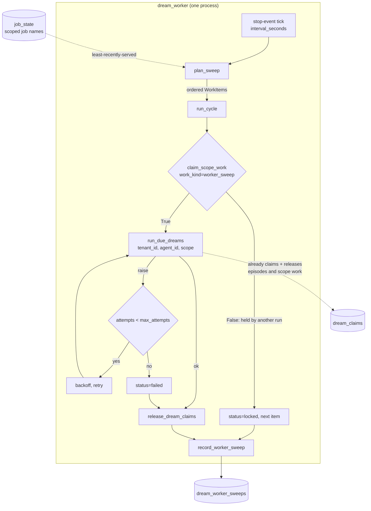
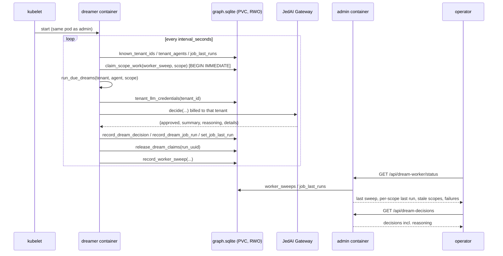

# ops: the Dream Worker as a deployed component

> ## STATUS 2026-08-31: partially SUPERSEDED. Read this box before the document.
>
> A skeleton now exists — `src/memotron/worker.py`, entry point
> `memotron-dream-worker` — and it deliberately does **not** implement this document's
> central decision. Three of this document's premises are no longer true, and the most
> load-bearing one is among them.
>
> **1. The form factor is NOT ours to decide, and this document decided it.** The portal
> (`solution_engineering/agent-memory/engineering/memory/lifecycle/#the-dream-worker`, pulled
> 2026-08-31) records it as an **open decision** between three shapes — an in-process loop in
> the API pods, a Kubernetes CronJob, or a **dedicated worker Deployment**, which it leans
> toward — and says *"the epic's scheduler issue owns the written decision"*. This document
> picks "second container in the admin pod", which is **not one of the three**. The skeleton
> therefore makes the scheduling shell swappable and closes nothing.
>
> **2. The reasoning behind that pick is a SQLite-era constraint.** Deciding criteria 1 and 2
> below rest on the durable store being a SQLite file on a ReadWriteOnce PVC mounted only by
> the admin pod. `pvc.yaml:11` is still `ReadWriteOnce`, so that is true *today* — and it stops
> being true the moment `operationalStore.enabled: true`, at which point the store is
> network-reachable and the RWO argument dissolves entirely. See #130.
>
> **3. "#9 is not assumed … zero `psycopg`/`asyncpg` anywhere" is false.**
> `psycopg[binary,pool]>=3.2` is a dependency, the Postgres backend exists and is tested, and
> `.helm/values.yaml:242` already carries an `operationalStore` block. The portal goes further:
> *"the Dream Worker's exclusive claims are Postgres row locks"*, and *"the worker cannot ship
> before Milestone 1, the persistence foundation lands"* — a production gate this document
> predates.
>
> **Scope this document understates.** The portal fixes five obligations regardless of form
> factor. This document treats per-tenant **quotas** as out of scope; the portal makes fair
> scheduling across tenants honouring quotas an obligation. It also omits the **dead-letter
> queue**, per-episode **retry budgets**, **webhooks**, and the **episode-status API**, and does
> not name `memotron_episode_lag_seconds`, the metric the observability page specifies as
> the early warning that the worker has stopped.
>
> **Every `file:line` below is stale.** They were verified against a pre-split tree:
> `client.py`, `dreaming.py` and `config.py` are all **packages** now. `graph.py` still exists.
> Re-verify before citing any of them.
>
> **What survives, and is now proven rather than argued:** the worker is a separate process
> whose mutual exclusion comes from the **store, never from Kubernetes**. That invariant was
> measured on 2026-08-31 across two real *processes* on both engines
> (`tests/test_exclusive_write_conformance.py`), including a break-test showing the guarantee
> fails when the advisory lock is removed. It holds whichever form factor the epic picks.


**Issue:** #17 · **Status:** proposed · **Target release:** August 3.08 (LATEST by Mon Aug 17, 2026)

> ## Read this first: the baseline this design is written against
>
> Every `file:line` below was verified against local `main` at **`aef21e1`** ("Rename identity ->
> anchor, and stop it absorbing the corpus"), which is **43 commits ahead of the pushed
> `origin/main`** (`47790d4`). This document is based on `origin/main` so that it is docs-only, so
> its citations describe a tree that is not yet on the remote.
>
> This is not cosmetic. The primitive this whole design rests on **does not exist on `origin/main`**:
>
> ```
> git grep -c "claim_scope_work\|claim_episodes\|release_dream_claims\|exclusive_write_transaction" origin/main -- src/memotron/
> # -> no matches
> ```
>
> Those come from unpushed commit `4e8d0a1` "Make dreaming safe to click twice: single-flight UI +
> atomic work claims". **Implementing #17 is therefore gated on those 43 commits reaching
> `origin/main` first.** If they are not pushed, the locking story in this document has to be built
> rather than reused, which is a materially larger piece of work than the units below describe.
> Line numbers will also have shifted; re-verify before starting.

## Problem

Every maintenance job — formation, consolidation, pruning, coherence — is reachable only by a
caller asking for it: MCP `memory_refresh` (`agent_memory.py:3068`), admin `POST
/api/dream-sequence/run` (`admin_server.py:1073`), or the local dev loop
(`local_platform.py:222-257`). In LATEST nothing asks. Episodes queue as
`queued_for_dreaming=True` (`client.py:494`) and stay queued: memory is written but never
formed, consolidated, or pruned until a human clicks the console.

## What already exists (do not re-scope)

The issue reads as if the whole lifecycle needs building. It does not. The engine, the locking
primitive, the approval model call, and per-tenant billing are all present and tested. The
missing piece is genuinely only **a process that calls them on a clock, fairly, across tenants**.

| Concern from the issue | Status | Evidence |
|---|---|---|
| Invokable maintenance operation | **exists** | `Memotron.run_due_dreams(now, tenant_id, agent_id, scope, ...) -> DreamRunResult` — `client.py:1133` |
| Cadence honored | **exists** | `DreamEngine.due_jobs` compares `job.cadence_seconds` to `get_job_last_run` — `dreaming.py:757-763` |
| "Maintenance mode" per scope | **exists, differently named** | `DreamMode.enabled_job_kinds` (`config.py:2810`); empty ⇒ `run_due_dreams` returns immediately (`client.py:1158`). Per-scope off switch is `ScopeMemoryPolicy.read_only` (`config.py:2915`) / `TenantMemoryPolicy.read_only_scope_keys` (`config.py:3020`). There is **no** `maintenance_mode` identifier in the repo. |
| Job-level locking, two workers never share a queue | **exists at the store layer** | `claim_episodes` (`graph.py:864`), `claim_scope_work` (`graph.py:911`), `release_dream_claims` (`graph.py:945`), TTL `DREAM_CLAIM_STALE_SECONDS = 900.0` (`graph.py:70`), all inside `exclusive_write_transaction()` = `BEGIN IMMEDIATE` (`graph.py:179`). Claimed and released by `run_job` itself (`dreaming.py:1563`, released in `finally` at `dreaming.py:866`). |
| Approval by a model call, billed to the tenant | **exists** | `DreamAgentTransport.decide` (`agents.py:71`) → `DreamAgentDecision(approved, summary, details)` (`agents.py:64`); credentials resolved per tenant by `build_transports_from_tenant_graph(graph_path, tenant_id)` → `store.tenant_llm_credentials(tenant_id)` (`runtime.py:153-166`) |
| Decision persisted | **exists** | `DreamDecisionRecord` (`models.py:1131`), `record_dream_decision` (`graph.py:1024`), `dream_decisions` (`graph.py:1042`) |
| Run history persisted | **exists** | `DreamJobRunRecord` (`models.py:1113`), `record_dream_job_run` (`graph.py:977`) written by `_run_job_and_record` (`client.py:7054`) |
| Run history exposed | **partially exists** | `GET /api/dream-runs` (`admin_server.py:1041`), `GET /api/dream-sequence/status` (`admin_server.py:1043`) |
| Quotas per scope | **does not exist** | Only `DreamJob.max_items_per_run` (`config.py:3276`) / `DreamMode.max_items_per_run` (`config.py:2817`). No quota concept in `src/` or `.helm/`. Treated as out of scope; see Risks. |

### Four real gaps

1. **No worker.** No module, no `[project.scripts]` entry, no Helm template. `local_platform.py:42`
   `run_maintenance_cycle` is the closest thing and it is single-tenant: it reads one
   `platform.tenant_id` and iterates that tenant's agents.
2. **`reasoning` is not a field.** `parse_decision` accepts exactly `approved`, `summary`,
   `details` (`agents.py:181-183`); `DREAM_AGENT_SYSTEM_PROMPT` asks for those three
   (`agents.py:33-37`). Reasoning survives only if the model volunteers it inside `details`,
   unvalidated. `rg -n "reasoning" src/memotron/` matches nothing relevant.
3. **`dream_status()` cannot see per-scope runs.** When a runtime policy resolves,
   `apply_to_job` renames the job to `scoped_job_name(...)` =
   `"formation-default [tenant/agent/scope/mode]"` (`config.py:3208`, `config.py:3262`), and that
   qualified name is the `job_state` key (`dreaming.py:847`, `job_state.job_name` is
   `PRIMARY KEY` at `graph.py:2635-2638`). But `dream_status()` iterates
   **base-config** job names (`client.py:1219-1221`), so it reads `get_job_last_run("formation-default")`
   and reports `last_run=None` forever. "A visible record of when each scope last ran" needs the
   `job_state` rows read directly.
4. **No liveness/failure surface.** No `/metrics`, no prometheus, no counters anywhere in `src/`.
   `health.py` computes *memory* health (type entropy), not process health.

## Decision: a dedicated long-running worker process, not a CronJob and not a thread in the API

**Form: its own process, `memotron-dream-worker`, shipped today as a second container in the
admin pod, promoted to its own Deployment when #9 lands.** The invariant that survives the
promotion is what matters: the worker is a separate process whose mutual exclusion comes from
**the store, never from Kubernetes**. `replicas: 1` is a Phase-1 guardrail; `claim_scope_work` is
the safety mechanism, and it is already correct across processes sharing one SQLite file and will
be correct across nodes the moment the store is network-reachable.

### Deciding criteria

1. **Where the durable store is.** The API deployment runs
   `command: ["uv","run","--no-sync","examples/mcp_server.py"]` with
   `MEMOTRON_GRAPH_PATH: ":memory:"` (`values-latest.yaml:72`) and `replicaCount: 2`
   (`:30`) under an HPA of 2–6 (`:231-232`). Each API replica's graph is private and
   ephemeral — there is nothing durable there to maintain. The only durable graph in LATEST is
   `/data/memory_graph_demo.sqlite` on PVC `jedai-memotron-data`, mounted **only** by the
   admin deployment at `replicaCount: 1` (`values-latest.yaml:89,94,145-146`). Maintenance must
   run where the file is. This alone eliminates the in-process-loop-in-the-API option.
2. **The PVC is `ReadWriteOnce`, hardcoded.** `pvc.yaml:11` pins `accessModes: [ReadWriteOnce]`
   with `storageClassName: premium-rwo` (`values-latest.yaml:149`); there is no RWX option in the
   chart. RWO is single-*node*, so a separate pod can only attach by landing on the admin pod's
   node. A container in the admin pod gets that for free, with no affinity rule and no attach race.
3. **Restart/failure semantics.** Claims expire after 900 s and are released in `run_job`'s
   `finally`, so a killed run leaves episodes unprocessed-and-unclaimed and the next cycle
   re-forms them (`dreaming.py:806-818, 866`). A long-lived process with per-cycle exception
   containment matches that exactly. A CronJob's failure unit is `backoffLimit` over a whole tick.
4. **Cadence granularity and cost.** Hosted jobs use `cadence_seconds` of 60/300/600
   (`mcp_server.py:147,153,159`) and the library defaults are 1 (`config.py:3553-3554`).
   Kubernetes CronJob granularity is one minute, and each tick pays image pull plus `uv` startup.
   A resident process amortizes graph open and transport construction.
5. **Fit with the locking story.** The engine already owns locking. Adding Kubernetes lease-based
   leader election would put a second mutual-exclusion mechanism in a different layer, needs RBAC
   on `coordination.k8s.io` that the chart has **none** of (the only RBAC object in `.helm/` is a
   Vault `system:auth-delegator` ClusterRoleBinding), and still would not stop two pods holding
   two different SQLite files from diverging.
6. **Deployment friction.** Harness deploys the whole chart directory as one Helm release; a new
   template needs no pipeline change (`.harness/pipeline.yaml:120-135`). The image has
   `CMD ["sleep","infinity"]` and no ENTRYPOINT (`Dockerfile:46`) — every component is "same
   image, new `command`". A new container follows the established pattern exactly.

### #9 is not assumed

Issue #9 (Postgres Operational Store) is **Blocked** on jedai/program#162 and #163. There is no
store abstraction to build against: `PropertyGraphStore` (`graph.py:139`) is the only
implementation, instantiated directly, with zero `psycopg`/`asyncpg` anywhere. Nothing in this
design imports, subclasses, or waits for it. Multi-replica operation is a **documented follow-on**:
when #9 lands, `claim_scope_work` becomes cross-node and `replicaCount` is raised. No worker code
changes.

## Data flow — scheduling and locking



Ordering rule: **least-recently-served scope first, ties broken by `scope.key`.** The planner reads
`job_state` rows and nothing else — it never resolves policy. `run_due_dreams` stays the single
authority on whether a scope is read-only, which job kinds are enabled, and which jobs are due
(`client.py:1144-1172`). Duplicating that in the planner would be two places to drift.

## System design — where it sits



**Why the worker lives in `dream_worker.py` and nowhere else.** It owns exactly one thing: *when*
to run maintenance and *for whom*. It owns no memory semantics — no extraction, no gate, no
claim implementation of its own. It composes: it calls `Memotron.run_due_dreams` and can be
tested end to end with that seam replaced by a fake. Putting the loop inside `admin_server.py`
would couple maintenance cadence to the operator console's request thread pool and to a stdlib
`BaseHTTPRequestHandler` that already dispatches 50+ routes by `if/elif`
(`admin_server.py:999-1051`); putting it inside `client.py` would make the library
self-scheduling, which is the property the issue says is fine to *not* have in a library.

**The worker exposes no HTTP surface.** Its liveness is the container being alive — the pod's
probes already target the admin container on `/health:8765` (`values-latest.yaml:115-130`), and a
crashed sidecar is restarted by the kubelet. Operator visibility goes through the store into the
existing Admin API instead, which is also what the issue asks for ("expose … through the
Management API"). Note: `rg -i "management api" .` matches nothing — the repo calls this the
**Admin API**, `admin_server.py`, route prefix `/api/`.

## Contracts

| Symbol | Signature | Behaviour |
|---|---|---|
| `WorkItem` | frozen dataclass `(tenant_id: str, agent_id: str, scope: MemoryScope)` | one unit of schedulable maintenance |
| `plan_sweep` | `(store: WorkSource, *, now: datetime) -> tuple[WorkItem, ...]` | enumerates tenants/agents/scopes, orders least-recently-served first, ties by `scope.key`; never resolves policy; never raises on an empty graph (returns `()`) |
| `WorkSource` | `Protocol` with `known_tenant_ids()`, `tenant_agents(tenant_id)`, `job_last_runs()` | the only store surface the planner may touch — lets the planner be unit-tested with a fake |
| `run_cycle` | `(item: WorkItem, *, runner: DreamRunner, store: PropertyGraphStore, now, max_attempts=3, backoff_seconds=2.0, sleep=time.sleep) -> WorkerCycleResult` | claims, runs, retries bounded, **always** releases in `finally`, **never** propagates; returns status `ok` \| `locked` \| `failed` |
| `DreamRunner` | `Protocol` with `async run_due_dreams(*, now, tenant_id, agent_id, scope) -> DreamRunResult` | the seam `Memotron` already satisfies; swapped for a fake in tests |
| `WorkerCycleResult` | frozen dataclass `(item, status, attempts, job_runs, error)` | `error` is `""` on success |
| `run_sweep` | `(store, runner, *, now, ...) -> WorkerSweepRecord` | one full pass over `plan_sweep`; one `WorkerSweepRecord` written per pass |
| `serve_forever` | `(*, graph_path, interval_seconds, stop: Event, ...) -> int` | sweeps until `stop` is set; returns 0; SIGTERM sets `stop` and the in-flight cycle finishes |
| `WorkerSweepRecord` | pydantic: `uuid, started_at, finished_at, worker_id, items_planned, items_ok, items_locked, items_failed, job_runs, errors: list[str]` | the run-history record for the *worker*, distinct from `DreamJobRunRecord` which is per job |
| `record_worker_sweep` | `(record: WorkerSweepRecord) -> None` | append-only into new `dream_worker_sweeps` table |
| `worker_sweeps` | `(*, limit: int = 20) -> list[WorkerSweepRecord]` | newest first; raises `ValueError` on `limit <= 0`, matching `dream_job_runs` (`graph.py:993-999`) |
| `job_last_runs` | `() -> dict[str, datetime]` | every `job_state` row, scope-qualified names included — the fix for gap 3 |
| `DreamAgentDecision.reasoning` | `str = ""` | new field; why the action was approved or rejected |
| `DreamDecisionRecord.reasoning` | `str = ""` | persisted alongside the decision; defaulted so existing `payload_json` rows still validate |
| `GET /api/dream-worker/status` | `?limit=<int>` → JSON | `{sweeps: [...], scope_last_runs: {...}, consecutive_failed_sweeps: int, stale_scope_keys: [...]}` |
| `GET /api/dream-decisions` | `?limit=<int>&scope=<key>` → JSON | `{decisions: [...]}` each carrying `reasoning` |

`dream_worker_sweeps` is operational bookkeeping, exactly like `dream_claims` and
`episode_processing`: outside `graph_state_hash` and outside the receipt ledger
(`graph.py:825-831`). It must not be added to the state hash.

## Units

Ordered by dependency. Each leaves the repo green.

**U1 — the two record shapes** · module: `models.py`
- in: a `dict` / JSON payload · out: validated `WorkerSweepRecord`; `DreamDecisionRecord.reasoning`
- unit: `model_validate_json` of a `DreamDecisionRecord` payload with **no** `reasoning` key → `""` (proves old rows still load); `WorkerSweepRecord` rejects `items_planned < 0`
- int: — (data only)

**U2 — persist and read worker sweeps; expose `job_state`** · module: `graph.py`
- in: `WorkerSweepRecord`; a `job_state` table containing scope-qualified names
- out: rows in `dream_worker_sweeps`; `worker_sweeps(limit)` newest-first; `job_last_runs()` mapping
- unit: `PropertyGraphStore(":memory:")`, write 3 sweeps → assert order and `limit`; `limit=0` raises `ValueError`; `set_job_last_run("formation-default [t/a/customer:x/std]", ts)` then assert `job_last_runs()` contains that exact key
- int: open a **file-backed** graph created before this change, assert `CREATE TABLE IF NOT EXISTS` adds the table without touching existing rows, reopen and assert sweeps persist and `graph_state_hash()` is unchanged by writing a sweep

**U3 — `reasoning` in the decision contract** · module: `agents.py`
- in: model response `{"approved":true,"summary":"s","reasoning":"r","details":{}}`, incl. fenced and trailing-prose forms
- out: `DreamAgentDecision(approved=True, summary="s", reasoning="r")`; missing key → `""`; non-string → `DreamAgentContractError`; `DREAM_AGENT_SYSTEM_PROMPT` asks for the key
- unit: table-driven `parse_decision` cases; assert the three existing contract errors (blank body, no JSON object, non-bool `approved`) are byte-identical to today
- int: `OpenAICompatibleDreamAgentTransport` against a local `HTTPServer` fake returning fenced JSON plus a trailing sentence (pattern already in `tests/test_dream_concurrency.py`) → reasoning survives the wire

**U4 — populate the persisted reasoning** · module: `dreaming.py`
- in: a `DreamAgentTransport` fake whose `decide` returns `reasoning="because X"`
- out: `DreamDecisionRecord.reasoning == "because X"` on the row `record_dream_decision` wrote
- unit: one formation job over a 1-episode graph with that fake → assert `graph.dream_decisions()[0].reasoning`
- int: full `run_due_dreams` with the fake over a file-backed graph → assert reasoning readable after reopen, and that a fallback decision (transport raises) records `reasoning=""` rather than fabricating one

**U5 — sweep planning** · module: `dream_worker.py`
- in: a fake `WorkSource` with 3 tenants × 2 agents and a partial `job_last_runs` map; `now`
- out: `tuple[WorkItem, ...]`, least-recently-served first, never-run scopes first, ties by `scope.key`
- unit: assert exact order for a fixed fixture; assert a scope starved for two sweeps reaches position 0; assert empty graph → `()`; assert the planner reads **only** the three `WorkSource` methods (fake raises `AssertionError` on any other attribute access)
- int: real `PropertyGraphStore` with 2 tenants × 2 registered agents → one `plan_sweep` yields every scope exactly once

**U6 — one cycle: lease, bounded retry, containment** · module: `dream_worker.py`
- in: one `WorkItem` + a `DreamRunner` fake
- out: `WorkerCycleResult`; the lease released in every path
- unit: runner raising twice then succeeding → `status="ok"`, `attempts=3`, injected `sleep` called with `[2.0, 4.0]`; runner always raising → `status="failed"`, no exception escapes, `release_dream_claims` still called; a live claim held by another `run_uuid` → `status="locked"` and the runner is never called
- int: real graph + real `Memotron`; pre-hold `claim_scope_work(work_kind="worker_sweep", ...)` under a different `run_uuid` → cycle reports `locked`; let the claim age past `DREAM_CLAIM_STALE_SECONDS` → the next cycle proceeds

**U7 — the supervised loop and CLI entry point** · module: `dream_worker.py`
- in: `--graph-path`, `--interval-seconds`, `--tenant-id`, `--consumer-key`, `--max-attempts`; a `threading.Event`
- out: a process that sweeps until stopped and exits 0; one `WorkerSweepRecord` per sweep; `[project.scripts] memotron-dream-worker = "memotron.dream_worker:main"`
- unit: `serve_forever(interval_seconds=0, stop=event)` with a fake runner and `event` set after 2 sweeps → exactly 2 `WorkerSweepRecord` rows, return 0; `--interval-seconds 0` rejected with `SystemExit` (mirrors `local_platform.py:96-97`)
- int: `uv run memotron-dream-worker --graph-path <tmp.sqlite> --interval-seconds 1` as a subprocess against a graph seeded with one queued episode; poll until `dream_job_runs` is non-empty; `SIGTERM`; assert exit 0, and assert the acceptance property — the episode is either fully processed or still unclaimed and unprocessed, never half-written, with `graph_state_hash()` stable across a re-read

**U8 — operator read surface** · module: `admin_server.py`
- in: `GET /api/dream-worker/status?limit=5`, `GET /api/dream-decisions?limit=5&scope=<key>`
- out: the JSON shapes in Contracts; unknown `/api/*` still 404 via the existing fallthrough (`admin_server.py:1042`)
- unit: instantiate `MemoryGraphHandler` over an `HTTPServer` on port 0 (existing pattern in `tests/test_dream_concurrency.py`) against a graph seeded with 2 sweeps and 1 decision → assert both payloads, assert `reasoning` present, assert `limit=0` → 400
- int: run the worker subprocess for one sweep against a shared graph file, then GET both endpoints → the sweep and a decision with non-empty `reasoning` appear

**U9 — the deployment form** · module: `.helm/`
- in: `helm template .helm -f .helm/values-latest.yaml`
- out: a second container `dreamer` in `Deployment/jedai-memotron-admin`, mounting the same
  `/data` volume, `command: ["uv","run","--no-sync","memotron-dream-worker"]` with args from
  new `values.dreamer.*` keys; reuses `memotron.labels` / `memotron.serviceAccountName`; no
  new Service, no HPA, no RBAC
- unit: `helm lint .helm -f .helm/values-latest.yaml` exits 0; `helm template … | rg -n "name: dreamer"` matches exactly once; `helm template … | rg -n "kind: (CronJob|StatefulSet|Role|Lease)"` returns no matches
- int: deploy to LATEST; `GET /api/dream-worker/status` shows sweeps advancing with no client involvement

## Done when

Tied to the issue's Acceptance. Every clause is a command whose output shows it.

- `uv run pytest -x -q` exits 0
- `uv run pytest -q tests/test_dream_worker.py` exits 0 and reports at least 12 passing tests
- `test_worker_sweep_runs_due_jobs_with_no_client_involvement` passes — *Acceptance 1*
- `test_sigterm_mid_run_leaves_queue_consistent_and_retries` passes — *Acceptance 2*
- `test_second_worker_run_uuid_is_locked_out_of_the_same_scope` passes
- `test_decision_reasoning_survives_the_wire_and_the_reopen` passes
- `rg -n "memotron-dream-worker" pyproject.toml` matches
- `rg -n "class WorkerSweepRecord" src/memotron/models.py` matches
- `rg -n "reasoning" src/memotron/agents.py src/memotron/models.py` matches
- `rg -n "api/dream-worker/status|api/dream-decisions" src/memotron/admin_server.py` matches
- `helm lint .helm -f .helm/values-latest.yaml` exits 0
- `helm template .helm -f .helm/values-latest.yaml | rg -c "name: dreamer"` prints `1`

Absences that must hold:

- `rg -n "psycopg|asyncpg|pg_advisory|SKIP LOCKED" src/ .helm/` returns no matches — #9 was not assumed
- `rg -n "coordination.k8s.io|kind: Lease|leader" .helm/` returns no matches — no Kubernetes leader election
- `rg -n "kind: CronJob|kind: StatefulSet" .helm/` returns no matches
- `rg -n "while True" src/memotron/dream_worker.py` returns no matches — the loop is stop-event driven
- `git diff --stat main -- pyproject.toml` shows no change to the `dependencies` list — no new runtime dependency
- `rg -n "claim_episodes|_write_claim" src/memotron/dream_worker.py` returns no matches — the worker reuses `claim_scope_work` and never reimplements locking

## Rejected

- **In-process loop inside the API deployment.** `MEMOTRON_GRAPH_PATH: ":memory:"` with HPA
  2–6 replicas (`values-latest.yaml:72,231-232`) means each replica maintains a private
  ephemeral graph. Not a trade-off — it cannot work at all. Forecloses nothing.
- **Kubernetes CronJob.** One-minute minimum granularity against `cadence_seconds` of 60/300/600
  and library defaults of 1; a container cold start (`uv` + image) per tick; and on
  `ReadWriteOnce`/`premium-rwo` storage a tick scheduled onto a node other than the admin pod's
  cannot attach the volume at all. Forecloses sub-minute cadence and amortized graph/transport reuse.
- **Its own Deployment today.** The correct end state, and the issue's lean. With the PVC
  hardcoded to `ReadWriteOnce` (`pvc.yaml:11`, no values override) it would need node affinity to
  the admin pod, and any reschedule strands it un-attachable. Deferred to #9, which is what makes
  the store network-reachable. Adopting it early would foreclose nothing but would trade a
  guaranteed co-location for a probabilistic one.
- **Kubernetes lease-based leader election.** A second mutual-exclusion mechanism in a different
  layer from `dream_claims`, requiring `coordination.k8s.io` RBAC the chart has none of, and it
  still would not stop two pods on two different SQLite files from diverging — it would make an
  unsafe topology *look* safe. Forecloses the store-level story that becomes correct for free
  when #9 lands.
- **A new `maintenance_mode` field per scope.** `ScopeMemoryPolicy.read_only` (`config.py:2915`),
  `TenantMemoryPolicy.read_only_scope_keys` (`config.py:3020`) and `DreamMode.enabled_job_kinds`
  (`config.py:2810`) already express "do not maintain this scope", and `run_due_dreams` already
  enforces them. A third flag would be a near-duplicate of two existing ones.
- **Worker-owned episode claims.** `run_job` already claims episodes and scope work and releases
  them in its `finally` (`dreaming.py:1563, 2626, 866`). Re-claiming in the worker would
  double-lock the same keys and could deadlock against the engine's own claim ordering.
- **A `/metrics` endpoint or a health HTTP server in the worker.** No metrics stack exists in this
  repo to scrape it, and the pod's probes already cover the admin container. Sweep state in the
  store, read through the Admin API, satisfies the issue's own wording and costs no new port.
- **Extending `local_platform.run_maintenance_cycle` in place.** It is the dev-loop entry point,
  single-tenant by construction (`local_platform.py:42-59`), and lives in the module that also
  owns argparse and the UI thread. The worker should be importable and testable without starting
  a UI; `local_platform` can later call into `dream_worker` rather than the reverse.

## Risks & open questions

### Needs a decision from a human before U9 ships

1. **Which store does "maintenance runs on schedule in LATEST" mean?** The API's graph is
   `":memory:"`. The only durable graph in LATEST is `/data/memory_graph_demo.sqlite`, and the
   admin container *seeds it by running a demo script on every start*
   (`values-latest.yaml:94`: `uv run --no-sync examples/memory_graph_demo.py --graph-path /data/memory_graph_demo.sqlite`).
   Satisfying Acceptance 1 against that graph demonstrates the worker but maintains demo memory,
   not real tenant memory. **Is giving the API a durable graph path in scope for #17, or a
   separate issue?** The units above are unaffected either way; only what U9 points at changes.
2. **Who converts "stuck or failing" into an alert?** The issue asks for an alert. This repo has
   no metrics or alerting integration, so U8 delivers *queryable state*
   (`consecutive_failed_sweeps`, `stale_scope_keys`) and nothing pages anyone. **Owner and channel
   needed** (Datadog? the n8n workflow that already comments on these issues?).
3. **Is >1 replica required for the Aug 17 LATEST date?** If yes, this issue cannot land as
   designed: it needs #9, which is Blocked on jedai/program#162 and #163. If no, single-replica
   ships now and multi-replica is a follow-on that raises `replicaCount` and changes no worker code.
4. **When do the 43 unpushed `main` commits get pushed?** See the banner at the top. The claim
   primitive this design reuses (`claim_scope_work`, `claim_episodes`, `release_dream_claims`,
   `exclusive_write_transaction`) is not on `origin/main`. Until it is, U6 has nothing to compose
   with and the "locking already exists" premise of this document is false on the remote. This is
   the single largest schedule risk to the Aug 17 date and it is not about #9.

### Hard to verify

- `DREAM_CLAIM_STALE_SECONDS = 900.0` is a module constant (`graph.py:70`), not configurable. A
  sweep whose LLM calls exceed 15 minutes can have its `worker_sweep` lease stolen mid-sweep. The
  engine's own episode/scope claims keep that *safe* (no double-write), but the work is duplicated
  and the sweep record will disagree with itself. Making it configurable is a candidate follow-on;
  bounding sweep size via `max_items_per_run` is the cheaper mitigation.
- Fairness under a partially-failing tenant: a tenant whose gateway credentials are broken fails
  every cycle, and least-recently-served ordering will keep putting it first. U6's bounded retry
  caps the cost per sweep, but a circuit breaker (skip a scope after N consecutive failures) is
  deliberately **not** in this design — it needs a policy decision about how long a tenant may go
  unmaintained before someone is told.
- Per-tenant billing is only as correct as `tenant_llm_credentials` (`runtime.py:163`). If a
  tenant has no sealed credential, `build_transports_from_tenant_credentials` falls back to
  rule-based extraction and **no** dream agent — maintenance still runs but nothing is
  model-approved. U4's integration test pins that this records `reasoning=""` rather than
  inventing one, but operators will need to be able to see it; `GET /api/dream-worker/status`
  should be extended with a per-tenant "has dream agent" flag if that turns out to matter.
