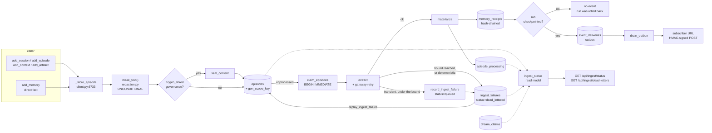
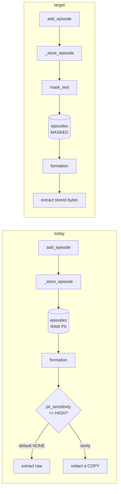

# ops: ingestion status, dead-letter handling, and events

**Issue:** #18 · **Status:** proposed · **Target release:** August 3.08 (LATEST by Mon Aug 17, 2026)

> ## Read this first: the baseline this design is written against
>
> Every `file:line` below was verified against local `main` at **`9648ca3`** ("Name a bare array by
> its content; show examples in the demanded shape"), which is **79 commits ahead of pushed
> `origin/main`** (`47790d4`). This document is docs-only, so its citations describe a tree that is
> not on the remote. This is the same drift `docs/design/17-dream-worker.md` flagged at 43 commits.
>
> It is not cosmetic. Two primitives this design reuses **do not exist on `origin/main`**:
>
> ```
> git ls-tree --name-only origin/main src/memotron/ | grep -c gateway.py   # -> 0
> git grep -c "claim_episodes" origin/main -- src/memotron/                # -> no matches
> ```
>
> `gateway.py` (`GatewayRetryPolicy`, `gateway_request_with_retry`, `GatewayRequestError`) is the
> bounded-retry primitive Units 5, 6 and 12 build on. `claim_episodes`/`dream_claims` is the
> exactly-once queue semantics Unit 7's status read model reports. Both arrive with the unpushed
> commits. **Implementing #18 is gated on those 79 commits reaching `origin/main` first.** Line
> numbers will have shifted; re-verify before starting.
>
> `origin/main` also lacks `context.py`, `health.py`, `migration.py`, `retrieval.py`,
> `synthesis.py`, and `transcripts.py`, and still names the derived-memory type `theme` rather than
> `rollup` (`CONSOLIDATION_ROLLUP_CREATED` is absent there). This document uses **rollup**, the
> current vocabulary.

## Problem

Everything handed to Memotron is persisted immediately and formed later, and none of that is
observable.

- **Nothing is masked at the door.** `client.py:6733 _store_episode` is the single episode-
  persistence choke point, and it contains no call into `redaction.py`. It consults
  `_ingest_governance` only to decide whether to `seal_content`, then writes the raw body through
  `graph.py:738 add_episode` as plaintext JSON. Masking runs instead inside offline formation
  (`dreaming.py:1916-1921`), on **a copy fed to the extractor**, gated on
  `GovernancePolicy.pii_sensitivity == HIGH` whose default is `NONE` (`config.py:99`) on a
  `GovernancePolicy` that itself defaults to `None` (`config.py:3534`). The code says so in
  comments: *"The original episode row in the graph is immutable; we only redact the copy fed to
  the extractor"* (`dreaming.py:1910-1912`). A logged session's email address is on disk, in the
  clear, forever.
- **No status exists for an item or a scope.** `client.py:1219 dream_status()` reports *job*
  cadence, not *episode* progress. The only per-run status store is
  `admin_server.py:1035-1036 dream_statuses: dict[str, dict[str, Any]]` behind a `Lock` — in-process
  memory, lost on restart, invisible to a second replica. `client.py:7358
  _pending_episode_count` computes queue depth by iterating `graph.py:761 episodes()`, which is
  `SELECT payload_json FROM episodes` with no scope predicate and no limit: every episode in the
  store, deserialized through pydantic, per call.
- **A failed extraction disappears, and takes the run with it.** Exhausted transport retries raise
  out of `OpenAICompatibleExtractionTransport`, get caught at `dreaming.py:1972`, receipted
  `CANDIDATE_SCHEMA_REJECTED` with `violation=extraction_envelope_invalid`, and **re-raised**. The
  run is never checkpointed. The episode stays unprocessed and is retried on the next cycle
  forever, unbounded, with no record that it has ever failed.
- **Nothing tells another system that memory changed.** `rg -n "webhook|subscriber|subscription|
  notify|outbox|dispatch" src/` finds no outbound notification mechanism. The only outbound HTTP in
  `src/` is the LLM gateway (`gateway.py`) and `platform_client.py`'s inbound-facing SDK client.

## What already exists (do not re-scope)

| Concern from the issue | Status | Evidence |
|---|---|---|
| PII pattern detection | **exists** | `redaction.py:98 Redactor`, `:159 redact_text`, `:145 matched_pattern_names`; strategies `redact` / `mask_last_4` / `sha256_hash` (`:68`); email/SSN/CC/phone built-ins plus `custom_pii_patterns` and `redaction_allowlist` (`config.py:102-104`) |
| One choke point to enforce at | **exists** | `client.py:6733 _store_episode` — every `add_episode`, `add_episode_bulk`, `add_session`, `add_context`, `add_artifact`, `add_memory` trace episode routes through it |
| Receipt for a masking event | **exists** | `ReceiptDecisionType.FORMATION_GOVERNANCE_REDACTED` (`receipts.py:113`); records strategy and matched pattern **names**, never matched content |
| Durable queue with exactly-once claims | **exists** | unprocessed rows in `episodes` + `episode_processing`; `graph.py:864 claim_episodes`, `:911 claim_scope_work`, `:946 release_dream_claims`, TTL `DREAM_CLAIM_STALE_SECONDS = 900.0` (`graph.py:70`), all under `:180 exclusive_write_transaction` = `BEGIN IMMEDIATE` |
| Per-consumer completion marking | **exists** | `graph.py:765 is_episode_processed`, `:789 mark_episode_processed`, keyed `(episode_uuid, consumer_key)` |
| Bounded model-call retry | **exists at the transport** | `gateway.py:108 GatewayRetryPolicy` (3 attempts, 0.5s→1.0s, no jitter), `:155 gateway_request_with_retry`, `RETRYABLE_HTTP_STATUS_CODES` (`:98`) |
| "Defer this episode, keep what completed" precedent | **exists for embeddings only** | `dreaming.py:1085 _receipt_embedding_outage` + `run_job`'s `except GatewayRequestError` (`dreaming.py:854-861`) receipts `EMBEDDING_TRANSPORT_UNAVAILABLE` and **checkpoints** the completed work |
| The four event moments, as recorded facts | **exists** | `FORMATION_RELATIONSHIP_CREATED` (`receipts.py:119`, emitted `dreaming.py:8037`), `FORMATION_TRUTH_KEY_SUPERSEDED` (`:118`, `dreaming.py:8080`), `CONSOLIDATION_ROLLUP_CREATED` (`:133`, `dreaming.py:4061`), `ERASURE_CERTIFICATE_ISSUED` (`:152`, `client.py:6600`) |
| A stable id + timestamp per moment | **exists** | `receipts.py:472 MemoryReceipt` — frozen, `receipt_uuid`, `created_at`, `scope_key`, `relationship_uuid`, `payload_digest`, hash-chained; `receipts.py:959 emit` is documented as *"the AUTHORITATIVE choke point — every receipt in the system goes through it"* |
| Commit marker for a run | **exists** | `receipts.py:1059 checkpoint`; aborted runs are never checkpointed |
| Per-tenant config with a sealed secret | **exists** | `tenant_llm_credentials` + `governance_keys` keyed `(scope_key, subject_key)`; the LLM credential lives at `subject_key="llm_credentials"` and — per README — `scope_content_is_protected` matches `subject_key=""` **only**, so adding a row does not mark a scope content-protected |
| Additive-schema patterns | **exists** | new table → `CREATE TABLE IF NOT EXISTS` in `graph.py:2610 _migrate`; new column → `PRAGMA table_info` + `ALTER TABLE ADD COLUMN` in an `_ensure_*_schema` method; indexed JSON field → generated column, `graph.py:4257-4294` |
| Scope-scoped retroactive scrub of a materialized fact | **exists** | `client.py:6625 redact_relationship_version` |
| Metrics / alerting stack | **does not exist** | no prometheus, statsd, OTel, `/metrics`, or `logging.basicConfig` anywhere in `src/`. **Issue #19 owns this.** This design emits the *numbers* as queryable data; it does not build an exporter |

### Five real gaps

1. **The door does no masking.** `_store_episode` (`client.py:6733`) never calls `redaction.py`, and
   the config that would turn it on defaults off two levels deep.
2. **No per-episode status type exists.** `rg` finds `RelationshipStatus`, `QuarantineStatus`,
   `CoherenceIncidentStatus` — no ingestion state machine. `queued`→`processing`→
   `materialized`/`failed`/`dead_lettered` has no representation.
3. **`episodes` cannot be counted per scope without a full scan.** DDL is
   `(uuid, payload_json, created_at)`; the scope lives inside `payload_json` and
   `MemoryScope.key` is a `@property` (`models.py:216`), so it is not even a JSON field.
4. **Extraction failures are typed away.** `extraction.py:1222-1227` catches
   `GatewayRequestError` and re-raises it as a bare `ValueError`, discarding `.retryable`,
   `.attempts`, `.status`. That is precisely why `run_job`'s `except GatewayRequestError`
   (`dreaming.py:854`) — the deferral-and-checkpoint path that already exists for embeddings —
   never fires for extraction.
5. **No outbox, no subscriptions, no delivery.** Nothing to build on.

## Decision: project the three read-side features from state that already exists; add machinery only for masking, dead letters, and delivery

Three of the five asks are **read models over existing rows**, not new state:

- **Status** is derived from `episodes` + `episode_processing` + `dream_claims` + one new
  `ingest_failures` table. It is *not* a `status` column on `episodes`.
- **Queue depth and lag** are the same query with counts instead of rows.
- **Events** are a projection of the receipt ledger, drained through a new outbox.

Only masking-at-the-door, the dead-letter record, and HTTP delivery are genuinely new.

### Deciding criteria

1. **A status column on `episodes` would be a second source of truth that can disagree.**
   Completion is per-consumer: `episode_processing` is keyed `(episode_uuid, consumer_key)` because
   *"two formation jobs with genuinely different Motives can each project the same immutable
   episode"* (README). One episode is legitimately `materialized` for one consumer and `queued` for
   another. A single column cannot hold that, and a denormalized copy of `episode_processing` can
   drift from it. **The status read model is therefore keyed `(episode_uuid, consumer_key)` too, and
   computes from the authoritative tables on every call.**
2. **Events must project the ledger, not fire at call sites.** Emitting at `dreaming.py:8037`,
   `:8080`, `:4061` and `client.py:6600` is four new call sites that can drift and that can fire for
   work a later exception rolls back. `receipts.py:959 emit` is already the single choke point for
   all four moments, and `receipts.py:1059 checkpoint` is already the commit marker. Projecting
   inherits ordering, the hash chain, and the content-protection discipline for free.
3. **An event may carry identifiers and digests, never fact content.** In a crypto-shred scope the
   fact plane is ciphertext under a scope DEK, and `erasure.py:80 COVERED_STORES` is swept for
   plaintext remnants before a certificate issues. An outbox row holding fact text would be exactly
   the WS-23 `decision_reason` defect repeated — readable content surviving a shred while
   `violations=()`. Subscribers receive ids and call back for content, so the outbox needs no DEK
   and no sweep coverage.
4. **Masking must precede sealing.** In `_store_episode` the mask has to run *before*
   `seal_content`, or the ciphertext is ciphertext of unmasked bytes and the mask buys nothing.
5. **The measurement is data; the metric is #19's.** Expose `queue_depth` and
   `oldest_queued_age_seconds` on a JSON endpoint that #19's future exporter reads. Adding a
   prometheus stack here duplicates that issue and lands a scrape target nothing scrapes —
   `docs/design/17-dream-worker.md` rejected the same thing on the same grounds.

### Composition with the two open design PRs

**#17 (`design/17-dream-worker`, PR #36)** puts operator visibility *through the store into the
existing Admin API* and adds `dream_worker_sweeps` + `GET /api/dream-worker/status`. This design
follows that shape exactly: new durable tables, read through new `GET /api/ingest/*` routes on
`admin_server.py`, no new port and no HTTP surface on any worker. When #17's `run_cycle` lands it
becomes the natural caller of `drain_outbox` (Unit 12); until then the admin POST and
`client.run_due_dreams` are. **This design introduces no second queue** — `episodes` /
`episode_processing` / `dream_claims` remains the one durable dream queue.

**#27 (`design/27-authorization-model`, PR #37)** gates every route and MCP tool through one shared
`authz` seam and forbids caller-supplied `tenant_id`. So: no auth is designed here, and **no status
or subscription API may be scoped only by a client-supplied tenant field** — the tenant comes from
the principal.

**PR #35 (`feat/storage-backend-interface`) is open, not merged** (`gh pr view 35` →
`"state":"OPEN","mergedAt":null`). This design targets the SQLite `PropertyGraphStore` on `main`. All
new persistence is added as store methods, so if #35 merges the four new tables move behind its
`StorageBackend` contract with no change to any caller. See Risks.

## Data flow



**Before / after at the door** — the only existing path changed:



The redaction pass at `dreaming.py:1916-1921` becomes redundant for anything ingested after the
change and is left in place for episodes stored before it — it is the only thing protecting them.

## System design

```mermaid
sequenceDiagram
  participant C as caller
  participant CL as client._store_episode
  participant R as redaction.mask_text
  participant G as PropertyGraphStore
  participant D as DreamEngine._run_formation
  participant L as ReceiptLedger
  participant EV as events.project_events
  participant DP as event_dispatch.drain_outbox
  participant S as subscriber

  C->>CL: add_session, one turn carrying an email
  CL->>R: mask_text(body, policy)
  R-->>CL: MaskResult with pattern_names = email
  CL->>G: add_episode(masked), sealed afterwards if crypto_shred
  CL-->>C: AddEpisodeResult(episode_uuid, queued_for_dreaming=True)

  D->>G: claim_episodes(...)
  D->>D: extract, GatewayRetryPolicy 3 attempts
  alt extraction exhausts transient retries
    D->>G: record_ingest_failure(episode, consumer_key, error)
    D->>L: emit(INGEST_EPISODE_DEAD_LETTERED)
    Note over D: continue to next episode; run still checkpoints
  else ok
    D->>L: emit(FORMATION_RELATIONSHIP_CREATED)
  end
  D->>L: checkpoint(run)

  Note over EV: after the checkpoint only
  EV->>G: enqueue_event_deliveries(project_events(receipts, checkpointed))
  DP->>G: due_deliveries(now)
  DP->>S: POST subscription url, X-Memotron-Signature header
  S-->>DP: 2xx
  DP->>G: mark_delivered / schedule_retry(next_attempt_at)
```

| Module | Owns | Why there rather than elsewhere |
|---|---|---|
| `redaction.py` | the mask itself: detector seam, `MaskResult`, `mask_text` | it already owns `Redactor` and every PII pattern. Extend the module that owns the concern rather than adding a near-duplicate |
| `config.py` | `MaskingPolicy`, `DreamConfig.masking` (non-optional, on) | every other policy object lives here, and the default must not sit behind a `GovernancePolicy \| None` |
| `client.py` | calling the mask at the door; SDK entries for dead letters and enqueue | `_store_episode` **is** the door (`:6733`); `_run_job_and_record` (`:7106`) is already the post-run seam |
| `graph.py` | four new tables + `episodes.gen_scope_key` + their store methods | the store owns persistence; the generated-column pattern is already there (`:4257-4294`) |
| `extraction.py` | stop flattening `GatewayRequestError` | the flattening is at `:1222-1227`; nowhere else can restore the type |
| `dreaming.py` | dead-letter instead of abort in the formation loop | `_run_formation` is the loop; the deferral-and-checkpoint precedent is its sibling at `:1085` |
| `ingest_status.py` **(new)** | the read model: one item, one scope | a projection over three tables is one responsibility. `client.py` is 8220 lines; do not grow it |
| `events.py` **(new)** | pure projection `MemoryReceipt -> MemoryEvent` + the event schema | pure and total: no I/O, no store, so the schema is testable without a subscriber |
| `event_dispatch.py` **(new)** | `EventTransport` seam, HMAC signing, outbox drain, backoff | delivery is I/O and must be testable with the transport faked out. Splitting it from `events.py` is what makes that possible |
| `admin_server.py` | `GET /api/ingest/*`, `POST /api/ingest/replay`, tenant subscription CRUD | the only HTTP surface; follows the `/api/dream-sequence/status` and `/api/tenant-config/*` route families |

## Contracts

| Symbol | Signature | Behaviour |
|---|---|---|
| `PiiDetector` | `Protocol` with `matched_pattern_names(text: str) -> tuple[str, ...]` and `redact_text(text: str) -> str` | the swap point for a richer detector. `Redactor` already satisfies it structurally |
| `MaskResult` | frozen pydantic `(text: str, pattern_names: tuple[str, ...], policy_digest: str)` | `pattern_names` are names only, never matched content |
| `mask_text` | `(text: str, *, policy: MaskingPolicy, detector: PiiDetector \| None = None) -> MaskResult` | pure; `detector=None` builds a `Redactor` from `policy`. Returns input unchanged with empty `pattern_names` when nothing matches |
| `MaskingPolicy` | frozen pydantic `(enabled: bool = True, strategy: RedactionStrategy = REDACT, custom_patterns: dict[str,str] = {}, allowlist: tuple[str,...] = ())` | **`enabled` defaults `True`** — this is the "unconditional, on by default" requirement. Invalid regex fails fast at construction, as `custom_pii_patterns` already does |
| `DreamConfig.masking` | `MaskingPolicy = MaskingPolicy()` | non-optional, unlike `governance` |
| `IngestState` | `StrEnum`: `QUEUED`, `PROCESSING`, `MATERIALIZED`, `FAILED`, `DEAD_LETTERED` | exactly the five states the issue names. `PROCESSING` means a live `dream_claims` row; `FAILED` means an `ingest_failures` row still under the attempt bound |
| `IngestStatus` | frozen pydantic `(episode_uuid, consumer_key, scope_key, state: IngestState, attempts: int, first_queued_at, last_attempt_at \| None, last_error_code: str \| None, relationship_uuids: tuple[str,...])` | one item, one consumer. `last_error_code` is a bounded machine code, never provider text |
| `ScopeIngestStatus` | frozen pydantic `(scope_key, counts: dict[IngestState,int], queue_depth: int, oldest_queued_age_seconds: float \| None, dead_letter_count: int, measured_at)` | `queue_depth == counts[QUEUED] + counts[FAILED]`; the lag input #19 reads |
| `episode_ingest_status` | `(store: IngestStore, *, episode_uuid: str, consumer_key: str \| None = None) -> tuple[IngestStatus, ...]` | `consumer_key=None` returns one row per known consumer; empty tuple for an unknown episode, never raises |
| `scope_ingest_status` | `(store: IngestStore, *, scope_key: str, now: datetime) -> ScopeIngestStatus` | seeks `episodes.gen_scope_key`; never calls `graph.episodes()` |
| `IngestStore` | `Protocol`: `episode_ingest_rows(scope_key)`, `episode_ingest_row(episode_uuid)`, `ingest_failures(...)`, `live_claims()` | the only store surface the read model may touch |
| `IngestFailureRecord` | pydantic `(episode_uuid, consumer_key, scope_key, attempts, first_failed_at, last_failed_at, error_code, error_class, dead_lettered: bool, run_uuids: tuple[str,...])` | the dead-letter record. `error_code` bounded; provider text goes to the receipt's sealed payload, matching the WS-23 reason rule |
| `record_ingest_failure` | `(*, episode_uuid, consumer_key, scope_key, error_code, error_class, run_uuid, now, max_attempts) -> IngestFailureRecord` | upsert; increments `attempts`; sets `dead_lettered=True` when `attempts >= max_attempts` or the error is non-retryable. Idempotent per `run_uuid` |
| `clear_ingest_failure` | `(*, episode_uuid, consumer_key) -> bool` | deletes the row so the next run re-claims the episode. `False` when absent |
| `Memotron.ingest_dead_letters` | `async (*, scope: MemoryScope \| None = None, limit: int = 50) -> list[IngestFailureRecord]` | newest first; honours `authorized_scope_keys` like every other scoped read |
| `Memotron.replay_ingest_failure` | `async (*, episode_uuid: str, consumer_key: str, scope: MemoryScope) -> bool` | clears the failure and returns whether one was cleared. Does **not** run formation; the next due run picks the episode up |
| `MemoryEventKind` | `StrEnum`: `MEMORY_FORMED`, `MEMORY_SUPERSEDED`, `ROLLUP_CREATED`, `ERASURE_COMPLETED` | 1:1 with `FORMATION_RELATIONSHIP_CREATED`, `FORMATION_TRUTH_KEY_SUPERSEDED`, `CONSOLIDATION_ROLLUP_CREATED`, `ERASURE_CERTIFICATE_ISSUED` |
| `MemoryEvent` | frozen pydantic `(event_id, kind: MemoryEventKind, schema_version: int = 1, tenant_id, scope_key, occurred_at, receipt_uuid, run_uuid, relationship_uuid \| None, superseded_relationship_uuid \| None, payload_digest)` | **no fact text, no subject/predicate/object, no episode body.** `event_id` is derived `sha256(receipt_uuid)[:32]` so projection is idempotent |
| `project_events` | `(receipts: Sequence[MemoryReceipt], *, checkpointed_run_uuids: frozenset[str]) -> tuple[MemoryEvent, ...]` | pure and total. Drops receipts of uncheckpointed runs and receipts whose `decision_type` maps to no event kind. Deterministic order: `(occurred_at, receipt_uuid)` |
| `EventSubscription` | pydantic `(subscription_id, tenant_id, url, kinds: frozenset[MemoryEventKind], active: bool = True, max_attempts: int = 8, created_at)` | per-tenant. The HMAC secret is **not** on this record — it is sealed in `governance_keys` at `subject_key=f"event_subscription:{subscription_id}"`, the row kind that does not mark a scope content-protected |
| `EventTransport` | `Protocol` with `deliver(*, url: str, body: bytes, headers: Mapping[str,str]) -> int` | returns the HTTP status. The fake in tests records calls |
| `HttpEventTransport` | `(timeout_seconds: float = 10.0, retry_policy: GatewayRetryPolicy = ...)` | one POST through `gateway.gateway_request_with_retry` for transient blips within a single attempt |
| `sign_event_body` | `(body: bytes, *, secret: bytes, now: datetime) -> str` | `t=<unix>,v1=<hex hmac_sha256(f"{t}.".encode() + body)>`; the timestamp is inside the signed material so a replay is detectable |
| `drain_outbox` | `(store, *, transport: EventTransport, now: datetime, limit: int = 100, sleep=time.sleep) -> DrainResult` | claims due rows, delivers, marks `delivered` on 2xx, schedules exponential `next_attempt_at` otherwise, `abandoned` at `max_attempts`. Never raises for a subscriber failure |
| `DrainResult` | frozen dataclass `(considered, delivered, retried, abandoned, errors: tuple[str,...])` | |
| `GET /api/ingest/status` | `?scope=<key>` or `?episode_uuid=<id>[&consumer_key=]` → JSON | `ScopeIngestStatus` dump, or `{"items":[IngestStatus,...]}`. Scope is checked against the principal's authorized scopes |
| `GET /api/ingest/dead-letters` | `?scope=<key>&limit=<int>` → JSON | `{"dead_letters":[IngestFailureRecord,...]}` |
| `POST /api/ingest/replay` | `{"episode_uuid","consumer_key","scope"}` → JSON | `{"replayed": bool}` |
| `GET`/`POST` `/api/tenant-config/event-subscriptions` | list / upsert | POST body carries `url`, `kinds`, `secret`; the response never echoes the secret, matching `/api/tenant-config/llm`'s redaction contract |

New tables, all in `graph.py:2610 _migrate`:

```sql
CREATE TABLE IF NOT EXISTS ingest_failures (
    episode_uuid   TEXT NOT NULL REFERENCES episodes(uuid),
    consumer_key   TEXT NOT NULL,
    scope_key      TEXT NOT NULL,
    attempts       INTEGER NOT NULL DEFAULT 0,
    first_failed_at TEXT NOT NULL,
    last_failed_at TEXT NOT NULL,
    error_code     TEXT NOT NULL,
    error_class    TEXT NOT NULL,
    dead_lettered  INTEGER NOT NULL DEFAULT 0,
    run_uuids_json TEXT NOT NULL DEFAULT '[]',
    PRIMARY KEY (episode_uuid, consumer_key)
);
CREATE INDEX IF NOT EXISTS ingest_failures_scope_idx
    ON ingest_failures(scope_key, dead_lettered, last_failed_at);

CREATE TABLE IF NOT EXISTS event_subscriptions (
    subscription_id TEXT PRIMARY KEY,
    tenant_id  TEXT NOT NULL,
    url        TEXT NOT NULL,
    kinds_json TEXT NOT NULL,
    active     INTEGER NOT NULL DEFAULT 1,
    max_attempts INTEGER NOT NULL DEFAULT 8,
    created_at TEXT NOT NULL
);

CREATE TABLE IF NOT EXISTS event_deliveries (
    delivery_id     TEXT PRIMARY KEY,
    subscription_id TEXT NOT NULL REFERENCES event_subscriptions(subscription_id),
    event_id        TEXT NOT NULL,
    payload_json    TEXT NOT NULL,
    status          TEXT NOT NULL,          -- pending | delivered | abandoned
    attempts        INTEGER NOT NULL DEFAULT 0,
    next_attempt_at TEXT NOT NULL,
    last_status_code INTEGER,
    created_at      TEXT NOT NULL,
    UNIQUE (subscription_id, event_id)
);
CREATE INDEX IF NOT EXISTS event_deliveries_due_idx
    ON event_deliveries(status, next_attempt_at);
```

Plus one generated column, via a new `_ensure_episode_scope_index_schema()` following
`graph.py:4257-4294`:

```sql
ALTER TABLE episodes ADD COLUMN gen_scope_key GENERATED ALWAYS AS (
    json_extract(payload_json, '$.scope.kind') || ':' ||
    json_extract(payload_json, '$.scope.scope_id')
) VIRTUAL;
CREATE INDEX IF NOT EXISTS episodes_scope_idx ON episodes(gen_scope_key, created_at);
```

`MemoryScope.key` is a `@property` (`models.py:216`), so the expression rebuilds it from the two
stored fields. `UNIQUE (subscription_id, event_id)` is what makes projection idempotent: re-running
it over the same receipts inserts nothing new.

## Units

There is no `conftest.py` and no `@pytest.fixture` anywhere in `tests/`. Every unit test builds its
own state with `PropertyGraphStore(tmp_path / "g.sqlite")` and, where an extractor is needed, wraps
`RuleBasedExtractionTransport()` — the pattern at `tests/test_dream_concurrency.py:63-72`. Retry
tests monkeypatch `gateway.urllib_request.urlopen` — the one `urlopen` every
OpenAI-compatible transport now makes, in `OpenAICompatibleTransport._open` — the pattern at
`tests/test_embedding_transport.py:476-491`. Do not invent a fixture package.

Ordered by dependency; each leaves the repo green.

### Phase 1 — masking at the door (acceptance criterion 3)

**U1 — the mask, as a pure function over a swappable detector** · module: `src/memotron/redaction.py`
- in: `("call me at a@b.com", MaskingPolicy())`
- out: `MaskResult(text="call me at [REDACTED]", pattern_names=("email",), policy_digest="…")`
- unit: `tests/test_masking.py` — one case per built-in pattern; a custom pattern; an allowlisted
  exact string surviving; nothing-matched returns the input string identity-equal with empty
  `pattern_names`; a `MaskingPolicy` with an invalid regex raises at construction; `MaskResult`
  never contains the matched substring
- int: — (pure)

**U2 — the policy, defaulting on** · module: `src/memotron/config/`
- in: `DreamConfig()`
- out: `config.masking.enabled is True`, `config.masking.strategy is RedactionStrategy.REDACT`
- unit: `tests/test_masking.py` — default is enabled; `MaskingPolicy` is frozen; a per-Motive
  `GovernancePolicy.redaction_strategy` still resolves for the legacy formation path
- int: `uv run pytest tests/test_ws7_governance.py -q` still passes — the existing
  `pii_sensitivity == HIGH` formation path is untouched

**U3 — enforce it at the door, before sealing** · module: `src/memotron/client.py`
- in: `add_session(turns=[ConversationTurn(role="user", content="email me at a@b.com")], scope=…)`
- out: the row `graph.get_episode(uuid)` returns has no `a@b.com` in `body`;
  `metadata["masked_pattern_names"] == ["email"]`; `metadata["masking_policy_digest"]` set
- unit: `tests/test_masking.py` — a fake store capturing `add_episode`, asserting `mask_text` ran
  before `seal_content` by giving the scope `CRYPTO_SHRED` governance and checking the revealed
  plaintext is the masked text, not the original. Reuse `tests/test_erasure.py`'s module-level
  helpers for that setup — `_scope`, `_config` (already sets `ErasureBehavior.CRYPTO_SHRED`),
  `_client(tmp_path)`, `_ingest_and_form` — rather than rebuilding a crypto-shred client
- int: `tests/test_masking.py::test_no_ingest_path_stores_unmasked_pii` — parametrised over
  `add_episode`, `add_episode_bulk`, `add_session`, `open_session`, `add_context`, `add_artifact`,
  `add_memory`; each with an email in the payload; asserts no stored episode body matches
  `EMAIL_PATTERN`

### Phase 2 — status, retry, dead letters (acceptance criterion 1)

**U4 — indexed per-scope episode reads** · module: `src/memotron/graph.py`
- in: 500 episodes across 3 scopes
- out: `episode_uuids_for_scope(scope_key, limit=…)` returns only that scope's, seeking
  `episodes_scope_idx`
- unit: `tests/test_ingest_status.py` — correct partition; `EXPLAIN QUERY PLAN` output contains
  `USING INDEX episodes_scope_idx`; reopening an existing store adds the column idempotently
- int: —

**U5 — the failure record** · module: `src/memotron/graph.py`
- in: `record_ingest_failure(episode_uuid="e1", consumer_key="c1", error_code="gateway_unavailable",
  …, max_attempts=3)` called 3×
- out: `attempts` 1→2→3; `dead_lettered` flips `False,False,True`; `clear_ingest_failure` returns
  `True` then `False`
- unit: `tests/test_ingest_status.py` — attempts monotonic; a non-retryable `error_class`
  dead-letters on attempt 1; same `run_uuid` twice does not double-count; `error_code` rejected if
  it contains whitespace (bounded-code rule)
- int: —

**U6 — stop typing the gateway error away** · module: `src/memotron/extraction.py`
- in: a `urlopen` fake raising `RemoteDisconnected` more times than `max_attempts`
- out: `OpenAICompatibleExtractionTransport.extract_memories` raises `GatewayRequestError` with
  `.attempts == 3`, `.retryable is True` — not a bare `ValueError`
- unit: `tests/test_extraction_retry.py` — mirrors
  `tests/test_embedding_transport.py:489-577`: dropped connection then success; 429 exhausted; a 401
  never retried and non-retryable; a malformed body still a `ValueError` (validation is outside the
  retry)
- int: —

**U7 — dead-letter instead of aborting the run** · module: `src/memotron/dreaming/`
- in: three queued episodes, an extraction transport that fails terminally on the second only
- out: episodes 1 and 3 materialize, episode 2 gets an `ingest_failures` row, the run **is**
  checkpointed, `run_job` returns normally
- unit: `tests/test_dead_letter.py` — an `_OutageExtractionTransport` in the shape of
  `tests/test_embedding_transport.py:620`; asserts the `INGEST_EPISODE_DEAD_LETTERED` receipt lands
  in the same hash-chained run as the completed work, that its reason is a bounded code, and that a
  deterministic failure (401) still aborts uncheckpointed
- int: `tests/test_dead_letter.py::test_attempts_are_bounded_across_runs` — run the job 5× against a
  permanently failing transport; assert exactly `max_attempts` extraction calls total and
  `dead_lettered is True` thereafter

**U8 — the read model** · module: `src/memotron/ingest_status.py` *(new)*
- in: a store with 2 queued, 1 claimed, 3 materialized, 1 dead-lettered episode in one scope
- out: `ScopeIngestStatus(counts={QUEUED:2, PROCESSING:1, MATERIALIZED:3, DEAD_LETTERED:1},
  queue_depth=2, oldest_queued_age_seconds≈…)`
- unit: `tests/test_ingest_status.py` — all five states; one episode reported `MATERIALIZED` for
  consumer A and `QUEUED` for consumer B; an expired `dream_claims` row reads `QUEUED`, not
  `PROCESSING`; an unknown episode returns `()`
- int: `tests/test_ingest_status.py::test_status_tracks_a_real_dream_run` — real
  `Memotron.add_episode` → status `QUEUED` → `run_due_dreams` → status `MATERIALIZED`, queue
  depth 1 → 0

**U9 — SDK entries for inspect and replay** · module: `src/memotron/client.py`
- in: `await client.ingest_dead_letters(scope=scope)` then
  `await client.replay_ingest_failure(episode_uuid=…, consumer_key=…, scope=scope)`
- out: the record, then `True`; a following `run_due_dreams` re-forms the episode
- unit: `tests/test_dead_letter.py` — newest-first ordering; a scope outside
  `authorized_scope_keys` raises `ValueError` naming the scope, like every other scoped entry;
  replaying an absent failure returns `False`
- int: `tests/test_dead_letter.py::test_replay_forms_the_memory_once_the_transport_recovers` — fail,
  dead-letter, replay with a healthy transport, assert the fact materializes and the failure row is
  gone

**U10 — HTTP surface** · module: `src/memotron/admin_server.py`
- in: `GET /api/ingest/status?scope=agent:a`, `GET /api/ingest/dead-letters?scope=agent:a`,
  `POST /api/ingest/replay`
- out: 200 with the dumps above; 404 for an unknown `episode_uuid`; 403 for a scope outside the
  principal's authorized set
- unit: `tests/test_admin_ingest_routes.py` — handlers called directly, in the style of
  `_dream_sequence_status_payload` (`admin_server.py:2137`); asserts the tenant is taken from the
  principal and a body-supplied `tenant_id` is ignored
- int: same file — a live `HTTPServer` on port 0, real `urlopen` round trip

### Phase 3 — events (acceptance criterion 2)

**U11 — subscriptions and the outbox, in the store** · module: `src/memotron/graph.py`
- in: `upsert_event_subscription(...)`, `enqueue_event_deliveries(events)`, `due_deliveries(now)`
- out: one delivery row per (active, kind-matching) subscription; a second enqueue of the same
  `event_id` inserts nothing (`UNIQUE (subscription_id, event_id)`)
- unit: `tests/test_events.py` — kind filtering; `active=False` gets nothing; idempotent enqueue;
  `due_deliveries` excludes rows whose `next_attempt_at` is in the future; the HMAC secret round
  trips through `governance_keys` at `subject_key="event_subscription:<id>"` and
  `scope_content_is_protected` stays `False` for that scope
- int: —

**U12 — the projection** · module: `src/memotron/events.py` *(new)*
- in: receipts from two runs, one checkpointed and one not, covering all four decision types plus
  three unmapped ones
- out: exactly four `MemoryEvent`s, all from the checkpointed run, ordered by
  `(occurred_at, receipt_uuid)`
- unit: `tests/test_events.py` — the four mappings; unmapped types dropped; uncheckpointed run
  dropped; `event_id` stable across calls; **no field of any `MemoryEvent` contains the fact text**,
  asserted by projecting a receipt whose fact is a unique sentinel string and searching the whole
  `model_dump_json()` for it
- int: —

**U13 — delivery** · module: `src/memotron/event_dispatch.py` *(new)*
- in: 3 pending deliveries, a fake `EventTransport` returning `200, 503, 401`
- out: `DrainResult(considered=3, delivered=1, retried=1, abandoned=1)`; the 503 row's
  `next_attempt_at` advanced by the backoff; the 401 row `abandoned`
- unit: `tests/test_events.py` — signature verifiable with the sealed secret and rejected when the
  timestamp is altered; exponential `next_attempt_at`; `abandoned` at `max_attempts`; a transport
  raising does not propagate out of `drain_outbox`
- int: `tests/test_events.py::test_a_subscriber_receives_a_memory_formed_event` — a real
  `HTTPServer` on port 0 as the subscriber, a real `Memotron.add_memory` + `run_due_dreams`, then
  enqueue + drain; assert the subscriber received exactly one `memory_formed` body whose
  `relationship_uuid` matches `AddMemoryResult.relationship_uuid` and whose signature verifies

**U14 — enqueue at the commit marker** · module: `src/memotron/client.py`
- in: `run_due_dreams` over a scope with one queued episode and one active subscription
- out: `event_deliveries` holds one pending row after the run
- unit: `tests/test_events.py` — enqueue happens in `_run_job_and_record` (`client.py:7106`) after
  `run_job` returns; a run that raised enqueues nothing
- int: — (covered by U13's integration test)

## Done when

- `uv run pytest -x -q` exits 0
- `uv run pytest tests/test_masking.py tests/test_ingest_status.py tests/test_dead_letter.py tests/test_events.py tests/test_extraction_retry.py tests/test_admin_ingest_routes.py -q` exits 0
- `tests/test_masking.py::test_no_ingest_path_stores_unmasked_pii` passes — a PII-bearing session
  produces no stored episode body matching `EMAIL_PATTERN`, on every one of the seven ingest paths
- `uv run python -c "from memotron import DreamConfig; assert DreamConfig().masking.enabled"`
  exits 0 — masking is on with no configuration
- `tests/test_dead_letter.py::test_attempts_are_bounded_across_runs` passes
- `tests/test_dead_letter.py::test_replay_forms_the_memory_once_the_transport_recovers` passes
- `tests/test_events.py::test_a_subscriber_receives_a_memory_formed_event` passes
- `uv run pytest tests/test_ws7_governance.py tests/test_erasure.py tests/test_dream_concurrency.py -q` exits 0 — governance, erasure certificates and claim semantics unchanged
- `uv run examples/simulation.py` and `uv run examples/fleet_simulation.py` both exit 0

### Absences that must hold

- `rg -n "prometheus|statsd|opentelemetry|/metrics" src/memotron/` returns no matches — #19 owns
  the exporter
- `rg -n "CREATE TABLE" src/memotron/graph.py | rg -c "ingest_failures|event_subscriptions|event_deliveries"` returns `3`, and `rg -n "ALTER TABLE episodes ADD COLUMN status" src/memotron/` returns no matches — status stays derived
- `rg -n "graph\.episodes\(\)" src/memotron/ingest_status.py` returns no matches — the read model
  never full-scans
- `rg -n "raise ValueError\(str\(exc\)\) from exc" src/memotron/extraction.py` returns no matches
  — the gateway error type survives
- `rg -n "subject|predicate|object|body|fact" src/memotron/events.py` matches no `MemoryEvent`
  field — events carry no content
- `rg -n "presidio|spacy|scrubadub" pyproject.toml uv.lock` returns no matches — no model download,
  hermetic operation preserved
- `git diff --name-only main.. | rg -v "^(src/memotron/(redaction|config|client|graph|extraction|dreaming|ingest_status|events|event_dispatch|admin_server|models)\.py|tests/|docs/)"` returns no lines

## Rejected

**A `status` column on `episodes`.** The obvious shape and the wrong one: completion is per-consumer
(`episode_processing` is keyed `(episode_uuid, consumer_key)`, `graph.py:789`), so a single column
cannot represent an episode that is materialized for one Motive and queued for another — a case the
README documents as intended. A denormalized copy also drifts from the table that decides what
actually gets re-extracted. *Forecloses:* an `O(1)` indexed status lookup; the read model pays a
three-table join per call instead, bounded by `episodes_scope_idx`.

**Polling job state directly instead of a status API.** `dream_status()` (`client.py:1219`) and
`GET /api/dream-sequence/status` already exist, so "just poll them" is tempting. They answer a
different question: which *jobs* are due and what the last *run* did. Neither can say where *my
episode* is, both are keyed on job name — and `dream_status()` reports `last_run=None` forever for
control-plane-scoped runs, because the persisted key is the qualified
`"formation-default [tenant/agent/scope/mode]"` while it iterates base-config names
(`docs/design/17-dream-worker.md` gap 3). The in-memory `dream_statuses` dict
(`admin_server.py:1035`) additionally dies with the process. *Forecloses:* nothing; those surfaces
stay as they are.

**Emitting events at the four call sites.** Four `emit_event(...)` calls at `dreaming.py:8037`,
`:8080`, `:4061`, `client.py:6600` is less code than a projection. It also fires for work that a
later exception in the same run rolls back, drifts the moment a fifth site is added, and duplicates
the ordering and content-protection logic `ReceiptLedger` already enforces at one choke point
(`receipts.py:959`). *Forecloses:* events for moments that are not receipted — if such a moment ever
exists it needs a receipt first, which is the right pressure.

**Synchronous event delivery.** Calling the subscriber inline at formation time is simpler and makes
"did it arrive" trivially observable. It also puts a customer-controlled URL on the critical path of
a memory write: a subscriber that hangs for 30s hangs the dream run, and a subscriber that 500s
either fails the run or silently drops the event. Formation is already the expensive path.
*Forecloses:* at-most-once semantics and immediate delivery ordering. The outbox is at-least-once
with a stable `event_id`, so subscribers must dedupe — stated in the contract rather than pretended
away.

**In-call retry only, no persisted backoff.** `gateway_request_with_retry` (`gateway.py:156`) is
right for a dropped connection inside one POST — 3 attempts over 1.5s. It is wrong for a subscriber
that is down for an hour: the drain would block, and the event would be lost when attempts ran out.
Both are used: the shared helper inside one delivery attempt, `next_attempt_at` on the row across
cycles. *Forecloses:* a single retry knob; there are two, and their difference has to be documented.

**Events carrying the fact.** A `memory_formed` event with subject/predicate/object is far more
useful to a subscriber and removes a callback. It also writes fact content into a fourth table that
`erasure.py:80 COVERED_STORES` does not sweep, so a crypto-shredded scope would leave readable
content in the outbox while the certificate issued with `violations=()` — the WS-23
`decision_reason` defect, rebuilt. *Forecloses:* single-round-trip subscribers. They call back with
the `relationship_uuid`, which also means they read current truth rather than a stale snapshot.

**A third-party PII detector (presidio / spaCy NER) in this issue.** It is the honest answer to "a
real detection capability" and regex will miss unstructured names and addresses. It also breaks the
hermetic-operation invariant the whole repo is built on — presidio pulls spaCy plus a downloaded
model, the Docker image and the offline simulations lose their "zero network calls" property, and
`pyproject.toml` goes from 6 dependencies to dozens. *Forecloses:* nothing permanently — `mask_text`
takes a `PiiDetector`, so a richer detector is a constructor argument later, not a rewrite. **This
is a decision for a human; see Risks.**

**Retroactively masking stored episode bodies (the DW-013 "redaction pass").** In scope per the
issue text, and it cannot be done as an in-place rewrite. `episode_digest =
evidence_digest(episode.body, metadata, scope.key)` (`dreaming.py:1227-1229`) is bound into every
receipt for that episode (`dreaming.py:1555`), and `replay.py:1005` folds those digests as a run's
`evidence_digests`. Rewriting a body invalidates every prior receipt's evidence binding and breaks
byte replay — which is leg 4 of the erasure certificate (`erasure.py:417`). *Forecloses:* nothing
here, because the repo already has the mechanism for making stored content unrecoverable while
preserving replay: `crypto_shred`, whose state hash survives key destruction by design
(`graph.py:422-428`). Recommendation: **out of scope for #18**, split into its own issue, with the
materialized plane covered by the existing `client.py:6625 redact_relationship_version` applied
scope-wide. Decision for a human.

## Risks & open questions

### Needs a decision from a human before anything is built

1. **Scope. The target date is today.** The issue says "in LATEST by Mon Aug 17, 2026" and that is
   the current date. Fourteen units across nine modules will not land. The phases above are ordered
   so each satisfies one stated acceptance criterion on its own: **Phase 1** (U1–U3, masking) is
   three units and the highest compliance value; **Phase 2** (U4–U10, dead letters and status) is
   seven; **Phase 3** (U11–U14, events) is four and is the one the portal ingestion use case needs.
   Which phases ship, and in what order?
2. **Is regex-at-the-door acceptable as "masking enforced at the boundary" for this release?** The
   issue asks for both enforcement *and* "a real detection capability". This design ships
   enforcement now behind a `PiiDetector` seam and defers the richer detector, because presidio/
   spaCy breaks hermetic operation. If a real detector is required in this release, the hermetic
   invariant has to be renegotiated first and that is a bigger decision than #18.
3. **Is the retroactive pass out of scope?** Recommended above, for the byte-replay reason. If it
   must stay in #18, the choice is: break replay for pre-change episodes, crypto-shred the affected
   scopes, or mask only the materialized plane. All three are product decisions.
4. **Masking at the door reverses a stated invariant.** "The original episode row in the graph is
   immutable" (`dreaming.py:1910-1912`) and CLAUDE.md's "raw data is immutable" both say the stored
   evidence is never altered. Masking at ingest means the stored evidence is *already* the masked
   form — which is what "never gets written at all" requires, and which incidentally makes byte
   replay *more* faithful, since replay no longer has to re-apply redaction to reproduce a run. It
   should be an explicit, recorded reversal, not a side effect.
5. **Default-on masking will change existing test expectations.** Any test asserting an episode body
   round-trips verbatim through a PII-shaped string will fail. That is the feature working. Confirm
   that a test-expectation churn commit is acceptable rather than a reason to default the policy off.

### Hard to verify

- **Whether `origin/main` will have `gateway.py` and `claim_episodes` when work starts.** Everything
  in Phase 2 and 3 assumes both. If the 79 commits are not pushed, Units 6, 7 and 13 grow by the
  cost of building bounded retry from scratch — materially more than the unit descriptions imply.
- **PR #35's `StorageBackend` — the ordering is not free.** All four tables and the generated column
  are raw SQLite DDL in `graph.py:_migrate`. #35 puts the episode queue, receipts, governance keys
  and tenant config behind an `OperationalStorage` ABC of roughly 60 abstract methods, with a
  Postgres engine whose migrations are an **append-only tuple with no down path**. So the two
  orderings are not symmetric: if #35 merges first, every store method in Units 4, 5 and 11 must be
  added to the ABC and implemented **twice** (SQLite and Postgres) plus a migration appended; if #18
  merges first, #35 inherits four tables to abstract in a branch that is already large. The
  generated column is the one genuinely SQLite-specific piece — `GENERATED ALWAYS AS … VIRTUAL` over
  `json_extract` needs to be an expression index on Postgres. **Recommend #35 lands first** and
  Phase 2 is written against its contract; if that is not the plan, say so, because it changes the
  unit count.
- **Delivery ordering across a partition.** `next_attempt_at` backoff means a subscriber that
  flaps receives events out of `occurred_at` order. The contract says subscribers dedupe on
  `event_id` and read current truth by `relationship_uuid`, so ordering is not load-bearing — but no
  test proves a real subscriber tolerates it.
- **Masking false positives on legitimate content.** `CC_PATTERN` is `\b(?:\d{4}[-\s]?){3}\d{4}\b`,
  which matches plenty of 16-digit identifiers that are not cards. Today that only affected a
  transient copy; at the door it destroys stored evidence irreversibly. `redaction_allowlist` is the
  escape hatch and it takes exact strings only. Measuring the false-positive rate against the portal
  corpus before Phase 1 ships is worth one spike.
- **Cost of the status read model at scale.** Bounded by `episodes_scope_idx`, but it still joins
  `episode_processing`, `dream_claims` and `ingest_failures` per call. Unmeasured; the portal
  ingestion slice (~206–230 episodes per `INGEST.md`) will not show it.

## Goal

Phase 1 only. Phases 2 and 3 get their own goal lines once a human approves the phasing.

```
/goal uv run pytest -x -q exits 0; uv run pytest tests/test_masking.py -q exits 0;
tests/test_masking.py::test_no_ingest_path_stores_unmasked_pii passes for all seven
ingest paths; uv run python -c "from memotron import DreamConfig; assert
DreamConfig().masking.enabled" exits 0; uv run pytest tests/test_ws7_governance.py
tests/test_erasure.py -q exits 0; uv run examples/simulation.py exits 0;
rg -n "presidio|spacy|scrubadub" pyproject.toml uv.lock returns no matches;
git diff --name-only main.. touches only src/memotron/redaction.py,
src/memotron/config.py, src/memotron/client.py, and tests/; stop after 16 turns
```
