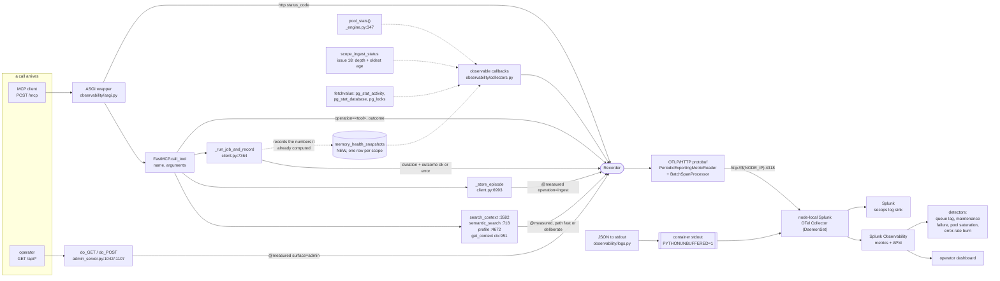
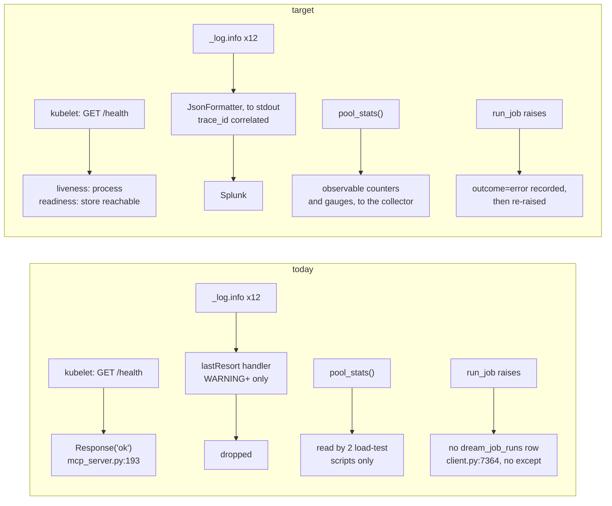

# ops: observability, published speed targets, and dashboards

**Issue:** [#19](https://github.disney.com/jedai/memotron/issues/19) · **Status:** proposed ·
**Target release:** August 3.08 (issue says LATEST by Mon Aug 17, 2026 — **that date is already
eight days past**; see Risks §1)

> ## Read this first: the baseline, and what is actually gated
>
> Every `file:line` below was read from the working checkout, which is on
> **`feat/next-ws25-ws28`** at **`f7ddd77`** — **110 commits ahead of pushed `origin/main`**
> (`9bfc298`) and **29 commits ahead of local `main`** (`80be544`). This branch is cut from
> `origin/main` so the PR is docs-only, and its citations therefore describe a tree that is on
> neither the remote nor `main`. This is the same drift `docs/design/17-dream-worker.md` flagged at
> 43 commits and `docs/design/18-ingestion-status-events.md` at 79 — one branch further along.
>
> **The citations do not translate to `main` by inspection.** Eight of the files cited here differ
> between `main` and `f7ddd77` (`git diff --name-only main..f7ddd77` covers `client.py`,
> `context.py`, `health.py`, `models.py`, `dreaming.py`, `admin_server.py`,
> `storage/sqlite.py`, `storage/receipts.py`), and the shift is large in the two biggest:
>
> | Symbol | on `f7ddd77` (cited here) | on `main` `80be544` |
> |---|---|---|
> | `client.py _store_episode` | `:6993` | `:6743` |
> | `client.py _run_job_and_record` | `:7364` | `:7114` |
> | `client.py search_context` | `:3582` | `:3472` |
> | `client.py memory_evolution` | `:5040` | `:4856` |
> | `context.py get_context` | `:951` | `:728` |
> | `health.py compute_memory_health` | `:60` | `:60` (unchanged) |
> | `mcp_server.py health` | `:193` | `:193` (unchanged) |
> | `admin_server.py do_GET` | `:1042` | `:1042` (unchanged) |
>
> **Grep for the symbol, do not trust the line number.** Every citation names a symbol precisely so
> that `rg -n "<symbol>"` resolves it on whatever tree work actually starts from.
>
> **Unlike those two designs, most of this one is not gated on the unpushed commits.** #35 merged,
> so the `storage/` package, `pool_stats()`, `memory_evolution`, the FastMCP servers and
> `admin_server.py` are all on `origin/main` today:
>
> ```
> git grep -c "def pool_stats"        origin/main -- src/memotron/   # -> 2 files
> git grep -c "memory_evolution"      origin/main -- src/memotron/   # -> matches
> git grep -c "episode_event_counts"  origin/main -- src/memotron/   # -> 4 files
> git grep -c "_run_job_and_record"   origin/main -- src/memotron/   # -> 1 file
> ```
>
> Three things this design touches **do not** exist on `origin/main` and gate only the phases that
> name them:
>
> ```
> git ls-tree --name-only origin/main src/memotron/ | grep -c "health.py\|context.py"  # -> 0
> git grep -n "def claim_episodes" origin/main -- src/memotron/                        # -> no matches
> ```
>
> - `health.py` (`compute_memory_health`, the memory-health gates) — gates **Phase 4** only.
> - `context.py` (`get_context`, the deliberate read path) — gates **U6** in Phase 2 only.
> - `claim_episodes` / `dream_claims` implementations — gate nothing here directly; on `origin/main`
>   the name appears only as the *reserved surface* comment at `storage/base.py:376-388`.
>
> `origin/main` also lacks `gateway.py`, `migration.py`, `retrieval.py`, `synthesis.py`,
> `transcripts.py`. Line numbers will have shifted by the time work starts; **re-verify before
> starting.** This document uses the current vocabulary (**rollup**, not `theme`).

## Problem

Memotron emits no measurement of itself. In a cluster with a collector on every node, it puts
nothing into it.

- **The only self-report is a constant.** `mcp_server.py:192-194` is
  `@mcp.custom_route("/health") → Response("ok", media_type="text/plain")` —
  literally the string `ok`, no dependency check. `agent_memory_mcp.py:251-253` is byte-identical.
  `admin_server.py:1050-1051` answers `/health` with `_send_no_content()` (`:2911`), an HTTP 204
  with no body. All three of the API's probes — startup, readiness, liveness — point at that same
  constant (`values-latest.yaml:38,42,48`), so **liveness and readiness are indistinguishable and
  neither can fail while the process is alive**.
- **Nothing is timed. Anywhere.** `rg -n "perf_counter|time\.monotonic|duration_ms|elapsed_ms" src/`
  returns no matches. Not one log line, receipt field, or record carries a measured duration. The
  `*_ms` names that exist in `src/` are *timeouts*, not measurements
  (`storage/postgres/_engine.py:84 statement_timeout_ms`). The only real timing code in the repo is
  in two standalone scripts (`scripts/operational_store_loadtest.py:716`,
  `scripts/operational_store_benchmark.py:307`) whose numbers go into a local JSON report and
  nowhere else. **There is no retrieval speed number, as the issue says.**
- **Logs are 21 lines of printf, and they are not configured.** Five modules call
  `logging.getLogger(__name__)` (`dreaming.py:116`, `extraction.py:38`, `local_platform.py:35`,
  `storage/postgres/__init__.py:57`, `storage/postgres/_engine.py:42`). There is **no
  `basicConfig`, no `dictConfig`, no handler, no formatter** anywhere in the project, so those
  loggers fall through to the stdlib `lastResort` handler: **`WARNING` and above only, to stderr,
  unformatted**. The twelve `_log.info` calls in `dreaming.py` have never produced output in
  production. `LOG_LEVEL` (`mcp_server.py:79`) configures *FastMCP's own* logging and does not touch
  the root logger — and it is not set in `.helm/`, `.harness/`, or the `Dockerfile` anyway. Both
  HTTP servers additionally suppress their access logs (`admin_server.py:1039` returns
  unconditionally).
- **No telemetry SDK, and no chart wiring for one.** `uv.lock` resolves 49 packages; zero are
  telemetry. No `/metrics`, no `OTEL_*`, no `SPLUNK_*`, no collector sidecar, no
  `prometheus.io/scrape`. `memotron.podAnnotations` and `admin.podAnnotations` are both `{}`
  (`values-latest.yaml:83,108`). The single environment tag in the whole chart is
  `environmentVariables.ENVIRONMENT: latest` (`:13-14`) and **no Python code reads it**
  (`rg -n 'environ.*"ENVIRONMENT"' src/` → no matches). So "Memotron just has to emit into it" is
  true of the collector and false of the chart: the pod today has no address to emit to.
- **A failed maintenance run leaves no record at all.** `client.py:7364 _run_job_and_record` calls
  `run_job` (`:7375`) and then `record_dream_job_run` (`:7381`) with **no `try`/`except`**. A raised
  job propagates and the `dream_job_runs` row is never written. `DreamJobRunRecord`
  (`models.py:1277`) has no duration field, no outcome field, and no error field. "Maintenance job
  duration and outcome" is not a metric that needs exporting — it is a fact the service does not
  currently possess.
- **Queue *lag* has no primitive.** Depth has one bounded query,
  `episode_event_counts(*, scope, event) -> tuple[int, int]` (`storage/base.py:410`, SQLite
  `sqlite.py:5393`, Postgres `postgres/_operational.py:184`), but it is per-`(scope, event)`.
  `client.py:7943 _pending_episode_count` is an **O(N) full-store scan** — it iterates
  `graph.episodes()` in Python, hydrating every episode through pydantic, per call. And **no
  oldest-unprocessed-episode age exists anywhere in the repo**, which is the exact number
  Acceptance 3 alerts on.

### What already exists — do not re-scope

| Concern from the issue | Status | Evidence |
|---|---|---|
| A named seam for **every** MCP tool call | **exists, in the library** | `FastMCP.call_tool(self, name: str, arguments: dict[str, Any]) -> Sequence[ContentBlock] \| dict[str, Any]` — verified in installed `mcp` **1.29.0**; it is the one funnel all ~60 `@mcp.tool()` functions pass through |
| A named seam for the ASGI app | **exists, in the library** | `FastMCP.streamable_http_app(self) -> Starlette`, public in mcp 1.29.0. `mcp.run(transport="streamable-http")` (`examples/mcp_server.py:43`) calls it internally and gives no injection point — see U8 |
| Ingestion choke point | **exists** | `client.py:6993 _store_episode` — every `add_episode`, `add_episode_bulk`, `add_session`, `open_session`, `add_context`, `add_artifact` and `add_memory` trace episode routes through it (callers `client.py:407,528,669,931,939,5879`, `session.py:127`) |
| Maintenance record point | **exists** | `client.py:7364 _run_job_and_record`, the single writer of `dream_job_runs`; `dreaming.py:834 run_job` is the single executor, with the terminal bracket at `:917-920` and `release_dream_claims` in `finally` at `:940` |
| **Pool counters** | **exists and is already labelled for this issue** | `storage/postgres/_engine.py:347 def pool_stats(self) -> dict[str, Any]`, docstring: *"Pool counters for the observability issue (sizing evidence)."* Re-exported `postgres/__init__.py:165`. **Its only callers in the whole repo are two load-test scripts** — no server, no endpoint reads it |
| **The counter list itself** | **already specified in-repo** | `docs/operational-store-sizing.md:394-406`, section *"Feeding the observability issue"*, names `pool_size`, `requests_waiting`, `requests_queued`, `requests_wait_ms`, `connections_errors`, `returns_bad`, plus instance-level connections/locks/`pg_stat_database.deadlocks`, plus per-operation p50/p95/p99. `:12-13` calls these "the input to the observability issue". **This design implements that page.** |
| Instance-level SQL reachable through the contract | **exists** | `_engine.py:301 fetchvalue`, `:298 fetchall`, `:354 server_version`, `:357 has_extension`, `:425 schema_version` |
| Compression and dedup numbers | **exists — but not where the issue says** | `MemoryEvolutionProof.compression_ratio` (`models.py:1050`, computed `client.py:5174`) and `.semantic_dedup_rate` (`models.py:1067`, computed `client.py:5184`), plus `tokens_saved_vs_raw` (`:5203`) and `tokens_saved_by_demotion` (`:5208`). Producer: `client.py:5040 memory_evolution(*, scope, as_of=None, history_limit=1000, token_budget=None) -> MemoryEvolutionProof` |
| Memory-health measurements | **exists, pure, and separate from the above** | `health.py:60 compute_memory_health(...) -> MemoryHealthReport` — no store, no clock, no I/O. Computes `max_type_share`, `normalized_type_entropy` (`:36`), `abstain_rate`, `dead_types`, `general_label_share`. Policy `config.py:875 MemoryHealthPolicy`. **On `origin/main` this module does not exist.** |
| Health trips already recorded | **exists** | `dreaming.py:2459 _evaluate_formation_health` → `:2478 compute_memory_health` → receipted `FORMATION_HEALTH_GATE_TRIPPED` (`storage/receipts.py:111`) at `:2494-2501` with the full report in `event_payload` |
| One bounded depth query | **exists** | `episode_event_counts` (above) — one SQL aggregate, no store hydration |
| The audit surface | **exists, and it is not logs** | `extraction.py:1029` states the rule outright: a decision "must be discoverable from the receipt ledger, never only by grepping application logs." This design does not move any audit fact into logs |
| Metrics / traces / structured logs / alerts / dashboards | **does not exist** | see Problem. **This issue owns all of it.** `docs/design/17-dream-worker.md` explicitly rejected a `/metrics` endpoint and deferred alert ownership here; `docs/design/18-ingestion-status-events.md` deferred "the exporter" here |

### Six real gaps

1. **No SDK, no exporter, no chart address.** Nothing to emit with, and nowhere to emit to.
2. **No timing anywhere**, so no retrieval speed and no maintenance duration.
3. **Logging is unconfigured**, so `INFO` has never been emitted and nothing is structured.
4. **Maintenance failure is unrecorded** — `_run_job_and_record` has no `except`, and the record
   shape has no outcome field.
5. **Queue lag has no primitive.** Depth is per-`(scope, event)`; oldest-queued age does not exist.
6. **The Memory Graph cluster does not exist yet.** `storage/factory.py:76-77` registers exactly two
   engines, `"sqlite"` and `"postgres"`; the factory's own error message (`:49-53`) says "the Memory
   Graph engine registers here when that work lands". `rg -n "neo4j|falkor|cypher|gremlin|memgraph"
   src/ pyproject.toml .helm/` finds one hit and it is a comment (`storage/base.py:264`). See
   Risks §2 — this is the one part of the issue whose premise does not hold.

## Decision: one `observability/` package that owns the SDK boundary; instrument at the choke points that already exist; an optional extra so the hermetic install is unchanged

Four commitments, in priority order.

1. **Exactly one module imports `opentelemetry`.** `observability/telemetry.py` builds the providers
   and returns a `Recorder`. Every other module — `client.py`, `dreaming.py`, `mcp_server.py`,
   `admin_server.py` — depends on the `Recorder` protocol and never on the SDK. Consequence: the
   whole feature is unit-testable with a `FakeRecorder` that records calls, and a wrong SDK version
   breaks one file.
2. **The SDK is an optional extra, following the `postgres` precedent exactly.** `pyproject.toml:19-22`
   already establishes the pattern with the reason spelled out — *"Kept optional so the hermetic
   SQLite path installs with no driver; the deployment image ... install[s] with `--extra
   postgres`."* Same argument, same shape: a new `observability` extra, and `Dockerfile:17` becomes
   `uv sync --frozen --no-dev --extra postgres --extra observability`. `uv run pytest` and
   `uv run examples/simulation.py` install and run with **zero new dependencies** and get
   `NoOpRecorder`. `docs/design/18-ingestion-status-events.md` refused presidio on exactly this
   hermetic-operation ground; this is the same invariant honoured, with the extra as the escape hatch.
3. **Instrument the choke points the repo already documents as choke points.** One line at each. No
   new dispatcher, no wrapper layer around 60 tool functions, no per-call-site duplication:

   | Signal from the issue | Choke point | Why there |
   |---|---|---|
   | retrieval speed, error rate | `FastMCP.call_tool` (mcp 1.29.0) | one funnel for all ~60 tools, with the tool name in hand |
   | retrieval speed by path | `client.py:3582 search_context`, `:718 semantic_search`, `:4672 profile`, `context.py:951 get_context` | the four read entries; there is no fifth and there is no single one — see below |
   | ingestion throughput | `client.py:6993 _store_episode` | the repo's own documented "single episode-persistence choke point" |
   | maintenance duration + outcome | `client.py:7364 _run_job_and_record` | the single writer of `dream_job_runs` |
   | pool saturation | `postgres/_engine.py:347 pool_stats()` | already exists, already named for this issue, currently unread |
   | queue depth / lag | observable gauge over the store | pull-side; must not be computed per request |
   | HTTP traffic and status | ASGI wrapper over `streamable_http_app()` | covers `/health` and non-tool routes that `call_tool` cannot see |
   | admin traffic | `admin_server.py:1042 do_GET` / `:1107 do_POST` | the only two entries; each already has exactly one `try`/`except` |

4. **The fast and deliberate paths are separated by what the code observably did, not by which
   method was called.** This is load-bearing and easy to get wrong. `context.py:951 get_context` is
   **bimodal by construction**: on an unchanged watermark it returns the stored artifact with *zero
   LLM calls and zero writes* (`context.py:991`, comment: *"the common case: zero LLM calls, zero
   writes"*); on a miss it asks a `ContextTransport` to fold the delta, which is a gateway round
   trip. A single p95 over `get_context` is the average of two distributions that differ by three
   orders of magnitude, and it moves with cache hit rate rather than with speed. So every read
   records a `path` attribute of `fast` or `deliberate` **and** `get_context` records
   `context.cache=hit|miss`, and the published target has a row per `(path, cache)`, never one
   number.

### Deciding criteria

1. **`scope_key` must never be a metric attribute.** Splunk Observability bills per metric time
   series, and `MemoryScope.key` is one value per customer, agent, or project — unbounded by
   design. `tenant` is bounded and the issue explicitly requires per-tenant traffic, errors and lag,
   so `tenant` is allowed on a named subset. Everything else scope-shaped goes on a *span*
   attribute, where cardinality is per-trace and free, or on the existing Admin API, not on a
   metric. The forbidden set is asserted as an absence in Done when.
2. **One duration histogram, not one metric name per operation.** `memotron.operation.duration`
   with an `operation` attribute, rather than `memotron.search.duration`,
   `memotron.profile.duration`, and 58 more. Sixty metric names cannot be charted with one
   dashboard chart or alerted with one detector, and every new tool would need a dashboard edit.
3. **The metrics are push, over OTLP, to the node-local collector.** A `/metrics` scrape endpoint
   needs a second container port, a `Service`, and a `PodMonitor` the chart has none of — and
   `docs/design/17-dream-worker.md` already rejected `/metrics` for the dream worker on the grounds
   that nothing scrapes it. Push also works unchanged for a worker process with no HTTP surface at
   all, which is what #17 is building.
4. **Pool counters are cumulative; treat them as counters, and never call `pop_stats()`.**
   `psycopg_pool` (**3.3.1** per `uv.lock`) exposes both `get_stats()` and `pop_stats()`, and
   `pool_stats()` wraps `get_stats()`. `requests_num`, `requests_queued`, `requests_wait_ms`,
   `connections_errors` and `returns_bad` are monotonic totals since pool open, so they are
   observable **counters**; `pool_size`, `pool_available` and `requests_waiting` are instantaneous,
   so they are observable **gauges**. Reading them with `pop_stats()` would reset the counters and
   silently break `scripts/operational_store_loadtest.py:749`, the only other reader.
5. **`memory_evolution` is far too expensive for a metric callback.** `client.py:5040` builds
   `MemoryEvolutionProof` from a full store scan and it is never persisted (grep for
   `MemoryEvolutionProof` in `src/`: definition, import, return type, construction, exports — no
   `record_*`, no INSERT, no receipt). `dreaming.py:2520 _context_visible_type_counts` and `:2547
   _context_visible_label_counts` are likewise full `relationships()` / `nodes()` scans. So the
   compression, dedup and memory-health gauges are **recorded when the numbers are already being
   computed** — inside the maintenance sweep — and read from a small persisted snapshot by the
   export callback. The callback must never trigger the computation.
6. **Structured logs are operational, and the receipt ledger stays the audit surface.**
   `extraction.py:1029` states the rule. This design adds no audit fact to a log record, and asserts
   as an absence that no log record carries a `fact`, `body`, or `query` field. `PYTHONUNBUFFERED=1`
   is already set (`Dockerfile:31`), so JSON to stdout needs no further plumbing.
7. **The alert definitions live in the repo as data even though the repo cannot apply them.** There
   is no Splunk/Terraform surface in `jedai/memotron` (`.harness/` deploys a Helm chart and
   nothing else). Putting the detector definitions in `docs/observability-alerts.md` as
   copy-pasteable YAML makes them reviewable here and gives whoever owns the Splunk terraform an
   unambiguous source. Owner still needed — Risks §4.

### Composition with the four open design PRs

- **#18 (`design/18-ingestion-status-events`, PR #40)** is a hard dependency for
  **Acceptance 3**. It builds `oldest_queued_age_seconds` on `ScopeIngestStatus`, the
  `episodes.gen_scope_key` generated column, and `scope_ingest_status(...)` — the number this design
  alerts on and which **does not exist today in any form**. #18 states its half of the contract
  explicitly: *"Expose `queue_depth` and `oldest_queued_age_seconds` on a JSON endpoint that #19's
  future exporter reads."* This design consumes that read model directly in-process rather than over
  HTTP (U13), and **Phase 3 cannot start before #18's Phase 2 lands**.
- **#17 (`design/17-dream-worker`, PR #36)** builds `dream_worker.py` with `plan_sweep` / `run_cycle`
  / `run_sweep`. Its `run_sweep` is the natural caller of this design's snapshot recorder (U12), and
  its open question 2 — *"Who converts 'stuck or failing' into an alert?"* — is answered by U19 here.
  #17 also correctly rejected a `/metrics` endpoint in the worker; this design keeps that, because
  push needs no HTTP surface. **Neither issue blocks the other**: #17 without #19 has queryable
  state and no alert; #19 without #17 measures the maintenance runs that the admin console and
  `local_platform` trigger today.
- **#27 (`design/27-authorization-model`, PR #37)** supplies `principal_from_headers(...) ->
  MemoryPrincipal` and forbids caller-supplied `tenant_id`. Consequence here, stated as a rule:
  **the `tenant` metric attribute is taken from the resolved principal, never from a request body or
  a tool argument.** Until #27 lands, `admin_server.build_demo_principal` (`admin_server.py:363`) is
  called once at process start and serves every request, so `tenant` will be a single constant in
  LATEST — correct, and useless, and that is #27's problem, not a reason to read the body.
- **#23 / #25** own the browser application. See Rejected — the operator-view bullet moves to #25.

## Data flow



### Before / after at the only existing path this changes

The service's self-report is the one behaviour that is replaced rather than added to.



Note T9: the failure record is added and the exception is **still re-raised**. `run_job`'s own
contract depends on an aborted run being left un-checkpointed so byte replay fails closed
(`dreaming.py:848-851`); swallowing the exception here would break that.

## System design

```mermaid
sequenceDiagram
  participant K as kubelet
  participant A as api pod
  participant O as observability.telemetry
  participant CL as Memotron client
  participant S as StorageBackend
  participant C as node-local collector
  participant X as Splunk Observability

  Note over A,O: process start
  A->>O: configure_logging(component="api")
  A->>O: configure_telemetry(settings_from_env())
  O-->>A: Recorder (OtelRecorder, or NoOpRecorder if extra absent)
  A->>O: register_collectors(recorder, storage=S, status=ingest_status)

  Note over K,A: steady state
  K->>A: GET /health
  A-->>K: 200 for liveness; 200 or 503 for readiness (store checked)

  CL->>O: measure(operation="search", surface="mcp", path="fast")
  CL->>S: context_visible_relationships(...)
  S-->>CL: rows
  CL->>O: on exit, histogram.record(ms, attrs)

  loop every 60s
    O->>S: pool_stats(), fetchvalue(pg_stat_database...)
    O->>S: scope_ingest_status(...) [issue 18]
    O->>S: memory_health_snapshots()
    O->>C: OTLP/HTTP POST /v1/metrics
    C->>X: SignalFx / OTLP forward
  end

  Note over CL,S: maintenance
  CL->>CL: _run_job_and_record
  CL->>O: histogram.record(ms, attrs job.kind and outcome)
  CL->>S: record_dream_job_run(record with duration + outcome)
  CL->>S: record_memory_health_snapshot(scope, ratios)
```

### Where each piece lives, and why there

| Module | Owns (one line) | Why there rather than elsewhere |
|---|---|---|
| `observability/names.py` **(new)** | the tag schema and every metric name, as constants | must be importable with the SDK absent, so it cannot live in `telemetry.py`. Pure data: the schema is reviewable and testable on its own |
| `observability/telemetry.py` **(new)** | the **only** `import opentelemetry` in the repo; `Recorder`, `NoOpRecorder`, `OtelRecorder`, `configure_telemetry` | one file to re-verify on an SDK bump, and the seam that makes everything else fake-able. `TelemetrySettings` reads env here, not in `config.py`, because `config.py` is 202 KB and owns memory policy, not process wiring |
| `observability/logs.py` **(new)** | `JsonFormatter` + `configure_logging` | the root-logger configuration that has never existed. Separate from `telemetry.py` because logs must work when the extra is absent |
| `observability/measured.py` **(new)** | `measure()` context manager and `@measured` decorator over a `Recorder` | the timing seam. Pure over the protocol, so its retry/exception/attribute behaviour is tested without an SDK, an app, or a store |
| `observability/asgi.py` **(new)** | `TelemetryASGIMiddleware` | HTTP-level status and duration, including `/health` and any route `call_tool` cannot see. Its own module because it is the only piece that speaks ASGI |
| `observability/mcp.py` **(new)** | `instrument_fastmcp(mcp, recorder)` — wraps `call_tool` | keeps `mcp_server.py` (1275 lines, 60 tools) at a one-line change, and keeps the `mcp`-library coupling in one place next to the SDK coupling |
| `observability/collectors.py` **(new)** | the pull-side observable callbacks: pool, instance, queue, memory-health | one responsibility — "read a number the system already has and hand it to the Recorder". Every callback is a pure function of a store-shaped Protocol, so each is tested with a fake store |
| `observability/graph_cluster.py` **(new)** | `MemoryGraphClusterProbe` protocol + `PostgresClusterProbe` + `UnavailableClusterProbe` | the one part with no real backend yet (Risks §2). Isolating it means the undecided engine blocks one file, not the feature |
| `client.py` | calling `measure()` at the four read entries, at `_store_episode`, and at `_run_job_and_record`; writing the health snapshot | those *are* the choke points (`:3582`, `:718`, `:4672`, `:6993`, `:7364`). `client.py` is 400 KB — it gets call sites, never logic |
| `context.py` | the `context.cache` attribute (`hit` / `miss`) on the two branches | only `get_context` knows which branch it took (`:991` vs the fold). Nothing outside can distinguish them |
| `models.py` | `DreamJobRunRecord.duration_ms` / `.outcome` / `.error_code`; `MemoryHealthSnapshot` | every record shape lives here; the fields must default so existing `payload_json` rows still validate |
| `storage/base.py` + `sqlite.py` + `postgres/_operational.py` | `record_memory_health_snapshot` / `memory_health_snapshots` on the ABC and both engines | the ABC is the contract; #35's rule is that a new operational table lands on both engines with a migration appended |
| `admin_server.py` | `measure()` in `do_GET`/`do_POST`; readiness split on `/health` | the only two request entries (`:1042`, `:1107`) and the only place `/health` is answered for the admin surface |
| `examples/mcp_server.py`, `examples/agent_memory_mcp_server.py` | building the app, wrapping it, serving it with uvicorn | `mcp.run()` offers no injection point (verified: `run_streamable_http_async` constructs `uvicorn.Config` itself). The entry point is the right place to compose |
| `.helm/` | the collector address, the resource tags, `LOG_LEVEL` | the pod has no address to emit to today |
| `docs/` **(new files)** | `retrieval-speed-targets.md`, `observability-alerts.md` | the published number and the detector definitions. `docs/operational-store-sizing.md` is the precedent for a measurement page that names its own re-run command |

## Contracts

### Tag schema

Resource attributes, set once at process start. Both spellings of the environment attribute are
set deliberately: Splunk Observability's environment filter reads `deployment.environment`, while
OTel semantic conventions renamed it to `deployment.environment.name`.

| Attribute | Value | Source |
|---|---|---|
| `service.name` | `jedai-memotron` | `OTEL_SERVICE_NAME` |
| `service.namespace` | `jedai` | `OTEL_RESOURCE_ATTRIBUTES` |
| `deployment.environment` | `latest` | `environmentVariables.ENVIRONMENT` (`values-latest.yaml:13-14`) — read by Python for the first time |
| `deployment.environment.name` | `latest` | same value, both keys |
| `service.version` | image tag, e.g. `0.1.1` | `values-latest.yaml:18` via a new env var |
| `service.instance.id`, `k8s.pod.name` | pod name | `fieldRef: metadata.name` — the pattern `_helpers.tpl:102-105` already uses |
| `k8s.namespace.name` | `jedai-memotron` | `fieldRef: metadata.namespace` |
| `memotron.component` | `api` \| `admin` \| `dream-worker` | per-deployment constant |

Metric attributes, per data point. **This list is exhaustive and closed** — anything absent from it
is forbidden on a metric.

| Attribute | Domain | On |
|---|---|---|
| `operation` | tool name, or `search` \| `semantic_search` \| `profile` \| `get_context` \| `ingest` \| a route template | duration, errors |
| `surface` | `mcp` \| `admin` \| `library` | duration, errors |
| `path` | `fast` \| `deliberate` | read duration only |
| `context.cache` | `hit` \| `miss` | `get_context` duration only |
| `outcome` | `ok` \| `error` | duration, errors, maintenance |
| `error.type` | a bounded machine code, never provider text | errors only |
| `tenant` | tenant id, from the resolved principal | duration, errors, queue depth, queue lag |
| `tier` | usage tier, from tenant config; `unspecified` when absent | read duration only — see Risks §3 |
| `job.kind` | `formation` \| `consolidation` \| `pruning` \| `coherence` (`models.py:24`) | maintenance only |
| `http.status_code` | int | ASGI request metrics only |
| `pool.name` | psycopg pool name | pool metrics only |
| `member` | cluster member identifier | graph-cluster metrics only |

**Forbidden on any metric attribute**, asserted as an absence in Done when: `scope_key`, `scope_id`,
`agent_id`, `principal_id`, `episode_uuid`, `relationship_uuid`, `query`, and any fact text. Scope
identifiers belong on a span attribute or on the Admin API.

### Metrics

Explicit-bucket histograms. Note the collector-side dependency in Risks §5: Splunk Observability
requires `send_otlp_histograms: true` on the collector to keep explicit buckets, and p95/p99 depend
on those buckets surviving.

| Name | Instrument | Unit | Attributes |
|---|---|---|---|
| `memotron.operation.duration` | Histogram | `ms` | `operation`, `surface`, `path`, `context.cache`, `outcome`, `tenant`, `tier` |
| `memotron.operation.errors` | Counter | `{error}` | `operation`, `surface`, `error.type`, `tenant` |
| `memotron.ingest.episodes` | Counter | `{episode}` | `surface`, `tenant`, `outcome` |
| `memotron.ingest.queue.depth` | Observable Gauge | `{episode}` | `tenant` |
| `memotron.ingest.queue.lag` | Observable Gauge | `s` | `tenant` |
| `memotron.maintenance.duration` | Histogram | `ms` | `job.kind`, `outcome`, `tenant` |
| `memotron.maintenance.runs` | Counter | `{run}` | `job.kind`, `outcome`, `error.type`, `tenant` |
| `memotron.store.pool.size` / `.available` / `.waiting` | Observable Gauge | `{connection}` \| `{request}` | `pool.name` |
| `memotron.store.pool.requests` | Observable Counter | `{request}` | `pool.name` |
| `memotron.store.pool.wait_time` | Observable Counter | `ms` | `pool.name` |
| `memotron.store.pool.connection_errors` / `.returns_bad` | Observable Counter | `{error}` | `pool.name` |
| `memotron.store.connections.used` / `.max` | Observable Gauge | `{connection}` | — |
| `memotron.store.deadlocks` | Observable Counter | `{deadlock}` | — |
| `memotron.store.locks.ungranted` | Observable Gauge | `{lock}` | — |
| `memotron.memory.compression_ratio` | Observable Gauge | `1` | `tenant` |
| `memotron.memory.dedup_rate` | Observable Gauge | `1` | `tenant` |
| `memotron.memory.tokens_saved` | Observable Gauge | `{token}` | `tenant` |
| `memotron.memory.type_entropy` / `.max_type_share` | Observable Gauge | `1` | `tenant` |
| `memotron.memory.health_gate_trips` | Counter | `{trip}` | `gate`, `severity`, `tenant` |
| `memotron.graph.cluster.member_up` | Observable Gauge | `1` | `member`, `role` |
| `memotron.graph.cluster.replication_lag` | Observable Gauge | `s` | `member` |
| `memotron.graph.cluster.storage_headroom` | Observable Gauge | `1` | `member` |

Histogram bucket boundaries. The SDK default is
`(0, 5, 10, 25, 50, 75, 100, 250, 500, 750, 1000, 2500, 5000, 7500, 10000)` — verified in
`opentelemetry-sdk` **1.44.0**, `_DEFAULT_EXPLICIT_BUCKET_HISTOGRAM_AGGREGATION_BOUNDARIES`. That is
wrong at the low end for `path=fast`: keyword `search` and `profile` are in-process reads over a
SQLite or pooled-Postgres query, so a p95 that lands under 5 ms is reported as "somewhere in
`(0, 5]`" and the published number would be a bucket edge, not a measurement. Two views:

- `path=fast`: `(0.5, 1, 2, 5, 10, 20, 50, 100, 250, 500, 1000)`
- `path=deliberate`: the SDK default, which already reaches 10 s — a gateway fold call needs it.

### Symbols

| Symbol | Signature | Behaviour |
|---|---|---|
| `Recorder` | `Protocol` — `histogram(name, *, unit, description, boundaries=None) -> HistogramHandle`; `counter(name, *, unit, description) -> CounterHandle`; `observable_gauge(name, *, unit, description, callback) -> None`; `observable_counter(name, *, unit, description, callback) -> None`; `span(name, *, attributes) -> AbstractContextManager[SpanHandle]` | the whole boundary. Nothing outside `telemetry.py` may import the SDK |
| `HistogramHandle` / `CounterHandle` | `Protocol` — `record(value: float, attributes: Mapping[str, str \| int \| float]) -> None` / `add(value: int, attributes=...) -> None` | thin wrappers over `Histogram.record` / `Counter.add`, verified in SDK 1.44.0 |
| `NoOpRecorder` | `() -> NoOpRecorder` | every method a no-op returning no-op handles. **The default** when the extra is absent or the endpoint is unset. Instrumented code must never branch on which recorder it holds |
| `TelemetrySettings` | frozen pydantic — `enabled: bool = False`, `endpoint: str = ""`, `service_name: str = "jedai-memotron"`, `service_namespace: str = "jedai"`, `environment: str = ""`, `service_version: str = ""`, `component: str = "api"`, `instance_id: str = ""`, `export_interval_ms: int = 60_000`, `trace_sample_ratio: float = 0.05` | `enabled` requires a non-empty `endpoint`; a blank endpoint with `enabled=True` fails fast at construction rather than exporting into the void |
| `telemetry_settings_from_env` | `(env: Mapping[str, str] \| None = None) -> TelemetrySettings` | reads `OTEL_EXPORTER_OTLP_ENDPOINT`, `OTEL_SERVICE_NAME`, `ENVIRONMENT`, `MEMOTRON_SERVICE_VERSION`, `MEMOTRON_COMPONENT`, `MEMOTRON_TELEMETRY_ENABLED`, `OTEL_METRIC_EXPORT_INTERVAL`. Mirrors `config.py:3944 storage_settings_from_env` exactly: absent env → the safe default, never a raise |
| `configure_telemetry` | `(settings: TelemetrySettings) -> Recorder` | returns `NoOpRecorder()` when `not settings.enabled`, when the endpoint is blank, **or when `import opentelemetry` raises `ImportError`**. Idempotent: a second call returns the same recorder. Never raises for a telemetry reason |
| `resource_attributes` | `(settings: TelemetrySettings) -> dict[str, str]` | pure. Emits **both** `deployment.environment` and `deployment.environment.name`. Omits an attribute entirely rather than emitting an empty string |
| `measure` | `(recorder: Recorder, *, operation: str, surface: str, clock: Callable[[], float] = time.perf_counter, **attributes: str) -> AbstractContextManager[MeasurementScope]` | records duration on exit **in both paths**. On an exception: `outcome="error"`, `error.type=error_code(exc)`, one `operation.errors` increment, and the exception **re-raised unchanged**. Never swallows. Never raises a telemetry error into the caller |
| `MeasurementScope` | `set(**attributes: str) -> None` | lets the body add attributes discovered mid-call — `path`, `context.cache`, `tenant`. Rejects any key outside the closed attribute list with `ValueError` at call time |
| `measured` | `(operation: str, *, surface: str) -> Callable[[F], F]` | async-aware decorator over `measure`, for the call sites that need no mid-call attributes |
| `error_code` | `(exc: BaseException) -> str` | a bounded, lowercase, whitespace-free code from the exception type — never `str(exc)`, never provider text. Unknown types collapse to `internal_error` |
| `instrument_fastmcp` | `(mcp: FastMCP, recorder: Recorder) -> None` | replaces `mcp.call_tool` with a wrapper that measures `operation=<tool name>`, `surface="mcp"`. Idempotent; a second call does not double-wrap |
| `TelemetryASGIMiddleware` | `(app: ASGIApp, recorder: Recorder, *, route_template: Callable[[str], str]) -> ASGIApp` | records duration and `http.status_code` per request. `route_template` maps a path to a bounded label (`/mcp`, `/health`, `other`) so a scanner cannot create metric series |
| `JsonFormatter` | `logging.Formatter` subclass; `(*, resource: Mapping[str, str]) -> JsonFormatter` | one JSON object per line: `timestamp` (RFC 3339, UTC), `severity`, `logger`, `message`, `trace_id`, `span_id`, the resource attributes, and any `extra`. Non-serializable values become `repr`. **Never** a `fact`, `body`, or `query` key |
| `configure_logging` | `(*, level: str = "INFO", resource: Mapping[str, str], stream=sys.stdout) -> None` | installs one `StreamHandler` on the root logger with `JsonFormatter`; idempotent; removes handlers it previously installed and touches no others. This is the `basicConfig` the project has never had |
| `MemoryHealthSnapshot` | frozen pydantic — `scope_key: str`, `tenant_id: str`, `measured_at: datetime`, `compression_ratio: float`, `semantic_dedup_rate: float`, `tokens_saved_vs_raw: int`, `normalized_type_entropy: float`, `max_type_share: float`, `episode_count: int`, `context_visible_count: int` | the small persisted projection of `MemoryEvolutionProof` + `MemoryHealthReport` that the gauge callback reads. Holds **numbers only** — no fact text, no type names, so it needs no `erasure.py:80 COVERED_STORES` entry |
| `record_memory_health_snapshot` | `(snapshot: MemoryHealthSnapshot) -> None` | upsert on `scope_key`; one row per scope, latest wins. On the `OperationalStorage` ABC, implemented on both engines |
| `memory_health_snapshots` | `(*, limit: int = 500) -> list[MemoryHealthSnapshot]` | newest first; raises `ValueError` on `limit <= 0`, matching `dream_job_runs` |
| `DreamJobRunRecord.duration_ms` | `int = 0` | new, defaulted so existing `payload_json` rows still validate |
| `DreamJobRunRecord.outcome` | `str = "ok"` | `"ok"` \| `"error"`; defaulted for the same reason |
| `DreamJobRunRecord.error_code` | `str = ""` | a bounded code from `error_code(exc)`; provider text goes to the receipt's sealed payload, not here |
| `pool_metric_points` | `(stats: Mapping[str, Any]) -> tuple[PoolPoint, ...]` | **pure**: maps one `pool_stats()` dict to typed points, splitting the six cumulative keys from the three instantaneous ones. Missing keys are omitted, never defaulted to 0 — an absent counter must not look like a flat one |
| `MemoryGraphClusterProbe` | `Protocol` — `members() -> tuple[ClusterMember, ...]` | the swap point for whichever engine #10 picks |
| `ClusterMember` | frozen dataclass — `member: str`, `up: bool`, `accepting_writes: bool`, `replication_lag_seconds: float \| None`, `storage_headroom_ratio: float \| None` | `None` means "this engine cannot report it", which is distinct from `0.0` |
| `UnavailableClusterProbe` | `() -> UnavailableClusterProbe` | returns `()`. **The wired default in LATEST**, because there is no cluster (Risks §2). Emits no metric rather than a fabricated healthy one |
| `PostgresClusterProbe` | `(engine: PostgresEngine) -> PostgresClusterProbe` | `pg_stat_replication` / `pg_is_in_recovery()` / `pg_database_size` via `_engine.py:301 fetchvalue`. Correct for a Postgres-shaped Memory Graph; unreachable until `operationalStore.enabled` flips |
| `GET /health` (both surfaces) | `?ready=1` → 200/503; bare → 200 | liveness stays a constant so a slow store cannot restart-loop the pod; **readiness** checks the store. Splits the one thing all three probes currently share |

New table, added to `storage/base.py`, both engines, and a migration appended to
`postgres/_migrations.py` (append-only, no down path — #35's rule):

```sql
CREATE TABLE IF NOT EXISTS memory_health_snapshots (
    scope_key             TEXT PRIMARY KEY,
    tenant_id             TEXT NOT NULL,
    measured_at           TEXT NOT NULL,
    compression_ratio     REAL NOT NULL,
    semantic_dedup_rate   REAL NOT NULL,
    tokens_saved_vs_raw   INTEGER NOT NULL,
    normalized_type_entropy REAL NOT NULL,
    max_type_share        REAL NOT NULL,
    episode_count         INTEGER NOT NULL,
    context_visible_count INTEGER NOT NULL
);
CREATE INDEX IF NOT EXISTS memory_health_snapshots_tenant_idx
    ON memory_health_snapshots(tenant_id, measured_at);
```

Operational bookkeeping, like `dream_claims` and `episode_processing`: **outside**
`graph_state_hash` and outside the receipt ledger.

### Chart contract

```yaml
# .helm/values-latest.yaml
observability:
  enabled: true
  # The collector is a DaemonSet; a pod reaches its node's instance by host IP,
  # never by localhost. 4318 is OTLP/HTTP; the Splunk agent listens on 4317 and
  # 4318 both. See Risks 5 for the send_otlp_histograms dependency.
  otlpPort: 4318
  metricExportIntervalMs: 60000
  traceSampleRatio: 0.05
  logLevel: INFO
```

rendered into both deployments as:

```yaml
- name: NODE_IP
  valueFrom: { fieldRef: { fieldPath: status.hostIP } }
- name: OTEL_EXPORTER_OTLP_ENDPOINT
  value: "http://$(NODE_IP):4318"
- name: OTEL_SERVICE_NAME
  value: "jedai-memotron"
- name: MEMOTRON_COMPONENT
  value: "api"          # "admin" in admin-deployment.yaml
- name: MEMOTRON_SERVICE_VERSION
  value: "0.1.1"        # .Values.memotron.image.tag
- name: MEMOTRON_TELEMETRY_ENABLED
  value: "true"
- name: LOG_LEVEL
  value: "INFO"         # never set before, on either deployment
```

`ENVIRONMENT` already reaches the pod through `configmap.yaml:8-9` and `envFrom` — no chart change
needed for it, only Python that reads it.

### Alert contract — `docs/observability-alerts.md`

| Detector | Signal | Condition | Maps to |
|---|---|---|---|
| queue lag growing | `memotron.ingest.queue.lag` | `max` over 10 m > 900 s, sustained 15 m | **Acceptance 3**; 900 s is `DREAM_CLAIM_STALE_SECONDS` (`sqlite.py`), so the threshold is the system's own staleness bound rather than a guess |
| maintenance failing | `memotron.maintenance.runs{outcome=error}` | ≥ 3 in 15 m for one `job.kind` | Scope bullet 6 |
| pool saturation | `memotron.store.pool.waiting` | `> 0` sustained 5 m, **or** `pool.size / max_size > 0.9` for 10 m | `docs/operational-store-sizing.md:394-406` |
| deadlocks appearing | `memotron.store.deadlocks` | any increase over 1 h | the sizing page states "no lock errors" is an acceptance criterion; a rising count *is* that criterion failing |
| error-rate burn | `memotron.operation.errors` / `memotron.operation.duration` count | 2 %-of-budget-per-hour fast burn, 5 %-per-6 h slow burn, against the four-nines availability class | Scope bullet 6 |

## Units

There is no `conftest.py` and no `@pytest.fixture` anywhere under `tests/`. Every test builds its
own state inline — `PropertyGraphStore(tmp_path / "g.sqlite")`, and
`RuleBasedExtractionTransport()` where an extractor is needed
(`tests/test_dream_concurrency.py:63-72`). **Do not add a fixture package.** Every unit test below
uses a `FakeRecorder` built as a local helper in the test module, in that same style.

Ordered by dependency. Each leaves the repo green.

### Phase 1 — traffic visible with the correct tags (Acceptance 1). Buildable on `origin/main` today.

**U1 — the tag schema and metric names, as data** · module: `src/memotron/observability/names.py`
- in: `TelemetrySettings(environment="latest", service_version="0.1.1", component="api", instance_id="pod-abc")`
- out: `resource_attributes(...)` containing both `deployment.environment` and
  `deployment.environment.name` equal to `"latest"`; `METRIC_NAMES` and `ATTRIBUTE_KEYS` frozensets
- unit: `tests/test_observability_names.py` — both environment keys present and equal; an empty
  `service_version` omits the key rather than emitting `""`; every name in `METRIC_NAMES` starts
  `memotron.` and is lowercase-dotted; `FORBIDDEN_METRIC_ATTRIBUTES` contains `scope_key`,
  `agent_id`, `episode_uuid`, `query`, `principal_id`; `ATTRIBUTE_KEYS` and
  `FORBIDDEN_METRIC_ATTRIBUTES` are disjoint
- int: — (pure)

**U2 — the Recorder seam, the no-op default, and the SDK boundary** · module: `src/memotron/observability/telemetry.py`
- in: `TelemetrySettings()` with no endpoint; then one with `endpoint="http://127.0.0.1:4318"`
- out: `NoOpRecorder` in the first case; an `OtelRecorder` in the second; `TelemetrySettings(enabled=True, endpoint="")` raises at construction
- unit: `tests/test_observability_telemetry.py` — no-op handles accept `record`/`add` and return
  `None`; `configure_telemetry` is idempotent (same object twice); monkeypatching the module's
  `import` of `opentelemetry` to raise `ImportError` still yields `NoOpRecorder` and logs once at
  `WARNING`; `telemetry_settings_from_env({})` returns `enabled=False` and does not raise;
  boundaries reach `create_histogram(..., explicit_bucket_boundaries_advisory=...)` — the verified
  SDK 1.44.0 keyword
- int: `tests/test_observability_telemetry.py::test_metrics_reach_an_in_memory_reader` — a real
  `MeterProvider` with `InMemoryMetricReader`, record 3 values, assert one
  `HistogramDataPoint` with the configured `explicit_bounds` and `count == 3`.
  `pytest.importorskip("opentelemetry")` so the suite passes without the extra

**U3 — structured logs to stdout** · module: `src/memotron/observability/logs.py`
- in: `configure_logging(level="INFO", resource={...}, stream=io.StringIO())`, then
  `logging.getLogger("memotron.dreaming").info("episode %s formed", "e1")`
- out: one line of JSON with `severity="INFO"`, `logger="memotron.dreaming"`,
  `message="episode e1 formed"`, and every resource key
- unit: `tests/test_observability_logs.py` — valid JSON, one object per line; a multi-line
  exception traceback stays on **one** line; a non-serializable `extra` value becomes its `repr`
  rather than raising; calling `configure_logging` twice leaves exactly one handler; a pre-existing
  unrelated handler survives; `severity` uses the level name; timestamps are RFC 3339 with `Z`
- int: `tests/test_observability_logs.py::test_info_from_the_real_modules_is_emitted` — configure,
  then trigger the real `_log.info` path in `dreaming.py` via a one-episode formation run over
  `tmp_path`, and assert a JSON line appears on the captured stream. This is the regression that
  pins the actual bug: `INFO` from these modules has never been emitted

**U4 — the timing seam** · module: `src/memotron/observability/measured.py`
- in: `with measure(rec, operation="search", surface="mcp") as m: m.set(path="fast")`; and the same
  body raising `ValueError`
- out: first — one duration point with `outcome="ok"`, `path="fast"`, no error increment; second —
  one duration point with `outcome="error"`, `error.type="value_error"`, one `operation.errors`
  increment, and `ValueError` **propagating**
- unit: `tests/test_observability_measured.py` — an injected `clock` makes the recorded duration
  exact; `m.set(scope_key="x")` raises `ValueError` naming the forbidden key; a `Recorder` whose
  `record` itself raises does **not** break the wrapped call; `@measured` works on `async def` and
  preserves `__name__`/`__doc__`; `error_code` output is lowercase, whitespace-free, and never
  contains `str(exc)` — asserted with an exception whose message is a unique sentinel
- int: — (pure over the protocol)

**U5 — instrument the three read entries that exist on `origin/main`** · module: `src/memotron/client.py`
- in: `await client.search(query=..., scope=...)`, `semantic_search(...)`, `profile(...)` against a
  client built with a `FakeRecorder`
- out: exactly one `memotron.operation.duration` point per call, with `operation` in
  `{search, semantic_search, profile}`, `surface="library"`, and `path="fast"` for `search`/`profile`
  and `path="deliberate"` for `semantic_search`
- unit: `tests/test_observability_client.py` — one point per call, never two for
  `search` → `search_context` (`client.py:3558` delegates to `:3582`; only the outer entry is
  measured); a read that raises records `outcome="error"` and re-raises; with `NoOpRecorder` the
  returned `SearchResults` is equal to the un-instrumented result
- int: `tests/test_observability_client.py::test_a_real_read_reaches_the_meter` — real
  `Memotron` over `tmp_path`, real `add_memory` + `run_due_dreams`, then `search`; assert one
  histogram point with a duration `> 0` and the expected attribute set

**U6 — the two branches of the deliberate path** · module: `src/memotron/context.py`
  · **gated: `context.py` is not on `origin/main`**
- in: `get_context(...)` twice with an unchanged fact set and a fake `ContextTransport` that counts calls
- out: first call — `context.cache="miss"`, `path="deliberate"`, transport called once; second —
  `context.cache="hit"`, transport **not** called
- unit: `tests/test_observability_context.py` — hit and miss produce different `context.cache`
  values; the hit path's recorded duration is strictly less than the miss path's with an injected
  clock; a transport failure (which `get_context` degrades on rather than raising, per its
  docstring) records `outcome="degraded"`, not `"ok"` and not `"error"`
- int: same file — a real two-call sequence over `tmp_path` asserting exactly one `miss` then one `hit`

**U7 — one wrapper for all ~60 MCP tools** · module: `src/memotron/observability/mcp.py`
- in: a `FastMCP` instance with two registered tools; `instrument_fastmcp(mcp, rec)`; then
  `await mcp.call_tool("search", {...})` and a call to a tool that raises
- out: one duration point per call with `operation` equal to the tool name and `surface="mcp"`;
  the raising tool yields `outcome="error"` and one error increment
- unit: `tests/test_observability_mcp.py` — the tool's return value is unchanged (asserted by
  equality against the un-instrumented result); calling `instrument_fastmcp` twice produces one
  point per call, not two; an unknown tool name still raises the library's own error and is recorded
  once; `operation` values are exactly the registered tool names, so cardinality is bounded by the
  tool table
- int: same file — over the real `memotron.mcp_server.mcp` object, `instrument_fastmcp`, then
  `await mcp.call_tool("memory_contract", {...})`; assert one point named for that tool

**U8 — HTTP-level request metrics, and an entry point that can be wrapped** · module: `src/memotron/observability/asgi.py`
- in: the middleware over a two-route stub app; requests to `/mcp`, `/health`, and `/wp-login.php`
- out: one duration point per request carrying `http.status_code`; `route_template` maps the third
  to `other`
- unit: `tests/test_observability_asgi.py` — driven with `httpx.ASGITransport` (`httpx` is already
  in `uv.lock`), no server; a 500 from the app records `outcome="error"` and the exception still
  propagates; 1000 distinct unknown paths produce exactly **one** metric series
- int: `tests/test_observability_asgi.py::test_entry_point_serves_the_wrapped_app` — the change to
  `examples/mcp_server.py`: build with `mcp.streamable_http_app()` (public in mcp 1.29.0), wrap,
  serve with `uvicorn` on port 0, `GET /health` over the real socket, assert 200 and one point.
  `mcp.run(transport="streamable-http")` cannot be kept — it constructs its own `uvicorn.Config`
  and exposes no hook

**U9 — ingestion throughput at the door** · module: `src/memotron/client.py`
- in: `add_session` with 3 turns; then `add_memory`
- out: `memotron.ingest.episodes` incremented once per episode actually persisted, with
  `outcome="ok"`
- unit: `tests/test_observability_client.py` — parametrised over all seven ingest entries
  (`add_episode`, `add_episode_bulk`, `add_session`, `open_session`, `add_context`, `add_artifact`,
  `add_memory`), each producing at least one increment because each routes through
  `_store_episode`; a duplicate uuid (which `sqlite.py:1171-1172` turns into `ValueError`) records
  `outcome="error"` and does not increment the `ok` series
- int: same file — 10 `add_episode` calls over `tmp_path`, assert the counter total is 10 and
  `graph.episodes()` has 10 rows

**U10 — the chart: an address to emit to, and tags on it** · module: `.helm/`
- in: `helm template .helm -f .helm/values-latest.yaml`
- out: both deployments carry `NODE_IP` from `fieldRef: status.hostIP`,
  `OTEL_EXPORTER_OTLP_ENDPOINT=http://$(NODE_IP):4318`, `OTEL_SERVICE_NAME`,
  `MEMOTRON_COMPONENT` (`api` / `admin`), `MEMOTRON_SERVICE_VERSION`, and `LOG_LEVEL`
- unit: `helm lint .helm -f .helm/values-latest.yaml` exits 0;
  `helm template … | rg -c "OTEL_EXPORTER_OTLP_ENDPOINT"` prints `2`;
  `helm template … | rg -n "kind: (PodMonitor|ServiceMonitor|DaemonSet)"` returns no matches — the
  collector is the platform's, not this chart's; `rg -n 'name: MEMOTRON_COMPONENT' -A1` shows
  `api` once and `admin` once
- int: deploy to LATEST; `service.name:jedai-memotron` appears in Splunk Observability with
  `deployment.environment:latest` — **Acceptance 1**

### Phase 2 — a published p95/p99 (Acceptance 2)

**U11 — the measurement harness and the published page** · module: `scripts/retrieval_speed_benchmark.py` *(new)*
- in: `--dsn`/`--graph-path`, `--sizes 1k,10k,100k`, `--iterations 2000`
- out: a JSON report and a markdown table of p50/p95/p99 per `(operation, path, size)`, written to
  `docs/retrieval-speed-targets.md`
- unit: `tests/test_retrieval_speed_benchmark.py` — the percentile function against a known sample
  (`p95` of `range(1,101)` is `95`); the reporter renders a stable table for a fixed input; the
  script rejects `--iterations 0` with `SystemExit`, mirroring `local_platform.py:96-97`
- int: `--sizes 1k --iterations 50` against a `tmp_path` SQLite graph completes and writes a table
  with a non-zero p95 for every `(operation, path)` row. Follows
  `scripts/operational_store_benchmark.py` exactly — standalone, DSN-argument, JSON report — which
  is why the numbers page names its own re-run command like
  `docs/operational-store-sizing.md` does

### Phase 3 — queue lag, visible and alerting (Acceptance 3). **Blocked on #18.**

**U12 — the maintenance record grows a duration and an outcome** · modules: `src/memotron/models/`, then `src/memotron/client.py`
- in: `DreamJobRunRecord.model_validate_json(<payload with no duration_ms/outcome/error_code>)`;
  then `_run_job_and_record` with a `DreamEngine` whose `run_job` raises
- out: the old payload validates with `duration_ms=0`, `outcome="ok"`, `error_code=""`; the raising
  run writes a row with `outcome="error"` and a bounded `error_code`, records one
  `maintenance.duration` point and one `maintenance.runs{outcome=error}`, and **re-raises**
- unit: `tests/test_observability_maintenance.py` — old payloads still load (this is the
  compatibility guard); the exception propagates unchanged; `set_job_last_run` is **not** advanced
  on a failure; the receipt run is still left un-checkpointed, per `dreaming.py:848-851`
- int: same file — a real `run_due_dreams` over `tmp_path` with a transport that fails terminally;
  assert `graph.dream_job_runs()` has exactly one row, `outcome == "error"`, `duration_ms > 0`

**U13 — the health snapshot table** · module: `src/memotron/storage/` (`base.py` + `sqlite.py` + `postgres/_operational.py` + `_migrations.py`)
- in: three `MemoryHealthSnapshot` rows for two scopes, one scope written twice
- out: `memory_health_snapshots()` returns two rows, newest-first, the re-written scope showing the
  later values
- unit: `tests/test_memory_health_snapshots.py` — upsert semantics on `scope_key`; `limit=0` raises
  `ValueError`; reopening a pre-existing file-backed store adds the table without touching rows;
  `graph_state_hash()` is **unchanged** by writing a snapshot; the SQLite and Postgres
  implementations return equal results for the same input (the second `pytest.mark.skipif`-gated on
  a DSN, as #35's Postgres tests already are)
- int: same file — write via a real `Memotron`, reopen the store, assert the rows persist

**U14 — record the snapshot where the numbers are already computed** · module: `src/memotron/client.py`
- in: `run_due_dreams` over a scope with queued episodes
- out: one `memory_health_snapshots` row for that scope with `compression_ratio` and
  `semantic_dedup_rate` equal to what `memory_evolution` returns for the same `as_of`
- unit: `tests/test_observability_maintenance.py` — the values match `memory_evolution`'s to within
  float equality; a failing run writes **no** snapshot; a scope with zero episodes writes a row with
  `compression_ratio == 0.0` rather than dividing by zero
- int: same file — form, snapshot, then assert `memory_evolution(scope=...)` recomputed from the
  store agrees with the stored row

**U15 — the pull-side callbacks** · module: `src/memotron/observability/collectors.py`
- in: a fake store exposing `pool_stats()`, `memory_health_snapshots()`, `scope_ingest_status()`,
  and `fetchvalue`
- out: `pool_metric_points(stats)` splitting six cumulative keys from three instantaneous ones;
  gauge callbacks yielding one observation per `tenant`
- unit: `tests/test_observability_collectors.py` — a `pool_stats()` dict missing
  `connections_errors` **omits** that point rather than reporting `0`; `pop_stats` is never called
  (a fake store raises `AssertionError` if it is); no observation carries any key in
  `FORBIDDEN_METRIC_ATTRIBUTES`, asserted over every callback; a store method that raises yields
  **zero** observations and does not propagate — a broken callback must not stop the export cycle;
  `tenant` cardinality is capped and the cap is reported as one `_truncated` observation
- int: `tests/test_observability_collectors.py::test_queue_lag_reaches_the_meter` — a real store
  with one episode queued for 5 s, an `InMemoryMetricReader`, one collection cycle; assert
  `memotron.ingest.queue.lag` ≈ 5. **This is Acceptance 3's first half and it needs #18's
  `oldest_queued_age_seconds`.**

**U16 — the detector definitions** · module: `docs/observability-alerts.md` *(new)*
- in: the five detectors in the Alert contract table
- out: a YAML block per detector naming signal, condition, window, and severity
- unit: `tests/test_observability_alerts.py` — the doc parses as YAML; every `signal` it names
  exists in `names.METRIC_NAMES` (the guard against a detector aimed at a metric nobody emits);
  the queue-lag threshold equals `DREAM_CLAIM_STALE_SECONDS`
- int: apply in Splunk Observability; force lag past the threshold in LATEST and observe the
  detector fire — **Acceptance 3**

### Phase 4 — deferred, and each for a stated reason

**U17 — readiness split from liveness** · modules: `src/memotron/mcp_server.py`, `admin_server.py`.
Deferred because changing what a probe means on a live deployment is a separate, riskier change
than adding a metric, and it wants its own rollout.

**U18 — memory-health gauges** · module: `src/memotron/observability/collectors.py`.
**Gated: `health.py` and `compute_memory_health` are not on `origin/main`.** `normalized_type_entropy`
and `max_type_share` join `MemoryHealthSnapshot` when those commits land.

**U19 — the Memory Graph cluster probe** · module: `src/memotron/observability/graph_cluster.py`.
`UnavailableClusterProbe` ships in Phase 1 as the wired default and emits nothing.
`PostgresClusterProbe` is written and unit-tested against a fake now; it cannot be integration-tested
until there is a cluster. **See Risks §2 — this needs a decision, not more engineering.**

## Done when

Every clause is a command whose output shows it.

- `uv run pytest -x -q` exits 0
- `uv run pytest -q tests/test_observability_names.py tests/test_observability_telemetry.py tests/test_observability_logs.py tests/test_observability_measured.py tests/test_observability_client.py tests/test_observability_mcp.py tests/test_observability_asgi.py` exits 0
- `uv run pytest -q tests/test_observability_logs.py::test_info_from_the_real_modules_is_emitted` exits 0 — the bug that `INFO` has never been emitted is fixed
- `uv run pytest -q tests/test_observability_asgi.py::test_entry_point_serves_the_wrapped_app` exits 0
- `uv run pytest -q tests/test_observability_telemetry.py::test_metrics_reach_an_in_memory_reader` exits 0
- `uv run python -c "from memotron.observability import configure_telemetry, telemetry_settings_from_env; r=configure_telemetry(telemetry_settings_from_env({})); print(type(r).__name__)"` prints `NoOpRecorder`
- `uv run python -c "import json,io,logging; from memotron.observability import configure_logging; s=io.StringIO(); configure_logging(level='INFO', resource={'service.name':'jedai-memotron'}, stream=s); logging.getLogger('x').info('hi'); json.loads(s.getvalue().splitlines()[0])"` exits 0
- `uv run pytest -q tests/test_ws7_governance.py tests/test_erasure.py tests/test_dream_concurrency.py` exits 0 — governance, erasure certificates and claim semantics unchanged
- `uv run examples/simulation.py` and `uv run examples/fleet_simulation.py` both exit 0 **with no `--extra observability` installed**
- `helm lint .helm -f .helm/values-latest.yaml` exits 0
- `helm template .helm -f .helm/values-latest.yaml | rg -c "OTEL_EXPORTER_OTLP_ENDPOINT"` prints `2`
- `helm template .helm -f .helm/values-latest.yaml | rg -c "status.hostIP"` prints `2`
- `rg -n "observability" pyproject.toml Dockerfile` matches in both files
- `docs/retrieval-speed-targets.md` exists and `rg -c "p99" docs/retrieval-speed-targets.md` is ≥ 1 — **Acceptance 2**
- In Splunk Observability: `memotron.operation.duration` has data points with
  `deployment.environment:latest` and `service.name:jedai-memotron` — **Acceptance 1**
- In Splunk Observability: `memotron.ingest.queue.lag` has data, and the queue-lag detector has
  fired at least once in a forced test — **Acceptance 3**

### Absences that must hold

- `rg -ln "^\s*(from|import)\s+opentelemetry" src/memotron/ | rg -v "observability/telemetry.py"`
  returns no lines — exactly one module imports the SDK
- `rg -n "scope_key|scope_id|agent_id|principal_id|episode_uuid|relationship_uuid" src/memotron/observability/`
  returns no matches outside `names.py`'s `FORBIDDEN_METRIC_ATTRIBUTES` — no unbounded metric attribute
- `rg -n "pop_stats" src/memotron/` returns no matches — the load test's counters are not reset
- `rg -n "prometheus|statsd|/metrics|start_http_server" src/memotron/ .helm/` returns no matches —
  push only, no scrape target nothing scrapes
- `rg -n "await .*memory_evolution|_context_visible_type_counts" src/memotron/observability/`
  returns no matches — no export callback triggers a full store scan
- `rg -n "\"fact\"|\"body\"|\"query\"" src/memotron/observability/logs.py` returns no matches —
  no log record carries content
- `rg -n "except Exception" src/memotron/observability/measured.py | rg -c "raise"` is ≥ 1 —
  `measure` re-raises rather than swallowing
- `git diff --stat origin/main -- pyproject.toml | rg -c '"opentelemetry'` — the SDK appears **only**
  under `[project.optional-dependencies]`, never in `dependencies`; verify with
  `rg -A6 '^dependencies' pyproject.toml | rg -c opentelemetry` printing `0`
- `rg -n "mcp.run\(transport=" examples/mcp_server.py` returns no matches — the entry point builds
  and wraps the app instead
- `git diff --name-only origin/main | rg -v "^(src/memotron/(observability/|client\.py|context\.py|models\.py|mcp_server\.py|admin_server\.py|storage/)|examples/|tests/|docs/|scripts/|\.helm/|pyproject\.toml|Dockerfile)"`
  returns no lines

## Rejected

**A `/metrics` endpoint and a Prometheus scrape.** The obvious shape for a Python service, and it
needs a second container port, a `Service` entry, and a `PodMonitor`/`ServiceMonitor` the chart has
none of — plus something to actually scrape it, which the platform provides as a collector, not as a
Prometheus. `docs/design/17-dream-worker.md` rejected the same thing on the same grounds. It also
fails for the dream worker, which #17 deliberately gives no HTTP surface at all. *Forecloses:*
`kubectl port-forward` + `curl /metrics` as a debugging affordance. Replaced by the
`ConsoleMetricExporter` path: setting `OTEL_EXPORTER_OTLP_ENDPOINT` to empty and
`MEMOTRON_TELEMETRY_ENABLED=console` prints the same numbers to stdout.

**OpenTelemetry as a required dependency.** Six packages join `uv.lock` for a service whose entire
identity is a hermetic 7-dependency install (`pyproject.toml:8-16`), and `uv run pytest` /
`uv run examples/simulation.py` would carry an exporter that has nothing to export to. The
`postgres` extra (`:19-22`) already established the pattern *and* the reasoning, verbatim. *Forecloses:*
nothing — `Dockerfile:17` installs the extra, so the deployed image is identical either way. The one
real cost is that `NoOpRecorder` is the local default, so an instrumentation mistake is not caught
locally unless the extra is installed; U2's `importorskip` integration test is what covers that,
and CI should install the extra.

**The OTLP **gRPC** exporter.** The Splunk agent's default is 4317/gRPC, so this is the documented
happy path. `opentelemetry-exporter-otlp-proto-grpc` 1.44.0 pulls `grpcio` — a large binary wheel
per platform — where `-proto-http` pulls `requests`, and `requests` is a far smaller addition to an
image that already has `httpx`. The Splunk agent listens on 4318 as well. *Forecloses:* nothing
measured; if a real throughput problem appears, the exporter is one constructor swap inside
`telemetry.py`.

**Wrapping the ~60 `@mcp.tool()` functions individually, or auto-instrumenting with
`opentelemetry-instrumentation-*`.** Decorating each tool is 60 edit sites that drift the moment a
61st tool is added. Auto-instrumentation via `opentelemetry-instrument` adds a launcher, a plugin
resolution step, and a dozen more packages, and it still cannot see *tool names* — from HTTP's point
of view every call is `POST /mcp`. `FastMCP.call_tool` (verified public in mcp 1.29.0) is one
function with the tool name in its signature. *Forecloses:* per-tool-argument attributes, which are
unbounded anyway and are the thing cardinality rules forbid.

**ASGI middleware alone, without `call_tool`.** Cheapest possible instrumentation: one wrapper, zero
changes to `client.py`. It cannot attribute anything. Every MCP call is `POST /mcp` with the tool
name inside a JSON-RPC body, so "retrieval speed" would be the p95 of *all sixty tools mixed
together*, including `run_due_dreams`, which is a maintenance run and can take minutes. The
published number would be meaningless. *Forecloses:* nothing; both are built (U7 and U8) because
they answer different questions.

**A single `retrieval_duration` p95, without the `path` split.** What the issue's acceptance line
literally asks for, and it would be a number that moves with cache hit rate rather than with speed.
`get_context` returns the stored artifact with zero LLM calls on an unchanged watermark
(`context.py:991`) and makes a gateway fold call otherwise — two distributions three orders of
magnitude apart. A blended p95 rises when traffic shifts toward cold scopes and falls when it
shifts toward warm ones, with no change in the system. *Forecloses:* a single headline number for a
slide. The published page has a row per `(operation, path, cache)` and a stated blended figure
alongside, labelled as traffic-mix-dependent.

**A `status` field, or a metric, keyed on `scope_key`.** Directly answers "per tenant" at the finest
grain, and `MemoryScope.key` is one value per customer, agent, or project. Splunk Observability bills
per metric time series; a `scope_key` attribute on one histogram with a dozen buckets is an
unbounded MTS count and a bill nobody approved. *Forecloses:* per-scope charting from metrics. It
stays available two other ways — as a **span** attribute, where cardinality is per-trace and free,
and on the Admin API, where #18's `scope_ingest_status` already answers it exactly.

**Computing compression and dedup in the metrics callback.** The honest reading of "numbers the
service already computes": call `memory_evolution` from the observable-gauge callback. It is a full
store scan per scope (`client.py:5040`, never persisted), and
`dreaming.py:2520 _context_visible_type_counts` scans every relationship. At a 60 s export interval
across every scope, the observability system would become the dominant load on the store it is
measuring. *Forecloses:* freshness — the gauge is as stale as the last maintenance sweep. That is
the right trade: these are memory-quality numbers that change when maintenance runs, not
per-request numbers.

**`pop_stats()` instead of `get_stats()` for delta counters.** It would give exact per-interval
deltas with no cumulative-to-delta conversion. It also resets the counters,
`scripts/operational_store_loadtest.py:749` reads them, and the failure mode is silent: the load
test would report zeros and nobody would know why. *Forecloses:* nothing — OTel's observable counter
does cumulative-to-delta conversion in the SDK, which is what it is for.

**Swallowing the exception in `_run_job_and_record` so the failure row always gets written.** The
tidiest way to make "maintenance outcome" always recordable. `run_job`'s contract depends on an
aborted run being left **un-checkpointed** so that byte replay fails closed
(`dreaming.py:848-851`), and callers rely on the raise. U12 records and then re-raises, which
satisfies both. *Forecloses:* nothing.

**Growing the browser application into the authenticated per-tenant operator view.** Scope bullet 7,
and it does not belong here. `ui/admin/src/` is one React SPA (`App.tsx`, `api.ts`, `graphView.ts`,
`relationshipView.ts`; deps `react`, `react-dom`, `lucide-react`) with a single demonstration view,
and it is served by an **unauthenticated** admin ingress. The work needs #27's `authz` seam and
#23's SSO before a per-tenant view is even meaningful, and **issue #25 ("webui: end-user and
operator screens over the Management API") already owns the screen inventory.** Two issues owning
the same screens is worse than one. *Recommendation:* move bullet 7 to #25 and keep #19 to the
platform dashboard in Splunk Observability, which is where "traffic, errors and lag per tenant"
belongs anyway. **Decision for a human.**

**Splunk detectors as Terraform in this repo.** The natural home for alert-as-code. There is no
Terraform, Splunk provider, or IaC surface anywhere in `jedai/memotron` — `.harness/` deploys one
Helm chart — so adding one means owning a second deployment mechanism for five detectors.
*Forecloses:* automatic drift detection on the detectors. `docs/observability-alerts.md` keeps them
reviewable here with a test (U16) asserting every signal they name is one the service emits, which
is the failure mode that actually bites.

**Emitting a synthetic "healthy" cluster metric until the real cluster exists.** It would make the
dashboard complete and the acceptance criteria green. It would also mean the Memory Graph panel
reads green because nothing is being measured, which is worse than an empty panel — an operator
cannot distinguish it from a healthy cluster. `UnavailableClusterProbe` returns `()` and emits
nothing, so the panel is visibly empty. *Forecloses:* a complete-looking dashboard on day one.

## Risks & open questions

### Needs a decision from a human before anything is built

1. **The target date has passed and the scope has not shrunk.** The issue says "in LATEST by Mon Aug
   17, 2026"; today is **2026-08-25**. Nineteen units across twelve modules were never going to land
   by that date and did not. The phases above are each independently shippable and each closes one
   stated acceptance criterion: **Phase 1** (U1–U10, ten units) closes Acceptance 1 and is buildable
   on `origin/main` today; **Phase 2** (U11) closes Acceptance 2 and depends only on Phase 1;
   **Phase 3** (U12–U16) closes Acceptance 3 and is **blocked on #18**. Which phases ship, in what
   order, and against what date?
2. **The Memory Graph cluster does not exist, so scope bullet 2 has no subject.** The issue says "We
   are self-managing a clustered database, so nobody else is watching it for us." Three separate
   facts contradict that for LATEST as deployed:
   `operationalStore.enabled: false` (`values-latest.yaml:172`), so LATEST runs SQLite on one
   `ReadWriteOnce` PVC; the Operational Store, when it is enabled, is **Cloud SQL** — managed, per
   `docs/operational-store-sizing.md`; and the Memory Graph engine is **undecided and unimplemented**
   — `storage/factory.py:76-77` registers only `"sqlite"` and `"postgres"`, `rg` finds no graph
   driver, #10 is blocked on the Neo4j licence (#28) while #30/#31 pursue FalkorDB, and
   `docs/operational-store-decisions.md` records Postgres + pgvector as the working plan of record.
   "Member status, which member is taking writes, replication lag, storage headroom" is a Patroni-
   or Neo4j-cluster shaped question. **Which engine, and is it self-managed?** Until that is answered
   U19 ships as a protocol plus a probe that emits nothing. This is the single largest premise gap in
   the issue.
3. **The usage-tier taxonomy is not in the code and the portal page is not readable from here.**
   `rg -n "usage_tier|UsageTier|tier" src/memotron/` finds no tier concept; the only per-caller
   classifications that exist are `MemoryScope.kind` and `PrincipalRole` (`config.py:2956`). The
   `tier` attribute is therefore specified with a domain of "whatever tenant config says, else
   `unspecified`". **The list of tiers is needed** before `docs/retrieval-speed-targets.md` can have
   one row per tier, which is what Acceptance 2 asks for.
4. **Nobody owns the detectors or the pager.** #17 asked this and it is still open. This design
   writes the five detector definitions as reviewable data (U16) and cannot apply them: the Splunk
   Observability org, its Terraform, and the notification channel are all outside this repo.
   **Owner, org, and channel needed** — otherwise Acceptance 3's "an alert fires" has no destination.
5. **Whether the collector keeps explicit histogram buckets is not ours to set.** Splunk
   Observability requires `send_otlp_histograms: true` on the collector's SignalFx exporter to pass
   explicit-bucket histograms through; without it histograms are converted and the p95/p99 that
   Acceptance 2 publishes may not be computable from the delivered data at all. That flag is in the
   platform team's collector `values.yaml`, not in this chart. **Confirm it is on, or Acceptance 2
   needs a different mechanism** (client-side percentile computation, which loses the ability to
   re-aggregate across pods, and which this design deliberately does not do).

### Hard to verify

- **The collector's actual address.** `http://$(NODE_IP):4318` is the documented DaemonSet pattern
  and this repo contains nothing that confirms the LATEST cluster runs the agent that way — no
  collector reference exists anywhere in `.helm/` or `.harness/`. If it is a `Service` rather than a
  DaemonSet, U10's env block changes; nothing else does. Worth one `kubectl -n <ns> get ds,svc |
  rg -i otel` before U10.
- **Cardinality in practice.** `tenant` is bounded today because
  `admin_server.build_demo_principal` (`:363`) is constructed once per process and serves every
  request, so `tenant` will be a single value in LATEST until #27 lands. After #27 the real tenant
  count is unknown. U15 caps it and reports the truncation as an observation, but the cap is a
  guess until someone knows the tenant count.
- **`get_context`'s degraded path is a third outcome, not an error.** Its docstring states a
  transport failure "degrades to `stored` (unchanged) rather than raising". U6 records
  `outcome="degraded"`, which means the error-rate burn alert will not see it — correct for
  availability, wrong for "the deliberate path is quietly not working". A separate
  `memotron.operation.degraded` counter is the obvious follow-on and is deliberately not in this
  design, because it needs a decision about whether a degraded read counts against the availability
  class.
- **The export thread and the Postgres engine's dedicated event loop.** `PostgresEngine` marshals
  every call onto one asyncio loop thread via `run_coroutine_threadsafe`
  (`_engine.py:106-113`, `:121 _submit`) with a 60 s call timeout (`:49`). An OTel observable
  callback runs on the `PeriodicExportingMetricReader`'s own thread, so a metrics collection that
  calls `fetchvalue` enters that marshalling path from a new thread. It should be safe by
  construction, and it is not tested. U15's "a raising store method yields zero observations"
  requirement is the mitigation; a deadlock would still be a deadlock.
- **`local_platform.py:222 maintain_memory` rebuilds a whole `AgentMemoryPlatform` per tick** at a
  15 s default interval and swallows every exception into `_log.exception` (`:253`). Once U3 makes
  logging real, that path may become the noisiest thing in the log sink. Unmeasured.
- **The duplicate compression/dedup formula.** `admin_server.py:1462
  _aggregate_overview_payloads` re-derives `semantic_dedup_rate` (`:1477`) and `compression_ratio`
  (`:1484`) rather than reading them off the proof, so the admin overview and the metric can
  disagree. Not fixed here — it is a real defect and deserves its own issue rather than being
  smuggled into an observability change.

## Goal

Phase 1 only. Phases 2 and 3 get their own goal lines once a human approves the phasing (Risks §1).

```
/goal uv run pytest -x -q exits 0; uv run pytest -q tests/test_observability_names.py
tests/test_observability_telemetry.py tests/test_observability_logs.py
tests/test_observability_measured.py tests/test_observability_client.py
tests/test_observability_mcp.py tests/test_observability_asgi.py exits 0;
tests/test_observability_logs.py::test_info_from_the_real_modules_is_emitted passes;
tests/test_observability_asgi.py::test_entry_point_serves_the_wrapped_app passes;
tests/test_observability_telemetry.py::test_metrics_reach_an_in_memory_reader passes;
uv run python -c "from memotron.observability import configure_telemetry,
telemetry_settings_from_env; r=configure_telemetry(telemetry_settings_from_env({}));
print(type(r).__name__)" prints NoOpRecorder; uv run pytest -q tests/test_ws7_governance.py
tests/test_erasure.py tests/test_dream_concurrency.py exits 0; uv run examples/simulation.py
exits 0; helm lint .helm -f .helm/values-latest.yaml exits 0; helm template .helm -f
.helm/values-latest.yaml | rg -c "OTEL_EXPORTER_OTLP_ENDPOINT" prints 2; helm template .helm
-f .helm/values-latest.yaml | rg -c "status.hostIP" prints 2; rg -ln "^\s*(from|import)\s
+opentelemetry" src/memotron/ | rg -v "observability/telemetry.py" returns no lines;
rg -A6 "^dependencies" pyproject.toml | rg -c opentelemetry prints 0; rg -n "pop_stats|
prometheus|statsd|/metrics" src/memotron/ .helm/ returns no matches; rg -n
"mcp.run\(transport=" examples/mcp_server.py returns no matches; git diff --name-only
origin/main touches only src/memotron/observability/, src/memotron/client.py,
examples/, tests/, docs/, .helm/, pyproject.toml and Dockerfile; stop after 44 turns
```
