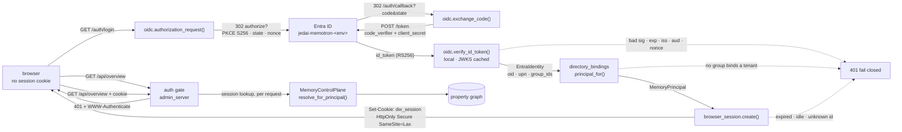
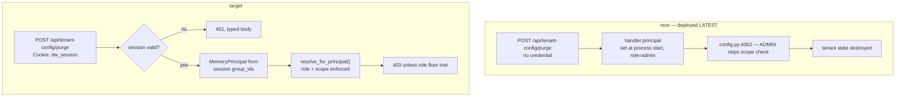
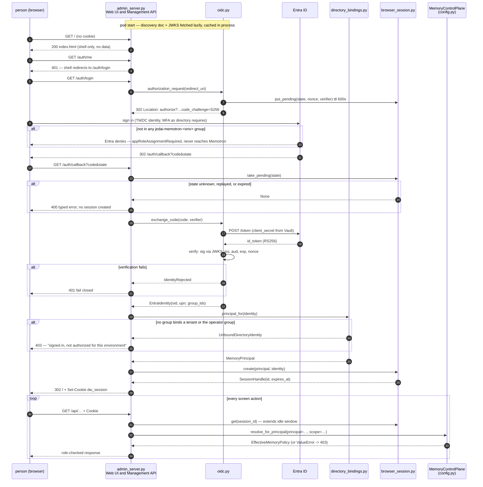

# Disney single sign-on for the Web UI

**Issue:** [#23](https://github.disney.com/jedai/memotron/issues/23) · **Status:** proposed · **Consumed by:** #13, #25 · **Target release:** August 3.08 (LATEST by Mon Aug 17, 2026)

**Recommendation.** The Web UI becomes a confidential OIDC client of a new per-environment
`jedai-memotron-<env>` Entra application: authorization code with PKCE, an HttpOnly server-side
session, and a `MemoryPrincipal` derived **per request** from the session's Entra group claims. Three
directory groups per environment carry the three roles. The deployed `--principal-role admin` flag is
deleted, not defaulted differently.

> ## Read this first: the baseline these citations describe
>
> Every `file:line` below was verified against **local `main` at `80be544`** ("Merge origin/main
> (#35): fold the StorageBackend contract + Postgres backend under the WS-16..24 work"), which is
> **81 commits ahead of pushed `origin/main`** (`9bfc298`). This document is docs-only and was cut
> from `origin/main` per the precedent of #36, #37 and #40, so its citations describe a tree that is
> not on the remote.
>
> ```
> git rev-list --count origin/main..main            # -> 81
> git ls-tree --name-only origin/main src/memotron/ | grep -c gateway.py   # -> 0
> ```
>
> `origin/main` also lacks `context.py`, `health.py`, `migration.py`, `retrieval.py`, `synthesis.py`
> and `transcripts.py`. Nothing **this** design depends on is among them — the whole change lands in
> `admin_server.py`, three new modules, `ui/admin/`, and `.helm/` — but line numbers in `config.py`
> and `admin_server.py` differ by thousands of lines between the two trees, so **re-verify before
> starting**. (`MemoryPrincipal` is `config.py:3105` on local `main` and `config.py:1723` on
> `origin/main`; #37 cites a third set of numbers from a third tree.)
>
> **The internal design portal was read from the working copy at `~/jedai/portal`**, not fetched over
> the network. Quotations below come from `src/content/docs/solution_engineering/agent-memory/` and
> `src/content/docs/platform/authentication/` in that repository. If those pages have moved on, they
> win over this document.

## Problem

The deployed Web UI has no authentication of any kind, and it runs as an administrator.

- `.helm/values-latest.yaml:102-103` passes `--principal-id demo-admin --principal-role admin` to the
  admin server. That principal is built **once at process start** —
  `handler.principal = build_demo_principal(...)` at `admin_server.py:2974` — and assigned to the
  handler *class*, so every request for the life of the pod executes as the same administrator.
- No request-time identity is read anywhere. `Authorization`, `Cookie`, `Bearer` and `http.cookies`
  each appear **zero** times in `admin_server.py`; there is no login route, no session, and no
  `import jwt` anywhere in `src/memotron/`.
- The ingress in front of it (`values-latest.yaml:243-260`,
  `latest.jedai-memotron-admin.wdprapps.disney.com`) is `gce-internal` and TLS-only, with **no**
  IAP, no OAuth2-proxy, and no auth annotation of any kind. The only control is network reachability.
- The surface behind that is not read-only. `do_POST` (`admin_server.py:1103-1171`) dispatches ~30
  mutating routes including `/api/tenant-config/purge` (destroys tenant state) and
  `/api/tenant-config/llm`, which accepts a provider API key as plaintext JSON.
- `role == ADMIN` is not merely a label: `config.py:4062-4071` **skips the scope allowlist entirely**
  for an administrator (`auth_source = "tenant_admin"`), and `admin_server.py:1255` and `:1917`
  duplicate that bypass at the handler layer.

Observable consequence: anyone who can route to `latest.jedai-memotron-admin.wdprapps.disney.com`
is a tenant administrator over every registered scope, and can purge tenant state.

### Three premises corrected before designing anything

**1. The role gap the issue describes is already closed.** #23 says "the design's three roles do not
currently line up with the two values the code's role type carries". The code carries **three**:

```
config.py:3099  class PrincipalRole(StrEnum):
config.py:3100      USER = "user"
config.py:3101      OPERATOR = "operator"
config.py:3102      ADMIN = "admin"
```

There is no missing enum value, so there is nothing for this issue to wait on. #37 flagged the same
thing for #13. The real gaps are different and both matter here:

```
git grep -c "PrincipalRole.OPERATOR" main -- src/memotron/    # -> no matches
```

`OPERATOR` is **never compared anywhere**, so a platform operator today authorizes exactly like an
end user; and `ADMIN` *widens* rather than scopes (`config.py:4062`). Mapping end user → `USER`,
tenant administrator → `ADMIN`, platform operator → `OPERATOR` is one dictionary in this design's
Unit 2. Making `OPERATOR` mean something, and deciding whether `ADMIN` should bypass the scope check
at all, is **#13's** work and this design does not do it. Consequence recorded honestly: until #13
lands, a platform operator signing in gets end-user authorization, and a tenant administrator gets
tenant-wide read. Both are strictly narrower than today's "everyone is an administrator", so this is
a monotonic improvement, not a regression.

**2. The tenant record that DW-018 puts the group bindings on does not exist.** DW-018 states "Each
tenant record in the Operational Store holds the authoritative identity bindings: the tenant's
LiteLLM team id for the programmatic plane and its Entra group ids for the browser plane". There is
no such record:

```
git grep -n "CREATE TABLE IF NOT EXISTS tenant" main -- src/memotron/storage/
#  -> tenant_llm_credentials, tenant_agents, tenant_prompt_overrides, tenant_prompt_versions
```

No `tenants` table, in either backend. `MemoryControlPlane.tenants` is an in-process tuple of
`TenantMemoryPolicy` built from configuration, and `known_tenant_ids()`
(`admin_server.py:340`) *derives* tenant ids by scanning graph scope keys. So the group-id → tenant
binding has no home, and creating one properly means editing `storage/base.py`,
`storage/sqlite.py` and `storage/postgres/_migrations.py` — three modules, which is a different unit
of work. This design therefore reads the bindings from a provisioning document (Unit 1) behind a
Protocol, and says plainly that moving them into the Operational Store is tenant-lifecycle work
(#13/#14). This still satisfies the acceptance criterion: the **role** comes from group membership,
and *which group ids exist* is provisioning data, not an operator's role in configuration.

**3. The Web UI and the Management API are one process, so this issue's hardest-looking question does
not arise yet.** The user-interface page carries an explicit open design item — "What credential the
Web UI attaches to a Management API call … is undecided" — and leans to a user-attributed Entra
access token on `api://jedai-memotron-<env>/<scope>`. But today `admin_server.py` serves *both*
sides on one port: `ui/admin/dist` via `_send_static_asset` (`admin_server.py:2866`,
`DEFAULT_ADMIN_STATIC_DIR` at `:58`) and `/api/*` via the same `do_GET`/`do_POST` dispatch
(`:1042`, `:1103`). The browser calls same-origin root-relative paths with no credential at all
(`ui/admin/src/api.ts:31-52` — a bare `fetch` wrapper, no base URL, no `Authorization`, no
`credentials` option). **No credential crosses a wire on this hop, because there is no wire.**

This design therefore does not build a token exchange for a hop that does not exist. It resolves the
principal from the session in-process, and records the decision for when #25 splits the UI server
from the Management API: take the Entra access token, not the trusted internal header. See
[Rejected](#rejected) and the note in [System design](#system-design) on how that stays a constructor
change.

## Data flow

Directory login → token → session → `MemoryPrincipal`:



Two properties fall out of the shape. **The browser holds nothing reusable** — an opaque session id,
never an ID token, access token, refresh token or key, so an XSS in the React bundle cannot exfiltrate
a credential that works anywhere else. And **the principal is re-derived on every request** from the
session record, satisfying DW-005, rather than being decided once at sign-in and trusted thereafter.

Before / after on one request to a mutating route:



## System design



**Where each piece lives, and why there.**

| Module | Owns (one line) | Why there rather than elsewhere |
|---|---|---|
| `src/memotron/oidc.py` (new) | Turning an authorization code into a verified `EntraIdentity`, or refusing. Knows nothing about tenants, roles or scopes. | The only module that talks to Entra. Swapping the trust anchor (Entra → the EU directory, or a test double) is a constructor argument. Mirrors the seam #37 defines for the gateway plane. |
| `src/memotron/directory_bindings.py` (new) | Mapping `group_ids` → `(tenant_id, PrincipalRole)` and building the `MemoryPrincipal`. | This is the one rule that must not drift, and it is the only place DW-018's binding is read. When the binding moves into the Operational Store it is this module's Protocol implementation that changes, not its callers. |
| `src/memotron/browser_session.py` (new) | The server-side session record, its cookie contract, and its two clocks (absolute + idle). Also the short-lived pending-login record. | Sessions are the browser plane's own concern and nothing else in the service has one. **Named `browser_session` deliberately:** `src/memotron/session.py` already owns `SessionIngester`, the conversation-turn episode batcher — reusing `Session` there would collide with an unrelated concept. |
| `src/memotron/admin_server.py` | One gate call per request, the four `/auth/*` routes, and a **per-request** principal. Deletes `build_demo_principal` and the `--principal-*` flags. | Composition: the gate wraps the existing `do_GET`/`do_POST` dispatch rather than being threaded through 60 handlers. It is already the module that owns this HTTP surface. |
| `ui/admin/src/` | Rendering the signed-in person, and reacting to 401 by going to `/auth/login`. Holds no authority. | The UI is a client of the API (DW-012); every guard it draws is cosmetic and re-enforced server-side. |
| `.helm/` | The app registration's client id, the Vault-sourced secret, and the absence of the demo flags. | Deployment configuration has no other home. |
| `config.py` `MemoryPrincipal` / `MemoryControlPlane` | **Unchanged.** Already the authority on tenant and scope authorization (`config.py:4045-4071`). | This design adds a *source* of principals, not a second authorizer — the same rule #37 followed. |

**Keeping the future split a constructor change.** When #25 separates the UI server from the
Management API, the Management API needs a credential on that hop. `browser_session.py` retains the
Entra `refresh_token` in the session record (never in the browser), so acquiring a user-attributed
access token for `api://jedai-memotron-<env>/memory.access` is an added method on `oidc.py` and a
second `AssertionVerifier` on the API side — not a re-architecture. That is why the session stores a
refresh token it does not use today, and it is the one piece of deliberate forward provision here.

**Relationship to #27 / PR #37.** #37 introduces `assertions.py` with an `AssertionVerifier` Protocol
and `JwksAssertionVerifier(jwks_uri, issuer, audience)` — exactly the RS256-against-JWKS verification
an ID token needs, and its own table already names "Browser — admin UI (#23)" as a second trust
anchor on that seam. If #37 merges first, `oidc.py` **composes** `JwksAssertionVerifier` pointed at
Entra's JWKS and adds only the code exchange, the nonce check and the claim extraction. If it does
not, `oidc.py` wraps `jwt.PyJWKClient` directly — about thirty lines, same behaviour, and the seam is
then available for #37 to adopt in the other direction. Either way there is exactly **one** signature
verifier in the codebase. This design does not block on #27.

## Contracts

### Endpoints added

| Method · Path | Auth | Behaviour |
|---|---|---|
| `GET /auth/login` | none | 302 to Entra `authorize` with `code_challenge_method=S256`, `state`, `nonce`. Stores the pending record. Optional `?next=` accepted only as a same-origin path, never a URL. |
| `GET /auth/callback` | none | Consumes `state` **once**. Exchanges the code, verifies the ID token, resolves the principal, creates the session, 302 to `next`. 400 on unknown/replayed state, 401 on verification failure, 403 on unbound identity. |
| `GET /auth/me` | session | `{principal_id, tenant_id, role, allowed_scope_keys, display_name, expires_at}`. The role-shaped Home reads this. 401 with no session. |
| `POST /auth/logout` | session | Destroys the session server-side, clears the cookie, 302 to the discovery document's `end_session_endpoint`. Idempotent. |
| everything else under `/api/*` | session | 401 `{"error":{"code":"session_required"}}` with no valid session. |
| `/`, static assets | none | The shell renders unauthenticated; it contains no data. |
| `/health`, `/favicon.ico` | **none — exempt** | `admin_server.py:1050-1051`. All three probes (`values-latest.yaml:116, 120, 126`) hit `/health`; gating it makes the pod never become ready. |

### Symbols

| Symbol | Signature | Behaviour |
|---|---|---|
| `PkceChallenge` | frozen dataclass — `verifier: str`, `challenge: str`, `method: Literal["S256"]` | `verifier` is 43–128 chars from `secrets.token_urlsafe(32)`; `challenge` is base64url(SHA-256(verifier)) unpadded. `plain` is never produced. |
| `EntraIdentity` | frozen dataclass — `subject: str` (the `oid` claim), `upn: str`, `display_name: str`, `group_ids: frozenset[str]`, `expires_at: datetime` | Only claims that survived signature verification. Never retains the raw token. `oid` not `sub`, because `sub` is pairwise per application and `oid` is stable across the tenant. |
| `OidcClient.authorization_request` | `(*, next_path: str \| None = None) -> AuthorizationRequest` | Returns the absolute authorize URL plus the `state`/`nonce`/`verifier` to persist. Reads `authorization_endpoint` from the cached discovery document, never a hardcoded URL. |
| `OidcClient.exchange_code` | `(code: str, *, verifier: str, nonce: str) -> EntraIdentity` | POSTs `grant_type=authorization_code` with `code_verifier` and the client secret. Raises `IdentityRejected` on any of: bad signature, unknown `kid`, `iss` mismatch, `aud` != client id, expired `exp`, `nonce` mismatch. Raises `TrustAnchorUnavailable` when JWKS cannot be obtained with a cold cache. |
| `DirectoryBindings` | `Protocol` — `principal_for(self, identity: EntraIdentity) -> MemoryPrincipal` | The seam. One implementation reads the provisioning document; a later one reads the Operational Store. Tests substitute a fake. |
| `FileDirectoryBindings` | `(path: Path, *, platform_operator_group_id: str \| None = None) -> FileDirectoryBindings` | Raises `UnboundDirectoryIdentity` when no group in `identity.group_ids` binds a tenant or the operator group. Raises `AmbiguousDirectoryIdentity` when groups from two different tenants are present — never picks one. |
| `SessionStore` | `create(principal, identity, refresh_token) -> SessionHandle`; `get(session_id) -> SessionRecord \| None`; `destroy(session_id) -> None`; `put_pending(state, nonce, verifier) -> None`; `take_pending(state) -> PendingLogin \| None` | `get` returns `None` past either clock and deletes the record. `take_pending` is single-use: a second call with the same `state` returns `None`. |
| `session_cookie` | `(handle: SessionHandle) -> str` | Emits exactly `dw_session=<id>; Path=/; HttpOnly; Secure; SameSite=Lax; Max-Age=<n>`. `SameSite=Lax` rather than `Strict` because the Entra callback is a cross-site top-level GET and `Strict` would drop the cookie on it. |
| `AuthError` | base; subclasses `SessionRequired`, `IdentityRejected`, `TrustAnchorUnavailable`, `UnboundDirectoryIdentity`, `AmbiguousDirectoryIdentity`, `StateRejected` | Each carries a stable machine-readable `code`. Mapped onto the existing `HttpApiError(status, message)` (`admin_server.py:61`) — 401 for the first three, 403 for the next two, 400 for `StateRejected`. Reuses the module's error primitive rather than adding a second. |

### Claim → principal mapping

The person supplies none of these. Entra sets them; the request body is never consulted.

| Claim | Maps to | Note |
|---|---|---|
| `oid` | `MemoryPrincipal.principal_id` | Stable per directory tenant. |
| `groups` | `tenant_id` + `role`, via `DirectoryBindings` | Group **objectId** GUIDs, the immutable form. Not display names, which need on-prem AD sync and can collide. |
| `preferred_username`, `name` | Session display only | Never authorization input. |
| `tid` | Asserted equal to `MEMOTRON_SSO_TENANT_ID` | A token from another directory tenant is rejected even if signed. |
| `aud`, `iss`, `exp`, `nonce` | verified, then discarded | `iss` must be `https://login.microsoftonline.com/{tid}/v2.0`. |
| `roles` | **ignored** | The app's `access` role is the Entra entry gate; it says nothing about which of the three Memotron roles a person holds. |

Role floors per screen are the security matrix rows on the design's security-and-compliance page;
this design enforces the three-way mapping and leaves per-route floors to #13, which owns them.

### Directory artifacts to request — the long-lead item

The enterprise identity process has weeks of external latency, so this is filed **first**, before any
code. Verified against the platform authentication conventions:

| Property | Value |
|---|---|
| Directory tenant | `twdc.onmicrosoft.com` / `56b731a8-a2ac-4c32-bf6b-616810e913c6` |
| Sign-in audience | `AzureADMyOrg` (TWDC employees only) |
| Token version | v2 |
| App registrations | `jedai-memotron-latest`, `-stage`, `-preview`, `-prod` |
| Redirect URI | `https://<env-prefix>jedai-memotron-admin.wdprapps.disney.com/auth/callback` |
| Delegated Graph permissions | `openid`, `profile`, `email`, `offline_access`, `User.Read` — the set every primary client already holds |
| `appRoleAssignmentRequired` | **`true`** — gated, following `jedai-platform-<env>` rather than `jedai-portal-<env>` |
| `groupMembershipClaims` | **`ApplicationGroup`** |
| Groups per environment | `jedai-memotron-users-<env>`, `jedai-memotron-admins-<env>`, `jedai-memotron-operators-<env>` — all three assigned the app's single `access` role |
| Client credential | Client secret in Vault → `memotron-secrets`. Certificate credentials are Microsoft's recommendation and the better answer; this design takes the secret for 3.08 and records the certificate as follow-up, because no platform service uses one today and inventing that rotation story is not this issue's work. |

Four decisions in that table are load-bearing enough to justify:

**`INTEGRATION` is the platform's `preview` environment.** #23 names LATEST, STAGE, INTEGRATION and
production; the platform app inventory has `latest`, `stage`, `load`, `preview`, `prod`. The
environments page settles it: *"NA integration | The `preview` tenant on the stage cluster"*. So four
registrations, on the `preview` slug, and `load` is deliberately not requested.

**`groupMembershipClaims: ApplicationGroup` is not a cosmetic choice.** Entra caps the `groups` claim
at 200 entries for a JWT and, past the cap, **omits the claim entirely** in favour of a Graph
overage link. At Disney directory scale a `SecurityGroup` setting would put every user's full
membership in the token and a well-connected operator would silently arrive with *no* groups — which
under a fail-closed rule reads as a 403 that nobody can reproduce. `ApplicationGroup` emits only the
groups assigned to this application, bounding the claim to at most the three Memotron groups and
removing the overage path. It also means the design never needs a Graph call.

**`appRoleAssignmentRequired = true`** makes Entra refuse sign-in for anyone outside the three groups
before a request reaches Memotron, which is defence in depth over the same check in
`directory_bindings.py`. The portal is ungated; the platform gateway is gated. Memotron holds
Confidential memory content, so it follows the gateway. Flagged in
[Risks](#risks--open-questions) as a call a human should confirm.

**The redirect URI must be settled before the request is filed**, because changing it later is another
round of enterprise latency. The existing host is `latest.jedai-memotron-admin.wdprapps.disney.com`
(`values-latest.yaml:252`) — and DW-012 says "admin UI" *understates* an application that serves end
users too. Either the host is renamed now and the URI reflects that, or the `-admin` name is accepted
for the life of these registrations. This needs a decision **first**; see
[Risks](#risks--open-questions).

### Configuration added

Following the `MEMOTRON_*` convention, secrets via Vault → `memotron-secrets`:

| Variable | Secret | Note |
|---|---|---|
| `MEMOTRON_SSO_TENANT_ID` | no | `56b731a8-a2ac-4c32-bf6b-616810e913c6`. Discovery is derived from it, never hardcoded. |
| `MEMOTRON_SSO_CLIENT_ID` | no | Per environment. |
| `MEMOTRON_SSO_CLIENT_SECRET` | **yes** | Absent → the server refuses to start. |
| `MEMOTRON_SSO_REDIRECT_URI` | no | Must exactly match a registered URI. |
| `MEMOTRON_SSO_SESSION_TTL` | no | Absolute session lifetime, default 28800 (8 h). |
| `MEMOTRON_SSO_SESSION_IDLE_TTL` | no | Idle timeout, default 3600 (1 h). |
| `MEMOTRON_DIRECTORY_BINDINGS_PATH` | no | The provisioning document. Absent → refuse to start. |
| `MEMOTRON_PLATFORM_OPERATOR_GROUP_ID` | no | The per-environment operator group, which no tenant owns. |

## Units

Ordered by dependency. Each leaves the repo green, and each lives in **one** module. Unit 0 is not
code and starts immediately.

**Unit 0 — file the directory request.** Not a code unit; it gates Units 5 and 6 only.
- **in** the table above, with the redirect-URI decision made
- **out** four app registrations, twelve groups, client ids recorded on this PR, secrets in Vault
- **done** `az ad app list --display-name jedai-memotron-latest --query "[0].appId" -o tsv` returns a GUID

**Unit 1 — group ids to a principal.** Module: **`src/memotron/directory_bindings.py`** (new).
- **in** an `EntraIdentity`; a bindings document mapping group id → `(tenant_id, role)` plus one operator group id
- **out** a `MemoryPrincipal`; `UnboundDirectoryIdentity` when nothing binds; `AmbiguousDirectoryIdentity` when two tenants' groups are both present
- **unit** each of the three roles maps to the right `PrincipalRole`; an empty `group_ids` raises; an unknown group raises; groups from two tenants raise rather than resolving to either; the operator group yields `OPERATOR` with no tenant group present; a malformed document fails at load, not at first request
- **int** the resulting principal drives `MemoryControlPlane.resolve_for_principal` (`config.py:4045`) — an in-binding scope resolves, an out-of-binding scope raises `ValueError` matching `"not authorized"`, and an `ADMIN` principal reaches a scope it was not granted, pinning the existing bypass at `config.py:4062` as a characterization test so #13 has a failing target
- **done** `rg -n "tenant_id|role" src/memotron/directory_bindings.py` shows both assigned only from the bindings document and `identity.group_ids`, never from a request

**Unit 2 — verified Entra identity.** Module: **`src/memotron/oidc.py`** (new). Adds `pyjwt[crypto]>=2.13.0` to `pyproject.toml` — the only dependency change in this design, and already installed transitively via `mcp 1.29.0`.
- **in** `MEMOTRON_SSO_*` configuration; an authorization code plus the stored `verifier` and `nonce`
- **out** an `AuthorizationRequest`; an `EntraIdentity`; or `IdentityRejected` / `TrustAnchorUnavailable`
- **unit** a locally generated RSA keypair signs ID tokens and an in-process `http.server` serves the JWKS and the discovery document. Assert accept on a good token, and reject on each of: wrong key, `alg: none`, `alg: HS256` with the public key as the HMAC secret, expired `exp`, absent `exp`, wrong `iss`, wrong `aud`, wrong `tid`, mismatched `nonce`, unknown `kid`. Assert `code_challenge_method=S256` and a `verifier` ≥ 43 chars on every authorization request. Assert the JWKS is fetched **once** across 100 verifications, and that a cold-cache fetch failure raises rather than returning claims
- **int** a fake Entra that serves discovery, mints real RS256 ID tokens, and answers the token endpoint: a full `/auth/login` → `/auth/callback` round trip yields the expected `EntraIdentity`; the same code replayed fails
- **done** `rg -n 'algorithms=\["RS256"\]' src/memotron/oidc.py` matches, and `rg -n "verify_signature|options=\{" src/memotron/oidc.py` shows nothing disabling verification

**Unit 3 — the session and its cookie.** Module: **`src/memotron/browser_session.py`** (new).
- **in** a `MemoryPrincipal`, an `EntraIdentity` and a refresh token; separately a session id; separately a `state`
- **out** a `SessionHandle` and a `Set-Cookie` value; a `SessionRecord` or `None`; a single-use `PendingLogin` or `None`
- **unit** with an injected clock: a fresh session resolves; past the absolute TTL it returns `None`; past the idle TTL it returns `None`; activity inside the idle window extends it but never past the absolute TTL; `destroy` makes it unresolvable; `take_pending` twice on one `state` returns the record then `None`; a pending record past 600 s returns `None`. Assert the emitted cookie contains `HttpOnly`, `Secure` and `SameSite=Lax` and that the session id has ≥ 256 bits of entropy and appears in no log line
- **int** create → resolve → idle past the timeout → resolve returns `None`, against the real store
- **done** `rg -n "HttpOnly|Secure|SameSite" src/memotron/browser_session.py` matches all three, and `rg -n "id_token|access_token" src/memotron/browser_session.py` shows neither is ever written to a cookie

**Unit 4 — gate the server, per request.** Module: **`src/memotron/admin_server.py`**.
- **in** an HTTP request to `MemoryGraphHandler` (`admin_server.py:1021`), with or without a `dw_session` cookie
- **out** the four `/auth/*` routes; a principal derived **per request** from the session; `build_demo_principal` (`:365`), the class-level `handler.principal` assignment (`:2974`) and the `--principal-id` / `--principal-role` flags (`:2927-2928`) all deleted; `/api/*` without a session → 401; `/health` and `/favicon.ico` still answer 204 unauthenticated
- **unit** the gate in isolation with fake `oidc` and `DirectoryBindings`: no cookie → 401; expired session → 401; valid session → the principal reaches the handler; unknown `state` on the callback → 400; unbound identity → 403; `/health` → 204 with no cookie. Assert two concurrent requests carrying different session cookies resolve to *different* principals — the regression that the class-attribute model made impossible
- **int** extend the real-`HTTPServer` pattern at `tests/test_control_plane.py:485-513`: `urlopen` of `/api/control-plane` with no cookie gets 401; a session minted from the fake Entra resolves its own tenant; a second session from another tenant's group cannot read the first's scope; `POST /api/tenant-config/purge` with an end-user session is refused
- **done** `rg -n "build_demo_principal|principal-role" src/memotron/` returns no matches outside tests

**Unit 5 — the signed-in shell.** Module: **`ui/admin/src/`**.
- **in** a browser with and without a session; `GET /auth/me`
- **out** `fetchJson` (`ui/admin/src/api.ts:31-52`) sends `credentials: 'same-origin'` and, on 401, navigates to `/auth/login`; the header renders the signed-in person, their tenant and their role, with a sign-out control; screens above the resolved role are not rendered
- **unit** Vitest against the existing jsdom setup: a 401 from any call triggers exactly one navigation to `/auth/login` and no error toast; `/auth/me` returning `role: "user"` hides the administrator screens; a failed `/auth/me` never renders data
- **int** the existing Playwright spec (`ui/admin/tests/admin-smoke.spec.ts`) against a server with a fake Entra: unauthenticated load lands on sign-in, a completed sign-in lands on a role-shaped Home, and sign-out returns to sign-in
- **done** `rg -n "credentials" ui/admin/src/api.ts` matches, and `rg -rn "principal-role|demo-admin" ui/admin/` returns no matches. Note the guard is cosmetic: Unit 4's integration test is what proves a hidden screen is actually refused

**Unit 6 — deploy it.** Module: **`.helm/`**.
- **in** `values-latest.yaml`, `templates/admin-deployment.yaml`
- **out** `--principal-id demo-admin --principal-role admin` (`values-latest.yaml:102-103`) gone; the eight `MEMOTRON_SSO_*` / bindings variables wired, the secret via `vaultSecret`; `admin.replicaCount` pinned to `1` with a comment naming the in-process session store as the reason
- **unit** `helm template` renders with no `--principal-role` in any arg and with every required variable present; rendering with the secret absent fails the template rather than producing a pod that starts unauthenticated
- **int** a LATEST deploy: an unauthenticated `curl` of `/api/overview` returns 401, a browser sign-in reaches a role-shaped Home, and the readiness probe still passes
- **done** `rg -n "principal-role|demo-admin" .helm/` returns no matches

## Done when

- `uv run pytest -x -q` exits 0
- `uv run pytest -q tests/test_oidc.py tests/test_directory_bindings.py tests/test_browser_session.py tests/test_admin_server_auth.py` exits 0
- `npm --prefix ui/admin run test` exits 0 and `npm --prefix ui/admin run build` exits 0
- `rg -n "build_demo_principal" src/memotron/` returns no matches — the fixed startup principal is gone, not merely defaulted differently
- `rg -n "principal-role|principal_role" src/memotron/ .helm/` returns no matches
- `rg -n "demo-admin" .helm/` returns no matches
- `rg -n 'algorithms=\["RS256"\]' src/memotron/oidc.py` returns a match, and `rg -n "verify=False|verify_signature.*False" src/memotron/` returns no matches
- `rg -n "code_challenge_method" src/memotron/oidc.py` shows `S256` and `rg -n "plain" src/memotron/oidc.py` returns no matches
- `rg -n "HttpOnly" src/memotron/browser_session.py` returns a match and `rg -n "id_token|refresh_token" src/memotron/admin_server.py` returns no matches — **no token is ever written toward the browser**
- `rg -n "x-litellm-api-key|LITELLM_API_KEY" src/memotron/oidc.py src/memotron/browser_session.py src/memotron/directory_bindings.py` returns no matches — the planes do not cross (DW-003)
- `uv run python -c "import memotron.oidc, memotron.directory_bindings, memotron.browser_session"` exits 0 — the modules import with no directory reachable
- `git diff --stat main -- src/memotron/config.py` shows no change — no second authorizer was added
- On LATEST: `curl -s -o /dev/null -w '%{http_code}' https://latest.jedai-memotron-admin.wdprapps.disney.com/api/overview` returns `401`, and `/health` returns `204`
- On LATEST: the MCP surface is untouched — `curl` of `latest.jedai-memotron.wdprapps.disney.com` behaves exactly as before this change, recorded on the PR
- The four app registrations and twelve groups exist, with client ids recorded on this PR and secrets in Vault
- A person in `jedai-memotron-users-latest` reaches a role-shaped Home and **cannot** reach a tenant-administrator screen by requesting its address directly

## Goal

```
/goal uv run pytest -x -q exits 0; uv run pytest -q tests/test_oidc.py
tests/test_directory_bindings.py tests/test_browser_session.py
tests/test_admin_server_auth.py exits 0; npm --prefix ui/admin run test exits 0;
npm --prefix ui/admin run build exits 0; rg -n "build_demo_principal"
src/memotron/ returns no matches; rg -n "principal-role|principal_role"
src/memotron/ .helm/ returns no matches; rg -n "demo-admin" .helm/ returns no
matches; rg -n 'algorithms=\["RS256"\]' src/memotron/oidc.py returns a match;
rg -n "verify=False|verify_signature.*False" src/memotron/ returns no matches;
rg -n "HttpOnly" src/memotron/browser_session.py returns a match; rg -n
"id_token|refresh_token" src/memotron/admin_server.py returns no matches; rg
-n "x-litellm-api-key|LITELLM_API_KEY" src/memotron/oidc.py
src/memotron/browser_session.py src/memotron/directory_bindings.py returns
no matches; uv run python -c "import memotron.oidc,
memotron.directory_bindings, memotron.browser_session" exits 0; and git
diff --stat main -- src/memotron/config.py shows no change. Constraints: no
file outside src/memotron/oidc.py, src/memotron/directory_bindings.py,
src/memotron/browser_session.py, src/memotron/admin_server.py,
pyproject.toml, ui/admin/, .helm/, and tests/ is modified; config.py is not
modified; the only added dependency is pyjwt[crypto]; no test is skipped,
xfailed, or deleted to reach green; if the Entra app registration is not yet
provisioned, use the fake-Entra fixture and stop rather than weakening a check.
Stop after 34 turns.
```

## Rejected

**A trusted internal header from the Web UI to the Management API.** The second candidate on the
user-interface page's open design item: the UI server validates the session and asserts the resolved
principal on its in-cluster calls, trusted because a NetworkPolicy admits that hop only from the UI.
It is what kb-api does today. Rejected as the *target* shape because it makes the Management API
accept a caller-supplied identity from one privileged caller — the exact thing DW-005 rejects
everywhere else, and one misconfigured ingress or port-forward from any caller asserting any tenant.
Forecloses: any later story where the Management API is reachable from more than one path. Note the
question is moot for 3.08 — the two are one process (`admin_server.py:1042`, `:2866`) — so this
design neither builds the header nor builds the token; it resolves in-process and records the Entra
access token as the answer when #25 splits them.

**A user-attributed Entra access token, built now.** The shape the design page leans to, and the right
one *once there are two processes*. Rejected as premature: it means standing up a resource
application, a custom scope, a pre-authorized client, an OBO exchange and a token validator to
authenticate a function call inside a single Python process. Every one of those is a real artifact
with real enterprise latency, and none of them would be exercised by any hop that exists in 3.08. The
design keeps the refresh token in the session precisely so this costs one method later.

**A public-client SPA holding tokens in the browser.** MSAL.js in the React bundle, PKCE without a
client secret, access token in memory or session storage, sent as a bearer to `/api/*`. This is the
most conventional shape and it is what the "single page apps using the authorization code flow"
guidance describes. Rejected: it puts a reusable credential inside a bundle that renders Confidential
memory content and untrusted search text, so any XSS becomes credential theft rather than session
abuse; it also adds `@azure/msal-browser` to a UI whose entire dependency list is React, Vite and
`lucide-react`. The design page settles it independently — "The browser holds only a session cookie -
no token, no key, nothing reusable outside the UI". Forecloses: the ability to revoke one person's
access without waiting for a token to expire.

**Fronting the ingress with IAP or an OAuth2-proxy sidecar.** Zero application code: the GCE ingress
or a sidecar performs the whole OIDC dance and forwards a signed identity header. Genuinely
attractive, and it would have shipped fastest. Rejected on two counts. It authenticates but cannot
*authorize*: the `MemoryPrincipal` still has to be derived from group claims, `OPERATOR` still has to
mean something, and per-route role floors still live in the application — so the proxy removes the
easy half and leaves the hard half. And it introduces a second identity mechanism no other platform
service uses (nothing in `.helm/` has an auth annotation today, and the platform's four other apps
are all in-application OIDC clients), which means Memotron's browser plane would diverge from the
portal and chat precedent #23 explicitly asks it to follow. Forecloses: running the Web UI anywhere
the proxy is not, including local development.

**Adding the group bindings to `TenantMemoryPolicy` in `config.py`.** The in-process tenant record is
right there, and a two-field addition looks free. Rejected: `config.py` is 200 KB and is the
authorizer; #37 also deliberately touched none of it. Putting provisioning identity data in the
policy model couples the authorization rule to the config schema, and the binding's real destination
is the Operational Store, which `config.py` does not reach. A separate module behind a Protocol makes
that migration a swap. Forecloses: moving the binding without a config-schema change.

**Creating the Operational Store `tenants` table in this issue.** The honest home for DW-018's
binding, and it will have to happen. Rejected as scope: it means editing `storage/base.py`,
`storage/sqlite.py` and `storage/postgres/_migrations.py` together, which is three modules and
therefore a different unit of work — and it is entangled with tenant lifecycle (#14) and the Memory
Graph stand-up (#10). Doing it here would make an SSO change wait on a persistence change. Forecloses
nothing: Unit 1's Protocol is where the table lands.

**MSAL for Python as the client library.** Microsoft's own recommendation over hand-rolling the
protocol, and `ConfidentialClientApplication` covers this flow directly. Rejected on dependency cost:
`msal 1.38.0` requires `requests<3,>=2.0.0`, and this repository has no `requests` — its HTTP client
is `httpx 0.28.1`, already present via `mcp`. So MSAL adds two runtime dependencies to a service
whose direct dependency list is six packages, to save perhaps eighty lines of a flow that is fully
specified by a discovery document. `pyjwt 2.13.0` (also already present) does the verification, whose
API was checked against the installed build:
`PyJWKClient(uri, cache_keys=False, max_cached_keys=16, cache_jwk_set=True, lifespan=300, …)` and
`jwt.decode(jwt, key, algorithms=…, audience=…, issuer=…, leeway=…)`. Revisit if the token exchange
grows — OBO in particular is where MSAL starts earning its weight.

**Stateless sessions — a signed cookie carrying the claims.** No session store, no revocation
problem on restart, works across replicas. Rejected: the claims would then live in the browser, which
is the property this design is buying, and revoking a person's access would mean waiting out the
cookie. A server-side store with `admin.replicaCount: 1` is honest for 3.08 and its constraint is
visible; a signed cookie hides the same constraint behind a security regression.

## Risks & open questions

**Needs a decision from a human before Unit 0 is filed:**

1. **The Web UI's hostname, and therefore its redirect URI.** The registration pins
   `https://latest.jedai-memotron-admin.wdprapps.disney.com/auth/callback`, and changing it later
   is another round of enterprise latency. But DW-012 says a single application serves end users and
   operators and that "admin UI … understates it", and #25 builds end-user screens on this same host.
   Either rename the host now (new ingress, new static IP —
   `values-latest.yaml:245` names `vip-latest-jedai-memotron-admin-...`) and register the new URI,
   or accept `-admin` for the life of these registrations. **Recommendation: rename now**, because
   the ingress change is cheap this week and the registration is not. Not mine to decide.
2. **Whether the app is assignment-gated.** This design requests
   `appRoleAssignmentRequired = true`, following the platform gateway rather than the portal. It is
   the safer default and it means Entra refuses non-members before Memotron sees them — but it
   also means every LATEST tester must be added to a group before they can look at anything, which
   will be felt in the week before Aug 17. Confirm with whoever owns LATEST access.
3. **Per-environment groups now, per-tenant groups later.** #23 asks for "one group per environment
   for each of the three roles"; the access-control and onboarding pages instead specify **two groups
   per tenant** (administrators, users) plus one per-environment operator group. These are different
   directory shapes. This design requests the issue's shape — three per environment, twelve total —
   because there is exactly one tenant today (`wdpr-demo`, `admin_server.py:55`) and the bindings
   document maps *group id → (tenant, role)* with no assumption about how many groups a tenant has,
   so adding per-tenant groups at the first real onboarding is a document edit, not a code change.
   Confirm that reading of the issue.
4. **Client secret versus certificate credential.** Microsoft recommends certificates; no JedAI
   service uses one. This design takes a Vault-held secret and records the certificate as follow-up.
   If security requires a certificate for a Confidential-data application, say so before Unit 0 —
   it changes what is requested, not how the code works.

**Hard to verify / residual risks:**

- **The internal design pages were read from a local working copy, not the live portal.** The
  quotations above come from `~/jedai/portal`; `latest.jedai-portal.wdprapps.disney.com` requires the
  very SSO this issue builds and was not fetched. If that checkout is stale, the live pages win —
  worth one reviewer checking the open design item and the personas table against this document.
- **`admin.replicaCount: 1` is now load-bearing.** The session store is in process memory
  (`admin_server.py:2982` is a single-threaded stdlib `HTTPServer`). Scaling the admin deployment to
  two replicas silently signs everyone out on every other request. Unit 6 pins it with a comment;
  a shared store is the fix and it is not in this design.
- **`/health` must stay ungated.** All three probes hit it (`values-latest.yaml:116, 120, 126`).
  Gating it produces a pod that never becomes ready, which will look like a deployment failure rather
  than an auth bug. This is the single most likely way Unit 6 breaks LATEST.
- **The demo graph is rebuilt on every pod start.** `values-latest.yaml:94` runs
  `examples/memory_graph_demo.py` before the server, and the scope is hardcoded
  `customer:wdw:pinnacle-events`. Real people signing in against regenerated demo data will find
  scopes their bindings do not grant. Replacing the demo graph is #10's work; expect confusing 403s
  on LATEST until then, and say so in the release note.
- **The three roles are mapped but only two are enforced.** Per premise 1: after this ships, an
  `OPERATOR` authorizes like a `USER` and an `ADMIN` still bypasses the scope check
  (`config.py:4062`). #13 owns closing both. Unit 1's integration test pins the bypass as a
  characterization test so the gap is visible in CI rather than discovered later.
- **Entra sets no `code_challenge_methods_supported` in the `common` discovery document** (verified
  live: the key is absent), though the documentation states `S256` is supported and required for
  SPAs. Unit 2 therefore pins `S256` rather than negotiating it, and must not gate on discovering it.
- **Clock skew** between the pod and Entra eats into the ID token's validity. A modest `leeway` covers
  ordinary NTP drift; a badly skewed node fails closed, which is correct but reads as an auth bug.
- **No `conftest.py` exists anywhere in `tests/`** and there is no HTTP test fixture to reuse — the
  closest thing is the hand-rolled real-`HTTPServer` block at `tests/test_control_plane.py:485-513`.
  The fake-Entra fixture Units 2, 4 and 5 all need is genuinely new scaffolding, and it is the part
  of this estimate most likely to be under-sized.
