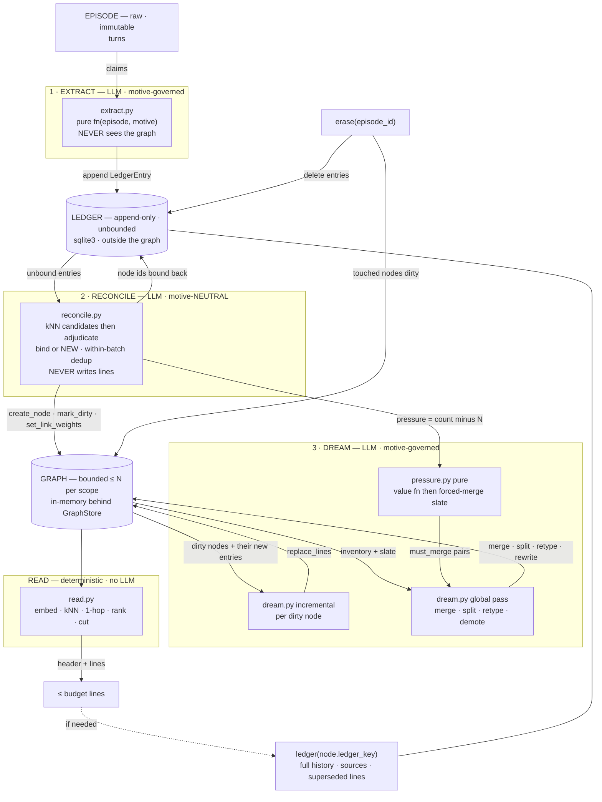
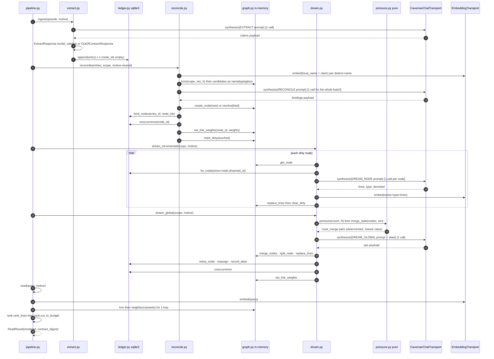

# Caveman memory: a bounded compressed node graph over an append-only ledger

**Issue:** [#251](https://github.disney.com/jedai/memotron/issues/251) · **Status:** proposed · **Classification:** FEATURE — net-new subsystem, no existing behaviour is wrong · **Branch:** `worktree-agent-a3ac08831853465b0` (from `feat/caveman-memory`)

> Plan against the flow in this document, not against `dreaming/`. The existing typed pipeline
> (`MemoryType`, truth slots, supersession gates, quarantine) is **not** extended here and is
> **not** a dependency. `src/memotron/caveman/` is a self-contained subsystem that reuses only
> four leaf seams from the tree: the chat transport shape, the embedding transport, the tolerant
> JSON envelope reader, and the `.env` loader. Nothing in this issue alters an existing code path,
> so there is no before/after diagram to draw.

## Problem

Four things the current subsystem cannot do, in the user's own words:

1. **What do I know about X** — today the answer is *n* typed relationship rows whose count grows
   with evidence. There is no single bounded artifact per concept to read.
2. **Change what I know over time** — supersession today mutates truth rows in place under a policy
   gate. There is no append-only claim record from which the readable state is *regenerable*.
3. **Constant compression to ≤ N nodes** — growth is governed by a soft cap applied as a
   last-resort backstop after expected-loss ranking. `N` is not an invariant anyone can assert.
4. **Caveman compression for LLM readers** — retrieval emits prose facts sized for humans. A
   100-line read should cost ~1.3k tokens of pure utility, not a paragraph budget.

Observable consequence: a compaction hands the next context a variable-size prose brief whose
size is a function of how much evidence exists, and the graph that produced it grows without a
bound anyone can name.

## Data flow



Three invariants the arrows encode:

- **The dreamer is the only writer of node lines and the only enforcer of `N`.** `extract` only
  appends. `reconcile` only routes and marks dirty.
- **The graph is fully regenerable from the ledger.** Erasure is `delete entries` + re-dream.
- **Motive enters at 1 and 3, never at 2.** Stage 2 is the persona-independent truth layer: one
  graph per scope, motive is a policy over it, not a per-motive graph.

## System design



### Where each piece lives, and why there

| Module | Owns (one line) | Why here rather than elsewhere |
|---|---|---|
| `caveman/__init__.py` | The package docstring. **No re-exports.** | Every consumer imports the submodule. Keeps `tests/api_surface.golden.txt` churn to the modules that actually change, and means no work package has to touch a shared `__init__`. |
| `caveman/errors.py` | The exception taxonomy. | One place a caller can `except CavemanError`. Imported by everything, imports nothing. |
| `caveman/tokens.py` | The deterministic token estimate and the N·L·T budget arithmetic. | `(len(text) + 3) // 4`, duplicated per the house convention `context.py:201-211` states explicitly ("small enough to duplicate rather than share a cross-module import"). Budget arithmetic belongs with the estimator, not with the grammar. |
| `caveman/lines.py` | The caveman line grammar: sigils, parse, render, validate, and the grammar block every prompt embeds. | The grammar is the contract between the dreamer's output and the reader's input. Rendering the spec *for the model* is the grammar module's job, so no shared `prompts.py` exists for four packages to fight over. |
| `caveman/models.py` | The pydantic records that cross a seam: `Turn`, `Episode`, `LedgerEntry`, `Node`, `Link`, `NodeAlias`, `Receipt`, and the four LLM response schemas. | One import for every other module. Response schemas live with the records because they *are* the wire contract, and `extra="forbid"` on them is the fail-fast the stages depend on. |
| `caveman/motive.py` | `CavemanMotive` + two presets + rendering a motive into a prompt block. | A contract, not a stage: stages 1 and 3 both render it and `rank.py` reads its weights. Putting it in either stage would make the other depend on a stage. |
| `caveman/seams.py` | The Protocols this package *defines*: `GraphStore`, `LedgerStore`, `ReceiptSink`, `Clock`. | Chat and embedding seams are **not** redefined here — `memotron.synthesis.SynthesisTransport` and `memotron.embedding.EmbeddingTransport` already exist and are the seams (see Contracts). This module holds only what has no existing owner. |
| `caveman/gateway.py` | `CavemanChatTransport` — the live strict-JSON chat transport. | Subclasses `OpenAICompatibleChatTransport` (`gateway.py:405`) exactly as `synthesis.py:66` does, and satisfies the existing `SynthesisTransport` Protocol. Not a second copy of the synthesis transport: it adds the retry the synthesis transport does not have (`_post_with_retry`, `gateway.py:378`) and a 4096-token output budget the 300-token synthesis default cannot carry. `synthesis.py` is not modified. |
| `caveman/llm.py` | One strict-JSON exchange: render, call, strip fences, parse, validate, receipt. | The only place four stages share behaviour. Composes the transport; never subclasses it. |
| `caveman/graph.py` | The in-memory bounded node graph: upsert, kNN, 1-hop, dirty set, merge/split, count. | The single canonical `GraphStore` implementation for this issue. There is no second in-memory store: every work package's tests use *this* one, so there is nothing to diverge. |
| `caveman/ledger.py` | The sqlite3 append-only claim ledger. | The only durable store. `stdlib sqlite3` — see Decisions. |
| `caveman/receipts.py` | The in-memory receipt sink. | Self-contained. Convergence with WS-11 is a named follow-up, not this issue. |
| `caveman/rank.py` | Pure line ranking and the budget cut. | Pure functions, no I/O, no LLM — the part of read that must be unit-testable to the value. Mirrors `retrieval.py`'s split of pure scoring from pipeline. |
| `caveman/read.py` | The read pipeline: embed, kNN, 1-hop, rank, render, receipt. | Composes `rank` + `graph` + embedder. No LLM: the agency sits *around* the call, never inside the rerank. |
| `caveman/extract.py` | Stage 1: episode + motive to validated claims to ledger entries. | Never imports `graph`. That is enforceable by inspection because it is one file. |
| `caveman/reconcile.py` | Stage 2: claims + kNN candidates to bindings, within-batch dedup, link weights. | Never imports `motive` rendering. Motive-neutrality is likewise one file to check. |
| `caveman/pressure.py` | Pure node value function, pressure signal, deterministic forced-merge slate. | Which nodes die under pressure is the most consequential decision in the system and must be provable without an LLM. |
| `caveman/dream.py` | Stage 3: incremental + global. **The only writer of node lines.** | One module, so "only writer" is a property of the file layout, not a convention. |
| `caveman/pipeline.py` | The composition root: `CavemanMemory` wiring the stages and read. | The one module that imports every other. Lands last so the merge is trivial. |

Nothing wraps or modifies an existing module. Four leaf imports only:
`memotron.gateway` (transport base, retry policy, env names, defaults) ·
`memotron.synthesis` (`SynthesisTransport` Protocol, `strip_markdown_fences`) ·
`memotron.embedding` (`EmbeddingTransport`, `LocalEmbeddingTransport`, `OpenAICompatibleEmbeddingTransport`, `cosine_similarity`) ·
`memotron.extraction` (`parse_first_json_object`).

## Contracts

### Seams

| Seam | Source | Signature |
|---|---|---|
| chat | **existing** `memotron.synthesis.SynthesisTransport` (`synthesis.py:38`) | `identifier: str` (property) · `async synthesize(prompt: str, *, system_prompt: str) -> str`; transport failures raise `ValueError`, content validation is the caller's job |
| chat (live) | new `caveman.gateway.CavemanChatTransport(OpenAICompatibleChatTransport)` | `__init__(*, model=DEFAULT_GATEWAY_MODEL, base_url=DEFAULT_GATEWAY_BASE_URL, api_key_env=GATEWAY_API_KEY_ENV, api_key=None, timeout_seconds=180.0, max_output_tokens=4096, retry_policy=DEFAULT_GATEWAY_RETRY_POLICY)`; `_synthesize_sync` = `_resolve_api_key`, `_chat_payload(system=…, user=…, max_tokens=self.max_output_tokens)`, `_post_with_retry("/chat/completions", payload, policy=self.retry_policy, api_key=key)`, `_chat_content(body, content_kind="a JSON object")`, wrapped by `asyncio.to_thread` |
| embedding | **existing** `memotron.embedding.EmbeddingTransport` (`embedding.py:95`) | `identifier: str` (property) · `embed(text: str) -> list[float]` (sync) |
| embedding (live) | **existing** `OpenAICompatibleEmbeddingTransport(model="text-embedding-3")` | 3072 dims; must be selected explicitly — `DEFAULT_GATEWAY_EMBEDDING_MODEL` is the alias, not a default the transport applies |
| JSON envelope | **existing** `memotron.extraction.parse_first_json_object(text, *, source)` | raises `ValueError(f"{source} content did not contain a valid JSON object")` |
| fences | **existing** `memotron.synthesis.strip_markdown_fences(text)` | the gateway discards `response_format` (`gateway.py:432-434`), so models answer with fenced JSON |

### Records (`caveman/models.py`)

```python
class Sigil(StrEnum):              # lines.py owns the grammar; models.py owns the enum
    CONSTRAINT = "!"; IDENTITY = "="; ATTRIBUTE = ":"
    RELATION   = "→"; UNCERTAIN = "~"; REFUTED   = "×"

class ClaimMode(StrEnum):
    DESCRIPTIVE = "descriptive"; REQUIREMENT = "requirement"; PREFERENCE = "preference"
    DIRECTIVE   = "directive";   CORRECTION  = "correction";  REPORT     = "report"

class Turn(BaseModel):        # extra="forbid" on every model in this file
    index: int = Field(ge=1); speaker: str = Field(min_length=1); text: str = Field(min_length=1)

class Episode(BaseModel):
    episode_id: str; scope: str; occurred_at: datetime; turns: tuple[Turn, ...] = Field(min_length=1)
    def as_prompt_text(self) -> str: ...          # "1 · Logan: …" — the exact string stage 1 sees

class LedgerEntry(BaseModel):
    entry_id: str; ts: datetime; episode_id: str; scope: str
    claim: str = Field(min_length=8, max_length=400)          # a FULL sentence, self-contained
    kind: Sigil; claim_mode: ClaimMode
    subjects: tuple[str, ...] = Field(min_length=1)           # local surface names, pre-reconcile
    objects: tuple[str, ...] = ()
    identifiers: tuple[str, ...] = ()                         # #245, claude-haiku-4-5, 3072
    node_ids: tuple[str, ...] = ()                            # filled by reconcile, never by extract
    motive: str; confidence: float = Field(ge=0.0, le=1.0)
    supersedes: str | None = None                             # another entry_id
    turns: tuple[int, ...] = Field(min_length=1)
    receipt_id: str

class Node(BaseModel):
    node_id: str; scope: str
    name: str = Field(min_length=1, max_length=40)
    aliases: tuple[str, ...] = ()                             # other surface names routed here (as built, C0)
    type: str = Field(min_length=1, max_length=24)            # open text, suggested from the scope vocab
    lines: tuple[str, ...] = ()                               # <= L, each a rendered caveman line
    embedding: tuple[float, ...] = ()                         # over name+aliases+type+lines; unit-norm enforced
    ledger_key: str                                           # rendered as "L:<key>" in the header
    dirty: bool = False; read_count: int = 0
    created_at: datetime; last_touched_at: datetime; dreamed_at: datetime | None = None

def normalize_aliases(*, name: str, aliases: Iterable[str]) -> tuple[str, ...]: ...   # (as built, C0)
def merged_aliases(*, name: str, survivor: Node, absorbed: Sequence[Node]) -> tuple[str, ...]: ...

class Link(BaseModel):
    scope: str; a: str; b: str                                # node ids, a < b lexically
    weight: int = Field(ge=1)                                 # count of ledger entries touching both

class NodeAlias(BaseModel):
    alias_node_id: str; survivor_node_id: str; moved_entry_ids: tuple[str, ...]; receipt_id: str; ts: datetime

class Receipt(BaseModel):
    receipt_id: str; op: ReceiptOp; ts: datetime; scope: str
    subject: str                                              # node id, entry id, or episode id
    inputs_digest: str; outputs_digest: str                   # sha256 of the canonical JSON
    detail: str = Field(max_length=600)
```

`Node.aliases` is **case-preserving, deduped case-insensitively, and never contains `name`** — the
rule is `normalize_aliases`, and the record ASSERTS its own canonical form rather than coercing, so
two callers cannot disagree and both appear to succeed (as built, C0). `merged_aliases` is the merge
union, public because `merge_nodes` takes an embedding the caller computed: the caller has to know
the resulting alias set to embed it, and two copies of the union rule is how the stored aliases and
the vector stop agreeing.

`ReceiptOp`: `EXTRACT_ACCEPTED · EXTRACT_REJECTED · RECONCILE_BOUND · RECONCILE_NEW · RECONCILE_REJECTED ·
DREAM_NODE_APPLIED · DREAM_NODE_REJECTED · DREAM_MERGED · DREAM_SPLIT · DREAM_RETYPED · DREAM_DEMOTED ·
DREAM_GLOBAL_REJECTED · READ_EMITTED · READ_BUDGET_SATURATED · ERASURE_APPLIED`.

### Motive (`caveman/motive.py`)

```python
class CavemanMotive(BaseModel):                     # NEW model — see Decisions for why not config.Motive
    name: str = Field(min_length=1)
    goal: str = Field(min_length=1)
    extract_rubric: tuple[str, ...] = Field(min_length=1)   # "worth knowing" bullets, rendered verbatim
    extract_exclusions: tuple[str, ...] = ()                # "not worth knowing" bullets
    dream_rubric: tuple[str, ...] = Field(min_length=1)     # preserve-vs-compress bullets
    max_nodes: int = Field(default=500, ge=1)               # N
    max_lines_per_node: int = Field(default=8, ge=1)        # L
    max_line_tokens: int = Field(default=40, ge=4)          # T — a PARAGRAPH GUARD (as built, C0)
    line_kind_weight: dict[Sigil, float]                    # rank + dream priority; ! is not weighted
    type_weight: dict[str, float] = {}                      # node-type preference, open text keys
    read_k: int = Field(default=8, ge=1)                    # kNN seeds
    read_line_budget: int = Field(default=100, ge=1)
    read_token_budget: int = Field(default=1500, ge=1)      # the read's token cut (as built, C0)
    keep_refuted: bool = True
    refuted_ttl_days: int | None = 90                       # None = never expire a × line
    value_weights: ValueWeights                             # recency / reads / degree / type, for pressure
    recency_half_life_days: float = Field(default=30.0, gt=0.0)

def engineering_motive() -> CavemanMotive: ...   # N=500 L=8 T=40 keep_refuted=True ttl=90 — the demo uses this
def assistant_motive()   -> CavemanMotive: ...   # N=200 L=6 T=30 keep_refuted=False
def render_motive_block(motive: CavemanMotive, *, stage: Literal["extract", "dream"]) -> str: ...
def motive_digest(motive: CavemanMotive) -> str: ...          # sha256 of the canonical dump; rides every receipt
```

### Line grammar (`caveman/lines.py`)

```
LINE  := SIGIL " " BODY
BODY  := non-blank, no newline, no leading/trailing space, estimate_tokens(BODY) <= T  # T is a PARAGRAPH GUARD (as built, C0)
":"   BODY := KEY ": " VALUE            # advisory, not validated: the example node's own attribute lines do not split on ": " (as built, WP0)
"→"   BODY := TARGET_NAME ": " CLAIM      # TARGET_NAME must resolve to a node in the scope
```

```python
@dataclass(frozen=True)
class CavemanLine:
    sigil: Sigil; body: str
    def render(self) -> str: ...                                    # f"{sigil} {body}"

def parse_line(text: str, *, max_line_tokens: int) -> CavemanLine: ...        # raises LineGrammarError
def parse_lines(texts: Sequence[str], *, max_line_tokens: int, max_lines: int) -> tuple[CavemanLine, ...]: ...
def relation_target(line: CavemanLine) -> str | None: ...           # the name before the first ": " on a → line
def render_node(node: Node, *, entries: int) -> str: ...             # header + "\n" + lines (as built, C0)
def node_header(node: Node, *, entries: int) -> str: ...            # "name|type|L:key|as of DATE|N entries" — 14 tokens
def sort_lines(lines: Sequence[str]) -> tuple[str, ...]: ...        # stable order by SIGIL_RANK ! = : → ~ ×
def grammar_prompt_block(*, max_lines: int) -> str: ...             # NO max_line_tokens: the prompt states no count
HEDGE_WORDS: frozenset[str]     # maybe probably seems appears might possibly "i think"
SIGIL_RANK: Mapping[Sigil, int] # render order, generated from the enum
BREVITY_RULE: str               # the ONE length sentence both prompts state, with no number
```

An example node, rendered:

```
gateway|service|L:n-041|as of 2026-09-08|6 entries
! real runs always via LiteLLM/JedAI gateway; never hermetic; fix platform not run
= LiteLLM proxy fronting JedAI models
: Host header refused pre-#245 (fixed)
~ intermittent session-affinity fail; probe #246 names it
→ agent-memory: C4 deploy ran wrong image, fixed #245
→ chart: deploys agent-memory MCP, #240
```

Three style decisions, all load-bearing:

- **`T` is a paragraph guard, not a target, and the prompt states no number** (as built, C0). Both
  prompts state `BREVITY_RULE` — "Keep every line as brief as possible: one fact per line,
  identifiers verbatim, no filler" — and nothing asks the model to count anything. The history is
  the argument: `T=15` rejected this document's own worked `!` line; WP4 raised it to 20, stated the
  cap in characters three times ending "Count them", and still lost a live run to a 66-character
  line. A model cannot count characters. `estimate_tokens(BODY) <= T` survives at a loose 40 (30 for
  `assistant_motive`) to catch the one failure a loose cap still has to stop: a paragraph arriving
  where a line belongs.
- **Articles and copulas are not blacklisted.** A stop-word blacklist would reject
  `text-embedding-3` for the `-` or a PR title containing "the". Compression comes from selection,
  dedup and supersession at dream time — the syntax buys rankability and cheap parsing, not the byte
  count. Measured on the example above with a cl100k approximation: mean body line 13.2 tokens, so
  100 lines is about 1.3k tokens — which is where `read_token_budget = 1500` comes from.
- **Hedge words are rejected.** A hedge is exactly what the `~` sigil is for. A line containing a
  `HEDGE_WORDS` member fails validation, so the dreamer must either commit the fact or mark it `~`.

### Stores (`caveman/seams.py`)

```python
class GraphStore(Protocol):
    def count(self, *, scope: str) -> int: ...
    def get_node(self, node_id: str) -> Node: ...                                  # raises NodeNotFound
    def get_nodes(self, node_ids: Sequence[str]) -> list[Node]: ...
    def list_nodes(self, *, scope: str) -> list[Node]: ...
    def node_by_name(self, *, scope: str, name: str) -> Node | None: ...
    def node_by_alias(self, *, scope: str, name: str) -> Node | None: ...          # case-insensitive over name + aliases (as built, C0)
    def add_aliases(self, node_id: str, names: Sequence[str]) -> Node: ...         # reconcile only; no `now` (as built, C0)
    def type_vocabulary(self, *, scope: str) -> list[str]: ...                     # existing types, by frequency
    def create_node(self, *, scope: str, name: str, type: str, lines: Sequence[str],
                    embedding: Sequence[float], now: datetime,
                    aliases: Sequence[str] = ()) -> Node: ...                 # store mints ledger_key (as built, WP4)
    def replace_lines(self, node_id: str, *, lines: Sequence[str], type: str,
                      embedding: Sequence[float], now: datetime) -> Node: ...
    def knn(self, *, scope: str, vector: Sequence[float], k: int) -> list[tuple[Node, float]]: ...
    def neighbours(self, node_ids: Sequence[str]) -> list[Node]: ...               # 1-hop, seeds excluded
    def set_link_weights(self, node_id: str, weights: Mapping[str, int]) -> None: ...  # replaces this node's edges
    def links(self, *, scope: str) -> list[Link]: ...
    def degree(self, node_id: str) -> int: ...
    def merge_nodes(self, *, survivor_id: str, absorbed_ids: Sequence[str], name: str, type: str,
                    lines: Sequence[str], embedding: Sequence[float], now: datetime) -> Node: ...
    #   ^ unions every absorbed node's name + aliases into the survivor's aliases (as built, C0)
    def split_node(self, *, node_id: str, parts: Sequence[SplitSpec], now: datetime) -> list[Node]: ...
    def mark_dirty(self, node_ids: Sequence[str]) -> None: ...
    def dirty(self, *, scope: str) -> list[Node]: ...
    def clear_dirty(self, node_ids: Sequence[str], *, now: datetime) -> None: ...   # stamps dreamed_at
    def record_read(self, node_ids: Sequence[str]) -> None: ...
    def delete_nodes(self, node_ids: Sequence[str]) -> None: ...

class LedgerStore(Protocol):
    def append(self, entry: LedgerEntry) -> str: ...
    def get(self, entry_id: str) -> LedgerEntry: ...
    def for_node(self, node_id: str, *, since: datetime | None = None,
                 limit: int | None = None) -> list[LedgerEntry]: ...      # since is INCLUSIVE (ts >= since); a fixed clock would otherwise hide same-instant evidence (as built, WP0)
    def for_episode(self, episode_id: str) -> list[LedgerEntry]: ...
    def unbound(self, *, scope: str) -> list[LedgerEntry]: ...                     # node_ids still empty
    def bind_nodes(self, entry_id: str, node_ids: Sequence[str]) -> None: ...
    def cooccurrence(self, node_id: str) -> dict[str, int]: ...                    # the LINK weights, derived
    def identifiers(self, *, scope: str) -> dict[str, tuple[str, ...]]: ...        # identifier -> node ids, bound entries only, keys verbatim (as built, C0)
    def entry_counts(self, *, scope: str) -> dict[str, int]: ...                   # entries per node id — the header's "N entries" (as built, C0)
    def rekey_node(self, *, from_node_id: str, to_node_id: str) -> list[str]: ...  # merge; returns moved entry ids
    def reassign(self, *, entry_ids: Sequence[str], from_node_id: str, node_id: str) -> None: ...  # split: moves the parent binding only; other bindings on the entry survive (as built, WP0)
    def record_alias(self, alias: NodeAlias) -> None: ...
    def aliases(self, survivor_node_id: str) -> list[NodeAlias]: ...
    def delete_episode(self, episode_id: str) -> list[str]: ...                    # returns node ids to re-dream
    def close(self) -> None: ...

class ReceiptSink(Protocol):
    def emit(self, receipt: Receipt) -> str: ...
    def all(self, *, scope: str | None = None) -> list[Receipt]: ...

class Clock(Protocol):
    def now(self) -> datetime: ...                                                 # tz-aware, DTZ-clean
```

**Every LINK weight is always written from the ledger.** Reconcile, merge and split all end with
`ledger.cooccurrence(node)` then `graph.set_link_weights(node, …)`. There is no incremental edge
counter to drift, and the weight is provably derivable — which is the property that lets a
property-graph or pgvector implementation store it as a plain edge property later. A `→` line lives
on the subject node only; the other side sees it through 1-hop expansion, so there is no duplication
to keep in sync.

`knn` is on the Protocol, not a caller-side loop, matching the rule `storage/base.py:329-355`
already states for `similar_relationships`: *"executed by the engine … never as a caller-side loop
over the store."* The in-memory implementation is a brute-force cosine scan over `<= N` vectors using
`memotron.embedding.cosine_similarity`; it is the engine here, and the seam does not leak that.

`create_node` / `replace_lines` / `merge_nodes` reject an embedding whose L2 norm deviates from
1.0 by more than 1e-3 — `cosine_similarity` is a bare dot product that *assumes* normalisation
(`embedding.py:262-269`), so an unnormalised vector would silently corrupt every ranking. Both
live transports return unit vectors; this is the fail-fast, not a fallback.

`create_node` does **not** take `ledger_key` from its caller (as built, WP4): the store mints the
id, so the caller cannot know the value, and a caller-supplied key made the `L:<key>` header pointer
unresolvable through `for_node`. `split_node` already keyed its parts by the id it minted.

`Node.ledger_key` equals `n-<seq>`, which is the node id today, so `ledger(node.ledger_key)` is
`for_node(node_id)`. The field exists rather than being derived because a future shared ledger will
key differently, and the header renders the key, not the id.

### Budgets

| Symbol | Default | Meaning |
|---|---|---|
| `N` | 500 | max nodes per scope. `pressure = max(0, count - N)` |
| `L` | 8 | max lines per node |
| `T` | **40** in `engineering_motive`, 30 in `assistant_motive` (field default 40) | PARAGRAPH GUARD over the line body, measured by `(len+3)//4`, so 40 ≈ 160 characters. **The prompt states no number** (as built, C0). Two calibrations failed first — WP0 stated the cap in characters three times ending "Count them", WP4 raised `T` to 20 and still lost a live run to a 66-character line — and the finding is that a model cannot count characters. The prompt now states `BREVITY_RULE` and the cap only catches a paragraph. |
| header | 14 | `name\|type\|L:key\|as of YYYY-MM-DD\|N entries` (as built, C0). Measured at 13 tokens for `gateway` and 14 with a longer name and a two-digit count. The date and the count are rendered because a reader can derive neither: staleness is not in the block and the count lives in the ledger. |
| read budget | 100 lines / **1500 tokens** | `read_line_budget` and `read_token_budget`, independent fields (as built, C0). The token budget was `read_line_budget × T`, which at a paragraph guard of 40 priced 100 lines at 4,000 tokens and bounded nothing; 1,500 is the 13.2-token mean body over 100 lines, with headroom. The read cuts at whichever binds first. |

`scope_budget()` = `N * (header + L * T)` — unchanged in form, and both its terms moved in C0. At
the field defaults `500 * (14 + 320)` = **167,000**; at `T=15` and the new header, `500 * (14 +
120)` = **67,000** where WP0 measured 64,000. The worst case is now only reached by a scope whose
every line is a full paragraph, which is what making `T` a guard rather than a target costs: the
assertable bound is looser, and the measured cost of a real read (1.3k tokens for 100 lines) is
`read_token_budget` instead. The estimator is `(len(text) + 3) // 4`, the repo's existing
deterministic formula — no `tiktoken` dependency, and the same number on a laptop and in the
container.

### Change mechanisms

Every arrow into a node goes through the dreamer.

| Trigger | Ledger | Node | Decided by |
|---|---|---|---|
| new evidence | append | dirty, then line added or rewritten | dream, incremental |
| newer value, same fact | append with `supersedes` | line rewritten; old text only in the ledger | dream, incremental |
| refutation | append `claim_mode=correction` | line removed, or kept as `×` | dream, motive |
| low-value line under pressure | nothing | line dropped; ledger keeps it | dream, periodic |
| two nodes are one concept | entries re-keyed to survivor, alias recorded | lines concatenated then re-compressed; LINKs rebuilt | dream, periodic |
| node holds two topics, `N` headroom | entries partitioned by topic | two nodes + LINK | dream, periodic |
| `count > N` | nothing | merge lowest value | dream, forced |
| episode erased | delete its entries | touched nodes re-dreamed from remaining entries | erasure then dream |

Compaction is a round trip through the same path: the pre-compaction context is an episode
(extract, ledger, dirty nodes, dream) and the post-compaction context is a read (concepts in play,
then their lines). Compression is paid once at dream time, not at every compaction.

## The LLM prompts

All four use one exchange shape (`caveman/llm.py`):

```python
async def strict_json_call[R: BaseModel](
    *, transport: SynthesisTransport, system_prompt: str, user_prompt: str,
    response_model: type[R], source: str, receipts: ReceiptSink, scope: str,
    subject: str, reject_op: ReceiptOp, now: datetime,
) -> R: ...
```

`synthesize`, then `strip_markdown_fences`, then `parse_first_json_object(…, source=source)`, then
`response_model.model_validate(payload)`. A `ValidationError` or `ValueError` is re-raised as
`OutOfContractResponse` carrying `source`, the pydantic error list, and `sha256(raw)[:16]`, **after**
emitting a `reject_op` receipt whose `detail` holds the first three validation errors and whose
`outputs_digest` is the raw response digest. **No re-prompt, no repair pass, no relaxed fallback
model.** Transport-level retry is `_post_with_retry`'s job; a contract violation is a defect in the
prompt or the model choice and must surface as one. One known footgun to document in the docstring:
`parse_first_json_object` wraps a bare top-level array as `{"memories": […]}`, so a model that
answers with a bare array fails with *"missing field 'claims'"* rather than a parse error.

Every prompt embeds, in this order: the stage system prompt · `grammar_prompt_block()` ·
`render_motive_block(motive, stage=…)` for stages 1 and 3 only · the literal JSON contract with one
worked example · the closing line **"Answer with one JSON object and nothing else."**

### 1 · EXTRACT — `extract.py::EXTRACT_SYSTEM`

**Intent.** You read one raw episode. Emit the claims worth knowing, judged only by this motive's
rubric. You have never seen the graph and must not guess at one. Each claim is a **full sentence**,
self-contained and resolvable without the episode. Name the concepts it is about using the
episode's own surface words — do not normalise them. Where a later turn corrects an earlier claim
in this same episode, emit both and point the correction at the earlier claim's index.

**Motive rendering.** `MOTIVE: {name}` / `GOAL: {goal}` / `WORTH KNOWING:` plus `extract_rubric`
bullets / `NOT WORTH KNOWING:` plus `extract_exclusions` bullets / `LINE KINDS, MOST VALUABLE
FIRST:` plus `line_kind_weight` descending, each with its one-line gloss from the grammar block.

**Contract.**

```json
{"claims": [{
  "claim": "Every real run of Memotron goes through the JedAI Gateway; hermetic mode is never used for a real run.",
  "kind": "!", "claim_mode": "directive",
  "subjects": ["the JedAI Gateway"], "objects": [],
  "identifiers": [], "supersedes_claim_index": null,
  "confidence": 0.95, "turns": [1]
}]}
```

**Validation** (`ExtractResponse`, `extra="forbid"`): `1 <= len(claims) <= 64` · `kind` in `Sigil` ·
`claim_mode` in `ClaimMode` · `8 <= len(claim) <= 400` · `1 <= len(subjects) <= 4` ·
`supersedes_claim_index` is `None` or `0 <= i < own index` (a forward or self reference is rejected) ·
`turns` non-empty and every member a real turn index · **every `identifiers` member appears verbatim
in `episode.as_prompt_text()`** — an identifier the model did not read is a hallucination, and
identifiers are the highest-value tokens in the whole system, so this is the one content check
worth paying for. Reject means `EXTRACT_REJECTED` and zero entries appended.

Output is one `LedgerEntry` per claim, `node_ids=()`, with `supersedes` resolved from the index to
the sibling's `entry_id` after all ids are assigned.

### 2 · RECONCILE — `reconcile.py::RECONCILE_SYSTEM`

**Intent.** You are a routing layer, not a judge of importance. For each surface name, decide
whether it denotes the same real-world thing as one of the offered nodes. Bind only when it is the
same thing. **When you are unsure, choose `new`** — a spurious new node is a merge the dreamer will
find; a wrong bind is nearly undetectable afterwards. Two surface names in this batch that denote
the same thing and bind to nothing must be given the **same** `new_node.name`, character for
character. Choose `type` from the offered vocabulary when one fits; otherwise propose one lowercase
word.

**Motive rendering: none.** The prompt contains no motive, no rubric, no persona. Stage 2 is the
persona-independent truth layer, and a unit test asserts the rendered prompt contains neither
`motive.name` nor `motive.goal`.

**Input.** Per distinct surface name: the name, the claims mentioning it (`kind`, `claim`,
`identifiers`), and the top-`k` kNN candidates rendered as `id | name | aliases | type | gloss` —
**gloss only, never the node's lines**, so the truth layer never reads motive-shaped content. The
`aliases` column carries the surface names already routed to that node (`-` when it has none, and
`NO_ALIASES` is that constant), so a name the router has seen before is recognised on sight rather
than re-derived from the gloss. Candidates are the union across the batch, deduped. Plus
`SCOPE TYPE VOCABULARY: …`.

**Aliases are written here.** On `bind`, `graph.add_aliases(node_id, [local_name])`; on `new`,
`create_node(..., aliases=[every other local_name in the group])`. That is the whole mechanism
behind an exact read: `read` matches a query token against `name` + `aliases`
(`graph.node_by_alias`), so every spelling that has ever routed to a concept keeps reaching it —
and `merge_nodes` unions an absorbed node's name and aliases into the survivor's, so a merge does
not lose one either (#251 amendment A).

**Contract.**

```json
{"bindings": [
  {"local_name": "the JedAI Gateway", "decision": "bind", "node_id": "n-003", "new_node": null,
   "reason": "same LiteLLM proxy the node's gloss describes"},
  {"local_name": "the LiteLLM proxy", "decision": "bind", "node_id": "n-003", "new_node": null,
   "reason": "same service under a second surface name"},
  {"local_name": "the chart", "decision": "new", "node_id": null,
   "new_node": {"name": "chart", "type": "artifact", "gloss": "the Helm chart that deploys Memotron"},
   "reason": "no candidate describes the deployment chart"}
]}
```

**Validation** (`ReconcileResponse`): the response's `local_name` set equals the request's, exactly —
no missing name, no extra, no duplicate · `decision == "bind"` requires `node_id` to be one of the
ids offered *for that name* and `new_node is None` · `decision == "new"` requires `new_node` present,
`node_id is None`, and `type` matching `^[a-z][a-z0-9-]{0,23}$` · grouping by `new_node.name`
case-folded, every group must agree on `type` and `gloss` (a disagreement means the model said "same
concept" and "different concept" at once — reject rather than pick). Reject means
`RECONCILE_REJECTED`, no node created, entries stay unbound.

**Within-batch reconciliation is structural, not incidental.** One call sees every distinct surface
name in the batch at once; each `new_node.name` group becomes exactly one `create_node`. Two names
converging is therefore a first-class outcome the demo asserts, not luck about string collisions.

### 3a · DREAM-INCREMENTAL — `dream.py::DREAM_NODE_SYSTEM`

**Intent.** You hold one node and the claims that have arrived since it was last dreamed. Emit the
node's **complete** new line set — not a diff. Every line must be supported by a claim on this node.
A claim that supersedes another rewrites the line; the old text is not kept, because the ledger
already has it. A refutation drops the line, or keeps it as `×` if the motive says refutations are
worth holding. A line you judge not worth its slot goes in `demoted` — it stays in the ledger and
leaves the node. You may propose a better `type`.

**Motive rendering.** `DREAM POLICY:` plus `dream_rubric` bullets · `KEEP AT MOST {L} LINES` ·
`EACH LINE AT MOST {T} TOKENS` · `LINE KINDS, MOST VALUABLE FIRST: …` ·
`REFUTED (×) LINES: keep for {ttl} days` or `drop`.

**Contract.**

```json
{"lines": ["! real runs always via JedAI gateway; never hermetic; fix platform not run",
           "= LiteLLM proxy fronting JedAI models",
           ": chat default claude-haiku-4-5; embedding text-embedding-3 3072d, explicit",
           "~ intermittent session-affinity loss ~1 in 20; probe #246 names it",
           "→ agent-memory: Host header refused pre-#245, fixed #245"],
 "type": "service",
 "demoted": [": Host header refused"],
 "reason": "supersession applied; Host detail folded into the #245 relation line"}
```

**Validation** (`DreamNodeResponse`): `1 <= len(lines) <= L` · every line `parse_line`s and its body
is `<= T` tokens · no line contains a `HEDGE_WORDS` member · `demoted` is a subset of `node.lines`
(the model cannot demote a line the node never had) · every `→` line's `relation_target` resolves to
a node in the scope or to another node in this dirty batch — an invented neighbour is rejected ·
`type` matches `^[a-z][a-z0-9-]{0,23}$`. Reject means `DREAM_NODE_REJECTED`, the node **stays dirty
and unchanged**, and `dream_incremental` raises.

### 3b · DREAM-GLOBAL — `dream.py::DREAM_GLOBAL_SYSTEM`

**Intent.** You hold the whole scope's node inventory and reorganise it. Merge nodes that are one
concept. Split a node holding two unrelated topics — **only** when there is headroom under `N`.
Re-type. Rewrite lines that duplicate a neighbour's. When a **forced-merge slate** is present, those
merges are mandatory: the slate names the lowest-value nodes and you decide the surviving name, type
and lines, not which nodes go.

**Motive rendering.** As 3a, plus `NODE BUDGET: {count} of {N} used · PRESSURE: {pressure}`.

**Input.** `id | name | type | first-line-or-gloss` for every node; the **full lines** of the slate
nodes and of the 20 lowest-value nodes; `MUST MERGE: [n-014 + n-031], [n-007 + n-022]` when
`pressure > 0`.

**Contract.**

```json
{"ops": [
 {"op":"merge","nodes":["n-003","n-011"],"survivor_name":"gateway","survivor_type":"service",
  "lines":["! real runs always via JedAI gateway; never hermetic"],"reason":"one service, two names"},
 {"op":"split","node":"n-004","into":[
    {"name":"chart","type":"artifact","lines":["→ agent-memory: deploys MCP server, #240"],"entry_ids":["e-07"]},
    {"name":"c4","type":"cluster","lines":[": memory server returns 31 tools after #248"],"entry_ids":["e-09","e-12"]}],
  "reason":"deployment artifact and cluster are separate concepts"},
 {"op":"retype","node":"n-002","type":"policy","reason":"a rule, not a service"},
 {"op":"rewrite","node":"n-005","lines":["…"],"reason":"deduped against gateway"}]}
```

**Validation** (`DreamGlobalResponse`, ops discriminated on `op`): every node id exists in the scope
· `merge` names two or more distinct ids, none appearing in two ops · `split` allowed only when
`count(scope) + len(into) - 1 <= N`, `len(into) >= 2`, and its `entry_ids` partition
`ledger.for_node(node)` exactly — no entry dropped, none duplicated · **every slate pair appears in
some `merge`** (an under-delivered forced merge is out of contract, not a nudge to try again) ·
resulting `count <= N` · all lines pass the 3a line rules. Reject means `DREAM_GLOBAL_REJECTED`,
zero ops applied, raise. One call per global pass: the slate is computed by `pressure.py` **before**
the call, so there is no conditional second "forced" call and no fallback path.

## Units

Each as `input -> output -> unit test -> integration test -> the one module`. Ordered by dependency;
each leaves the repo green. Grouped into work packages with **disjoint file sets**.

### WP0 — contracts, grammar, stores (SEQUENTIAL, lands first; ~30 turns)

Files owned: `src/memotron/caveman/{__init__,errors,tokens,lines,models,motive,seams,gateway,llm,graph,ledger,receipts}.py` ·
`tests/{caveman_fakes,test_caveman_tokens,test_caveman_lines,test_caveman_models,test_caveman_motive,test_caveman_llm,test_caveman_graph,test_caveman_ledger,test_caveman_receipts}.py` ·
`pyproject.toml` (mypy strict tier: all 19 caveman module names) ·
`scripts/verify/coupling_report.py` (add `"caveman"` to the `application` tier).

| # | Unit | in -> out | unit test | integration test | module |
|---|---|---|---|---|---|
| 1 | Exception taxonomy | none -> `CavemanError`, `LineGrammarError`, `OutOfContractResponse`, `NodeNotFound`, `BudgetExceeded`, `MissingCredential` | each subclasses `CavemanError`; `OutOfContractResponse` carries `source`, `errors`, `raw_digest` | — | `caveman/errors.py` |
| 2 | Token estimate + scope budget | `str -> int`; `(N,L,T) -> int` | `estimate_tokens("") == 0`, `("abcd") == 1`, `("abcde") == 2`; `scope_budget(500,8,15) == 67000` (as built, C0: the header term is 14) | — | `caveman/tokens.py` |
| 3 | Line grammar | `"! foo bar" -> CavemanLine(CONSTRAINT,"foo bar")`; over-budget, hedged, blank, no-sigil, newline -> `LineGrammarError` | table-driven over all six sigils crossed with {ok, 16-token body, hedge word, blank body, missing space, leading space}; `relation_target("→ chart: deploys x") == "chart"`; `render(parse(s)) == s` round-trip | `grammar_prompt_block` names every sigil in `Sigil`, asserted by iterating the enum so a new sigil fails the test | `caveman/lines.py` |
| 4 | Records | dicts -> validated models; unknown key -> `ValidationError` | `extra="forbid"` on every model; `Episode.as_prompt_text()` renders `"1 · Logan: …"` for 10 turns; `LedgerEntry` rejects a 401-char claim; `Link` rejects `weight=0` | — | `caveman/models.py` |
| 5 | Motive | preset -> `CavemanMotive`; motive+stage -> prompt block | `engineering_motive().max_nodes == 500` and `max_lines_per_node == 8`; `render_motive_block(m,"extract")` contains every `extract_rubric` bullet and no `dream_rubric` bullet; `motive_digest` is stable across two constructions and differs when one rubric bullet changes | `scope_budget` from the preset is a fixed assertable number (167000 at the as-built `T=40` and 14-token header, C0) | `caveman/motive.py` |
| 6 | Protocols | none -> `GraphStore`, `LedgerStore`, `ReceiptSink`, `Clock` | no `isinstance` checks; `test_caveman_graph` asserts `InMemoryGraph` satisfies every `GraphStore` member by comparing `inspect.signature` over `GraphStore.__protocol_attrs__` (22 members after C0; `LedgerStore` 15) | — | `caveman/seams.py` |
| 7 | Live chat transport | `(system, user) -> raw str`; missing key -> `ValueError("missing required environment variable: LITELLM_API_KEY")` | monkeypatch `_post_with_retry` to a recorder: assert path `/chat/completions`, `payload["max_tokens"] == 4096`, `payload["temperature"] == 0`, `messages[0].role == "system"`, and that the retry policy is passed through | with `LITELLM_API_KEY` scrubbed by conftest, constructing succeeds and `synthesize` raises `ValueError` naming the env var | `caveman/gateway.py` |
| 8 | Strict-JSON exchange | fenced JSON + response model -> model instance; malformed -> `OutOfContractResponse` + a receipt | scripted transport returns (a) clean JSON, (b) fenced JSON, (c) JSON then trailing prose, (d) `{"wrong":1}`, (e) `not json`, (f) a bare array; a–c parse, d–f raise and each emits exactly one reject receipt whose `outputs_digest` is `sha256(raw)` | `ScriptedChatTransport` from `tests/caveman_fakes.py` drives all six through the real `parse_first_json_object` | `caveman/llm.py` |
| 9 | In-memory graph: CRUD + dirty | `create_node`/`replace_lines`/`mark_dirty` -> `Node`; unnormalised embedding -> `BudgetExceeded` | create-then-get round trip; `replace_lines` bumps `last_touched_at` and preserves `created_at`; `dirty()`/`clear_dirty()` stamps `dreamed_at`; `type_vocabulary` orders by frequency then name; a norm-0.5 vector is rejected | 500 nodes created, `count() == 500`, `list_nodes` is name-ordered and stable | `caveman/graph.py` |
| 10 | In-memory graph: kNN + 1-hop | `(vector,k) -> [(Node,sim)]` desc then node_id; `neighbours(seeds)` -> 1-hop excluding seeds | `LocalEmbeddingTransport` (real, hermetic, 256-dim) over 12 fixture nodes: the exact-text query returns its own node first; `k` larger than the scope returns every node; a foreign-dimension vector raises | 200-node scope: `knn` exercised end to end, and `neighbours` of a 3-node seed set returns each linked node exactly once | `caveman/graph.py` |
| 11 | In-memory graph: merge + split | `merge_nodes -> survivor` with absorbed gone; `split_node(parts) -> n` nodes | merge deletes absorbed ids, survivor keeps the given name/type/lines, `get_node(absorbed)` raises; split returns `len(parts)` nodes and deletes the parent; both leave `count()` correct | merge two linked nodes and assert `set_link_weights` is the only route by which the survivor gets edges: immediately after `merge_nodes`, `degree(survivor) == 0` | `caveman/graph.py` |
| 12 | Sqlite ledger: append + read | `LedgerEntry -> entry_id`; `for_node(id, since=)` -> time-ordered entries | `":memory:"` store: append 10, `for_node` filters by `since` and honours `limit`; `for_episode` returns all 10; `unbound()` shrinks to 0 as `bind_nodes` is called; `get` of an unknown id raises | schema created on construction; a second `CavemanLedger` on the same file path reads back every entry — the regenerability precondition | `caveman/ledger.py` |
| 13 | Sqlite ledger: derivation + erasure | `cooccurrence(node) -> {node: count}`; `delete_episode(id) -> touched node ids` | three entries over {A,B}, {A,B}, {A,C} give `cooccurrence(A) == {B:2, C:1}`; `rekey_node(B->A)` moves entries and collapses cooccurrence; `reassign` moves a subset; `delete_episode` removes exactly that episode's entries and returns the union of their `node_ids` | erase one of two episodes: the other episode's entries and cooccurrence are byte-identical afterwards | `caveman/ledger.py` |
| 14 | Receipt sink | `Receipt -> id`; `all(scope=)` -> filtered, insertion-ordered | ids unique and stable; `all()` filters by scope; `inputs_digest`/`outputs_digest` are 64-hex | — | `caveman/receipts.py` |
| 15 | Shared scripted transport | scripted responses -> `SynthesisTransport` | `ScriptedChatTransport(responses=[…])` records every `(system_prompt, prompt)` pair and raises `AssertionError` when the script runs out, so a work package that adds an unplanned LLM call fails loudly | consumed by units 8 and 16-24 | `tests/caveman_fakes.py` |

### WP1 — read (PARALLEL; ~18 turns)

Files owned: `src/memotron/caveman/{rank,read}.py` · `tests/{test_caveman_rank,test_caveman_read}.py`

| # | Unit | in -> out | unit test | integration test | module |
|---|---|---|---|---|---|
| 16 | Pure line ranking + budget cut | `[RankCandidate]` + motive -> ranked list; `(ranked, line_budget, token_budget) -> (kept, saturated)` | `!` lines sort ahead of every other kind regardless of similarity, via a `CONSTRAINT_FLOOR = 1e6` additive term — not `inf`, so scores stay comparable and reproducible; ties break on `(-score, node_name, line)` so the same input always yields the same order; `type_weight` shifts order as expected; a budget smaller than the `!` set returns `saturated=True` and keeps the highest-ranked `!` lines only; `token_budget` respected to the token | 40 candidates over 6 nodes at `line_budget=10`: `len(kept) == 10`, `token_count <= budget`, and running it twice is byte-identical | `caveman/rank.py` |
| 17 | Read pipeline | `(query, scope, motive) -> ReadResult(rendered, nodes, line_count, token_count, contract_digest, saturated)` | over the unit-9/10 fixture graph: seeds come from `knn`; a 1-hop neighbour contributes only lines whose `relation_target` names a seed, **plus** all its `!` lines; `record_read` called once per emitted node; `rendered` begins each block with `node_header`; `contract_digest` changes when the query, motive digest or budget changes and not otherwise; a `READ_EMITTED` receipt carries the digest | 200-node scope at `read_line_budget=100`: `estimate_tokens(rendered) <= 1600`, every emitted line re-parses under `parse_line`, and two identical reads produce identical `contract_digest` | `caveman/read.py` |

### WP2 — extract + reconcile (PARALLEL; ~22 turns)

Files owned: `src/memotron/caveman/{extract,reconcile}.py` · `tests/{test_caveman_extract,test_caveman_reconcile}.py`

| # | Unit | in -> out | unit test | integration test | module |
|---|---|---|---|---|---|
| 18 | Stage 1 extract | `(Episode, CavemanMotive) -> tuple[LedgerEntry, ...]` appended | `ScriptedChatTransport` returns the fixture claims payload; assert one entry per claim, `node_ids == ()` on every one, `supersedes` resolved from `supersedes_claim_index` to the sibling `entry_id`, `motive` stamped, one `EXTRACT_ACCEPTED` receipt per call; assert the rendered prompt contains the motive rubric and the episode's turn text; **assert `extract.py` imports nothing from `caveman.graph`** via an `ast` scan of the module's imports — the "never sees the graph" invariant, enforced not documented; reject cases: a forward `supersedes_claim_index`, `kind: "?"`, a 401-char claim, an identifier absent from the episode, each giving `OutOfContractResponse` + `EXTRACT_REJECTED` + zero entries | the 10-turn fixture episode through a scripted transport into a real `":memory:"` ledger: 12 entries, exactly one with `supersedes` set | `caveman/extract.py` |
| 19 | Stage 2 reconcile | `([LedgerEntry], scope) -> ReconcileOutcome(bindings, created, bound, dirty, pressure)` | scripted bindings over a 3-node fixture graph: a `bind` binds, a `new` creates, and **two local names sharing one `new_node.name` create exactly one node with both entries carrying that one id**; `bind_nodes` called once per entry; `set_link_weights` called with the value `ledger.cooccurrence` returned; `mark_dirty` covers every touched node; `pressure == max(0, count - N)`; **assert the rendered prompt contains neither `motive.name` nor `motive.goal`** (the motive-neutrality invariant) and contains no node `lines`, only glosses; reject cases: a `local_name` missing from the response, an extra one, a `bind` to an id not offered for that name, two same-named `new_node`s disagreeing on type, each giving `RECONCILE_REJECTED` + zero writes | the 10-turn episode's 12 entries against an empty graph: the four surface names `{the JedAI Gateway, the LiteLLM proxy}` and `{the agent-memory MCP server, the C4 memory server}` resolve to exactly 2 distinct node ids | `caveman/reconcile.py` |

### WP3 — dream + pressure (PARALLEL; ~24 turns)

Files owned: `src/memotron/caveman/{pressure,dream}.py` · `tests/{test_caveman_pressure,test_caveman_dream}.py`

| # | Unit | in -> out | unit test | integration test | module |
|---|---|---|---|---|---|
| 20 | Pressure: value + slate | `(count,N) -> int`; `Node -> float`; `([Node], pressure, sim) -> tuple[MergePair, ...]` | `pressure(503,500) == 3`, `pressure(4,500) == 0`; `node_value` rises with `read_count` and with `degree` and falls with age at exactly the configured half-life, so a node one half-life old scores its recency term at 0.5; the slate has exactly `pressure` pairs, each pairing the lowest-value node with its highest-similarity peer, ties broken by node id, and no node appears in two pairs; `pressure == 0` gives an empty slate | 505 nodes with varied read counts and ages at `N=500`: the 5 pairs name 10 distinct low-value nodes and none of the top-decile-value nodes | `caveman/pressure.py` |
| 21 | Stage 3a incremental | `(scope, motive) -> [Node]` re-lined | scripted per-node responses over 3 dirty nodes: `replace_lines` once per node with the returned lines and type, `clear_dirty` stamps `dreamed_at`, embedding recomputed over `name+type+lines`, one `DREAM_NODE_APPLIED` receipt per node; a `demoted` line leaves the node and is still `ledger.for_node`-visible; `ledger.for_node(since=node.dreamed_at)` is what the prompt is built from; reject cases: 9 lines at `L=8`, a 16-token line, a hedged line, `demoted` naming a line the node never had, a `→` line naming an unknown node, each giving `DREAM_NODE_REJECTED` with the node still dirty, lines unchanged, and a raise | the reconcile fixture's dirty set through a scripted transport: every resulting line re-parses, no node exceeds `L`, `dirty(scope) == []` | `caveman/dream.py` |
| 22 | Stage 3b global | `(scope, motive) -> GlobalOutcome(ops_applied, count_before, count_after)` | scripted ops over a 6-node fixture: `merge` collapses two into one and calls `rekey_node` then `record_alias` — whose `moved_entry_ids` are exactly `rekey_node`'s return, so an un-merge is a replay — then `set_link_weights` from `cooccurrence`; `split` calls `reassign` with a partition of the parent's entries and rebuilds both parts' weights; `retype` and `rewrite` apply; reject cases: a `split` with no headroom at `N=6`, a `split` whose `entry_ids` drop an entry, a node named in two ops, an unknown node id, a slate pair absent from the ops, each giving `DREAM_GLOBAL_REJECTED` with **zero ops applied** and a raise | 8-node scope at `N=6`: `pressure == 2`, the slate is passed into the prompt verbatim, and after the pass `count(scope) <= 6` with every surviving line re-parsing | `caveman/dream.py` |
| 23 | Erasure round trip | `(episode_id) -> re-dreamed nodes` | `erase_episode` calls `ledger.delete_episode`, marks the returned node ids dirty, and a node whose every entry is gone is deleted rather than re-dreamed; one `ERASURE_APPLIED` receipt | two episodes, erase one, re-dream: the surviving episode's claims are all still supported and no line references the erased episode's identifiers | `caveman/dream.py` |

### WP4 — pipeline, demo, gate (SEQUENTIAL, last; ~26 turns)

Files owned: `src/memotron/caveman/pipeline.py` · `tests/test_caveman_pipeline.py` ·
`examples/caveman_demo.py` · `examples/caveman_demo_output.md` ·
`tests/api_surface.golden.txt` (bless) · `scripts/verify/coverage_floors.py` (FLOORS entries) ·
`README.md` (one section) · optionally `src/memotron/caveman/__init__.py` re-exports.

| # | Unit | in -> out | unit test | integration test | module |
|---|---|---|---|---|---|
| 24 | Composition root | `CavemanMemory(graph, ledger, receipts, chat, embedder, clock)` -> `ingest`, `dream`, `read`, `erase` | `ingest(episode, motive)` runs extract then reconcile and returns an `IngestOutcome`; `dream(scope, motive, global_pass=…)` runs 3a then 3b; construction with a missing seam raises `TypeError` at the call site, not a late `AttributeError`; the receipt sequence for one ingest+dream is exactly the documented op order | the full 10-turn episode through a `ScriptedChatTransport` with a real `":memory:"` ledger, `InMemoryGraph` and `LocalEmbeddingTransport`: 3 or more nodes, `count <= N`, every line parses, `read()` returns a `!` line, then `N=3` forces a merge down to 3 or fewer nodes | `caveman/pipeline.py` |
| 25 | Live demo | `uv run examples/caveman_demo.py` -> stdout transcript + assertions | not unit tested; it is the live proof | the live run itself — see **The demo** below | `examples/caveman_demo.py` |
| 26 | Gate | none -> green | — | `uv run python scripts/verify/api_surface.py --bless` commits the new surface; `scripts/verify/coverage_floors.py` gains a `"memotron.caveman"` family entry at `90.0` plus per-module entries for whatever it reports as unfloored; `bash scripts/check.sh lint format types suppressions scripts mixin-dag coupling tests cov-floor` exits 0 | repo root |

### Merge safety

- No two work packages write the same file. WP1/2/3 add only their own `src/memotron/caveman/*.py`
  and their own `tests/test_caveman_*.py`.
- `caveman/__init__.py` is written **once** in WP0 with a docstring and `__all__: tuple[str, ...] = ()`.
  Only WP4 may add re-exports.
- `pyproject.toml` and `scripts/verify/coupling_report.py` are WP0 only, with all 19 module names
  listed up front from this plan, so no later package needs to touch them.
- `tests/api_surface.golden.txt`, `scripts/verify/coverage_floors.py` and `README.md` are WP4 only.
  **WP1/2/3 must not bless the golden.** Their local command therefore never collects the guard:
  `uv run --no-sync pytest -q --strict-markers --strict-config tests/test_caveman_*.py`.
- `tests/caveman_fakes.py` is written once in WP0 and is **frozen**. `tests/` is not a package;
  `tests/conftest.py:72-73` already imports siblings this way (`import receipt_stream`), so
  `from caveman_fakes import ScriptedChatTransport` resolves. This is a deliberate deviation from the
  repo's per-file-local-fake convention: four independently authored packages must script the *same*
  transport contract, and one module is what stops four copies diverging.
- The suite is offline by default — `tests/conftest.py:120-136` scrubs `LITELLM_API_KEY`,
  `OPENAI_API_KEY` and `ANTHROPIC_API_KEY` from every test. No caveman unit test can reach the
  gateway even by mistake, and none may set those variables.

## The demo

`examples/caveman_demo.py` — live only. Loads `.env` with
`load_env_file(Path(__file__).resolve().parents[1] / ".env")` (project-root anchored; **not**
`simulation.py:743`'s cwd-relative hand-rolled parse, which reads the wrong file when run from a
subdirectory), then:

```python
if not os.environ.get(GATEWAY_API_KEY_ENV, "").strip():
    print(
        f"ERROR: examples/caveman_demo.py is live-only and requires {GATEWAY_API_KEY_ENV} in the "
        f"repo-root .env or the process environment. Add the JedAI Gateway virtual key as "
        f"{GATEWAY_API_KEY_ENV} before running the demo.",
        file=sys.stderr,
    )
    raise SystemExit(2)
```

No `--live` flag and no offline branch: **there is one mode.** Chat model `claude-sonnet-4-6` (the
undated alias the repo's live simulation uses, `simulation.py:71`); embeddings
`OpenAICompatibleEmbeddingTransport(model="text-embedding-3")`, 3072 dims, selected explicitly.
Motive: `engineering_motive()`.

### The episode — author this text verbatim

`episode_id="ep-251-01"`, `scope="repo:jedai/memotron"`, `occurred_at=2026-09-08T16:40:00Z`.
Two people and an agent, about this repo's own gateway/deploy/chart story.

| # | Speaker | Text |
|---|---|---|
| 1 | Logan | One rule before we touch anything: every real run goes through the JedAI Gateway. No hermetic mode, no local stub, not even for a quick check. If the platform is broken we fix the platform — we don't downgrade the run. |
| 2 | Priya | Agreed. And for whoever reads this later: the JedAI Gateway is a LiteLLM proxy sitting in front of the JedAI models. It isn't a model itself, it's the thing that routes to them. |
| 3 | agent | Confirmed against the deploy history. Before #245 the gateway refused our Host header outright, so the agent-memory MCP server couldn't reach it at all. #245 fixed the Host rewrite. |
| 4 | Priya | Right, and the same PR fixed the other half — the chart was deploying agent-memory from the wrong image tag. The chart is where the agent-memory MCP deploy lives in the first place; that came in with #240. |
| 5 | Logan | There's still something flaky underneath all that. Roughly one call in twenty loses session affinity and lands on a cold pod. I've never got it to reproduce on demand. |
| 6 | agent | That's the failure the probe in #246 names. It asserts the intermittent affinity loss rather than pretending it's fixed, which is why the probe is committed. |
| 7 | Priya | On capability — C4 is returning 24 tools right now, so I'd call the surface basically complete. |
| 8 | agent | Two more worth recording. The chat default on the gateway is claude-haiku-4-5. The embedding alias is text-embedding-3 at 3072 dimensions, and it has to be selected explicitly — there's no default embedding model applied for you. |
| 9 | Logan | Correction on Priya's number. I counted again after #248 landed: the C4 memory server returns 31 tools, not 24. 24 was the count before #248. |
| 10 | Priya | Last one, and treat it as a rule: we only ever name undated aliases on the LiteLLM proxy — claude-haiku-4-5, never a dated pin. A dated alias goes stale and the gateway starts refusing it. |

What each requirement is exercised by:

| Requirement | Turns |
|---|---|
| hard constraint (`!`) | 1, 10 |
| definition (`=`) | 2 |
| attributes with identifiers (`:`) | 3 (#245), 8 (`claude-haiku-4-5`, `text-embedding-3`, 3072), 9 (31, #248) |
| relation between two concepts (`→`) | 3 (gateway and agent-memory), 4 (chart and agent-memory, #240) |
| uncertain / intermittent (`~`) | 5 with 6 (#246) |
| stated then corrected in the same episode | 7 (24 tools) superseded by 9 (31 tools, after #248) |
| two surface names for one concept | *the JedAI Gateway* (1,2,3) and *the LiteLLM proxy* (10); *the agent-memory MCP server* (3) and *the C4 memory server* (9) |

### What the demo does, in order

1. Print the episode, the motive, and the budgets (`N`, `L`, `T`, `scope_budget()`).
2. **EXTRACT** — one live call. Print every claim: `kind`, `claim_mode`, `subjects`, `identifiers`,
   `supersedes_claim_index`. Print the resulting ledger entries with their ids.
3. **RECONCILE** — one live call. Print the candidate set offered per surface name, then each
   adjudication (`local_name -> bind n-003` or `new {name,type,gloss}`) with its `reason`. Print the
   node table and the LINK edges with weights.
4. **DREAM incremental** — one live call per dirty node. Print, per node, the entries it saw and the
   before/after line sets, marking demotions.
5. **DREAM global (free)** — one live call at `N=500`. Print `pressure=0`, the ops returned, and the
   graph after.
6. **DREAM global (forced)** — re-run with `max_nodes=3`. Print `pressure`, the deterministic
   forced-merge slate from `pressure.py` with each node's computed value, the ops, and the graph
   after. This is where `N` enforcement is visible.
7. **READ** — two queries, no LLM: `"what do I know about the gateway"` and
   `"how many tools does the C4 memory server return"`. Print the rendered block verbatim, the line
   and token counts against the budget, and the `contract_digest`.
8. **DEEP** — for one node, print `ledger.for_node(node_id)` in full, including the superseded
   entry, to show what "if needed" retrieves.
9. Print every receipt in order, then the final graph: each node's full caveman lines, every LINK
   with its weight, and the whole ledger.

### Assertions the demo makes (exit 1 on any failure)

Code-enforced, so they cannot be flaky:

- `graph.count(scope) <= motive.max_nodes` after every stage, and `<= 3` after step 6.
- Every line on every node re-parses under `parse_line` and its body is `<= T` tokens; no node
  exceeds `L` lines.
- Every node's embedding is unit-norm.
- Every emitted read line re-parses; `estimate_tokens(rendered) <= read_line_budget * T + headers`.
- Two identical reads produce the same `contract_digest`.

Live-behaviour assertions — these are the point of the demo, and a failure is a real finding:

- `len(entries) >= 10`, and **at least one entry has `supersedes` set** (the in-episode correction).
- The four surface names in the table above resolve to **exactly 2** distinct node ids.
- At least one node carries a `!` line, and the read for `"the gateway"` emits it.
- Every `→` line's `relation_target` resolves to a real node.
- The claim text of the superseded entry is reachable through `ledger.for_node`, and the surviving
  node's lines do not repeat it.

`examples/caveman_demo_output.md` is the captured stdout of one real run, committed with the run's
date, the two model aliases, and the commit sha in a header. **It is evidence, not a golden** — no
test diffs it, because a live model's wording is not reproducible. No committed example output
exists in the repo today (`find . -iname '*_output.md'` returns nothing), so this establishes the
file; the header is what makes it auditable rather than decorative.

## Decisions

Six open questions this document closes, each with the recommendation and the reason.

| Question | Recommendation | Why |
|---|---|---|
| `N`, `L`, `T` defaults | **500 x 8 x 15**; the engineering preset ships `T=20` as built (WP4, live-measured — see the Budgets table) | `500 * (8 + 8*15) = 64,000` tokens for a whole scope, and a 100-line read is about 1.3k at the measured 13.2-token mean body. Per-motive `N` is already the natural extension (`CavemanMotive.max_nodes`), so a persona that needs 200 or 2000 changes a field, not the design. |
| Ledger store | **stdlib `sqlite3`**, `CavemanLedger(path)`, tests pass `":memory:"` | Three of the ledger's four required operations are indexed queries — `for_node(node, since=)`, `for_episode`, `delete_episode` — and a JSON dump answers each by rewriting the whole file, which makes erasure O(ledger). Zero new dependencies (`pyproject.toml:7-13` declares no `numpy` and no `httpx`; `sqlite3` is stdlib on the required `>=3.12`), and it is the engine the repo already runs its hermetic lane on. `":memory:"` and a file path are the *same* implementation with a different DSN, not two code paths. |
| One store with the WS-11 receipt ledger? | **Not in this issue.** Own tables, own file, `caveman_` prefix. Named follow-up. | They share a shape (append-only, episode-keyed, hash-chainable) but not a key space: WS-11's is a ledger of *decisions*, this is a ledger of *claims*. Folding them now puts `caveman` behind `storage/base.py`'s roughly 60-method ABC and its Postgres parity gate — the exact coupling this issue exists to avoid while there is no graph database. The convergence is real and should happen when the property-graph implementation lands: `LedgerStore` then gets a `StorageBackend`-backed implementation and the two ledgers share one chain. |
| A new motive model, or adapt `config.Motive`? | **New `CavemanMotive`.** | `config.Motive` (`config/_motive.py:44`) is typed around `allowed_memory_types: tuple[MemoryType, ...]` and pulls in `SalienceRubric`, `GovernancePolicy`, `RetentionPolicy`, `ActionabilityPolicy`, `MemoryHealthPolicy` and `DreamPromptOverride` — six policies this subsystem has no concept for, and a `MemoryType` taxonomy it deliberately replaces with open-text node types. It is also threaded through `client`, `retrieval`, `interop`, `agent_memory`, `admin_server` and `config/_tenancy`, so widening it for caveman would touch all of them. `CavemanMotive` carries what this subsystem actually governs: the extraction rubric, the dream rubric, `N`/`L`/`T`, line-kind priorities, read budget, and refutation policy. A projection from `Motive` to `CavemanMotive` is a later adapter in one file. |
| Do `×` lines expire? | **Motive-governed per line.** `keep_refuted: bool` plus `refuted_ttl_days: int \| None`. Engineering preset `True` / `90`; assistant preset `False`. | Whether a refutation is knowledge depends entirely on the persona. "The gateway does *not* refuse the Host header any more" is worth 90 days to an engineer who would otherwise re-derive it, and worth nothing to a general assistant. A global rule would be wrong for one of them. The dreamer applies it, so it is a policy the LLM is told, not a scheduled sweep. |
| Chat seam | **Reuse the existing `SynthesisTransport` Protocol; add `CavemanChatTransport` as the live implementation.** | `OpenAICompatibleChatTransport` (`gateway.py:405`) exposes no public method — every member is underscore-prefixed — so the seam is the Protocol its subclasses satisfy, and `synthesis.py:38` already declares exactly the right one: `identifier` plus `async synthesize(prompt, *, system_prompt) -> str`, with a docstring stating that content validation is the caller's job. Defining a fifth chat Protocol would be a near-duplicate. Reusing `OpenAICompatibleSynthesisTransport` directly does not work: single-shot `_post` with no retry, and a 300-token output budget that truncates a global dream pass. |

## Rejected

| Alternative | Why rejected | What it would have foreclosed |
|---|---|---|
| Extend `dreaming/` — add a caveman renderer over typed relationships | The four requirements are about the *shape of the store*, not the rendering: bounded node count, append-only claims, a regenerable graph. A renderer over rows that still grow with evidence satisfies requirement 4 and none of 1-3. | The bound. `N` would remain a soft cap applied after expected-loss ranking, not an invariant. |
| Put belief content on edges | A property-graph or pgvector store keeps edges cheap and nodes rich; text on edges makes 1-hop expansion a text fetch per edge and makes merge re-pointing lossy. | Portability. `Link.weight` is a derivable integer, so the edge maps to a plain property on any engine — which is what makes the deferred store swap a store swap rather than a redesign. |
| Let reconcile write lines when it creates a node | Two writers of node lines means two places `N`, `L` and the grammar can be violated, and it would make stage 2 motive-dependent, since the first lines are a compression decision. | The one-writer invariant, which is what makes the incremental dream cheap and the graph auditable. A newly created node starts with zero lines and is dirty; the dreamer writes its first line set. |
| Re-prompt on an out-of-contract response | A repair loop is a second, unreviewed code path whose behaviour depends on a model's second guess, and it hides the prompt defect that caused the violation. | Fail-fast. The rejection is receipted with the raw digest, so a prompt regression is visible in the receipt stream rather than absorbed. |
| A deterministic or hermetic mode for the demo | Real runs are always live; fix the platform, never downgrade the run. A hermetic demo would prove the plumbing and nothing about whether the prompts work. | The only thing the demo is for. Unit tests already cover the plumbing with a scripted transport. |
| Fake `GraphStore`/`LedgerStore` in `tests/` for WP1-3 | Two in-memory implementations of one Protocol is the duplicate-implementation smell, and WP3's merge/split tests need the real link re-pointing to mean anything. | Moving the stores into WP0 instead — which also removes the only shared-fixture file the parallel packages would have contended over. |
| Register the demo as a `live_lane` probe | `scripts/verify/live_lane.sh:63-70` refuses to run without `MEMOTRON_TEST_POSTGRES_DSN`, correctly, for its existing probes. Caveman needs no Postgres, so adding it would couple this subsystem's live proof to a precondition it does not have. | Nothing permanently. Worth doing as `probe_caveman` once the lane's preconditions are per-probe; that is the right follow-up issue. |
| `tiktoken` for the token budget | Adds a dependency, and a model-specific vocabulary, for a number used only as a budget. `(len(text) + 3) // 4` is what `context.py:201` and `client/_profile.py:573` already use and is identical on a laptop and in the container. | Nothing. The estimator is conservative by construction (ceiling division). |

## Risks & open questions

**Needs a human decision before WP0 starts:** nothing. Every question above is closed with a
recommendation; a reviewer who disagrees with one changes a default, not the structure.

**Needs a human decision before the property-graph implementation** — not this issue, but the
reviewer should see it now:

- **`PERSISTENCE.md:19-26` says the engine is undecided.** DW-001 names FalkorDB as the designed
  target and *explicitly rejects Neo4j*; adoption is blocked pending an SSPLv1 legal ruling; and
  **the current plan of record is Postgres + pgvector through the same `StorageBackend` interface.**
  `GraphStore` is therefore written to name no engine and to assume neither a property graph nor a
  relational one: `knn` is engine-side, `Link.weight` is a derivable integer, and belief content
  lives on nodes. This document should not be read as committing to a graph database.

Risks, in the order they are likely to bite:

- **Out-of-contract responses under `extra="forbid"`.** Forbidding extra keys catches a model
  inventing a field, which is a real signal it misread the contract — but it also means a chatty
  model fails a run. Mitigation: each contract has exactly one worked example in the prompt, and
  the reject receipt carries the raw digest and the first three validation errors, so a systematic
  violation is a one-line diagnosis. If a stage rejects repeatedly on `claude-sonnet-4-6`, the fix
  is the prompt, not a looser model.
- **One reconcile call per batch does not scale to a large episode.** Twelve surface names is
  comfortable; 200 would not be. Unmeasured above about 40. The chunking rule — partition surface
  names, carry the running alias table forward — is a deliberate follow-up, and chunking *weakens*
  within-batch reconciliation, so it needs its own design rather than being bolted on here.
- **Pure-Python kNN.** 500 nodes at 3072 dims through `cosine_similarity`'s generator is about 1.5M
  multiply-adds, roughly 0.15-0.4 s per query in CPython. Fine for the demo, wrong for a hot read
  path. `numpy` is not a declared dependency (`pyproject.toml:7-13`), so vectorising means adding
  one — deferred to whenever the real store lands, which is also when `knn` stops being a scan.
- **`coverage_floors.py` fails any module it has no floor for** (`coverage_floors.py:447-450`), and
  `diff-cover` requires 90% on changed lines. Caveman is 19 modules of new code, so WP4's floors
  commit is not a formality: WP1-3 must land with real unit coverage, not smoke tests. This is why
  the pure modules (`tokens`, `lines`, `rank`, `pressure`) are separated out — they are the bulk of
  the logic and they are cheap to cover to the value.
- **`api_surface.golden.txt` grows by every public name in the package** (`api_surface.py:64-68`
  walks the filesystem, not `__init__.py`'s imports), so the bless diff will be large and must be
  reviewed as a surface, not skimmed. Keeping `caveman/__init__.py` re-export-free keeps it to one
  block per module.
- **Two `!` sets can exceed a small read budget.** `rank.cut_to_budget` truncates by node rank and
  reports `saturated=True` with a `READ_BUDGET_SATURATED` receipt. That is a documented
  deterministic rule, not a silent drop — but a caller that ignores `saturated` will silently miss
  a constraint, so `ReadResult.saturated` is not optional to check.
- **`type` is open text**, suggested from the scope's vocabulary rather than constrained to it. The
  vocabulary can fragment (`service` / `svc` / `proxy`). The `retype` op is the intended repair and
  the global pass is told the vocabulary, but nothing forces convergence. Measure it after the
  demo; a per-scope type registry is the obvious next lever if it drifts.

## Done when

Observable, command-checkable facts, including the absences.

1. `uv run --no-sync ruff check .` exits 0.
2. `uv run --no-sync ruff format --check .` exits 0.
3. `uv run --no-sync mypy` exits 0 with every `memotron.caveman.*` module in the strict tier of `pyproject.toml`.
4. `uv run --no-sync python scripts/verify/mypy_suppressions.py` exits 0 — **no new suppression** is added for any caveman module.
5. `bash scripts/check.sh lint format types suppressions scripts mixin-dag coupling tests cov-floor` exits 0.
6. `uv run --no-sync pytest -q --strict-markers --strict-config tests/test_caveman_lines.py tests/test_caveman_tokens.py tests/test_caveman_models.py tests/test_caveman_motive.py tests/test_caveman_llm.py tests/test_caveman_graph.py tests/test_caveman_ledger.py tests/test_caveman_receipts.py tests/test_caveman_rank.py tests/test_caveman_read.py tests/test_caveman_extract.py tests/test_caveman_reconcile.py tests/test_caveman_pressure.py tests/test_caveman_dream.py tests/test_caveman_pipeline.py` exits 0.
7. `uv run python scripts/verify/api_surface.py --check` exits 0 with `tests/api_surface.golden.txt` committed in the same branch.
8. `rg -n "^(from|import) .*memotron\.caveman" src/memotron --glob '!src/memotron/caveman/**'` returns no matches — nothing outside the package imports it. (Import-scoped: docstrings may name the package.)
9. `rg -n "^(from|import) .*\bgraph\b" src/memotron/caveman/extract.py` returns no matches — extract never sees the graph.
10. `rg -n "^(from|import) .*(memotron\.config|memotron\.dreaming|memotron\.storage|memotron\.client|memotron\.models)" src/memotron/caveman/` returns no matches — the package is self-contained. (Import-scoped: a docstring may say *why* `MemoryType` is not used.)
11. `rg -n "\.(replace_lines|merge_nodes|split_node)\(" src/memotron/caveman --glob '!src/memotron/caveman/dream.py' --glob '!src/memotron/caveman/graph.py' --glob '!src/memotron/caveman/seams.py'` returns no matches — the dreamer is the only writer of node lines. (Call-scoped.)
12. `rg -n "^(from|import) (tiktoken|numpy|httpx|requests)" src/memotron/caveman/` returns no matches and `pyproject.toml` declares no new dependency.
13. `uv run examples/caveman_demo.py` exits 0 against the live gateway with `LITELLM_API_KEY` set, and exits 2 with a one-line setup error when it is unset.
14. `examples/caveman_demo_output.md` exists, is the captured output of a real run, and its header names the run date, `claude-sonnet-4-6`, `text-embedding-3` and the commit sha.
15. `docs/design/251-caveman-memory.md` exists on the branch.

## GOAL

```
/goal uv run --no-sync ruff check . exits 0; uv run --no-sync ruff format --check . exits 0;
uv run --no-sync mypy exits 0; uv run --no-sync python scripts/verify/mypy_suppressions.py exits 0;
bash scripts/check.sh lint format types suppressions scripts mixin-dag coupling tests cov-floor
exits 0; uv run --no-sync pytest -q --strict-markers --strict-config tests/test_caveman_lines.py
tests/test_caveman_tokens.py tests/test_caveman_models.py tests/test_caveman_motive.py
tests/test_caveman_llm.py tests/test_caveman_graph.py tests/test_caveman_ledger.py
tests/test_caveman_receipts.py tests/test_caveman_rank.py tests/test_caveman_read.py
tests/test_caveman_extract.py tests/test_caveman_reconcile.py tests/test_caveman_pressure.py
tests/test_caveman_dream.py tests/test_caveman_pipeline.py exits 0; uv run python
scripts/verify/api_surface.py --check exits 0; uv run examples/caveman_demo.py exits 0 with
LITELLM_API_KEY loaded from the repo-root .env, and exits 2 with a one-line setup error when
LITELLM_API_KEY is unset; git ls-files shows examples/caveman_demo_output.md and
docs/design/251-caveman-memory.md; rg -n "^(from|import) .*memotron\.caveman" src/memotron --glob
'!src/memotron/caveman/**' returns no matches; rg -n
"^(from|import) .*(memotron\.config|memotron\.dreaming|memotron\.storage|memotron\.client|memotron\.models)"
src/memotron/caveman/ returns no matches; rg -n "^(from|import) .*\bgraph\b"
src/memotron/caveman/extract.py returns no matches; rg -n "^(from|import) (tiktoken|numpy|httpx)"
src/memotron/caveman/ returns no matches. Constraints that must hold: uv only, never pip or raw
python; one canonical implementation with no fallback path, no offline mode in the demo, and no
re-prompt on an out-of-contract LLM response; no test is skipped, xfailed or deleted to reach
green; no file outside src/memotron/caveman/, tests/test_caveman_*.py, tests/caveman_fakes.py,
examples/caveman_demo*, docs/design/251-*, pyproject.toml, scripts/verify/coupling_report.py,
scripts/verify/coverage_floors.py, tests/api_surface.golden.txt and README.md is modified.
Stop after 110 turns.
```

---

## Amendment A — search-first improvements (2026-09-10, after the first live run)

Written from the reader's seat: how an agent actually searches this memory mid-session and right
after compaction. Each change names the module it lives in. Contracts land first (C0), then A/B/C
in parallel, then D re-runs the live demo.

### What the first run showed, as a searcher

| Symptom in the transcript | Why it hurts a reader | Fix |
|---|---|---|
| A query for `#246` relies on embedding similarity; `#245`/`#246` embed nearly identically | identifiers are the highest-value tokens and must match exactly | identifier index from the ledger; exact hits seed the read |
| `C4` / `C4 memory server` / `LiteLLM proxy` are known only to reconcile | I search by the name I know, not the name the dreamer kept | `Node.aliases`, recorded by reconcile, unioned on merge, embedded, exact-matched |
| header `gateway\|service\|L:n-001` carries no date or depth | I cannot judge staleness or how well-evidenced a node is | header `name\|type\|L:key\|as of YYYY-MM-DD\|N entries` |
| `L:n-001` is a pointer with no verb | a reader needs the call that follows it | one footer line per read: `deeper: explain(<node_id>)`; `explain()` renders the ledger for an LLM |
| forced merge produced `chart-models` holding chart + JedAI models + session affinity + #246 | a search for any of those lands on a node named for none of them | peer = best-linked neighbour over ALL nodes; survivor keeps the higher-value node's name |
| `: conf: 0.97; turns: 6` on #246 | prompt metadata leaked into content | dream prompt: metadata is never a line |
| lines in model order | skimming is slower than it needs to be | deterministic sigil order `! = : → ~ ×` at render and on write |
| no session-start read exists | after compaction I have no query yet | `brief(scope)`: every `!` line + top nodes by value, no query |
| the model was asked to count words/characters | the user's requirement is *brief*, not counted | prompt says brief; the validator keeps only a loose paragraph guard |

### C0 — contracts (sequential, lands first; in the main checkout)

Files: `models.py`, `seams.py`, `graph.py`, `ledger.py`, `lines.py`, `motive.py`, their tests, the design doc Contracts section.

- `Node.aliases: tuple[str, ...] = ()` — surface names routed here, case-preserving, deduped case-insensitively, never containing `name`.
- `GraphStore.create_node(..., aliases: Sequence[str] = ())`; `add_aliases(node_id, names) -> Node`; `node_by_alias(*, scope, name) -> Node | None` (case-insensitive over `name` + `aliases`); `merge_nodes(...)` unions absorbed nodes' `name` + `aliases` into the survivor's `aliases`. Embedding text for a node is `name + aliases + type + lines`.
- `LedgerStore.identifiers(*, scope) -> dict[str, tuple[str, ...]]` — every `LedgerEntry.identifiers` member → the sorted node ids of entries carrying it (bound entries only). `LedgerStore.entry_counts(*, scope) -> dict[str, int]` — entries per node id.
- `lines.sort_lines(lines) -> tuple[str, ...]` — stable order by sigil rank `! = : → ~ ×`, then original order. `lines.node_header(node, *, entries: int) -> str` renders `name|type|L:key|as of YYYY-MM-DD|N entries` (`as of` = `last_touched_at` date). `render_node` takes the same `entries`.
- Brevity: `parse_line` keeps `max_line_tokens` as a **paragraph guard only**. `CavemanMotive.max_line_tokens` default 40 (~160 chars), `engineering_motive` 40, `assistant_motive` 30. Remove `CHARS_PER_WORD` / `word_ceiling`; `render_motive_block` says "as brief as possible: one fact per line, identifiers verbatim, no filler" and states no count. `CavemanMotive.read_token_budget: int = 1500` (new; the read's token cut) — `read_line_budget` stays 100. `scope_budget` unchanged in form.
- Dream-node prompt rule (text lives in `dream.py`, so stated here for WP-B): metadata shown with an entry (confidence, turn numbers, entry ids, dates) is provenance, never a line.

**As built (C0, landed on `feat/caveman-memory`).** Every bullet above exists with tests; the
Contracts section carries the signatures. Four things a parallel package needs to know:

- `models.normalize_aliases(*, name, aliases)` is the alias rule and `models.merged_aliases(*, name,
  survivor, absorbed)` is the merge union. `Node` **asserts** its aliases are already canonical
  rather than coercing them, so a store normalises before it constructs. A node's embedding text is
  `name + aliases + type + lines` (`dream._embedding_text`, which gained an `aliases` argument).
- `grammar_prompt_block(*, max_lines)` no longer takes `max_line_tokens` — WP-B's prompts pass one
  argument. `lines.BREVITY_RULE` is the one length sentence both prompts state; neither states a
  number. `motive.CHARS_PER_WORD` and `motive.word_ceiling` are deleted.
- `read.read` gained a required `ledger: LedgerStore` — it reads `entry_counts(scope=)` once, which
  is the only source of the header's `N entries`. Still zero LLM calls. Its token cut is
  `motive.read_token_budget`; the derived `_token_budget` helper is gone.
- `tokens.NODE_HEADER_TOKENS` is 14, and `reconcile._render_prompt` lost its unused
  `max_line_tokens` parameter.

`tests/api_surface.golden.txt` is deliberately **not** re-blessed by C0 (WP-D owns that), so
`tests/test_api_surface.py` fails until it is. Every `tests/test_caveman_*.py` is green, ruff, mypy
and the suppression probe exit 0, and every caveman module is at or above its coverage floor.

### WP-A — read side (`rank.py`, `read.py`, new `explain.py`)

- **Hybrid seeding.** Tokenise the query (whitespace + punctuation, keep `#245`-style tokens whole). Exact hits: `graph.node_by_alias` for each token and for the whole query; `ledger.identifiers(scope)` for each token. Every exact hit is a seed at similarity `1.0`; kNN fills the remaining `read_k` slots. Seeds are deduped by node id; an exact seed outranks any kNN seed.
- **`brief(*, scope, motive, graph, ledger, receipts, now) -> ReadResult`** — no query: every `!` line in the scope, then the top nodes by `pressure.node_value` until the line/token budget; receipt `READ_EMITTED` with `inputs_digest` over `("brief", motive_digest)`.
- **Header + footer.** Each block starts with `node_header(node, entries=entry_counts[node_id])`; the rendered read ends with one line `deeper: explain(<node_id>[, <node_id>…])` naming the emitted nodes. Lines within a block are rendered in `sort_lines` order.
- **`explain(*, node_id, graph, ledger, now) -> str`** — the deep read rendered for an LLM: the node's header, then its ledger entries newest first as `YYYY-MM-DD · <sigil> · <claim>` with ` · supersedes <entry_id>` or ` · SUPERSEDED by <entry_id>` where applicable, then `aliases: …`. Zero LLM calls.
- `read_token_budget` replaces the derived `read_line_budget × max_line_tokens`.

### WP-B — dream side (`pressure.py`, `dream.py`)

- **Peer selection over the whole scope.** For each doomed node (lowest value first): peer = the node with the highest `LINK` weight to it; ties (and no links) broken by embedding similarity; the peer may be any node not already consumed this pass. Survivor is the higher-`node_value` of the pair and **keeps its own name**; the doomed node's name and aliases become survivor aliases. The prompt receives the pair with the survivor already named: `MUST MERGE: <doomed> INTO <survivor>`; `survivor_name` in the op must equal the survivor's current name (validated) unless the two are already aliases of each other.
- **Merge lines.** The model writes the survivor's complete line set within `L`; anything it drops stays in the ledger (already true).
- **Metadata is never a line** (see C0). **Brevity, not counts** in `DREAM_NODE_SYSTEM` / `DREAM_GLOBAL_SYSTEM`.
- Node lines are stored in `sort_lines` order after validation.

### WP-C — reconcile (`reconcile.py`)

- On `bind`: `graph.add_aliases(node_id, [local_name])`. On `new`: `create_node(..., aliases=[every local_name in the group other than the chosen name])`.
- Candidate rendering becomes `id | name | aliases | type | gloss`, so a name the router has seen before is recognised on sight.

### WP-D — pipeline + demo (`pipeline.py`, `examples/caveman_demo.py`, output, README)

- `CavemanMemory.brief(*, scope, motive)`, `.explain(*, node_id)`; `read` unchanged in shape.
- The demo gains a section **"how an agent searches this"** after the dream: `brief()` as the session-start read; an identifier query (`#246`); a name query (`C4`); a task query (`the gateway refuses my Host header`); `explain()` on the gateway node. Each block printed verbatim with its line/token counts.
- Re-run live; recapture `examples/caveman_demo_output.md` with a fresh header; re-bless the golden; re-floor coverage; README section updated.

### Done when

- Every C0 contract exists with tests; all `tests/test_caveman_*.py` green; ruff/mypy/suppressions green; golden re-blessed; floors hold.
- Live demo exits 0 and its output shows: an exact-identifier hit for `#246` in the seed list; `C4` resolving via alias to the node that holds the tool count; no merged node whose name is a hyphenated compound of two former names; every header carrying `as of` and an entry count; a `deeper:` footer on every read; `brief()` returning both `!` lines first.

## Amendment B — what the second live run still showed a reader (2026-09-10)

| Symptom in the transcript | Fix | Module |
|---|---|---|
| all four searches return the identical three blocks | the search section ran after the forced squeeze to 3 nodes; a 3-node scope with `read_k=8` returns everything. Run "HOW AN AGENT SEARCHES THIS" on the 9-node graph (after the free global pass), then squeeze, then show ONE post-squeeze `read('C4')` to prove aliases survive compression | `examples/caveman_demo.py` |
| `× pre-#245 gateway refused Host header…` appears on two nodes; `→ agent-memory: Host header refused pre-#245` duplicates it again | read-time dedupe across emitted lines: two lines with the same sigil whose content-token Jaccard ≥ `DUPLICATE_JACCARD = 0.6` (casefolded, punctuation-stripped, stopwords out, identifiers kept) are one fact; keep the higher-ranked, drop the rest, count them in the `READ_EMITTED` receipt detail | `rank.py` (pure `dedupe_lines`), applied in `read.py` before the budget cut |
| `platform` (turn 1's "fix the platform, never downgrade") folded into `#245` under pressure; `chart` into `gateway` | a doomed node with no LINK fell straight to embedding similarity. Insert a provenance tiebreak: `LedgerStore.turn_cooccurrence(*, scope) -> dict[tuple[str, str], int]` = number of `(episode_id, turn)` pairs shared by entries bound to the two nodes. Peer order becomes LINK weight → turn co-occurrence → similarity → node id | `ledger.py` + `seams.py` (seam), `pressure.py` (`merge_slate(..., turn_links=)`), `dream.py` (passes it) |

Done when: the demo's search section shows four reads with different block orders and a post-squeeze alias hit; a read's receipt detail reports dropped duplicates when any were dropped; `merge_slate` prefers a same-turn neighbour over a mere embedding neighbour (unit test with zero links); live re-run green; golden and floors current.

### As built (amendment B, landed on `feat/caveman-memory`)

The Contracts section above predates these, so the signatures are here. Five names and one
placement decision:

- `rank.dedupe_lines(ranked: Sequence[RankedLine]) -> tuple[tuple[RankedLine, ...], tuple[RankedLine, ...]]`
  — `(kept, dropped)`, pure, first-of-group kept. Two lines are one fact only when **all three**
  hold: same sigil, **equal identifier sets** (`rank.is_identifier_token` over
  `rank.content_tokens`), and content-token Jaccard `>= rank.DUPLICATE_JACCARD` (0.6). The
  identifier equality clause is load-bearing: `#245` and `#246` score 0.75 against identical
  wording, so measurement alone would fold two issues into one.
- `read.ReadResult.duplicates_dropped: int` — counted **before** the budget cut, so it is every
  duplicate the read found rather than only the ones that would have fitted. The `READ_EMITTED`
  detail carries `dropped N duplicate line(s)` when `N > 0` and says nothing when it is 0.
- `LedgerStore.turn_cooccurrence(*, scope) -> dict[tuple[str, str], int]` — `(episode_id, turn)`
  pairs shared by entries bound to both nodes, keyed by sorted node-id pair, bound entries only.
- `pressure.merge_slate(valued, *, pressure, links, turn_links, similarity)` — `turn_links` is
  **required**, not defaulted: a slate computed without provenance silently falls back to
  resemblance, which is the defect it was added to fix. Peer order is LINK weight → turn
  co-occurrence → similarity → node id, and `MergePair.turn_cooccurrence` records the middle term
  so the mandate is reviewable.
- `dream.merge_reason(pair) -> str` — `linked ×N` / `same turn ×N` / `nearest by embedding`, the
  first non-zero criterion in `pressure`'s own order. Public (it was `_merge_reason`) so the demo
  prints the same sentence the prompt states to the model; a demo that re-derived the phrase could
  print a reason the prompt never gave.

The placement decision: **the search section runs before the forced squeeze, not after.** A
three-node scope with `read_k=8` hands every read the whole graph, so four queries produced one
answer. On the nine-node scope a query read seeds at most `read_k` nodes and expands 1-hop, so it
leaves something out and its block order is its own. `brief()` still emits the whole scope when the
scope fits — by contract, not by accident — so the "a read does not return everything" assertion is
over the **query** reads only. One read (`read('C4')`) is repeated after the squeeze, which is where
a search key is most likely to be lost.

## Amendment C — two things `read('C4')` on nine nodes still showed a reader (2026-09-11)

| Symptom | Fix | Module |
|---|---|---|
| the exact-hit node (`C4 memory server`) is the THIRD block; two constraint-holding nodes lead because `CONSTRAINT_FLOOR` orders lines, and block order follows each node's top line | in a **query** read the nodes I asked for lead: `rank_lines(candidates, motive, *, exact_node_ids=frozenset())` adds `EXACT_FLOOR = 2e6` (above `CONSTRAINT_FLOOR = 1e6`) to every line of an exact-seed node, so exact-hit blocks come first (constraints first within them), then the scope's other constraints, then the rest. `brief()` passes no exact ids and is unchanged | `rank.py`, `read.py` |
| the read emits all nine nodes: kNN fills `read_k=8` with neighbours at 0.13–0.17 (`chart` for the query `C4`), and 1-hop expansion from those pulls the ninth | a kNN similarity floor: `CavemanMotive.knn_min_similarity: float = 0.25` (measured on this run: unrelated nodes score 0.13–0.17, adjacent ones 0.26–0.39); kNN seeds below the floor are dropped before expansion; exact seeds are never subject to it; `ReadResult.seeds` still lists dropped candidates as `kind="knn"` with `kept=False` so the demo can print why they were left out | `motive.py`, `read.py` |

Done when: on the nine-node graph `read('C4')` leads with `C4 memory server` and emits fewer than nine nodes; `read('#246')` leads with the exact hits; `brief()` is byte-identical in shape to before; the seed table shows dropped kNN candidates with their similarity; live re-run green; golden/floors current.

### As built (amendment C, landed on `feat/caveman-memory`)

Five signatures and one correction the live run produced.

- `rank.EXACT_FLOOR = 2e6`, and `rank.rank_lines(candidates, motive, *, exact_node_ids:
  frozenset[str] = frozenset()) -> tuple[RankedLine, ...]`. Every line whose `node_id` is in
  *exact_node_ids* carries the floor, so an exact-hit block precedes every other block and a `!`
  still leads inside each one. The default is the empty set, so a caller that passes nothing gets
  byte-identical output to one that could not — which is what leaves `brief` unchanged.
- `rank.line_score(candidate, motive, *, exact: bool = False) -> float`. The floor is added HERE and
  `rank_lines` only decides who is exact, so the score a read sorts by is computed in one place.
  This is one signature wider than the amendment asked for, deliberately: a second scoring function
  beside `line_score` would be two statements of the same arithmetic.
- `CavemanMotive.knn_min_similarity: float = Field(default=0.25, ge=-1.0, le=1.0)`. A property of
  the vector space rather than of a persona, so **both presets take the default** and neither sets
  it. `read_contract_digest` names it explicitly alongside `read_k`, because both decide what a read
  retrieves.
- `read.SeedHit.kept: bool = True`. `False` only for a kNN candidate the floor refused; every exact
  hit is `True`, always. Defaulted so the common construction states only the exception, and the
  floored candidate stays ON `ReadResult.seeds` — "kNN offered this and the floor refused it" is a
  different answer from "nothing matched", and it is the one that tells a reader whether the floor
  is set right.
- The floor runs in `read._seed_the_read`, **before** `graph.neighbours`, and a floored candidate
  does not free its slot for a further one. `knn` is asked for `read_k` results, so there is nothing
  deeper to reach, and a floored read is meant to be smaller. `read._exact_seeds` is untouched: an
  exact hit is not a measurement and is never compared against the floor.

**The measurement, corrected against the run.** The amendment above quoted the spike's estimate
(unrelated 0.13-0.17, adjacent 0.26-0.39). The 2026-09-11 live run's four query reads measured the
two bands as **0.2534-0.3902** for a node the query was about and **0.1003-0.2435** for a node it
was not. 0.25 is inside that 0.0099-wide gap, so the default did not move; `motive.py` and
`tests/test_caveman_motive.py` now carry the measured numbers rather than the estimate. The tightest
pair is `read('#246')`: `agent-memory` kept at 0.2534, `gateway` dropped at 0.2435 — and the read
**still emitted** that `gateway`, reached 1-hop from a seed. The floor bounds the seeding, not the
graph.

**One demo assertion was wrong before the code was.** Unit 4's first live run failed a passing run:
the new check resolved `'C4'` through `graph.node_by_alias` in `_run_live_checks`, which runs AFTER
the forced squeeze, where the merge had unioned that alias onto a survivor named `#245`. The read
had led with the right node all along. Both clauses now read the frozen `ReadSnapshot` — the read's
own exact seeds and the leading node's own surfaces — because a check over a live graph cannot
assert anything about a read the graph has moved past. Live check `[6/14]` was restated at the same
time: "every constraint-holding node leads" became "the blocks partition into exact hits, then
constraint holders, then the rest", with the old clause kept verbatim for `brief`, which has no
exact hits.

Done when, as run: `read('C4')` on the nine-node graph leads with `C4 memory server` and emits
**1 of 9** (was 9 of 9); `read('#246')` leads with `#246`, one of its two exact hits; `brief()`
still carries all nine and still leads with a `!`; every seed row prints KEPT or DROPPED with its
similarity; exit 0 with all fourteen assertions passing; golden re-blessed, floors held.

---

## Amendment D — beliefs as typed edges, plain-ASCII rendering, journal, evidence, MCP (2026-09-11)

The user's restatement, verbatim:

> * Motive tells me what to extract during extraction (it is the agent's focus)
> * We loop/AI as a matching/efficiency step (is this a new concept [new node], a new belief about a concept [new edge], or a belief that can apply to multiple concept [existing edge now applied to new or existing node])
> * Dreaming does the "thinking", also uses motive, compresses/categorizes/rebuilds the graph into maximum N nodes and maximum N edge types. Retires/prunes etc.
> * Memory search by some state of the art hybrid property graph / neo4j style vector+traverse
> * Context returns some settable (or max) entire graph as optimized/small as possible
> * Any text to the LLM is optimized for small as possible while providing value
>
> Not even sure things like " · " are LLM optimized … Ensure the MCP functionalities are aligned with the new design. SKILL, Agents.md etc whatever we provide for implementation must match this new design. Consider if we carry the node ids back in responses so the agent can do graph-related things … Ensure compression writes / maintains some history/ledger that can be replayed/recalled for proof. Ensure we still have the cool concepts of memory reinforcement/evidence.

### What changes, in one table

| Was | Becomes | Why |
|---|---|---|
| `Node.lines` — sigil-prefixed strings (`! = : → ~ ×`), a grammar legend in every prompt | `Node.facts: tuple[Fact, ...]` — kind ∈ `rule, is, attribute, unsure, superseded`, plain text, evidence | LLMs parse words and JSON natively; invented symbols cost a legend and caused most live failures |
| textless `LINK {weight}` co-occurrence edges | **typed `Relation` edges**: `(source)-[:TYPE {claim, entry_ids, until}]->(target)`; `TYPE` from a per-scope vocabulary bounded at `M` | a belief between two concepts is an edge; the matcher decides new node / new edge / existing type applied |
| dreamer bounds `N` | dreamer bounds `N` nodes **and `M` edge types** | the user's requirement |
| graph mutations receipted by digest only | every graph mutation is a **`DreamEvent`** in the ledger with before/after content; `replay(scope)` rebuilds the graph from ledger + events with zero LLM calls and proves equality by digest | "history/ledger that can be replayed/recalled for proof" |
| evidence implicit | `Fact.entry_ids` / `Relation.entry_ids` are the evidence; restating a fact or edge **reinforces** (entry appended, `last_seen` moved) instead of duplicating; rendered `(x3)` when > 1; ranks higher | "memory reinforcement/evidence" |
| rendering `name\|type\|L:key\|as of…` with `·` and sigils | **plain ASCII**: header `name (type) [n-001] as of 2026-09-11, 7 entries, aka ...`; one fact per line with a word label; relations as `TYPE target [id]: claim`; footer `more: explain(n-001), neighbors(n-001)` | nothing but words, brackets, commas, colons; node ids carried so the agent can traverse |
| no MCP surface for this subsystem | `caveman/mcp.py` FastMCP tools + `examples/caveman_mcp_server.py` + shipped `SKILL.md` / `AGENTS.md` describing exactly these tools | "MCP … SKILL, Agents.md … must match" |

The three-stage flow is unchanged: extract (motive) → reconcile (motive-neutral matcher) → dream (motive; the only writer of fact TEXT). Reconcile now also creates or reinforces **provisional relations** (claim = the ledger claim verbatim) and picks their type from the vocabulary; the dreamer compresses their claim text, merges/retypes, and holds `M`.

### D0 — contracts (sequential, in place)

`models.py`
```python
class ClaimKind(StrEnum): RULE="rule"; IS="is"; ATTRIBUTE="attribute"; UNSURE="unsure"; RELATION="relation"; CORRECTION="correction"
class FactKind(StrEnum):  RULE="rule"; IS="is"; ATTRIBUTE="attribute"; UNSURE="unsure"; SUPERSEDED="superseded"
class Fact(frozen):       kind: FactKind; text: str(1..300); key: str|None (attribute label); entry_ids: tuple[str,...] (min 1); first_seen: datetime; last_seen: datetime
                          @property evidence -> len(entry_ids)
class Relation(frozen):   relation_id: str; scope: str; source_id: str; target_id: str; type: str (^[A-Z][A-Z0-9_]{1,31}$); claim: str(1..300);
                          entry_ids: tuple[str,...] (min 1); until: str|None; first_seen; last_seen;  @property evidence
class Node:               … facts: tuple[Fact,...] = ()   # replaces lines; name/type/aliases/embedding/ledger_key/dirty/read_count/timestamps unchanged
LedgerEntry.kind: ClaimKind            # replaces Sigil
class DreamOp(StrEnum):   NODE_CREATED NODE_REWRITTEN NODE_MERGED NODE_SPLIT NODE_RETYPED NODE_DELETED ALIASES_ADDED RELATION_UPSERTED RELATION_RETIRED EDGE_TYPE_RENAMED
class DreamEvent(frozen): event_id; ts; scope; op: DreamOp; node_ids: tuple[str,...]; before: dict[str, Any]; after: dict[str, Any]; receipt_id: str
```
`Sigil` and everything that depends on it is **deleted** (`lines.py` goes; its `sort_lines`/`node_header`/grammar move to `render.py` as word-based equivalents).

`seams.py` — `GraphStore` gains: `replace_facts(node_id, *, facts, type, embedding, now)` (replaces `replace_lines`), `upsert_relation(*, scope, source_id, target_id, type, claim, entry_ids, until, now) -> Relation` (same `(source,type,target)` → union `entry_ids`, move `last_seen`, keep the existing claim unless a new one is given), `retire_relation(relation_id)`, `relations(*, scope) -> list[Relation]`, `relations_of(node_id) -> list[Relation]` (both directions), `edge_types(*, scope) -> dict[str, int]` (type → relation count), `rename_edge_type(*, scope, old, new) -> int`; `neighbours(node_ids)` now means "connected by any relation"; `merge_nodes` re-points relations to the survivor (self-loops dropped, same-triple duplicates unioned); `split_node` takes per-part `relation_ids`. `set_link_weights`/`links`/`degree` are deleted (`degree` = `len(relations_of)`). `LedgerStore` gains `record_event(event) -> str`, `events(*, scope, since=None) -> list[DreamEvent]`; `cooccurrence` and `turn_cooccurrence` stay (pressure still uses them for fold peers).

`graph.py` — `InMemoryGraph` implements the above. **`JournaledGraph(inner: GraphStore, ledger: LedgerStore, receipts, clock)`** wraps any `GraphStore` and records one `DreamEvent` per mutation with the node/relation content before and after (never embeddings). Compose, don't embed: `InMemoryGraph` knows nothing about the journal.

`motive.py` — `CavemanMotive.max_edge_types: int = 30` (M); `max_facts_per_node` replaces `max_lines_per_node` (default 8); `max_line_tokens` → `max_fact_tokens` (paragraph guard, default 40). Prompt blocks state N, M, L in words; no counting instructions.

`render.py` (new; the ONE place LLM-facing text is shaped) — ASCII only: the format adds nothing outside printable ASCII (a test renders a node with ASCII content and asserts `rendered.isascii()`).
```
gateway (service) [n-001] as of 2026-09-11, 7 entries, aka JedAI Gateway, LiteLLM proxy
rule: real runs always via the gateway, never hermetic or local stub
rule: only undated aliases (claude-haiku-4-5), dated pins go stale
is: LiteLLM proxy fronting the JedAI models, not a model itself
chat default: claude-haiku-4-5
embedding: text-embedding-3, 3072 dims, must be selected explicitly (x2)
BLOCKED agent-memory [n-004] until #245: Host header refused, #245 fixed the rewrite
unsure: session affinity lost about 1 in 20 calls, never reproduced
```
Order inside a block: rules, is, attributes, relations (outgoing then incoming as `from source [id] TYPE: claim`), unsure; superseded facts are NOT rendered in a read (they live in `explain`). `(xN)` appended when evidence > 1. Footer per read: `more: explain(<ids>), neighbors(<ids>)`. `render_node(node, relations, *, entries) -> str`, `render_header`, `render_fact`, `render_relation`, `footer(node_ids)`, `FACT_ORDER`.

`tokens.py` — header token constant re-measured for the new header.

### As built (D0) — landed on `feat/caveman-memory`

D0 landed as specified above. What follows is the exact surface, so D-A…D-E build against
signatures rather than against the prose.

`models.py` — `ClaimKind`, `FactKind`, `Fact`, `Relation`, `DreamOp`, `DreamEvent` as specified.
`Fact.key` is accepted **only** on `FactKind.ATTRIBUTE` (a validator rejects it on any other kind);
`Relation` rejects a self-loop and a `last_seen` before `first_seen`; both reject text that is
blank, padded, or contains a newline. `Relation.triple` returns `(source_id, type, target_id)` —
the identity `upsert_relation` reinforces on. `EDGE_TYPE_PATTERN` and `MAX_FACT_TEXT = 300` are
public, because the store validates against them after `model_copy(update=...)`, which does not
re-validate in pydantic 2.13.4. `SplitSpec` gained `relation_ids: tuple[str, ...] = ()`.
`Episode.as_prompt_text()` now joins a turn as `"{index}. {speaker}: {text}"` — the `" · "`
separator is gone. `Sigil` and `Link` are deleted, and `lines.py` with them.

`render.py` — the ONE place LLM-facing text is shaped:

```python
def validate_fact_text(text: str, *, max_fact_tokens: int) -> None            # raises FactGrammarError
def render_header(node: Node, *, entries: int) -> str
def render_fact(fact: Fact) -> str
def render_relation(relation: Relation, *, node_id: str, names: Mapping[str, str] | None = None) -> str
def sort_facts(facts: Sequence[Fact]) -> tuple[Fact, ...]
def render_node(node: Node, relations: Sequence[Relation] = (), *, entries: int,
                names: Mapping[str, str] | None = None) -> str
def footer(node_ids: Sequence[str]) -> str
def format_prompt_block(*, max_facts: int) -> str
```

plus `BREVITY_RULE`, `FACT_LABEL`, `FACT_GLOSS`, `FACT_ORDER`, `RELATION_ORDER`, `READ_FACT_KINDS`,
`EVIDENCE_TEMPLATE`, `ALIAS_PREFIX`, `FOOTER_PREFIX`, `EXPLAIN_CALL`, `NEIGHBORS_CALL`,
`EXAMPLE_FACT_TEXTS`. `errors.LineGrammarError` became `FactGrammarError`.

`format_prompt_block` states **no JSON shape at all** — kinds, what makes a good fact, and example
fact text, then a pointer at the answer contract. This is not cosmetic: the second live run failed
`ops.0.merge.lines.0: Input should be a valid string` because the block described a fact record
(`kind`, `key`) while the wire contract asks for `lines: [str]`, and the model sent objects. One
worked example also cost a run: `"about 1 call in 20"` taught the model to normalise turn 5's
"one call in twenty", failing EXTRACT's verbatim-identifier check, so no example carries a digit.

`seams.py` — `GraphStore` is 26 members, `LedgerStore` 18 (both asserted by `inspect.signature`
over `__protocol_attrs__`). Added: `replace_facts`, `upsert_relation`, `retire_relation`,
`get_relation(relation_id) -> Relation`, `relations`, `relations_of`, `edge_types`,
`rename_edge_type`; `create_node`/`merge_nodes` take `facts`. Deleted: `set_link_weights`,
`links`, `degree`. `LedgerStore` added `record_event(event) -> str` and
`events(*, scope, since=None) -> list[DreamEvent]`.

Two members are additions the spec did not name and the journal cannot work without:
`GraphStore.get_relation` (the wrapper must read a relation before `retire_relation` destroys it,
or the event has no `before`) and `ReceiptOp.GRAPH_MUTATED` (`DreamEvent.receipt_id` is required,
so a mutation outside a dream pass still needs a receipt of its own).

`graph.py` — `InMemoryGraph` plus `JournaledGraph(inner: GraphStore, *, ledger: LedgerStore,
receipts: ReceiptSink, clock: Clock)`. The wrapper emits the `GRAPH_MUTATED` receipt first, then
appends the `DreamEvent` carrying it; payloads are content only, via module-level
`node_content(node)` / `relation_content(relation)` — never an embedding. `replace_facts` journals
`NODE_RETYPED` when only the type moved and `NODE_REWRITTEN` otherwise. `mark_dirty`,
`clear_dirty` and `record_read` are deliberately **not** journalled: they are read bookkeeping, not
belief change.

`ledger.py` — a `caveman_events` table with two indexes, `record_event` / `events`, and canonical
JSON for the payloads so a replay compares byte-for-byte.

`motive.py` — `max_edge_types` (M, default 30), `max_facts_per_node` (L, 8), `max_fact_tokens`
(T, 40). `line_kind_weight` became `fact_kind_weight: dict[FactKind, float]`, validated against
`WEIGHTED_FACT_KINDS = frozenset(FactKind) - {RULE}` (a rule takes the constraint floor, so a
weight on it would be dead config); `keep_refuted`/`refuted_ttl_days` became
`keep_superseded`/`superseded_ttl_days`. Presets: `engineering_motive()` N=500 M=30 L=8 T=40,
`assistant_motive()` N=200 M=12 L=6 T=30.

`tokens.py` — `NODE_HEADER_TOKENS = 16`, measured on the rendered header
(`agent-memory (deployment) [n-041] as of 2026-09-11, 12 entries` = 16; the `gateway` example = 14).
`scope_budget(max_nodes, max_facts_per_node, max_fact_tokens)` = 168,000 at the engineering preset.
Aliases and relations are outside the bound, and the docstring says so.

**The D0 bridge, and what it defers.** `DreamNodeResponse.lines`, `MergeOp.lines`,
`SplitSpec.lines` and `RewriteOp.lines` are still plain strings on the wire. `dream.py` wraps each
as an `ATTRIBUTE` `Fact` evidenced by all of the node's ledger entries (`_facts_from`, which raises
if the node has no entries — a fact with no evidence is not representable). Teaching the model to
answer with named fields, so `kind` and `key` come from the model instead of a default, is package
**D-C**; typed-edge reconcile prompts are **D-A/D-B**; MCP, replay and guidance are **D-D**.

**What D0 removed on purpose.** `GlobalOutcome.orphaned_node_ids` and the orphan-repair pass are
gone: a relation used to be a line naming a node by NAME, so a merge could leave a third node
pointing at a name that no longer existed. A relation now carries node ids on both ends and
`merge_nodes` re-points them, which makes a dangling target unrepresentable. `pressure.link_weights`
is derived from relations (`{canonical pair: len(union of entry_ids)}`) rather than stored, and
`merge_slate` takes `relations=` instead of `links=`. `reconcile.py` no longer calls
`set_link_weights`; `_relate` upserts one canonically-oriented `MENTIONED_WITH`
(`PROVISIONAL_RELATION_TYPE`) edge per pair a single claim binds, with the claim verbatim and that
claim's entry as its evidence. Read's neighbour rule is reduced to RULE facts for now, because
rendering a seed's relations into its block is D-A.

### D-A — read, rank, explain, replay
- `rank.py`: candidates are facts or relations (`RankCandidate.text` = rendered line, `kind`, `evidence`); rules take the constraint floor; score × `(1 + log1p(evidence))`; dedupe unchanged in rule (same kind, identical identifier set, Jaccard ≥ 0.6).
- `read.py`: seeds unchanged (alias, identifier index, kNN above `knn_min_similarity`); expansion via `relations_of`; a neighbour contributes its relations to a seed and its rules; render via `render.py`; `ReadResult.node_ids` (ordered) and `ReadResult.seeds` as today; footer names ids.
- `explain.py`: header, then facts with evidence entries (`YYYY-MM-DD kind: text  [e-…, e-…]`), relations with evidence, superseded facts marked, then `history:` — the node's `DreamEvent`s newest first (`YYYY-MM-DD op: summary`). Plain ASCII.
- `replay.py` (new): `replay(*, scope, ledger) -> InMemoryGraph` applies `NODE_CREATED … EDGE_TYPE_RENAMED` events in order onto a fresh graph, zero LLM/embedding calls; `content_digest(graph, scope) -> str` over names/types/aliases/facts/relations (no vectors, no timestamps); `ReplayProof(scope, live_digest, replayed_digest, equal, event_count)`.

### D-B — reconcile (the matcher)
- Prompt adds `EDGE TYPES IN THIS SCOPE: BLOCKED (3), DEPLOYS (2), …` and, per relational claim (`kind == relation` or `objects` non-empty), asks for `{"claim_index", "source", "target", "type"}` where `type` is an existing type or a new `UPPER_SNAKE` (validated; ≤ 32 chars). Response: `bindings` as today + `relations`.
- After binding: `upsert_relation(source_id, target_id, type, claim = the ledger claim, entry_ids=[entry_id])` — an existing `(source,type,target)` is **reinforced**, not duplicated. Unary claims only bind and mark dirty (the dreamer writes facts). `ReconcileOutcome` gains `relations_created`, `relations_reinforced`, `edge_types_new`.
- Motive-neutral as before.

### D-C — dream
- Node prompt shows: the node's current facts (with evidence counts), its relations, the unbound/new entries since `dreamed_at`, and the edge-type vocabulary. Contract (named fields, no sigils):
  `{"type": "...", "facts": [{"kind": "rule|is|attribute|unsure|superseded", "key": null|"...", "text": "...", "entry_ids": ["e-..."]}], "relations": [{"relation_id": "r-..."|null, "type": "UPPER_SNAKE", "target_id": "n-...", "claim": "...", "entry_ids": ["e-..."], "until": null|"#245"}], "retired_relation_ids": [], "reason": "..."}`
  Validation: every `entry_ids` member is one of the entries bound to this node; ≤ L facts; a fact restating an existing fact must carry that fact's entry_ids plus the new ones (reinforcement — a test asserts the union); relation targets exist; types match the pattern; a `superseded` fact is only allowed when its entry is superseded in the ledger. **Metadata is never a fact.** Brevity, not counts.
- Global prompt: inventory + edge-type vocabulary with counts + `MUST MERGE` slate (unchanged ladder) + **`MUST COMPACT EDGE TYPES`** when `len(edge_types) > M`: the `len - M` least-used types must each be renamed into an existing type (the model picks which). Ops: `merge`, `split`, `retype`, `rewrite` (facts+relations), `rename_edge_type{old,new}`, `retire_relation{relation_id}`. Zero ops applied on reject; every applied op is a `DreamEvent` via `JournaledGraph`.
- Erasure unchanged in shape; its deletions are events.

### D-D — MCP + guidance
- `caveman/mcp.py`: a `FastMCP` app (same construction idiom as `agent_memory_mcp.py`) over one `CavemanMemory` built from env (`CAVEMAN_LEDGER_PATH`, `LITELLM_API_KEY`, gateway defaults, `CAVEMAN_MOTIVE=engineering`). Tools, each returning plain text the agent can read as-is: `memory_brief(scope)`, `memory_read(scope, query)`, `memory_node(node_id)` (one rendered block), `memory_neighbors(node_id)` (its relations, one per line, with ids), `memory_explain(node_id)`, `memory_ingest(scope, episode_id, turns_json)` (queues + extracts + reconciles; returns the ingest summary with node ids), `memory_dream(scope)`, `memory_erase(scope, episode_id)`, `memory_replay(scope)` (the proof: digests + equal + event count), `memory_contract()` (returns `AGENTS.md`). Live-only: missing key → the tool returns the one-line setup error. `examples/caveman_mcp_server.py` entry point (Streamable HTTP, `/mcp`, `/health`, `MCP_PORT` default 8020).
- Guidance shipped as package data in `src/memotron/caveman/guidance/`: `AGENTS.md` (what the memory is, the lifecycle — brief at session start, read before relying on a fact, explain for provenance, ingest at compaction/session end, never store secrets — the tools, the rendering format the agent will see, what `[n-001]` ids are for) and `SKILL.md` (a Claude Code skill: `/caveman-memory brief|read|explain|node|neighbors|ingest|dream|replay`). `caveman.guidance.agents_text()` / `skill_text()` read them; `.claude/skills/caveman-memory/SKILL.md` is a committed copy and a test asserts it equals the package file. Both documents describe ONLY the new design.

### D-E — pipeline, demo, gate
- `CavemanMemory` gains `node(node_id) -> str`, `neighbors(node_id) -> str`, `replay(scope) -> ReplayProof`; `ingest` returns node ids and relation counts.
- Demo: same episode; sections: episode → extract → reconcile (now prints the edge-type decisions and reinforcements) → dream (facts + relations) → free pass → HOW AN AGENT SEARCHES THIS (brief, `#246`, `C4`, task, `node`, `neighbors`, `explain`) → forced squeeze incl. edge-type compaction (set `max_edge_types` low enough to force one rename) → post-squeeze `C4` → `replay` proof (equal digests) → receipts, final graph, events, ledger. Assertions: every rendered block is ASCII apart from model-authored text; every block carries `[n-…]`; every relation type ∈ vocabulary and `len(edge_types) ≤ M` after the pass; at least one reinforcement occurred (an entry restating a fact/edge — the episode's turns 3 and 4 both assert #245 fixed things); replay digest equals live digest; no sigil character appears anywhere in any prompt or render.
- Golden re-bless, floors, README (rewrite the caveman section for the new design), `.claude/skills/caveman-memory/SKILL.md`.

### Done when
All caveman tests green; ruff/mypy/suppressions green; golden and floors current; `rg -n "[→×~]" src/memotron/caveman examples/caveman_demo.py` returns no matches (the `~` in code is allowed only inside regexes — state exceptions in the test); live demo exit 0 with the assertions above; `memory_contract()` text and `AGENTS.md` identical; `SKILL.md` copy identical; gate unchanged at the two environmental lanes.

### As built (D-E) — landed on `feat/caveman-memory`

D-E landed as specified, with three findings the live run produced and one
deviation from a landed D-C rule. What follows is the delta from the prose above;
everything not mentioned is as written.

**`CavemanMemory` wraps its own graph.** `__init__` takes the raw `GraphStore`
and wraps it in `JournaledGraph`, so "every mutation of this memory is a
`DreamEvent`" is a property of the memory rather than of whoever composed it, and
the wrapping happens exactly once. `CavemanMemory.graph` is the wrapper, for a
caller that seeds or inspects — a write through it is journalled like any other,
so a seeded scope still proves. `mcp.py` therefore composes a plain
`InMemoryGraph` and keeps `memory.graph`.

**The three traversals and the widened ingest.** `node(node_id)`,
`neighbors(node_id)` and `replay(scope)` are keyword-only like `explain`.
`IngestOutcome` gained `node_ids` (created first, then bound, deduped),
`relations_created`, `relations_reinforced` and `edge_types_new` as properties
over `reconciled`, so the outcome reports the traversal handles without holding a
second copy of the state. `ReplayProof.rendered` is the one rendering of a proof,
read by both `memory_replay` and the demo.

**`mcp.py` keeps no local implementation.** `_render_node_block`,
`_render_neighbors`, `_replay_proof`, its duplicate `content_digest` and
`PIPELINE_HANDOVER` are gone; every tool is one call into the memory, asserted by
a test that greps the module for the five names. `/health` is registered by call
rather than by decorator, because `FastMCP.custom_route` carries no return
annotation and a caveman module is born strict.

**Three live-run findings, each a prompt or a rule and each its own commit.**

1. *A node dream owns the edges running OUT of it.* The node prompt listed an
   INCOMING edge among the ids "an answer rewrites or retires them by", the model
   named it, and the stage rejected the whole answer — a `RelationSpec` names no
   source, so an incoming edge belongs to the node at its other end. The prompt
   now shows the two directions in two sections and only the outgoing one carries
   ids; `_own_relations` is outgoing-only, so a retirement cannot reach another
   node's belief either.
2. *`render.format_prompt_block` takes the kinds this answer may use.* Listing
   all five kinds and prohibiting one in prose loses to a model that reads the
   list. The parameter is required, not defaulted, and the node dream passes
   `Evidence.usable_fact_kinds`.
3. *`graph.EVENT_ID_PREFIX` mints a random suffix.* The per-wrapper counter
   collided the moment two wrappers shared a ledger — two memories over one
   store, or a server restarting against a sqlite file it already wrote. Ordering
   was never the id's job.

**The deviation: history needs a witness, not a ledger link.** The stated rule is
"a `superseded` fact is only allowed when its entry is superseded in the ledger".
That rule is **unreachable for the case this package's own addendum was written
to exercise**: `ClaimSpec.supersedes_claim_index` points at a SIBLING in one
extract response, so the ledger cannot link a claim to one from a LATER EPISODE,
and a chat default that moved yesterday is exactly that. Four live runs answered
`superseded` there — correctly — and were rejected; three prompt fixes did not
move it, because the motive's own rubric asks for a superseded fact too.

`Evidence.unwitnessed_history` now accepts either witness:

* the ledger marks the entry superseded (the within-episode correction, unchanged);
* **or** the entry supports a fact the node currently holds and no fact this
  answer keeps live cites it — the claim held a live fact here and this answer has
  stopped treating it as one.

The mislabelling the rule exists to catch is still refused, and now by a rule
that can see it: an entry the same answer still treats as live cannot also be
history in it. The dreamer is the only party that can see across episodes, so it
is the only party that can witness such a replacement, and its answer carrying
the new value beside the old one is a stronger witness than a ledger field the
extractor had no way to set.

**The alternative, not taken.** Teaching `extract` to point at an entry from a
prior episode would make the ledger link expressible and restore the original
rule. It needs stage 1 to be shown the scope's existing claims, which changes
what stage 1 is — it currently never sees the graph or the ledger's history — and
that is a design decision rather than a package's to make. Named here so the
reviewer can take it.

**Also cleaned as encountered.** `MAX_CLAIM_TEXT` is shared by `ClaimSpec`,
`LedgerEntry` and `Relation`, and all three refuse a padded or multi-line claim,
so reconcile's `_carryable` precondition is gone. `upsert_relation` moves a
claim and its `until` marker together, so a reinforcement through reconcile
(`claim=None`) keeps both. `JournaledGraph.split_node` records the post-split
relation state, so a split of a node that held edges replays exactly.
`render.RELATION_TARGET_RULE` carries the by-node-id sentence for the two dream
prompts, and reconcile states its own by-surface-name rule once, at the point of
use — the prompt no longer claims to override a rule nothing stated.

### D-E addendum — a second episode, so reinforcement and cross-episode supersession are visible

`episode_id="ep-251-02"`, same scope, `occurred_at=2026-09-09T10:15:00Z`. Ingest AFTER the first episode's dream and before the search section. Author verbatim:

| # | Speaker | Text |
|---|---|---|
| 1 | Priya | Quick recap for the new folks: the JedAI Gateway is still the LiteLLM proxy in front of the JedAI models, and every real run goes through it. Nothing has changed there. |
| 2 | agent | Confirmed again from today's deploy logs: the agent-memory MCP server reaches the gateway fine since #245 fixed the Host header rewrite. |
| 3 | Logan | One update. The chat default on the gateway moved to claude-sonnet-4-6 this morning; claude-haiku-4-5 is no longer the default, though it still resolves. |
| 4 | Priya | And the session-affinity flake hit again in the load test, about one in twenty calls, same as before. Still not reproducible on demand. |

What it exercises: turns 1 and 2 restate ep-01 facts and the `gateway`/`agent-memory` relation → **reinforcement** (evidence 2, `(x2)` in the render); turn 3 supersedes ep-01's `chat default` attribute across episodes → the old value becomes a `superseded` fact visible only in `explain`; turn 4 reinforces the `unsure` fact. The demo asserts: at least one fact or relation has evidence >= 2 after ep-02; `explain(gateway)` shows the superseded chat default with both entry ids; the current render shows `chat default: claude-sonnet-4-6` and not `claude-haiku-4-5` as the default.
