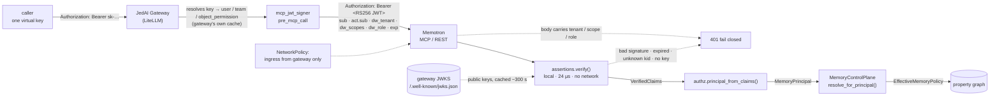

# Authorization model for API and MCP callers

**Issue:** [#27](https://github.disney.com/jedai/memotron/issues/27) · **Status:** **recommendation withdrawn 2026-08-28 — DW-014 governs** · Decision recorded as **DW-026** in `docs/authorization-decisions.md` · **Gates:** #12, #13

> ## ⚠ Read this before anything below it
>
> **This document's recommendation is withdrawn. It contradicted a decision that already existed.**
>
> The portal decision log's **DW-014 — "Programmatic identity resolves through the gateway's key
> API"** — written **2026-07-30**, two weeks before this document — already decided this question:
> identity resolves by a `/key/info` **self-lookup** against the gateway, cached by key hash under
> `MEMOTRON_IDENTITY_CACHE_TTL` (default 60 s) and failing closed, with the team id mapped to a
> tenant through Memotron's own tenant record (**DW-018**) and the key alias mapped to principal,
> role and scopes through that record's per-key registry.
>
> DW-014 explicitly **defers** the mechanism this document recommends: per-call signed assertions via
> the gateway's MCP JWT-signing guardrail are *"the named upgrade path if the identity contract needs
> hardening, never the baseline for the REST surface."*
>
> This document could not read the portal — see the last bullet of *Risks & open questions*, which
> states that plainly and says DW-014 would win in a conflict. It does, and it has.
>
> **Two specific errors, not just a difference of emphasis:**
> 1. The claim mapping below sources `dw_tenant` / `dw_scopes` / `dw_role` from *"team metadata only
>    an administrator can set."* **DW-018 rejects exactly that**, in both variants — a tenant claim in
>    team metadata (team admins are the use case's own owners) and in key metadata (team members hold
>    key create and update rights). On this platform such a claim is **self-asserted**, so the whole
>    claim-mapping table below is unusable as written.
> 2. This document treats a synchronous gateway dependency on the hot path as disqualifying. **DW-004
>    accepts it as a knowing platform-level cost**: *"the gateway sits on the retrieval hot path and
>    becomes an availability dependency."*
>
> **How to read the rest of this document.** Everything describing local assertion verification —
> the data flow, `assertions.py`, the claim mapping, units 1 and 2 — describes DW-014's **deferred
> upgrade path**, not the plan of record. It is retained because the upgrade may well be taken later,
> and because its measurements and its module survey are sound. The *problem statement*, the
> *role reconciliation*, and the *measurements* stand on their own and are unaffected. Implement from
> **DW-014 and DW-026**, not from the Recommendation this document originally carried.
>
> Also re-anchored to `split-models` on 2026-08-28: `config.py` is now a `config/` package, and line
> references throughout have been updated.

**Withdrawn recommendation, retained for the record:** one credential, no per-call gateway
dependency — the caller keeps a single LiteLLM virtual key, the gateway mints a short-lived RS256
assertion, and Memotron verifies it locally against the gateway's JWKS. Measured **24 µs** of
in-process verification against a **~140 ms** `/key/info` round trip. The cloud-readiness argument
below is still true as far as it goes, and is the reason this remains the named upgrade path rather
than a discarded idea — but it does not override DW-014, and it was never weighed against DW-018's
claim-provenance rule, which is the constraint that actually decides the claim source.

**The cloud-readiness argument, unchanged and still valid on its own terms.** The GKE + Postgres
target today has **no durable key manager** (`crypto.py` ships only `LocalKeyManager.from_file()` and
`.ephemeral()`, and nothing passes one through `storage/factory.py:74`), **no KMS provisioned in any
environment's terraform** (T2-8), **no Redis anywhere**, and **no `NetworkPolicy` in this chart or the
gateway's** (T3-4) — while `operationalStore.enabled` is `false` in the base chart and every overlay,
prod included, so every real environment currently runs the SQLite/in-memory substrate. Note what this
means for DW-014 rather than against it: the missing `NetworkPolicy` is the network guarantee **DW-004
depends on**, so #12 must deliver it, and the missing Redis means DW-014's identity cache is genuinely
per-pod across the API deployment's 2-to-6 replicas — a revocation-propagation fact worth stating in
the caller documentation. (T0-5 **is fixed** — `agent_memory.py:518` sets
`storage=storage_settings_from_env()`.)

---

## Problem

Every Memotron endpoint — 60 MCP tools across `mcp_server.py` and `agent_memory_mcp.py`, and the
whole `admin_server.py` surface — is reachable with **no inbound authentication**. `MemoryPrincipal`
exists (`src/memotron/config/_tenancy.py:109`) and `MemoryControlPlane.resolve_for_principal`
(`src/memotron/config/_control_plane.py:278`) already enforces tenant and scope against it, but
nothing derives one from a real identity: `admin_server.build_demo_principal`
(`src/memotron/admin_server.py:364`) is called **once at process start** (`admin_server.py:2996`)
and that single principal serves every request for the life of the pod. The MCP servers contain no
reference to `MemoryPrincipal` at all — tools take `scope_kind`/`scope_id` **as caller-supplied
arguments**, funnelled through `_scope()` (`mcp_server.py:234`), and pass them straight into the graph.

Observable consequence: any caller that can reach the workload reads and writes any tenant's memory.

The issue put two models on the table. The comment named the reason neither is comfortable: a single
credential is the better experience, but validating it means calling the gateway **in the hot path of
every memory read and write**, adding a synchronous dependency and gateway load that scales with
memory traffic rather than model traffic. This document takes the issue's fourth scope bullet
seriously — *"a signed token the gateway issues once and Memotron verifies locally with no call"* —
and finds it already exists as a first-class gateway feature.

## Data flow

A call resolving one credential to a tenant and scope, under the recommendation:



Two properties fall out of the shape. Memotron **never holds another caller's credential** — the
gateway replaces the virtual key with the assertion, so a compromised memory pod leaks no usable
gateway key. And Memotron **never asks anyone** who the caller is; the answer arrives with the
request, signed.

Before / after, on the hot path of one memory write:

```mermaid
flowchart TB
  subgraph now["now — merged code"]
    N1["memory_remember(scope_kind, scope_id, …)"] --> N2["graph write"]
    N2 --> N3["no identity checked anywhere"]
  end
  subgraph rejected["Model A — per-call gateway validation"]
    A1["memory_remember"] --> A2["POST gateway /key/info<br/>~140 ms, +1 gateway req per memory op"]
    A2 --> A3["MemoryPrincipal"] --> A4["control plane"] --> A5["graph write"]
  end
  subgraph target["recommended — locally verified assertion"]
    T1["memory_remember"] --> T2["verify RS256 locally<br/>24 µs, 0 gateway req"]
    T2 --> T3["MemoryPrincipal"] --> T4["control plane"] --> T5["graph write"]
  end
```



## System design

```mermaid
sequenceDiagram
  autonumber
  participant C as caller (agent / REST client)
  participant G as JedAI Gateway (LiteLLM)
  participant D as Memotron (MCP / REST)
  participant A as assertions.py
  participant Z as authz.py
  participant P as MemoryControlPlane (config.py)

  Note over D,A: pod start — JWKS fetched lazily, cached in process
  C->>G: tools/call memory_remember + virtual key
  G->>G: resolve key → user_id, team_id, team metadata
  alt key revoked / over budget / no MCP tool permission
    G-->>C: 401 / 403 — never reaches Memotron
  end
  G->>D: Authorization: Bearer <RS256 JWT>  (ttl_seconds)
  D->>A: verify(token)
  A->>A: kid → cached public key; RS256 + exp + iss + aud
  opt kid unknown and JWKS cache stale
    A->>G: GET /.well-known/jwks.json (once per rotation, not per call)
  end
  alt signature / exp / iss / aud invalid, or no key obtainable
    A-->>D: AssertionRejected / TrustAnchorUnavailable
    D-->>C: 401, typed error, fail closed
  end
  A-->>Z: VerifiedClaims
  D->>Z: reject_caller_supplied_claims(request body)
  Z-->>D: MemoryPrincipal (tenant + scopes from claims only)
  D->>P: resolve_for_principal(principal=…, scope=…)
  P-->>D: EffectiveMemoryPolicy  (or ValueError → 403)
  D-->>C: result
```

**Where each piece lives, and why there.**

| Module | Owns | Why there rather than elsewhere |
|---|---|---|
| `src/memotron/assertions.py` (new) | Turning a bearer token into `VerifiedClaims`, or refusing. Nothing about tenancy. | The only module that knows about signatures and trust anchors. Swapping the anchor (gateway → Entra, #23) is a constructor argument, not a code change. |
| `src/memotron/authz.py` (new) | Turning `VerifiedClaims` into a `MemoryPrincipal`, and refusing bodies that carry their own claims. | The claim→principal mapping is the one rule both planes of #13 must share. One module means the gateway plane and the Entra plane cannot drift. |
| `config/` `MemoryPrincipal` / `MemoryControlPlane` | Unchanged. Already the authority on tenant + scope authorization (`config/_control_plane.py:295-301`). | Extend what already owns the concern. This design adds a *source* of principals, not a second authorizer. |
| `mcp_server.py`, `agent_memory_mcp.py`, `admin_server.py` | One call each to the `authz` seam per request. | Composition. The gate wraps the tool; it is not threaded through it. |

`assertions.py` **wraps** `jwt.PyJWKClient` — verified installed signature
`PyJWKClient(uri, cache_keys=False, max_cached_keys=16, cache_jwk_set=True, lifespan=300, headers=None, timeout=30, ssl_context=None)`
— rather than parsing JWS by hand. `pyjwt 2.13.0` (current release) is **already installed** as a
transitive dependency of `mcp 1.29.0`; `cryptography>=50.0.0` is already a direct dependency
(`pyproject.toml:8`), so `RS256` is present today (verified: `jwt.algorithms.get_default_algorithms()`
contains `RS256`). The only dependency change is promoting it to a direct pin.

**Both planes, one rule.** #13 needs a `MemoryPrincipal` from two identity sources. This design makes
them the same mechanism with different trust anchors, so neither plane pays a synchronous call:

| Plane | Anchor | Issuer | Verified how |
|---|---|---|---|
| Programmatic — MCP + versioned REST (#12) | gateway JWKS `https://latest.jedai-gateway.wdprapps.disney.com/.well-known/jwks.json` | gateway | local RS256, cached keys |
| Browser — admin UI (#23, consumed by #13) | Entra JWKS for the app registration | `login.microsoftonline.com/{tenant}/v2.0` | local RS256, cached keys |

## Contracts

| Symbol | Signature | Behaviour |
|---|---|---|
| `VerifiedClaims` | frozen dataclass — `subject: str`, `tenant_id: str`, `scope_keys: frozenset[str]`, `default_scope_key: str \| None`, `role: PrincipalRole`, `issuer: str`, `expires_at: datetime` | Carries only claims that survived signature verification. Never retains the raw token. |
| `AssertionVerifier` | `Protocol` — `verify(self, token: str) -> VerifiedClaims` | The seam. One implementation per trust anchor; tests substitute a fake. |
| `JwksAssertionVerifier` | `(jwks_uri: str, issuer: str, audience: str, *, key_cache_seconds: int = 300, leeway_seconds: int = 30) -> JwksAssertionVerifier` | RS256 only — `algorithms=["RS256"]` is pinned, never read from the token header. Requires `exp`; verifies `iss` and `aud`. |
| `principal_from_claims` | `(VerifiedClaims) -> MemoryPrincipal` | Deterministic mapping onto the existing model (`config/_tenancy.py:109`). Never touches the request body. |
| `principal_from_headers` | `(Mapping[str, str], AssertionVerifier) -> MemoryPrincipal` | Reads exactly one header (`authorization`, else `x-litellm-api-key`). No header → `AssertionMissing`. |
| `reject_caller_supplied_claims` | `(Mapping[str, Any]) -> None` | Raises `CallerSuppliedClaim` if the body carries `tenant_id`, `principal_id`, `allowed_scope_keys`, `role`, or `default_scope`. Satisfies #13's "a caller that puts a tenant or scope claim in its request body is rejected rather than trusted". |
| `AuthorizationError` | base; subclasses `AssertionMissing`, `AssertionRejected`, `TrustAnchorUnavailable`, `CallerSuppliedClaim` | Each carries a stable machine-readable `code`. Every one maps to 401 except `CallerSuppliedClaim` → 400. Gives #13 its typed errors on this surface. |

**Claim mapping.** The caller supplies none of these; the gateway sets them from team metadata only
an administrator can edit.

| Claim | Emitted by | Maps to |
|---|---|---|
| `sub` | signer, from `end_user_claim_sources` (default `user_id`) | `MemoryPrincipal.principal_id` |
| `act.sub` | signer, team/org id (RFC 8693 delegation) | cross-checked against `dw_tenant`; mismatch → `AssertionRejected` |
| `dw_tenant` | `add_claims`, from team metadata | `MemoryPrincipal.tenant_id` |
| `dw_scopes` | `add_claims`, space-separated `kind:id` keys | `MemoryPrincipal.allowed_scope_keys` |
| `dw_default_scope` | `add_claims` | `MemoryPrincipal.default_scope` |
| `dw_role` | `add_claims` — `user` \| `operator` \| `admin` | `MemoryPrincipal.role`; absent or unrecognised → `PrincipalRole.USER`, never a higher role |
| `iss`, `aud`, `exp`, `nbf`, `iat` | signer | verified, then discarded |
| `scope` | signer, auto-generated per tool | **ignored for tenancy.** Recorded for audit only — gateway tool permissions are enforced at the gateway. |

**Gateway-side configuration this depends on** (owned by the gateway team, per #12's last scope bullet):

```yaml
guardrails:
  - guardrail_name: memotron-assertion
    litellm_params:
      guardrail: mcp_jwt_signer
      mode: pre_mcp_call
      default_on: true
      issuer: "https://latest.jedai-gateway.wdprapps.disney.com"
      audience: "memotron"
      ttl_seconds: 60            # default 300; 60 shortens the revocation window
      required_claims: ["dw_tenant", "dw_scopes"]
```
plus `MCP_JWT_SIGNING_KEY` sourced from Vault. Without it LiteLLM keeps the keypair **in memory and
rotates it on every restart**, which would 401 every in-flight caller on a gateway rollout.

### Role reconciliation — #13's premise is wrong

#13 says "the design names **three** roles … while the code's role type carries **two** values, user
and administrator." The code already carries three: `PrincipalRole` at `config/_tenancy.py:103` is
`USER = "user"`, `OPERATOR = "operator"`, `ADMIN = "admin"`. There is no missing value. The real gap
is that **`OPERATOR` is never checked** — `resolve_for_principal` (`config/_control_plane.py:295`)
branches only on `role != ADMIN`, so an operator is authorized exactly like an end user. #13's work is enforcing
`OPERATOR`, not extending the enum. Mapping for both planes: end user → `USER`, tenant administrator
→ `ADMIN`, platform operator → `OPERATOR`.

## Measurements

Taken 2026-08-13 on an M4 workstation over VPN. Scripts were throwaway; nothing is committed.

| What | Method | Result |
|---|---|---|
| Local RS256 verify (2048-bit, 833-byte token) | 20,000 iterations, `cryptography` 50.x as installed | **p50 24.1 µs, p99 30.8 µs**, 41,513 verify/s single core |
| Gateway `POST /key/info`, warm, connection reused | 15 requests over 3 pooled connections | **p50 ~140 ms**, range 117–275 ms |
| Same, cold connection (TLS handshake) | first request per connection | 310–504 ms; one outlier **3.24 s** |
| Ratio, per memory operation | — | **~5,800× at p50** |
| Deployed gateway `GET /.well-known/jwks.json` | unauthenticated | **HTTP 200, `{"keys":[]}`** |
| Deployed gateway `GET /health/readiness` | unauthenticated | `{"status":"healthy","db":"connected"}` — no version field exposed |
| Deployed gateway `GET /key/info` unauthenticated | — | 401, typed error body |

**Re-measured 2026-08-28** (same workstation-over-VPN caveat; `http.client`, one persistent
connection, 25 requests after a warm-up):

| What | Result |
|---|---|
| ADMIN host `GET /key/info`, **admin** key, reused connection | p50 **133 ms**, p95 139 ms (first call incl. TLS 522 ms) |
| ADMIN host `GET /key/info`, **non-admin scoped** key, reused connection | p50 **131 ms**, p95 **461 ms** |
| DATA-PLANE `GET /v1/models`, reused connection | p50 154 ms, p95 166 ms |
| DATA-PLANE `/key/info`, `/user/info`, `/team/info` (valid key) | **403** `Management routes are disabled for this instance.` — including `?key=<self>` |
| ADMIN host `/key/info` with a **non-admin** key | **200**, returns own `metadata` incl. `dw_tenant` / `dw_scopes` / `dw_role` |
| Non-admin key → `/key/generate`, `/key/update` | **401** *"Only proxy admin can be used to…"* — claims cannot be forged |
| `GET /.well-known/jwks.json`, both hosts | **still `{"keys":[]}`**, HTTP 200 |
| Control arm, every probe: no `Authorization` header | 401 — so no 200 above is attributable to an open route |

The p50 figures reproduce the original ~140 ms within noise, by an independent script, which is the
main reason the latency argument is left standing rather than re-litigated. Note the non-admin key's
**p95 of 461 ms** — three times the admin key's — which makes Model A′'s tail worse than the median
suggests.

Two of those matter more than the latency ratio.

**The JWKS route already answers 200 on the LATEST gateway with an empty key set.** The signer
mechanism is present in the deployed build and is unconfigured, not unavailable — the remaining work
is a guardrail block and a Vault-sourced signing key, not a version upgrade.

**Sharpened 2026-08-28, from the source rather than by inference.** All gateway-source references in
this document were re-read on the gateway repo's **default branch `develop`** at `a9cdc23834`
(2026-08-25). An earlier pass read `main`, which is **2017 commits behind** and dated 2026-06-30;
every gateway line number below is from `develop`. The gateway repo *is* a fork of LiteLLM
(`gateway/pyproject.toml:2` `name = "litellm"`, **version `1.95.0`** — not 1.90.0, which was the stale
`main` figure), and the guardrail is in it:
`litellm/proxy/guardrails/guardrail_hooks/mcp_jwt_signer/mcp_jwt_signer.py`, **926 lines**, with tests
at `tests/test_litellm/proxy/guardrails/test_mcp_jwt_signer.py`. So capability is established by
reading the code, not by endpoint presence, and the earlier version caveat is moot. Its docstring also states
that when `MCP_JWT_SIGNING_KEY` is unset it **auto-generates an RSA-2048 keypair at startup** — which
means `{"keys":[]}` cannot mean "the signing key is unset." It means **the guardrail is not configured
at all**, i.e. no `guardrails:` block names it. That is a sharper and more actionable diagnosis than
the original: the ask of the gateway team is the guardrail block *first*, with the Vault-sourced key as
the follow-on that stops the keypair rotating on every restart.

**Per-call validation does not actually buy fast revocation.** LiteLLM's own virtual-key
authentication is cache-backed. **Corrected 2026-08-28** (read on `develop` @ `a9cdc23834`): the code
default for `general_settings.user_api_key_cache_ttl` is **60 s**, not 300 s —
`gateway/litellm/proxy/proxy_server.py:1400`, `in_memory_cache_ttl = 60  # 1 min ttl` — and the key is
**not set** in the deployed `proxy_server_config.yaml`, so 60 s applies. `enable_redis_auth_cache` — a
**JedAI fork addition**, not upstream — exists in the code but is **absent from the deployed config and
from every `.helm/values-*.yaml`**, so `user_api_key_cache` is **per-pod in-memory with no
cross-replica sharing**; `/key/delete` clears only the calling pod's copy
(`gateway/litellm/caching/dual_cache.py:469`). So a `/key/info` answer can be up to 60 s stale,
and the gateway's own revocation is itself "eventually, within ~60 s, per pod, unshared." Model A pays
~140 ms on every memory read and write to receive an answer with the same staleness the recommendation
accepts deliberately. The hot-path cost is real; the revocation benefit it is supposed to buy is
largely illusory. A corollary worth stating: **Memotron cannot be held to a revocation SLA stricter
than the gateway itself provides.**

**Caveat, stated plainly:** 140 ms is workstation-over-VPN, not pod-to-gateway inside the cluster.
The in-cluster figure will be far lower and must be re-measured from a LATEST pod before this is
called closed (it is a "done when" item). It does not change the recommendation — an in-cluster 5 ms
is still ~200× the local verify, still a synchronous dependency that can time out, and still load on
the gateway that grows with memory traffic. The argument rests on the dependency, not the milliseconds.

## Revocation and unavailability

The issue's acceptance criteria require both of these written down.

**Revocation delay ≤ assertion TTL + gateway key-cache TTL.** With `ttl_seconds: 60`, a revoked key
stops working within **~120 s** worst case: the gateway stops minting assertions for it, and the last
one it minted expires. Recommend telling callers **2 minutes**. **Corrected 2026-08-28:** because the
gateway's `user_api_key_cache_ttl` default is 60 s rather than 300 s, ~120 s holds on **current
defaults** — no configuration change is required of the gateway team for this number, which removes an
ask the earlier draft made. The residual caveat is that the gateway's cache is per-pod and unshared,
so 60 s is per pod rather than fleet-wide. There is no
revocation *push* to build or subscribe to — expiry is the mechanism, which is why the TTL is the
number that matters. Immediate lockout, when an incident needs it, is the #12 NetworkPolicy plus
scaling the caller's route to zero at the gateway, not a Memotron code path.

**Gateway unavailable.** Memotron makes no gateway call to serve a request, so a gateway outage
does not fail memory operations for callers holding a valid unexpired assertion — an availability
*improvement* over Model A, where every memory operation fails when the gateway is down. In-flight
requests already past verification complete normally. Requests arriving with an expired assertion get
401: the gateway is the only thing that can mint a fresh one. If a `kid` is unknown *and* the JWKS
cache is cold or stale, `TrustAnchorUnavailable` → **401, fail closed**; the service never guesses,
and never falls back to trusting an unsigned header.

## Units

Each unit leaves the repo green. `pyproject.toml` gains `pyjwt[crypto]>=2.13.0` in unit 1 — the only
dependency change in the whole design.

**Unit 1 — verify a signed assertion.** Module: **`src/memotron/assertions.py`** (new). Owns #27.
- **in** bearer token string; verifier configured with `jwks_uri`, `issuer`, `audience`
- **out** `VerifiedClaims`, or `AssertionRejected` / `TrustAnchorUnavailable`
- **unit** locally generated RSA keypair signs tokens; assert accept on a good token, and reject on each of: wrong key, `alg: none`, `alg: HS256` with the public key as the HMAC secret, expired `exp`, absent `exp`, wrong `iss`, wrong `aud`, unknown `kid`, `dw_tenant` disagreeing with `act.sub`. JWKS served from an in-process `http.server` fixture; assert it is fetched **once** across 100 verifications, and that a fetch failure with a cold cache raises `TrustAnchorUnavailable` rather than returning claims
- **int** a fake gateway that mints real RS256 tokens and publishes a real JWKS; a full `memory_search` MCP call succeeds, then the same token fails after `exp` passes with the clock advanced
- **done** `rg -n "algorithms=" src/memotron/assertions.py` shows `["RS256"]` and nothing read from the token header

**Unit 2 — claims to principal.** Module: **`src/memotron/authz.py`** (new). Owns #27, consumed by #12 and #13.
- **in** `VerifiedClaims`; separately, a request header mapping plus an `AssertionVerifier`; separately, a request body mapping
- **out** `MemoryPrincipal`; `AssertionMissing` when no header; `CallerSuppliedClaim` when the body carries `tenant_id` / `principal_id` / `allowed_scope_keys` / `role` / `default_scope`
- **unit** claims → principal for each of the three roles; unknown and absent `dw_role` both yield `USER`; `dw_scopes` parses to the exact `allowed_scope_keys` set; a body carrying each forbidden key raises; verifier substituted by a fake returning canned claims — no network, no gateway
- **int** the resulting principal drives `MemoryControlPlane.resolve_for_principal` (`config/_control_plane.py:278`) — an in-claim scope resolves, an out-of-claim scope raises, and an `ADMIN` claim reaches a tenant scope it was not granted (documenting the existing bypass at `config/_control_plane.py:295`)
- **done** `rg -n "tenant_id|allowed_scope_keys" src/memotron/authz.py` shows them assigned only from `VerifiedClaims`

**Unit 3 — gate the agent memory MCP surface.** Module: **`src/memotron/agent_memory_mcp.py`**. Owns #12.
- **in** an MCP tool call over streamable HTTP carrying `Authorization: Bearer <JWT>`; headers reached via `ctx.request_context.request` — verified present as a field of `RequestContext` in the installed `mcp 1.29.0`
- **out** every one of the 27 tools executes against a per-request `MemoryPrincipal`; missing or bad assertion returns a typed MCP error, no graph access
- **unit** one representative read (`memory_search`) and one write (`memory_remember`) with a fake verifier: assert the tool receives a principal whose `tenant_id` came from the claim and **not** from any tool argument
- **int** in-process FastMCP over HTTP with a fake gateway signer — unauthenticated call refused, authenticated call succeeds, and a call whose arguments name another tenant's scope is refused by the control plane
- **done** `rg -c "@mcp.tool" src/memotron/agent_memory_mcp.py` equals the count of tools reached through the gate

**Unit 4 — gate the full-SDK MCP surface.** Module: **`src/memotron/mcp_server.py`**. Owns #12. Same shape as unit 3 across its 33 tools. Separate unit because it is a separate module; it reuses unit 2's seam and adds no new contract.

**Unit 5 — per-request principal on the management surface.** Module: **`src/memotron/admin_server.py`**. Owns #13.
- **in** an HTTP request to the stdlib `BaseHTTPRequestHandler` (`MemoryGraphHandler`, `admin_server.py:1020`) with an assertion header
- **out** the principal is derived **per request** and `build_demo_principal` (`admin_server.py:364`) plus the process-wide `handler.principal` assignment (`admin_server.py:2996`) are deleted; unauthenticated request → 401 with a typed body
- **unit** the handler's auth gate in isolation with a fake verifier: valid header → principal; absent → 401; body carrying `tenant_id` → 400
- **int** extend `tests/test_control_plane.py:492`'s real-`HTTPServer` pattern — unauthenticated `urlopen` gets 401, a valid assertion resolves the correct tenant, and one tenant's assertion cannot read another's scope
- **done** `rg -n "build_demo_principal" src/memotron/` returns no matches outside tests

Units 1 and 2 are the whole of #27's implementation and are what unblock the other two issues: #12
implements units 3 and 4, #13 implements unit 5 and the role enforcement above. No unit touches
the `config/` package.

## Done when

- `uv run pytest -x -q` exits 0
- `uv run pytest -q tests/test_assertions.py tests/test_authz.py` exits 0
- `rg -n "algorithms=\[\"RS256\"\]" src/memotron/assertions.py` returns a match, and `rg -n "verify=False|verify_signature.*False|options=\{\"verify" src/memotron/` returns no matches
- `rg -n "build_demo_principal" src/memotron/` returns no matches
- `rg -n "key/info|/key/info" src/memotron/` returns no matches — the absence being asserted is that **no per-call gateway lookup exists anywhere in the request path**
- `rg -n "LITELLM_MASTER_KEY|master_key" src/memotron/` returns no matches — Memotron holds no gateway admin credential
- `uv run python -c "import memotron.authz as a; print(a.principal_from_claims.__doc__)"` succeeds, i.e. the seam is importable without a gateway present
- A LATEST pod reports a measured in-cluster p50 for `POST /key/info`, recorded on this PR, confirming the latency argument with a same-network number
- The gateway team has confirmed `mcp_jwt_signer` is enabled, `MCP_JWT_SIGNING_KEY` is Vault-sourced, and `GET /.well-known/jwks.json` returns a non-empty `keys` array on LATEST
- The stated revocation delay (≤120 s) and the gateway-unavailable behaviour are written into the API documentation for callers
- ~~This document is merged and recorded in the design's decision log~~ — **done 2026-08-28**: merged
  via PR #44 (the standalone PR #37 was closed, not merged), and recorded as **DW-026** in
  `docs/authorization-decisions.md`. That file is the working copy in the DW-001..DW-025 house style;
  it still has to be **pasted onto the portal's Decision Log page** to become the record

## Goal

```
/goal uv run pytest -x -q exits 0; uv run pytest -q tests/test_assertions.py
tests/test_authz.py exits 0; rg -n 'algorithms=\["RS256"\]'
src/memotron/assertions.py returns a match; rg -n "key/info"
src/memotron/ returns no matches; rg -n "build_demo_principal"
src/memotron/ returns no matches outside tests; rg -n "master_key"
src/memotron/ returns no matches; and uv run python -c "import
memotron.authz" exits 0. Constraints: no file outside
src/memotron/assertions.py, src/memotron/authz.py,
src/memotron/mcp_server.py, src/memotron/agent_memory_mcp.py,
src/memotron/admin_server.py, pyproject.toml, and tests/ is modified;
the config/ package is not modified; the only added dependency is pyjwt[crypto]; no
test is skipped, xfailed, or deleted to reach green. Stop after 28 turns.
```

## Rejected

> **This whole rejection is withdrawn (2026-08-28).** Per-call self-lookup is the **chosen baseline**
> under DW-014, not a rejected option — see the banner at the top of this document. The paragraph is
> retained because two of its factual corrections are load-bearing and still true (self-lookup needs no
> admin credential; the gateway's own cache TTL is 60 s), and because its cost analysis is the honest
> statement of what DW-014 knowingly accepts. Read it as *"the costs of the chosen model"*, not as
> grounds against it.

**Model A — LiteLLM virtual keys validated per call.** The single credential is right and this design
keeps it; the per-call validation is what loses. It puts a synchronous network dependency in the hot
path of every memory read and write (measured ~140 ms workstation, unmeasured in-cluster), makes a
gateway outage a total memory outage, and adds gateway load proportional to memory traffic — the
exact concern in the issue comment. It buys almost nothing for it: the gateway's own answer is cached
for up to `user_api_key_cache_ttl` (**60 s** on current defaults — corrected 2026-08-28), so the
"fresh" answer is as stale as an assertion.

**Corrected 2026-08-28 — this paragraph previously rested on a false premise.** The earlier draft
argued that because `/key/info` "is documented only with the **master key**", Model A would require
Memotron to hold a gateway admin credential — "a blast radius no memory pod should have." **That is
not the case.** Self-lookup by a non-admin key is supported
(`gateway/litellm/proxy/management_endpoints/key_management_endpoints.py:6245`,
`_can_user_query_key_info` returns true when the queried key is the caller's own), and it was
**verified live on LATEST**: a
freshly minted, provably non-admin virtual key (`/key/list` → 403) called `GET /key/info` on the admin
host and received 200 plus its own `metadata`, carrying `dw_tenant`, `dw_scopes` and `dw_role`. The
same key was refused on `/key/generate` and `/key/update` — *"Only proxy admin can be used to
generate, delete, update info for new keys/users/teams"* — so a caller cannot forge its own claims,
which independently satisfies DW-014's rule. Model A therefore needs **no** admin credential.

What Model A actually loses on is the dependency, and one part of it is worse than the issue assumed:
management routes are **hard-disabled on the data plane**. The mechanism, on `develop`: the base chart
sets `DISABLE_ADMIN_ENDPOINTS: "true"` for all roles (`gateway/.helm/values.yaml:268`); the **admin**
role overrides it to `"false"` (`gateway/.helm/values-latest.yaml:99`, inside `roles.admin`); the
**worker** role sets no override and so inherits `"true"`.
`is_management_routes_disabled()` in `enterprise/litellm_enterprise/proxy/auth/route_checks.py` turns
that into `403 "Management routes are disabled for this instance."` — observed live on the LATEST data
plane, including the `?key=<self>` form, which is the independent confirmation that the inherited
`"true"` is what is actually deployed.
So every validation must cross to a **separately scaled, admin-only deployment** — a second hop, a
second blast radius, and load on a fleet shared by every JedAI product and sized for inference rather
than memory-CRUD traffic. Forecloses: an independently available memory service.

**Model A′ — Model A with a bounded cache.** The honest version of Model A, and the one the issue
anticipated ("caching the lookup helps, but weakens revocation"). It converges on the recommendation's
revocation properties while keeping every one of its costs: a cold cache still blocks on the gateway,
a cache miss on a new pod still adds a network hop, and there is no shared cache to miss into —
`redis` and `valkey` appear nowhere in the repo, `.helm/values-latest.yaml` provisions none, and the
API deployment runs `replicaCount: 2` with `autoscaling.maxReplicas: 6`, so every scale-up event
means another cold cache. Building a first cache layer to approximate a property that a signed
expiry gives for free is the wrong trade. Forecloses: nothing — it is simply strictly worse.

**Status changed 2026-08-28: A′ is retained as the named contingency, not rejected outright** (DW-026).
It is now known to be buildable without an admin credential (see the Model A correction above), and
with the Aug 17 target passed and the gateway dependency unmoved, it is the fallback that ships if the
gateway team cannot commit a date. Its costs are unchanged and are accepted knowingly in that branch.

**Model B — AuthZ / Launchpad client id + secret alongside the gateway key.** Correct enterprise
shape, and it does remove the per-call dependency (a JWT is verified locally). It loses on cost, not
correctness: every integrator manages two secrets on two lifecycles, two revocation paths, and two
places to get it wrong, and Memotron becomes the one platform service where a gateway key is not
sufficient. It also splits audit — spend and rate limits land against the gateway key while
authorization decisions reference a Launchpad client, so no single record answers "what did this
caller do". The recommendation gets Model B's local verification *without* the second credential,
because the gateway is already the thing that resolved the first one. Forecloses: the one-key
promise across the platform.

**Trusting the gateway's unsigned identity headers.** LiteLLM forwards `x-litellm-user-id`,
`x-litellm-user-role` and similar. Zero-cost and tempting, and the NetworkPolicy in #12 arguably
makes it sound. Rejected because it makes tenancy depend entirely on a network control with no
defence in depth: one misconfigured ingress, one sidecar, one port-forward and any caller asserts any
tenant. LiteLLM's own documentation declines to endorse it — downstream services "should authenticate
requests against their own session, not solely relying on these headers" — and the zero-trust page
states the problem directly: MCP servers "have no built-in way to verify that a request actually came
through LiteLLM." A signature costs 24 µs and removes the network from the trust argument. Forecloses:
any later story where Memotron is reachable from more than one path.

**Verifying Disney AuthZ tokens directly against the JWKS the gateway already trusts.** Added
2026-08-28; the earlier draft did not consider it. The gateway **already** validates inbound JWTs from
Disney's own AuthZ platform in every environment — `enable_jwt_auth: True`
(`gateway/proxy_server_config.yaml:1164`) with a full `litellm_jwtauth` block following it, and
`JWT_PUBLIC_KEY_URL` pointing at `https://authorization.go.com/jwks` in prod, with LATEST trusting both
`https://stg.authorization.go.com/jwks` and Entra (`gateway/.helm/values-latest.yaml:54`); the variable
takes a comma-separated list, so multi-issuer is already in production use. Memotron could verify the same tokens against the same JWKS, locally, with no
per-call dependency. Rejected for now, on cost not correctness: unless AuthZ issues such a token
transparently to a *service* caller, the integrator is back to holding two credentials and this
collapses into Model B. It also inherits a documented, unfixed identity mismatch — with
`user_id_jwt_field: "email"` — which is exactly what is configured
(`gateway/proxy_server_config.yaml:1168`) — the JWT-derived `user_id` diverges
from the canonical `LiteLLM_UserTable.user_id` (`gateway/docs/jwt-userid-mismatch-byok-bug.md`;
**ASSUMED still unfixed** — taken from that document, not re-verified live). Worth revisiting if AuthZ
gains transparent service-identity issuance, because it would drop the gateway-team dependency
entirely. Forecloses: nothing.

**Memotron minting its own tokens after a first gateway validation.** Session tokens issued by
Memotron on first use. Rejected: Memotron becomes an identity provider, owning signing keys,
rotation, and a session store it has no other reason to have — and it still needs the first gateway
call. The gateway already signs; taking that job is duplication.

## Risks & open questions

**Needs a decision from a human before implementation starts:**

1. **Gateway configuration is a hard dependency on another team.** The recommendation cannot ship
   without the gateway team enabling the `mcp_jwt_signer` guardrail, sourcing `MCP_JWT_SIGNING_KEY`
   from Vault, and populating `dw_tenant` / `dw_scopes` / `dw_role` via `add_claims` from team
   metadata. `#12`'s last scope bullet already names that conversation; this design tells it exactly
   what to ask for. **Updated 2026-08-28: the Aug 17 target has passed with this dependency unmoved**
   — `GET /.well-known/jwks.json` still returns `{"keys":[]}` on both hosts, 15 days after the first
   measurement. So this is no longer a condition waiting to occur; the trigger is now a **date the
   gateway team commits to**, and absent one, Model A′ ships (DW-026). Two corrections to the original
   fallback sentence: the ask is the **guardrail block first** (an empty key set means the guardrail is
   unconfigured, not that a key is missing), and "behind the NetworkPolicy" is not available — **no
   `NetworkPolicy` exists in this chart or the gateway's** (T3-4), so A′ would ship without that
   defence in depth. Someone should ask before unit 1 starts.
2. ~~**Licensing is unverified.**~~ **RESOLVED 2026-08-28, on both counts.** The guardrail module
   carries **no premium gate** — a grep for `premium_user|enterprise|license|CommonProxyErrors` in
   `mcp_jwt_signer.py` returns nothing — **and** an enterprise entitlement is held (confirmed by Ryan),
   consistent with `litellm-enterprise==0.1.52` (`gateway/pyproject.toml:66`, on `develop`) and
   `litellm_license: os.environ/LITELLM_LICENSE` in `general_settings`. Capability is likewise
   established by reading the forked source, not inferred from endpoint presence. **Consequence: the
   only surviving risk on this recommendation is the gateway team's configuration work** — which
   narrows the contingency's justification to schedule alone, not feasibility.
3. **The programmatic REST plane has no signing hook.** `mcp_jwt_signer` runs `pre_mcp_call` — MCP
   only. #12 also puts the versioned REST surface behind gateway pass-through routes, and pass-through
   has `forward_headers` but no signer. Three ways out, and this needs a call: ask the gateway team to
   apply signing to the Memotron pass-through route; or keep programmatic *memory* traffic on the
   MCP plane for 3.08 and expose only management routes over REST, authenticated by Entra per #23; or
   accept Model A′ on the REST plane alone. **Recommendation: the second** — it ships on time and
   creates no second trust path — but it narrows what #12 delivers in LATEST and that is not mine to
   decide.
4. **Accepted revocation delay.** This design proposes ≤120 s and asks the gateway team for
   `user_api_key_cache_ttl: 60`. If security requires tighter, `ttl_seconds` can go lower at the cost
   of more signing work per call on the gateway; below ~15 s the model stops making sense.

**Hard to verify / residual risks:**

- **In-cluster latency is unmeasured.** Every number here is from a workstation over VPN. The
  recommendation does not depend on the magnitude, but the issue's acceptance criteria do, so a
  LATEST-pod measurement is a "done when".
- **Signing key rotation on gateway restart.** With `MCP_JWT_SIGNING_KEY` unset LiteLLM holds the
  keypair in memory and rotates on restart, so a gateway rollout would 401 every unexpired assertion.
  `{"keys":[]}` today means it is unset today. This is the single most likely operational failure.
- **Clock skew** between gateway and memory pods eats into a 60 s TTL. `leeway_seconds: 30` covers
  ordinary NTP drift; a badly skewed node fails closed, which is correct but looks like an auth bug.
- **`ADMIN` bypasses the scope check** entirely today (`config/_control_plane.py:295-301`). Once `dw_role` is
  claim-driven, a mis-set team metadata value grants tenant-wide read. #13 should consider whether
  `ADMIN` should bypass scope authorization at all, or only widen it to registered scopes.
- **`scope_kind` / `scope_id` remain tool arguments** on all 60 MCP tools. Units 3-5 make the control
  plane authorize them against the claim, but the arguments stay in the schema. Retiring them in
  favour of claim-derived defaults is a versioning change and belongs to #13's tool-naming policy.
- **RESOLVED 2026-08-28, and it fired.** This bullet was right, and it is the reason this document now
  carries a withdrawal banner. The portal pages are readable from the **portal repo source** at
  `~/repos/jedai/portal` — `src/content/docs/solution_engineering/agent-memory/decision-log.mdx` and
  `.../engineering/access-control.mdx`, both last changed in `24515dd` (2026-07-30) — no SSO required.
  Reading them showed DW-014 had already decided this question against this document's recommendation,
  and DW-018 had already rejected its claim source. **Lesson worth keeping: check the portal repo, not
  the rendered site.** Future design work on this component should read the source tree first; a design
  written blind to the decision log cost two weeks of a wrong plan of record sitting merged in-repo.

- ~~**The internal design portal could not be read.**~~ `latest.jedai-portal.wdprapps.disney.com` requires
  Entra SSO and is not fetchable from this session, so DW-014, the access-control page, and the
  security-and-compliance page were taken **only** as quoted in #12, #13, and #27. `DW-0` appears
  nowhere in the repository. If DW-014 says something this design contradicts, DW-014 wins and this
  needs revisiting — worth one reviewer checking that page against the claim mapping above.
